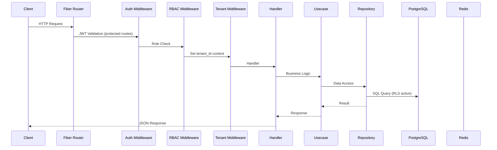
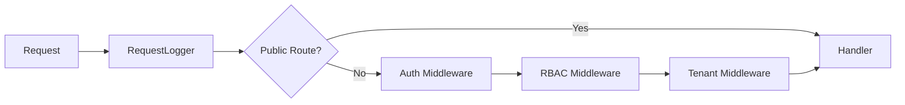
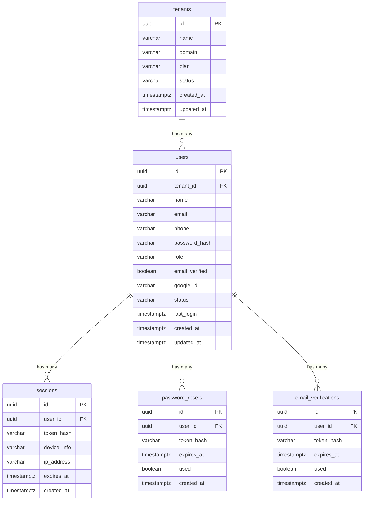
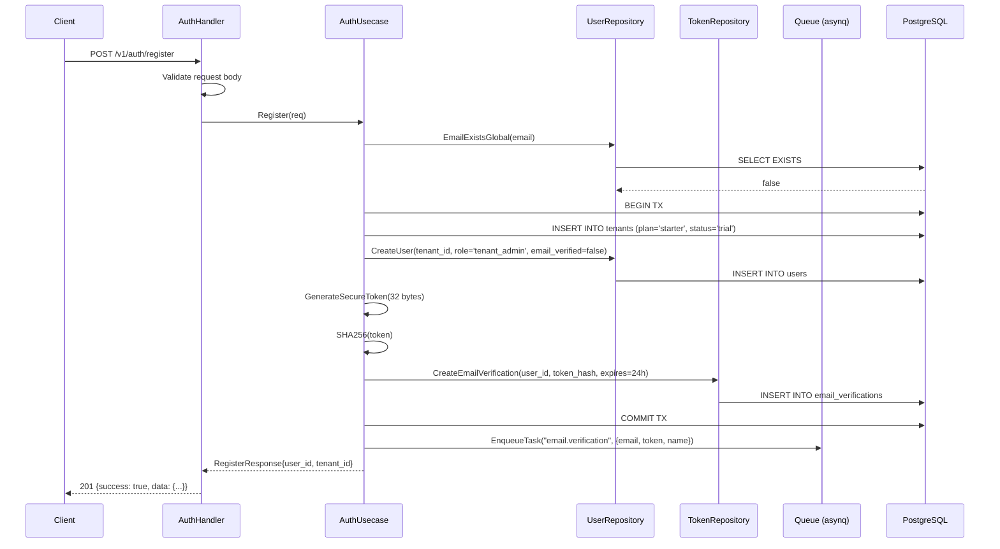
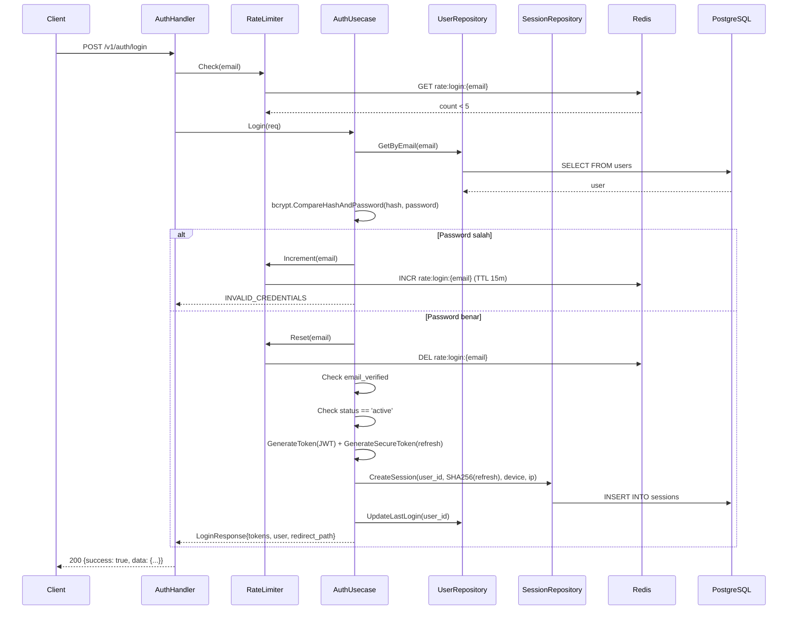
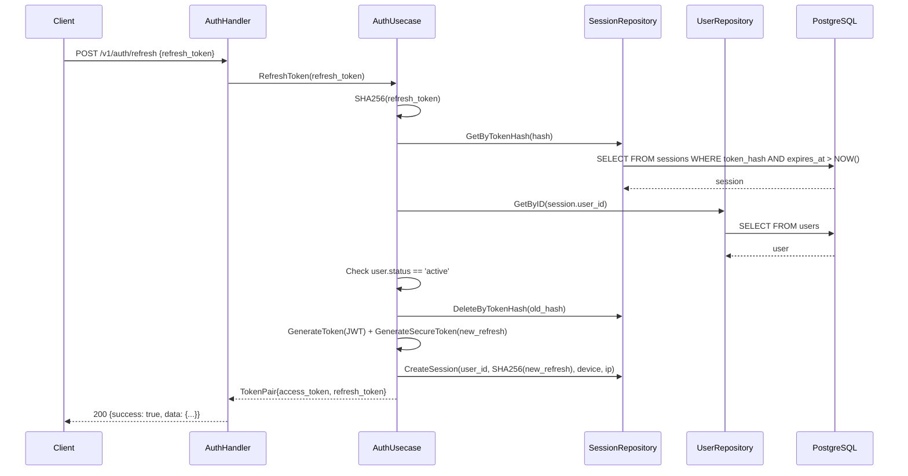
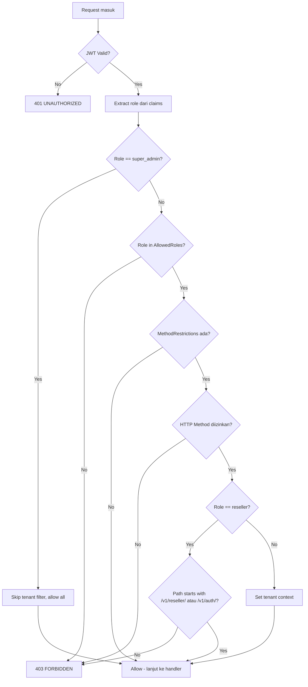

# Design Document — Authentication & Role-Based Access Control (ISPBoss)

## Overview

Dokumen ini mendeskripsikan desain teknis untuk sistem autentikasi dan RBAC di ISPBoss. Auth diimplementasikan sebagai modul di dalam **billing-api** service (bukan service terpisah), mengikuti clean architecture yang sudah ada: domain → usecase → repository → handler.

### Keputusan Arsitektur Utama

| Keputusan | Pilihan | Alasan |
|---|---|---|
| Lokasi auth | Di dalam billing-api | Sesuai arsitektur diagram, auth adalah bagian dari billing-api |
| Password hashing | bcrypt (cost 10) | Standar industri, built-in di Go stdlib |
| Token storage | SHA-256 hash di DB | Plaintext token hanya dikirim ke user, DB hanya simpan hash |
| Rate limiting | Redis-based per email | Cepat, TTL otomatis, tidak perlu cleanup |
| Session storage | PostgreSQL `sessions` table | Konsisten dengan data lain, queryable untuk audit |
| JWT signing | HS256 via pkg/auth | Sudah ada di codebase, cukup untuk single-issuer |
| SQL generation | sqlc | Sudah dipakai untuk customers dan tenants |
| Validation | go-playground/validator | Sudah ada di go.mod arsitektur |
| Google OAuth | Verify id_token server-side | Frontend kirim id_token, backend verify via Google public keys |

### Integrasi dengan Kode Existing

- **pkg/auth**: Digunakan langsung untuk `GenerateToken` dan `ValidateToken`. Perlu ditambah field `ImpersonatorID` di Claims.
- **pkg/tenant**: Middleware tenant context tetap dipakai untuk endpoint yang butuh tenant isolation.
- **pkg/database**: `WithTenant` dipakai di repository layer untuk set RLS context.
- **pkg/queue**: `EnqueueTask` dipakai untuk kirim email verification dan password reset ke notification service.
- **pkg/logger**: zerolog dipakai untuk audit logging.

---

## Architecture

### Request Flow



### Public vs Protected Routes

```
/healthz                    → Public (no auth)
/readyz                     → Public (no auth)
/swagger/*                  → Public (no auth)

/api/v1/auth/register       → Public (no auth)
/api/v1/auth/login          → Public (no auth, rate limited)
/api/v1/auth/google         → Public (no auth)
/api/v1/auth/verify-email   → Public (no auth)
/api/v1/auth/resend-verification → Public (no auth, cooldown)
/api/v1/auth/forgot-password → Public (no auth)
/api/v1/auth/reset-password  → Public (no auth)

/api/v1/auth/me             → Protected (JWT)
/api/v1/auth/refresh        → Protected (Refresh Token)
/api/v1/auth/logout         → Protected (JWT)
/api/v1/auth/sessions       → Protected (JWT)
/api/v1/auth/sessions/:id   → Protected (JWT)

/api/v1/settings/users/*    → Protected (JWT + RBAC: tenant_admin)
/api/v1/settings/security/* → Protected (JWT + RBAC: all authenticated)
/api/v1/admin/impersonate   → Protected (JWT + RBAC: super_admin)
/api/v1/admin/stop-impersonate → Protected (JWT + RBAC: super_admin)

/api/v1/customers/*         → Protected (JWT + RBAC + Tenant)
/api/v1/invoices/*          → Protected (JWT + RBAC + Tenant)
... (semua endpoint bisnis lainnya)
```

### Middleware Stack



Untuk public auth routes (register, login, dll), middleware stack hanya `RequestLogger → Handler`.
Untuk protected routes, full stack: `RequestLogger → Auth → RBAC → Tenant → Handler`.

### File Structure (billing-api)

```
services/billing-api/
├── cmd/main.go                          # Entry point (sudah ada)
├── internal/
│   ├── config/config.go                 # App config (sudah ada, perlu tambah Google OAuth config)
│   ├── domain/
│   │   ├── tenant.go                    # (sudah ada)
│   │   ├── customer.go                  # (sudah ada)
│   │   ├── user.go                      # BARU: entity User
│   │   ├── session.go                   # BARU: entity Session
│   │   ├── token.go                     # BARU: entity PasswordReset, EmailVerification
│   │   ├── role.go                      # BARU: konstanta role dan permission
│   │   └── auth.go                      # BARU: request/response DTOs
│   ├── handler/
│   │   ├── router.go                    # (sudah ada, perlu update)
│   │   ├── health.go                    # (sudah ada)
│   │   ├── auth_handler.go             # BARU: register, login, verify, reset
│   │   ├── user_handler.go             # BARU: user management CRUD
│   │   └── session_handler.go          # BARU: session list, revoke
│   ├── middleware/
│   │   ├── auth.go                      # (sudah ada)
│   │   ├── tenant.go                    # (sudah ada)
│   │   ├── logging.go                   # (sudah ada)
│   │   ├── rbac.go                      # BARU: role-based access control
│   │   └── rate_limiter.go             # BARU: login rate limiting
│   ├── repository/
│   │   └── (sqlc generated + manual)    # BARU: auth queries
│   └── usecase/
│       ├── auth_usecase.go             # BARU: auth business logic
│       └── user_usecase.go             # BARU: user management logic
├── migrations/
│   ├── 000001_init_tenants.up.sql       # (sudah ada)
│   ├── 000002_init_customers.up.sql     # (sudah ada)
│   ├── 000003_init_users.up.sql         # BARU
│   ├── 000003_init_users.down.sql       # BARU
│   ├── 000004_init_sessions.up.sql      # BARU
│   ├── 000004_init_sessions.down.sql    # BARU
│   ├── 000005_init_auth_tokens.up.sql   # BARU
│   └── 000005_init_auth_tokens.down.sql # BARU
├── queries/
│   ├── tenants.sql                      # (sudah ada)
│   ├── customers.sql                    # (sudah ada)
│   ├── users.sql                        # BARU
│   ├── sessions.sql                     # BARU
│   └── auth_tokens.sql                  # BARU
└── sqlc.yaml                            # (sudah ada)
```

---

## Components and Interfaces

### Domain Entities

#### User Entity (`internal/domain/user.go`)

```go
package domain

import "time"

// UserRole mendefinisikan tipe role yang valid di sistem.
type UserRole string

const (
    RoleSuperAdmin  UserRole = "super_admin"
    RoleTenantAdmin UserRole = "tenant_admin"
    RoleOperator    UserRole = "operator"
    RoleTeknisi     UserRole = "teknisi"
    RoleKasir       UserRole = "kasir"
    RoleReseller    UserRole = "reseller"
)

// UserStatus mendefinisikan status user.
type UserStatus string

const (
    UserStatusActive   UserStatus = "active"
    UserStatusInactive UserStatus = "inactive"
)

// User merepresentasikan pengguna sistem ISPBoss.
type User struct {
    ID            string     `json:"id"`
    TenantID      string     `json:"tenant_id"`
    Name          string     `json:"name"`
    Email         string     `json:"email"`
    Phone         string     `json:"phone,omitempty"`
    PasswordHash  string     `json:"-"`
    Role          UserRole   `json:"role"`
    EmailVerified bool       `json:"email_verified"`
    GoogleID      string     `json:"-"`
    Status        UserStatus `json:"status"`
    LastLogin     *time.Time `json:"last_login,omitempty"`
    CreatedAt     time.Time  `json:"created_at"`
    UpdatedAt     time.Time  `json:"updated_at"`
}
```

#### Session Entity (`internal/domain/session.go`)

```go
package domain

import "time"

// Session merepresentasikan satu sesi login aktif dari satu device.
type Session struct {
    ID         string    `json:"id"`
    UserID     string    `json:"user_id"`
    TokenHash  string    `json:"-"`
    DeviceInfo string    `json:"device_info,omitempty"`
    IPAddress  string    `json:"ip_address,omitempty"`
    ExpiresAt  time.Time `json:"expires_at"`
    CreatedAt  time.Time `json:"created_at"`
    IsCurrent  bool      `json:"is_current,omitempty"`
}
```

#### Token Entities (`internal/domain/token.go`)

```go
package domain

import "time"

// PasswordReset merepresentasikan token reset password.
type PasswordReset struct {
    ID        string    `json:"id"`
    UserID    string    `json:"user_id"`
    TokenHash string    `json:"-"`
    ExpiresAt time.Time `json:"expires_at"`
    Used      bool      `json:"used"`
    CreatedAt time.Time `json:"created_at"`
}

// EmailVerification merepresentasikan token verifikasi email.
type EmailVerification struct {
    ID        string    `json:"id"`
    UserID    string    `json:"user_id"`
    TokenHash string    `json:"-"`
    ExpiresAt time.Time `json:"expires_at"`
    Used      bool      `json:"used"`
    CreatedAt time.Time `json:"created_at"`
}
```

### Repository Interfaces

```go
// UserRepository mendefinisikan operasi data untuk tabel users.
type UserRepository interface {
    // CreateUser membuat user baru dan mengembalikan user yang dibuat.
    CreateUser(ctx context.Context, user *User) (*User, error)
    // GetByID mengambil user berdasarkan ID.
    GetByID(ctx context.Context, id string) (*User, error)
    // GetByEmail mengambil user berdasarkan email (lintas tenant untuk registrasi).
    GetByEmail(ctx context.Context, email string) (*User, error)
    // GetByTenantAndEmail mengambil user berdasarkan tenant_id dan email.
    GetByTenantAndEmail(ctx context.Context, tenantID, email string) (*User, error)
    // GetByGoogleID mengambil user berdasarkan google_id.
    GetByGoogleID(ctx context.Context, googleID string) (*User, error)
    // UpdateUser memperbarui data user.
    UpdateUser(ctx context.Context, user *User) (*User, error)
    // UpdateLastLogin memperbarui timestamp last_login.
    UpdateLastLogin(ctx context.Context, userID string) error
    // UpdatePasswordHash memperbarui password_hash user.
    UpdatePasswordHash(ctx context.Context, userID, hash string) error
    // UpdateStatus memperbarui status user.
    UpdateStatus(ctx context.Context, userID string, status UserStatus) error
    // LinkGoogleID menambahkan google_id ke user yang sudah ada.
    LinkGoogleID(ctx context.Context, userID, googleID string) error
    // SetEmailVerified mengatur email_verified menjadi true.
    SetEmailVerified(ctx context.Context, userID string) error
    // DeleteUser menghapus user secara permanen.
    DeleteUser(ctx context.Context, userID string) error
    // ListByTenant mengambil semua user dalam satu tenant.
    ListByTenant(ctx context.Context, tenantID string) ([]*User, error)
    // EmailExistsGlobal mengecek apakah email sudah terdaftar di tenant manapun.
    EmailExistsGlobal(ctx context.Context, email string) (bool, error)
}

// SessionRepository mendefinisikan operasi data untuk tabel sessions.
type SessionRepository interface {
    // CreateSession membuat session baru.
    CreateSession(ctx context.Context, session *Session) (*Session, error)
    // GetByTokenHash mengambil session berdasarkan hash refresh token.
    GetByTokenHash(ctx context.Context, tokenHash string) (*Session, error)
    // ListByUserID mengambil semua session aktif untuk user.
    ListByUserID(ctx context.Context, userID string) ([]*Session, error)
    // DeleteByID menghapus session berdasarkan ID.
    DeleteByID(ctx context.Context, sessionID string) error
    // DeleteByTokenHash menghapus session berdasarkan token hash.
    DeleteByTokenHash(ctx context.Context, tokenHash string) error
    // DeleteByUserID menghapus semua session untuk user.
    DeleteByUserID(ctx context.Context, userID string) error
    // DeleteOtherSessions menghapus semua session kecuali yang diberikan.
    DeleteOtherSessions(ctx context.Context, userID, currentSessionID string) error
    // DeleteExpired menghapus session yang sudah expired.
    DeleteExpired(ctx context.Context) error
}

// TokenRepository mendefinisikan operasi data untuk password_resets dan email_verifications.
type TokenRepository interface {
    // CreatePasswordReset membuat token reset password baru.
    CreatePasswordReset(ctx context.Context, pr *PasswordReset) error
    // GetPasswordResetByHash mengambil password reset berdasarkan token hash.
    GetPasswordResetByHash(ctx context.Context, tokenHash string) (*PasswordReset, error)
    // MarkPasswordResetUsed menandai token sebagai sudah digunakan.
    MarkPasswordResetUsed(ctx context.Context, id string) error
    // InvalidatePasswordResets menandai semua token reset yang belum dipakai untuk user.
    InvalidatePasswordResets(ctx context.Context, userID string) error
    // CreateEmailVerification membuat token verifikasi email baru.
    CreateEmailVerification(ctx context.Context, ev *EmailVerification) error
    // GetEmailVerificationByHash mengambil verifikasi email berdasarkan token hash.
    GetEmailVerificationByHash(ctx context.Context, tokenHash string) (*EmailVerification, error)
    // MarkEmailVerificationUsed menandai token sebagai sudah digunakan.
    MarkEmailVerificationUsed(ctx context.Context, id string) error
    // InvalidateEmailVerifications menandai semua token verifikasi yang belum dipakai untuk user.
    InvalidateEmailVerifications(ctx context.Context, userID string) error
}
```

### Usecase Interfaces

```go
// AuthUsecase mendefinisikan business logic untuk autentikasi.
type AuthUsecase interface {
    // Register mendaftarkan tenant baru beserta user tenant_admin.
    Register(ctx context.Context, req RegisterRequest) (*RegisterResponse, error)
    // Login memverifikasi credential dan mengembalikan JWT + refresh token.
    Login(ctx context.Context, req LoginRequest) (*LoginResponse, error)
    // LoginWithGoogle memverifikasi Google id_token dan login/register.
    LoginWithGoogle(ctx context.Context, req GoogleLoginRequest) (*LoginResponse, error)
    // VerifyEmail memverifikasi email dengan token.
    VerifyEmail(ctx context.Context, token string) (*LoginResponse, error)
    // ResendVerification mengirim ulang email verifikasi.
    ResendVerification(ctx context.Context, email string) error
    // ForgotPassword mengirim email reset password.
    ForgotPassword(ctx context.Context, email string) error
    // ResetPassword mereset password dengan token.
    ResetPassword(ctx context.Context, req ResetPasswordRequest) (*LoginResponse, error)
    // RefreshToken memperpanjang JWT dengan refresh token.
    RefreshToken(ctx context.Context, refreshToken string) (*TokenPair, error)
    // Logout menghapus session aktif.
    Logout(ctx context.Context, refreshToken string) error
    // GetCurrentUser mengambil data user dari JWT claims.
    GetCurrentUser(ctx context.Context, userID string) (*User, error)
    // ChangePassword mengubah password user yang sedang login.
    ChangePassword(ctx context.Context, req ChangePasswordRequest) error
}

// UserManagementUsecase mendefinisikan business logic untuk manajemen user oleh tenant admin.
type UserManagementUsecase interface {
    // CreateUser membuat user baru dalam tenant.
    CreateUser(ctx context.Context, req CreateUserRequest) (*User, error)
    // UpdateUser memperbarui data user.
    UpdateUser(ctx context.Context, userID string, req UpdateUserRequest) (*User, error)
    // DeactivateUser menonaktifkan user dan invalidate semua session.
    DeactivateUser(ctx context.Context, userID string) error
    // ActivateUser mengaktifkan kembali user.
    ActivateUser(ctx context.Context, userID string) error
    // DeleteUser menghapus user secara permanen.
    DeleteUser(ctx context.Context, userID string, confirmName string) error
    // ResetUserPassword mengirim email reset password ke user.
    ResetUserPassword(ctx context.Context, userID string) error
    // ListUsers mengambil daftar user dalam tenant.
    ListUsers(ctx context.Context, tenantID string) ([]*User, error)
    // GetUser mengambil detail user.
    GetUser(ctx context.Context, userID string) (*User, error)
}

// ImpersonationUsecase mendefinisikan business logic untuk impersonasi super admin.
type ImpersonationUsecase interface {
    // StartImpersonation membuat JWT dengan claims target user + impersonator_id.
    StartImpersonation(ctx context.Context, req ImpersonateRequest) (*TokenPair, error)
    // StopImpersonation mengembalikan JWT ke claims super admin asli.
    StopImpersonation(ctx context.Context, impersonatorID string) (*TokenPair, error)
}
```

### Handler Structs

```go
// AuthHandler menangani HTTP request untuk endpoint autentikasi.
type AuthHandler struct {
    authUsecase AuthUsecase
    logger      zerolog.Logger
}

// UserHandler menangani HTTP request untuk manajemen user.
type UserHandler struct {
    userUsecase UserManagementUsecase
    logger      zerolog.Logger
}

// SessionHandler menangani HTTP request untuk manajemen session.
type SessionHandler struct {
    authUsecase AuthUsecase
    logger      zerolog.Logger
}

// AdminHandler menangani HTTP request untuk fitur super admin (impersonation).
type AdminHandler struct {
    impersonationUsecase ImpersonationUsecase
    logger               zerolog.Logger
}
```

### RBAC Middleware

```go
// RBACConfig mendefinisikan konfigurasi akses per endpoint.
type RBACConfig struct {
    // AllowedRoles adalah daftar role yang boleh mengakses endpoint.
    AllowedRoles []UserRole
    // MethodRestrictions membatasi HTTP method per role.
    // Key: role, Value: daftar method yang diizinkan.
    // Jika role tidak ada di map, semua method diizinkan.
    MethodRestrictions map[UserRole][]string
}

// RBAC membuat Fiber middleware yang memeriksa role dari JWT claims.
// Mengembalikan 403 jika role tidak diizinkan.
func RBAC(config RBACConfig) fiber.Handler

// Contoh penggunaan di router:
// api.Get("/customers", RBAC(RBACConfig{
//     AllowedRoles: []UserRole{RoleSuperAdmin, RoleTenantAdmin, RoleOperator, RoleKasir},
//     MethodRestrictions: map[UserRole][]string{
//         RoleKasir: {"GET"},
//     },
// }), customerHandler.List)
```

### Rate Limiter

```go
// LoginRateLimiter mengelola rate limiting untuk login attempts.
type LoginRateLimiter struct {
    redis *redis.Client
}

// NewLoginRateLimiter membuat instance baru LoginRateLimiter.
func NewLoginRateLimiter(redisClient *redis.Client) *LoginRateLimiter

// Check memeriksa apakah email masih boleh login.
// Mengembalikan (allowed bool, remainingSeconds int, error).
func (r *LoginRateLimiter) Check(ctx context.Context, email string) (bool, int, error)

// Increment menambah counter gagal login untuk email.
func (r *LoginRateLimiter) Increment(ctx context.Context, email string) error

// Reset menghapus counter gagal login untuk email (setelah login sukses).
func (r *LoginRateLimiter) Reset(ctx context.Context, email string) error
```

### Request/Response DTOs (`internal/domain/auth.go`)

```go
// RegisterRequest adalah payload untuk POST /v1/auth/register.
type RegisterRequest struct {
    Name                 string `json:"name" validate:"required,min=3"`
    Email                string `json:"email" validate:"required,email"`
    Phone                string `json:"phone" validate:"required,startswith=+62"`
    CompanyName          string `json:"company_name" validate:"required"`
    Password             string `json:"password" validate:"required,min=8"`
    PasswordConfirmation string `json:"password_confirmation" validate:"required,eqfield=Password"`
    AgreeTerms           bool   `json:"agree_terms" validate:"required,eq=true"`
}

// RegisterResponse adalah respons untuk registrasi sukses.
type RegisterResponse struct {
    UserID   string `json:"user_id"`
    TenantID string `json:"tenant_id"`
}

// LoginRequest adalah payload untuk POST /v1/auth/login.
type LoginRequest struct {
    Email      string `json:"email" validate:"required,email"`
    Password   string `json:"password" validate:"required"`
    RememberMe bool   `json:"remember_me"`
}

// LoginResponse adalah respons untuk login sukses.
type LoginResponse struct {
    AccessToken  string `json:"access_token"`
    RefreshToken string `json:"refresh_token"`
    ExpiresIn    int64  `json:"expires_in"`
    User         *User  `json:"user"`
    RedirectPath string `json:"redirect_path"`
}

// GoogleLoginRequest adalah payload untuk POST /v1/auth/google.
type GoogleLoginRequest struct {
    IDToken string `json:"id_token" validate:"required"`
}

// ResetPasswordRequest adalah payload untuk POST /v1/auth/reset-password.
type ResetPasswordRequest struct {
    Token       string `json:"token" validate:"required"`
    Password    string `json:"password" validate:"required,min=8"`
}

// ChangePasswordRequest adalah payload untuk POST /v1/settings/security/change-password.
type ChangePasswordRequest struct {
    CurrentPassword string `json:"current_password" validate:"required"`
    NewPassword     string `json:"new_password" validate:"required,min=8"`
}

// TokenPair berisi access token dan refresh token.
type TokenPair struct {
    AccessToken  string `json:"access_token"`
    RefreshToken string `json:"refresh_token"`
    ExpiresIn    int64  `json:"expires_in"`
}

// CreateUserRequest adalah payload untuk POST /v1/settings/users.
type CreateUserRequest struct {
    Name     string   `json:"name" validate:"required,min=3"`
    Email    string   `json:"email" validate:"required,email"`
    Phone    string   `json:"phone" validate:"omitempty,startswith=+62"`
    Password string   `json:"password" validate:"required,min=8"`
    Role     UserRole `json:"role" validate:"required,oneof=operator teknisi kasir reseller"`
}

// UpdateUserRequest adalah payload untuk PUT /v1/settings/users/:id.
type UpdateUserRequest struct {
    Name  string   `json:"name" validate:"omitempty,min=3"`
    Phone string   `json:"phone" validate:"omitempty,startswith=+62"`
    Role  UserRole `json:"role" validate:"omitempty,oneof=operator teknisi kasir reseller"`
}

// ImpersonateRequest adalah payload untuk POST /v1/admin/impersonate.
type ImpersonateRequest struct {
    TenantID string `json:"tenant_id" validate:"required,uuid"`
    UserID   string `json:"user_id" validate:"required,uuid"`
}

// APIResponse adalah format standar respons API.
type APIResponse struct {
    Success bool        `json:"success"`
    Data    interface{} `json:"data,omitempty"`
    Error   *APIError   `json:"error,omitempty"`
}

// APIError adalah format standar error API.
type APIError struct {
    Code    string        `json:"code"`
    Message string        `json:"message"`
    Details []FieldError  `json:"details,omitempty"`
}

// FieldError adalah detail error per field untuk validation error.
type FieldError struct {
    Field   string `json:"field"`
    Message string `json:"message"`
}
```

### Perubahan pada pkg/auth (Claims)

```go
// Claims yang sudah ada perlu ditambah field ImpersonatorID.
type Claims struct {
    jwt.RegisteredClaims
    TenantID       string `json:"tenant_id"`
    UserID         string `json:"user_id"`
    Role           string `json:"role"`
    ImpersonatorID string `json:"impersonator_id,omitempty"` // BARU: untuk super admin impersonation
}
```

### API Endpoint Signatures

| Method | Endpoint | Handler | Auth | RBAC | Description |
|---|---|---|---|---|---|
| POST | `/v1/auth/register` | AuthHandler.Register | No | No | Registrasi tenant baru |
| POST | `/v1/auth/login` | AuthHandler.Login | No | No | Login email/password |
| POST | `/v1/auth/google` | AuthHandler.LoginWithGoogle | No | No | Login/register via Google |
| POST | `/v1/auth/verify-email` | AuthHandler.VerifyEmail | No | No | Verifikasi email |
| POST | `/v1/auth/resend-verification` | AuthHandler.ResendVerification | No | No | Kirim ulang verifikasi |
| POST | `/v1/auth/forgot-password` | AuthHandler.ForgotPassword | No | No | Request reset password |
| POST | `/v1/auth/reset-password` | AuthHandler.ResetPassword | No | No | Reset password dengan token |
| POST | `/v1/auth/refresh` | AuthHandler.RefreshToken | No | No | Refresh JWT token |
| POST | `/v1/auth/logout` | AuthHandler.Logout | Yes | No | Logout (hapus session) |
| GET | `/v1/auth/me` | AuthHandler.GetMe | Yes | No | Get current user info |
| GET | `/v1/auth/sessions` | SessionHandler.List | Yes | No | List active sessions |
| DELETE | `/v1/auth/sessions/:id` | SessionHandler.Revoke | Yes | No | Revoke specific session |
| DELETE | `/v1/auth/sessions` | SessionHandler.RevokeOthers | Yes | No | Revoke all other sessions |
| POST | `/v1/settings/security/change-password` | AuthHandler.ChangePassword | Yes | All | Ubah password |
| GET | `/v1/settings/users` | UserHandler.List | Yes | tenant_admin | List users in tenant |
| POST | `/v1/settings/users` | UserHandler.Create | Yes | tenant_admin | Create user |
| GET | `/v1/settings/users/:id` | UserHandler.Get | Yes | tenant_admin | Get user detail |
| PUT | `/v1/settings/users/:id` | UserHandler.Update | Yes | tenant_admin | Update user |
| DELETE | `/v1/settings/users/:id` | UserHandler.Delete | Yes | tenant_admin | Delete user |
| POST | `/v1/settings/users/:id/deactivate` | UserHandler.Deactivate | Yes | tenant_admin | Deactivate user |
| POST | `/v1/settings/users/:id/activate` | UserHandler.Activate | Yes | tenant_admin | Activate user |
| POST | `/v1/settings/users/:id/reset-password` | UserHandler.ResetPassword | Yes | tenant_admin | Send reset email |
| POST | `/v1/admin/impersonate` | AdminHandler.Start | Yes | super_admin | Start impersonation |
| POST | `/v1/admin/stop-impersonate` | AdminHandler.Stop | Yes | super_admin | Stop impersonation |

---

## Data Models

### Database Schema

#### Migration 000003: Users Table

```sql
-- File: migrations/000003_init_users.up.sql
-- Migrasi: membuat tabel users untuk autentikasi dan RBAC.
-- Tabel users menyimpan data pengguna ISPBoss per tenant.

CREATE TABLE users (
    id              UUID PRIMARY KEY DEFAULT gen_random_uuid(),
    tenant_id       UUID NOT NULL REFERENCES tenants(id) ON DELETE CASCADE,
    name            VARCHAR(255) NOT NULL,
    email           VARCHAR(255) NOT NULL,
    phone           VARCHAR(50),
    password_hash   VARCHAR(255),
    role            VARCHAR(50) NOT NULL DEFAULT 'operator',
    email_verified  BOOLEAN NOT NULL DEFAULT false,
    google_id       VARCHAR(255),
    status          VARCHAR(50) NOT NULL DEFAULT 'active',
    last_login      TIMESTAMPTZ,
    created_at      TIMESTAMPTZ NOT NULL DEFAULT NOW(),
    updated_at      TIMESTAMPTZ NOT NULL DEFAULT NOW()
);

-- Constraint: email unik per tenant (satu email bisa di tenant berbeda)
ALTER TABLE users ADD CONSTRAINT uq_users_tenant_email UNIQUE (tenant_id, email);

-- Aktifkan RLS untuk isolasi data antar tenant
ALTER TABLE users ENABLE ROW LEVEL SECURITY;

-- Policy: hanya baris dengan tenant_id yang cocok yang bisa diakses
CREATE POLICY tenant_isolation ON users
    USING (tenant_id = current_setting('app.tenant_id')::uuid);

-- Policy untuk INSERT: memastikan tenant_id sesuai session variable
CREATE POLICY tenant_insert ON users
    FOR INSERT
    WITH CHECK (tenant_id = current_setting('app.tenant_id')::uuid);

-- Index untuk performa query
CREATE INDEX idx_users_tenant_id ON users(tenant_id);
CREATE INDEX idx_users_tenant_email ON users(tenant_id, email);
CREATE INDEX idx_users_google_id ON users(google_id) WHERE google_id IS NOT NULL;
CREATE INDEX idx_users_status ON users(tenant_id, status);
```

```sql
-- File: migrations/000003_init_users.down.sql
DROP TABLE IF EXISTS users;
```

#### Migration 000004: Sessions Table

```sql
-- File: migrations/000004_init_sessions.up.sql
-- Migrasi: membuat tabel sessions untuk tracking sesi login aktif.
-- Setiap login dari device berbeda membuat record session baru.

CREATE TABLE sessions (
    id          UUID PRIMARY KEY DEFAULT gen_random_uuid(),
    user_id     UUID NOT NULL REFERENCES users(id) ON DELETE CASCADE,
    token_hash  VARCHAR(255) NOT NULL,
    device_info VARCHAR(500),
    ip_address  VARCHAR(45),
    expires_at  TIMESTAMPTZ NOT NULL,
    created_at  TIMESTAMPTZ NOT NULL DEFAULT NOW()
);

-- Index untuk lookup session berdasarkan user (list sessions)
CREATE INDEX idx_sessions_user_id ON sessions(user_id);

-- Index untuk lookup session berdasarkan token hash (refresh token validation)
CREATE INDEX idx_sessions_token_hash ON sessions(token_hash);

-- Index untuk cleanup session expired
CREATE INDEX idx_sessions_expires_at ON sessions(expires_at);
```

```sql
-- File: migrations/000004_init_sessions.down.sql
DROP TABLE IF EXISTS sessions;
```

#### Migration 000005: Auth Tokens (Password Resets & Email Verifications)

```sql
-- File: migrations/000005_init_auth_tokens.up.sql
-- Migrasi: membuat tabel password_resets dan email_verifications.
-- Token disimpan sebagai SHA-256 hash, plaintext hanya dikirim ke user.

CREATE TABLE password_resets (
    id          UUID PRIMARY KEY DEFAULT gen_random_uuid(),
    user_id     UUID NOT NULL REFERENCES users(id) ON DELETE CASCADE,
    token_hash  VARCHAR(255) NOT NULL UNIQUE,
    expires_at  TIMESTAMPTZ NOT NULL,
    used        BOOLEAN NOT NULL DEFAULT false,
    created_at  TIMESTAMPTZ NOT NULL DEFAULT NOW()
);

-- Index untuk lookup berdasarkan token hash
CREATE INDEX idx_password_resets_token_hash ON password_resets(token_hash);

-- Index untuk cleanup dan invalidasi token per user
CREATE INDEX idx_password_resets_user_id ON password_resets(user_id);

CREATE TABLE email_verifications (
    id          UUID PRIMARY KEY DEFAULT gen_random_uuid(),
    user_id     UUID NOT NULL REFERENCES users(id) ON DELETE CASCADE,
    token_hash  VARCHAR(255) NOT NULL UNIQUE,
    expires_at  TIMESTAMPTZ NOT NULL,
    used        BOOLEAN NOT NULL DEFAULT false,
    created_at  TIMESTAMPTZ NOT NULL DEFAULT NOW()
);

-- Index untuk lookup berdasarkan token hash
CREATE INDEX idx_email_verifications_token_hash ON email_verifications(token_hash);

-- Index untuk cleanup dan invalidasi token per user
CREATE INDEX idx_email_verifications_user_id ON email_verifications(user_id);
```

```sql
-- File: migrations/000005_init_auth_tokens.down.sql
DROP TABLE IF EXISTS email_verifications;
DROP TABLE IF EXISTS password_resets;
```

### Entity Relationship Diagram



### sqlc Queries

#### users.sql

```sql
-- name: CreateUser :one
INSERT INTO users (tenant_id, name, email, phone, password_hash, role, email_verified, google_id, status)
VALUES ($1, $2, $3, $4, $5, $6, $7, $8, $9)
RETURNING id, tenant_id, name, email, phone, password_hash, role, email_verified, google_id, status, last_login, created_at, updated_at;

-- name: GetUserByID :one
SELECT id, tenant_id, name, email, phone, password_hash, role, email_verified, google_id, status, last_login, created_at, updated_at
FROM users WHERE id = $1;

-- name: GetUserByEmail :one
-- Bypass RLS: query ini dipakai saat registrasi untuk cek email unik global
SELECT id, tenant_id, name, email, phone, password_hash, role, email_verified, google_id, status, last_login, created_at, updated_at
FROM users WHERE email = $1 LIMIT 1;

-- name: GetUserByTenantAndEmail :one
SELECT id, tenant_id, name, email, phone, password_hash, role, email_verified, google_id, status, last_login, created_at, updated_at
FROM users WHERE tenant_id = $1 AND email = $2;

-- name: GetUserByGoogleID :one
SELECT id, tenant_id, name, email, phone, password_hash, role, email_verified, google_id, status, last_login, created_at, updated_at
FROM users WHERE google_id = $1;

-- name: UpdateUser :one
UPDATE users SET name = $2, phone = $3, role = $4, updated_at = NOW()
WHERE id = $1
RETURNING id, tenant_id, name, email, phone, password_hash, role, email_verified, google_id, status, last_login, created_at, updated_at;

-- name: UpdateLastLogin :exec
UPDATE users SET last_login = NOW(), updated_at = NOW() WHERE id = $1;

-- name: UpdatePasswordHash :exec
UPDATE users SET password_hash = $2, updated_at = NOW() WHERE id = $1;

-- name: UpdateUserStatus :exec
UPDATE users SET status = $2, updated_at = NOW() WHERE id = $1;

-- name: LinkGoogleID :exec
UPDATE users SET google_id = $2, updated_at = NOW() WHERE id = $1;

-- name: SetEmailVerified :exec
UPDATE users SET email_verified = true, updated_at = NOW() WHERE id = $1;

-- name: DeleteUser :exec
DELETE FROM users WHERE id = $1;

-- name: ListUsersByTenant :many
SELECT id, tenant_id, name, email, phone, password_hash, role, email_verified, google_id, status, last_login, created_at, updated_at
FROM users WHERE tenant_id = $1 ORDER BY created_at DESC;

-- name: EmailExistsGlobal :one
SELECT EXISTS(SELECT 1 FROM users WHERE email = $1) AS exists;
```

#### sessions.sql

```sql
-- name: CreateSession :one
INSERT INTO sessions (user_id, token_hash, device_info, ip_address, expires_at)
VALUES ($1, $2, $3, $4, $5)
RETURNING id, user_id, token_hash, device_info, ip_address, expires_at, created_at;

-- name: GetSessionByTokenHash :one
SELECT id, user_id, token_hash, device_info, ip_address, expires_at, created_at
FROM sessions WHERE token_hash = $1 AND expires_at > NOW();

-- name: ListSessionsByUserID :many
SELECT id, user_id, token_hash, device_info, ip_address, expires_at, created_at
FROM sessions WHERE user_id = $1 AND expires_at > NOW()
ORDER BY created_at DESC;

-- name: DeleteSessionByID :exec
DELETE FROM sessions WHERE id = $1;

-- name: DeleteSessionByTokenHash :exec
DELETE FROM sessions WHERE token_hash = $1;

-- name: DeleteSessionsByUserID :exec
DELETE FROM sessions WHERE user_id = $1;

-- name: DeleteOtherSessions :exec
DELETE FROM sessions WHERE user_id = $1 AND id != $2;

-- name: DeleteExpiredSessions :exec
DELETE FROM sessions WHERE expires_at <= NOW();
```

#### auth_tokens.sql

```sql
-- name: CreatePasswordReset :exec
INSERT INTO password_resets (user_id, token_hash, expires_at)
VALUES ($1, $2, $3);

-- name: GetPasswordResetByHash :one
SELECT id, user_id, token_hash, expires_at, used, created_at
FROM password_resets WHERE token_hash = $1;

-- name: MarkPasswordResetUsed :exec
UPDATE password_resets SET used = true WHERE id = $1;

-- name: InvalidatePasswordResets :exec
UPDATE password_resets SET used = true WHERE user_id = $1 AND used = false;

-- name: CreateEmailVerification :exec
INSERT INTO email_verifications (user_id, token_hash, expires_at)
VALUES ($1, $2, $3);

-- name: GetEmailVerificationByHash :one
SELECT id, user_id, token_hash, expires_at, used, created_at
FROM email_verifications WHERE token_hash = $1;

-- name: MarkEmailVerificationUsed :exec
UPDATE email_verifications SET used = true WHERE id = $1;

-- name: InvalidateEmailVerifications :exec
UPDATE email_verifications SET used = true WHERE user_id = $1 AND used = false;
```

### Data Flow Diagrams

#### Registration Flow



#### Login Flow



#### Token Refresh Flow



#### RBAC Middleware Flow



### Config Additions

```go
// Tambahan field di AppConfig untuk Google OAuth dan auth settings.
type AppConfig struct {
    // ... field existing ...

    // Google OAuth
    GoogleClientID string `mapstructure:"GOOGLE_CLIENT_ID"`

    // Auth settings
    JWTRefreshExpiry time.Duration `mapstructure:"JWT_REFRESH_EXPIRY"` // default: 30 hari
    BcryptCost       int           `mapstructure:"BCRYPT_COST"`        // default: 10

    // Rate limiting
    LoginMaxAttempts int           `mapstructure:"LOGIN_MAX_ATTEMPTS"` // default: 5
    LoginLockDuration time.Duration `mapstructure:"LOGIN_LOCK_DURATION"` // default: 15m
}
```

### Security Design

#### Password Hashing Strategy

1. Semua password di-hash menggunakan **bcrypt** dengan cost factor minimal 10
2. `golang.org/x/crypto/bcrypt` digunakan (standard library)
3. Password plaintext TIDAK PERNAH disimpan di database, log, atau response API
4. Saat verifikasi: `bcrypt.CompareHashAndPassword(storedHash, inputPassword)`

#### Token Generation & Storage

1. Token (email verification, password reset, refresh) di-generate menggunakan `crypto/rand` (32 bytes → hex encoded = 64 karakter)
2. Hanya **SHA-256 hash** dari token yang disimpan di database
3. Plaintext token dikirim ke user via email atau API response (sekali saja)
4. Saat validasi: hash input token dengan SHA-256, bandingkan dengan hash di database

```go
// GenerateSecureToken membuat token random 32 bytes dan mengembalikan hex string.
func GenerateSecureToken() (plaintext string, hash string, err error) {
    bytes := make([]byte, 32)
    if _, err := rand.Read(bytes); err != nil {
        return "", "", err
    }
    plaintext = hex.EncodeToString(bytes)
    h := sha256.Sum256([]byte(plaintext))
    hash = hex.EncodeToString(h[:])
    return plaintext, hash, nil
}
```

#### Rate Limiting with Redis

- Key format: `rate:login:{email}`
- Value: counter (integer)
- TTL: 15 menit (auto-expire)
- Threshold: 5 failed attempts
- Setelah login sukses: key dihapus
- Menggunakan email (bukan IP) sebagai key agar attacker tidak bisa bypass dengan ganti IP

#### Session Management

- Setiap login membuat record baru di tabel `sessions`
- Refresh token di-rotate setiap kali digunakan (old session dihapus, new session dibuat)
- User bisa lihat semua session aktif dan revoke session tertentu
- Deactivate user → semua session dihapus
- Change password → semua session lain dihapus
- Expired sessions dibersihkan secara periodik (background job)

---

## Correctness Properties

*A property is a characteristic or behavior that should hold true across all valid executions of a system — essentially, a formal statement about what the system should do. Properties serve as the bridge between human-readable specifications and machine-verifiable correctness guarantees.*

### Property 1: JWT Token Round-Trip

*For any* valid set of claims (tenant_id, user_id, role), generating a JWT token with `GenerateToken` then validating it with `ValidateToken` SHALL return claims where tenant_id, user_id, and role are identical to the original input.

**Validates: Requirements 8.6**

### Property 2: Bcrypt Password Round-Trip

*For any* valid password string (at least 8 characters), hashing the password with bcrypt (cost >= 10) then comparing the original password against the hash using `bcrypt.CompareHashAndPassword` SHALL return nil (match).

**Validates: Requirements 11.5, 11.1, 2.3**

### Property 3: Bcrypt Collision Resistance

*For any* two distinct password strings, hashing each with bcrypt SHALL produce different hash values.

**Validates: Requirements 11.6**

### Property 4: Token Hash Round-Trip

*For any* generated secure token (32+ bytes), computing SHA-256 of the plaintext token and storing the hash, then later computing SHA-256 of the same plaintext and looking up the hash in the database SHALL find the correct record.

**Validates: Requirements 12.5, 12.2, 12.3**

### Property 5: Token Single-Use Enforcement

*For any* token (email verification, password reset, or refresh), after the token has been successfully consumed once, any subsequent attempt to use the same token SHALL be rejected.

**Validates: Requirements 12.4, 3.1**

### Property 6: Registration Creates Correct Tenant and User

*For any* valid registration request (name >= 3 chars, valid email, phone starting with +62, password >= 8 chars, matching confirmation), the system SHALL create a tenant with plan='starter' and status='trial', a user with role='tenant_admin' and email_verified=false, and an email verification token with expiry 24 hours from creation.

**Validates: Requirements 2.1, 2.4**

### Property 7: Input Validation Rejects Invalid Data

*For any* registration or password-related request containing invalid fields (name < 3 chars, invalid email format, phone not starting with +62, password < 8 chars, mismatched confirmation), the system SHALL return HTTP 422 with error code 'VALIDATION_ERROR' and a details array containing the specific field and error message for each invalid field.

**Validates: Requirements 2.2, 11.2, 16.3**

### Property 8: Login Returns Correct Tokens and Redirect Path Per Role

*For any* valid user with verified email and active status, logging in with correct credentials SHALL generate a JWT token containing the user's tenant_id, user_id, and role, create a session record, update last_login, and return a redirect_path that maps correctly: 'tenant_admin' → '/dashboard', 'operator' → '/dashboard', 'teknisi' → '/network', 'kasir' → '/payments', 'reseller' → '/reseller/dashboard'.

**Validates: Requirements 4.1, 4.2, 14.1**

### Property 9: Rate Limiter Enforces Lockout Correctly

*For any* email address, after N consecutive failed login attempts (where N < 5), the rate limiter SHALL allow the next attempt. After exactly 5 consecutive failed attempts, the rate limiter SHALL block further attempts for 15 minutes. After a successful login, the rate limiter SHALL reset the counter to zero regardless of previous failures.

**Validates: Requirements 5.1, 5.2, 5.3**

### Property 10: RBAC Enforces Endpoint-Role-Method Access Rules

*For any* combination of (role, endpoint path, HTTP method), the RBAC middleware SHALL allow access if and only if the role is in the endpoint's allowed roles AND (if method restrictions exist for that role) the HTTP method is in the allowed methods. Super_admin SHALL always be allowed. Reseller SHALL only access paths starting with `/v1/reseller/` or `/v1/auth/`.

**Validates: Requirements 9.2, 9.3, 9.4, 9.6, 14.2**

### Property 11: Tenant Isolation for Non-Super-Admin Users

*For any* authenticated user with a role other than super_admin, all data queries SHALL be scoped to the user's own tenant_id. The user SHALL NOT be able to access, modify, or delete data belonging to a different tenant_id.

**Validates: Requirements 9.5**

### Property 12: User Update Preserves Tenant ID Invariant

*For any* user update operation (PUT /v1/settings/users/:id), the user's tenant_id SHALL remain unchanged regardless of the request payload. Only name, phone, and role fields SHALL be modifiable.

**Validates: Requirements 10.2**

### Property 13: User Deactivation Invalidates All Sessions

*For any* active user with one or more active sessions, deactivating the user SHALL set status to 'inactive' AND delete all session records for that user, leaving zero active sessions.

**Validates: Requirements 10.3**

### Property 14: Password Change Invalidates Other Sessions

*For any* authenticated user with multiple active sessions who successfully changes their password, all sessions except the current session SHALL be deleted. The current session SHALL remain active.

**Validates: Requirements 11.4**

### Property 15: Session Listing Correctly Identifies Current Session

*For any* authenticated user with N active sessions (N >= 1), listing sessions SHALL return exactly N sessions, and exactly one session SHALL have `is_current` set to true (the session matching the current request's token).

**Validates: Requirements 15.1**

### Property 16: Session Revocation Respects Ownership

*For any* session revocation request, the system SHALL delete the session if and only if the session belongs to the requesting user. Attempting to delete a session belonging to a different user SHALL return HTTP 403.

**Validates: Requirements 15.2, 8.3**

### Property 17: Revoke-Others Preserves Current Session

*For any* authenticated user with N active sessions (N >= 2), revoking all other sessions SHALL delete exactly N-1 sessions and preserve exactly the current session.

**Validates: Requirements 15.3**

### Property 18: API Response Format Consistency

*For any* API response from auth endpoints, successful responses SHALL have the structure `{"success": true, "data": {...}}` and error responses SHALL have the structure `{"success": false, "error": {"code": "...", "message": "..."}}`. No response SHALL contain both `data` and `error` fields simultaneously.

**Validates: Requirements 16.1, 16.2**

### Property 19: Audit Log Completeness

*For any* auth event (login, logout, register, verify-email, forgot-password, reset-password, change-password, user-created, user-deactivated, user-deleted, impersonate-start, impersonate-stop), the audit log entry SHALL contain: timestamp, user_id, tenant_id, ip_address, user_agent, and event result. The audit log SHALL NOT contain passwords, tokens, or password hashes.

**Validates: Requirements 17.1, 17.3**

---

## Error Handling

### Error Code Registry

| HTTP Status | Error Code | Trigger | Message (contoh) |
|---|---|---|---|
| 401 | `UNAUTHORIZED` | JWT missing/invalid/expired | "Token tidak valid" |
| 401 | `INVALID_CREDENTIALS` | Wrong email/password | "Email atau password salah" |
| 401 | `INVALID_REFRESH_TOKEN` | Refresh token invalid/expired | "Refresh token tidak valid" |
| 401 | `INVALID_GOOGLE_TOKEN` | Google id_token invalid | "Google token tidak valid" |
| 403 | `FORBIDDEN` | Role not allowed | "Anda tidak memiliki akses" |
| 403 | `EMAIL_NOT_VERIFIED` | Login with unverified email | "Email belum diverifikasi" |
| 403 | `ACCOUNT_DISABLED` | Login with inactive account | "Akun dinonaktifkan" |
| 404 | `TOKEN_NOT_FOUND` | Token not in database | "Token tidak ditemukan" |
| 404 | `USER_NOT_FOUND` | User ID not found | "User tidak ditemukan" |
| 409 | `EMAIL_ALREADY_EXISTS` | Duplicate email on register | "Email sudah terdaftar" |
| 410 | `TOKEN_EXPIRED` | Token past expiry | "Token sudah kedaluwarsa" |
| 410 | `TOKEN_ALREADY_USED` | Token already consumed | "Token sudah digunakan" |
| 422 | `VALIDATION_ERROR` | Invalid request fields | "Data tidak valid" |
| 429 | `ACCOUNT_LOCKED` | Rate limit exceeded | "Terlalu banyak percobaan" |
| 429 | `RESEND_COOLDOWN` | Resend too soon | "Tunggu 60 detik" |
| 500 | `INTERNAL_ERROR` | Unexpected server error | "Terjadi kesalahan server" |

### Error Handling Strategy

1. **Handler layer**: Catch validation errors, return 422 with field details
2. **Usecase layer**: Return domain-specific errors (e.g., `ErrEmailAlreadyExists`)
3. **Repository layer**: Wrap database errors, never expose raw SQL errors
4. **Middleware layer**: Return 401/403 for auth/RBAC failures
5. **Global recovery**: Fiber recover middleware catches panics, returns 500

### Domain Error Types

```go
// Daftar error domain untuk auth.
var (
    ErrEmailAlreadyExists  = errors.New("email sudah terdaftar")
    ErrInvalidCredentials  = errors.New("email atau password salah")
    ErrEmailNotVerified    = errors.New("email belum diverifikasi")
    ErrAccountDisabled     = errors.New("akun dinonaktifkan")
    ErrAccountLocked       = errors.New("akun terkunci sementara")
    ErrTokenExpired        = errors.New("token sudah kedaluwarsa")
    ErrTokenAlreadyUsed    = errors.New("token sudah digunakan")
    ErrTokenNotFound       = errors.New("token tidak ditemukan")
    ErrUserNotFound        = errors.New("user tidak ditemukan")
    ErrForbidden           = errors.New("tidak memiliki akses")
    ErrCannotDeleteSelf    = errors.New("tidak bisa menghapus akun sendiri")
    ErrCannotDeactivateSelf = errors.New("tidak bisa menonaktifkan akun sendiri")
    ErrInvalidRole         = errors.New("role tidak valid")
    ErrResendCooldown      = errors.New("tunggu sebelum kirim ulang")
)
```

### Error Response Helper

```go
// ErrorResponse mengembalikan respons error JSON dengan format standar.
func ErrorResponse(c *fiber.Ctx, status int, code, message string, details ...FieldError) error {
    resp := APIResponse{
        Success: false,
        Error: &APIError{
            Code:    code,
            Message: message,
        },
    }
    if len(details) > 0 {
        resp.Error.Details = details
    }
    return c.Status(status).JSON(resp)
}

// SuccessResponse mengembalikan respons sukses JSON dengan format standar.
func SuccessResponse(c *fiber.Ctx, status int, data interface{}) error {
    return c.Status(status).JSON(APIResponse{
        Success: true,
        Data:    data,
    })
}
```

---

## Testing Strategy

### Dual Testing Approach

Testing menggunakan dua pendekatan komplementer:

1. **Property-Based Tests (PBT)**: Memverifikasi properti universal yang harus berlaku untuk semua input valid. Menggunakan library **rapid** (`pgregory.net/rapid`) untuk Go.
2. **Example-Based Unit Tests**: Memverifikasi skenario spesifik, edge cases, dan error conditions. Menggunakan **testify** untuk assertions.

### Property-Based Testing Configuration

- Library: `pgregory.net/rapid` (Go property-based testing)
- Minimum iterations: 100 per property test
- Setiap test di-tag dengan komentar referensi ke design property
- Tag format: `Feature: auth-rbac, Property {number}: {property_text}`

### Test Categories

#### Property-Based Tests (rapid)

| Property | Test File | What It Tests |
|---|---|---|
| Property 1: JWT Round-Trip | `pkg/auth/auth_test.go` | Generate → Validate returns same claims |
| Property 2: Bcrypt Round-Trip | `internal/usecase/password_test.go` | Hash → Compare returns match |
| Property 3: Bcrypt Collision Resistance | `internal/usecase/password_test.go` | Different passwords → different hashes |
| Property 4: Token Hash Round-Trip | `internal/usecase/token_test.go` | Generate → SHA256 → Lookup finds record |
| Property 5: Token Single-Use | `internal/usecase/token_test.go` | Use once → second use rejected |
| Property 7: Validation Rejects Invalid | `internal/handler/auth_handler_test.go` | Invalid inputs → 422 with field errors |
| Property 8: Login Redirect Per Role | `internal/usecase/auth_usecase_test.go` | Each role → correct redirect_path |
| Property 9: Rate Limiter | `internal/middleware/rate_limiter_test.go` | N failures → lock, success → reset |
| Property 10: RBAC Access Rules | `internal/middleware/rbac_test.go` | (role, path, method) → correct allow/deny |
| Property 12: Update Preserves TenantID | `internal/usecase/user_usecase_test.go` | Update → tenant_id unchanged |
| Property 15: Session is_current Flag | `internal/usecase/auth_usecase_test.go` | List sessions → exactly one is_current |
| Property 17: Revoke-Others | `internal/usecase/auth_usecase_test.go` | Revoke others → only current remains |
| Property 18: Response Format | `internal/handler/response_test.go` | All responses match format |

#### Example-Based Unit Tests (testify)

| Test | What It Tests |
|---|---|
| Registration success | Happy path: create tenant + user |
| Registration duplicate email | 409 EMAIL_ALREADY_EXISTS |
| Login unverified email | 403 EMAIL_NOT_VERIFIED |
| Login inactive account | 403 ACCOUNT_DISABLED |
| Login wrong password | 401 INVALID_CREDENTIALS (generic) |
| Login non-existent email | 401 INVALID_CREDENTIALS (same message) |
| Verify email expired token | 410 TOKEN_EXPIRED |
| Verify email used token | 410 TOKEN_ALREADY_USED |
| Forgot password non-existent email | 200 (no enumeration) |
| Reset password expired token | 410 TOKEN_EXPIRED |
| Google OAuth new user | Creates tenant + user |
| Google OAuth existing user | Login flow |
| Google OAuth link account | Links google_id |
| Impersonate non-tenant_admin | 403 rejected |
| Create user with super_admin role | Rejected |
| Delete/deactivate self | Rejected |
| Resend verification cooldown | 429 RESEND_COOLDOWN |

#### Integration Tests (testcontainers-go)

| Test | What It Tests |
|---|---|
| Full registration → verify → login flow | End-to-end with real DB |
| RLS tenant isolation | User A cannot see User B's data |
| Migration up/down | Schema created/dropped correctly |
| Rate limiter with real Redis | Counter increment, TTL, reset |
| Session cleanup job | Expired sessions deleted |

### Test Infrastructure

- **Unit tests**: Mock repositories using interfaces, mock Redis with miniredis
- **Integration tests**: testcontainers-go for PostgreSQL and Redis
- **Test helpers**: Factory functions for creating test users, sessions, tokens
- **Fixtures**: Seed data for RBAC endpoint-role matrix testing

### Running Tests

```bash
# Unit tests saja
go test ./internal/... -v -count=1

# Property-based tests (rapid)
go test ./internal/... -v -count=1 -run TestProperty

# Integration tests (butuh Docker)
go test ./internal/... -v -count=1 -tags=integration

# Semua tests
go test ./... -v -count=1
```
