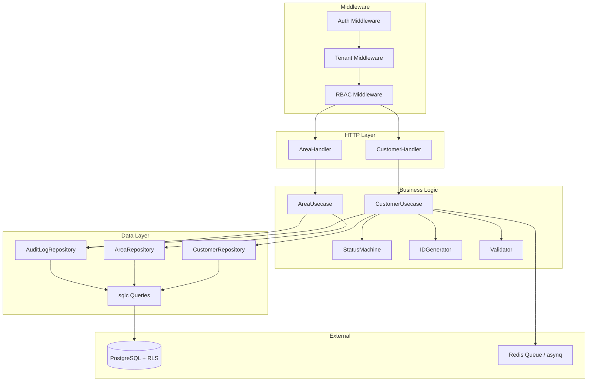
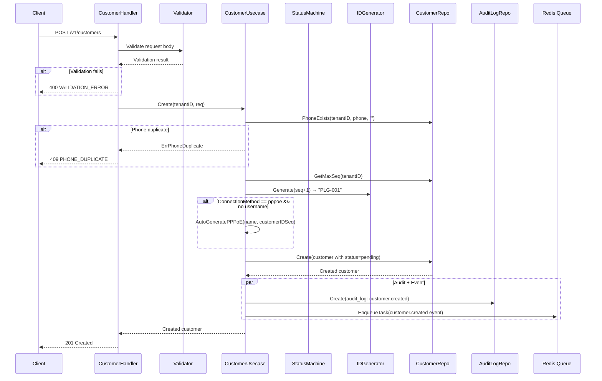
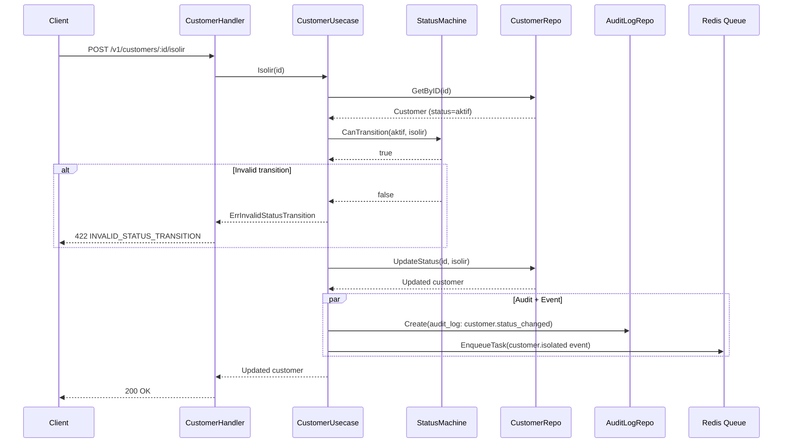
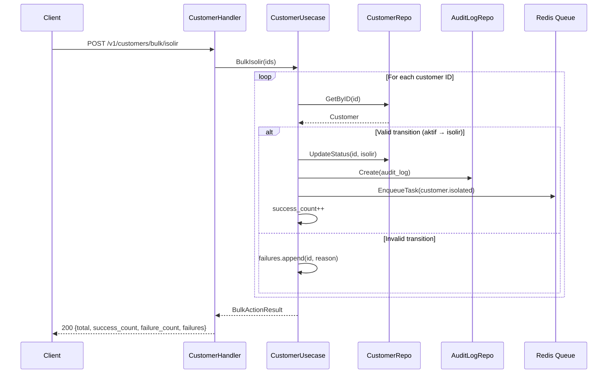
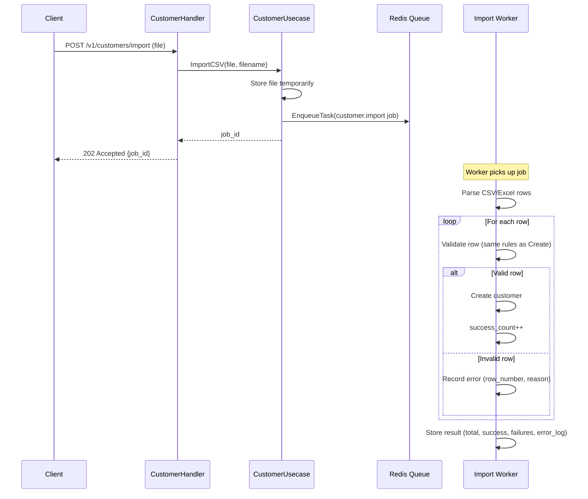
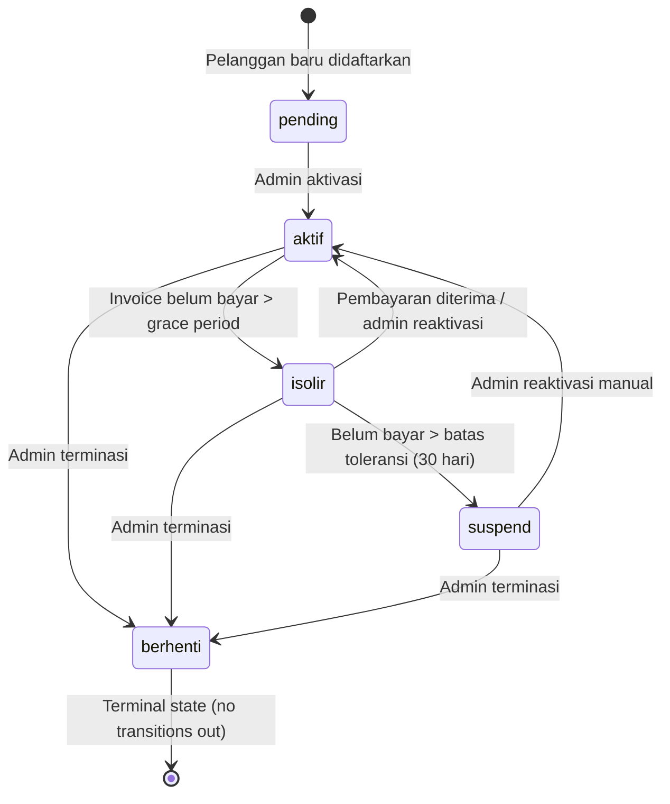

# Design Document: Customer CRUD Module

## Overview

The Customer CRUD module is the core data management layer for ISPBoss's billing-api service. It replaces the sample `customers` table (migration 000002) with a full-featured customer schema and implements all CRUD operations, area management, bulk actions, import/export, status transitions, and audit trail.

### Key Design Decisions

| Decision | Choice | Rationale |
|---|---|---|
| State machine enforcement | Domain layer (Go code) | Invalid transitions are impossible regardless of caller |
| Audit logging | Database table (`audit_logs`) | Persistent, queryable, tenant-scoped audit trail |
| Soft delete | `deleted_at` timestamp | Data recovery possible, referential integrity preserved |
| Customer ID format | `PLG-{seq}` per tenant | Human-readable, auto-increment, tenant-scoped |
| Import/Export | Async via asynq jobs | Non-blocking for large datasets |
| Event publishing | Redis queue (asynq) | Decoupled inter-service communication |
| Validation | go-playground/validator | Consistent with existing auth module |
| Database queries | sqlc (code generation) | Type-safe, consistent with existing patterns |

### Module Boundaries

The customer module owns:
- Customer CRUD (create, read, update, soft-delete)
- Area CRUD (create, read, update, delete)
- Customer status transitions (state machine)
- Customer package changes
- Bulk actions (isolir, activate, notify, change-package, edit, delete)
- Import/Export (async jobs)
- Quick stats (count by status)
- Audit log writes and reads (for customer entity)

The module does NOT own:
- Package definitions (future `packages` module — `package_id` is a UUID FK for now)
- Network operations (consumed via events by Network Service)
- Notifications (consumed via events by Notification Service)
- Invoice/Payment data (future billing module)

## Architecture

### High-Level Architecture



### File Structure

New files to be created within `services/billing-api/`:

```
internal/
├── domain/
│   ├── customer.go          # Customer entity, status, state machine (REPLACE existing)
│   ├── customer_event.go    # Event payload types for customer events
│   ├── area.go              # Area entity
│   ├── audit_log.go         # AuditLog entity
│   └── repository.go        # Add CustomerRepository, AreaRepository, AuditLogRepository (APPEND)
├── handler/
│   ├── customer_handler.go  # Customer HTTP handlers (list, detail, create, update, delete)
│   ├── customer_action.go   # Customer action handlers (isolir, activate, change-package)
│   ├── customer_bulk.go     # Bulk action handlers
│   ├── customer_io.go       # Import/export handlers
│   ├── area_handler.go      # Area HTTP handlers
│   └── router.go            # Register new routes (MODIFY existing)
├── usecase/
│   ├── customer_usecase.go  # Customer business logic
│   ├── customer_status.go   # Status transition logic + event publishing
│   ├── customer_bulk.go     # Bulk action logic
│   ├── customer_import.go   # Import job logic
│   ├── customer_export.go   # Export job logic
│   ├── area_usecase.go      # Area business logic
│   └── audit_usecase.go     # Audit log write/read logic (NEW, separate from existing audit.go)
├── repository/
│   ├── customer_repo.go     # CustomerRepository implementation
│   ├── area_repo.go         # AreaRepository implementation
│   └── audit_log_repo.go    # AuditLogRepository implementation
migrations/
├── 000006_drop_old_customers.up.sql
├── 000006_drop_old_customers.down.sql
├── 000007_create_areas.up.sql
├── 000007_create_areas.down.sql
├── 000008_create_customers.up.sql
├── 000008_create_customers.down.sql
├── 000009_create_audit_logs.up.sql
├── 000009_create_audit_logs.down.sql
```

### Integration with Existing Infrastructure

- **Auth Middleware** (`middleware/auth.go`): Extracts JWT claims, sets `user_id`, `tenant_id`, `role` in Fiber locals. No changes needed.
- **Tenant Middleware** (`middleware/tenant.go`): Wraps `pkg/tenant.Middleware`. Sets `app.tenant_id` PostgreSQL session variable. No changes needed.
- **RBAC Middleware** (`middleware/rbac.go`): Uses `domain.RBACConfig` with `AllowedRoles` and `MethodRestrictions`. Customer routes will configure per-endpoint RBAC.
- **Queue** (`pkg/queue`): Uses `queue.TaskEnvelope` and `queue.EnqueueTask` for event publishing. Customer events follow the same envelope format.
- **Database** (`pkg/database`): Uses `database.WithTenant` for tenant-scoped connections. sqlc queries run within tenant context.

## Components and Interfaces

### Domain Entities

#### CustomerStatus (State Machine)

```go
// CustomerStatus mendefinisikan status pelanggan dalam sistem.
type CustomerStatus string

const (
    CustomerStatusPending  CustomerStatus = "pending"
    CustomerStatusAktif    CustomerStatus = "aktif"
    CustomerStatusIsolir   CustomerStatus = "isolir"
    CustomerStatusSuspend  CustomerStatus = "suspend"
    CustomerStatusBerhenti CustomerStatus = "berhenti"
)

// ValidTransitions mendefinisikan transisi status yang valid.
// Key: status asal, Value: daftar status tujuan yang diizinkan.
var ValidTransitions = map[CustomerStatus][]CustomerStatus{
    CustomerStatusPending:  {CustomerStatusAktif},
    CustomerStatusAktif:    {CustomerStatusIsolir, CustomerStatusBerhenti},
    CustomerStatusIsolir:   {CustomerStatusAktif, CustomerStatusSuspend, CustomerStatusBerhenti},
    CustomerStatusSuspend:  {CustomerStatusAktif, CustomerStatusBerhenti},
    CustomerStatusBerhenti: {}, // terminal state
}

// CanTransition memeriksa apakah transisi dari current ke target valid.
func CanTransition(current, target CustomerStatus) bool

// Transition melakukan transisi status dan mengembalikan status baru.
// Mengembalikan error jika transisi tidak valid.
func Transition(current, target CustomerStatus) (CustomerStatus, error)

// AllowedTargets mengembalikan daftar status tujuan yang valid dari status saat ini.
func AllowedTargets(current CustomerStatus) []CustomerStatus
```

#### ConnectionMethod

```go
// ConnectionMethod mendefinisikan metode koneksi internet pelanggan.
type ConnectionMethod string

const (
    ConnectionPPPoE       ConnectionMethod = "pppoe"
    ConnectionHotspot     ConnectionMethod = "hotspot"
    ConnectionDHCPBinding ConnectionMethod = "dhcp_binding"
    ConnectionStatic      ConnectionMethod = "static"
)
```

#### Customer Entity (Expanded)

```go
// Customer merepresentasikan pelanggan ISP yang dikelola oleh tenant.
type Customer struct {
    ID               string           `json:"id"`
    TenantID         string           `json:"tenant_id"`
    CustomerIDSeq    string           `json:"customer_id_seq"`
    Name             string           `json:"name"`
    Phone            string           `json:"phone"`
    Email            string           `json:"email,omitempty"`
    Address          string           `json:"address"`
    AreaID           string           `json:"area_id,omitempty"`
    AreaName         string           `json:"area_name,omitempty"`   // joined field
    Latitude         float64          `json:"latitude"`
    Longitude        float64          `json:"longitude"`
    PackageID        string           `json:"package_id"`
    PackageName      string           `json:"package_name,omitempty"` // joined field
    ActivationDate   time.Time        `json:"activation_date"`
    DueDate          int              `json:"due_date"`
    ConnectionMethod ConnectionMethod `json:"connection_method"`
    PPPoEUsername    string           `json:"pppoe_username,omitempty"`
    PPPoEPassword    string           `json:"pppoe_password,omitempty"`
    MACAddress       string           `json:"mac_address,omitempty"`
    RouterID         string           `json:"router_id,omitempty"`
    ODPPort          string           `json:"odp_port,omitempty"`
    CreditBalance    int64            `json:"credit_balance"`
    Notes            string           `json:"notes,omitempty"`
    Status           CustomerStatus   `json:"status"`
    DeletedAt        *time.Time       `json:"deleted_at,omitempty"`
    CreatedAt        time.Time        `json:"created_at"`
    UpdatedAt        time.Time        `json:"updated_at"`
}
```

#### Area Entity

```go
// Area merepresentasikan wilayah/area geografis pelanggan.
type Area struct {
    ID            string   `json:"id"`
    TenantID      string   `json:"tenant_id"`
    Name          string   `json:"name"`
    Description   string   `json:"description,omitempty"`
    ODPID         string   `json:"odp_id,omitempty"`
    CenterLat     *float64 `json:"center_lat,omitempty"`
    CenterLng     *float64 `json:"center_lng,omitempty"`
    CustomerCount int      `json:"customer_count,omitempty"` // computed field
    CreatedAt     time.Time `json:"created_at"`
    UpdatedAt     time.Time `json:"updated_at"`
}
```

#### AuditLog Entity

```go
// AuditLog merepresentasikan catatan perubahan pada entitas.
type AuditLog struct {
    ID         string                 `json:"id"`
    TenantID   string                 `json:"tenant_id"`
    EntityType string                 `json:"entity_type"`
    EntityID   string                 `json:"entity_id"`
    Action     string                 `json:"action"`
    ActorID    string                 `json:"actor_id"`
    ActorName  string                 `json:"actor_name"`
    Changes    map[string]interface{} `json:"changes,omitempty"`
    Metadata   map[string]interface{} `json:"metadata,omitempty"`
    CreatedAt  time.Time              `json:"created_at"`
}
```

### Repository Interfaces

```go
// CustomerRepository mendefinisikan operasi data untuk tabel customers.
type CustomerRepository interface {
    Create(ctx context.Context, customer *Customer) (*Customer, error)
    GetByID(ctx context.Context, id string) (*Customer, error)
    Update(ctx context.Context, customer *Customer) (*Customer, error)
    SoftDelete(ctx context.Context, id string) error
    List(ctx context.Context, params CustomerListParams) (*CustomerListResult, error)
    UpdateStatus(ctx context.Context, id string, status CustomerStatus) (*Customer, error)
    UpdatePackage(ctx context.Context, id string, packageID string) (*Customer, error)
    CountByStatus(ctx context.Context) (map[CustomerStatus]int64, error)
    GetMaxSeq(ctx context.Context, tenantID string) (int, error)
    PhoneExists(ctx context.Context, tenantID, phone, excludeID string) (bool, error)
    BulkUpdateStatus(ctx context.Context, ids []string, status CustomerStatus) ([]BulkResult, error)
    BulkUpdateFields(ctx context.Context, ids []string, fields map[string]interface{}) ([]BulkResult, error)
    BulkSoftDelete(ctx context.Context, ids []string) ([]BulkResult, error)
}

// AreaRepository mendefinisikan operasi data untuk tabel areas.
type AreaRepository interface {
    Create(ctx context.Context, area *Area) (*Area, error)
    GetByID(ctx context.Context, id string) (*Area, error)
    Update(ctx context.Context, area *Area) (*Area, error)
    Delete(ctx context.Context, id string) error
    List(ctx context.Context, tenantID string) ([]*Area, error)
    NameExists(ctx context.Context, tenantID, name, excludeID string) (bool, error)
    CustomerCount(ctx context.Context, id string) (int, error)
}

// AuditLogRepository mendefinisikan operasi data untuk tabel audit_logs.
type AuditLogRepository interface {
    Create(ctx context.Context, log *AuditLog) error
    ListByEntity(ctx context.Context, entityType, entityID string) ([]*AuditLog, error)
}
```

### Usecase Interfaces

```go
// CustomerUsecase mendefinisikan business logic untuk manajemen pelanggan.
type CustomerUsecase interface {
    Create(ctx context.Context, tenantID string, req CreateCustomerRequest) (*Customer, error)
    GetByID(ctx context.Context, id string, includeAudit bool) (*CustomerDetail, error)
    Update(ctx context.Context, id string, req UpdateCustomerRequest) (*Customer, error)
    SoftDelete(ctx context.Context, id string, confirmName string) error
    List(ctx context.Context, params CustomerListParams) (*CustomerListResult, error)
    Isolir(ctx context.Context, id string) (*Customer, error)
    Activate(ctx context.Context, id string) (*Customer, error)
    ChangePackage(ctx context.Context, id string, packageID string) (*Customer, error)
    Stats(ctx context.Context) (map[CustomerStatus]int64, error)
    BulkIsolir(ctx context.Context, ids []string) (*BulkActionResult, error)
    BulkActivate(ctx context.Context, ids []string) (*BulkActionResult, error)
    BulkNotify(ctx context.Context, ids []string, templateID string) (*BulkActionResult, error)
    BulkChangePackage(ctx context.Context, ids []string, packageID string) (*BulkActionResult, error)
    BulkEdit(ctx context.Context, ids []string, fields BulkEditFields) (*BulkActionResult, error)
    BulkDelete(ctx context.Context, ids []string) (*BulkActionResult, error)
    ImportCSV(ctx context.Context, file []byte, filename string) (string, error) // returns job_id
    ExportCSV(ctx context.Context, params CustomerListParams, format string, columns []string) (string, error) // returns job_id
    GetImportTemplate(ctx context.Context) ([]byte, error)
}

// AreaUsecase mendefinisikan business logic untuk manajemen area.
type AreaUsecase interface {
    Create(ctx context.Context, tenantID string, req CreateAreaRequest) (*Area, error)
    GetByID(ctx context.Context, id string) (*Area, error)
    Update(ctx context.Context, id string, req UpdateAreaRequest) (*Area, error)
    Delete(ctx context.Context, id string) error
    List(ctx context.Context, tenantID string) ([]*Area, error)
}
```

### Request/Response DTOs

```go
// CreateCustomerRequest adalah payload untuk POST /v1/customers.
type CreateCustomerRequest struct {
    Name             string  `json:"name" validate:"required,min=3,max=255"`
    Phone            string  `json:"phone" validate:"required,phone_id"`
    Email            string  `json:"email" validate:"omitempty,email"`
    Address          string  `json:"address" validate:"required,max=1000"`
    AreaID           string  `json:"area_id" validate:"omitempty,uuid"`
    Latitude         float64 `json:"latitude" validate:"required,min=-90,max=90"`
    Longitude        float64 `json:"longitude" validate:"required,min=-180,max=180"`
    PackageID        string  `json:"package_id" validate:"required,uuid"`
    ActivationDate   string  `json:"activation_date" validate:"required,datetime=2006-01-02"`
    DueDate          int     `json:"due_date" validate:"required,min=1,max=28"`
    ConnectionMethod string  `json:"connection_method" validate:"required,oneof=pppoe hotspot dhcp_binding static"`
    PPPoEUsername    string  `json:"pppoe_username" validate:"omitempty"`
    PPPoEPassword    string  `json:"pppoe_password" validate:"omitempty"`
    MACAddress       string  `json:"mac_address" validate:"required_if=ConnectionMethod dhcp_binding,omitempty,mac_addr"`
    RouterID         string  `json:"router_id" validate:"omitempty,uuid"`
    ODPPort          string  `json:"odp_port" validate:"omitempty"`
    Notes            string  `json:"notes" validate:"omitempty"`
}

// UpdateCustomerRequest adalah payload untuk PUT /v1/customers/:id.
type UpdateCustomerRequest struct {
    Name             string  `json:"name" validate:"omitempty,min=3,max=255"`
    Phone            string  `json:"phone" validate:"omitempty,phone_id"`
    Email            string  `json:"email" validate:"omitempty,email"`
    Address          string  `json:"address" validate:"omitempty,max=1000"`
    AreaID           string  `json:"area_id" validate:"omitempty,uuid"`
    Latitude         *float64 `json:"latitude" validate:"omitempty,min=-90,max=90"`
    Longitude        *float64 `json:"longitude" validate:"omitempty,min=-180,max=180"`
    PackageID        string  `json:"package_id" validate:"omitempty,uuid"`
    ActivationDate   string  `json:"activation_date" validate:"omitempty,datetime=2006-01-02"`
    DueDate          *int    `json:"due_date" validate:"omitempty,min=1,max=28"`
    ConnectionMethod string  `json:"connection_method" validate:"omitempty,oneof=pppoe hotspot dhcp_binding static"`
    PPPoEUsername    string  `json:"pppoe_username" validate:"omitempty"`
    PPPoEPassword    string  `json:"pppoe_password" validate:"omitempty"`
    MACAddress       string  `json:"mac_address" validate:"omitempty,mac_addr"`
    RouterID         string  `json:"router_id" validate:"omitempty,uuid"`
    ODPPort          string  `json:"odp_port" validate:"omitempty"`
    Notes            string  `json:"notes" validate:"omitempty"`
}

// CustomerListParams berisi parameter untuk list/filter pelanggan.
type CustomerListParams struct {
    TenantID  string `query:"tenant_id"`
    Page      int    `query:"page" validate:"omitempty,min=1"`
    PageSize  int    `query:"page_size" validate:"omitempty,oneof=10 25 50"`
    Search    string `query:"search"`
    Status    string `query:"status" validate:"omitempty,oneof=pending aktif isolir suspend berhenti"`
    PackageID string `query:"package_id" validate:"omitempty,uuid"`
    AreaID    string `query:"area_id" validate:"omitempty,uuid"`
    DueDate   *int   `query:"due_date" validate:"omitempty,min=1,max=28"`
    SortBy    string `query:"sort_by" validate:"omitempty,oneof=name customer_id_seq status created_at due_date"`
    SortOrder string `query:"sort_order" validate:"omitempty,oneof=asc desc"`
}

// CustomerListResult berisi hasil list pelanggan dengan metadata paginasi.
type CustomerListResult struct {
    Data       []*Customer    `json:"data"`
    Pagination PaginationMeta `json:"pagination"`
}

// PaginationMeta berisi metadata paginasi.
type PaginationMeta struct {
    Total      int64 `json:"total"`
    Page       int   `json:"page"`
    PageSize   int   `json:"page_size"`
    TotalPages int   `json:"total_pages"`
}

// CustomerDetail berisi detail pelanggan lengkap termasuk audit log.
type CustomerDetail struct {
    Customer  *Customer    `json:"customer"`
    AuditLogs []*AuditLog  `json:"audit_logs,omitempty"`
}

// BulkActionResult berisi hasil bulk action.
type BulkActionResult struct {
    Total        int             `json:"total"`
    SuccessCount int             `json:"success_count"`
    FailureCount int             `json:"failure_count"`
    Failures     []BulkFailure   `json:"failures,omitempty"`
}

// BulkFailure berisi detail kegagalan per item dalam bulk action.
type BulkFailure struct {
    CustomerID string `json:"customer_id"`
    Reason     string `json:"reason"`
}

// BulkEditFields berisi field yang bisa di-edit secara massal.
type BulkEditFields struct {
    AreaID  string `json:"area_id" validate:"omitempty,uuid"`
    DueDate *int   `json:"due_date" validate:"omitempty,min=1,max=28"`
    Notes   string `json:"notes" validate:"omitempty"`
}

// CreateAreaRequest adalah payload untuk POST /v1/areas.
type CreateAreaRequest struct {
    Name        string   `json:"name" validate:"required,min=2,max=255"`
    Description string   `json:"description" validate:"omitempty"`
    ODPID       string   `json:"odp_id" validate:"omitempty"`
    CenterLat   *float64 `json:"center_lat" validate:"omitempty,min=-90,max=90"`
    CenterLng   *float64 `json:"center_lng" validate:"omitempty,min=-180,max=180"`
}

// UpdateAreaRequest adalah payload untuk PUT /v1/areas/:id.
type UpdateAreaRequest struct {
    Name        string   `json:"name" validate:"omitempty,min=2,max=255"`
    Description string   `json:"description" validate:"omitempty"`
    ODPID       string   `json:"odp_id" validate:"omitempty"`
    CenterLat   *float64 `json:"center_lat" validate:"omitempty,min=-90,max=90"`
    CenterLng   *float64 `json:"center_lng" validate:"omitempty,min=-180,max=180"`
}

// DeleteCustomerRequest adalah payload untuk DELETE /v1/customers/:id.
type DeleteCustomerRequest struct {
    ConfirmationName string `json:"confirmation_name" validate:"required"`
}

// ChangePackageRequest adalah payload untuk POST /v1/customers/:id/change-package.
type ChangePackageRequest struct {
    PackageID string `json:"package_id" validate:"required,uuid"`
}

// BulkIDsRequest berisi daftar customer IDs untuk bulk action.
type BulkIDsRequest struct {
    CustomerIDs []string `json:"customer_ids" validate:"required,min=1,dive,uuid"`
}

// BulkNotifyRequest berisi daftar customer IDs dan template untuk notifikasi massal.
type BulkNotifyRequest struct {
    CustomerIDs []string `json:"customer_ids" validate:"required,min=1,dive,uuid"`
    TemplateID  string   `json:"template_id" validate:"required"`
}

// BulkChangePackageRequest berisi daftar customer IDs dan package_id baru.
type BulkChangePackageRequest struct {
    CustomerIDs []string `json:"customer_ids" validate:"required,min=1,dive,uuid"`
    PackageID   string   `json:"package_id" validate:"required,uuid"`
}

// BulkEditRequest berisi daftar customer IDs dan field yang akan diupdate.
type BulkEditRequest struct {
    CustomerIDs []string       `json:"customer_ids" validate:"required,min=1,dive,uuid"`
    Fields      BulkEditFields `json:"fields" validate:"required"`
}
```

### Handler Structs

```go
// CustomerHandler menangani HTTP request untuk manajemen pelanggan.
type CustomerHandler struct {
    customerUsecase CustomerUsecase
    validate        *validator.Validate
    logger          zerolog.Logger
}

// AreaHandler menangani HTTP request untuk manajemen area.
type AreaHandler struct {
    areaUsecase AreaUsecase
    validate    *validator.Validate
    logger      zerolog.Logger
}
```

### Custom Validator Registration

```go
// RegisterCustomValidators mendaftarkan custom validator untuk field pelanggan.
// - phone_id: validasi format telepon Indonesia (+62, 10-15 digit)
// - mac_addr: validasi format MAC address (AA:BB:CC:DD:EE:FF)
func RegisterCustomValidators(v *validator.Validate) {
    v.RegisterValidation("phone_id", validatePhoneID)
    v.RegisterValidation("mac_addr", validateMACAddress)
}
```


## Data Models

### Migration 000006: Drop Old Customers Table

```sql
-- Migrasi: menghapus tabel customers lama (sample dari monorepo-setup).
-- Tabel ini akan diganti dengan schema lengkap di migrasi 000008.

DROP POLICY IF EXISTS tenant_insert ON customers;
DROP POLICY IF EXISTS tenant_isolation ON customers;
DROP INDEX IF EXISTS idx_customers_status;
DROP INDEX IF EXISTS idx_customers_tenant_id;
DROP TABLE IF EXISTS customers;
```

### Migration 000007: Create Areas Table

```sql
-- Migrasi: membuat tabel areas untuk grouping pelanggan per wilayah.
-- Setiap area dimiliki oleh satu tenant dan dilindungi oleh RLS.

CREATE TABLE areas (
    id          UUID PRIMARY KEY DEFAULT gen_random_uuid(),
    tenant_id   UUID NOT NULL REFERENCES tenants(id),
    name        VARCHAR(255) NOT NULL,
    description TEXT,
    odp_id      VARCHAR(100),
    center_lat  DECIMAL(10, 7),
    center_lng  DECIMAL(10, 7),
    created_at  TIMESTAMPTZ NOT NULL DEFAULT NOW(),
    updated_at  TIMESTAMPTZ NOT NULL DEFAULT NOW()
);

-- Aktifkan RLS pada tabel areas
ALTER TABLE areas ENABLE ROW LEVEL SECURITY;

-- Policy: isolasi data per tenant (SELECT, UPDATE, DELETE)
CREATE POLICY tenant_isolation ON areas
    USING (tenant_id = current_setting('app.tenant_id')::uuid);

-- Policy: INSERT harus sesuai tenant session
CREATE POLICY tenant_insert ON areas
    FOR INSERT
    WITH CHECK (tenant_id = current_setting('app.tenant_id')::uuid);

-- Unique constraint: nama area unik per tenant
ALTER TABLE areas ADD CONSTRAINT uq_areas_tenant_name UNIQUE (tenant_id, name);

-- Index pada tenant_id untuk performa query
CREATE INDEX idx_areas_tenant_id ON areas(tenant_id);
```

### Migration 000008: Create New Customers Table

```sql
-- Migrasi: membuat tabel customers dengan schema lengkap.
-- Menggantikan tabel sample dari migrasi 000002.

CREATE TABLE customers (
    id                UUID PRIMARY KEY DEFAULT gen_random_uuid(),
    tenant_id         UUID NOT NULL REFERENCES tenants(id),
    customer_id_seq   VARCHAR(20),
    name              VARCHAR(255) NOT NULL,
    phone             VARCHAR(20) NOT NULL,
    email             VARCHAR(255),
    address           TEXT NOT NULL,
    area_id           UUID REFERENCES areas(id) ON DELETE SET NULL,
    latitude          DECIMAL(10, 7) NOT NULL,
    longitude         DECIMAL(10, 7) NOT NULL,
    package_id        UUID NOT NULL,
    activation_date   DATE NOT NULL,
    due_date          INTEGER NOT NULL,
    connection_method VARCHAR(20) NOT NULL,
    pppoe_username    VARCHAR(100),
    pppoe_password    VARCHAR(100),
    mac_address       VARCHAR(17),
    router_id         UUID,
    odp_port          VARCHAR(100),
    credit_balance    BIGINT NOT NULL DEFAULT 0,
    notes             TEXT,
    status            VARCHAR(20) NOT NULL DEFAULT 'pending',
    deleted_at        TIMESTAMPTZ,
    created_at        TIMESTAMPTZ NOT NULL DEFAULT NOW(),
    updated_at        TIMESTAMPTZ NOT NULL DEFAULT NOW(),

    -- CHECK constraints
    CONSTRAINT chk_customers_due_date CHECK (due_date >= 1 AND due_date <= 28),
    CONSTRAINT chk_customers_connection_method CHECK (
        connection_method IN ('pppoe', 'hotspot', 'dhcp_binding', 'static')
    ),
    CONSTRAINT chk_customers_status CHECK (
        status IN ('pending', 'aktif', 'isolir', 'suspend', 'berhenti')
    )
);

-- Aktifkan RLS pada tabel customers
ALTER TABLE customers ENABLE ROW LEVEL SECURITY;

-- Policy: isolasi data per tenant (SELECT, UPDATE, DELETE)
CREATE POLICY tenant_isolation ON customers
    USING (tenant_id = current_setting('app.tenant_id')::uuid);

-- Policy: INSERT harus sesuai tenant session
CREATE POLICY tenant_insert ON customers
    FOR INSERT
    WITH CHECK (tenant_id = current_setting('app.tenant_id')::uuid);

-- Unique constraints
ALTER TABLE customers ADD CONSTRAINT uq_customers_tenant_phone
    UNIQUE (tenant_id, phone);
ALTER TABLE customers ADD CONSTRAINT uq_customers_tenant_id_seq
    UNIQUE (tenant_id, customer_id_seq);

-- Composite indexes untuk performa query
CREATE INDEX idx_customers_tenant_status ON customers(tenant_id, status);
CREATE INDEX idx_customers_tenant_id_seq ON customers(tenant_id, customer_id_seq);
CREATE INDEX idx_customers_tenant_phone ON customers(tenant_id, phone);
CREATE INDEX idx_customers_tenant_area ON customers(tenant_id, area_id);
CREATE INDEX idx_customers_tenant_package ON customers(tenant_id, package_id);
CREATE INDEX idx_customers_tenant_due_date ON customers(tenant_id, due_date);

-- Partial index: exclude soft-deleted dari query umum
CREATE INDEX idx_customers_active ON customers(tenant_id)
    WHERE deleted_at IS NULL;
```

### Migration 000009: Create Audit Logs Table

```sql
-- Migrasi: membuat tabel audit_logs untuk mencatat semua perubahan entitas.
-- Tabel ini bersifat shared (digunakan oleh semua modul) dan dilindungi RLS.

CREATE TABLE audit_logs (
    id          UUID PRIMARY KEY DEFAULT gen_random_uuid(),
    tenant_id   UUID NOT NULL REFERENCES tenants(id),
    entity_type VARCHAR(50) NOT NULL,
    entity_id   UUID NOT NULL,
    action      VARCHAR(100) NOT NULL,
    actor_id    UUID NOT NULL,
    actor_name  VARCHAR(255) NOT NULL,
    changes     JSONB,
    metadata    JSONB,
    created_at  TIMESTAMPTZ NOT NULL DEFAULT NOW()
);

-- Aktifkan RLS pada tabel audit_logs
ALTER TABLE audit_logs ENABLE ROW LEVEL SECURITY;

-- Policy: isolasi data per tenant
CREATE POLICY tenant_isolation ON audit_logs
    USING (tenant_id = current_setting('app.tenant_id')::uuid);

-- Policy: INSERT harus sesuai tenant session
CREATE POLICY tenant_insert ON audit_logs
    FOR INSERT
    WITH CHECK (tenant_id = current_setting('app.tenant_id')::uuid);

-- Composite indexes untuk performa query
CREATE INDEX idx_audit_logs_entity ON audit_logs(tenant_id, entity_type, entity_id);
CREATE INDEX idx_audit_logs_created ON audit_logs(tenant_id, created_at);
```

### Event Payload Types

```go
// CustomerCreatedPayload adalah payload event customer.created.
type CustomerCreatedPayload struct {
    CustomerID       string `json:"customer_id"`
    Name             string `json:"name"`
    PackageID        string `json:"package_id"`
    ConnectionMethod string `json:"connection_method"`
    RouterID         string `json:"router_id,omitempty"`
}

// CustomerActivatedPayload adalah payload event customer.activated.
type CustomerActivatedPayload struct {
    CustomerID       string `json:"customer_id"`
    Name             string `json:"name"`
    PackageID        string `json:"package_id"`
    ConnectionMethod string `json:"connection_method"`
    PPPoEUsername    string `json:"pppoe_username,omitempty"`
    PPPoEPassword    string `json:"pppoe_password,omitempty"`
    RouterID         string `json:"router_id,omitempty"`
}

// CustomerIsolatedPayload adalah payload event customer.isolated.
type CustomerIsolatedPayload struct {
    CustomerID    string `json:"customer_id"`
    Name          string `json:"name"`
    RouterID      string `json:"router_id,omitempty"`
    PPPoEUsername string `json:"pppoe_username,omitempty"`
}

// CustomerUnblockedPayload adalah payload event customer.unblocked.
type CustomerUnblockedPayload struct {
    CustomerID    string `json:"customer_id"`
    Name          string `json:"name"`
    RouterID      string `json:"router_id,omitempty"`
    PPPoEUsername string `json:"pppoe_username,omitempty"`
}

// CustomerTerminatedPayload adalah payload event customer.terminated.
type CustomerTerminatedPayload struct {
    CustomerID    string `json:"customer_id"`
    Name          string `json:"name"`
    RouterID      string `json:"router_id,omitempty"`
    PPPoEUsername string `json:"pppoe_username,omitempty"`
}

// PackageChangedPayload adalah payload event package.changed.
type PackageChangedPayload struct {
    CustomerID       string `json:"customer_id"`
    OldPackageID     string `json:"old_package_id"`
    NewPackageID     string `json:"new_package_id"`
    ConnectionMethod string `json:"connection_method"`
    RouterID         string `json:"router_id,omitempty"`
}
```

## API Endpoint Signatures

### Customer Endpoints

| Method | Path | Handler | RBAC | Description |
|---|---|---|---|---|
| GET | `/v1/customers` | `CustomerHandler.List` | admin, operator, kasir(GET only) | Daftar pelanggan dengan paginasi, filter, search |
| GET | `/v1/customers/stats` | `CustomerHandler.Stats` | admin, operator, kasir(GET only) | Quick stats: jumlah per status |
| GET | `/v1/customers/export` | `CustomerHandler.Export` | tenant_admin only | Export pelanggan ke CSV/Excel (async) |
| GET | `/v1/customers/import/template` | `CustomerHandler.ImportTemplate` | tenant_admin only | Download template import CSV |
| POST | `/v1/customers/import` | `CustomerHandler.Import` | tenant_admin only | Import pelanggan dari CSV/Excel (async) |
| GET | `/v1/customers/:id` | `CustomerHandler.Get` | admin, operator, kasir(GET only) | Detail pelanggan (optional: include audit_logs) |
| POST | `/v1/customers` | `CustomerHandler.Create` | admin, operator | Buat pelanggan baru |
| PUT | `/v1/customers/:id` | `CustomerHandler.Update` | admin, operator | Update data pelanggan |
| DELETE | `/v1/customers/:id` | `CustomerHandler.Delete` | admin, operator | Soft delete pelanggan (konfirmasi nama) |
| POST | `/v1/customers/:id/isolir` | `CustomerHandler.Isolir` | admin, operator | Transisi status ke isolir |
| POST | `/v1/customers/:id/activate` | `CustomerHandler.Activate` | admin, operator | Transisi status ke aktif |
| POST | `/v1/customers/:id/change-package` | `CustomerHandler.ChangePackage` | admin, operator | Ganti paket pelanggan |
| POST | `/v1/customers/bulk/isolir` | `CustomerHandler.BulkIsolir` | admin, operator | Isolir massal |
| POST | `/v1/customers/bulk/activate` | `CustomerHandler.BulkActivate` | admin, operator | Aktifkan massal |
| POST | `/v1/customers/bulk/notification` | `CustomerHandler.BulkNotify` | admin, operator | Kirim notifikasi massal |
| POST | `/v1/customers/bulk/change-package` | `CustomerHandler.BulkChangePackage` | admin, operator | Ganti paket massal |
| POST | `/v1/customers/bulk/edit` | `CustomerHandler.BulkEdit` | admin, operator | Edit massal (area, due_date, notes) |
| DELETE | `/v1/customers/bulk` | `CustomerHandler.BulkDelete` | tenant_admin only | Hapus massal |

### Area Endpoints

| Method | Path | Handler | RBAC | Description |
|---|---|---|---|---|
| GET | `/v1/areas` | `AreaHandler.List` | admin, operator | Daftar area dengan jumlah pelanggan |
| POST | `/v1/areas` | `AreaHandler.Create` | admin, operator | Buat area baru |
| GET | `/v1/areas/:id` | `AreaHandler.Get` | admin, operator | Detail area |
| PUT | `/v1/areas/:id` | `AreaHandler.Update` | admin, operator | Update area |
| DELETE | `/v1/areas/:id` | `AreaHandler.Delete` | admin, operator | Hapus area (jika tidak ada pelanggan) |

### Route Registration (in router.go)

```go
// --- Customer routes (auth + tenant + RBAC) ---
customers := api.Group("/customers")

// Routes accessible by admin, operator, kasir(GET only)
customersRead := customers.Group("")
customersRead.Use(middleware.RBAC(domain.RBACConfig{
    AllowedRoles: []domain.UserRole{
        domain.RoleTenantAdmin, domain.RoleOperator, domain.RoleKasir,
    },
    MethodRestrictions: map[domain.UserRole][]string{
        domain.RoleKasir: {"GET"},
    },
}))
customersRead.Get("/", customerHandler.List)
customersRead.Get("/stats", customerHandler.Stats)
customersRead.Get("/:id", customerHandler.Get)

// Routes accessible by admin, operator (write operations)
customersWrite := customers.Group("")
customersWrite.Use(middleware.RBAC(domain.RBACConfig{
    AllowedRoles: []domain.UserRole{
        domain.RoleTenantAdmin, domain.RoleOperator,
    },
}))
customersWrite.Post("/", customerHandler.Create)
customersWrite.Put("/:id", customerHandler.Update)
customersWrite.Delete("/:id", customerHandler.Delete)
customersWrite.Post("/:id/isolir", customerHandler.Isolir)
customersWrite.Post("/:id/activate", customerHandler.Activate)
customersWrite.Post("/:id/change-package", customerHandler.ChangePackage)
customersWrite.Post("/bulk/isolir", customerHandler.BulkIsolir)
customersWrite.Post("/bulk/activate", customerHandler.BulkActivate)
customersWrite.Post("/bulk/notification", customerHandler.BulkNotify)
customersWrite.Post("/bulk/change-package", customerHandler.BulkChangePackage)
customersWrite.Post("/bulk/edit", customerHandler.BulkEdit)

// Routes accessible by tenant_admin only (import, export, bulk delete)
customersAdmin := customers.Group("")
customersAdmin.Use(middleware.RBAC(domain.RBACConfig{
    AllowedRoles: []domain.UserRole{domain.RoleTenantAdmin},
}))
customersAdmin.Get("/export", customerHandler.Export)
customersAdmin.Get("/import/template", customerHandler.ImportTemplate)
customersAdmin.Post("/import", customerHandler.Import)
customersAdmin.Delete("/bulk", customerHandler.BulkDelete)

// --- Area routes (auth + tenant + RBAC) ---
areas := api.Group("/areas")
areas.Use(middleware.RBAC(domain.RBACConfig{
    AllowedRoles: []domain.UserRole{
        domain.RoleTenantAdmin, domain.RoleOperator,
    },
}))
areas.Get("/", areaHandler.List)
areas.Post("/", areaHandler.Create)
areas.Get("/:id", areaHandler.Get)
areas.Put("/:id", areaHandler.Update)
areas.Delete("/:id", areaHandler.Delete)
```

## Data Flow Diagrams

### Customer Create Flow



### Status Transition Flow



### Bulk Action Flow



### Import Flow (Async)



### Customer Status State Machine Diagram



### Valid Transitions Table

| From | To | Trigger | Event Published |
|---|---|---|---|
| `pending` | `aktif` | Admin activation | `customer.activated` |
| `aktif` | `isolir` | Unpaid invoice > grace period | `customer.isolated` |
| `aktif` | `berhenti` | Admin termination | `customer.terminated` |
| `isolir` | `aktif` | Payment received / admin | `customer.unblocked` |
| `isolir` | `suspend` | Unpaid > 30 days | `customer.suspended` |
| `isolir` | `berhenti` | Admin termination | `customer.terminated` |
| `suspend` | `aktif` | Admin reactivation + payment | `customer.activated` |
| `suspend` | `berhenti` | Admin termination | `customer.terminated` |
| `berhenti` | _(none)_ | Terminal state | _(none)_ |

### Customer ID Auto-Generation Logic

```go
// GenerateCustomerID menghasilkan customer_id_seq berdasarkan sequence terakhir.
// Format: PLG-001, PLG-002, ..., PLG-999, PLG-1000, ...
// Zero-padded minimal 3 digit, expand otomatis jika > 999.
func GenerateCustomerID(lastSeq int) string {
    next := lastSeq + 1
    if next < 1000 {
        return fmt.Sprintf("PLG-%03d", next)
    }
    return fmt.Sprintf("PLG-%d", next)
}
```

### PPPoE Username Auto-Generation Logic

```go
// GeneratePPPoEUsername menghasilkan username PPPoE dari nama dan customer ID.
// Format: {first-name-lowercase}-{customer-id-lowercase-no-dash}
// Contoh: "Ahmad Rizki" + "PLG-001" → "ahmad-plg001"
func GeneratePPPoEUsername(name, customerIDSeq string) string {
    firstName := strings.ToLower(strings.Fields(name)[0])
    idPart := strings.ToLower(strings.ReplaceAll(customerIDSeq, "-", ""))
    return firstName + "-" + idPart
}

// GeneratePPPoEPassword menghasilkan password PPPoE acak 8 karakter alfanumerik.
func GeneratePPPoEPassword() string {
    // crypto/rand based, 8 chars alphanumeric
}
```


## Correctness Properties

*A property is a characteristic or behavior that should hold true across all valid executions of a system — essentially, a formal statement about what the system should do. Properties serve as the bridge between human-readable specifications and machine-verifiable correctness guarantees.*

### Property 1: Customer ID Generation Format

*For any* positive integer sequence number, `GenerateCustomerID(seq)` SHALL produce a string matching the pattern `PLG-{zero-padded-seq}` where the sequence is zero-padded to at least 3 digits (e.g., `PLG-001` for seq=1, `PLG-999` for seq=999, `PLG-1000` for seq=1000), and parsing the numeric suffix back SHALL yield the original sequence number.

**Validates: Requirements 4.1, 4.2**

### Property 2: PPPoE Auto-Generation Completeness

*For any* valid customer creation request where `connection_method` is `pppoe`, the resulting customer SHALL always have both `pppoe_username` and `pppoe_password` populated (either from the request or auto-generated). Furthermore, *for any* auto-generated username, it SHALL follow the format `{first-name-lowercase}-{customer-id-lowercase-no-dash}`, and *for any* auto-generated password, it SHALL be exactly 8 alphanumeric characters.

**Validates: Requirements 5.1, 5.2, 5.3**

### Property 3: Soft-Delete Exclusion

*For any* tenant's customer dataset containing both active and soft-deleted customers, all read operations (list, stats, detail) SHALL return only customers where `deleted_at` is NULL. Soft-deleted customers SHALL never appear in list results, stats counts, or be retrievable via the detail endpoint.

**Validates: Requirements 6.7, 7.4, 17.2**

### Property 4: Tenant Data Isolation

*For any* two distinct tenants A and B, and *for any* customer belonging to tenant A, all API operations (list, detail, update, delete) executed in the context of tenant B SHALL NOT return or modify that customer. The customer SHALL be invisible to tenant B as if it does not exist.

**Validates: Requirements 7.3, 9.4, 10.3, 19.3**

### Property 5: State Machine Determinism and Completeness

*For any* pair of `CustomerStatus` values `(current, target)`, `CanTransition(current, target)` SHALL return `true` if and only if `target` is in the `ValidTransitions[current]` set. Furthermore, *for any* valid transition, `Transition(current, target)` SHALL always return `target` as the new status. *For any* invalid transition, `Transition(current, target)` SHALL return an error containing the current status and the list of allowed target statuses.

**Validates: Requirements 11.3, 11.4, 23.1, 23.2, 23.3**

### Property 6: Field Validation Rules

*For any* string input to the `phone` validator, it SHALL be accepted if and only if it starts with `+62` followed by 9 to 13 digits. *For any* float input to coordinate validators, latitude SHALL be accepted if and only if it is in [-90, 90] and longitude in [-180, 180]. *For any* string input to the `mac_address` validator, it SHALL be accepted if and only if it matches the pattern `XX:XX:XX:XX:XX:XX` where X is a hexadecimal digit. *For any* integer input to `due_date`, it SHALL be accepted if and only if it is in [1, 28]. *For any* string input to `name`, it SHALL be accepted if and only if its length is in [3, 255]. *For any* string input to `address`, it SHALL be accepted if and only if it is non-empty and its length is at most 1000.

**Validates: Requirements 22.1, 22.3, 22.4, 22.5, 22.6, 22.7**

### Property 7: Validation Error Aggregation

*For any* request body containing multiple invalid fields, the validation response SHALL return HTTP 400 with error code `VALIDATION_ERROR` and an array of field-level error details covering ALL invalid fields in a single response (not just the first error encountered).

**Validates: Requirements 22.8**

### Property 8: New Customer Default Status

*For any* valid customer creation request, the resulting customer SHALL always have `status` equal to `pending`, regardless of any status value provided in the request body.

**Validates: Requirements 8.1**

### Property 9: Audit Trail Completeness

*For any* customer mutation operation (create, update, soft-delete, status change, package change), the system SHALL insert exactly one audit log record with the correct `entity_type` ("customer"), `entity_id`, `action`, `actor_id`, and `actor_name`. Furthermore, *for any* update operation where fields change, the `changes` JSONB column SHALL contain the old and new values of every changed field.

**Validates: Requirements 8.6, 9.5, 10.4, 11.5, 12.4, 20.1, 20.2**

### Property 10: Event Publishing on Lifecycle Changes

*For any* customer lifecycle operation (create, activate, isolir, unblock, terminate, package change), the system SHALL publish exactly one event to the Redis queue with the correct `event_type`, `tenant_id`, `timestamp`, and `correlation_id` (UUID v4) in the envelope, and the payload SHALL contain all fields specified for that event type.

**Validates: Requirements 8.5, 10.5, 21.1, 21.2, 21.3, 21.4, 21.5, 21.6, 21.7**

### Property 11: Bulk Action Result Invariant

*For any* bulk action (isolir, activate, notify, change-package, edit, delete) applied to a set of customer IDs, the result SHALL satisfy: `total == success_count + failure_count`, where `total` equals the number of input IDs, `success_count` equals the number of successfully processed customers, and `failure_count` equals the length of the `failures` array.

**Validates: Requirements 14.7**

### Property 12: List Filtering and Sorting Correctness

*For any* combination of filter parameters (status, package_id, area_id, due_date) and search term applied to a customer list query, every returned customer SHALL match ALL specified filters AND contain the search term in at least one of (name, customer_id_seq, address, phone) case-insensitively. Furthermore, *for any* valid `sort_by` column and `sort_order` direction, the returned list SHALL be ordered according to the specified column and direction.

**Validates: Requirements 6.3, 6.4, 6.5**

### Property 13: Pagination Metadata Correctness

*For any* total count of customers and page_size, the pagination metadata SHALL satisfy: `total_pages == ceil(total / page_size)`, `page` is within [1, total_pages], and the number of items returned on the current page is `min(page_size, total - (page-1) * page_size)`.

**Validates: Requirements 6.6**

## Error Handling

### Domain Error Types

```go
var (
    // ErrCustomerNotFound dikembalikan saat pelanggan tidak ditemukan atau milik tenant lain
    ErrCustomerNotFound = errors.New("pelanggan tidak ditemukan")

    // ErrPhoneDuplicate dikembalikan saat nomor telepon sudah terdaftar di tenant yang sama
    ErrPhoneDuplicate = errors.New("nomor telepon sudah terdaftar")

    // ErrInvalidStatusTransition dikembalikan saat transisi status tidak valid
    ErrInvalidStatusTransition = errors.New("transisi status tidak valid")

    // ErrConfirmationMismatch dikembalikan saat nama konfirmasi tidak cocok
    ErrConfirmationMismatch = errors.New("nama konfirmasi tidak cocok")

    // ErrSamePackage dikembalikan saat paket yang diminta sama dengan paket saat ini
    ErrSamePackage = errors.New("paket sama dengan paket saat ini")

    // ErrPackageNotFound dikembalikan saat package_id tidak ditemukan
    ErrPackageNotFound = errors.New("paket tidak ditemukan")

    // ErrAreaNotFound dikembalikan saat area tidak ditemukan
    ErrAreaNotFound = errors.New("area tidak ditemukan")

    // ErrAreaNameDuplicate dikembalikan saat nama area sudah ada di tenant yang sama
    ErrAreaNameDuplicate = errors.New("nama area sudah terdaftar")

    // ErrAreaHasCustomers dikembalikan saat area masih memiliki pelanggan
    ErrAreaHasCustomers = errors.New("area masih memiliki pelanggan")

    // ErrCustomerDeleted dikembalikan saat pelanggan sudah di-soft-delete
    ErrCustomerDeleted = errors.New("pelanggan sudah dihapus")
)
```

### HTTP Error Mapping

| Domain Error | HTTP Status | Error Code |
|---|---|---|
| `ErrCustomerNotFound` | 404 | `CUSTOMER_NOT_FOUND` |
| `ErrPhoneDuplicate` | 409 | `PHONE_DUPLICATE` |
| `ErrInvalidStatusTransition` | 422 | `INVALID_STATUS_TRANSITION` |
| `ErrConfirmationMismatch` | 400 | `CONFIRMATION_MISMATCH` |
| `ErrSamePackage` | 400 | `SAME_PACKAGE` |
| `ErrPackageNotFound` | 400 | `PACKAGE_NOT_FOUND` |
| `ErrAreaNotFound` | 404 | `AREA_NOT_FOUND` |
| `ErrAreaNameDuplicate` | 409 | `AREA_NAME_DUPLICATE` |
| `ErrAreaHasCustomers` | 409 | `AREA_HAS_CUSTOMERS` |
| Validation errors | 400 | `VALIDATION_ERROR` |
| RBAC denied | 403 | `FORBIDDEN` |
| Internal errors | 500 | `INTERNAL_ERROR` |

### Error Response Format

All errors follow the existing `domain.APIResponse` format:

```json
{
  "success": false,
  "error": {
    "code": "INVALID_STATUS_TRANSITION",
    "message": "transisi dari berhenti ke aktif tidak diizinkan",
    "details": [
      {"field": "status", "message": "status saat ini: berhenti, transisi yang diizinkan: (tidak ada)"}
    ]
  }
}
```

### Validation Error Response

```json
{
  "success": false,
  "error": {
    "code": "VALIDATION_ERROR",
    "message": "validasi gagal",
    "details": [
      {"field": "name", "message": "minimal 3 karakter"},
      {"field": "phone", "message": "format harus +62 diikuti 9-13 digit"},
      {"field": "due_date", "message": "harus antara 1 dan 28"}
    ]
  }
}
```

## Testing Strategy

### Testing Framework

- **Unit tests**: `testing` (stdlib) + `testify` for assertions
- **Property-based tests**: `pgregory.net/rapid` (already in go.mod)
- **Integration tests**: `testcontainers-go` for PostgreSQL + Redis
- **HTTP tests**: `net/http/httptest` + Fiber test utilities

### Dual Testing Approach

#### Property-Based Tests (rapid)

Each correctness property maps to one property-based test with minimum 100 iterations. Tests are tagged with the property they validate.

| Property | Test File | Description |
|---|---|---|
| Property 1 | `domain/customer_test.go` | Customer ID generation format |
| Property 2 | `usecase/customer_usecase_test.go` | PPPoE auto-generation completeness |
| Property 3 | `usecase/customer_usecase_test.go` | Soft-delete exclusion from reads |
| Property 4 | Integration test | Tenant isolation (requires DB) |
| Property 5 | `domain/customer_test.go` | State machine determinism |
| Property 6 | `handler/customer_handler_test.go` | Field validation rules |
| Property 7 | `handler/customer_handler_test.go` | Validation error aggregation |
| Property 8 | `usecase/customer_usecase_test.go` | New customer default status |
| Property 9 | `usecase/customer_usecase_test.go` | Audit trail completeness |
| Property 10 | `usecase/customer_usecase_test.go` | Event publishing |
| Property 11 | `usecase/customer_bulk_test.go` | Bulk action result invariant |
| Property 12 | Integration test | List filtering and sorting |
| Property 13 | `usecase/customer_usecase_test.go` | Pagination metadata |

**Property test configuration:**
- Minimum 100 iterations per property
- Tag format: `// Feature: customer-crud, Property N: {title}`
- Use `rapid.Check` with `*rapid.T` for each property

#### Unit Tests (Example-Based)

| Area | Test File | Coverage |
|---|---|---|
| Customer CRUD handlers | `handler/customer_handler_test.go` | HTTP status codes, request parsing, response format |
| Area CRUD handlers | `handler/area_handler_test.go` | HTTP status codes, request parsing |
| Customer usecase | `usecase/customer_usecase_test.go` | Business logic, error cases |
| Area usecase | `usecase/area_usecase_test.go` | Business logic, error cases |
| Status transitions | `domain/customer_test.go` | Each valid/invalid transition |
| Validation | `handler/validation_test.go` | Edge cases: empty strings, boundary values |
| RBAC | `handler/rbac_test.go` | Each role × each endpoint |

#### Integration Tests

| Area | Description |
|---|---|
| Tenant isolation | Create customers in tenant A, verify invisible from tenant B |
| RLS enforcement | Verify RLS blocks cross-tenant access at DB level |
| Unique constraints | Verify phone/customer_id_seq uniqueness at DB level |
| Migration | Verify schema after running all migrations |
| Import/Export | End-to-end import/export with real DB |

### Test Organization

```
services/billing-api/internal/
├── domain/
│   └── customer_test.go          # Property 1, 5 + unit tests for state machine
├── handler/
│   ├── customer_handler_test.go  # Property 6, 7 + HTTP handler unit tests
│   ├── area_handler_test.go      # Area handler unit tests
│   └── rbac_test.go              # RBAC configuration tests
├── usecase/
│   ├── customer_usecase_test.go  # Property 2, 3, 8, 9, 10, 13 + business logic tests
│   ├── customer_bulk_test.go     # Property 11 + bulk action tests
│   └── area_usecase_test.go      # Area business logic tests
└── repository/
    └── customer_repo_test.go     # Property 4, 12 (integration tests)
```
