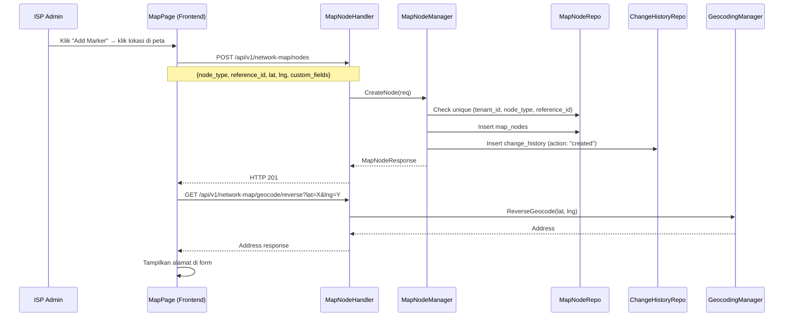
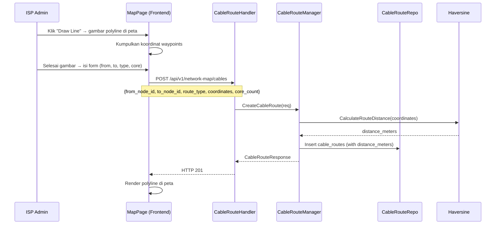
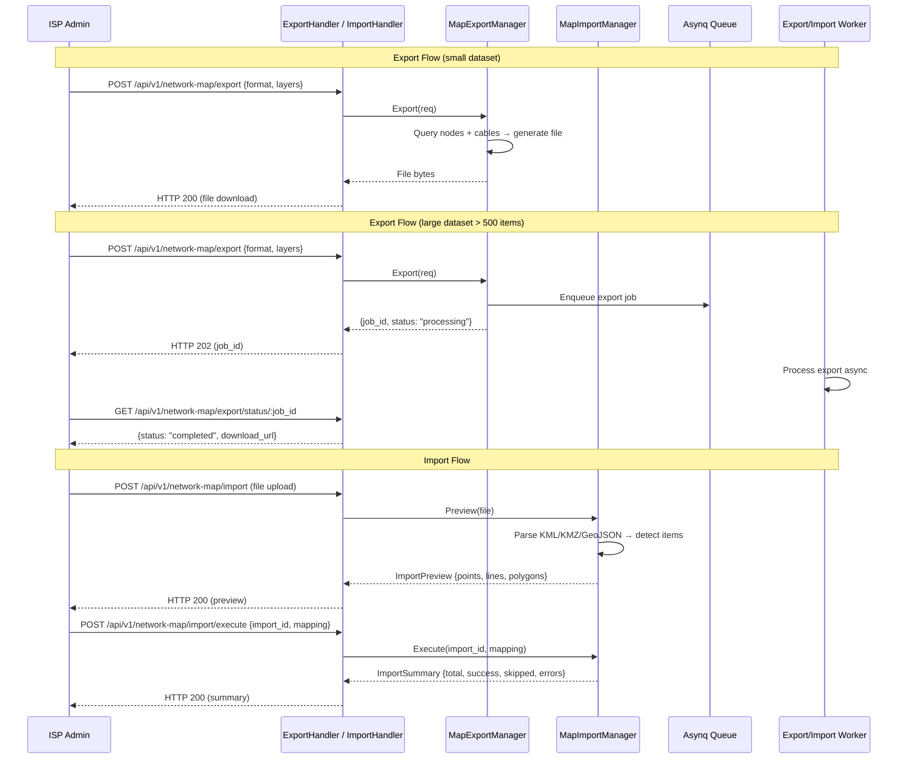
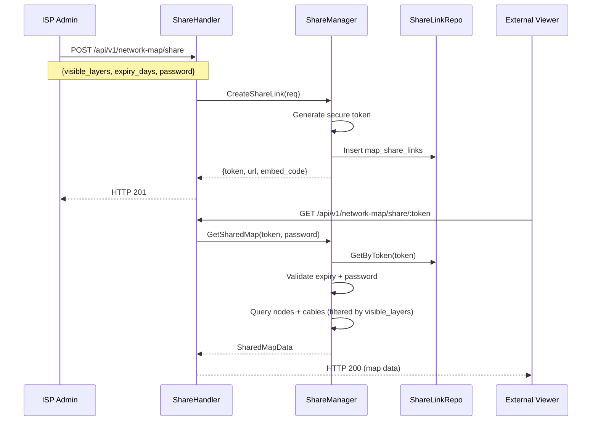

# Design Document — FTTH Visual Mapping

## Overview

Dokumen ini mendeskripsikan desain teknis untuk **FTTH Visual Mapping** di platform ISPBoss. Fitur ini menambahkan layer geospasial di atas modul yang sudah ada (OLT Management, ODP, ONT Provisioning, Pelanggan) untuk memvisualisasikan seluruh jaringan fiber optik ISP pada peta interaktif.

FTTH Visual Mapping terdiri dari dua komponen utama:
- **Backend** (`services/network-service`): REST API baru di bawah prefix `/api/v1/network-map/*` untuk manajemen map node, cable route, foto, export/import, share link, reverse geocoding, loss calculator, dan label settings
- **Frontend** (`apps/web`): Halaman peta interaktif di route `/network-map` menggunakan Leaflet.js + OpenStreetMap + react-leaflet, dengan detail panel, drawing tools, layer control, topology view, heatmap, offline mode, dan export PNG/PDF

Desain mengikuti arsitektur domain-driven yang sudah ada: **domain → repository → usecase → handler**, dengan sqlc untuk query generation, Fiber v2 untuk HTTP, asynq untuk async job, dan zerolog untuk logging. Frontend mengikuti pattern Next.js App Router yang sudah ada di `apps/web`.

### Keputusan Teknis Utama

| Keputusan | Pilihan | Alasan |
|---|---|---|
| Map library | Leaflet.js + react-leaflet | Open source, ringan, mobile-friendly, sudah direncanakan di diskusi |
| Tile server | OpenStreetMap (default) + satellite toggle | Gratis, tidak perlu API key |
| Clustering | Leaflet.markercluster | Plugin standar untuk grouping marker saat zoom out |
| Drawing tools | Leaflet.draw | Plugin standar untuk polyline, marker, measure |
| Reverse geocoding | Nominatim (default), Google Geocoding (opsional) | Nominatim gratis, Google opsional untuk akurasi lebih tinggi |
| Haversine distance | Pure Go function di domain layer | Testable, no external dependency, property-based testing |
| Loss calculator | Pure Go function di domain layer | Testable, deterministic, property-based testing |
| Export format | KML, KMZ, GeoJSON, CSV (backend), PNG/PDF (frontend) | KML/KMZ untuk Google Earth, GeoJSON untuk GIS, CSV untuk spreadsheet |
| Import format | KML, KMZ, GeoJSON | Format paling umum dari Google Earth dan GIS tools |
| Async export/import | Asynq job untuk dataset > 500/100 items | Konsisten dengan pattern async yang sudah ada |
| Photo storage | Local filesystem `uploads/{tenant_id}/map-photos/` | Konsisten dengan pattern upload yang sudah ada |
| Photo compression | Go image processing (imaging library) | Server-side compression ke max 1 MB |
| Offline mode | Service Worker + IndexedDB | Standard web API untuk offline-first PWA |
| Share link | Token-based dengan optional expiry dan password | Sederhana, stateless verification |
| Soft delete | `deleted_at` column + 30-day cleanup job | Konsisten dengan pattern soft delete yang sudah ada |
| Change history | Append-only `map_change_history` table | Audit trail untuk semua modifikasi node |
| PBT library | `pgregory.net/rapid` | Sudah dipakai di codebase existing |
| Geocoding cache | PostgreSQL table dengan TTL 30 hari | Persistent cache, queryable, auto-cleanup |

## Architecture

### Layer Architecture

```mermaid
graph TB
    subgraph "Frontend - apps/web"
        MP[MapPage<br/>/network-map]
        MC[MapCanvas<br/>Leaflet + react-leaflet]
        DP[DetailPanel<br/>Info, Keterangan, Foto, Riwayat]
        DT[DrawingToolbar<br/>Marker, Line, Measure, Delete]
        LC[LayerControl<br/>Toggle per layer]
        SB[SearchBar<br/>Autocomplete search]
        TV[TopologyView<br/>Tree hierarchy]
        HO[HeatmapOverlay<br/>Signal quality]
        OM[OfflineManager<br/>Service Worker + IndexedDB]
    end

    subgraph "HTTP Layer - handler"
        MNH[MapNodeHandler<br/>CRUD nodes]
        CRH[CableRouteHandler<br/>CRUD cables]
        PHH[PhotoHandler<br/>Upload, list, delete]
        SEH[SearchHandler<br/>Search endpoint]
        EXH[ExportHandler<br/>KML, KMZ, GeoJSON, CSV]
        IMH[ImportHandler<br/>KML, KMZ, GeoJSON]
        GCH[GeocodingHandler<br/>Reverse geocoding]
        SHH[ShareHandler<br/>Share link CRUD]
        LCH[LossCalcHandler<br/>Loss calculator]
        LSH[LabelSettingsHandler<br/>Label config]
        TRH[TrashHandler<br/>Soft delete management]
        MW[Auth + Tenant Middleware]
    end

    subgraph "Business Logic - usecase"
        MNM[MapNodeManager<br/>Node CRUD + history]
        CRM[CableRouteManager<br/>Cable CRUD + distance calc]
        MEM[MapExportManager<br/>KML, KMZ, GeoJSON, CSV]
        MIM[MapImportManager<br/>KML, KMZ, GeoJSON parse + execute]
        GCM[GeocodingManager<br/>Reverse geocoding + cache]
        SHM[ShareManager<br/>Share link lifecycle]
        LCC[LossCalculator<br/>Optical loss budget]
    end

    subgraph "Domain Layer"
        MN[MapNode entity]
        CR[CableRoute entity]
        NP[NodePhoto entity]
        CH[MapChangeHistory entity]
        LS[MapLabelSettings entity]
        SL[MapShareLink entity]
        HV[Haversine<br/>Distance calculation]
    end

    subgraph "Infrastructure - repository"
        MNR[MapNodeRepo - sqlc]
        CRR[CableRouteRepo - sqlc]
        NPR[NodePhotoRepo - sqlc]
        CHR[ChangeHistoryRepo - sqlc]
        LSR[LabelSettingsRepo - sqlc]
        SLR[ShareLinkRepo - sqlc]
        GCR[GeocodingCacheRepo - sqlc]
    end

    subgraph "Existing Modules"
        OLTRepo[OLT Repository]
        ODPRepo[ODP Repository]
        ONTRepo[ONT Repository]
    end

    subgraph "External"
        PG[(PostgreSQL + RLS)]
        RD[(Redis Queue)]
        NOM[Nominatim API]
        FS[File System<br/>uploads/]
    end

    MP --> MC
    MP --> DP
    MP --> DT
    MP --> LC
    MP --> SB
    MP --> TV
    MP --> HO
    MP --> OM

    MW --> MNH
    MW --> CRH
    MW --> PHH
    MW --> SEH
    MW --> EXH
    MW --> IMH
    MW --> GCH
    MW --> SHH
    MW --> LCH
    MW --> LSH
    MW --> TRH

    MNH --> MNM
    CRH --> CRM
    PHH --> MNM
    SEH --> MNM
    EXH --> MEM
    IMH --> MIM
    GCH --> GCM
    SHH --> SHM
    LCH --> LCC
    LSH --> MNM
    TRH --> MNM

    MNM --> MNR
    MNM --> NPR
    MNM --> CHR
    MNM --> LSR
    MNM --> OLTRepo
    MNM --> ODPRepo
    MNM --> ONTRepo
    CRM --> CRR
    CRM --> HV
    MEM --> MNR
    MEM --> CRR
    MIM --> MNR
    MIM --> CRR
    GCM --> GCR
    GCM --> NOM
    SHM --> SLR
    SHM --> MNR

    MNR --> PG
    CRR --> PG
    NPR --> PG
    CHR --> PG
    LSR --> PG
    SLR --> PG
    GCR --> PG
    MNM --> FS
```



### Map Node CRUD Flow



### Cable Route Drawing Flow



### Export/Import Flow



### Share Link Flow



## Components and Interfaces

### 1. Domain Entities

```go
// MapNode merepresentasikan titik di peta (OLT, ODP, atau ONT).
type MapNode struct {
    ID           string          `json:"id"`
    TenantID     string          `json:"tenant_id"`
    NodeType     string          `json:"node_type"`      // "olt", "odp", "ont"
    ReferenceID  string          `json:"reference_id"`   // FK ke olts/odps/onts
    Latitude     float64         `json:"latitude"`
    Longitude    float64         `json:"longitude"`
    CustomFields json.RawMessage `json:"custom_fields"`  // JSONB nullable
    DeletedAt    *time.Time      `json:"deleted_at,omitempty"`
    CreatedAt    time.Time       `json:"created_at"`
    UpdatedAt    time.Time       `json:"updated_at"`
}

// CableRoute merepresentasikan jalur kabel fiber antara dua node.
type CableRoute struct {
    ID             string          `json:"id"`
    TenantID       string          `json:"tenant_id"`
    FromNodeID     string          `json:"from_node_id"`
    ToNodeID       string          `json:"to_node_id"`
    RouteType      string          `json:"route_type"`      // "backbone", "drop"
    Coordinates    json.RawMessage `json:"coordinates"`      // [[lat,lng], ...]
    DistanceMeters float64         `json:"distance_meters"`
    CoreCount      *int            `json:"core_count,omitempty"`
    Description    *string         `json:"description,omitempty"`
    DeletedAt      *time.Time      `json:"deleted_at,omitempty"`
    CreatedAt      time.Time       `json:"created_at"`
    UpdatedAt      time.Time       `json:"updated_at"`
}

// NodePhoto merepresentasikan foto yang di-upload per node.
type NodePhoto struct {
    ID            string     `json:"id"`
    TenantID      string     `json:"tenant_id"`
    MapNodeID     string     `json:"map_node_id"`
    FilePath      string     `json:"file_path"`
    FileSizeBytes int        `json:"file_size_bytes"`
    Caption       *string    `json:"caption,omitempty"`
    UploadedBy    string     `json:"uploaded_by"`
    DeletedAt     *time.Time `json:"deleted_at,omitempty"`
    CreatedAt     time.Time  `json:"created_at"`
}

// MapChangeHistory merepresentasikan riwayat perubahan per node.
type MapChangeHistory struct {
    ID          string          `json:"id"`
    TenantID    string          `json:"tenant_id"`
    MapNodeID   string          `json:"map_node_id"`
    Action      string          `json:"action"`       // created, location_moved, custom_fields_updated, photo_added, photo_removed, deleted, restored
    OldValue    json.RawMessage `json:"old_value,omitempty"`
    NewValue    json.RawMessage `json:"new_value,omitempty"`
    PerformedBy string          `json:"performed_by"`
    CreatedAt   time.Time       `json:"created_at"`
}

// MapLabelSettings merepresentasikan konfigurasi label per tenant.
type MapLabelSettings struct {
    ID           string          `json:"id"`
    TenantID     string          `json:"tenant_id"`
    OLTLabels    json.RawMessage `json:"olt_labels"`
    ODPLabels    json.RawMessage `json:"odp_labels"`
    ONTLabels    json.RawMessage `json:"ont_labels"`
    MinZoomLevel int             `json:"min_zoom_level"`
    CreatedAt    time.Time       `json:"created_at"`
    UpdatedAt    time.Time       `json:"updated_at"`
}

// MapShareLink merepresentasikan share link read-only ke peta.
type MapShareLink struct {
    ID            string          `json:"id"`
    TenantID      string          `json:"tenant_id"`
    Token         string          `json:"token"`
    VisibleLayers json.RawMessage `json:"visible_layers"`
    ExpiresAt     *time.Time      `json:"expires_at,omitempty"`
    PasswordHash  *string         `json:"-"`
    AccessCount   int             `json:"access_count"`
    CreatedBy     string          `json:"created_by"`
    CreatedAt     time.Time       `json:"created_at"`
}


// GeocodingCache merepresentasikan cache hasil reverse geocoding.
type GeocodingCache struct {
    ID        string    `json:"id"`
    TenantID  string    `json:"tenant_id"`
    LatRound  float64   `json:"lat_round"`  // rounded to 5 decimal places
    LngRound  float64   `json:"lng_round"`  // rounded to 5 decimal places
    Address   string    `json:"address"`
    RawJSON   json.RawMessage `json:"raw_json"`
    ExpiresAt time.Time `json:"expires_at"`
    CreatedAt time.Time `json:"created_at"`
}
```

### 2. Haversine Distance Calculator (Pure Function)

```go
// Haversine menghitung jarak antara dua koordinat GPS dalam meter.
// Menggunakan formula Haversine dengan radius bumi 6371000 meter.
// Fungsi pure — tidak ada side effect, cocok untuk property-based testing.
func Haversine(lat1, lng1, lat2, lng2 float64) float64

// CalculateRouteDistance menghitung total jarak polyline dari array koordinat.
// Menjumlahkan Haversine distance antara setiap pasangan koordinat berurutan.
// Mengembalikan 0 jika kurang dari 2 koordinat.
func CalculateRouteDistance(coordinates [][2]float64) float64
```

### 3. Loss Calculator (Pure Function)

```go
// LossCalculatorInput berisi parameter untuk kalkulasi optical loss budget.
type LossCalculatorInput struct {
    DistanceOLTtoODPKm  float64 `json:"distance_olt_to_odp_km"`
    DistanceODPtoONTKm  float64 `json:"distance_odp_to_ont_km"`
    SplitterCount       int     `json:"splitter_count"`
    SplitterType        string  `json:"splitter_type"`  // "1:4", "1:8", "1:16", "1:32"
    ConnectorCount      int     `json:"connector_count"`
    SpliceCount         int     `json:"splice_count"`
    SFPTxPowerDBm       float64 `json:"sfp_tx_power_dbm"`
    ONTSensitivityDBm   float64 `json:"ont_sensitivity_dbm"`
}

// LossCalculatorResult berisi hasil kalkulasi optical loss budget.
type LossCalculatorResult struct {
    TotalLossDB           float64 `json:"total_loss_db"`
    BudgetAvailableDB     float64 `json:"budget_available_db"`
    RemainingMarginDB     float64 `json:"remaining_margin_db"`
    EstimatedSignalAtONT  float64 `json:"estimated_signal_at_ont_dbm"`
    Feasible              bool    `json:"feasible"`
    FiberLossDB           float64 `json:"fiber_loss_db"`
    SplitterLossDB        float64 `json:"splitter_loss_db"`
    ConnectorLossDB       float64 `json:"connector_loss_db"`
    SpliceLossDB          float64 `json:"splice_loss_db"`
    SafetyMarginDB        float64 `json:"safety_margin_db"`
}

// Konstanta loss parameter standar.
const (
    FiberLossPerKm     = 0.35  // dB/km
    ConnectorLossEach  = 0.5   // dB per connector
    SpliceLossEach     = 0.1   // dB per splice
    SafetyMargin       = 3.0   // dB
)

// SplitterLoss mengembalikan loss dB berdasarkan tipe splitter.
var SplitterLoss = map[string]float64{
    "1:4":  7.0,
    "1:8":  10.5,
    "1:16": 13.5,
    "1:32": 17.0,
}

// CalculateLoss menghitung optical loss budget.
// Fungsi pure — tidak ada side effect, cocok untuk property-based testing.
func CalculateLoss(input LossCalculatorInput) LossCalculatorResult
```

### 4. Repository Interfaces

```go
// MapNodeRepository mendefinisikan operasi data untuk tabel map_nodes.
type MapNodeRepository interface {
    Create(ctx context.Context, node *MapNode) (*MapNode, error)
    GetByID(ctx context.Context, id string) (*MapNode, error)
    Update(ctx context.Context, node *MapNode) (*MapNode, error)
    SoftDelete(ctx context.Context, id string) error
    Restore(ctx context.Context, id string) error
    ListByBounds(ctx context.Context, params MapNodeListParams) ([]*MapNodeWithRef, error)
    GetByReference(ctx context.Context, tenantID, nodeType, referenceID string) (*MapNode, error)
    Search(ctx context.Context, tenantID, query string, limit int) ([]*MapSearchResult, error)
    ListTrashed(ctx context.Context, tenantID string) ([]*MapNode, error)
    PermanentDeleteExpired(ctx context.Context, olderThan time.Time) (int64, error)
    CountPhotosByNode(ctx context.Context, nodeID string) (int, error)
}

// CableRouteRepository mendefinisikan operasi data untuk tabel cable_routes.
type CableRouteRepository interface {
    Create(ctx context.Context, route *CableRoute) (*CableRoute, error)
    GetByID(ctx context.Context, id string) (*CableRoute, error)
    Update(ctx context.Context, route *CableRoute) (*CableRoute, error)
    SoftDelete(ctx context.Context, id string) error
    ListByBounds(ctx context.Context, params CableRouteListParams) ([]*CableRoute, error)
    ListByNode(ctx context.Context, nodeID string) ([]*CableRoute, error)
}

// NodePhotoRepository mendefinisikan operasi data untuk tabel node_photos.
type NodePhotoRepository interface {
    Create(ctx context.Context, photo *NodePhoto) (*NodePhoto, error)
    ListByNode(ctx context.Context, nodeID string) ([]*NodePhoto, error)
    SoftDelete(ctx context.Context, id string) error
    CountByNode(ctx context.Context, nodeID string) (int, error)
}

// ChangeHistoryRepository mendefinisikan operasi data untuk tabel map_change_history.
// Append-only: tidak ada Update atau Delete.
type ChangeHistoryRepository interface {
    Create(ctx context.Context, entry *MapChangeHistory) (*MapChangeHistory, error)
    ListByNode(ctx context.Context, nodeID string, limit, offset int) ([]*MapChangeHistory, error)
}

// LabelSettingsRepository mendefinisikan operasi data untuk tabel map_label_settings.
type LabelSettingsRepository interface {
    GetByTenantID(ctx context.Context, tenantID string) (*MapLabelSettings, error)
    Upsert(ctx context.Context, settings *MapLabelSettings) (*MapLabelSettings, error)
}

// ShareLinkRepository mendefinisikan operasi data untuk tabel map_share_links.
type ShareLinkRepository interface {
    Create(ctx context.Context, link *MapShareLink) (*MapShareLink, error)
    GetByToken(ctx context.Context, token string) (*MapShareLink, error)
    Delete(ctx context.Context, token string) error
    ListByTenant(ctx context.Context, tenantID string) ([]*MapShareLink, error)
    IncrementAccessCount(ctx context.Context, token string) error
}

// GeocodingCacheRepository mendefinisikan operasi data untuk tabel geocoding_cache.
type GeocodingCacheRepository interface {
    Get(ctx context.Context, latRound, lngRound float64) (*GeocodingCache, error)
    Set(ctx context.Context, cache *GeocodingCache) error
    DeleteExpired(ctx context.Context) (int64, error)
}
```

### 5. Usecase Manager Interfaces

```go
// MapNodeManager mendefinisikan business logic untuk manajemen map node.
type MapNodeManager interface {
    CreateNode(ctx context.Context, tenantID string, req CreateMapNodeRequest) (*MapNodeResponse, error)
    GetNode(ctx context.Context, id string) (*MapNodeDetailResponse, error)
    UpdateNode(ctx context.Context, id string, req UpdateMapNodeRequest) (*MapNodeResponse, error)
    DeleteNode(ctx context.Context, id string, performedBy string) error
    ListNodes(ctx context.Context, params MapNodeListParams) ([]*MapNodeWithRefResponse, error)
    Search(ctx context.Context, tenantID, query string) ([]*MapSearchResult, error)

    // Photo management
    UploadPhoto(ctx context.Context, nodeID string, file multipart.File, header *multipart.FileHeader, caption, uploadedBy string) (*NodePhotoResponse, error)
    ListPhotos(ctx context.Context, nodeID string) ([]*NodePhotoResponse, error)
    DeletePhoto(ctx context.Context, nodeID, photoID, performedBy string) error

    // Change history
    GetHistory(ctx context.Context, nodeID string, limit, offset int) ([]*MapChangeHistoryResponse, error)

    // Trash management
    ListTrashed(ctx context.Context, tenantID string) ([]*MapNodeResponse, error)
    RestoreNode(ctx context.Context, id, performedBy string) error

    // Label settings
    GetLabelSettings(ctx context.Context, tenantID string) (*MapLabelSettingsResponse, error)
    UpdateLabelSettings(ctx context.Context, tenantID string, req UpdateLabelSettingsRequest) (*MapLabelSettingsResponse, error)
}

// CableRouteManager mendefinisikan business logic untuk manajemen cable route.
type CableRouteManager interface {
    CreateRoute(ctx context.Context, tenantID string, req CreateCableRouteRequest) (*CableRouteResponse, error)
    GetRoute(ctx context.Context, id string) (*CableRouteResponse, error)
    UpdateRoute(ctx context.Context, id string, req UpdateCableRouteRequest) (*CableRouteResponse, error)
    DeleteRoute(ctx context.Context, id string) error
    ListRoutes(ctx context.Context, params CableRouteListParams) ([]*CableRouteResponse, error)
}

// MapExportManager mendefinisikan business logic untuk export peta.
type MapExportManager interface {
    Export(ctx context.Context, tenantID string, req ExportRequest) (*ExportResult, error)
    GetExportStatus(ctx context.Context, jobID string) (*ExportStatus, error)
}

// MapImportManager mendefinisikan business logic untuk import peta.
type MapImportManager interface {
    Preview(ctx context.Context, tenantID string, file multipart.File, filename string) (*ImportPreview, error)
    Execute(ctx context.Context, importID string, mapping ImportMapping) (*ImportSummary, error)
    GetImportStatus(ctx context.Context, jobID string) (*ImportStatus, error)
}

// GeocodingManager mendefinisikan business logic untuk reverse geocoding.
type GeocodingManager interface {
    ReverseGeocode(ctx context.Context, tenantID string, lat, lng float64) (*GeocodingResult, error)
}

// ShareManager mendefinisikan business logic untuk share link.
type ShareManager interface {
    CreateShareLink(ctx context.Context, tenantID, createdBy string, req CreateShareLinkRequest) (*ShareLinkResponse, error)
    GetSharedMap(ctx context.Context, token, password string) (*SharedMapData, error)
    DeleteShareLink(ctx context.Context, token string) error
    ListShareLinks(ctx context.Context, tenantID string) ([]*ShareLinkResponse, error)
}
```

### 6. HTTP Handlers

```go
// MapNodeHandler menangani HTTP request untuk map node CRUD.
type MapNodeHandler struct {
    manager MapNodeManager
}
// Routes:
//   GET    /api/v1/network-map/nodes          → ListNodes (with bounds, filters)
//   POST   /api/v1/network-map/nodes          → CreateNode
//   GET    /api/v1/network-map/nodes/:id      → GetNode
//   PUT    /api/v1/network-map/nodes/:id      → UpdateNode
//   DELETE /api/v1/network-map/nodes/:id      → DeleteNode
//   GET    /api/v1/network-map/nodes/:id/photos   → ListPhotos
//   POST   /api/v1/network-map/nodes/:id/photos   → UploadPhoto
//   DELETE /api/v1/network-map/nodes/:id/photos/:photo_id → DeletePhoto
//   GET    /api/v1/network-map/nodes/:id/history   → GetHistory

// CableRouteHandler menangani HTTP request untuk cable route CRUD.
type CableRouteHandler struct {
    manager CableRouteManager
}
// Routes:
//   GET    /api/v1/network-map/cables         → ListRoutes (with bounds, filters)
//   POST   /api/v1/network-map/cables         → CreateRoute
//   GET    /api/v1/network-map/cables/:id     → GetRoute
//   PUT    /api/v1/network-map/cables/:id     → UpdateRoute
//   DELETE /api/v1/network-map/cables/:id     → DeleteRoute

// SearchHandler menangani HTTP request untuk search.
type SearchHandler struct {
    manager MapNodeManager
}
// Routes:
//   GET    /api/v1/network-map/search         → Search

// ExportHandler menangani HTTP request untuk export peta.
type ExportHandler struct {
    manager MapExportManager
}
// Routes:
//   POST   /api/v1/network-map/export         → Export
//   GET    /api/v1/network-map/export/status/:job_id → GetExportStatus

// ImportHandler menangani HTTP request untuk import peta.
type ImportHandler struct {
    manager MapImportManager
}
// Routes:
//   POST   /api/v1/network-map/import         → Preview
//   POST   /api/v1/network-map/import/execute → Execute
//   GET    /api/v1/network-map/import/status/:job_id → GetImportStatus

// GeocodingHandler menangani HTTP request untuk reverse geocoding.
type GeocodingHandler struct {
    manager GeocodingManager
}
// Routes:
//   GET    /api/v1/network-map/geocode/reverse → ReverseGeocode

// ShareHandler menangani HTTP request untuk share link.
type ShareHandler struct {
    manager ShareManager
}
// Routes:
//   POST   /api/v1/network-map/share          → CreateShareLink
//   GET    /api/v1/network-map/share          → ListShareLinks
//   GET    /api/v1/network-map/share/:token   → GetSharedMap (public, no auth)
//   DELETE /api/v1/network-map/share/:token   → DeleteShareLink

// LossCalcHandler menangani HTTP request untuk loss calculator.
type LossCalcHandler struct{}
// Routes:
//   POST   /api/v1/network-map/loss-calculator → CalculateLoss

// LabelSettingsHandler menangani HTTP request untuk label settings.
type LabelSettingsHandler struct {
    manager MapNodeManager
}
// Routes:
//   GET    /api/v1/network-map/settings/labels → GetLabelSettings
//   PUT    /api/v1/network-map/settings/labels → UpdateLabelSettings

// TrashHandler menangani HTTP request untuk trash management.
type TrashHandler struct {
    manager MapNodeManager
}
// Routes:
//   GET    /api/v1/network-map/trash          → ListTrashed
//   POST   /api/v1/network-map/trash/:id/restore → RestoreNode
```

### 7. Frontend Components

```typescript
// MapPage — halaman utama peta di /network-map
// Menggunakan react-leaflet untuk rendering peta Leaflet.js
// Layout: split view (desktop 70/30) atau full screen + bottom sheet (mobile)
interface MapPageProps {
  // No props — data fetched via API
}

// MapCanvas — komponen peta Leaflet.js
// Menampilkan markers, polylines, clusters, heatmap
interface MapCanvasProps {
  nodes: MapNodeWithRef[]
  cables: CableRoute[]
  selectedNodeId?: string
  layers: LayerVisibility
  labelSettings: LabelSettings
  onNodeClick: (nodeId: string) => void
  onMapClick: (lat: number, lng: number) => void
  isDrawing: boolean
  drawingMode: 'marker' | 'line' | 'measure' | 'delete' | null
}

// DetailPanel — panel detail node (sidebar desktop, bottom sheet mobile)
interface DetailPanelProps {
  node: MapNodeDetail | null
  onClose: () => void
  onEditLocation: () => void
  onNavigate: (lat: number, lng: number) => void
}

// DrawingToolbar — toolbar drawing tools
interface DrawingToolbarProps {
  activeMode: DrawingMode | null
  onModeChange: (mode: DrawingMode | null) => void
}

// LayerControl — panel toggle layer visibility
interface LayerControlProps {
  layers: LayerVisibility
  onLayerChange: (layer: string, visible: boolean) => void
  filters: MapFilters
  onFilterChange: (filters: MapFilters) => void
  visibleCount: number
  totalCount: number
}

// SearchBar — search input dengan autocomplete
interface SearchBarProps {
  onSelect: (result: SearchResult) => void
}

// TopologyView — tree hierarchy view
interface TopologyViewProps {
  onNodeClick: (nodeType: string, nodeId: string) => void
}

// HeatmapOverlay — heatmap signal quality overlay
interface HeatmapOverlayProps {
  nodes: MapNodeWithRef[]  // ONT nodes with signal data
  visible: boolean
}

// OfflineManager — Service Worker + IndexedDB manager
interface OfflineManagerProps {
  onStatusChange: (status: 'online' | 'offline' | 'syncing') => void
}
```

## Data Models

### Database Schema (SQL)

```sql
-- ============================================================================
-- Migration: create_map_nodes_table
-- Tabel map_nodes menyimpan titik-titik di peta (OLT, ODP, ONT).
-- ============================================================================
CREATE TABLE map_nodes (
    id             UUID PRIMARY KEY DEFAULT gen_random_uuid(),
    tenant_id      UUID NOT NULL REFERENCES tenants(id),
    node_type      VARCHAR(20) NOT NULL CHECK (node_type IN ('olt', 'odp', 'ont')),
    reference_id   UUID NOT NULL,
    latitude       DOUBLE PRECISION NOT NULL,
    longitude      DOUBLE PRECISION NOT NULL,
    custom_fields  JSONB,
    deleted_at     TIMESTAMPTZ,
    created_at     TIMESTAMPTZ NOT NULL DEFAULT now(),
    updated_at     TIMESTAMPTZ NOT NULL DEFAULT now()
);

-- Unique: satu map node per entity per tenant (exclude soft-deleted)
CREATE UNIQUE INDEX idx_map_nodes_tenant_type_ref
    ON map_nodes (tenant_id, node_type, reference_id)
    WHERE deleted_at IS NULL;

-- Index untuk bounding box query (lat/lng range)
CREATE INDEX idx_map_nodes_location
    ON map_nodes (tenant_id, latitude, longitude)
    WHERE deleted_at IS NULL;

-- Index untuk filter per node_type
CREATE INDEX idx_map_nodes_type
    ON map_nodes (tenant_id, node_type)
    WHERE deleted_at IS NULL;

-- Row-Level Security
ALTER TABLE map_nodes ENABLE ROW LEVEL SECURITY;
CREATE POLICY map_nodes_tenant_isolation ON map_nodes
    USING (tenant_id = current_setting('app.current_tenant_id')::UUID);


-- ============================================================================
-- Migration: create_cable_routes_table
-- Tabel cable_routes menyimpan jalur kabel fiber antara dua node.
-- ============================================================================
CREATE TABLE cable_routes (
    id              UUID PRIMARY KEY DEFAULT gen_random_uuid(),
    tenant_id       UUID NOT NULL REFERENCES tenants(id),
    from_node_id    UUID NOT NULL REFERENCES map_nodes(id),
    to_node_id      UUID NOT NULL REFERENCES map_nodes(id),
    route_type      VARCHAR(20) NOT NULL CHECK (route_type IN ('backbone', 'drop')),
    coordinates     JSONB NOT NULL,
    distance_meters DOUBLE PRECISION NOT NULL DEFAULT 0,
    core_count      INTEGER,
    description     TEXT,
    deleted_at      TIMESTAMPTZ,
    created_at      TIMESTAMPTZ NOT NULL DEFAULT now(),
    updated_at      TIMESTAMPTZ NOT NULL DEFAULT now()
);

-- Index untuk query per tenant
CREATE INDEX idx_cable_routes_tenant
    ON cable_routes (tenant_id)
    WHERE deleted_at IS NULL;

-- Index untuk query per node (from/to)
CREATE INDEX idx_cable_routes_from_node
    ON cable_routes (from_node_id)
    WHERE deleted_at IS NULL;

CREATE INDEX idx_cable_routes_to_node
    ON cable_routes (to_node_id)
    WHERE deleted_at IS NULL;

-- Row-Level Security
ALTER TABLE cable_routes ENABLE ROW LEVEL SECURITY;
CREATE POLICY cable_routes_tenant_isolation ON cable_routes
    USING (tenant_id = current_setting('app.current_tenant_id')::UUID);


-- ============================================================================
-- Migration: create_node_photos_table
-- Tabel node_photos menyimpan foto per node (max 5 per node).
-- ============================================================================
CREATE TABLE node_photos (
    id              UUID PRIMARY KEY DEFAULT gen_random_uuid(),
    tenant_id       UUID NOT NULL REFERENCES tenants(id),
    map_node_id     UUID NOT NULL REFERENCES map_nodes(id),
    file_path       VARCHAR(500) NOT NULL,
    file_size_bytes INTEGER NOT NULL,
    caption         VARCHAR(200),
    uploaded_by     VARCHAR(100) NOT NULL,
    deleted_at      TIMESTAMPTZ,
    created_at      TIMESTAMPTZ NOT NULL DEFAULT now()
);

-- Index untuk query foto per node
CREATE INDEX idx_node_photos_node
    ON node_photos (map_node_id)
    WHERE deleted_at IS NULL;

-- Row-Level Security
ALTER TABLE node_photos ENABLE ROW LEVEL SECURITY;
CREATE POLICY node_photos_tenant_isolation ON node_photos
    USING (tenant_id = current_setting('app.current_tenant_id')::UUID);


-- ============================================================================
-- Migration: create_map_change_history_table
-- Tabel map_change_history menyimpan riwayat perubahan per node (append-only).
-- ============================================================================
CREATE TABLE map_change_history (
    id            UUID PRIMARY KEY DEFAULT gen_random_uuid(),
    tenant_id     UUID NOT NULL REFERENCES tenants(id),
    map_node_id   UUID NOT NULL REFERENCES map_nodes(id),
    action        VARCHAR(50) NOT NULL CHECK (action IN (
        'created', 'location_moved', 'custom_fields_updated',
        'photo_added', 'photo_removed', 'deleted', 'restored'
    )),
    old_value     JSONB,
    new_value     JSONB,
    performed_by  VARCHAR(100) NOT NULL,
    created_at    TIMESTAMPTZ NOT NULL DEFAULT now()
);

-- Index untuk query history per node (ordered by newest first)
CREATE INDEX idx_map_change_history_node
    ON map_change_history (map_node_id, created_at DESC);

-- Row-Level Security
ALTER TABLE map_change_history ENABLE ROW LEVEL SECURITY;
CREATE POLICY map_change_history_tenant_isolation ON map_change_history
    USING (tenant_id = current_setting('app.current_tenant_id')::UUID);


-- ============================================================================
-- Migration: create_map_label_settings_table
-- Tabel map_label_settings menyimpan konfigurasi label per tenant (1 row per tenant).
-- ============================================================================
CREATE TABLE map_label_settings (
    id              UUID PRIMARY KEY DEFAULT gen_random_uuid(),
    tenant_id       UUID NOT NULL UNIQUE REFERENCES tenants(id),
    olt_labels      JSONB NOT NULL DEFAULT '["name", "brand_model", "ont_count"]'::jsonb,
    odp_labels      JSONB NOT NULL DEFAULT '["name", "splitter_type", "capacity"]'::jsonb,
    ont_labels      JSONB NOT NULL DEFAULT '["customer_name", "package"]'::jsonb,
    min_zoom_level  INTEGER NOT NULL DEFAULT 15,
    created_at      TIMESTAMPTZ NOT NULL DEFAULT now(),
    updated_at      TIMESTAMPTZ NOT NULL DEFAULT now()
);


-- ============================================================================
-- Migration: create_map_share_links_table
-- Tabel map_share_links menyimpan share link read-only ke peta.
-- ============================================================================
CREATE TABLE map_share_links (
    id              UUID PRIMARY KEY DEFAULT gen_random_uuid(),
    tenant_id       UUID NOT NULL REFERENCES tenants(id),
    token           VARCHAR(64) NOT NULL UNIQUE,
    visible_layers  JSONB NOT NULL,
    expires_at      TIMESTAMPTZ,
    password_hash   VARCHAR(255),
    access_count    INTEGER NOT NULL DEFAULT 0,
    created_by      VARCHAR(100) NOT NULL,
    created_at      TIMESTAMPTZ NOT NULL DEFAULT now()
);

-- Index untuk lookup by token (public access)
CREATE UNIQUE INDEX idx_map_share_links_token
    ON map_share_links (token);

-- Index untuk list per tenant
CREATE INDEX idx_map_share_links_tenant
    ON map_share_links (tenant_id);


-- ============================================================================
-- Migration: create_geocoding_cache_table
-- Tabel geocoding_cache menyimpan hasil reverse geocoding (TTL 30 hari).
-- ============================================================================
CREATE TABLE geocoding_cache (
    id         UUID PRIMARY KEY DEFAULT gen_random_uuid(),
    tenant_id  UUID NOT NULL REFERENCES tenants(id),
    lat_round  DOUBLE PRECISION NOT NULL,
    lng_round  DOUBLE PRECISION NOT NULL,
    address    TEXT NOT NULL,
    raw_json   JSONB,
    expires_at TIMESTAMPTZ NOT NULL,
    created_at TIMESTAMPTZ NOT NULL DEFAULT now()
);

-- Unique: satu cache per koordinat rounded per tenant
CREATE UNIQUE INDEX idx_geocoding_cache_coords
    ON geocoding_cache (tenant_id, lat_round, lng_round);

-- Index untuk cleanup expired entries
CREATE INDEX idx_geocoding_cache_expires
    ON geocoding_cache (expires_at);
```

### API Endpoint Specifications

| Method | Path | Handler | Deskripsi |
|---|---|---|---|
| GET | `/api/v1/network-map/nodes` | MapNodeHandler.ListNodes | List nodes (bounds, filters) |
| POST | `/api/v1/network-map/nodes` | MapNodeHandler.CreateNode | Create map node |
| GET | `/api/v1/network-map/nodes/:id` | MapNodeHandler.GetNode | Get node detail |
| PUT | `/api/v1/network-map/nodes/:id` | MapNodeHandler.UpdateNode | Update node |
| DELETE | `/api/v1/network-map/nodes/:id` | MapNodeHandler.DeleteNode | Soft delete node |
| GET | `/api/v1/network-map/nodes/:id/photos` | MapNodeHandler.ListPhotos | List photos |
| POST | `/api/v1/network-map/nodes/:id/photos` | MapNodeHandler.UploadPhoto | Upload photo |
| DELETE | `/api/v1/network-map/nodes/:id/photos/:photo_id` | MapNodeHandler.DeletePhoto | Delete photo |
| GET | `/api/v1/network-map/nodes/:id/history` | MapNodeHandler.GetHistory | Get change history |
| GET | `/api/v1/network-map/cables` | CableRouteHandler.ListRoutes | List cables (bounds, filters) |
| POST | `/api/v1/network-map/cables` | CableRouteHandler.CreateRoute | Create cable route |
| GET | `/api/v1/network-map/cables/:id` | CableRouteHandler.GetRoute | Get cable detail |
| PUT | `/api/v1/network-map/cables/:id` | CableRouteHandler.UpdateRoute | Update cable |
| DELETE | `/api/v1/network-map/cables/:id` | CableRouteHandler.DeleteRoute | Soft delete cable |
| GET | `/api/v1/network-map/search` | SearchHandler.Search | Search nodes |
| POST | `/api/v1/network-map/export` | ExportHandler.Export | Export map data |
| GET | `/api/v1/network-map/export/status/:job_id` | ExportHandler.GetExportStatus | Get export job status |
| POST | `/api/v1/network-map/import` | ImportHandler.Preview | Import preview |
| POST | `/api/v1/network-map/import/execute` | ImportHandler.Execute | Execute import |
| GET | `/api/v1/network-map/import/status/:job_id` | ImportHandler.GetImportStatus | Get import job status |
| GET | `/api/v1/network-map/geocode/reverse` | GeocodingHandler.ReverseGeocode | Reverse geocoding |
| POST | `/api/v1/network-map/share` | ShareHandler.CreateShareLink | Create share link |
| GET | `/api/v1/network-map/share` | ShareHandler.ListShareLinks | List share links |
| GET | `/api/v1/network-map/share/:token` | ShareHandler.GetSharedMap | Get shared map (public) |
| DELETE | `/api/v1/network-map/share/:token` | ShareHandler.DeleteShareLink | Delete share link |
| POST | `/api/v1/network-map/loss-calculator` | LossCalcHandler.CalculateLoss | Calculate optical loss |
| GET | `/api/v1/network-map/settings/labels` | LabelSettingsHandler.GetLabelSettings | Get label settings |
| PUT | `/api/v1/network-map/settings/labels` | LabelSettingsHandler.UpdateLabelSettings | Update label settings |
| GET | `/api/v1/network-map/trash` | TrashHandler.ListTrashed | List trashed nodes |
| POST | `/api/v1/network-map/trash/:id/restore` | TrashHandler.RestoreNode | Restore trashed node |


## Correctness Properties

*A property is a characteristic or behavior that should hold true across all valid executions of a system — essentially, a formal statement about what the system should do. Properties serve as the bridge between human-readable specifications and machine-verifiable correctness guarantees.*

### Property 1: Haversine Segment Additivity

*For any* valid coordinate array `[A, B, C, ..., N]` with 2 or more points, `CalculateRouteDistance([A, B, C, ..., N])` SHALL equal `Haversine(A,B) + Haversine(B,C) + ... + Haversine(M,N)` — the total route distance equals the sum of all consecutive segment distances.

**Validates: Requirements 25.1, 25.4**

### Property 2: Haversine Positive Distance

*For any* valid coordinate array with 2 or more points where at least two consecutive points are distinct (different lat or lng), `CalculateRouteDistance(coordinates)` SHALL produce a value strictly greater than 0.

**Validates: Requirements 25.3**

### Property 3: Distance Calculation Determinism

*For any* valid coordinate array, calling `CalculateRouteDistance(coordinates)` twice with the same input SHALL produce the exact same `distance_meters` value (idempotent/deterministic).

**Validates: Requirements 3.6**

### Property 4: Loss Calculator Decomposition

*For any* valid `LossCalculatorInput`, the `total_loss_db` SHALL equal `fiber_loss_db + splitter_loss_db + connector_loss_db + splice_loss_db + safety_margin_db`, where:
- `fiber_loss_db = (distance_olt_to_odp_km + distance_odp_to_ont_km) × 0.35`
- `splitter_loss_db = splitter_count × SplitterLoss[splitter_type]`
- `connector_loss_db = connector_count × 0.5`
- `splice_loss_db = splice_count × 0.1`
- `safety_margin_db = 3.0`

And therefore `total_loss_db` SHALL always be greater than or equal to 3.0 dB (the safety margin).

**Validates: Requirements 11.2, 11.4**

### Property 5: Loss Calculator Signal Formula

*For any* valid `LossCalculatorInput`, the `estimated_signal_at_ont_dbm` SHALL equal `sfp_tx_power_dbm - (total_loss_db - safety_margin_db)`, and `feasible` SHALL be `true` if and only if `remaining_margin_db > 0` where `remaining_margin_db = budget_available_db - total_loss_db` and `budget_available_db = sfp_tx_power_dbm - ont_sensitivity_dbm`.

**Validates: Requirements 11.3, 11.5**

### Property 6: GeoJSON Export/Import Round-Trip

*For any* valid set of map nodes and cable routes, exporting to GeoJSON format and then importing the resulting GeoJSON SHALL produce an equivalent set of nodes (same coordinates, same node types) and cable routes (same coordinates, same route types). The round-trip preserves geospatial data.

**Validates: Requirements 6.6**

### Property 7: Coordinate Validation

*For any* coordinate pair `(latitude, longitude)`, the import validator SHALL accept the coordinate if and only if `-90 ≤ latitude ≤ 90` AND `-180 ≤ longitude ≤ 180`. Coordinates outside these ranges SHALL be rejected.

**Validates: Requirements 7.7**

### Property 8: Bounding Box Filtering

*For any* set of map nodes and any bounding box defined by `(minLat, minLng, maxLat, maxLng)`, all nodes returned by `ListByBounds` SHALL have `minLat ≤ latitude ≤ maxLat` AND `minLng ≤ longitude ≤ maxLng`. No node outside the bounding box shall be returned.

**Validates: Requirements 2.5**

### Property 9: Photo Limit Enforcement

*For any* map node, if the node already has 5 active (non-deleted) photos, then attempting to upload an additional photo SHALL be rejected with an error. If the node has fewer than 5 active photos, the upload SHALL succeed (assuming valid file type and size).

**Validates: Requirements 1.6**

### Property 10: Geocoding Cache Key Consistency

*For any* two coordinate pairs `(lat1, lng1)` and `(lat2, lng2)`, if `round(lat1, 5) == round(lat2, 5)` AND `round(lng1, 5) == round(lng2, 5)`, then both coordinates SHALL map to the same geocoding cache entry. Conversely, if the rounded values differ, they SHALL map to different cache entries.

**Validates: Requirements 8.3**

### Property 11: Search Result Limit and Completeness

*For any* search query (min 2 characters) against any dataset, the search SHALL return at most 20 results, and each result SHALL contain all required fields: type, name, identifier, latitude, longitude, and description.

**Validates: Requirements 5.2, 5.3**

### Property 12: Share Link Expiry Enforcement

*For any* share link with an `expires_at` timestamp, accessing the link SHALL be rejected with HTTP 410 if and only if the current time is after `expires_at`. Links without an expiry (`expires_at` is null) SHALL never be rejected due to expiry.

**Validates: Requirements 9.3**

## Error Handling

### Backend Error Handling

Semua error mengikuti pattern yang sudah ada di `services/network-service/internal/domain/errors.go`:

```go
// --- Map Node Errors ---
var (
    ErrMapNodeNotFound      = errors.New("map node tidak ditemukan")
    ErrMapNodeDuplicate     = errors.New("map node untuk entity ini sudah ada")
    ErrMapNodeDeleted       = errors.New("map node sudah dihapus")
    ErrInvalidNodeType      = errors.New("tipe node tidak valid, gunakan olt, odp, atau ont")
    ErrInvalidCoordinates   = errors.New("koordinat tidak valid")
    ErrReferenceNotFound    = errors.New("reference entity tidak ditemukan")
)

// --- Cable Route Errors ---
var (
    ErrCableRouteNotFound   = errors.New("cable route tidak ditemukan")
    ErrInvalidRouteType     = errors.New("tipe route tidak valid, gunakan backbone atau drop")
    ErrInvalidCoordArray    = errors.New("koordinat harus berisi minimal 2 titik")
    ErrNodeNotFound         = errors.New("from_node atau to_node tidak ditemukan")
)

// --- Photo Errors ---
var (
    ErrPhotoLimitReached    = errors.New("maksimal 5 foto per node")
    ErrInvalidFileType      = errors.New("tipe file tidak valid, gunakan JPEG, PNG, atau WebP")
    ErrFileTooLarge         = errors.New("ukuran file terlalu besar")
    ErrPhotoNotFound        = errors.New("foto tidak ditemukan")
)

// --- Export/Import Errors ---
var (
    ErrUnsupportedFormat    = errors.New("format export tidak didukung")
    ErrInvalidImportFile    = errors.New("file import tidak valid")
    ErrImportNotFound       = errors.New("import job tidak ditemukan")
    ErrExportNotFound       = errors.New("export job tidak ditemukan")
)

// --- Share Link Errors ---
var (
    ErrShareLinkNotFound    = errors.New("share link tidak ditemukan")
    ErrShareLinkExpired     = errors.New("share link sudah expired")
    ErrShareLinkPassword    = errors.New("password share link salah")
)

// --- Geocoding Errors ---
var (
    ErrGeocodingFailed      = errors.New("reverse geocoding gagal")
    ErrGeocodingRateLimit   = errors.New("rate limit geocoding terlampaui")
)

// --- Loss Calculator Errors ---
var (
    ErrInvalidSplitterType  = errors.New("tipe splitter tidak valid")
    ErrInvalidLossInput     = errors.New("input loss calculator tidak valid")
)
```

### HTTP Error Response Format

Mengikuti pattern yang sudah ada — handler mengembalikan JSON error response:

```json
{
    "error": "map node tidak ditemukan",
    "code": "MAP_NODE_NOT_FOUND"
}
```

| Domain Error | HTTP Status | Error Code |
|---|---|---|
| ErrMapNodeNotFound | 404 | MAP_NODE_NOT_FOUND |
| ErrMapNodeDuplicate | 409 | MAP_NODE_DUPLICATE |
| ErrInvalidNodeType | 400 | INVALID_NODE_TYPE |
| ErrInvalidCoordinates | 400 | INVALID_COORDINATES |
| ErrPhotoLimitReached | 400 | PHOTO_LIMIT_REACHED |
| ErrInvalidFileType | 400 | INVALID_FILE_TYPE |
| ErrShareLinkExpired | 410 | SHARE_LINK_EXPIRED |
| ErrShareLinkPassword | 401 | SHARE_LINK_UNAUTHORIZED |
| ErrGeocodingFailed | 502 | GEOCODING_FAILED |

### Frontend Error Handling

- API errors ditampilkan sebagai toast notification
- Network errors (offline) ditangani oleh OfflineManager — operasi disimpan ke IndexedDB
- Geocoding errors: tampilkan koordinat tanpa alamat, dengan indikator error
- Photo upload errors: tampilkan pesan error spesifik (file type, size, limit)
- Export/import errors: tampilkan progress bar dengan error detail per item

## Testing Strategy

### Dual Testing Approach

Fitur FTTH Visual Mapping menggunakan kombinasi **unit tests** dan **property-based tests** untuk coverage komprehensif:

#### Property-Based Tests (PBT)

Library: **`pgregory.net/rapid`** (sudah dipakai di codebase existing)

Setiap property test dikonfigurasi dengan minimum **100 iterasi** dan di-tag dengan referensi ke design property.

| Property | Test File | Tag |
|---|---|---|
| Property 1: Haversine Segment Additivity | `domain/haversine_test.go` | Feature: ftth-mapping, Property 1: Haversine segment additivity |
| Property 2: Haversine Positive Distance | `domain/haversine_test.go` | Feature: ftth-mapping, Property 2: Haversine positive distance |
| Property 3: Distance Calculation Determinism | `domain/haversine_test.go` | Feature: ftth-mapping, Property 3: Distance calculation determinism |
| Property 4: Loss Calculator Decomposition | `domain/loss_calculator_test.go` | Feature: ftth-mapping, Property 4: Loss calculator decomposition |
| Property 5: Loss Calculator Signal Formula | `domain/loss_calculator_test.go` | Feature: ftth-mapping, Property 5: Loss calculator signal formula |
| Property 6: GeoJSON Round-Trip | `usecase/map_export_test.go` | Feature: ftth-mapping, Property 6: GeoJSON export/import round-trip |
| Property 7: Coordinate Validation | `domain/coordinate_validation_test.go` | Feature: ftth-mapping, Property 7: Coordinate validation |
| Property 8: Bounding Box Filtering | `usecase/map_node_manager_test.go` | Feature: ftth-mapping, Property 8: Bounding box filtering |
| Property 9: Photo Limit Enforcement | `usecase/map_node_manager_test.go` | Feature: ftth-mapping, Property 9: Photo limit enforcement |
| Property 10: Geocoding Cache Key Consistency | `usecase/geocoding_manager_test.go` | Feature: ftth-mapping, Property 10: Geocoding cache key consistency |
| Property 11: Search Result Limit and Completeness | `usecase/map_node_manager_test.go` | Feature: ftth-mapping, Property 11: Search result limit and completeness |
| Property 12: Share Link Expiry Enforcement | `usecase/share_manager_test.go` | Feature: ftth-mapping, Property 12: Share link expiry enforcement |

#### Unit Tests (Example-Based)

| Area | Test File | Cakupan |
|---|---|---|
| MapNode CRUD | `usecase/map_node_manager_test.go` | Create, update, delete, get, list |
| CableRoute CRUD | `usecase/cable_route_manager_test.go` | Create, update, delete, list |
| Photo upload | `usecase/map_node_manager_test.go` | Upload, list, delete, file type validation |
| Export KML/KMZ/CSV | `usecase/map_export_test.go` | Format-specific output validation |
| Import KML/KMZ/GeoJSON | `usecase/map_import_test.go` | Parse, preview, execute |
| Share link lifecycle | `usecase/share_manager_test.go` | Create, access, expire, password, delete |
| Reverse geocoding | `usecase/geocoding_manager_test.go` | Cache hit, cache miss, provider error |
| Label settings | `usecase/map_node_manager_test.go` | Get defaults, update, upsert |
| Change history | `usecase/map_node_manager_test.go` | History creation on modifications |
| Trash management | `usecase/map_node_manager_test.go` | Soft delete, restore, permanent delete |
| Loss calculator | `domain/loss_calculator_test.go` | Specific input/output examples |
| Haversine | `domain/haversine_test.go` | Known distance examples (e.g., Jakarta-Bandung) |
| HTTP handlers | `handler/*_handler_test.go` | Request parsing, response format, error codes |

#### Integration Tests

| Area | Test File | Cakupan |
|---|---|---|
| Database schema | `repository/*_test.go` | Table creation, RLS, constraints |
| Bounding box query | `repository/map_node_repo_test.go` | Spatial query correctness |
| Search performance | `repository/map_node_repo_test.go` | Response time with large dataset |
| Photo storage | `usecase/map_node_manager_test.go` | File system write/read |
| Async export/import | `worker/*_test.go` | Asynq job processing |

### Frontend Testing

| Area | Tool | Cakupan |
|---|---|---|
| Component rendering | Vitest + React Testing Library | MapPage, DetailPanel, DrawingToolbar, LayerControl |
| Map interactions | Vitest + mock react-leaflet | Click, drag, zoom events |
| API integration | MSW (Mock Service Worker) | API call mocking |
| Offline mode | Vitest + mock IndexedDB | Cache, sync, conflict resolution |
| Export PNG/PDF | Vitest | Canvas capture, PDF generation |
