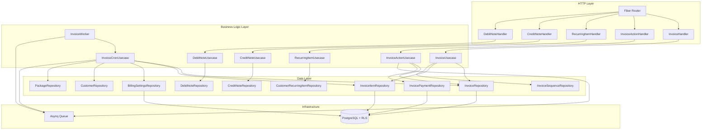
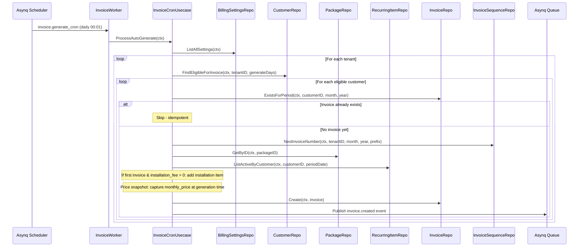
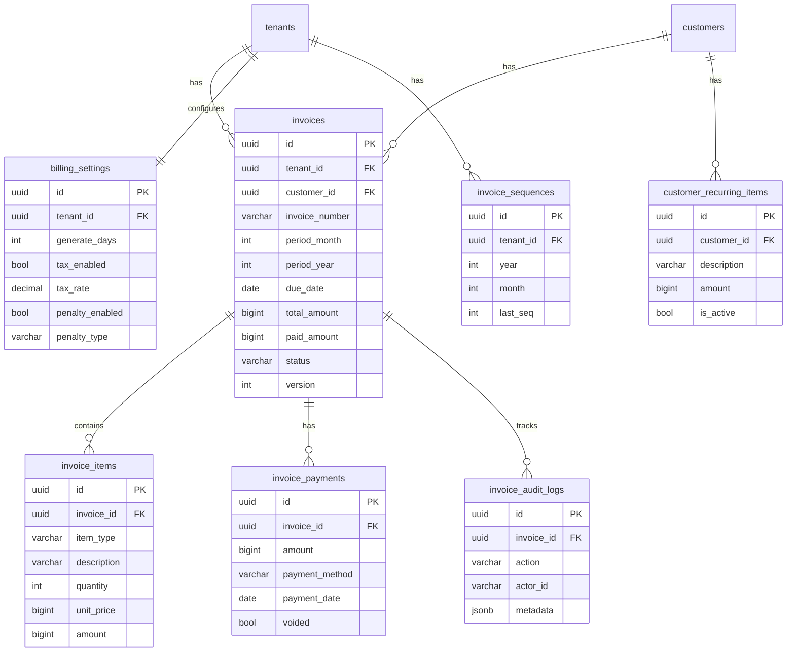

# Design Document: Invoice Generation

## Overview

The Invoice Generation module extends the ISPBoss billing-api service to handle the complete invoice lifecycle for PPPoE/Static customers. It covers automatic invoice generation via daily cron jobs, manual invoice creation, invoice status management with a formal state machine, prorate calculations for new customers and mid-cycle package changes, late fee/tax/credit balance management, recurring items, bulk actions, prepaid billing, credit/debit notes, PDF generation, and a comprehensive audit trail.

All data is tenant-scoped via PostgreSQL Row Level Security (RLS). Background jobs use the existing asynq infrastructure. The module follows the same domain-repository-usecase-handler layering established by the customer, package, reseller, and voucher modules.

### Key Design Decisions

1. **Monetary values stored as BIGINT (Rupiah)** - consistent with existing `monthly_price`, `sell_price`, `balance` fields. No floating point for money.
2. **Fixed 30-day month for prorate** - simplifies calculation, avoids calendar complexity. Matches the billing discussion document.
3. **Atomic invoice number generation** - `SELECT FOR UPDATE` on `invoice_sequences` table prevents race conditions in concurrent cron/manual creation.
4. **Optimistic locking via `version` field** - prevents double payment processing when webhook and manual recording happen simultaneously.
5. **Separate invoice audit log table** - `invoice_audit_logs` is append-only, distinct from the generic `audit_logs` table used by customer/reseller modules. This provides invoice-specific lifecycle tracking.
6. **PDF generation with maroto library** - Go-native PDF generation, no external service dependency.
7. **Credit/Debit notes as separate entities** - not invoices, but formal financial documents with their own numbering sequences.

## Architecture

### High-Level Architecture



### Data Flow: Auto-Generate Invoice



### File Structure

Following the existing module patterns (reseller, voucher), the invoice module adds these files:

```
services/billing-api/internal/
  domain/
    invoice.go              # Invoice entity, status state machine, error vars
    invoice_event.go        # Event payload structs
    invoice_prorate.go      # Prorate calculation functions (pure)
    invoice_number.go       # Invoice number formatting (pure)
    billing_settings.go     # BillingSettings entity
    credit_note.go          # CreditNote, DebitNote entities
  repository/
    invoice_repo.go         # InvoiceRepository implementation
    invoice_item_repo.go    # InvoiceItemRepository implementation
    invoice_payment_repo.go # InvoicePaymentRepository implementation
    invoice_sequence_repo.go# InvoiceSequenceRepository implementation
    invoice_audit_repo.go   # InvoiceAuditLogRepository implementation
    billing_settings_repo.go# BillingSettingsRepository implementation
    recurring_item_repo.go  # CustomerRecurringItemRepository implementation
    credit_note_repo.go     # CreditNoteRepository, DebitNoteRepository
  usecase/
    invoice_usecase.go      # CRUD: create manual, list, get, edit
    invoice_action.go       # Actions: cancel, record payment, PDF
    invoice_cron.go         # Cron: auto-generate, overdue update
    invoice_prorate.go      # Prorate invoice creation for package changes
    recurring_item_usecase.go # Recurring items CRUD
    credit_note_usecase.go  # Credit note creation
    debit_note_usecase.go   # Debit note creation
  handler/
    invoice_handler.go      # List, Get, Create, Edit, Summary
    invoice_action.go       # Cancel, PDF, Bulk actions, Export
    recurring_item_handler.go # Recurring items CRUD
    credit_note_handler.go  # Credit note endpoints
    debit_note_handler.go   # Debit note endpoints
  worker/
    invoice_worker.go       # Asynq handlers for cron jobs
```

## Components and Interfaces

### Domain Layer

#### Invoice Entity and State Machine (`domain/invoice.go`)

```go
package domain

// InvoiceStatus mendefinisikan status invoice dalam sistem.
type InvoiceStatus string

const (
    InvoiceStatusBelumBayar    InvoiceStatus = "belum_bayar"
    InvoiceStatusTerlambat     InvoiceStatus = "terlambat"
    InvoiceStatusLunas         InvoiceStatus = "lunas"
    InvoiceStatusBayarSebagian InvoiceStatus = "bayar_sebagian"
    InvoiceStatusBatal         InvoiceStatus = "batal"
    InvoiceStatusProrate       InvoiceStatus = "prorate"
)

// ValidInvoiceTransitions mendefinisikan transisi status invoice yang valid.
var ValidInvoiceTransitions = map[InvoiceStatus][]InvoiceStatus{
    InvoiceStatusBelumBayar:    {InvoiceStatusTerlambat, InvoiceStatusLunas, InvoiceStatusBayarSebagian, InvoiceStatusBatal},
    InvoiceStatusTerlambat:     {InvoiceStatusLunas, InvoiceStatusBayarSebagian, InvoiceStatusBatal},
    InvoiceStatusBayarSebagian: {InvoiceStatusLunas, InvoiceStatusBatal},
    InvoiceStatusProrate:       {InvoiceStatusLunas, InvoiceStatusBayarSebagian, InvoiceStatusBatal},
    InvoiceStatusLunas:         {}, // terminal state
    InvoiceStatusBatal:         {}, // terminal state
}

// CanInvoiceTransition memeriksa apakah transisi dari current ke target valid.
func CanInvoiceTransition(current, target InvoiceStatus) bool

// InvoiceTransition melakukan transisi status dan mengembalikan status baru.
func InvoiceTransition(current, target InvoiceStatus) (InvoiceStatus, error)

// AllowedInvoiceTargets mengembalikan daftar status tujuan yang valid.
func AllowedInvoiceTargets(current InvoiceStatus) []InvoiceStatus

// InvoiceItemType mendefinisikan tipe item invoice.
type InvoiceItemType string

const (
    ItemTypeMonthly       InvoiceItemType = "monthly"
    ItemTypeInstallation  InvoiceItemType = "installation"
    ItemTypeProrateCharge InvoiceItemType = "prorate_charge"
    ItemTypeProrateCredit InvoiceItemType = "prorate_credit"
    ItemTypePenalty       InvoiceItemType = "penalty"
    ItemTypeTax           InvoiceItemType = "tax"
    ItemTypeDiscount      InvoiceItemType = "discount"
    ItemTypeRecurring     InvoiceItemType = "recurring"
    ItemTypeCustom        InvoiceItemType = "custom"
    ItemTypeCreditApplied InvoiceItemType = "credit_applied"
)

// Invoice merepresentasikan invoice pelanggan ISP.
type Invoice struct {
    ID             string        `json:"id"`
    TenantID       string        `json:"tenant_id"`
    CustomerID     string        `json:"customer_id"`
    InvoiceNumber  string        `json:"invoice_number"`
    PeriodMonth    int           `json:"period_month"`
    PeriodYear     int           `json:"period_year"`
    DueDate        time.Time     `json:"due_date"`
    Subtotal       int64         `json:"subtotal"`
    TaxAmount      int64         `json:"tax_amount"`
    PenaltyAmount  int64         `json:"penalty_amount"`
    DiscountAmount int64         `json:"discount_amount"`
    CreditApplied  int64         `json:"credit_applied"`
    TotalAmount    int64         `json:"total_amount"`
    PaidAmount     int64         `json:"paid_amount"`
    Status         InvoiceStatus `json:"status"`
    Notes          string        `json:"notes,omitempty"`
    IsPrepaid      bool          `json:"is_prepaid"`
    PrepaidMonths  *int          `json:"prepaid_months,omitempty"`
    Version        int           `json:"version"`
    // Joined fields (dari query JOIN)
    CustomerName    string `json:"customer_name,omitempty"`
    CustomerIDSeq   string `json:"customer_id_seq,omitempty"`
    CustomerPhone   string `json:"customer_phone,omitempty"`
    CustomerAddress string `json:"customer_address,omitempty"`
    PackageName     string `json:"package_name,omitempty"`
    CreatedAt       time.Time `json:"created_at"`
    UpdatedAt       time.Time `json:"updated_at"`
}

// InvoiceItem merepresentasikan satu baris item dalam invoice.
type InvoiceItem struct {
    ID        string                 `json:"id"`
    TenantID  string                 `json:"tenant_id"`
    InvoiceID string                 `json:"invoice_id"`
    ItemType  InvoiceItemType        `json:"item_type"`
    Description string              `json:"description"`
    Quantity  int                    `json:"quantity"`
    UnitPrice int64                  `json:"unit_price"`
    Amount    int64                  `json:"amount"`
    SortOrder int                    `json:"sort_order"`
    Metadata  map[string]interface{} `json:"metadata,omitempty"`
    CreatedAt time.Time              `json:"created_at"`
}

// InvoicePayment merepresentasikan catatan pembayaran terhadap invoice.
type InvoicePayment struct {
    ID             string     `json:"id"`
    TenantID       string     `json:"tenant_id"`
    InvoiceID      string     `json:"invoice_id"`
    Amount         int64      `json:"amount"`
    PaymentMethod  string     `json:"payment_method"`
    PaymentDate    time.Time  `json:"payment_date"`
    ReferenceNumber string   `json:"reference_number,omitempty"`
    Notes          string     `json:"notes,omitempty"`
    RecordedByID   string     `json:"recorded_by_id"`
    RecordedByName string     `json:"recorded_by_name"`
    Voided         bool       `json:"voided"`
    VoidedAt       *time.Time `json:"voided_at,omitempty"`
    VoidedBy       string     `json:"voided_by,omitempty"`
    VoidReason     string     `json:"void_reason,omitempty"`
    CreatedAt      time.Time  `json:"created_at"`
}

// InvoiceAuditLog merepresentasikan catatan lifecycle invoice (append-only).
type InvoiceAuditLog struct {
    ID        string                 `json:"id"`
    TenantID  string                 `json:"tenant_id"`
    InvoiceID string                 `json:"invoice_id"`
    Action    string                 `json:"action"`
    ActorID   string                 `json:"actor_id"`
    ActorName string                 `json:"actor_name"`
    Metadata  map[string]interface{} `json:"metadata,omitempty"`
    CreatedAt time.Time              `json:"created_at"`
}

// Domain Error Variables
var (
    ErrInvoiceNotFound              = errors.New("invoice tidak ditemukan")
    ErrInvalidInvoiceStatusTransition = errors.New("transisi status invoice tidak valid")
    ErrInvoiceNotEditable           = errors.New("invoice hanya bisa diedit saat status belum_bayar")
    ErrInvoiceNotCancellable        = errors.New("invoice tidak bisa dibatalkan")
    ErrInvoiceConfirmationMismatch  = errors.New("nomor konfirmasi tidak cocok")
    ErrInvoiceDuplicate             = errors.New("invoice untuk periode ini sudah ada")
    ErrCreditNoteNotFound           = errors.New("credit note tidak ditemukan")
    ErrDebitNoteNotFound            = errors.New("debit note tidak ditemukan")
    ErrRecurringItemNotFound        = errors.New("recurring item tidak ditemukan")
    ErrBillingSettingsNotFound      = errors.New("billing settings tidak ditemukan")
)
```

#### Prorate Calculation (`domain/invoice_prorate.go`)

```go
package domain

// CalculateProrate menghitung biaya prorate berdasarkan harga dan sisa hari.
// Menggunakan 30 hari tetap per bulan. Charge dibulatkan ke atas Rp 500.
func CalculateProrate(monthlyPrice int64, remainingDays int) int64

// CalculateProrateCredit menghitung kredit prorate.
// Credit dibulatkan ke bawah Rp 500.
func CalculateProrateCredit(monthlyPrice int64, remainingDays int) int64

// RoundUpTo500 membulatkan ke atas ke kelipatan Rp 500 terdekat.
func RoundUpTo500(amount int64) int64

// RoundDownTo500 membulatkan ke bawah ke kelipatan Rp 500 terdekat.
func RoundDownTo500(amount int64) int64

// CalculateRemainingDays menghitung sisa hari dari changeDate ke nextDueDate.
// Jika hasilnya <= 0, kembalikan 0. Jika > 30, kembalikan 30.
func CalculateRemainingDays(changeDate, nextDueDate time.Time) int
```

#### Invoice Number Formatting (`domain/invoice_number.go`)

```go
package domain

// FormatInvoiceNumber memformat nomor invoice dari komponen.
// Format: {prefix}-{YYYY}-{MM}-{SEQ} dengan SEQ zero-padded minimal 3 digit.
// Contoh: INV-2026-04-001, INV-2026-04-1000
func FormatInvoiceNumber(prefix string, year, month, seq int) string

// FormatCreditNoteNumber memformat nomor credit note.
// Format: CN-{YYYY}-{MM}-{SEQ}
func FormatCreditNoteNumber(year, month, seq int) string

// FormatDebitNoteNumber memformat nomor debit note.
// Format: DN-{YYYY}-{MM}-{SEQ}
func FormatDebitNoteNumber(year, month, seq int) string
```

#### Late Fee Calculation (`domain/invoice.go`)

```go
// PenaltyType mendefinisikan tipe denda keterlambatan.
type PenaltyType string

const (
    PenaltyFixed      PenaltyType = "fixed"
    PenaltyPercentage PenaltyType = "percentage"
    PenaltyDaily      PenaltyType = "daily"
)

// CalculateLateFee menghitung denda keterlambatan berdasarkan konfigurasi.
// Mengembalikan jumlah denda yang sudah di-cap oleh maxAmount (jika > 0).
func CalculateLateFee(settings *BillingSettings, subtotal int64, daysOverdue int) int64
```

#### BillingSettings Entity (`domain/billing_settings.go`)

```go
package domain

// BillingSettings merepresentasikan konfigurasi billing per tenant.
type BillingSettings struct {
    ID                 string      `json:"id"`
    TenantID           string      `json:"tenant_id"`
    GenerateDays       int         `json:"generate_days"`
    GracePeriodDays    int         `json:"grace_period_days"`
    SuspendDays        int         `json:"suspend_days"`
    TaxEnabled         bool        `json:"tax_enabled"`
    TaxRate            float64     `json:"tax_rate"`
    PenaltyEnabled     bool        `json:"penalty_enabled"`
    PenaltyType        PenaltyType `json:"penalty_type"`
    PenaltyAmount      int64       `json:"penalty_amount"`
    PenaltyPercentage  float64     `json:"penalty_percentage"`
    PenaltyDailyAmount int64       `json:"penalty_daily_amount"`
    PenaltyMaxAmount   int64       `json:"penalty_max_amount"`
    InvoicePrefix      string      `json:"invoice_prefix"`
    NewCustomerBilling string      `json:"new_customer_billing"`
    Timezone           string      `json:"timezone"`
    AutoIsolir         bool        `json:"auto_isolir"`
    AutoOpenIsolir     bool        `json:"auto_open_isolir"`
    CreatedAt          time.Time   `json:"created_at"`
    UpdatedAt          time.Time   `json:"updated_at"`
}
```

#### Credit Note and Debit Note Entities (`domain/credit_note.go`)

```go
package domain

// CreditNote merepresentasikan nota kredit untuk penyesuaian invoice.
type CreditNote struct {
    ID              string    `json:"id"`
    TenantID        string    `json:"tenant_id"`
    CreditNoteNumber string  `json:"credit_note_number"`
    InvoiceID       string    `json:"invoice_id"`
    Amount          int64     `json:"amount"`
    Reason          string    `json:"reason"`
    ApplyToCredit   bool      `json:"apply_to_credit"`
    CreatedByID     string    `json:"created_by_id"`
    CreatedByName   string    `json:"created_by_name"`
    CreatedAt       time.Time `json:"created_at"`
}

// DebitNote merepresentasikan nota debit untuk tagihan tambahan.
type DebitNote struct {
    ID              string          `json:"id"`
    TenantID        string          `json:"tenant_id"`
    DebitNoteNumber string          `json:"debit_note_number"`
    CustomerID      string          `json:"customer_id"`
    DueDate         time.Time       `json:"due_date"`
    Items           []DebitNoteItem `json:"items"`
    TotalAmount     int64           `json:"total_amount"`
    InvoiceID       *string         `json:"invoice_id,omitempty"`
    CreatedByID     string          `json:"created_by_id"`
    CreatedByName   string          `json:"created_by_name"`
    CreatedAt       time.Time       `json:"created_at"`
}

// DebitNoteItem merepresentasikan satu item dalam debit note.
type DebitNoteItem struct {
    ID          string `json:"id"`
    DebitNoteID string `json:"debit_note_id"`
    Description string `json:"description"`
    Amount      int64  `json:"amount"`
}

// CustomerRecurringItem merepresentasikan item berulang per pelanggan.
type CustomerRecurringItem struct {
    ID          string     `json:"id"`
    TenantID    string     `json:"tenant_id"`
    CustomerID  string     `json:"customer_id"`
    Description string     `json:"description"`
    Amount      int64      `json:"amount"`
    IsActive    bool       `json:"is_active"`
    StartDate   time.Time  `json:"start_date"`
    EndDate     *time.Time `json:"end_date,omitempty"`
    CreatedAt   time.Time  `json:"created_at"`
    UpdatedAt   time.Time  `json:"updated_at"`
}
```

### Repository Interfaces

```go
// InvoiceRepository mendefinisikan operasi data untuk tabel invoices.
type InvoiceRepository interface {
    Create(ctx context.Context, invoice *Invoice) (*Invoice, error)
    GetByID(ctx context.Context, id string) (*Invoice, error)
    Update(ctx context.Context, invoice *Invoice) (*Invoice, error)
    UpdateStatus(ctx context.Context, id string, status InvoiceStatus, version int) (*Invoice, error)
    UpdatePaidAmount(ctx context.Context, id string, paidAmount int64, version int) (*Invoice, error)
    List(ctx context.Context, params InvoiceListParams) (*InvoiceListResult, error)
    ExistsForPeriod(ctx context.Context, customerID string, month, year int) (bool, error)
    ExistsForPeriodPrepaid(ctx context.Context, customerID string, month, year int) (bool, error)
    FindOverdue(ctx context.Context, currentDate time.Time) ([]*Invoice, error)
    GetSummary(ctx context.Context, tenantID string, periodMonth, periodYear *int) (*InvoiceSummary, error)
    GetByIDs(ctx context.Context, ids []string) ([]*Invoice, error)
}

// InvoiceItemRepository mendefinisikan operasi data untuk tabel invoice_items.
type InvoiceItemRepository interface {
    BulkCreate(ctx context.Context, items []*InvoiceItem) ([]*InvoiceItem, error)
    ListByInvoice(ctx context.Context, invoiceID string) ([]*InvoiceItem, error)
    DeleteByInvoice(ctx context.Context, invoiceID string) error
}

// InvoicePaymentRepository mendefinisikan operasi data untuk tabel invoice_payments.
type InvoicePaymentRepository interface {
    Create(ctx context.Context, payment *InvoicePayment) (*InvoicePayment, error)
    ListByInvoice(ctx context.Context, invoiceID string) ([]*InvoicePayment, error)
    VoidPayment(ctx context.Context, id string, voidedBy string, reason string) error
}

// InvoiceAuditLogRepository mendefinisikan operasi data untuk tabel invoice_audit_logs.
type InvoiceAuditLogRepository interface {
    Create(ctx context.Context, log *InvoiceAuditLog) error
    ListByInvoice(ctx context.Context, invoiceID string) ([]*InvoiceAuditLog, error)
}

// InvoiceSequenceRepository mendefinisikan operasi data untuk tabel invoice_sequences.
type InvoiceSequenceRepository interface {
    // NextSequence mengambil dan increment sequence secara atomik (SELECT FOR UPDATE).
    // Membuat row baru jika belum ada untuk tenant/year/month.
    NextSequence(ctx context.Context, tenantID string, year, month int) (int, error)
}

// BillingSettingsRepository mendefinisikan operasi data untuk tabel billing_settings.
type BillingSettingsRepository interface {
    GetByTenantID(ctx context.Context, tenantID string) (*BillingSettings, error)
    Upsert(ctx context.Context, settings *BillingSettings) (*BillingSettings, error)
    ListAll(ctx context.Context) ([]*BillingSettings, error)
}

// CustomerRecurringItemRepository mendefinisikan operasi data untuk tabel customer_recurring_items.
type CustomerRecurringItemRepository interface {
    Create(ctx context.Context, item *CustomerRecurringItem) (*CustomerRecurringItem, error)
    GetByID(ctx context.Context, id string) (*CustomerRecurringItem, error)
    Update(ctx context.Context, item *CustomerRecurringItem) (*CustomerRecurringItem, error)
    Deactivate(ctx context.Context, id string) error
    ListByCustomer(ctx context.Context, customerID string) ([]*CustomerRecurringItem, error)
    ListActiveByCustomer(ctx context.Context, customerID string, periodDate time.Time) ([]*CustomerRecurringItem, error)
}

// CreditNoteRepository mendefinisikan operasi data untuk credit notes.
type CreditNoteRepository interface {
    Create(ctx context.Context, cn *CreditNote) (*CreditNote, error)
    GetByID(ctx context.Context, id string) (*CreditNote, error)
    ListByInvoice(ctx context.Context, invoiceID string) ([]*CreditNote, error)
}

// DebitNoteRepository mendefinisikan operasi data untuk debit notes.
type DebitNoteRepository interface {
    Create(ctx context.Context, dn *DebitNote) (*DebitNote, error)
    GetByID(ctx context.Context, id string) (*DebitNote, error)
    ListByCustomer(ctx context.Context, customerID string) ([]*DebitNote, error)
}
```

### Usecase Interfaces

```go
// InvoiceUsecase mendefinisikan business logic untuk manajemen invoice (CRUD).
type InvoiceUsecase interface {
    Create(ctx context.Context, tenantID string, req CreateInvoiceRequest, actor ActorInfo) (*Invoice, error)
    CreatePrepaid(ctx context.Context, tenantID string, req CreatePrepaidInvoiceRequest, actor ActorInfo) (*Invoice, error)
    GetByID(ctx context.Context, id string, includeAudit bool) (*InvoiceDetail, error)
    Edit(ctx context.Context, id string, req EditInvoiceRequest, actor ActorInfo) (*Invoice, error)
    List(ctx context.Context, params InvoiceListParams) (*InvoiceListResult, error)
    Summary(ctx context.Context, tenantID string, periodMonth, periodYear *int) (*InvoiceSummary, error)
    GeneratePDF(ctx context.Context, id string) ([]byte, string, error)
}

// InvoiceActionUsecase mendefinisikan business logic untuk aksi invoice.
type InvoiceActionUsecase interface {
    Cancel(ctx context.Context, id string, req CancelInvoiceRequest, actor ActorInfo) (*Invoice, error)
    RecordPayment(ctx context.Context, invoiceID string, req RecordPaymentRequest, actor ActorInfo) (*Invoice, error)
    BulkReminder(ctx context.Context, req BulkInvoiceIDsRequest, actor ActorInfo) (*BulkActionResult, error)
    BulkCancel(ctx context.Context, req BulkCancelRequest, actor ActorInfo) (*BulkActionResult, error)
    BulkPDF(ctx context.Context, req BulkInvoiceIDsRequest) ([]byte, error)
    ExportCSV(ctx context.Context, params InvoiceListParams) ([]byte, error)
}

// InvoiceCronUsecase mendefinisikan business logic untuk cron job invoice.
type InvoiceCronUsecase interface {
    ProcessAutoGenerate(ctx context.Context) error
    ProcessOverdueUpdate(ctx context.Context) error
}

// RecurringItemUsecase mendefinisikan business logic untuk recurring items.
type RecurringItemUsecase interface {
    Create(ctx context.Context, customerID string, req CreateRecurringItemRequest, actor ActorInfo) (*CustomerRecurringItem, error)
    List(ctx context.Context, customerID string) ([]*CustomerRecurringItem, error)
    Update(ctx context.Context, customerID, itemID string, req UpdateRecurringItemRequest, actor ActorInfo) (*CustomerRecurringItem, error)
    Delete(ctx context.Context, customerID, itemID string, actor ActorInfo) error
}

// CreditNoteUsecase mendefinisikan business logic untuk credit notes.
type CreditNoteUsecase interface {
    Create(ctx context.Context, tenantID string, req CreateCreditNoteRequest, actor ActorInfo) (*CreditNote, error)
}

// DebitNoteUsecase mendefinisikan business logic untuk debit notes.
type DebitNoteUsecase interface {
    Create(ctx context.Context, tenantID string, req CreateDebitNoteRequest, actor ActorInfo) (*DebitNote, error)
}
```

### Request/Response DTOs

```go
// --- Invoice DTOs ---

type CreateInvoiceRequest struct {
    CustomerID  string                    `json:"customer_id" validate:"required,uuid"`
    DueDate     string                    `json:"due_date" validate:"required,datetime=2006-01-02"`
    Items       []CreateInvoiceItemRequest `json:"items" validate:"required,min=1,dive"`
    Notes       string                    `json:"notes" validate:"omitempty,max=1000"`
    ApplyTax    *bool                     `json:"apply_tax"`
    ApplyCredit *bool                     `json:"apply_credit"`
}

type CreateInvoiceItemRequest struct {
    Description string `json:"description" validate:"required,max=500"`
    Quantity    int    `json:"quantity" validate:"required,gt=0"`
    UnitPrice   int64  `json:"unit_price" validate:"required,gt=0"`
}

type EditInvoiceRequest struct {
    DueDate string                    `json:"due_date" validate:"omitempty,datetime=2006-01-02"`
    Items   []CreateInvoiceItemRequest `json:"items" validate:"omitempty,min=1,dive"`
    Notes   string                    `json:"notes" validate:"omitempty,max=1000"`
}

type CancelInvoiceRequest struct {
    ConfirmationNumber string `json:"confirmation_number" validate:"required"`
    Reason             string `json:"reason" validate:"required,min=5,max=500"`
}

type RecordPaymentRequest struct {
    Amount          int64  `json:"amount" validate:"required,gt=0"`
    PaymentMethod   string `json:"payment_method" validate:"required,oneof=tunai transfer xendit midtrans lainnya"`
    PaymentDate     string `json:"payment_date" validate:"required,datetime=2006-01-02"`
    ReferenceNumber string `json:"reference_number" validate:"omitempty"`
    Notes           string `json:"notes" validate:"omitempty,max=500"`
}

type CreatePrepaidInvoiceRequest struct {
    CustomerID       string `json:"customer_id" validate:"required,uuid"`
    Months           int    `json:"months" validate:"required,oneof=3 6 12"`
    StartPeriodMonth int    `json:"start_period_month" validate:"required,min=1,max=12"`
    StartPeriodYear  int    `json:"start_period_year" validate:"required"`
    DiscountMonths   int    `json:"discount_months" validate:"omitempty,gte=0"`
}

type BulkInvoiceIDsRequest struct {
    InvoiceIDs []string `json:"invoice_ids" validate:"required,min=1,dive,uuid"`
}

type BulkCancelRequest struct {
    InvoiceIDs []string `json:"invoice_ids" validate:"required,min=1,dive,uuid"`
    Reason     string   `json:"reason" validate:"required,min=5,max=500"`
}

// --- Invoice List/Detail DTOs ---

type InvoiceListParams struct {
    TenantID    string `query:"tenant_id"`
    Page        int    `query:"page" validate:"omitempty,min=1"`
    PageSize    int    `query:"page_size" validate:"omitempty,oneof=10 25 50"`
    Search      string `query:"search"`
    Status      string `query:"status" validate:"omitempty,oneof=belum_bayar terlambat lunas bayar_sebagian batal prorate"`
    PeriodMonth *int   `query:"period_month" validate:"omitempty,min=1,max=12"`
    PeriodYear  *int   `query:"period_year"`
    PackageID   string `query:"package_id" validate:"omitempty,uuid"`
    AreaID      string `query:"area_id" validate:"omitempty,uuid"`
    SortBy      string `query:"sort_by" validate:"omitempty,oneof=invoice_number due_date total_amount status created_at"`
    SortOrder   string `query:"sort_order" validate:"omitempty,oneof=asc desc"`
}

type InvoiceListResult struct {
    Data       []*Invoice     `json:"data"`
    Pagination PaginationMeta `json:"pagination"`
}

type InvoiceDetail struct {
    Invoice   *Invoice           `json:"invoice"`
    Items     []*InvoiceItem     `json:"items"`
    Payments  []*InvoicePayment  `json:"payments"`
    AuditLogs []*InvoiceAuditLog `json:"audit_logs,omitempty"`
}

type InvoiceSummary struct {
    Total          InvoiceSummaryStat            `json:"total"`
    ByStatus       map[InvoiceStatus]InvoiceSummaryStat `json:"by_status"`
}

type InvoiceSummaryStat struct {
    Count       int64 `json:"count"`
    TotalAmount int64 `json:"total_amount"`
}

// --- Recurring Item DTOs ---

type CreateRecurringItemRequest struct {
    Description string `json:"description" validate:"required,min=3,max=255"`
    Amount      int64  `json:"amount" validate:"required,gt=0"`
    StartDate   string `json:"start_date" validate:"required,datetime=2006-01-02"`
    EndDate     string `json:"end_date" validate:"omitempty,datetime=2006-01-02"`
}

type UpdateRecurringItemRequest struct {
    Description string `json:"description" validate:"omitempty,min=3,max=255"`
    Amount      *int64 `json:"amount" validate:"omitempty,gt=0"`
    EndDate     string `json:"end_date" validate:"omitempty,datetime=2006-01-02"`
}

// --- Credit/Debit Note DTOs ---

type CreateCreditNoteRequest struct {
    InvoiceID     string `json:"invoice_id" validate:"required,uuid"`
    Amount        int64  `json:"amount" validate:"required,gt=0"`
    Reason        string `json:"reason" validate:"required,min=5,max=500"`
    ApplyToCredit *bool  `json:"apply_to_credit"`
}

type CreateDebitNoteRequest struct {
    CustomerID    string                   `json:"customer_id" validate:"required,uuid"`
    Items         []DebitNoteItemRequest   `json:"items" validate:"required,min=1,dive"`
    DueDate       string                   `json:"due_date" validate:"required,datetime=2006-01-02"`
    CreateInvoice bool                     `json:"create_invoice"`
}

type DebitNoteItemRequest struct {
    Description string `json:"description" validate:"required,max=500"`
    Amount      int64  `json:"amount" validate:"required,gt=0"`
}
```

### Event Payloads (`domain/invoice_event.go`)

```go
package domain

// InvoiceCreatedPayload adalah payload event invoice.created.
type InvoiceCreatedPayload struct {
    InvoiceID     string `json:"invoice_id"`
    TenantID      string `json:"tenant_id"`
    CustomerID    string `json:"customer_id"`
    InvoiceNumber string `json:"invoice_number"`
    TotalAmount   int64  `json:"total_amount"`
    DueDate       string `json:"due_date"`
}

// InvoiceOverduePayload adalah payload event invoice.overdue.
type InvoiceOverduePayload struct {
    InvoiceID     string `json:"invoice_id"`
    TenantID      string `json:"tenant_id"`
    CustomerID    string `json:"customer_id"`
    InvoiceNumber string `json:"invoice_number"`
    TotalAmount   int64  `json:"total_amount"`
    DaysOverdue   int    `json:"days_overdue"`
}

// InvoiceCancelledPayload adalah payload event invoice.cancelled.
type InvoiceCancelledPayload struct {
    InvoiceID     string `json:"invoice_id"`
    TenantID      string `json:"tenant_id"`
    CustomerID    string `json:"customer_id"`
    InvoiceNumber string `json:"invoice_number"`
    Reason        string `json:"reason"`
}

// InvoiceReminderPayload adalah payload event invoice.reminder.
type InvoiceReminderPayload struct {
    InvoiceID     string `json:"invoice_id"`
    TenantID      string `json:"tenant_id"`
    CustomerID    string `json:"customer_id"`
    InvoiceNumber string `json:"invoice_number"`
    TotalAmount   int64  `json:"total_amount"`
    DueDate       string `json:"due_date"`
}
```

### Handler Layer

Handlers follow the same pattern as `ResellerHandler` - parse request, validate, call usecase, map errors:

```go
// InvoiceHandler menangani HTTP request untuk manajemen invoice (CRUD).
type InvoiceHandler struct {
    invoiceUsecase InvoiceUsecase
    validate       *validator.Validate
    logger         zerolog.Logger
}

// InvoiceActionHandler menangani HTTP request untuk aksi invoice.
type InvoiceActionHandler struct {
    actionUsecase InvoiceActionUsecase
    validate      *validator.Validate
    logger        zerolog.Logger
}

// RecurringItemHandler menangani HTTP request untuk recurring items.
type RecurringItemHandler struct {
    recurringUsecase RecurringItemUsecase
    validate         *validator.Validate
    logger           zerolog.Logger
}

// CreditNoteHandler menangani HTTP request untuk credit notes.
type CreditNoteHandler struct {
    creditNoteUsecase CreditNoteUsecase
    validate          *validator.Validate
    logger            zerolog.Logger
}

// DebitNoteHandler menangani HTTP request untuk debit notes.
type DebitNoteHandler struct {
    debitNoteUsecase DebitNoteUsecase
    validate         *validator.Validate
    logger           zerolog.Logger
}
```

### Worker Layer (`worker/invoice_worker.go`)

```go
const (
    TaskInvoiceGenerateCron = "invoice.generate_cron"
    TaskInvoiceOverdueCron  = "invoice.overdue_cron"
)

// InvoiceWorker menangani task asynq terkait invoice.
type InvoiceWorker struct {
    cronUsecase InvoiceCronUsecase
    logger      zerolog.Logger
}

// RegisterHandlers mendaftarkan handler ke asynq ServeMux.
func (w *InvoiceWorker) RegisterHandlers(mux *asynq.ServeMux)
```

### Router Registration

New routes added to `RegisterRoutes` in `handler/router.go`:

```go
// --- Invoice routes (auth + tenant + RBAC) ---
invoices := api.Group("/invoices")

// Read: admin, operator, kasir(GET only)
invoicesRead := invoices.Group("")
invoicesRead.Use(middleware.RBAC(domain.RBACConfig{
    AllowedRoles: []domain.UserRole{
        domain.RoleTenantAdmin, domain.RoleOperator, domain.RoleKasir,
    },
    MethodRestrictions: map[domain.UserRole][]string{
        domain.RoleKasir: {"GET"},
    },
}))
invoicesRead.Get("/", invoiceHandler.List)
invoicesRead.Get("/summary", invoiceHandler.Summary)
invoicesRead.Get("/:id", invoiceHandler.Get)
invoicesRead.Get("/:id/pdf", invoiceHandler.PDF)
invoicesRead.Get("/:id/audit-logs", invoiceHandler.AuditLogs)

// Write: admin, kasir (record payment)
invoicesWrite := invoices.Group("")
invoicesWrite.Use(middleware.RBAC(domain.RBACConfig{
    AllowedRoles: []domain.UserRole{
        domain.RoleTenantAdmin, domain.RoleKasir,
    },
}))
invoicesWrite.Post("/:id/payment", invoiceActionHandler.RecordPayment)

// Admin only: create, edit, cancel, bulk, export, prepaid
invoicesAdmin := invoices.Group("")
invoicesAdmin.Use(middleware.RBAC(domain.RBACConfig{
    AllowedRoles: []domain.UserRole{domain.RoleTenantAdmin},
}))
invoicesAdmin.Post("/", invoiceHandler.Create)
invoicesAdmin.Post("/prepaid", invoiceHandler.CreatePrepaid)
invoicesAdmin.Put("/:id", invoiceHandler.Edit)
invoicesAdmin.Post("/:id/cancel", invoiceActionHandler.Cancel)
invoicesAdmin.Post("/bulk/reminder", invoiceActionHandler.BulkReminder)
invoicesAdmin.Post("/bulk/cancel", invoiceActionHandler.BulkCancel)
invoicesAdmin.Post("/bulk/pdf", invoiceActionHandler.BulkPDF)
invoicesAdmin.Get("/export", invoiceActionHandler.ExportCSV)

// --- Recurring items (nested under customers) ---
recurringItems := api.Group("/customers/:id/recurring-items")
recurringItems.Use(middleware.RBAC(domain.RBACConfig{
    AllowedRoles: []domain.UserRole{domain.RoleTenantAdmin},
}))
recurringItems.Get("/", recurringItemHandler.List)
recurringItems.Post("/", recurringItemHandler.Create)
recurringItems.Put("/:item_id", recurringItemHandler.Update)
recurringItems.Delete("/:item_id", recurringItemHandler.Delete)

// --- Credit/Debit notes ---
creditNotes := api.Group("/credit-notes")
creditNotes.Use(middleware.RBAC(domain.RBACConfig{
    AllowedRoles: []domain.UserRole{domain.RoleTenantAdmin},
}))
creditNotes.Post("/", creditNoteHandler.Create)

debitNotes := api.Group("/debit-notes")
debitNotes.Use(middleware.RBAC(domain.RBACConfig{
    AllowedRoles: []domain.UserRole{domain.RoleTenantAdmin},
}))
debitNotes.Post("/", debitNoteHandler.Create)
```

## Data Models

### Database Schema

#### `invoices` Table

| Column | Type | Constraints | Description |
|--------|------|-------------|-------------|
| id | UUID | PK, DEFAULT gen_random_uuid() | Primary key |
| tenant_id | UUID | FK NOT NULL | Tenant isolation |
| customer_id | UUID | FK NOT NULL REFERENCES customers(id) | Pelanggan terkait |
| invoice_number | VARCHAR | NOT NULL | Nomor invoice unik per tenant |
| period_month | INTEGER | NOT NULL, CHECK 1-12 | Bulan periode tagihan |
| period_year | INTEGER | NOT NULL | Tahun periode tagihan |
| due_date | DATE | NOT NULL | Tanggal jatuh tempo |
| subtotal | BIGINT | NOT NULL DEFAULT 0, CHECK >= 0 | Subtotal sebelum pajak/denda |
| tax_amount | BIGINT | NOT NULL DEFAULT 0, CHECK >= 0 | Jumlah pajak |
| penalty_amount | BIGINT | NOT NULL DEFAULT 0, CHECK >= 0 | Jumlah denda |
| discount_amount | BIGINT | NOT NULL DEFAULT 0, CHECK >= 0 | Jumlah diskon |
| credit_applied | BIGINT | NOT NULL DEFAULT 0, CHECK >= 0 | Kredit yang diterapkan |
| total_amount | BIGINT | NOT NULL DEFAULT 0, CHECK >= 0 | Total tagihan |
| paid_amount | BIGINT | NOT NULL DEFAULT 0, CHECK >= 0 | Total yang sudah dibayar |
| status | VARCHAR | NOT NULL DEFAULT 'belum_bayar', CHECK IN (...) | Status invoice |
| notes | TEXT | | Catatan opsional |
| is_prepaid | BOOLEAN | NOT NULL DEFAULT FALSE | Apakah invoice prepaid |
| prepaid_months | INTEGER | | Jumlah bulan prepaid |
| version | INTEGER | NOT NULL DEFAULT 1 | Optimistic locking |
| created_at | TIMESTAMPTZ | DEFAULT NOW() | Waktu pembuatan |
| updated_at | TIMESTAMPTZ | DEFAULT NOW() | Waktu update terakhir |

**Indexes:**
- UNIQUE (tenant_id, invoice_number)
- (tenant_id, status)
- (tenant_id, customer_id)
- (tenant_id, period_year, period_month)
- (tenant_id, due_date, status)

**RLS:** Enabled with tenant isolation policies.

#### `invoice_items` Table

| Column | Type | Constraints | Description |
|--------|------|-------------|-------------|
| id | UUID | PK | Primary key |
| tenant_id | UUID | FK NOT NULL | Tenant isolation |
| invoice_id | UUID | FK NOT NULL REFERENCES invoices(id) | Invoice terkait |
| item_type | VARCHAR | NOT NULL, CHECK IN (...) | Tipe item |
| description | VARCHAR | NOT NULL | Deskripsi item |
| quantity | INTEGER | NOT NULL DEFAULT 1 | Jumlah |
| unit_price | BIGINT | NOT NULL | Harga satuan (Rupiah) |
| amount | BIGINT | NOT NULL | Total = quantity * unit_price |
| sort_order | INTEGER | NOT NULL DEFAULT 0 | Urutan tampilan |
| metadata | JSONB | | Data tambahan |
| created_at | TIMESTAMPTZ | DEFAULT NOW() | Waktu pembuatan |

**Indexes:** (tenant_id, invoice_id)

#### `invoice_payments` Table

| Column | Type | Constraints | Description |
|--------|------|-------------|-------------|
| id | UUID | PK | Primary key |
| tenant_id | UUID | FK NOT NULL | Tenant isolation |
| invoice_id | UUID | FK NOT NULL REFERENCES invoices(id) | Invoice terkait |
| amount | BIGINT | NOT NULL, CHECK > 0 | Jumlah pembayaran |
| payment_method | VARCHAR | NOT NULL, CHECK IN (...) | Metode pembayaran |
| payment_date | DATE | NOT NULL | Tanggal pembayaran |
| reference_number | VARCHAR | | Nomor referensi |
| notes | TEXT | | Catatan |
| recorded_by_id | UUID | NOT NULL | ID user yang mencatat |
| recorded_by_name | VARCHAR | NOT NULL | Nama user yang mencatat |
| voided | BOOLEAN | NOT NULL DEFAULT FALSE | Apakah dibatalkan |
| voided_at | TIMESTAMPTZ | | Waktu pembatalan |
| voided_by | VARCHAR | | Siapa yang membatalkan |
| void_reason | TEXT | | Alasan pembatalan |
| created_at | TIMESTAMPTZ | DEFAULT NOW() | Waktu pembuatan |

**Indexes:** (tenant_id, invoice_id), (tenant_id, payment_date)

#### `billing_settings` Table

| Column | Type | Constraints | Description |
|--------|------|-------------|-------------|
| id | UUID | PK | Primary key |
| tenant_id | UUID | FK NOT NULL UNIQUE | Satu setting per tenant |
| generate_days | INTEGER | NOT NULL DEFAULT 5, CHECK 1-14 | Hari sebelum jatuh tempo |
| grace_period_days | INTEGER | NOT NULL DEFAULT 7 | Grace period (hari) |
| suspend_days | INTEGER | NOT NULL DEFAULT 30 | Batas toleransi (hari) |
| tax_enabled | BOOLEAN | NOT NULL DEFAULT FALSE | Pajak aktif |
| tax_rate | DECIMAL(5,2) | NOT NULL DEFAULT 11.00 | Persentase pajak |
| penalty_enabled | BOOLEAN | NOT NULL DEFAULT FALSE | Denda aktif |
| penalty_type | VARCHAR | NOT NULL DEFAULT 'fixed', CHECK IN (...) | Tipe denda |
| penalty_amount | BIGINT | NOT NULL DEFAULT 0 | Denda tetap (Rupiah) |
| penalty_percentage | DECIMAL(5,2) | NOT NULL DEFAULT 0 | Denda persentase |
| penalty_daily_amount | BIGINT | NOT NULL DEFAULT 0 | Denda harian (Rupiah) |
| penalty_max_amount | BIGINT | NOT NULL DEFAULT 0 | Batas maksimum denda |
| invoice_prefix | VARCHAR | NOT NULL DEFAULT 'INV' | Prefix nomor invoice |
| new_customer_billing | VARCHAR | NOT NULL DEFAULT 'prorate', CHECK IN (...) | Billing pelanggan baru |
| timezone | VARCHAR | NOT NULL DEFAULT 'Asia/Jakarta' | Timezone cron job |
| auto_isolir | BOOLEAN | NOT NULL DEFAULT TRUE | Auto-isolir aktif |
| auto_open_isolir | BOOLEAN | NOT NULL DEFAULT TRUE | Auto-buka isolir aktif |
| created_at | TIMESTAMPTZ | DEFAULT NOW() | Waktu pembuatan |
| updated_at | TIMESTAMPTZ | DEFAULT NOW() | Waktu update terakhir |

#### `customer_recurring_items` Table

| Column | Type | Constraints | Description |
|--------|------|-------------|-------------|
| id | UUID | PK | Primary key |
| tenant_id | UUID | FK NOT NULL | Tenant isolation |
| customer_id | UUID | FK NOT NULL REFERENCES customers(id) | Pelanggan terkait |
| description | VARCHAR | NOT NULL | Deskripsi item |
| amount | BIGINT | NOT NULL, CHECK > 0 | Jumlah (Rupiah) |
| is_active | BOOLEAN | NOT NULL DEFAULT TRUE | Status aktif |
| start_date | DATE | NOT NULL | Tanggal mulai |
| end_date | DATE | | Tanggal berakhir (opsional) |
| created_at | TIMESTAMPTZ | DEFAULT NOW() | Waktu pembuatan |
| updated_at | TIMESTAMPTZ | DEFAULT NOW() | Waktu update terakhir |

**Indexes:** (tenant_id, customer_id, is_active)

#### `invoice_audit_logs` Table

| Column | Type | Constraints | Description |
|--------|------|-------------|-------------|
| id | UUID | PK | Primary key |
| tenant_id | UUID | FK NOT NULL | Tenant isolation |
| invoice_id | UUID | FK NOT NULL REFERENCES invoices(id) | Invoice terkait |
| action | VARCHAR | NOT NULL | Aksi yang dilakukan |
| actor_id | VARCHAR | NOT NULL | ID aktor |
| actor_name | VARCHAR | NOT NULL | Nama aktor |
| metadata | JSONB | | Data tambahan |
| created_at | TIMESTAMPTZ | DEFAULT NOW() | Waktu pembuatan |

**Indexes:** (tenant_id, invoice_id)
**Policy:** Append-only (no UPDATE/DELETE)

#### `invoice_sequences` Table

| Column | Type | Constraints | Description |
|--------|------|-------------|-------------|
| id | UUID | PK | Primary key |
| tenant_id | UUID | FK NOT NULL | Tenant |
| year | INTEGER | NOT NULL | Tahun |
| month | INTEGER | NOT NULL | Bulan |
| last_seq | INTEGER | NOT NULL DEFAULT 0 | Sequence terakhir |
| created_at | TIMESTAMPTZ | DEFAULT NOW() | Waktu pembuatan |
| updated_at | TIMESTAMPTZ | DEFAULT NOW() | Waktu update terakhir |

**Unique:** (tenant_id, year, month)

### Entity Relationship Diagram



## Correctness Properties

*A property is a characteristic or behavior that should hold true across all valid executions of a system - essentially, a formal statement about what the system should do. Properties serve as the bridge between human-readable specifications and machine-verifiable correctness guarantees.*

### Property 1: Invoice item amount consistency

*For any* invoice item with a positive quantity and positive unit_price, the computed `amount` SHALL equal `quantity * unit_price`.

**Validates: Requirements 2.5**

### Property 2: Invoice number format round-trip

*For any* valid prefix (non-empty alphanumeric string), year (2000-2099), month (1-12), and sequence number (positive integer), `FormatInvoiceNumber(prefix, year, month, seq)` SHALL produce a string matching the pattern `{prefix}-{YYYY}-{MM}-{SEQ}` where SEQ is zero-padded to at least 3 digits, and parsing the components back from the formatted string SHALL yield the original prefix, year, month, and sequence.

**Validates: Requirements 7.4**

### Property 3: Invoice status state machine determinism

*For any* valid invoice status and *for any* target status, if the transition is defined in `ValidInvoiceTransitions`, then `InvoiceTransition(current, target)` SHALL return the target status with no error. If the transition is not defined, it SHALL return the current status with an error. Terminal states (`lunas`, `batal`) SHALL have no valid outgoing transitions.

**Validates: Requirements 9.1, 9.3**

### Property 4: Invoice total amount invariant

*For any* invoice with non-negative subtotal, tax_amount, penalty_amount, discount_amount, and credit_applied, the `total_amount` SHALL equal `subtotal + tax_amount + penalty_amount - discount_amount - credit_applied`, and `total_amount` SHALL be greater than or equal to 0.

**Validates: Requirements 14.5**

### Property 5: Tax calculated on subtotal excluding penalty

*For any* positive subtotal and positive tax_rate, the tax amount SHALL equal `round(subtotal * tax_rate / 100)` where the subtotal is the sum of non-tax, non-penalty line items. The penalty amount SHALL NOT affect the tax calculation.

**Validates: Requirements 8.5, 20.2, 20.4**

### Property 6: Credit application bounded

*For any* customer with a non-negative credit_balance and *for any* invoice with a positive total_amount, the credit applied to the invoice SHALL equal `min(credit_balance, total_amount)`, and the resulting customer credit_balance SHALL equal `original_credit_balance - credit_applied`.

**Validates: Requirements 8.6, 21.2**

### Property 7: Credit balance non-negative invariant

*For any* sequence of credit operations (apply credit to invoice, restore credit on cancel, add overpayment credit), the customer's `credit_balance` SHALL remain greater than or equal to 0 at all times.

**Validates: Requirements 21.5**

### Property 8: Credit restoration on cancel round-trip

*For any* invoice with `credit_applied > 0`, cancelling the invoice SHALL increase the customer's `credit_balance` by exactly the `credit_applied` amount, effectively reversing the credit application.

**Validates: Requirements 15.4, 21.4**

### Property 9: Prorate calculation correctness

*For any* monthly_price (positive), remaining_days (1-30), old_price, and new_price (both positive):
- For new customer prorate: `CalculateProrate(monthly_price, remaining_days)` SHALL return `RoundUpTo500(monthly_price * remaining_days / 30)` and the result SHALL be non-negative.
- For upgrade (new_price > old_price): the prorate charge SHALL equal `RoundUpTo500((new_price - old_price) * remaining_days / 30)` and SHALL be non-negative.
- For downgrade (old_price > new_price): the prorate credit SHALL equal `RoundDownTo500((old_price - new_price) * remaining_days / 30)` and SHALL be non-negative.

**Validates: Requirements 17.1, 18.1, 18.2, 18.7**

### Property 10: Rounding functions correctness

*For any* non-negative integer amount:
- `RoundUpTo500(amount)` SHALL be >= amount, SHALL be a multiple of 500, and SHALL satisfy `RoundUpTo500(amount) - amount < 500`.
- `RoundDownTo500(amount)` SHALL be <= amount, SHALL be a multiple of 500, and SHALL satisfy `amount - RoundDownTo500(amount) < 500`.
- `RoundUpTo500(amount)` SHALL be idempotent: `RoundUpTo500(RoundUpTo500(amount)) == RoundUpTo500(amount)`.
- `RoundDownTo500(amount)` SHALL be idempotent: `RoundDownTo500(RoundDownTo500(amount)) == RoundDownTo500(amount)`.

**Validates: Requirements 17.3, 18.5**

### Property 11: Late fee capped by max amount

*For any* billing settings with `penalty_enabled = true` and `penalty_max_amount > 0`, and *for any* subtotal and days_overdue, `CalculateLateFee(settings, subtotal, daysOverdue)` SHALL return a value less than or equal to `penalty_max_amount`.

**Validates: Requirements 19.5**

### Property 12: Only belum_bayar invoices are editable

*For any* invoice whose status is NOT `belum_bayar`, attempting to edit the invoice SHALL return an `ErrInvoiceNotEditable` error and the invoice SHALL remain unchanged.

**Validates: Requirements 14.2**

### Property 13: Overpayment becomes credit

*For any* invoice with remaining balance `R = total_amount - paid_amount` where `R > 0`, and *for any* payment amount `P > R`, the excess `P - R` SHALL be added to the customer's `credit_balance`, the invoice's `paid_amount` SHALL become `total_amount`, and the invoice status SHALL transition to `lunas`.

**Validates: Requirements 21.1**

### Property 14: Price snapshot immutability

*For any* generated invoice, the `unit_price` stored in each invoice item represents a point-in-time snapshot of the price at generation time. *For any* subsequent package price change, the `unit_price` in existing invoice items SHALL remain unchanged. This applies to all invoice statuses including `belum_bayar`, `terlambat`, `bayar_sebagian`, and `prorate`.

**Validates: Requirements 30.1, 30.2, 30.4**

### Property 15: Installation fee only on first invoice

*For any* customer with a package that has `installation_fee > 0`, the auto-generate cron job SHALL include an installation fee line item (`item_type` = `installation`) only on the customer's first invoice. *For any* subsequent invoice for the same customer, the installation fee SHALL NOT be included.

**Validates: Requirements 29.1, 29.2, 29.3**

## Error Handling

### Domain Error Mapping

| Domain Error | HTTP Status | Error Code | Description |
|---|---|---|---|
| `ErrInvoiceNotFound` | 404 | `INVOICE_NOT_FOUND` | Invoice tidak ditemukan atau milik tenant lain |
| `ErrInvalidInvoiceStatusTransition` | 422 | `INVALID_INVOICE_STATUS_TRANSITION` | Transisi status tidak valid, sertakan status saat ini dan daftar target yang diizinkan |
| `ErrInvoiceNotEditable` | 422 | `INVOICE_NOT_EDITABLE` | Invoice hanya bisa diedit saat status belum_bayar |
| `ErrInvoiceNotCancellable` | 422 | `INVOICE_NOT_CANCELLABLE` | Invoice dengan status lunas atau batal tidak bisa dibatalkan |
| `ErrInvoiceConfirmationMismatch` | 400 | `CONFIRMATION_MISMATCH` | Nomor konfirmasi tidak cocok dengan nomor invoice |
| `ErrInvoiceDuplicate` | 409 | `INVOICE_DUPLICATE` | Invoice untuk customer dan periode ini sudah ada |
| `ErrCustomerNotFound` | 404 | `CUSTOMER_NOT_FOUND` | Customer tidak ditemukan |
| `ErrCreditNoteNotFound` | 404 | `CREDIT_NOTE_NOT_FOUND` | Credit note tidak ditemukan |
| `ErrDebitNoteNotFound` | 404 | `DEBIT_NOTE_NOT_FOUND` | Debit note tidak ditemukan |
| `ErrRecurringItemNotFound` | 404 | `RECURRING_ITEM_NOT_FOUND` | Recurring item tidak ditemukan |
| `ErrBillingSettingsNotFound` | 404 | `BILLING_SETTINGS_NOT_FOUND` | Billing settings belum dikonfigurasi untuk tenant |
| Validation errors | 400 | `VALIDATION_ERROR` | Validasi input gagal, sertakan detail per field |
| Optimistic lock conflict | 409 | `VERSION_CONFLICT` | Invoice sudah diubah oleh proses lain (double payment prevention) |
| Internal errors | 500 | `INTERNAL_ERROR` | Error internal, log detail ke zerolog |

### Error Response Format

Follows the existing `domain.ErrorResponse` pattern:

```json
{
  "success": false,
  "error": {
    "code": "INVALID_INVOICE_STATUS_TRANSITION",
    "message": "transisi dari lunas ke batal tidak diizinkan, transisi yang diizinkan: (tidak ada)",
    "details": []
  }
}
```

### Cron Job Error Handling

- Cron jobs process each tenant/customer independently. A failure for one customer does not block others.
- Errors are logged with `zerolog` at ERROR level with tenant_id, customer_id, and error details.
- Failed invoice generations are retried on the next cron run (idempotent design ensures no duplicates).
- If the entire cron job fails (e.g., database connection lost), asynq's built-in retry mechanism handles re-execution.

### Optimistic Locking for Payment Recording

When recording a payment, the usecase:
1. Reads the invoice with its current `version`
2. Validates the payment
3. Updates `paid_amount` and `status` with a `WHERE version = ?` clause
4. If the update affects 0 rows, returns `VERSION_CONFLICT` error
5. The caller (handler or webhook) retries by re-reading the invoice

This prevents double payment when a webhook and manual recording happen simultaneously.

## Testing Strategy

### Dual Testing Approach

The invoice generation module uses both unit tests and property-based tests for comprehensive coverage.

**Property-Based Tests (using `pgregory.net/rapid`):**
- Minimum 100 iterations per property test
- Each test references its design document property
- Tag format: `Feature: invoice-generation, Property {number}: {property_text}`
- Focus on pure domain functions: prorate calculation, rounding, state machine, invoice number formatting, late fee calculation, total amount computation, credit operations

**Unit Tests (example-based):**
- Specific examples for each API endpoint (handler tests)
- Integration tests for repository layer with test database
- Edge cases: zero amounts, boundary dates, maximum sequence numbers
- Error conditions: invalid inputs, not found, permission denied

### Test Organization

```
services/billing-api/internal/
  domain/
    invoice_test.go          # State machine property tests + unit tests
    invoice_prorate_test.go  # Prorate calculation property tests
    invoice_number_test.go   # Number formatting property tests
  handler/
    invoice_handler_test.go  # Handler unit tests (validation, error mapping)
  usecase/
    invoice_usecase_test.go  # Usecase unit tests with mocked repos
    invoice_cron_test.go     # Cron usecase tests
```

### Property Test Configuration

- Library: `pgregory.net/rapid` (already used in the project for handler validation tests)
- Minimum iterations: 100 per property
- Each property test tagged with design document reference
- Generators for domain types: InvoiceStatus, InvoiceItemType, monetary amounts (int64 > 0), dates, strings

### What Is NOT Property Tested

- Database migrations and schema (smoke tests)
- HTTP handler request/response cycle (example-based unit tests)
- Asynq worker registration and cron scheduling (integration tests)
- PDF generation output (example-based test verifying non-empty output)
- Event publishing side effects (mock-based unit tests)