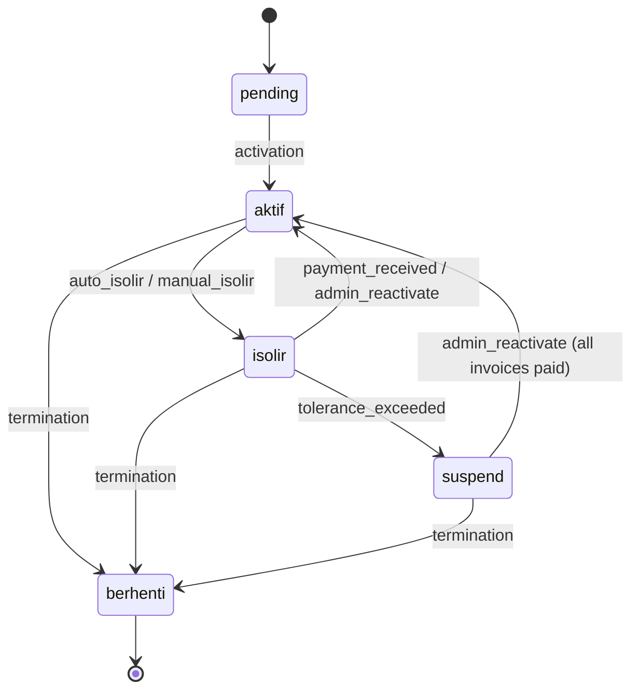

# Design Document: Isolir System

## Overview

The Isolir System automates customer isolation (isolir), un-isolation (buka isolir), and suspension workflows within the ISPBoss billing platform. It extends the existing billing-api service with:

1. **Auto-Isolir Cron** — Daily job that transitions customers with overdue invoices past the grace period from `aktif` to `isolir`, publishes events for downstream MikroTik and notification modules.
2. **Auto-Buka Isolir** — Event-driven handler that listens for `payment.online.received` and `payment.recorded` events, transitioning customers from `isolir` back to `aktif` when all invoices are settled.
3. **Suspend Cron** — Daily job that transitions long-overdue isolated customers from `isolir` to `suspend`.
4. **Pending Sync Tracking** — A dedicated `pending_syncs` table and periodic retry mechanism with exponential backoff for router synchronization operations.
5. **Late Fee Processing** — Pure domain function `CalculateLateFee` (already exists) integrated into the overdue cron to add penalty line items to invoices.
6. **Admin APIs** — Manual sync trigger, pending sync status, late fee waive, customer reactivation, and dashboard summary endpoints.

All operations are tenant-scoped via PostgreSQL RLS. Events use the existing `queue.TaskEnvelope` pattern. The module follows the established Domain → Repository → Usecase → Handler → Worker layering.

### Key Design Decisions

| Decision | Choice | Rationale |
|---|---|---|
| Extend `billing_settings` | New ALTER migration (000031) | `BillingSettings` struct already has `auto_isolir`, `auto_open_isolir`, `timezone` fields in Go code; migration adds columns to match |
| Isolir cron vs overdue cron | Separate cron jobs, isolir runs after overdue (01:00 vs 00:05) | Overdue cron transitions invoice status first; isolir cron reads the resulting `terlambat` status |
| Event publishing | Reuse `queue.TaskEnvelope` | Consistent with existing `customer.created`, `invoice.overdue` patterns |
| Un-isolir trigger | New `IsolirWorker` handler for `payment.online.received` and `payment.recorded` events | Decoupled from webhook usecase; worker dispatches to `IsolirUsecase` |
| Pending sync retry | Exponential backoff stored in DB, periodic 15-min sweep | Matches the retry schedule from requirements (immediate → 5m → 30m → 2h → 6h) |
| Late fee calculation | Pure function `CalculateLateFee` in domain (already exists) | Enables property-based testing without side effects |
| Timezone handling | `time.LoadLocation(settings.Timezone)` with fallback to `Asia/Jakarta` | Standard Go timezone handling; tenant timezone stored in `billing_settings` |

## Architecture

```mermaid
graph TB
    subgraph "Cron Scheduler (asynq)"
        CRON_ISOLIR["isolir.auto_isolir_cron<br/>01:00 daily"]
        CRON_SUSPEND["isolir.suspend_cron<br/>02:00 daily"]
        CRON_SYNC["isolir.periodic_sync<br/>every 15 min"]
    end

    subgraph "Event Queue (Redis/asynq)"
        EVT_PAY_ONLINE["payment.online.received"]
        EVT_PAY_RECORDED["payment.recorded"]
        EVT_PAY_VOID["payment.voided.re_isolir"]
        EVT_ISOLIR["customer.isolir"]
        EVT_UN_ISOLIR["customer.un_isolir"]
        EVT_SUSPEND["customer.suspend"]
        EVT_NOTIF["notification.*"]
        EVT_PENALTY["invoice.penalty_added"]
    end

    subgraph "IsolirWorker"
        W_ISOLIR["handleAutoIsolirCron"]
        W_SUSPEND["handleSuspendCron"]
        W_SYNC["handlePeriodicSync"]
        W_PAY_ONLINE["handlePaymentOnlineReceived"]
        W_PAY_RECORDED["handlePaymentRecorded"]
        W_VOID_REISOLIR["handlePaymentVoidedReIsolir"]
    end

    subgraph "IsolirUsecase"
        UC_ISOLIR["ProcessAutoIsolir"]
        UC_SUSPEND["ProcessSuspend"]
        UC_SYNC["ProcessPeriodicSync"]
        UC_UN_ISOLIR["ProcessUnIsolir"]
        UC_PENALTY["ProcessLateFee"]
    end

    subgraph "IsolirHandler (HTTP)"
        H_SYNC_ONE["POST /v1/isolir/sync/:customer_id"]
        H_SYNC_ALL["POST /v1/isolir/sync-all"]
        H_PENDING["GET /v1/isolir/pending-syncs"]
        H_SUMMARY["GET /v1/isolir/summary"]
        H_WAIVE["POST /v1/invoices/:id/waive-penalty"]
        H_REACTIVATE["POST /v1/customers/:id/reactivate"]
    end

    subgraph "Database (PostgreSQL)"
        DB_CUSTOMERS["customers"]
        DB_INVOICES["invoices"]
        DB_INVOICE_ITEMS["invoice_items"]
        DB_PENDING_SYNCS["pending_syncs"]
        DB_BILLING_SETTINGS["billing_settings"]
        DB_AUDIT["invoice_audit_logs"]
    end

    CRON_ISOLIR --> W_ISOLIR --> UC_ISOLIR
    CRON_SUSPEND --> W_SUSPEND --> UC_SUSPEND
    CRON_SYNC --> W_SYNC --> UC_SYNC

    EVT_PAY_ONLINE --> W_PAY_ONLINE --> UC_UN_ISOLIR
    EVT_PAY_RECORDED --> W_PAY_RECORDED --> UC_UN_ISOLIR
    EVT_PAY_VOID --> W_VOID_REISOLIR --> UC_ISOLIR

    UC_ISOLIR --> DB_CUSTOMERS
    UC_ISOLIR --> DB_INVOICES
    UC_ISOLIR --> DB_PENDING_SYNCS
    UC_ISOLIR --> DB_AUDIT
    UC_ISOLIR --> EVT_ISOLIR
    UC_ISOLIR --> EVT_NOTIF
    UC_ISOLIR --> UC_PENALTY

    UC_UN_ISOLIR --> DB_CUSTOMERS
    UC_UN_ISOLIR --> DB_INVOICES
    UC_UN_ISOLIR --> DB_PENDING_SYNCS
    UC_UN_ISOLIR --> DB_AUDIT
    UC_UN_ISOLIR --> EVT_UN_ISOLIR
    UC_UN_ISOLIR --> EVT_NOTIF

    UC_SUSPEND --> DB_CUSTOMERS
    UC_SUSPEND --> DB_INVOICES
    UC_SUSPEND --> DB_PENDING_SYNCS
    UC_SUSPEND --> DB_AUDIT
    UC_SUSPEND --> EVT_SUSPEND
    UC_SUSPEND --> EVT_NOTIF

    UC_SYNC --> DB_PENDING_SYNCS
    UC_SYNC --> EVT_ISOLIR
    UC_SYNC --> EVT_UN_ISOLIR
    UC_SYNC --> EVT_SUSPEND
    UC_SYNC --> EVT_NOTIF

    UC_PENALTY --> DB_INVOICES
    UC_PENALTY --> DB_INVOICE_ITEMS
    UC_PENALTY --> DB_AUDIT
    UC_PENALTY --> EVT_PENALTY

    H_SYNC_ONE --> UC_SYNC
    H_SYNC_ALL --> UC_SYNC
    H_PENDING --> DB_PENDING_SYNCS
    H_SUMMARY --> DB_CUSTOMERS
    H_SUMMARY --> DB_INVOICES
    H_SUMMARY --> DB_PENDING_SYNCS
    H_WAIVE --> UC_PENALTY
    H_REACTIVATE --> UC_UN_ISOLIR
```



### Customer Status State Machine (Extended)

The existing state machine already supports the required transitions:



## Components and Interfaces

### New Files

| Layer | File | Responsibility | Max Lines |
|---|---|---|---|
| Domain | `domain/isolir.go` | PendingSync entity, event payloads, backoff calculation, domain errors | ~150 |
| Domain | `domain/isolir_event.go` | CustomerIsolirPayload, CustomerUnIsolirPayload, CustomerSuspendPayload, PenaltyAddedPayload | ~80 |
| Repository | `repository/pending_sync_repo.go` | CRUD for pending_syncs table | ~180 |
| Usecase | `usecase/isolir_usecase.go` | ProcessAutoIsolir, ProcessSuspend core logic | ~200 |
| Usecase | `usecase/isolir_unisolir.go` | ProcessUnIsolir, ProcessReactivate logic | ~180 |
| Usecase | `usecase/isolir_sync.go` | ProcessPeriodicSync, ManualSync, ManualSyncAll | ~150 |
| Usecase | `usecase/isolir_penalty.go` | ProcessLateFee, WaivePenalty logic | ~150 |
| Usecase | `usecase/isolir_summary.go` | GetDashboardSummary, GetPendingSyncs | ~100 |
| Handler | `handler/isolir_handler.go` | HTTP handlers for isolir APIs | ~200 |
| Worker | `worker/isolir_worker.go` | Asynq task handlers for cron and event processing | ~200 |
| Migration | `migrations/000031_create_pending_syncs.up.sql` | Create pending_syncs table with RLS | ~60 |
| Migration | `migrations/000031_create_pending_syncs.down.sql` | Drop pending_syncs table | ~5 |

### Modified Files

| File | Changes |
|---|---|
| `cmd/main.go` | Instantiate PendingSyncRepo, IsolirUsecase, IsolirHandler, IsolirWorker; register routes and cron jobs |
| `handler/router.go` | Add isolir route group, waive-penalty route, reactivate route |
| `domain/repository.go` | Add PendingSyncRepository interface, extend InvoiceRepository with isolir-specific queries |

### Domain Layer — `domain/isolir.go`

```go
// isolir.go berisi entity PendingSync, konstanta, dan fungsi domain untuk modul isolir.
package domain

// --- Pending Sync Operation Type ---
type SyncOperationType string

const (
    SyncOpIsolir   SyncOperationType = "isolir"
    SyncOpUnIsolir SyncOperationType = "un_isolir"
    SyncOpSuspend  SyncOperationType = "suspend"
)

// --- Pending Sync Status ---
type SyncStatus string

const (
    SyncStatusPending    SyncStatus = "pending"
    SyncStatusInProgress SyncStatus = "in_progress"
    SyncStatusCompleted  SyncStatus = "completed"
    SyncStatusFailed     SyncStatus = "failed"
)

// PendingSync merepresentasikan operasi sinkronisasi router yang tertunda.
type PendingSync struct {
    ID            string            `json:"id"`
    TenantID      string            `json:"tenant_id"`
    CustomerID    string            `json:"customer_id"`
    OperationType SyncOperationType `json:"operation_type"`
    Status        SyncStatus        `json:"status"`
    RetryCount    int               `json:"retry_count"`
    MaxRetries    int               `json:"max_retries"`
    LastRetryAt   *time.Time        `json:"last_retry_at,omitempty"`
    NextRetryAt   *time.Time        `json:"next_retry_at,omitempty"`
    ErrorMessage  string            `json:"error_message,omitempty"`
    Metadata      map[string]any    `json:"metadata,omitempty"`
    CreatedAt     time.Time         `json:"created_at"`
    UpdatedAt     time.Time         `json:"updated_at"`
    // Joined fields
    CustomerName  string            `json:"customer_name,omitempty"`
    CustomerIDSeq string            `json:"customer_id_seq,omitempty"`
}

// CalculateNextRetryAt menghitung waktu retry berikutnya berdasarkan retry_count.
// Jadwal: retry 1 = immediate, retry 2 = +5m, retry 3 = +30m, retry 4 = +2h, retry 5 = +6h.
func CalculateNextRetryAt(retryCount int, now time.Time) time.Time { ... }
```

### Domain Layer — `domain/isolir_event.go`

```go
// isolir_event.go berisi struct payload event untuk modul isolir.
package domain

// CustomerIsolirPayload adalah payload event customer.isolir.
type CustomerIsolirPayload struct {
    CustomerID       string `json:"customer_id"`
    TenantID         string `json:"tenant_id"`
    CustomerName     string `json:"customer_name"`
    RouterID         string `json:"router_id,omitempty"`
    PPPoEUsername    string `json:"pppoe_username,omitempty"`
    ConnectionMethod string `json:"connection_method"`
    Reason           string `json:"reason"`
    OverdueDays      int    `json:"overdue_days"`
}

// CustomerUnIsolirPayload adalah payload event customer.un_isolir.
type CustomerUnIsolirPayload struct {
    CustomerID       string `json:"customer_id"`
    TenantID         string `json:"tenant_id"`
    CustomerName     string `json:"customer_name"`
    RouterID         string `json:"router_id,omitempty"`
    PPPoEUsername    string `json:"pppoe_username,omitempty"`
    ConnectionMethod string `json:"connection_method"`
    Trigger          string `json:"trigger"` // "payment_received" atau "admin_manual"
}

// CustomerSuspendPayload adalah payload event customer.suspend.
type CustomerSuspendPayload struct {
    CustomerID       string `json:"customer_id"`
    TenantID         string `json:"tenant_id"`
    CustomerName     string `json:"customer_name"`
    RouterID         string `json:"router_id,omitempty"`
    PPPoEUsername    string `json:"pppoe_username,omitempty"`
    ConnectionMethod string `json:"connection_method"`
    OverdueDays      int    `json:"overdue_days"`
}

// PenaltyAddedPayload adalah payload event invoice.penalty_added.
type PenaltyAddedPayload struct {
    InvoiceID     string `json:"invoice_id"`
    TenantID      string `json:"tenant_id"`
    CustomerID    string `json:"customer_id"`
    PenaltyAmount int64  `json:"penalty_amount"`
    PenaltyType   string `json:"penalty_type"`
    InvoiceNumber string `json:"invoice_number"`
}
```

### Repository Layer — `PendingSyncRepository`

```go
// PendingSyncRepository mendefinisikan operasi data untuk tabel pending_syncs.
type PendingSyncRepository interface {
    Create(ctx context.Context, sync *PendingSync) (*PendingSync, error)
    GetByID(ctx context.Context, id string) (*PendingSync, error)
    UpdateStatus(ctx context.Context, id string, status SyncStatus) error
    UpdateRetry(ctx context.Context, id string, retryCount int, nextRetryAt time.Time, errMsg string) error
    MarkCompleted(ctx context.Context, id string) error
    MarkFailed(ctx context.Context, id string, errMsg string) error
    // FindPendingForRetry mengambil pending_syncs yang siap di-retry (status pending, next_retry_at <= now).
    FindPendingForRetry(ctx context.Context, batchSize int) ([]*PendingSync, error)
    // FindByCustomer mengambil pending_syncs untuk customer tertentu.
    FindByCustomer(ctx context.Context, customerID string) ([]*PendingSync, error)
    // FindByTenantAndStatus mengambil pending_syncs berdasarkan tenant dan status (paginated).
    FindByTenantAndStatus(ctx context.Context, tenantID string, status *SyncStatus, page, pageSize int) (*PendingSyncListResult, error)
    // ResetRetryForCustomer mereset retry_count ke 0 untuk customer tertentu.
    ResetRetryForCustomer(ctx context.Context, customerID string) error
    // ResetRetryAll mereset retry_count ke 0 untuk semua pending/failed records di tenant.
    ResetRetryAll(ctx context.Context, tenantID string) (int, error)
    // CountByTenantAndStatuses menghitung jumlah pending_syncs berdasarkan tenant dan status.
    CountByTenantAndStatuses(ctx context.Context, tenantID string, statuses []SyncStatus) (int64, error)
}
```

### Extended InvoiceRepository Methods

```go
// Tambahan method di InvoiceRepository untuk kebutuhan isolir:

// FindOverdueForIsolir mengambil invoice terlambat yang sudah melewati grace period.
// Mengembalikan invoice beserta customer_id yang eligible untuk isolir.
FindOverdueForIsolir(ctx context.Context, tenantID string, gracePeriodDays int, currentDate time.Time) ([]*Invoice, error)

// FindOverdueForSuspend mengambil invoice terlambat yang sudah melewati suspend_days.
FindOverdueForSuspend(ctx context.Context, tenantID string, suspendDays int, currentDate time.Time) ([]*Invoice, error)

// HasOutstandingInvoices mengecek apakah customer masih punya invoice belum lunas.
HasOutstandingInvoices(ctx context.Context, customerID string) (bool, error)

// SumOutstandingAmount menghitung total tagihan outstanding untuk customer.
SumOutstandingAmount(ctx context.Context, customerID string) (int64, error)

// CountOutstandingInvoices menghitung jumlah invoice outstanding untuk customer.
CountOutstandingInvoices(ctx context.Context, customerID string) (int, error)
```

### Usecase Layer — `IsolirUsecase`

```go
// IsolirUsecase mengimplementasikan business logic untuk modul isolir.
type IsolirUsecase struct {
    customerRepo    domain.CustomerRepository
    invoiceRepo     domain.InvoiceRepository
    invoiceItemRepo domain.InvoiceItemRepository
    pendingSyncRepo domain.PendingSyncRepository
    settingsRepo    domain.BillingSettingsRepository
    auditRepo       domain.InvoiceAuditLogRepository
    pool            *pgxpool.Pool
    queueClient     *asynq.Client
    logger          zerolog.Logger
}
```

Key methods:
- `ProcessAutoIsolir(ctx)` — Iterates all tenants with `auto_isolir` enabled, finds eligible customers, transitions to `isolir`
- `ProcessSuspend(ctx)` — Iterates all tenants, finds customers in `isolir` past `suspend_days`, transitions to `suspend`
- `ProcessUnIsolir(ctx, tenantID, customerID, trigger)` — Checks outstanding invoices, transitions `isolir` → `aktif`
- `ProcessReactivate(ctx, customerID, actor)` — Admin reactivation of `suspend` → `aktif`
- `ProcessPeriodicSync(ctx)` — Queries pending_syncs ready for retry, re-publishes events
- `ManualSync(ctx, customerID, actor)` — Resets retry and re-publishes for single customer
- `ManualSyncAll(ctx, tenantID, actor)` — Resets retry and re-publishes for all pending/failed
- `ProcessLateFee(ctx, tenantID, invoice, settings, daysOverdue)` — Calculates and adds penalty line item
- `WaivePenalty(ctx, invoiceID, actor)` — Removes penalty line item and recalculates totals
- `GetDashboardSummary(ctx, tenantID)` — Aggregates isolir statistics
- `GetPendingSyncs(ctx, tenantID, status, page, pageSize)` — Paginated pending sync list

### Handler Layer — `IsolirHandler`

| Method | Route | Description |
|---|---|---|
| `ManualSync` | `POST /v1/isolir/sync/:customer_id` | Re-publish sync event for one customer |
| `ManualSyncAll` | `POST /v1/isolir/sync-all` | Re-publish all pending/failed syncs |
| `ListPendingSyncs` | `GET /v1/isolir/pending-syncs` | Paginated pending sync list |
| `Summary` | `GET /v1/isolir/summary` | Dashboard summary statistics |
| `WaivePenalty` | `POST /v1/invoices/:id/waive-penalty` | Remove penalty from invoice |
| `Reactivate` | `POST /v1/customers/:id/reactivate` | Reactivate suspended customer |

### Worker Layer — `IsolirWorker`

| Task Type | Schedule | Handler |
|---|---|---|
| `isolir.auto_isolir_cron` | `0 1 * * *` (01:00 daily) | `handleAutoIsolirCron` |
| `isolir.suspend_cron` | `0 2 * * *` (02:00 daily) | `handleSuspendCron` |
| `isolir.periodic_sync` | `*/15 * * * *` (every 15 min) | `handlePeriodicSync` |
| `payment.online.received` | Event-driven | `handlePaymentOnlineReceived` |
| `payment.recorded` | Event-driven | `handlePaymentRecorded` |
| `payment.voided.re_isolir` | Event-driven | `handlePaymentVoidedReIsolir` |

## Data Models

### Migration 000031: `pending_syncs` Table

```sql
CREATE TABLE pending_syncs (
    id              UUID PRIMARY KEY DEFAULT gen_random_uuid(),
    tenant_id       UUID NOT NULL REFERENCES tenants(id),
    customer_id     UUID NOT NULL REFERENCES customers(id),
    operation_type  VARCHAR(20) NOT NULL,
    status          VARCHAR(20) NOT NULL DEFAULT 'pending',
    retry_count     INTEGER NOT NULL DEFAULT 0,
    max_retries     INTEGER NOT NULL DEFAULT 5,
    last_retry_at   TIMESTAMPTZ,
    next_retry_at   TIMESTAMPTZ,
    error_message   TEXT,
    metadata        JSONB,
    created_at      TIMESTAMPTZ NOT NULL DEFAULT NOW(),
    updated_at      TIMESTAMPTZ NOT NULL DEFAULT NOW(),

    CONSTRAINT chk_pending_syncs_operation_type CHECK (
        operation_type IN ('isolir', 'un_isolir', 'suspend')
    ),
    CONSTRAINT chk_pending_syncs_status CHECK (
        status IN ('pending', 'in_progress', 'completed', 'failed')
    ),
    CONSTRAINT chk_pending_syncs_retry_count CHECK (
        retry_count >= 0 AND retry_count <= max_retries
    )
);

-- RLS
ALTER TABLE pending_syncs ENABLE ROW LEVEL SECURITY;

CREATE POLICY pending_syncs_tenant_policy ON pending_syncs
    USING (tenant_id = current_setting('app.tenant_id')::uuid);

CREATE POLICY pending_syncs_tenant_insert ON pending_syncs
    FOR INSERT
    WITH CHECK (tenant_id = current_setting('app.tenant_id')::uuid);

-- Indexes
CREATE INDEX idx_pending_syncs_tenant_customer
    ON pending_syncs(tenant_id, customer_id);

CREATE INDEX idx_pending_syncs_tenant_status
    ON pending_syncs(tenant_id, status);

CREATE INDEX idx_pending_syncs_retry
    ON pending_syncs(status, next_retry_at)
    WHERE status = 'pending';
```

### Backoff Schedule

| Retry Count | Delay | `next_retry_at` |
|---|---|---|
| 0 → 1 | Immediate | `now` |
| 1 → 2 | 5 minutes | `now + 5m` |
| 2 → 3 | 30 minutes | `now + 30m` |
| 3 → 4 | 2 hours | `now + 2h` |
| 4 → 5 | 6 hours | `now + 6h` |
| 5 (max) | — | Status → `failed` |

The backoff is implemented as a pure function `CalculateNextRetryAt(retryCount, now)` in the domain layer:

```go
// backoffDelays mendefinisikan delay untuk setiap retry.
var backoffDelays = []time.Duration{
    0,                    // retry 1: immediate
    5 * time.Minute,      // retry 2: 5 menit
    30 * time.Minute,     // retry 3: 30 menit
    2 * time.Hour,        // retry 4: 2 jam
    6 * time.Hour,        // retry 5: 6 jam
}

// CalculateNextRetryAt menghitung waktu retry berikutnya.
// retryCount adalah jumlah retry yang sudah dilakukan (0-indexed).
// Mengembalikan now jika retryCount di luar range.
func CalculateNextRetryAt(retryCount int, now time.Time) time.Time {
    if retryCount < 0 || retryCount >= len(backoffDelays) {
        return now
    }
    return now.Add(backoffDelays[retryCount])
}
```

### Event Payloads (via `queue.TaskEnvelope`)

All events use the existing `TaskEnvelope` wrapper:

| Event Type | Payload Struct | Published By |
|---|---|---|
| `customer.isolir` | `CustomerIsolirPayload` | Auto-isolir cron, periodic sync |
| `customer.un_isolir` | `CustomerUnIsolirPayload` | Payment handler, admin reactivate |
| `customer.suspend` | `CustomerSuspendPayload` | Suspend cron, periodic sync |
| `notification.isolir` | `CustomerIsolirPayload` | Auto-isolir cron |
| `notification.un_isolir` | `CustomerUnIsolirPayload` | Payment handler, admin reactivate |
| `notification.suspend` | `CustomerSuspendPayload` | Suspend cron |
| `notification.reactivated` | `CustomerUnIsolirPayload` | Admin reactivate |
| `notification.pending_sync_failed` | `PendingSync` (metadata) | Periodic sync (max retries reached) |
| `invoice.penalty_added` | `PenaltyAddedPayload` | Overdue cron (late fee), waive penalty |
| `payment.voided.re_isolir` | `PaymentVoidedReIsolirPayload` (existing in domain/receipt.go) | Payment void usecase |

### Dashboard Summary Response

```go
type IsolirSummary struct {
    TotalIsolir       int64 `json:"total_isolir"`
    TotalSuspend      int64 `json:"total_suspend"`
    TotalPendingSync  int64 `json:"total_pending_sync"`
    RevenueAtRisk     int64 `json:"revenue_at_risk"` // BIGINT Rupiah
}
```

### Timezone-Aware Date Calculation

```go
// currentDateInTimezone mengembalikan tanggal saat ini di timezone tenant.
// Fallback ke Asia/Jakarta jika timezone tidak valid.
func currentDateInTimezone(tz string) time.Time {
    loc, err := time.LoadLocation(tz)
    if err != nil {
        loc, _ = time.LoadLocation("Asia/Jakarta")
    }
    return time.Now().In(loc)
}

// daysOverdue menghitung jumlah hari keterlambatan dari due_date.
func daysOverdue(dueDate time.Time, currentDate time.Time) int {
    diff := currentDate.Sub(dueDate)
    days := int(diff.Hours() / 24)
    if days < 0 {
        return 0
    }
    return days
}
```


## Correctness Properties

*A property is a characteristic or behavior that should hold true across all valid executions of a system — essentially, a formal statement about what the system should do. Properties serve as the bridge between human-readable specifications and machine-verifiable correctness guarantees.*

### Property 1: Backoff delay calculation is deterministic and monotonically increasing

*For any* `retryCount` in [0, 4] and *any* reference time `now`, `CalculateNextRetryAt(retryCount, now)` SHALL return `now + backoffDelays[retryCount]`, and the delay sequence SHALL be monotonically non-decreasing (each subsequent retry delay is >= the previous one).

**Validates: Requirements 5.4**

### Property 2: Late fee calculation correctness across penalty types

*For any* valid `BillingSettings` with `penalty_enabled = true`, *any* positive `subtotal`, and *any* non-negative `daysOverdue`:
- When `penalty_type` is `fixed`: `CalculateLateFee` SHALL return `penalty_amount`
- When `penalty_type` is `percentage`: `CalculateLateFee` SHALL return `subtotal * penalty_percentage / 100`
- When `penalty_type` is `daily`: `CalculateLateFee` SHALL return `penalty_daily_amount * daysOverdue`

When `penalty_enabled = false`, `CalculateLateFee` SHALL return 0 regardless of other inputs.

**Validates: Requirements 8.2, 8.3, 8.4, 8.5**

### Property 3: Late fee cap invariant

*For any* valid `BillingSettings` with `penalty_max_amount > 0`, *any* positive `subtotal`, and *any* non-negative `daysOverdue`, the result of `CalculateLateFee` SHALL never exceed `penalty_max_amount`.

**Validates: Requirements 8.6**

### Property 4: Event payload completeness

*For any* event payload constructed from valid customer and tenant data (`CustomerIsolirPayload`, `CustomerUnIsolirPayload`, `CustomerSuspendPayload`, `PenaltyAddedPayload`), the `tenant_id` and `customer_id` fields SHALL be non-empty strings.

**Validates: Requirements 11.5**

### Property 5: Overdue eligibility detection with timezone awareness

*For any* invoice with a `due_date`, *any* `threshold_days` (grace_period_days or suspend_days), and *any* valid tenant timezone, a customer is eligible for status transition if and only if `daysOverdue(due_date, currentDateInTimezone(timezone)) > threshold_days`. The calculation SHALL use the tenant's configured timezone to determine the current date.

**Validates: Requirements 2.3, 4.2, 12.1, 12.2**

### Property 6: Un-isolir eligibility requires all invoices settled

*For any* customer and *any* set of invoices belonging to that customer, the un-isolir/reactivation transition SHALL succeed if and only if every invoice has status `lunas` or `batal`. If any invoice has status `belum_bayar`, `terlambat`, or `bayar_sebagian`, the transition SHALL be rejected.

**Validates: Requirements 3.2, 3.7, 10.2**

### Property 7: Isolir and suspend cron idempotence

*For any* set of customers, running the auto-isolir cron (or suspend cron) multiple times for the same day SHALL produce the same result as running it once. Specifically, customers already in `isolir` status SHALL NOT be re-processed by the isolir cron, and customers already in `suspend` status SHALL NOT be re-processed by the suspend cron.

**Validates: Requirements 2.8, 4.8**

## Error Handling

### Domain Errors

| Error | HTTP Status | Error Code | Condition |
|---|---|---|---|
| `ErrNoPendingSync` | 404 | `NO_PENDING_SYNC` | Customer has no pending_sync records |
| `ErrNoPenaltyToWaive` | 422 | `NO_PENALTY_TO_WAIVE` | Invoice has no penalty line item |
| `ErrInvoiceNotEditable` | 422 | `INVOICE_NOT_EDITABLE` | Invoice status is `lunas` or `batal` |
| `ErrOutstandingInvoicesExist` | 422 | `OUTSTANDING_INVOICES_EXIST` | Customer has unpaid invoices (reactivation blocked) |
| `ErrInvalidStatusTransition` | 422 | `INVALID_STATUS_TRANSITION` | Customer not in expected status for transition |
| `ErrInvoiceNotFound` | 404 | `INVOICE_NOT_FOUND` | Invoice not found or belongs to different tenant |
| `ErrCustomerNotFound` | 404 | `CUSTOMER_NOT_FOUND` | Customer not found or belongs to different tenant |

### Cron Job Error Handling

- **Tenant-level isolation**: Failure processing one tenant does NOT block other tenants. Errors are logged and the cron continues to the next tenant.
- **Customer-level isolation**: Failure processing one customer does NOT block other customers within the same tenant. Errors are logged per customer.
- **Event publishing failures**: Non-fatal. The main database operation (status transition) succeeds even if event publishing fails. The periodic sync will re-publish events.
- **Database transaction failures**: The entire customer transition (status update + pending_sync creation + audit log) is wrapped in a single database transaction. If any step fails, the entire transaction is rolled back.

### Periodic Sync Error Handling

- Records that fail to re-publish are left in `pending` status with an updated `error_message`.
- When `retry_count` reaches `max_retries`, status transitions to `failed` and a `notification.pending_sync_failed` event is published to alert the admin.
- Manual sync (`POST /v1/isolir/sync/:customer_id`) resets `retry_count` to 0, giving the operation a fresh set of retries.

### Late Fee Error Handling

- If `penalty_type` is an unrecognized value, `CalculateLateFee` returns 0 (safe default).
- If `BillingSettings` is nil, `CalculateLateFee` returns 0.
- Waive penalty on an invoice without a penalty item returns 422 with `NO_PENALTY_TO_WAIVE`.

## Testing Strategy

### Property-Based Tests (using `pgregory.net/rapid`)

The project already uses `rapid` for property-based testing. Each property test runs a minimum of 100 iterations.

| Property | Test File | What It Tests |
|---|---|---|
| P1: Backoff calculation | `domain/isolir_test.go` | `CalculateNextRetryAt` pure function |
| P2: Late fee calculation | `domain/invoice_test.go` (extend existing) | `CalculateLateFee` pure function across all penalty types |
| P3: Late fee cap | `domain/invoice_test.go` (extend existing) | `CalculateLateFee` never exceeds `penalty_max_amount` |
| P4: Event payload completeness | `domain/isolir_event_test.go` | All payload constructors produce non-empty tenant_id/customer_id |
| P5: Overdue eligibility | `domain/isolir_test.go` | `daysOverdue` + timezone-aware date calculation |
| P6: Un-isolir eligibility | `usecase/isolir_unisolir_test.go` | Invoice settlement check logic |
| P7: Cron idempotence | `usecase/isolir_usecase_test.go` | Double-run produces same result |

Each property test is tagged with:
```go
// Feature: isolir-system, Property {N}: {property_text}
```

### Unit Tests (Example-Based)

| Area | Test File | Coverage |
|---|---|---|
| State machine transitions | `domain/customer_test.go` (extend) | aktif→isolir, isolir→aktif, isolir→suspend, suspend→aktif |
| Pending sync CRUD | `repository/pending_sync_repo_test.go` | Create, update status, find for retry, batch queries |
| Isolir handler | `handler/isolir_handler_test.go` | HTTP status codes, request validation, error responses |
| Waive penalty handler | `handler/isolir_handler_test.go` | 404/422 error cases, successful waive |
| Reactivate handler | `handler/isolir_handler_test.go` | 404/422 error cases, successful reactivation |
| Worker task routing | `worker/isolir_worker_test.go` | Task type registration, handler dispatch |

### Integration Tests

| Area | Test File | Coverage |
|---|---|---|
| Migration | Manual verification | pending_syncs table structure, RLS policies, CHECK constraints |
| End-to-end isolir flow | `usecase/isolir_usecase_test.go` | Full flow: overdue invoice → isolir → payment → un-isolir |
| Tenant isolation | `usecase/isolir_usecase_test.go` | Verify RLS prevents cross-tenant data access |
| Cron scheduling | Manual verification | Verify cron jobs are registered at correct times |

### Test Configuration

- Property tests: minimum 100 iterations per property (rapid default)
- All tests use `t.Parallel()` where possible
- Database tests use test transactions with rollback
- Queue tests use mock `asynq.Client` to capture published events
