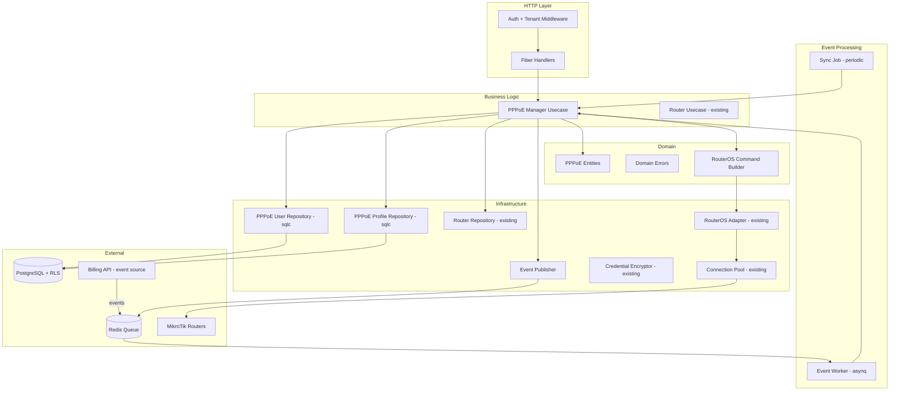
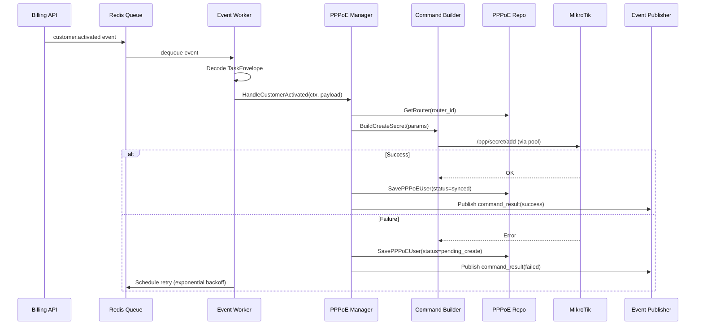
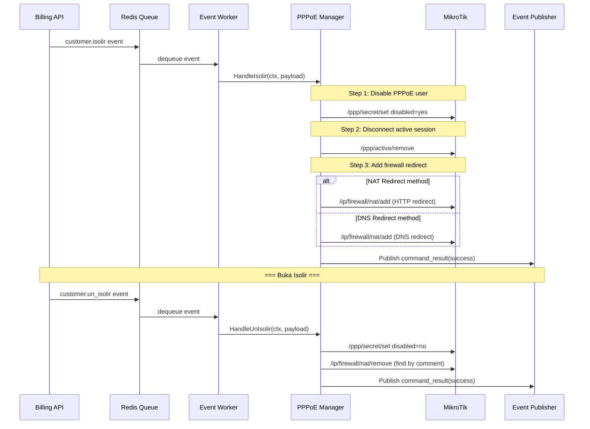
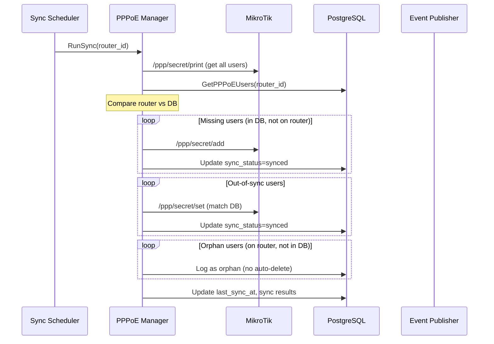

# Design Document — PPPoE Management Layer

## Overview

Dokumen ini mendeskripsikan desain teknis untuk **PPPoE Management Layer** di `services/network-service/`. Layer ini dibangun di atas **MikroTik Router Foundation Layer** (spec `mikrotik-router`) yang sudah diimplementasikan, dan menangani seluruh lifecycle PPPoE user: pembuatan user saat pelanggan diaktivasi, isolir/buka isolir, suspend/terminate, upgrade/downgrade paket, sinkronisasi database↔router, dan manajemen active sessions.

Semua perintah ke router dijalankan secara **async** melalui Redis queue (asynq worker), bukan langsung dari HTTP request. Network Service menerima event dari Billing API dan mengeksekusi perintah RouterOS yang sesuai, lalu mempublikasikan event hasil (`mikrotik.command_result`).

Desain mengikuti arsitektur domain-driven yang sudah ada: **domain → repository → usecase → handler → worker**, dengan sqlc untuk query generation, Fiber v2 untuk HTTP, asynq untuk event worker, dan zerolog untuk logging. Komentar dalam bahasa Indonesia, maksimal 200 baris per file.

### Keputusan Teknis Utama

| Keputusan | Pilihan | Alasan |
|---|---|---|
| Event processing | asynq worker (pkg/queue) | Konsisten dengan billing-api worker pattern |
| Sequential per router | asynq queue per router ID | Mencegah race condition pada satu router |
| Parallel across routers | Separate goroutine per router queue | Throughput tinggi untuk multi-router |
| Retry strategy | Exponential backoff (30s→10m, max 5) | Toleransi terhadap router offline sementara |
| RouterOS v6/v7 | Adapter pattern via `IsRouterOSv7()` | Sudah ada di foundation layer |
| Isolir method | Configurable per tenant (NAT/DNS) | Sesuai diskusi: DNS redirect lebih efektif |
| Comment field tracking | `ISPBoss:{customer_id}:{tenant_id}` | Identifikasi user ISPBoss di router |
| Orphan handling | Report only, no auto-delete | Sesuai diskusi: bisa jadi user manual admin |
| DB source of truth | Database menang saat sync conflict | Konsisten dengan arsitektur event-driven |
| Profile sync | Parallel goroutine ke semua router | Async, error per router tidak blocking |
| Simple queue | Optional per tenant setting | Tidak semua ISP butuh per-user monitoring |
| Command priority | High untuk isolir/buka isolir | Billing-related harus cepat (sudah ada di pool) |

## Architecture

### Layer Architecture



### Event Processing Flow — Customer Activated



### Isolir/Buka Isolir Flow



### Periodic Sync Flow



## Components and Interfaces

### 1. PPPoE Manager Usecase Interface

```go
// PPPoEManager mendefinisikan business logic untuk manajemen PPPoE user.
// Menangani lifecycle lengkap: create, isolir, un-isolir, suspend, package change, sync.
type PPPoEManager interface {
    // HandleCustomerActivated membuat PPPoE user di router saat pelanggan diaktivasi.
    HandleCustomerActivated(ctx context.Context, payload CustomerActivatedPayload) error

    // HandleIsolir menjalankan sequence isolir: disable user, disconnect, add firewall.
    HandleIsolir(ctx context.Context, payload CustomerIsolirPayload) error

    // HandleUnIsolir menjalankan sequence buka isolir: enable user, remove firewall.
    HandleUnIsolir(ctx context.Context, payload CustomerUnIsolirPayload) error

    // HandleSuspend menjalankan sequence suspend: disconnect, remove user, remove queue, remove firewall.
    HandleSuspend(ctx context.Context, payload CustomerSuspendPayload) error

    // HandlePackageChanged mengupdate profile assignment dan reconnect user.
    HandlePackageChanged(ctx context.Context, payload PackageChangedPayload) error

    // SyncRouter menjalankan sinkronisasi database↔router untuk satu router.
    SyncRouter(ctx context.Context, routerID string) (*SyncResult, error)

    // GetActiveSessions mengambil active PPPoE sessions dari router.
    GetActiveSessions(ctx context.Context, routerID string) ([]PPPoESession, error)

    // DisconnectSession memutus satu active session di router.
    DisconnectSession(ctx context.Context, routerID, sessionID string) error

    // GetSessionCount mengambil jumlah active sessions di router.
    GetSessionCount(ctx context.Context, routerID string) (int, error)

    // CreateUser membuat PPPoE user secara manual (dari API).
    CreateUser(ctx context.Context, routerID string, req CreatePPPoEUserRequest) (*PPPoEUser, error)

    // DeleteUser menghapus PPPoE user dari router dan database.
    DeleteUser(ctx context.Context, routerID, userID string) error

    // ListUsers mengambil daftar PPPoE user dari database.
    ListUsers(ctx context.Context, routerID string, params PPPoEUserListParams) (*PPPoEUserListResult, error)

    // GetSyncStatus mengambil ringkasan status sync untuk satu router.
    GetSyncStatus(ctx context.Context, routerID string) (*SyncStatusSummary, error)

    // SyncProfile membuat atau update PPPoE profile di semua router.
    SyncProfile(ctx context.Context, profile *PPPoEProfile) error
}
```

### 2. RouterOS Command Builder

```go
// CommandBuilder membangun perintah RouterOS yang kompatibel dengan v6 dan v7.
// Mengabstraksi perbedaan API path dan parameter antar versi.
type CommandBuilder interface {
    // CreateSecret membangun perintah /ppp/secret/add.
    CreateSecret(params PPPoESecretParams) (command string, args map[string]string)

    // SetSecret membangun perintah /ppp/secret/set.
    SetSecret(username string, params map[string]string) (command string, args map[string]string)

    // RemoveSecret membangun perintah /ppp/secret/remove.
    RemoveSecret(username string) (command string, args map[string]string)

    // PrintSecrets membangun perintah /ppp/secret/print.
    PrintSecrets() (command string, args map[string]string)

    // RemoveActiveSession membangun perintah /ppp/active/remove.
    RemoveActiveSession(sessionID string) (command string, args map[string]string)

    // PrintActiveSessions membangun perintah /ppp/active/print.
    PrintActiveSessions() (command string, args map[string]string)

    // CreateProfile membangun perintah /ppp/profile/add.
    CreateProfile(params PPPoEProfileParams) (command string, args map[string]string)

    // SetProfile membangun perintah /ppp/profile/set.
    SetProfile(name string, params map[string]string) (command string, args map[string]string)

    // CreateNATRule membangun perintah /ip/firewall/nat/add.
    CreateNATRule(params NATRuleParams) (command string, args map[string]string)

    // RemoveNATRuleByComment membangun perintah /ip/firewall/nat/remove dengan find by comment.
    RemoveNATRuleByComment(comment string) (command string, args map[string]string)

    // CreateSimpleQueue membangun perintah /queue/simple/add.
    CreateSimpleQueue(params SimpleQueueParams) (command string, args map[string]string)

    // SetSimpleQueue membangun perintah /queue/simple/set.
    SetSimpleQueue(name string, params map[string]string) (command string, args map[string]string)

    // RemoveSimpleQueue membangun perintah /queue/simple/remove.
    RemoveSimpleQueue(name string) (command string, args map[string]string)

    // ResetSimpleQueueCounters membangun perintah /queue/simple/reset-counters.
    // Digunakan saat buka isolir untuk reset traffic counter.
    ResetSimpleQueueCounters(name string) (command string, args map[string]string)
}

// NewCommandBuilder membuat CommandBuilder sesuai versi RouterOS.
func NewCommandBuilder(routerOSVersion string) CommandBuilder
```

### 3. PPPoE User Repository Interface

```go
// PPPoEUserRepository mendefinisikan operasi data untuk tabel pppoe_users.
type PPPoEUserRepository interface {
    // Create membuat record PPPoE user baru.
    Create(ctx context.Context, user *PPPoEUser) (*PPPoEUser, error)

    // GetByID mengambil PPPoE user berdasarkan ID.
    GetByID(ctx context.Context, id string) (*PPPoEUser, error)

    // GetByUsername mengambil PPPoE user berdasarkan router_id dan username.
    GetByUsername(ctx context.Context, routerID, username string) (*PPPoEUser, error)

    // GetByCustomerID mengambil PPPoE user berdasarkan customer_id.
    GetByCustomerID(ctx context.Context, customerID string) (*PPPoEUser, error)

    // Update memperbarui record PPPoE user.
    Update(ctx context.Context, user *PPPoEUser) (*PPPoEUser, error)

    // SoftDelete melakukan soft-delete PPPoE user.
    SoftDelete(ctx context.Context, id string) error

    // List mengambil daftar PPPoE user dengan paginasi per router.
    List(ctx context.Context, params PPPoEUserListParams) (*PPPoEUserListResult, error)

    // GetByRouterID mengambil semua PPPoE user aktif untuk satu router.
    GetByRouterID(ctx context.Context, routerID string) ([]*PPPoEUser, error)

    // GetSyncStatusSummary mengambil ringkasan sync status per router.
    GetSyncStatusSummary(ctx context.Context, routerID string) (*SyncStatusSummary, error)

    // UpdateSyncStatus memperbarui sync_status dan last_sync_at.
    UpdateSyncStatus(ctx context.Context, id string, status SyncStatus, syncAt *time.Time) error

    // BulkUpdateSyncStatus memperbarui sync_status untuk banyak user sekaligus.
    BulkUpdateSyncStatus(ctx context.Context, ids []string, status SyncStatus, syncAt *time.Time) error
}
```

### 4. PPPoE Profile Repository Interface

```go
// PPPoEProfileRepository mendefinisikan operasi data untuk tabel pppoe_profiles.
type PPPoEProfileRepository interface {
    // Create membuat record PPPoE profile baru.
    Create(ctx context.Context, profile *PPPoEProfile) (*PPPoEProfile, error)

    // GetByID mengambil PPPoE profile berdasarkan ID.
    GetByID(ctx context.Context, id string) (*PPPoEProfile, error)

    // GetByPackageID mengambil PPPoE profile berdasarkan package_id.
    GetByPackageID(ctx context.Context, packageID string) (*PPPoEProfile, error)

    // GetByProfileName mengambil PPPoE profile berdasarkan tenant_id dan profile_name.
    GetByProfileName(ctx context.Context, tenantID, profileName string) (*PPPoEProfile, error)

    // Update memperbarui record PPPoE profile.
    Update(ctx context.Context, profile *PPPoEProfile) (*PPPoEProfile, error)

    // ListByTenant mengambil semua profile untuk satu tenant.
    ListByTenant(ctx context.Context, tenantID string) ([]*PPPoEProfile, error)
}
```

### 5. PPPoE Event Publisher Interface

```go
// PPPoEEventPublisher mempublikasikan event hasil operasi PPPoE ke Redis queue.
type PPPoEEventPublisher interface {
    // PublishCommandResult mempublikasikan hasil eksekusi perintah ke router.
    PublishCommandResult(ctx context.Context, result CommandResultPayload) error

    // PublishSyncFailed mempublikasikan event sinkronisasi gagal untuk notifikasi.
    PublishSyncFailed(ctx context.Context, payload SyncFailedPayload) error
}
```

### 6. Event Worker

```go
// PPPoEEventWorker memproses event dari Billing API via asynq.
// Mendaftarkan handler untuk: customer.activated, customer.isolir,
// customer.un_isolir, customer.suspend, customer.terminated, package.changed.
type PPPoEEventWorker struct {
    manager PPPoEManager
    logger  zerolog.Logger
}

// RegisterHandlers mendaftarkan semua handler task ke asynq ServeMux.
func (w *PPPoEEventWorker) RegisterHandlers(mux *asynq.ServeMux)
```

## Data Models

### Database Schema (SQL)

```sql
-- Migration: create_pppoe_users_table
CREATE TABLE pppoe_users (
    id                UUID PRIMARY KEY DEFAULT gen_random_uuid(),
    tenant_id         UUID NOT NULL REFERENCES tenants(id),
    customer_id       UUID NOT NULL,
    router_id         UUID NOT NULL REFERENCES routers(id),
    username          VARCHAR(100) NOT NULL,
    password_encrypted TEXT NOT NULL,
    profile_name      VARCHAR(100) NOT NULL,
    service           VARCHAR(20) NOT NULL DEFAULT 'pppoe',
    remote_address    VARCHAR(45),
    comment           TEXT NOT NULL,
    disabled          BOOLEAN NOT NULL DEFAULT false,
    use_simple_queue  BOOLEAN NOT NULL DEFAULT false,
    status            VARCHAR(20) NOT NULL DEFAULT 'active',
    last_sync_at      TIMESTAMPTZ,
    sync_status       VARCHAR(20) NOT NULL DEFAULT 'pending_create',
    created_at        TIMESTAMPTZ NOT NULL DEFAULT now(),
    updated_at        TIMESTAMPTZ NOT NULL DEFAULT now(),
    deleted_at        TIMESTAMPTZ
);

-- Unique constraint: username unik per router (exclude soft-deleted)
CREATE UNIQUE INDEX idx_pppoe_users_router_username
    ON pppoe_users (router_id, username)
    WHERE deleted_at IS NULL;

-- Index untuk query per tenant
CREATE INDEX idx_pppoe_users_tenant_id
    ON pppoe_users (tenant_id) WHERE deleted_at IS NULL;

-- Index untuk lookup by customer_id
CREATE INDEX idx_pppoe_users_customer_id
    ON pppoe_users (customer_id) WHERE deleted_at IS NULL;

-- Index untuk sync job (per router)
CREATE INDEX idx_pppoe_users_router_sync
    ON pppoe_users (router_id, sync_status) WHERE deleted_at IS NULL;

-- Row-Level Security
ALTER TABLE pppoe_users ENABLE ROW LEVEL SECURITY;

CREATE POLICY pppoe_users_tenant_isolation ON pppoe_users
    USING (tenant_id = current_setting('app.current_tenant_id')::UUID);


-- Migration: create_pppoe_profiles_table
CREATE TABLE pppoe_profiles (
    id                        UUID PRIMARY KEY DEFAULT gen_random_uuid(),
    tenant_id                 UUID NOT NULL REFERENCES tenants(id),
    package_id                UUID NOT NULL,
    profile_name              VARCHAR(100) NOT NULL,
    download_limit            VARCHAR(20) NOT NULL,
    upload_limit              VARCHAR(20) NOT NULL,
    burst_download            VARCHAR(20),
    burst_upload              VARCHAR(20),
    burst_threshold_download  VARCHAR(20),
    burst_threshold_upload    VARCHAR(20),
    burst_time                VARCHAR(20),
    address_pool              VARCHAR(100),
    local_address             VARCHAR(45) NOT NULL DEFAULT 'gateway',
    only_one                  BOOLEAN NOT NULL DEFAULT true,
    created_at                TIMESTAMPTZ NOT NULL DEFAULT now(),
    updated_at                TIMESTAMPTZ NOT NULL DEFAULT now()
);

-- Unique constraint: profile_name unik per tenant
CREATE UNIQUE INDEX idx_pppoe_profiles_tenant_name
    ON pppoe_profiles (tenant_id, profile_name);

-- Index untuk lookup by package_id
CREATE INDEX idx_pppoe_profiles_package_id
    ON pppoe_profiles (package_id);

-- Row-Level Security
ALTER TABLE pppoe_profiles ENABLE ROW LEVEL SECURITY;

CREATE POLICY pppoe_profiles_tenant_isolation ON pppoe_profiles
    USING (tenant_id = current_setting('app.current_tenant_id')::UUID);
```

### Domain Entities (Go)

```go
// --- PPPoE User Entity ---

// SyncStatus mendefinisikan status sinkronisasi PPPoE user.
type SyncStatus string

const (
    SyncStatusSynced        SyncStatus = "synced"
    SyncStatusPendingCreate SyncStatus = "pending_create"
    SyncStatusPendingUpdate SyncStatus = "pending_update"
    SyncStatusPendingDelete SyncStatus = "pending_delete"
    SyncStatusOutOfSync     SyncStatus = "out_of_sync"
    SyncStatusError         SyncStatus = "error"
)

// PPPoEUser merepresentasikan user PPPoE yang dikelola ISPBoss di router.
type PPPoEUser struct {
    ID                string     `json:"id"`
    TenantID          string     `json:"tenant_id"`
    CustomerID        string     `json:"customer_id"`
    RouterID          string     `json:"router_id"`
    Username          string     `json:"username"`
    PasswordEncrypted string     `json:"-"`
    ProfileName       string     `json:"profile_name"`
    Service           string     `json:"service"`
    RemoteAddress     string     `json:"remote_address,omitempty"`
    Comment           string     `json:"comment"`
    Disabled          bool       `json:"disabled"`
    UseSimpleQueue    bool       `json:"use_simple_queue"`
    Status            string     `json:"status"`
    LastSyncAt        *time.Time `json:"last_sync_at,omitempty"`
    SyncStatus        SyncStatus `json:"sync_status"`
    CreatedAt         time.Time  `json:"created_at"`
    UpdatedAt         time.Time  `json:"updated_at"`
    DeletedAt         *time.Time `json:"deleted_at,omitempty"`
}

// BuildComment membangun comment field format "ISPBoss:{customer_id}:{tenant_id}".
func BuildComment(customerID, tenantID string) string {
    return fmt.Sprintf("ISPBoss:%s:%s", customerID, tenantID)
}

// ParseComment mengurai comment field dan mengembalikan customer_id dan tenant_id.
// Mengembalikan error jika format tidak valid.
func ParseComment(comment string) (customerID, tenantID string, err error)

// IsISPBossComment memeriksa apakah comment memiliki prefix "ISPBoss:".
func IsISPBossComment(comment string) bool {
    return strings.HasPrefix(comment, "ISPBoss:")
}

// --- PPPoE Profile Entity ---

// PPPoEProfile merepresentasikan profil bandwidth PPPoE di router.
type PPPoEProfile struct {
    ID                     string    `json:"id"`
    TenantID               string    `json:"tenant_id"`
    PackageID              string    `json:"package_id"`
    ProfileName            string    `json:"profile_name"`
    DownloadLimit          string    `json:"download_limit"`
    UploadLimit            string    `json:"upload_limit"`
    BurstDownload          string    `json:"burst_download,omitempty"`
    BurstUpload            string    `json:"burst_upload,omitempty"`
    BurstThresholdDownload string    `json:"burst_threshold_download,omitempty"`
    BurstThresholdUpload   string    `json:"burst_threshold_upload,omitempty"`
    BurstTime              string    `json:"burst_time,omitempty"`
    AddressPool            string    `json:"address_pool,omitempty"`
    LocalAddress           string    `json:"local_address"`
    OnlyOne                bool      `json:"only_one"`
    CreatedAt              time.Time `json:"created_at"`
    UpdatedAt              time.Time `json:"updated_at"`
}

// GenerateProfileName menghasilkan profile_name dari nama paket.
// Mengganti spasi dengan hyphen dan menghapus karakter spesial.
func GenerateProfileName(packageName string) string

// --- PPPoE Session (dari router, tidak disimpan di DB) ---

// PPPoESession merepresentasikan sesi PPPoE aktif dari router.
type PPPoESession struct {
    ID       string `json:"id"`
    Username string `json:"username"`
    CallerID string `json:"caller_id"`
    Address  string `json:"address"`
    Uptime   string `json:"uptime"`
    BytesIn  int64  `json:"bytes_in"`
    BytesOut int64  `json:"bytes_out"`
    Service  string `json:"service"`
    Encoding string `json:"encoding"`
}
```

### Request/Response DTOs

```go
// CreatePPPoEUserRequest adalah payload untuk POST /api/v1/mikrotik/routers/:id/pppoe/users.
type CreatePPPoEUserRequest struct {
    CustomerID     string `json:"customer_id" validate:"required,uuid"`
    Username       string `json:"username" validate:"required,min=1,max=100"`
    Password       string `json:"password" validate:"required"`
    ProfileName    string `json:"profile_name" validate:"required,max=100"`
    RemoteAddress  string `json:"remote_address,omitempty" validate:"omitempty,max=45"`
    UseSimpleQueue bool   `json:"use_simple_queue"`
}

// PPPoEUserListParams berisi parameter untuk list PPPoE user.
type PPPoEUserListParams struct {
    RouterID   string
    TenantID   string
    Page       int
    PageSize   int
    SyncStatus string
    Search     string
}

// PPPoEUserListResult berisi hasil list PPPoE user dengan paginasi.
type PPPoEUserListResult struct {
    Data       []*PPPoEUser `json:"data"`
    Total      int64        `json:"total"`
    Page       int          `json:"page"`
    PageSize   int          `json:"page_size"`
    TotalPages int          `json:"total_pages"`
}

// SyncResult berisi hasil sinkronisasi satu router.
type SyncResult struct {
    RouterID       string    `json:"router_id"`
    TotalUsers     int       `json:"total_users"`
    SyncedCount    int       `json:"synced_count"`
    OrphanCount    int       `json:"orphan_count"`
    MissingCount   int       `json:"missing_count"`
    OutOfSyncCount int       `json:"out_of_sync_count"`
    ErrorCount     int       `json:"error_count"`
    SyncedAt       time.Time `json:"synced_at"`
}

// SyncStatusSummary berisi ringkasan sync status untuk dashboard.
type SyncStatusSummary struct {
    SyncedCount    int        `json:"synced_count"`
    OrphanCount    int        `json:"orphan_count"`
    MissingCount   int        `json:"missing_count"`
    OutOfSyncCount int        `json:"out_of_sync_count"`
    LastSyncAt     *time.Time `json:"last_sync_at,omitempty"`
}
```

### Event Payloads

```go
// --- Incoming Event Payloads (dari Billing API) ---

// CustomerActivatedPayload adalah payload event customer.activated.
type CustomerActivatedPayload struct {
    CustomerID       string `json:"customer_id"`
    TenantID         string `json:"tenant_id"`
    Name             string `json:"name"`
    PackageID        string `json:"package_id"`
    ConnectionMethod string `json:"connection_method"`
    PPPoEUsername    string `json:"pppoe_username"`
    PPPoEPassword    string `json:"pppoe_password"`
    RouterID         string `json:"router_id"`
}

// CustomerIsolirPayload adalah payload event customer.isolir.
type CustomerIsolirPayload struct {
    CustomerID       string `json:"customer_id"`
    TenantID         string `json:"tenant_id"`
    CustomerName     string `json:"customer_name"`
    RouterID         string `json:"router_id"`
    PPPoEUsername    string `json:"pppoe_username"`
    ConnectionMethod string `json:"connection_method"`
    IsolirMethod     string `json:"isolir_method"` // "firewall_nat_redirect" atau "dns_redirect"
    WalledGardenIP   string `json:"walled_garden_ip"`
    DNSServerIP      string `json:"dns_server_ip,omitempty"`
}

// CustomerUnIsolirPayload adalah payload event customer.un_isolir.
type CustomerUnIsolirPayload struct {
    CustomerID       string `json:"customer_id"`
    TenantID         string `json:"tenant_id"`
    CustomerName     string `json:"customer_name"`
    RouterID         string `json:"router_id"`
    PPPoEUsername    string `json:"pppoe_username"`
    ConnectionMethod string `json:"connection_method"`
}

// CustomerSuspendPayload adalah payload event customer.suspend.
type CustomerSuspendPayload struct {
    CustomerID       string `json:"customer_id"`
    TenantID         string `json:"tenant_id"`
    CustomerName     string `json:"customer_name"`
    RouterID         string `json:"router_id"`
    PPPoEUsername    string `json:"pppoe_username"`
    ConnectionMethod string `json:"connection_method"`
}

// CustomerTerminatedPayload adalah payload event customer.terminated.
// Identik dengan CustomerSuspendPayload — keduanya menjalankan removal sequence yang sama.
type CustomerTerminatedPayload = CustomerSuspendPayload

// PackageChangedPayload adalah payload event package.changed.
type PackageChangedPayload struct {
    CustomerID       string `json:"customer_id"`
    TenantID         string `json:"tenant_id"`
    OldPackageID     string `json:"old_package_id"`
    NewPackageID     string `json:"new_package_id"`
    ConnectionMethod string `json:"connection_method"`
    RouterID         string `json:"router_id"`
}

// --- Outgoing Event Payloads ---

// CommandResultPayload adalah payload event mikrotik.command_result.
type CommandResultPayload struct {
    CorrelationID string    `json:"correlation_id"`
    CustomerID    string    `json:"customer_id"`
    RouterID      string    `json:"router_id"`
    TenantID      string    `json:"tenant_id"`
    Operation     string    `json:"operation"` // create, isolir, un_isolir, suspend, terminate, package_change
    Status        string    `json:"status"`    // success, failed, failed_permanent
    ErrorMessage  string    `json:"error_message,omitempty"`
    ExecutedAt    time.Time `json:"executed_at"`
    DurationMs    int64     `json:"duration_ms"`
    RemoteAddress string    `json:"remote_address,omitempty"` // jika assigned dari pool
}

// SyncFailedPayload adalah payload event mikrotik.sync_failed.
// Dipublikasikan saat semua retry gagal atau sync job gagal untuk satu router.
type SyncFailedPayload struct {
    RouterID     string    `json:"router_id"`
    RouterName   string    `json:"router_name"`
    TenantID     string    `json:"tenant_id"`
    Operation    string    `json:"operation"`
    ErrorMessage string    `json:"error_message"`
    FailedAt     time.Time `json:"failed_at"`
}
```

### RouterOS Command Parameters

```go
// PPPoESecretParams berisi parameter untuk membuat PPPoE secret di router.
type PPPoESecretParams struct {
    Name          string
    Password      string
    Service       string
    Profile       string
    RemoteAddress string
    Comment       string
}

// PPPoEProfileParams berisi parameter untuk membuat PPPoE profile di router.
type PPPoEProfileParams struct {
    Name           string
    LocalAddress   string
    RemoteAddress  string // address pool name
    RateLimit      string // format: "download/upload" e.g. "50M/25M"
    BurstLimit     string // format: "download/upload"
    BurstThreshold string // format: "download/upload"
    BurstTime      string // format: "download/upload"
    OnlyOne        string // "yes" atau "no"
}

// NATRuleParams berisi parameter untuk membuat NAT rule di router.
type NATRuleParams struct {
    Chain      string // "dstnat"
    SrcAddress string // user remote IP
    Protocol   string // "tcp" atau "udp"
    DstPort    string // "80" atau "53"
    Action     string // "dst-nat"
    ToAddress  string // walled garden IP atau DNS server IP
    ToPort     string // optional
    Comment    string // "ISPBoss:isolir:{customer_id}" atau "ISPBoss:dns-redirect:{customer_id}"
}

// SimpleQueueParams berisi parameter untuk membuat simple queue di router.
type SimpleQueueParams struct {
    Name           string
    Target         string // user remote IP
    MaxLimit       string // format: "download/upload"
    BurstLimit     string
    BurstThreshold string
    BurstTime      string
    Comment        string
}
```

## Correctness Properties

*A property is a characteristic or behavior that should hold true across all valid executions of a system — essentially, a formal statement about what the system should do. Properties serve as the bridge between human-readable specifications and machine-verifiable correctness guarantees.*

### Property 1: Comment format round-trip and ISPBoss detection

*For any* valid customer_id (UUID string) and tenant_id (UUID string), `BuildComment(customer_id, tenant_id)` SHALL produce a string that:
- `ParseComment()` can parse back to the original customer_id and tenant_id (round-trip)
- `IsISPBossComment()` returns true for

Conversely, *for any* string that does NOT start with "ISPBoss:", `IsISPBossComment()` SHALL return false.

**Validates: Requirements 1.4, 8.9**

### Property 2: Profile name generation is deterministic and safe

*For any* package name string, `GenerateProfileName(name)` SHALL produce a string that:
- Contains no spaces (replaced with hyphens)
- Contains no special characters (only alphanumeric and hyphens)
- Is idempotent: `GenerateProfileName(GenerateProfileName(name)) == GenerateProfileName(name)`
- Is non-empty when the input contains at least one alphanumeric character

**Validates: Requirements 2.4**

### Property 3: PPPoE secret command builder completeness

*For any* valid PPPoESecretParams (non-empty name, password, service, profile, comment), the command builder SHALL produce a command string and args map where:
- The args map contains keys "name", "password", "service", "profile", "comment"
- Each value in the args map matches the corresponding input parameter
- The command string is a valid RouterOS API path for PPPoE secret creation

**Validates: Requirements 3.2**

### Property 4: Profile command builder with conditional burst parameters

*For any* valid PPPoEProfileParams, the command builder SHALL produce args containing "name", "local-address", "rate-limit", "only-one". Additionally:
- *For any* profile WHERE burst settings are non-empty, the args SHALL contain "burst-limit", "burst-threshold", "burst-time"
- *For any* profile WHERE burst settings are empty, the args SHALL NOT contain burst-related keys

**Validates: Requirements 6.2, 6.3**

### Property 5: Sync diff algorithm correctness

*For any* set of router PPPoE users (identified by username+comment) and database PPPoE users (identified by username+router_id), the sync diff algorithm SHALL categorize each user into exactly one category:
- **synced**: exists in both with matching profile and disabled state
- **orphan**: exists on router with ISPBoss comment but not in database, OR exists on router without ISPBoss comment
- **missing**: exists in database (not deleted, status active) but not on router
- **out_of_sync**: exists in both but with different profile_name or disabled state

Every user from both sets SHALL appear in exactly one category (no duplicates, no omissions).

**Validates: Requirements 8.2, 8.3, 8.5**

### Property 6: Sync result count invariant

*For any* SyncResult, the following invariant SHALL hold: `total_users >= synced_count + missing_count + out_of_sync_count + error_count`. The orphan_count represents users only on the router, so `total_users` (DB users for that router) plus `orphan_count` equals the total unique users across both sources.

**Validates: Requirements 8.7**

### Property 7: Retry backoff schedule

*For any* retry attempt number N where 0 ≤ N < 5, the calculated backoff delay SHALL match the expected schedule: attempt 0 → 30s, attempt 1 → 60s, attempt 2 → 120s, attempt 3 → 300s, attempt 4 → 600s. For N ≥ 5, the retry SHALL not be scheduled (permanent failure).

**Validates: Requirements 10.3**

### Property 8: Command result payload completeness

*For any* CommandResultPayload, the following fields SHALL be non-empty: correlation_id, customer_id, router_id, tenant_id, operation, status, executed_at. The operation SHALL be one of: "create", "isolir", "un_isolir", "suspend", "package_change". The status SHALL be one of: "success", "failed", "failed_permanent".

**Validates: Requirements 12.2**

### Property 9: Error message safety

*For any* CommandResultPayload with status "failed" or "failed_permanent", the error_message field SHALL NOT contain substrings matching password values, encryption key bytes, or credential patterns. Specifically, it SHALL NOT contain the PPPoE user's plaintext password or the ENCRYPTION_KEY value.

**Validates: Requirements 12.4**

### Property 10: Version-aware command path selection

*For any* RouterOS version string starting with "7", the command builder SHALL produce commands compatible with v7. *For any* version string starting with "6" (or any non-"7" prefix), the command builder SHALL produce commands compatible with v6. The `IsRouterOSv7()` function result SHALL be consistent with the command builder's version selection.

**Validates: Requirements 13.2, 13.3**

### Property 11: Isolir NAT rule builder correctness

*For any* valid customer_id, source IP address, and isolir method:
- When method is "firewall_nat_redirect": the NAT rule SHALL have chain="dstnat", protocol="tcp", dst-port="80", action="dst-nat", and comment matching "ISPBoss:isolir:{customer_id}"
- When method is "dns_redirect": the NAT rule SHALL have chain="dstnat", protocol="udp", dst-port="53", action="dst-nat", and comment matching "ISPBoss:dns-redirect:{customer_id}"

In both cases, the src-address SHALL match the provided source IP.

**Validates: Requirements 14.2, 14.3**

## Error Handling

### Domain Errors (PPPoE-specific)

```go
var (
    // ErrPPPoEUserNotFound dikembalikan saat PPPoE user tidak ditemukan.
    ErrPPPoEUserNotFound = errors.New("pppoe user tidak ditemukan")

    // ErrPPPoEUsernameExists dikembalikan saat username sudah ada di router.
    ErrPPPoEUsernameExists = errors.New("username pppoe sudah ada di router ini")

    // ErrPPPoEProfileNotFound dikembalikan saat profile tidak ditemukan.
    ErrPPPoEProfileNotFound = errors.New("pppoe profile tidak ditemukan")

    // ErrProfileNameExists dikembalikan saat profile name sudah ada di tenant.
    ErrProfileNameExists = errors.New("nama profile sudah ada")

    // ErrInvalidConnectionMethod dikembalikan saat connection_method bukan "pppoe".
    ErrInvalidConnectionMethod = errors.New("connection method bukan pppoe")

    // ErrInvalidIsolirMethod dikembalikan saat isolir method tidak valid.
    ErrInvalidIsolirMethod = errors.New("isolir method tidak valid, gunakan firewall_nat_redirect atau dns_redirect")

    // ErrInvalidCommentFormat dikembalikan saat comment field tidak sesuai format.
    ErrInvalidCommentFormat = errors.New("format comment tidak valid, harus ISPBoss:{customer_id}:{tenant_id}")

    // ErrSyncInProgress dikembalikan saat sync sudah berjalan untuk router ini.
    ErrSyncInProgress = errors.New("sinkronisasi sedang berjalan untuk router ini")

    // ErrMaxRetriesExhausted dikembalikan saat semua retry gagal.
    ErrMaxRetriesExhausted = errors.New("semua retry gagal, operasi ditandai sebagai failed_permanent")

    // ErrSessionNotFound dikembalikan saat session PPPoE tidak ditemukan.
    ErrSessionNotFound = errors.New("session pppoe tidak ditemukan")
)
```

### Error Handling Strategy per Layer

| Layer | Error Type | Handling |
|---|---|---|
| Event Worker | Payload decode error | Log error, return error (asynq akan retry) |
| Event Worker | Invalid connection_method | Log warning, skip (return nil, jangan retry) |
| PPPoE Manager | Router offline | Return error → worker retry dengan backoff |
| PPPoE Manager | Command execution failed | Return error → worker retry, update sync_status |
| PPPoE Manager | Profile not found | Auto-create profile, lalu retry operasi |
| PPPoE Manager | Firewall rule not found (buka isolir) | Log warning, continue (bukan error) |
| Command Builder | Invalid parameters | Return error sebelum kirim ke router |
| Repository | Duplicate username | Return ErrPPPoEUsernameExists |
| Repository | RLS violation | Return ErrPPPoEUserNotFound (transparan) |
| Sync Job | Router offline | Skip router, log error, lanjut ke router lain |
| Sync Job | Partial sync failure | Log per-user error, lanjut user lain, report error_count |
| HTTP Handler | Router offline | Return HTTP 503 dengan pesan "router tidak dapat dijangkau" |
| HTTP Handler | Validation error | Return HTTP 400 dengan detail field errors |

### Retry Strategy

```
Attempt 0: Immediate execution
Attempt 1: 30 seconds delay
Attempt 2: 1 minute delay
Attempt 3: 2 minutes delay
Attempt 4: 5 minutes delay
Attempt 5: 10 minutes delay
After 5 retries: Mark as failed_permanent, publish event, stop retrying
```

Retry hanya untuk error yang bersifat transient (router offline, timeout, connection refused). Error permanen (invalid credentials, command syntax error) langsung ditandai failed_permanent tanpa retry.

## Testing Strategy

### Property-Based Testing

Library: **pgregory.net/rapid** (sudah digunakan di codebase, lihat `go.mod`)

Setiap property test harus:
- Minimum 100 iterasi
- Tag dengan comment referencing design property
- Format tag: `Feature: mikrotik-pppoe, Property {number}: {title}`

Property tests fokus pada:
- Pure functions: `BuildComment`, `ParseComment`, `IsISPBossComment`, `GenerateProfileName`
- Command builder: parameter completeness, version-aware paths, conditional burst
- Sync diff algorithm: categorization correctness
- Retry backoff calculation
- Payload validation: completeness, safety

### Unit Tests (Example-Based)

Unit tests fokus pada:
- Specific command parameter values untuk v6 vs v7
- Isolir method selection (NAT vs DNS)
- Error handling edge cases (missing firewall rule, offline router)
- Event worker handler registration
- HTTP handler request/response mapping

### Integration Tests

Integration tests menggunakan mock adapter (`NETWORK_MODE=mock`):
- Full event processing flow (event → worker → manager → adapter → DB)
- Sync job end-to-end dengan mock router data
- HTTP API endpoints dengan database
- Retry mechanism dengan simulated failures
- Parallel execution across routers

### Test File Organization

```
services/network-service/internal/
├── domain/
│   ├── pppoe_test.go          # Property tests: comment, profile name, sync diff
│   └── pppoe_command_test.go  # Property tests: command builder
├── usecase/
│   ├── pppoe_manager_test.go  # Unit + integration tests: manager logic
│   └── pppoe_sync_test.go     # Unit + integration tests: sync job
├── worker/
│   └── pppoe_worker_test.go   # Integration tests: event worker
└── handler/
    └── pppoe_handler_test.go  # Integration tests: HTTP handlers
```
