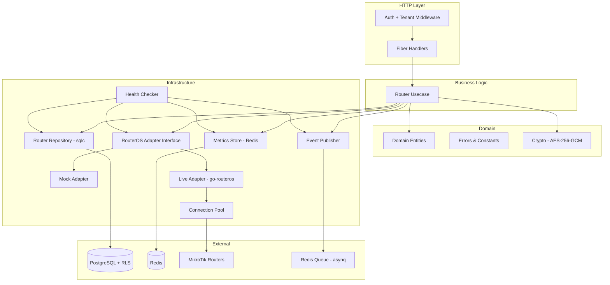
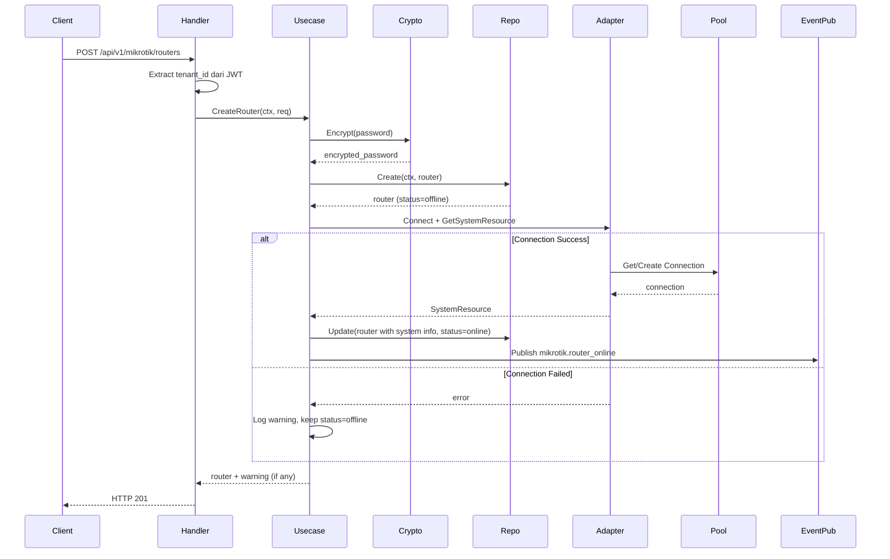
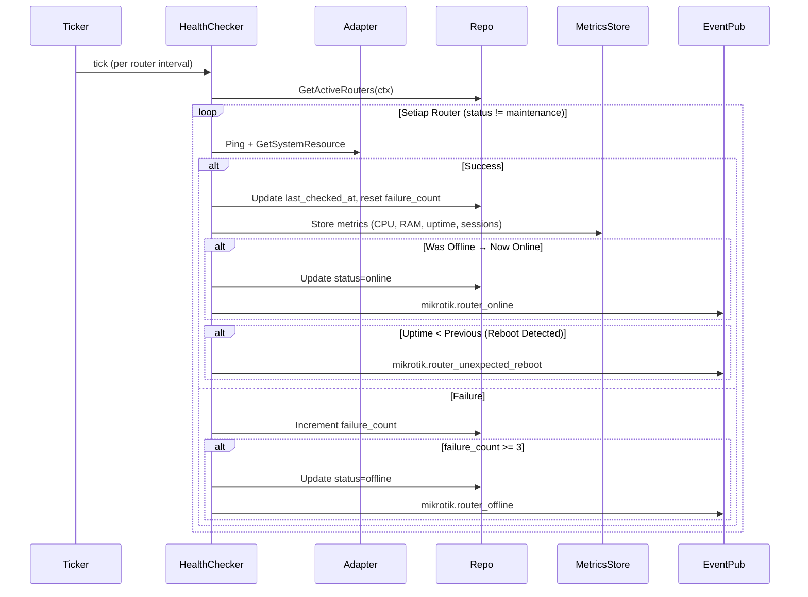

# Design Document — MikroTik Router Foundation Layer

## Overview

Dokumen ini mendeskripsikan desain teknis untuk **MikroTik Router Foundation Layer** di `services/network-service/`. Layer ini menyediakan device registry, RouterOS API adapter (mock + live), connection pool, Router CRUD API, health check background job, status summary, credential encryption, metrics time-series storage, dan event publishing.

Desain mengikuti arsitektur domain-driven yang sudah ada di codebase: **domain → repository → usecase → handler**, dengan sqlc untuk query generation, Fiber v2 untuk HTTP, dan asynq/Redis untuk background jobs dan event publishing.

### Keputusan Teknis Utama

| Keputusan | Pilihan | Alasan |
|---|---|---|
| RouterOS API library | `go-routeros` | Library Go paling mature untuk RouterOS API |
| Connection pool | Custom implementation | Kebutuhan spesifik: lazy connect, per-router pool, rate limiting, warm-up, priority queue |
| Mock adapter | `NETWORK_MODE=mock` | Memungkinkan development dan testing tanpa router fisik |
| Credential encryption | AES-256-GCM | Standar industri, sudah ada pattern di billing-api (`gateway/crypto.go`) |
| Metrics storage | Redis sorted sets | Time-series sederhana, 7-day TTL, sudah ada Redis di stack |
| Health check | Goroutine ticker per router | Lebih fleksibel dari asynq cron, interval per-router |
| Event publishing | `pkg/queue.EnqueueTask` | Konsisten dengan pattern antar-service yang sudah ada |
| RouterOS version | Auto-detect v6/v7 | Simpan versi di entity, adapter pattern per versi untuk spec lanjutan |
| Service types | JSONB array di tabel routers | Satu router bisa support multiple service (PPPoE, Hotspot, DHCP, Static) |
| Command priority | 3 level (High/Medium/Low) | Perintah billing (isolir) lebih prioritas dari monitoring |
| Warm-up | Event-driven saat antrian > 10 | Prediktif buka koneksi paralel untuk burst command |

## Architecture

### Layer Architecture



### Component Interaction — Router Creation Flow



### Health Check Flow



## Components and Interfaces

### 1. RouterOS Adapter Interface

```go
// RouterOSAdapter mendefinisikan interface untuk komunikasi dengan RouterOS API.
// Diimplementasikan oleh MockAdapter dan LiveAdapter.
type RouterOSAdapter interface {
    // Connect membuka koneksi ke router dengan konfigurasi yang diberikan.
    Connect(ctx context.Context, cfg ConnectionConfig) error

    // Close menutup koneksi ke router.
    Close() error

    // Execute menjalankan perintah RouterOS dan mengembalikan hasil.
    Execute(ctx context.Context, command string, params map[string]string) ([]map[string]string, error)

    // GetSystemResource mengambil informasi sistem router (CPU, RAM, uptime, dll).
    GetSystemResource(ctx context.Context) (*SystemResource, error)

    // Ping memeriksa apakah koneksi ke router masih aktif.
    Ping(ctx context.Context) error
}

// IsRouterOSv7 memeriksa apakah versi RouterOS adalah v7 berdasarkan string versi.
// Digunakan untuk menentukan API path yang berbeda antara v6 dan v7.
func IsRouterOSv7(version string) bool
```

### 2. Connection Pool Interface

```go
// ConnPool mengelola pool koneksi TCP ke satu router MikroTik.
type ConnPool interface {
    // Get mengambil koneksi idle atau membuat koneksi baru (lazy).
    // Memblokir jika pool penuh sampai koneksi tersedia.
    // Priority menentukan urutan dequeue saat pool penuh.
    Get(ctx context.Context, priority CommandPriority) (RouterOSAdapter, error)

    // Put mengembalikan koneksi ke pool setelah selesai digunakan.
    Put(conn RouterOSAdapter)

    // Close menutup semua koneksi di pool.
    Close() error

    // Stats mengembalikan statistik pool (active, idle, total).
    Stats() PoolStats

    // WarmUp membuka koneksi hingga max capacity secara paralel.
    // Dipanggil saat antrian perintah melebihi warm-up threshold.
    WarmUp(ctx context.Context) error
}

// PoolManager mengelola pool koneksi untuk semua router.
type PoolManager interface {
    // GetPool mengembalikan pool untuk router tertentu (buat baru jika belum ada).
    GetPool(routerID string, cfg ConnectionConfig) ConnPool

    // ClosePool menutup pool untuk router tertentu.
    ClosePool(routerID string)

    // CloseAll menutup semua pool.
    CloseAll()
}
```

### 3. Credential Encryptor Interface

```go
// CredentialEncryptor mengenkripsi dan mendekripsi credential router.
type CredentialEncryptor interface {
    // Encrypt mengenkripsi plaintext password menggunakan AES-256-GCM.
    Encrypt(plaintext string) (string, error)

    // Decrypt mendekripsi ciphertext kembali ke plaintext password.
    Decrypt(ciphertext string) (string, error)
}
```

### 4. Metrics Store Interface

```go
// MetricsStore menyimpan dan mengambil metrik router dari Redis.
type MetricsStore interface {
    // Store menyimpan satu data point metrik untuk router.
    Store(ctx context.Context, routerID string, metrics RouterMetrics) error

    // Query mengambil data point metrik dalam rentang waktu tertentu.
    Query(ctx context.Context, routerID string, from, to time.Time) ([]RouterMetricsPoint, error)

    // GetLatest mengambil data point metrik terbaru untuk router.
    GetLatest(ctx context.Context, routerID string) (*RouterMetricsPoint, error)
}
```

### 5. Health Checker Interface

```go
// HealthChecker menjalankan health check periodik untuk semua router.
type HealthChecker interface {
    // Start memulai health check goroutine untuk semua router aktif.
    Start(ctx context.Context) error

    // Stop menghentikan semua health check goroutine.
    Stop()

    // AddRouter menambahkan router baru ke health check schedule.
    AddRouter(router *Router)

    // RemoveRouter menghapus router dari health check schedule.
    RemoveRouter(routerID string)

    // UpdateInterval mengubah interval health check untuk router tertentu.
    UpdateInterval(routerID string, intervalSec int)
}
```

### 6. Event Publisher Interface

```go
// EventPublisher mempublikasikan event router ke Redis queue.
type EventPublisher interface {
    // PublishRouterOffline mempublikasikan event router offline.
    PublishRouterOffline(ctx context.Context, router *Router) error

    // PublishRouterOnline mempublikasikan event router online.
    PublishRouterOnline(ctx context.Context, router *Router, downtimeDuration time.Duration) error

    // PublishUnexpectedReboot mempublikasikan event reboot tak terduga.
    PublishUnexpectedReboot(ctx context.Context, router *Router, prevUptime, currUptime int64) error
}
```

### 7. Router Repository Interface

```go
// RouterRepository mendefinisikan operasi data untuk tabel routers.
type RouterRepository interface {
    // Create membuat router baru dan mengembalikan router yang dibuat.
    Create(ctx context.Context, router *Router) (*Router, error)

    // GetByID mengambil router berdasarkan ID (tenant-scoped via RLS).
    GetByID(ctx context.Context, id string) (*Router, error)

    // Update memperbarui data router dan mengembalikan router yang diperbarui.
    Update(ctx context.Context, router *Router) (*Router, error)

    // SoftDelete melakukan soft-delete router (set deleted_at).
    SoftDelete(ctx context.Context, id string) error

    // List mengambil daftar router dengan paginasi (tenant-scoped via RLS).
    List(ctx context.Context, params RouterListParams) (*RouterListResult, error)

    // CountByStatus menghitung jumlah router per status untuk tenant.
    CountByStatus(ctx context.Context) (map[RouterStatus]int64, error)

    // GetActiveRouters mengambil semua router yang tidak di-delete dan bukan maintenance.
    GetActiveRouters(ctx context.Context) ([]*Router, error)

    // NameExists mengecek apakah nama router sudah ada di tenant.
    NameExists(ctx context.Context, tenantID, name, excludeID string) (bool, error)

    // UpdateHealthCheck memperbarui field health check (last_checked_at, failure_count, status, last_uptime_sec).
    UpdateHealthCheck(ctx context.Context, id string, params HealthCheckUpdate) error
}
```

### 8. Router Usecase Interface

```go
// RouterUsecase mendefinisikan business logic untuk manajemen router.
type RouterUsecase interface {
    // Create membuat router baru, test koneksi, dan auto-detect info.
    Create(ctx context.Context, tenantID string, req CreateRouterRequest) (*RouterResponse, error)

    // GetByID mengambil detail router termasuk live metrics jika online.
    GetByID(ctx context.Context, id string) (*RouterDetailResponse, error)

    // Update memperbarui data router.
    Update(ctx context.Context, id string, req UpdateRouterRequest) (*RouterResponse, error)

    // Delete soft-delete router dan tutup pool koneksi.
    Delete(ctx context.Context, id string) error

    // List mengambil daftar router dengan paginasi.
    List(ctx context.Context, params RouterListParams) (*RouterListResult, error)

    // TestConnection menguji koneksi ke router dan mengembalikan system info.
    TestConnection(ctx context.Context, id string) (*SystemResource, error)

    // Reboot mengirim perintah reboot ke router (dengan konfirmasi nama).
    Reboot(ctx context.Context, id string, confirmName string) error

    // GetStatusSummary mengembalikan ringkasan status semua router tenant.
    GetStatusSummary(ctx context.Context) (*StatusSummary, error)
}
```

## Data Models

### Database Schema (SQL)

```sql
-- Migration: create_routers_table
CREATE TABLE routers (
    id                      UUID PRIMARY KEY DEFAULT gen_random_uuid(),
    tenant_id               UUID NOT NULL REFERENCES tenants(id),
    name                    VARCHAR(100) NOT NULL,
    host                    VARCHAR(255) NOT NULL,
    port                    INTEGER NOT NULL DEFAULT 8728,
    username                VARCHAR(100) NOT NULL,
    password_encrypted      TEXT NOT NULL,
    use_ssl                 BOOLEAN NOT NULL DEFAULT false,
    service_types           JSONB NOT NULL DEFAULT '["pppoe"]',
    router_os_version       VARCHAR(20),
    board_name              VARCHAR(100),
    cpu_count               INTEGER,
    total_ram_mb            INTEGER,
    identity                VARCHAR(255),
    status                  VARCHAR(20) NOT NULL DEFAULT 'offline',
    health_check_interval_sec INTEGER NOT NULL DEFAULT 60,
    last_online_at          TIMESTAMPTZ,
    last_checked_at         TIMESTAMPTZ,
    last_uptime_sec         BIGINT,
    failure_count           INTEGER NOT NULL DEFAULT 0,
    notes                   TEXT,
    deleted_at              TIMESTAMPTZ,
    created_at              TIMESTAMPTZ NOT NULL DEFAULT now(),
    updated_at              TIMESTAMPTZ NOT NULL DEFAULT now()
);

-- Unique constraint: nama router unik per tenant (exclude soft-deleted)
CREATE UNIQUE INDEX idx_routers_tenant_name
    ON routers (tenant_id, name)
    WHERE deleted_at IS NULL;

-- Index untuk query per tenant
CREATE INDEX idx_routers_tenant_id ON routers (tenant_id) WHERE deleted_at IS NULL;

-- Index untuk health check query (router aktif)
CREATE INDEX idx_routers_status ON routers (status) WHERE deleted_at IS NULL;

-- Row-Level Security
ALTER TABLE routers ENABLE ROW LEVEL SECURITY;

CREATE POLICY routers_tenant_isolation ON routers
    USING (tenant_id = current_setting('app.current_tenant_id')::UUID);
```

### Domain Entities (Go)

```go
// RouterStatus mendefinisikan status konektivitas router.
type RouterStatus string

const (
    StatusOnline      RouterStatus = "online"
    StatusOffline     RouterStatus = "offline"
    StatusMaintenance RouterStatus = "maintenance"
)

// ValidRouterTransitions mendefinisikan transisi status yang valid.
var ValidRouterTransitions = map[RouterStatus][]RouterStatus{
    StatusOffline:     {StatusOnline, StatusMaintenance},
    StatusOnline:      {StatusOffline, StatusMaintenance},
    StatusMaintenance: {StatusOnline, StatusOffline},
}

// CanTransitionRouter memeriksa apakah transisi status valid.
func CanTransitionRouter(current, target RouterStatus) bool {
    targets, ok := ValidRouterTransitions[current]
    if !ok {
        return false
    }
    for _, t := range targets {
        if t == target {
            return true
        }
    }
    return false
}

// ServiceType mendefinisikan tipe layanan yang didukung router.
type ServiceType string

const (
    ServicePPPoE   ServiceType = "pppoe"
    ServiceHotspot ServiceType = "hotspot"
    ServiceDHCP    ServiceType = "dhcp_binding"
    ServiceStatic  ServiceType = "static"
)

// CommandPriority mendefinisikan prioritas perintah ke router.
type CommandPriority int

const (
    PriorityHigh   CommandPriority = 3 // Isolir, buka isolir, disconnect
    PriorityMedium CommandPriority = 2 // CRUD user, update profile
    PriorityLow    CommandPriority = 1 // Sync, monitoring, backup
)

// Router merepresentasikan perangkat MikroTik yang terdaftar per tenant.
type Router struct {
    ID                    string       `json:"id"`
    TenantID              string       `json:"tenant_id"`
    Name                  string       `json:"name"`
    Host                  string       `json:"host"`
    Port                  int          `json:"port"`
    Username              string       `json:"username"`
    PasswordEncrypted     string       `json:"-"`
    UseSSL                bool         `json:"use_ssl"`
    ServiceTypes          []string     `json:"service_types"`
    RouterOSVersion       string       `json:"router_os_version,omitempty"`
    BoardName             string       `json:"board_name,omitempty"`
    CPUCount              int          `json:"cpu_count,omitempty"`
    TotalRAMMB            int          `json:"total_ram_mb,omitempty"`
    Identity              string       `json:"identity,omitempty"`
    Status                RouterStatus `json:"status"`
    HealthCheckIntervalSec int         `json:"health_check_interval_sec"`
    LastOnlineAt          *time.Time   `json:"last_online_at,omitempty"`
    LastCheckedAt         *time.Time   `json:"last_checked_at,omitempty"`
    LastUptimeSec         *int64       `json:"last_uptime_sec,omitempty"`
    FailureCount          int          `json:"failure_count"`
    Notes                 string       `json:"notes,omitempty"`
    DeletedAt             *time.Time   `json:"deleted_at,omitempty"`
    CreatedAt             time.Time    `json:"created_at"`
    UpdatedAt             time.Time    `json:"updated_at"`
}

// ConnectionConfig berisi konfigurasi koneksi ke router.
type ConnectionConfig struct {
    Host           string
    Port           int
    Username       string
    Password       string
    UseSSL         bool
    ConnectTimeout time.Duration
    CommandTimeout time.Duration
}

// SystemResource berisi informasi sistem dari router.
type SystemResource struct {
    Version      string `json:"version"`
    BoardName    string `json:"board_name"`
    CPUCount     int    `json:"cpu_count"`
    CPULoad      int    `json:"cpu_load"`
    TotalRAM     int64  `json:"total_ram"`
    FreeRAM      int64  `json:"free_ram"`
    Uptime       int64  `json:"uptime"`
    Architecture string `json:"architecture"`
    Identity     string `json:"identity"`
}

// RouterMetrics berisi metrik yang dikumpulkan dari router.
type RouterMetrics struct {
    CPULoad        int   `json:"cpu_load"`
    RAMUsagePercent int  `json:"ram_usage_percent"`
    UptimeSeconds  int64 `json:"uptime_seconds"`
    ActiveSessions int   `json:"active_sessions"`
}

// RouterMetricsPoint berisi metrik dengan timestamp.
type RouterMetricsPoint struct {
    Timestamp time.Time     `json:"timestamp"`
    Metrics   RouterMetrics `json:"metrics"`
}

// PoolStats berisi statistik connection pool.
type PoolStats struct {
    Active int `json:"active"`
    Idle   int `json:"idle"`
    Total  int `json:"total"`
}

// StatusSummary berisi ringkasan status router untuk dashboard.
type StatusSummary struct {
    TotalRouters     int64 `json:"total_routers"`
    OnlineCount      int64 `json:"online_count"`
    OfflineCount     int64 `json:"offline_count"`
    MaintenanceCount int64 `json:"maintenance_count"`
}

// HealthCheckUpdate berisi field yang diupdate saat health check.
type HealthCheckUpdate struct {
    LastCheckedAt *time.Time
    LastOnlineAt  *time.Time
    LastUptimeSec *int64
    FailureCount  int
    Status        *RouterStatus
}
```

### Request/Response DTOs

```go
// CreateRouterRequest adalah payload untuk POST /api/v1/mikrotik/routers.
type CreateRouterRequest struct {
    Name                  string   `json:"name" validate:"required,min=1,max=100"`
    Host                  string   `json:"host" validate:"required,max=255"`
    Port                  int      `json:"port" validate:"omitempty,min=1,max=65535"`
    Username              string   `json:"username" validate:"required,max=100"`
    Password              string   `json:"password" validate:"required"`
    UseSSL                bool     `json:"use_ssl"`
    ServiceTypes          []string `json:"service_types" validate:"omitempty,dive,oneof=pppoe hotspot dhcp_binding static"`
    HealthCheckIntervalSec int     `json:"health_check_interval_sec" validate:"omitempty,min=10,max=3600"`
    Notes                 string   `json:"notes,omitempty"`
}

// UpdateRouterRequest adalah payload untuk PUT /api/v1/mikrotik/routers/:id.
type UpdateRouterRequest struct {
    Name                  string  `json:"name" validate:"omitempty,min=1,max=100"`
    Host                  string  `json:"host" validate:"omitempty,max=255"`
    Port                  *int    `json:"port" validate:"omitempty,min=1,max=65535"`
    Username              string  `json:"username" validate:"omitempty,max=100"`
    Password              string  `json:"password,omitempty"`
    UseSSL                *bool   `json:"use_ssl,omitempty"`
    HealthCheckIntervalSec *int   `json:"health_check_interval_sec" validate:"omitempty,min=10,max=3600"`
    Status                string  `json:"status" validate:"omitempty,oneof=online offline maintenance"`
    Notes                 string  `json:"notes,omitempty"`
}

// RebootRequest adalah payload untuk POST /api/v1/mikrotik/routers/:id/reboot.
type RebootRequest struct {
    ConfirmationName string `json:"confirmation_name" validate:"required"`
}

// RouterResponse adalah respons untuk operasi CRUD router.
type RouterResponse struct {
    Router  *Router `json:"router"`
    Warning string  `json:"warning,omitempty"`
}

// RouterDetailResponse adalah respons untuk GET router detail.
type RouterDetailResponse struct {
    Router       *Router              `json:"router"`
    LiveMetrics  *RouterMetrics       `json:"live_metrics,omitempty"`
}

// RouterListParams berisi parameter untuk list router.
type RouterListParams struct {
    TenantID string
    Page     int
    PageSize int
    Status   string
    Search   string
}

// RouterListResult berisi hasil list router dengan paginasi.
type RouterListResult struct {
    Data       []*Router `json:"data"`
    Total      int64     `json:"total"`
    Page       int       `json:"page"`
    PageSize   int       `json:"page_size"`
    TotalPages int       `json:"total_pages"`
}
```

### Event Payloads

```go
// RouterOfflinePayload adalah payload event mikrotik.router_offline.
type RouterOfflinePayload struct {
    RouterID     string    `json:"router_id"`
    RouterName   string    `json:"router_name"`
    TenantID     string    `json:"tenant_id"`
    LastOnlineAt time.Time `json:"last_online_at"`
}

// RouterOnlinePayload adalah payload event mikrotik.router_online.
type RouterOnlinePayload struct {
    RouterID         string        `json:"router_id"`
    RouterName       string        `json:"router_name"`
    TenantID         string        `json:"tenant_id"`
    DowntimeDuration time.Duration `json:"downtime_duration"`
}

// RouterRebootPayload adalah payload event mikrotik.router_unexpected_reboot.
type RouterRebootPayload struct {
    RouterID              string `json:"router_id"`
    RouterName            string `json:"router_name"`
    TenantID              string `json:"tenant_id"`
    PreviousUptimeSeconds int64  `json:"previous_uptime_seconds"`
    CurrentUptimeSeconds  int64  `json:"current_uptime_seconds"`
}
```

### Redis Metrics Key Format

```
Key:    router:{router_id}:metrics
Type:   Sorted Set
Score:  Unix timestamp (seconds)
Member: JSON-encoded RouterMetrics
TTL:    7 days (604800 seconds) — enforced via ZREMRANGEBYSCORE on write
```


## Correctness Properties

*A property is a characteristic or behavior that should hold true across all valid executions of a system — essentially, a formal statement about what the system should do. Properties serve as the bridge between human-readable specifications and machine-verifiable correctness guarantees.*

### Property 1: Status transition correctness

*For any* pair of RouterStatus values (current, target), `CanTransitionRouter(current, target)` SHALL return true if and only if the pair is in the defined valid transitions set {offline→online, offline→maintenance, online→offline, online→maintenance, maintenance→online, maintenance→offline}. For invalid transitions, the error message SHALL contain the current status and the list of allowed target statuses.

**Validates: Requirements 2.3, 2.4**

### Property 2: Pool capacity invariant

*For any* number of concurrent connection requests N to a single router's pool, the pool SHALL never have more than 5 active connections simultaneously. When N > 5, excess requests SHALL block until a connection is returned, and all N requests SHALL eventually complete without deadlock.

**Validates: Requirements 4.1, 4.6**

### Property 3: Rate limiting enforcement

*For any* burst of N commands sent to a single router's pool, the actual execution rate SHALL not exceed 10 commands per second. Commands exceeding the rate limit SHALL be queued and executed in order.

**Validates: Requirements 4.8**

### Property 4: Reboot confirmation validation

*For any* router with name R and any confirmation string C where C ≠ R (case-sensitive), the reboot request SHALL be rejected. Only when C == R SHALL the reboot proceed.

**Validates: Requirements 5.8, 5.9**

### Property 5: Successful health check resets failure state

*For any* router with any failure_count ≥ 0 and any status (online or offline), after a successful health check, the router's failure_count SHALL be 0 and last_checked_at SHALL be updated. If the router was previously offline, its status SHALL transition to online.

**Validates: Requirements 6.2, 6.5**

### Property 6: Failed health check increments failure count

*For any* router with failure_count N where 0 ≤ N < 3, after a failed health check, the router's failure_count SHALL be N + 1. When failure_count reaches 3, the router's status SHALL transition to offline.

**Validates: Requirements 6.3, 6.4**

### Property 7: Reboot detection via uptime comparison

*For any* router with previously recorded uptime P > 0 and current uptime C where C < P, the health checker SHALL detect an unexpected reboot and publish a `mikrotik.router_unexpected_reboot` event containing both P and C.

**Validates: Requirements 6.6**

### Property 8: Status summary invariant

*For any* distribution of router statuses within a tenant, the status summary SHALL satisfy: `total_routers == online_count + offline_count + maintenance_count`, and each count SHALL equal the actual number of routers in that status.

**Validates: Requirements 7.1**

### Property 9: Encryption nonce uniqueness

*For any* plaintext string and any valid 32-byte master key, two consecutive calls to `Encrypt(plaintext)` SHALL produce different ciphertext outputs (due to unique random nonce per operation).

**Validates: Requirements 8.5**

### Property 10: Encryption round-trip

*For any* valid string and any valid 32-byte master key, `Decrypt(Encrypt(plaintext)) == plaintext`. The encryption SHALL transform the data such that the ciphertext differs from the plaintext for non-empty inputs.

**Validates: Requirements 8.6**

### Property 11: Wrong key decryption error safety

*For any* ciphertext encrypted with key K1 and any different key K2 (K2 ≠ K1, both 32 bytes), `Decrypt(ciphertext, K2)` SHALL return an error. The error message SHALL NOT contain the master key bytes or the original plaintext.

**Validates: Requirements 8.7**

### Property 12: Metrics store round-trip with ordering

*For any* set of RouterMetrics data points stored for a router, querying with a time range [from, to] SHALL return only points with timestamps within that range, sorted by timestamp ascending. Each returned point SHALL have the same field values as the originally stored point.

**Validates: Requirements 9.3, 9.4**

### Property 13: Event payload completeness with correlation ID

*For any* router event (offline, online, or unexpected_reboot), the published TaskEnvelope SHALL contain a non-empty correlation_id, the correct event_type, and all required payload fields for that event type (router_id, router_name, tenant_id, plus event-specific fields).

**Validates: Requirements 10.1, 10.2, 10.3, 10.4**

### Property 14: Priority queue ordering

*For any* set of queued commands with mixed priorities (High, Medium, Low), when a connection becomes available, the command with the highest priority SHALL be dequeued first. Among commands with the same priority, FIFO order SHALL be maintained.

**Validates: Requirements 4.10**

## Error Handling

### Domain Errors

```go
var (
    // ErrRouterNotFound dikembalikan saat router tidak ditemukan atau milik tenant lain
    ErrRouterNotFound = errors.New("router tidak ditemukan")

    // ErrRouterNameExists dikembalikan saat nama router sudah ada di tenant yang sama
    ErrRouterNameExists = errors.New("nama router sudah ada")

    // ErrInvalidStatusTransition dikembalikan saat transisi status tidak valid
    ErrInvalidStatusTransition = errors.New("transisi status tidak valid")

    // ErrConfirmationMismatch dikembalikan saat nama konfirmasi reboot tidak cocok
    ErrConfirmationMismatch = errors.New("nama konfirmasi tidak cocok")

    // ErrRouterOffline dikembalikan saat operasi membutuhkan router online
    ErrRouterOffline = errors.New("router sedang offline")

    // ErrConnectionFailed dikembalikan saat koneksi ke router gagal
    ErrConnectionFailed = errors.New("gagal terhubung ke router")

    // ErrConnectionTimeout dikembalikan saat koneksi ke router timeout
    ErrConnectionTimeout = errors.New("koneksi ke router timeout")

    // ErrPoolExhausted dikembalikan saat pool koneksi penuh dan timeout menunggu
    ErrPoolExhausted = errors.New("pool koneksi penuh")

    // ErrRateLimited dikembalikan saat rate limit per router terlampaui
    ErrRateLimited = errors.New("rate limit terlampaui")

    // ErrEncryptionFailed dikembalikan saat enkripsi password gagal
    ErrEncryptionFailed = errors.New("gagal mengenkripsi password")

    // ErrDecryptionFailed dikembalikan saat dekripsi password gagal
    ErrDecryptionFailed = errors.New("gagal mendekripsi password")

    // ErrInvalidEncryptionKey dikembalikan saat ENCRYPTION_KEY tidak valid
    ErrInvalidEncryptionKey = errors.New("ENCRYPTION_KEY harus 32 bytes")

    // ErrRouterDeleted dikembalikan saat router sudah di-soft-delete
    ErrRouterDeleted = errors.New("router sudah dihapus")
)
```

### Error Mapping ke HTTP Status

| Domain Error | HTTP Status | Error Code |
|---|---|---|
| ErrRouterNotFound | 404 | ROUTER_NOT_FOUND |
| ErrRouterNameExists | 409 | ROUTER_NAME_EXISTS |
| ErrInvalidStatusTransition | 422 | INVALID_STATUS_TRANSITION |
| ErrConfirmationMismatch | 400 | CONFIRMATION_MISMATCH |
| ErrRouterOffline | 422 | ROUTER_OFFLINE |
| ErrConnectionFailed | 502 | CONNECTION_FAILED |
| ErrConnectionTimeout | 504 | CONNECTION_TIMEOUT |
| ErrPoolExhausted | 503 | POOL_EXHAUSTED |
| ErrRateLimited | 429 | RATE_LIMITED |
| ErrEncryptionFailed | 500 | INTERNAL_ERROR |
| ErrDecryptionFailed | 500 | INTERNAL_ERROR |
| Validation errors | 422 | VALIDATION_ERROR |

### Error Handling Strategy

1. **Handler layer**: Menangkap error dari usecase, mapping ke HTTP status dan error code menggunakan `domain.ErrorResponse()`.
2. **Usecase layer**: Menangkap error dari repository/adapter, wrap dengan context menggunakan `fmt.Errorf("%w: ...", domainErr)`.
3. **Repository layer**: Menangkap error dari sqlc/pgx, mapping `pgx.ErrNoRows` ke `ErrRouterNotFound`.
4. **Adapter layer**: Menangkap error dari go-routeros, wrap ke `ErrConnectionFailed` atau `ErrConnectionTimeout`.
5. **Connection pool**: Mengembalikan `ErrPoolExhausted` jika timeout menunggu koneksi, `ErrRateLimited` jika rate limit terlampaui.
6. **Health checker**: Log error dan lanjutkan ke router berikutnya. Tidak menghentikan seluruh health check loop karena satu router gagal.
7. **Event publisher**: Log error jika publish gagal, tidak mengembalikan error ke caller (best-effort publishing).
8. **Credential encryption**: Error enkripsi/dekripsi TIDAK boleh mengekspos master key atau plaintext dalam pesan error.

### Retry Strategy

| Komponen | Retry | Keterangan |
|---|---|---|
| Router CRUD API | Tidak | Client bertanggung jawab retry |
| Health check ping | Tidak per-check | Menggunakan failure_count (3 failures → offline) |
| Connection pool connect | 1x retry | Retry sekali dengan backoff 1 detik |
| Event publishing | Tidak | Best-effort, asynq menangani retry di consumer side |
| Metrics storage | Tidak | Best-effort, data point yang hilang tidak kritis |

## Testing Strategy

### Testing Framework dan Library

| Komponen | Library | Keterangan |
|---|---|---|
| Unit test | `testing` (stdlib) | Test standar Go |
| Property-based test | `pgregory.net/rapid` | Sudah digunakan di billing-api |
| HTTP test | `net/http/httptest` + Fiber test | Test handler tanpa server |
| Mock | Interface-based manual mock | Konsisten dengan pattern codebase |
| Database test | `testcontainers-go` (opsional) | Untuk integration test dengan PostgreSQL |

### Dual Testing Approach

**Unit Tests** — untuk contoh spesifik, edge case, dan error handling:
- Domain entity creation dengan default values
- Adapter factory mengembalikan mock/live berdasarkan NETWORK_MODE
- Mock adapter mengembalikan response yang benar
- Pool lifecycle: lazy connect, idle timeout, max lifetime
- Health check skip untuk router maintenance
- Reboot confirmation match/mismatch
- Encryption key validation (invalid length)
- Decryption error cases (wrong key, corrupted data, invalid base64)

**Property-Based Tests** — untuk properti universal yang berlaku di semua input:
- Setiap property test HARUS menjalankan minimum 100 iterasi
- Setiap property test HARUS mereferensikan property di design document
- Format tag: `Feature: mikrotik-router, Property {number}: {title}`

### Property Test Mapping

| Property | Test File | Generator |
|---|---|---|
| 1: Status transition | `domain/router_test.go` | `rapid.SampledFrom(allStatuses)` × 2 |
| 2: Pool capacity | `pool/pool_test.go` | `rapid.IntRange(1, 20)` concurrent goroutines |
| 3: Rate limiting | `pool/pool_test.go` | `rapid.IntRange(1, 50)` burst commands |
| 4: Reboot confirmation | `domain/router_test.go` | `rapid.String()` for name and confirmation |
| 5: Health check success | `usecase/health_test.go` | `rapid.IntRange(0, 10)` failure_count |
| 6: Health check failure | `usecase/health_test.go` | `rapid.IntRange(0, 2)` failure_count |
| 7: Reboot detection | `usecase/health_test.go` | `rapid.Int64Range(1, maxInt)` for uptimes |
| 8: Status summary | `domain/router_test.go` | `rapid.IntRange(0, 100)` per status count |
| 9: Encryption nonce | `crypto/crypto_test.go` | `rapid.String()` plaintext |
| 10: Encryption round-trip | `crypto/crypto_test.go` | `rapid.String()` + `rapid.SliceOfN(Byte(), 32, 32)` |
| 11: Wrong key error | `crypto/crypto_test.go` | Two different `rapid.SliceOfN(Byte(), 32, 32)` |
| 12: Metrics round-trip | `metrics/store_test.go` | `rapid.IntRange(0, 100)` for metric values |
| 13: Event payload | `usecase/event_test.go` | `rapid.String()` for router fields |
| 14: Priority queue | `pool/pool_test.go` | `rapid.SampledFrom(allPriorities)` mixed commands |

### Integration Tests

Integration test menggunakan mock adapter (bukan router fisik) untuk memverifikasi:
- Full CRUD flow melalui HTTP endpoints
- RLS tenant isolation (2 tenant, verifikasi data tidak bocor)
- Health check flow end-to-end (mock adapter → repo update → metrics store → event publish)
- Metrics storage dan query di Redis
- Event publishing ke Redis queue

### File Structure

```
services/network-service/internal/
├── config/
│   └── config.go                    # + ENCRYPTION_KEY field
├── domain/
│   ├── router.go                    # Router entity, status, transitions
│   ├── router_test.go               # Property tests: status, summary, confirmation
│   ├── dto.go                       # Request/Response DTOs
│   ├── errors.go                    # Domain errors
│   └── constants.go                 # RouterStatus constants
├── crypto/
│   ├── crypto.go                    # AES-256-GCM encrypt/decrypt
│   └── crypto_test.go              # Property tests: round-trip, nonce, wrong key
├── adapter/
│   ├── adapter.go                   # RouterOSAdapter interface
│   ├── mock_adapter.go              # Mock implementation
│   ├── live_adapter.go              # Live implementation (go-routeros)
│   └── factory.go                   # NewAdapter(mode) factory
├── pool/
│   ├── pool.go                      # ConnPool implementation
│   ├── pool_test.go                 # Property tests: capacity, rate limit
│   └── manager.go                   # PoolManager implementation
├── repository/
│   ├── router_repo.go               # sqlc-based RouterRepository
│   └── queries/                     # SQL query files for sqlc
├── usecase/
│   ├── router_usecase.go            # RouterUsecase implementation
│   ├── health_checker.go            # HealthChecker implementation
│   ├── health_test.go               # Property tests: health check logic
│   ├── event_publisher.go           # EventPublisher implementation
│   └── event_test.go                # Property tests: event payloads
├── metrics/
│   ├── store.go                     # MetricsStore (Redis sorted sets)
│   └── store_test.go                # Property tests: round-trip, ordering
├── handler/
│   ├── router_handler.go            # HTTP handlers for router CRUD
│   ├── status_handler.go            # HTTP handler for status summary
│   └── router.go                    # Route registration (updated)
└── middleware/
    ├── auth.go
    └── tenant.go
```
