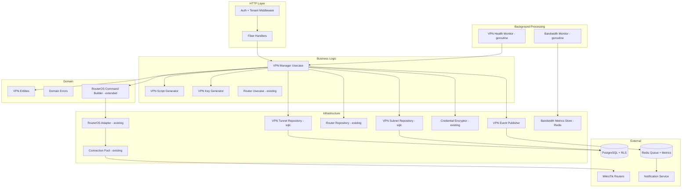
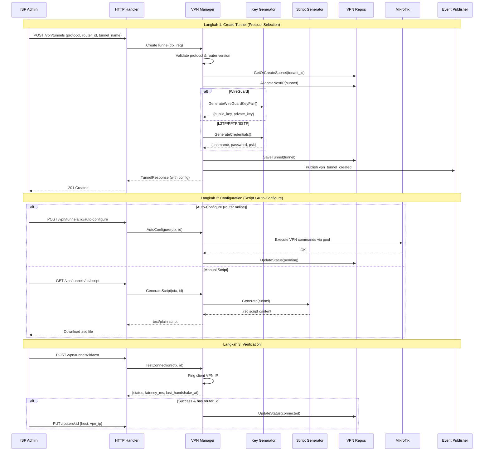
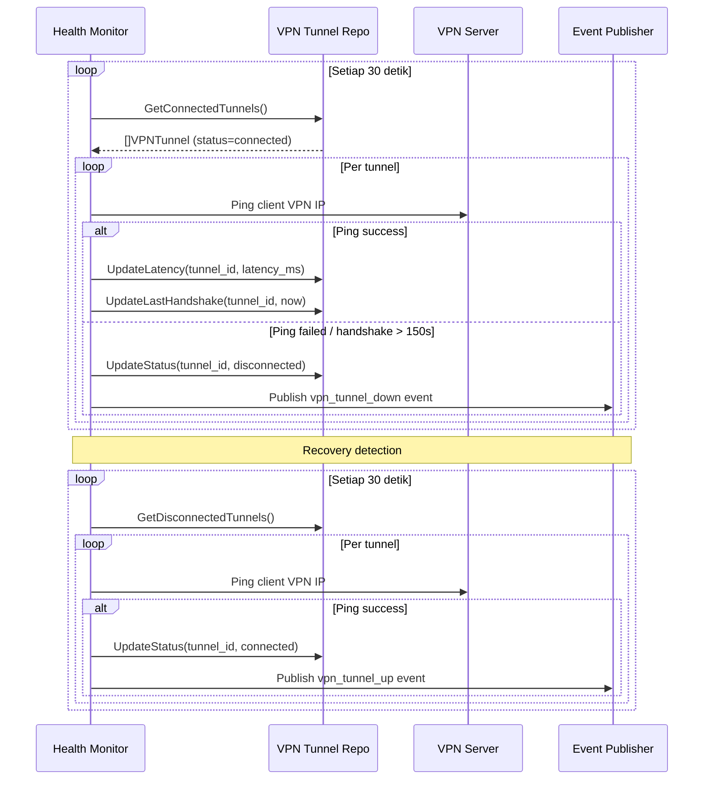

# Design Document — VPN Tunnel Management Layer

## Overview

Dokumen ini mendeskripsikan desain teknis untuk **VPN Tunnel Management Layer** di `services/network-service/`. Layer ini dibangun di atas **MikroTik Router Foundation Layer** (spec `mikrotik-router`) dan **PPPoE Management Layer** (spec `mikrotik-pppoe`) yang sudah diimplementasikan. Layer ini menangani seluruh lifecycle VPN tunnel: pembuatan tunnel via setup wizard, auto-configure via RouterOS API, script generation (.rsc), health monitoring, bandwidth tracking, dan CRUD operations.

ISPBoss adalah SaaS yang di-host di cloud, sementara router MikroTik dan OLT berada di lokasi tenant (on-premise). VPN Tunnel Management menyelesaikan masalah konektivitas: tenant tanpa IP publik, IP publik dinamis, keamanan koneksi RouterOS API tanpa enkripsi, dan kebutuhan manajemen terpusat untuk ISP multi-site.

Layer ini mencakup **management plane** saja: CRUD tunnel, konfigurasi generation, monitoring status, bandwidth tracking, dan API endpoints. Infrastruktur VPN server (WireGuard/L2TP server process) dikelola terpisah dan berada di luar scope spec ini.

Desain mengikuti arsitektur domain-driven yang sudah ada: **domain → repository → usecase → handler**, dengan sqlc untuk query generation, Fiber v2 untuk HTTP, asynq untuk event worker, dan zerolog untuk logging. Komentar dalam bahasa Indonesia, maksimal 200 baris per file.

### Keputusan Teknis Utama

| Keputusan | Pilihan | Alasan |
|---|---|---|
| Protokol VPN | WireGuard, L2TP/IPSec, PPTP, SSTP, OpenVPN | Sesuai diskusi: WireGuard utama (v7+), L2TP fallback (v6/v7), OpenVPN alternatif |
| IP addressing | 10.99.{tenant_seq}.0/24 per tenant | Isolasi per tenant, max 253 perangkat per subnet |
| Key generation | WireGuard key pair lokal, L2TP/PPTP credential random | Private key tidak pernah dikirim via internet |
| Key storage | AES-256-GCM via CredentialEncryptor existing | Konsisten dengan penyimpanan credential router |
| Script generation | Template-based per protokol (.rsc) | Tenant bisa setup manual jika router belum online |
| Auto-configure | RouterOS API via existing pool/adapter | Untuk router yang sudah terdaftar dan online |
| Health monitoring | Background goroutine, interval 30 detik | Deteksi tunnel down cepat, publish event ke notification |
| Bandwidth monitoring | Redis sorted sets, 24-hour retention | Konsisten dengan router metrics store |
| Event publishing | asynq via pkg/queue | Konsisten dengan PPPoE event pattern |
| HA/Failover | 2 endpoint (vpn1/vpn2), client-side failover | Geo-redundancy, SLA 99.9% |
| Bandwidth cap | Per tier tenant (Starter=10, Growth=50, Pro=200, Enterprise=custom) | Mencegah monopoli VPN server |
| RouterOS version | WireGuard hanya v7+, L2TP/PPTP/SSTP/OpenVPN semua versi | WireGuard tidak tersedia di RouterOS v6 |
| Rate limiting | Per tunnel, default 100 pps, configurable | Mencegah abuse tunnel |
| Server bandwidth alert | Alert jika total bandwidth > 80% kapasitas | Proaktif scaling infrastruktur |
| Maintenance notification | Notifikasi ke semua tenant terdampak | Tenant bisa persiapan sebelum maintenance |

## Architecture

### Layer Architecture



### VPN Setup Wizard Flow (3 Langkah)



### VPN Health Monitoring Flow



## Components and Interfaces

### 1. VPN Manager Usecase Interface

```go
// VPNManager mendefinisikan business logic untuk manajemen VPN tunnel.
// Menangani lifecycle lengkap: create, configure, test, monitor, delete.
type VPNManager interface {
    // CreateTunnel membuat VPN tunnel baru dengan auto-generate key/credential dan IP allocation.
    CreateTunnel(ctx context.Context, tenantID string, req CreateVPNTunnelRequest) (*VPNTunnelResponse, error)

    // GetTunnel mengambil detail tunnel termasuk semua field (private key di-mask).
    GetTunnel(ctx context.Context, id string) (*VPNTunnelDetailResponse, error)

    // UpdateTunnel memperbarui field yang diizinkan (tunnel_name, notes, router_id, persistent_keepalive, allowed_addresses).
    UpdateTunnel(ctx context.Context, id string, req UpdateVPNTunnelRequest) (*VPNTunnelResponse, error)

    // DeleteTunnel soft-delete tunnel, remove peer dari VPN server, dan opsional remove interface dari router.
    DeleteTunnel(ctx context.Context, id string) error

    // ListTunnels mengambil daftar tunnel dengan paginasi dan filter.
    ListTunnels(ctx context.Context, params VPNTunnelListParams) (*VPNTunnelListResult, error)

    // GetSummary mengambil ringkasan status tunnel untuk dashboard.
    GetSummary(ctx context.Context) (*VPNSummary, error)

    // TestConnection menguji koneksi VPN dengan ping ke client VPN IP.
    TestConnection(ctx context.Context, id string) (*VPNTestResult, error)

    // AutoConfigure mengkonfigurasi VPN di router yang sudah online via RouterOS API.
    AutoConfigure(ctx context.Context, id string) error

    // GenerateScript menghasilkan RouterOS script (.rsc) untuk setup manual.
    GenerateScript(ctx context.Context, id string) (string, error)

    // GetBandwidth mengambil statistik bandwidth untuk satu tunnel.
    GetBandwidth(ctx context.Context, id string, from, to time.Time) (*VPNBandwidthResult, error)

    // UpdateRouterHost mengupdate host router ke VPN IP setelah tunnel terverifikasi.
    UpdateRouterHost(ctx context.Context, tunnelID string) error
}
```

### 2. VPN Tunnel Repository Interface

```go
// VPNTunnelRepository mendefinisikan operasi data untuk tabel vpn_tunnels.
// Diimplementasikan oleh repository.VPNTunnelRepo menggunakan sqlc.
type VPNTunnelRepository interface {
    // Create membuat record VPN tunnel baru.
    Create(ctx context.Context, tunnel *VPNTunnel) (*VPNTunnel, error)

    // GetByID mengambil VPN tunnel berdasarkan ID (tenant-scoped via RLS).
    GetByID(ctx context.Context, id string) (*VPNTunnel, error)

    // Update memperbarui record VPN tunnel.
    Update(ctx context.Context, tunnel *VPNTunnel) (*VPNTunnel, error)

    // SoftDelete melakukan soft-delete VPN tunnel (set deleted_at).
    SoftDelete(ctx context.Context, id string) error

    // List mengambil daftar VPN tunnel dengan paginasi dan filter.
    List(ctx context.Context, params VPNTunnelListParams) (*VPNTunnelListResult, error)

    // GetByStatus mengambil semua tunnel dengan status tertentu.
    GetByStatus(ctx context.Context, status TunnelStatus) ([]*VPNTunnel, error)

    // CountByStatus menghitung jumlah tunnel per status untuk tenant.
    CountByStatus(ctx context.Context) (map[TunnelStatus]int64, error)

    // TunnelNameExists mengecek apakah tunnel_name sudah ada di tenant.
    TunnelNameExists(ctx context.Context, tenantID, name, excludeID string) (bool, error)

    // VPNIPExists mengecek apakah vpn_ip sudah digunakan di tenant.
    VPNIPExists(ctx context.Context, tenantID, vpnIP string) (bool, error)

    // UpdateStatus memperbarui status tunnel dan field terkait health check.
    UpdateStatus(ctx context.Context, id string, params TunnelHealthUpdate) error

    // GetConnectedTunnels mengambil semua tunnel dengan status "connected" (cross-tenant untuk health monitor).
    GetConnectedTunnels(ctx context.Context) ([]*VPNTunnel, error)

    // GetDisconnectedTunnels mengambil semua tunnel dengan status "disconnected" (cross-tenant untuk recovery check).
    GetDisconnectedTunnels(ctx context.Context) ([]*VPNTunnel, error)
}
```

### 3. VPN Subnet Repository Interface

```go
// VPNSubnetRepository mendefinisikan operasi data untuk tabel vpn_subnets.
// Diimplementasikan oleh repository.VPNSubnetRepo menggunakan sqlc.
type VPNSubnetRepository interface {
    // GetByTenantID mengambil subnet allocation untuk tenant.
    GetByTenantID(ctx context.Context, tenantID string) (*VPNSubnet, error)

    // Create membuat subnet allocation baru untuk tenant.
    Create(ctx context.Context, subnet *VPNSubnet) (*VPNSubnet, error)

    // GetNextTenantSeq mengambil tenant_seq berikutnya yang tersedia.
    GetNextTenantSeq(ctx context.Context) (int, error)

    // IncrementNextClientIPSeq menaikkan next_client_ip_seq dan mengembalikan nilai sebelumnya.
    IncrementNextClientIPSeq(ctx context.Context, tenantID string) (int, error)
}
```

### 4. VPN Health Monitor

```go
// VPNHealthMonitor menjalankan health check periodik untuk semua VPN tunnel.
// Satu goroutine dengan ticker 30 detik, memeriksa semua tunnel connected.
type VPNHealthMonitor interface {
    // Start memulai health monitor goroutine.
    Start(ctx context.Context) error

    // Stop menghentikan health monitor goroutine.
    Stop()
}
```

### 5. VPN Script Generator

```go
// VPNScriptGenerator menghasilkan RouterOS script (.rsc) per protokol VPN.
// Script berisi perintah lengkap untuk setup VPN di router MikroTik.
type VPNScriptGenerator interface {
    // Generate menghasilkan script .rsc berdasarkan tunnel configuration.
    // Script TIDAK boleh mengandung server private key.
    Generate(tunnel *VPNTunnel, subnet *VPNSubnet) (string, error)
}
```

### 6. VPN Event Publisher Interface

```go
// VPNEventPublisher mempublikasikan event VPN ke Redis queue via asynq.
// Best-effort: log error jika publish gagal, jangan return error ke caller.
type VPNEventPublisher interface {
    // PublishTunnelDown mempublikasikan event tunnel disconnected.
    PublishTunnelDown(ctx context.Context, payload VPNTunnelDownPayload) error

    // PublishTunnelUp mempublikasikan event tunnel connected.
    PublishTunnelUp(ctx context.Context, payload VPNTunnelUpPayload) error

    // PublishTunnelCreated mempublikasikan event tunnel created.
    PublishTunnelCreated(ctx context.Context, payload VPNTunnelCreatedPayload) error
}
```

### 7. VPN Key Generator Interface

```go
// VPNKeyGenerator menghasilkan key pair dan credential untuk VPN tunnel.
// WireGuard: public/private key pair via curve25519.
// L2TP/PPTP/SSTP: random username/password/PSK.
type VPNKeyGenerator interface {
    // GenerateWireGuardKeyPair menghasilkan pasangan public key dan private key WireGuard.
    GenerateWireGuardKeyPair() (publicKey, privateKey string, err error)

    // GeneratePreSharedKey menghasilkan pre-shared key 256-bit untuk WireGuard.
    GeneratePreSharedKey() (string, error)

    // GenerateCredentials menghasilkan username dan password random untuk L2TP/PPTP/SSTP.
    GenerateCredentials(tunnelName string) (username, password string, err error)

    // GenerateIPSecPSK menghasilkan IPSec pre-shared key untuk L2TP/IPSec.
    GenerateIPSecPSK() (string, error)
}
```

### 8. RouterOS VPN Command Builder Extension

```go
// VPNCommandBuilder membangun perintah RouterOS untuk konfigurasi VPN.
// Extends CommandBuilder yang sudah ada dengan method VPN-specific.
type VPNCommandBuilder interface {
    // --- WireGuard Commands (RouterOS v7+ only) ---

    // CreateWireGuardInterface membangun perintah /interface/wireguard/add.
    CreateWireGuardInterface(params WireGuardInterfaceParams) (command string, args map[string]string)

    // AddWireGuardPeer membangun perintah /interface/wireguard/peers/add.
    AddWireGuardPeer(params WireGuardPeerParams) (command string, args map[string]string)

    // RemoveWireGuardInterface membangun perintah /interface/wireguard/remove.
    RemoveWireGuardInterface(name string) (command string, args map[string]string)

    // RemoveWireGuardPeer membangun perintah /interface/wireguard/peers/remove.
    RemoveWireGuardPeer(interfaceName string) (command string, args map[string]string)

    // --- L2TP Commands ---

    // CreateL2TPClient membangun perintah /interface/l2tp-client/add.
    CreateL2TPClient(params L2TPClientParams) (command string, args map[string]string)

    // RemoveL2TPClient membangun perintah /interface/l2tp-client/remove.
    RemoveL2TPClient(name string) (command string, args map[string]string)

    // CreateIPSecProfile membangun perintah /ip/ipsec/profile/add.
    CreateIPSecProfile(params IPSecProfileParams) (command string, args map[string]string)

    // CreateIPSecProposal membangun perintah /ip/ipsec/proposal/add.
    CreateIPSecProposal(params IPSecProposalParams) (command string, args map[string]string)

    // --- PPTP Commands ---

    // CreatePPTPClient membangun perintah /interface/pptp-client/add.
    CreatePPTPClient(params PPTPClientParams) (command string, args map[string]string)

    // RemovePPTPClient membangun perintah /interface/pptp-client/remove.
    RemovePPTPClient(name string) (command string, args map[string]string)

    // --- SSTP Commands ---

    // CreateSSTPClient membangun perintah /interface/sstp-client/add.
    CreateSSTPClient(params SSTPClientParams) (command string, args map[string]string)

    // RemoveSSTPClient membangun perintah /interface/sstp-client/remove.
    RemoveSSTPClient(name string) (command string, args map[string]string)

    // --- OpenVPN Commands ---

    // CreateOpenVPNClient membangun perintah /interface/ovpn-client/add.
    CreateOpenVPNClient(params OpenVPNClientParams) (command string, args map[string]string)

    // RemoveOpenVPNClient membangun perintah /interface/ovpn-client/remove.
    RemoveOpenVPNClient(name string) (command string, args map[string]string)

    // --- Common Commands ---

    // AddIPAddress membangun perintah /ip/address/add.
    AddIPAddress(params IPAddressParams) (command string, args map[string]string)

    // RemoveIPAddressByInterface membangun perintah /ip/address/remove by interface.
    RemoveIPAddressByInterface(interfaceName string) (command string, args map[string]string)

    // AddIPRoute membangun perintah /ip/route/add.
    AddIPRoute(params IPRouteParams) (command string, args map[string]string)

    // AddFirewallFilter membangun perintah /ip/firewall/filter/add.
    AddFirewallFilter(params FirewallFilterParams) (command string, args map[string]string)
}
```

### 9. VPN Bandwidth Metrics Store

```go
// VPNBandwidthStore menyimpan dan mengambil bandwidth metrics per tunnel dari Redis.
// Menggunakan sorted set dengan score=unix timestamp dan 24-hour TTL.
type VPNBandwidthStore interface {
    // Store menyimpan satu data point bandwidth untuk tunnel.
    Store(ctx context.Context, tunnelID string, metrics VPNBandwidthMetrics) error

    // Query mengambil data point bandwidth dalam rentang waktu tertentu.
    Query(ctx context.Context, tunnelID string, from, to time.Time) ([]VPNBandwidthPoint, error)

    // GetLatest mengambil data point bandwidth terbaru untuk tunnel.
    GetLatest(ctx context.Context, tunnelID string) (*VPNBandwidthPoint, error)
}
```

## Data Models

### Database Schema (SQL)

```sql
-- Migration: create_vpn_subnets_table
-- Tabel alokasi subnet VPN per tenant. Setiap tenant mendapat 1 subnet /24.
CREATE TABLE vpn_subnets (
    id                  UUID PRIMARY KEY DEFAULT gen_random_uuid(),
    tenant_id           UUID NOT NULL UNIQUE REFERENCES tenants(id),
    subnet_prefix       VARCHAR(18) NOT NULL,  -- e.g. "10.99.1.0/24"
    tenant_seq          INTEGER NOT NULL UNIQUE, -- nomor urut tenant untuk subnet
    server_ip           VARCHAR(45) NOT NULL,   -- e.g. "10.99.1.1"
    next_client_ip_seq  INTEGER NOT NULL DEFAULT 2, -- seq berikutnya untuk client IP
    created_at          TIMESTAMPTZ NOT NULL DEFAULT now()
);

-- Row-Level Security
ALTER TABLE vpn_subnets ENABLE ROW LEVEL SECURITY;

CREATE POLICY vpn_subnets_tenant_isolation ON vpn_subnets
    USING (tenant_id = current_setting('app.current_tenant_id')::UUID);


-- Migration: create_vpn_tunnels_table
-- Tabel konfigurasi VPN tunnel per tenant.
CREATE TABLE vpn_tunnels (
    id                          UUID PRIMARY KEY DEFAULT gen_random_uuid(),
    tenant_id                   UUID NOT NULL REFERENCES tenants(id),
    router_id                   UUID REFERENCES routers(id),  -- nullable, standalone tunnel
    tunnel_name                 VARCHAR(100) NOT NULL,
    protocol                    VARCHAR(20) NOT NULL,  -- wireguard, l2tp_ipsec, pptp, sstp
    vpn_ip                      VARCHAR(45) NOT NULL,  -- e.g. "10.99.1.2"
    server_endpoint             VARCHAR(255) NOT NULL, -- e.g. "vpn.ispboss.id:51820"
    server_public_key           TEXT,                   -- WireGuard server public key
    client_public_key           TEXT,                   -- WireGuard client public key
    client_private_key_encrypted TEXT,                  -- encrypted via AES-256-GCM
    pre_shared_key_encrypted    TEXT,                   -- encrypted, nullable (WireGuard PSK / IPSec PSK)
    l2tp_username               VARCHAR(100),           -- L2TP/PPTP/SSTP username
    l2tp_password_encrypted     TEXT,                   -- encrypted L2TP/PPTP/SSTP password
    status                      VARCHAR(20) NOT NULL DEFAULT 'pending',  -- connected, disconnected, pending, error
    listen_port                 INTEGER NOT NULL DEFAULT 51820,
    allowed_addresses           TEXT NOT NULL DEFAULT '10.99.0.0/16',
    persistent_keepalive        INTEGER NOT NULL DEFAULT 25,
    last_handshake_at           TIMESTAMPTZ,
    latency_ms                  INTEGER,
    bandwidth_cap_mbps          INTEGER,
    rate_limit_pps              INTEGER NOT NULL DEFAULT 100, -- packets per second rate limit
    active_endpoint             VARCHAR(255),  -- endpoint aktif saat ini (primary/secondary)
    notes                       TEXT,
    created_at                  TIMESTAMPTZ NOT NULL DEFAULT now(),
    updated_at                  TIMESTAMPTZ NOT NULL DEFAULT now(),
    deleted_at                  TIMESTAMPTZ
);

-- Unique constraint: tunnel_name unik per tenant (exclude soft-deleted)
CREATE UNIQUE INDEX idx_vpn_tunnels_tenant_name
    ON vpn_tunnels (tenant_id, tunnel_name)
    WHERE deleted_at IS NULL;

-- Unique constraint: vpn_ip unik per tenant (exclude soft-deleted)
CREATE UNIQUE INDEX idx_vpn_tunnels_tenant_vpn_ip
    ON vpn_tunnels (tenant_id, vpn_ip)
    WHERE deleted_at IS NULL;

-- Index untuk query per tenant
CREATE INDEX idx_vpn_tunnels_tenant_id
    ON vpn_tunnels (tenant_id) WHERE deleted_at IS NULL;

-- Index untuk health monitor (cross-tenant, by status)
CREATE INDEX idx_vpn_tunnels_status
    ON vpn_tunnels (status) WHERE deleted_at IS NULL;

-- Index untuk lookup by router_id
CREATE INDEX idx_vpn_tunnels_router_id
    ON vpn_tunnels (router_id) WHERE deleted_at IS NULL;

-- Row-Level Security
ALTER TABLE vpn_tunnels ENABLE ROW LEVEL SECURITY;

CREATE POLICY vpn_tunnels_tenant_isolation ON vpn_tunnels
    USING (tenant_id = current_setting('app.current_tenant_id')::UUID);


-- Migration: create_vpn_maintenance_windows_table
-- Tabel jadwal maintenance VPN server.
CREATE TABLE vpn_maintenance_windows (
    id                UUID PRIMARY KEY DEFAULT gen_random_uuid(),
    server_endpoint   VARCHAR(255) NOT NULL,
    scheduled_start   TIMESTAMPTZ NOT NULL,
    scheduled_end     TIMESTAMPTZ NOT NULL,
    description       TEXT,
    created_by        UUID,
    created_at        TIMESTAMPTZ NOT NULL DEFAULT now()
);

-- Index untuk query upcoming maintenance
CREATE INDEX idx_vpn_maintenance_scheduled
    ON vpn_maintenance_windows (scheduled_start);
```

### Domain Entities (Go)

```go
// --- VPN Protocol ---

// VPNProtocol mendefinisikan protokol VPN yang didukung.
type VPNProtocol string

const (
    ProtocolWireGuard VPNProtocol = "wireguard"
    ProtocolL2TPIPSec VPNProtocol = "l2tp_ipsec"
    ProtocolPPTP      VPNProtocol = "pptp"
    ProtocolSSTP      VPNProtocol = "sstp"
    ProtocolOpenVPN   VPNProtocol = "openvpn"
)

// ValidVPNProtocols berisi daftar protokol VPN yang valid.
var ValidVPNProtocols = []VPNProtocol{
    ProtocolWireGuard, ProtocolL2TPIPSec, ProtocolPPTP, ProtocolSSTP, ProtocolOpenVPN,
}

// IsValidVPNProtocol memeriksa apakah string adalah protokol VPN yang valid.
func IsValidVPNProtocol(s string) bool {
    for _, p := range ValidVPNProtocols {
        if string(p) == s {
            return true
        }
    }
    return false
}

// --- Tunnel Status ---

// TunnelStatus mendefinisikan status koneksi VPN tunnel.
type TunnelStatus string

const (
    TunnelStatusConnected    TunnelStatus = "connected"
    TunnelStatusDisconnected TunnelStatus = "disconnected"
    TunnelStatusPending      TunnelStatus = "pending"
    TunnelStatusError        TunnelStatus = "error"
)

// ValidTunnelStatuses berisi daftar status tunnel yang valid.
var ValidTunnelStatuses = []TunnelStatus{
    TunnelStatusConnected, TunnelStatusDisconnected,
    TunnelStatusPending, TunnelStatusError,
}

// ValidTunnelTransitions mendefinisikan transisi status tunnel yang valid.
var ValidTunnelTransitions = map[TunnelStatus][]TunnelStatus{
    TunnelStatusPending:      {TunnelStatusConnected, TunnelStatusDisconnected, TunnelStatusError},
    TunnelStatusConnected:    {TunnelStatusDisconnected, TunnelStatusError},
    TunnelStatusDisconnected: {TunnelStatusConnected, TunnelStatusError},
    TunnelStatusError:        {TunnelStatusPending, TunnelStatusConnected},
}

// CanTransitionTunnel memeriksa apakah transisi status tunnel valid.
func CanTransitionTunnel(current, target TunnelStatus) bool {
    targets, ok := ValidTunnelTransitions[current]
    if !ok {
        return false
    }
    for _, t := range targets {
        if t == target {
            return true
        }
    }
    return false
}

// --- VPN Tunnel Entity ---

// VPNTunnel merepresentasikan koneksi VPN antara perangkat tenant dan VPN server ISPBoss.
type VPNTunnel struct {
    ID                       string       `json:"id"`
    TenantID                 string       `json:"tenant_id"`
    RouterID                 *string      `json:"router_id,omitempty"`
    TunnelName               string       `json:"tunnel_name"`
    Protocol                 VPNProtocol  `json:"protocol"`
    VPNIP                    string       `json:"vpn_ip"`
    ServerEndpoint           string       `json:"server_endpoint"`
    ServerPublicKey          string       `json:"server_public_key,omitempty"`
    ClientPublicKey          string       `json:"client_public_key,omitempty"`
    ClientPrivateKeyEncrypted string      `json:"-"`
    PreSharedKeyEncrypted    string       `json:"-"`
    L2TPUsername             string       `json:"l2tp_username,omitempty"`
    L2TPPasswordEncrypted    string       `json:"-"`
    Status                   TunnelStatus `json:"status"`
    ListenPort               int          `json:"listen_port"`
    AllowedAddresses         string       `json:"allowed_addresses"`
    PersistentKeepalive      int          `json:"persistent_keepalive"`
    LastHandshakeAt          *time.Time   `json:"last_handshake_at,omitempty"`
    LatencyMs                *int         `json:"latency_ms,omitempty"`
    BandwidthCapMbps         *int         `json:"bandwidth_cap_mbps,omitempty"`
    RateLimitPps             int          `json:"rate_limit_pps"`
    ActiveEndpoint           string       `json:"active_endpoint,omitempty"`
    Notes                    string       `json:"notes,omitempty"`
    CreatedAt                time.Time    `json:"created_at"`
    UpdatedAt                time.Time    `json:"updated_at"`
    DeletedAt                *time.Time   `json:"deleted_at,omitempty"`
}

// --- VPN Subnet Entity ---

// VPNSubnet merepresentasikan alokasi subnet VPN per tenant.
// Setiap tenant mendapat 1 subnet /24: 10.99.{tenant_seq}.0/24.
type VPNSubnet struct {
    ID               string    `json:"id"`
    TenantID         string    `json:"tenant_id"`
    SubnetPrefix     string    `json:"subnet_prefix"`      // e.g. "10.99.1.0/24"
    TenantSeq        int       `json:"tenant_seq"`          // nomor urut tenant
    ServerIP         string    `json:"server_ip"`           // e.g. "10.99.1.1"
    NextClientIPSeq  int       `json:"next_client_ip_seq"`  // seq berikutnya (2-254)
    CreatedAt        time.Time `json:"created_at"`
}

// BuildClientIP menghasilkan IP address client dari subnet dan sequence number.
// Format: 10.99.{tenant_seq}.{client_seq}
func BuildClientIP(tenantSeq, clientSeq int) string {
    return fmt.Sprintf("10.99.%d.%d", tenantSeq, clientSeq)
}

// BuildServerIP menghasilkan IP address server dari tenant sequence.
// Format: 10.99.{tenant_seq}.1
func BuildServerIP(tenantSeq int) string {
    return fmt.Sprintf("10.99.%d.1", tenantSeq)
}

// BuildSubnetPrefix menghasilkan subnet prefix dari tenant sequence.
// Format: 10.99.{tenant_seq}.0/24
func BuildSubnetPrefix(tenantSeq int) string {
    return fmt.Sprintf("10.99.%d.0/24", tenantSeq)
}

// IsValidClientSeq memeriksa apakah client sequence number valid (2-254).
func IsValidClientSeq(seq int) bool {
    return seq >= 2 && seq <= 254
}

// MaxClientsPerSubnet adalah jumlah maksimum client per subnet /24.
const MaxClientsPerSubnet = 253 // 2-254

// --- Tunnel Health Update ---

// TunnelHealthUpdate berisi field yang diupdate saat health check.
type TunnelHealthUpdate struct {
    Status          *TunnelStatus
    LastHandshakeAt *time.Time
    LatencyMs       *int
    ActiveEndpoint  string
}

// --- VPN Bandwidth Metrics ---

// VPNBandwidthMetrics berisi metrik bandwidth per tunnel.
type VPNBandwidthMetrics struct {
    TXBytes   int64 `json:"tx_bytes"`
    RXBytes   int64 `json:"rx_bytes"`
    TXRateBps int64 `json:"tx_rate_bps"`
    RXRateBps int64 `json:"rx_rate_bps"`
}

// VPNBandwidthPoint berisi metrik bandwidth dengan timestamp.
type VPNBandwidthPoint struct {
    Timestamp time.Time           `json:"timestamp"`
    Metrics   VPNBandwidthMetrics `json:"metrics"`
}
```

### Request/Response DTOs

```go
// =============================================================================
// Request DTOs
// =============================================================================

// CreateVPNTunnelRequest adalah payload untuk POST /api/v1/mikrotik/vpn/tunnels.
type CreateVPNTunnelRequest struct {
    TunnelName string `json:"tunnel_name" validate:"required,min=1,max=100"`
    Protocol   string `json:"protocol" validate:"required,oneof=wireguard l2tp_ipsec pptp sstp"`
    RouterID   string `json:"router_id,omitempty" validate:"omitempty,uuid"`
    Notes      string `json:"notes,omitempty" validate:"omitempty,max=500"`
}

// UpdateVPNTunnelRequest adalah payload untuk PUT /api/v1/mikrotik/vpn/tunnels/:id.
type UpdateVPNTunnelRequest struct {
    TunnelName          string `json:"tunnel_name,omitempty" validate:"omitempty,min=1,max=100"`
    Notes               string `json:"notes,omitempty" validate:"omitempty,max=500"`
    RouterID            string `json:"router_id,omitempty" validate:"omitempty,uuid"`
    PersistentKeepalive *int   `json:"persistent_keepalive,omitempty" validate:"omitempty,min=0,max=300"`
    AllowedAddresses    string `json:"allowed_addresses,omitempty" validate:"omitempty,max=500"`
}

// VPNTunnelListParams berisi parameter untuk list VPN tunnel dengan paginasi.
type VPNTunnelListParams struct {
    TenantID string
    Page     int
    PageSize int
    Status   string // filter by status (optional)
    Protocol string // filter by protocol (optional)
    Search   string // search by tunnel_name
}

// =============================================================================
// Response DTOs
// =============================================================================

// VPNTunnelResponse adalah response untuk operasi create/update tunnel.
type VPNTunnelResponse struct {
    ID                  string       `json:"id"`
    TunnelName          string       `json:"tunnel_name"`
    RouterID            *string      `json:"router_id,omitempty"`
    RouterName          string       `json:"router_name,omitempty"`
    Protocol            VPNProtocol  `json:"protocol"`
    VPNIP               string       `json:"vpn_ip"`
    ServerEndpoint      string       `json:"server_endpoint"`
    ServerPublicKey     string       `json:"server_public_key,omitempty"`
    ClientPublicKey     string       `json:"client_public_key,omitempty"`
    Status              TunnelStatus `json:"status"`
    ListenPort          int          `json:"listen_port"`
    AllowedAddresses    string       `json:"allowed_addresses"`
    PersistentKeepalive int          `json:"persistent_keepalive"`
    LatencyMs           *int         `json:"latency_ms,omitempty"`
    BandwidthCapMbps    *int         `json:"bandwidth_cap_mbps,omitempty"`
    LastHandshakeAt     *time.Time   `json:"last_handshake_at,omitempty"`
    Notes               string       `json:"notes,omitempty"`
    CreatedAt           time.Time    `json:"created_at"`
    UpdatedAt           time.Time    `json:"updated_at"`
}

// VPNTunnelDetailResponse adalah response untuk GET tunnel detail.
// Private key dan PSK di-mask, tidak pernah di-expose.
type VPNTunnelDetailResponse struct {
    VPNTunnelResponse
    ClientPrivateKeyMasked  string `json:"client_private_key"`   // selalu "********"
    PreSharedKeyMasked      string `json:"pre_shared_key"`       // selalu "********" atau kosong
    L2TPUsername            string `json:"l2tp_username,omitempty"`
    L2TPPasswordMasked      string `json:"l2tp_password"`        // selalu "********" atau kosong
    ActiveEndpoint          string `json:"active_endpoint,omitempty"`
}

// VPNTunnelListResult berisi hasil list VPN tunnel dengan metadata paginasi.
type VPNTunnelListResult struct {
    Data       []*VPNTunnelResponse `json:"data"`
    Total      int64                `json:"total"`
    Page       int                  `json:"page"`
    PageSize   int                  `json:"page_size"`
    TotalPages int                  `json:"total_pages"`
}

// VPNSummary berisi ringkasan status tunnel untuk dashboard.
type VPNSummary struct {
    TotalTunnels      int64 `json:"total_tunnels"`
    ConnectedCount    int64 `json:"connected_count"`
    DisconnectedCount int64 `json:"disconnected_count"`
    PendingCount      int64 `json:"pending_count"`
    ErrorCount        int64 `json:"error_count"`
}

// VPNTestResult berisi hasil test koneksi VPN.
type VPNTestResult struct {
    Status          TunnelStatus `json:"status"`
    LatencyMs       int          `json:"latency_ms"`
    LastHandshakeAt *time.Time   `json:"last_handshake_at,omitempty"`
    ErrorMessage    string       `json:"error_message,omitempty"`
    Diagnostic      string       `json:"diagnostic,omitempty"` // unreachable, handshake_timeout, auth_failure
}

// VPNBandwidthResult berisi statistik bandwidth untuk satu tunnel.
type VPNBandwidthResult struct {
    Current *VPNBandwidthPoint   `json:"current,omitempty"`
    History []VPNBandwidthPoint  `json:"history"`
}
```

### Event Payloads

```go
// =============================================================================
// VPN Event Payloads — dipublikasikan ke Redis queue via asynq
// =============================================================================

// VPNTunnelDownPayload adalah payload event mikrotik.vpn_tunnel_down.
// Dipublikasikan saat tunnel berubah dari connected ke disconnected.
type VPNTunnelDownPayload struct {
    CorrelationID  string    `json:"correlation_id"`
    TunnelID       string    `json:"tunnel_id"`
    TunnelName     string    `json:"tunnel_name"`
    TenantID       string    `json:"tenant_id"`
    RouterID       *string   `json:"router_id,omitempty"`
    Protocol       string    `json:"protocol"`
    VPNIP          string    `json:"vpn_ip"`
    LastHandshakeAt *time.Time `json:"last_handshake_at,omitempty"`
    DisconnectedAt time.Time `json:"disconnected_at"`
}

// VPNTunnelUpPayload adalah payload event mikrotik.vpn_tunnel_up.
// Dipublikasikan saat tunnel berubah dari disconnected ke connected.
type VPNTunnelUpPayload struct {
    CorrelationID string    `json:"correlation_id"`
    TunnelID      string    `json:"tunnel_id"`
    TunnelName    string    `json:"tunnel_name"`
    TenantID      string    `json:"tenant_id"`
    RouterID      *string   `json:"router_id,omitempty"`
    Protocol      string    `json:"protocol"`
    VPNIP         string    `json:"vpn_ip"`
    LatencyMs     int       `json:"latency_ms"`
    ConnectedAt   time.Time `json:"connected_at"`
}

// VPNTunnelCreatedPayload adalah payload event mikrotik.vpn_tunnel_created.
// Dipublikasikan saat tunnel baru dibuat (sukses atau gagal).
type VPNTunnelCreatedPayload struct {
    CorrelationID string `json:"correlation_id"`
    TunnelID      string `json:"tunnel_id"`
    TunnelName    string `json:"tunnel_name"`
    TenantID      string `json:"tenant_id"`
    Protocol      string `json:"protocol"`
    Status        string `json:"status"`
    ErrorMessage  string `json:"error_message,omitempty"`
}

// VPNServerBandwidthHighPayload adalah payload event mikrotik.vpn_server_bandwidth_high.
// Dipublikasikan saat total bandwidth VPN server melebihi 80% kapasitas.
type VPNServerBandwidthHighPayload struct {
    ServerEndpoint    string    `json:"server_endpoint"`
    CurrentUsageMbps  int64     `json:"current_usage_mbps"`
    CapacityMbps      int64     `json:"capacity_mbps"`
    UtilizationPercent int      `json:"utilization_percent"`
    Timestamp         time.Time `json:"timestamp"`
}

// VPNServerBandwidthNormalPayload adalah payload event mikrotik.vpn_server_bandwidth_normal.
// Dipublikasikan saat total bandwidth VPN server kembali di bawah 70%.
type VPNServerBandwidthNormalPayload struct {
    ServerEndpoint    string    `json:"server_endpoint"`
    CurrentUsageMbps  int64     `json:"current_usage_mbps"`
    CapacityMbps      int64     `json:"capacity_mbps"`
    UtilizationPercent int      `json:"utilization_percent"`
    Timestamp         time.Time `json:"timestamp"`
}

// VPNMaintenanceScheduledPayload adalah payload event mikrotik.vpn_maintenance_scheduled.
// Dipublikasikan ke setiap tenant yang memiliki tunnel aktif di server yang akan maintenance.
type VPNMaintenanceScheduledPayload struct {
    TenantID            string    `json:"tenant_id"`
    ServerEndpoint      string    `json:"server_endpoint"`
    ScheduledStart      time.Time `json:"scheduled_start"`
    ScheduledEnd        time.Time `json:"scheduled_end"`
    Description         string    `json:"description"`
    AffectedTunnelCount int       `json:"affected_tunnel_count"`
}
```

### RouterOS VPN Command Parameters

```go
// =============================================================================
// RouterOS VPN Command Parameter Structs
// =============================================================================

// WireGuardInterfaceParams berisi parameter untuk /interface/wireguard/add.
type WireGuardInterfaceParams struct {
    Name       string // nama interface, e.g. "ispboss-vpn"
    ListenPort int    // port listen, e.g. 51820
    PrivateKey string // client private key
}

// WireGuardPeerParams berisi parameter untuk /interface/wireguard/peers/add.
type WireGuardPeerParams struct {
    Interface          string // nama interface WireGuard
    PublicKey          string // server public key
    PreSharedKey       string // PSK (optional)
    EndpointAddress    string // server address, e.g. "vpn.ispboss.id"
    EndpointPort       int    // server port, e.g. 51820
    AllowedAddress     string // allowed addresses, e.g. "10.99.0.0/16"
    PersistentKeepalive int   // keepalive interval, e.g. 25
}

// L2TPClientParams berisi parameter untuk /interface/l2tp-client/add.
type L2TPClientParams struct {
    Name          string // nama interface, e.g. "ispboss-l2tp"
    ConnectTo     string // server address
    User          string // L2TP username
    Password      string // L2TP password
    UseIPSec      string // "yes" atau "no"
    IPSecSecret   string // IPSec pre-shared key
    AllowFastPath string // "yes" (v7) atau tidak ada (v6)
    Profile       string // "default-encryption"
}

// IPSecProfileParams berisi parameter untuk /ip/ipsec/profile/add.
type IPSecProfileParams struct {
    Name           string // e.g. "ispboss-ipsec"
    HashAlgorithm  string // "sha256"
    EncAlgorithm   string // "aes-256"
    DHGroup        string // "modp2048"
    Lifetime       string // "1d"
    ProposalCheck  string // "obey"
}

// IPSecProposalParams berisi parameter untuk /ip/ipsec/proposal/add.
type IPSecProposalParams struct {
    Name          string // e.g. "ispboss-proposal"
    AuthAlgorithm string // "sha256"
    EncAlgorithm  string // "aes-256-cbc"
    Lifetime      string // "30m"
    PFSGroup      string // "modp2048"
}

// PPTPClientParams berisi parameter untuk /interface/pptp-client/add.
type PPTPClientParams struct {
    Name      string // nama interface, e.g. "ispboss-pptp"
    ConnectTo string // server address
    User      string // PPTP username
    Password  string // PPTP password
    Profile   string // "default-encryption"
}

// SSTPClientParams berisi parameter untuk /interface/sstp-client/add.
type SSTPClientParams struct {
    Name                string // nama interface, e.g. "ispboss-sstp"
    ConnectTo           string // server address
    User                string // SSTP username
    Password            string // SSTP password
    Profile             string // "default-encryption"
    CertificateVerify   string // "no" (self-signed) atau "yes"
    TLSVersion          string // "only-1.2"
}

// OpenVPNClientParams berisi parameter untuk /interface/ovpn-client/add.
type OpenVPNClientParams struct {
    Name        string // nama interface, e.g. "ispboss-ovpn"
    ConnectTo   string // server address
    Port        int    // server port, e.g. 1194
    User        string // OpenVPN username
    Password    string // OpenVPN password
    Mode        string // "ip" atau "ethernet"
    Protocol    string // "tcp" atau "udp"
    Certificate string // certificate name (jika menggunakan cert auth)
    Auth        string // "sha256"
    Cipher      string // "aes-256-cbc"
    Profile     string // "default-encryption"
}

// IPAddressParams berisi parameter untuk /ip/address/add.
type IPAddressParams struct {
    Address   string // e.g. "10.99.1.2/24"
    Interface string // nama interface VPN
    Comment   string // "ISPBoss:vpn:{tunnel_id}"
}

// IPRouteParams berisi parameter untuk /ip/route/add.
type IPRouteParams struct {
    DstAddress string // e.g. "10.99.0.0/16"
    Gateway    string // nama interface VPN
    Comment    string // "ISPBoss:vpn-route:{tunnel_id}"
}

// FirewallFilterParams berisi parameter untuk /ip/firewall/filter/add.
type FirewallFilterParams struct {
    Chain      string // "input" atau "forward"
    InInterface string // nama interface VPN
    Protocol   string // "tcp"
    DstPort    string // "8728,8729,161"
    Action     string // "accept"
    Comment    string // "ISPBoss:vpn-firewall:{tunnel_id}"
}
```

### Script Templates

#### WireGuard .rsc Template

```routeros
# ISPBoss VPN Configuration — WireGuard
# Tunnel: {{.TunnelName}}
# Generated: {{.GeneratedAt}}
# JANGAN edit manual — gunakan ISPBoss dashboard untuk perubahan

# 1. Buat interface WireGuard
/interface/wireguard/add \
    name=ispboss-vpn \
    listen-port={{.ListenPort}} \
    private-key="{{.ClientPrivateKey}}"

# 2. Tambah peer ISPBoss VPN Server (Primary)
/interface/wireguard/peers/add \
    interface=ispboss-vpn \
    public-key="{{.ServerPublicKey}}" \
    {{- if .PreSharedKey}}
    preshared-key="{{.PreSharedKey}}" \
    {{- end}}
    endpoint-address={{.PrimaryEndpoint}} \
    endpoint-port={{.ListenPort}} \
    allowed-address={{.AllowedAddresses}} \
    persistent-keepalive={{.PersistentKeepalive}}

# 3. Tambah peer ISPBoss VPN Server (Secondary/Failover)
/interface/wireguard/peers/add \
    interface=ispboss-vpn \
    public-key="{{.SecondaryServerPublicKey}}" \
    endpoint-address={{.SecondaryEndpoint}} \
    endpoint-port={{.ListenPort}} \
    allowed-address={{.AllowedAddresses}} \
    persistent-keepalive={{.PersistentKeepalive}}

# 4. Assign IP address ke interface VPN
/ip/address/add \
    address={{.VPNIP}}/24 \
    interface=ispboss-vpn \
    comment="ISPBoss:vpn:{{.TunnelID}}"

# 5. Firewall — hanya izinkan traffic API dan SNMP via VPN
/ip/firewall/filter/add \
    chain=input \
    in-interface=ispboss-vpn \
    protocol=tcp \
    dst-port=8728,8729 \
    action=accept \
    comment="ISPBoss:vpn-allow-api:{{.TunnelID}}"

/ip/firewall/filter/add \
    chain=input \
    in-interface=ispboss-vpn \
    protocol=udp \
    dst-port=161 \
    action=accept \
    comment="ISPBoss:vpn-allow-snmp:{{.TunnelID}}"

/ip/firewall/filter/add \
    chain=input \
    in-interface=ispboss-vpn \
    action=drop \
    comment="ISPBoss:vpn-drop-other:{{.TunnelID}}"
```

#### L2TP/IPSec .rsc Template

```routeros
# ISPBoss VPN Configuration — L2TP/IPSec
# Tunnel: {{.TunnelName}}
# Generated: {{.GeneratedAt}}

# 1. Buat IPSec profile
/ip/ipsec/profile/add \
    name=ispboss-ipsec \
    hash-algorithm=sha256 \
    enc-algorithm=aes-256 \
    dh-group=modp2048 \
    lifetime=1d \
    proposal-check=obey

# 2. Buat IPSec proposal
/ip/ipsec/proposal/add \
    name=ispboss-proposal \
    auth-algorithms=sha256 \
    enc-algorithms=aes-256-cbc \
    lifetime=30m \
    pfs-group=modp2048

# 3. Buat L2TP client interface
/interface/l2tp-client/add \
    name=ispboss-l2tp \
    connect-to={{.PrimaryEndpoint}} \
    user="{{.L2TPUsername}}" \
    password="{{.L2TPPassword}}" \
    use-ipsec=yes \
    ipsec-secret="{{.IPSecPSK}}" \
    profile=default-encryption \
    comment="ISPBoss:vpn:{{.TunnelID}}"

# 4. Assign IP address
/ip/address/add \
    address={{.VPNIP}}/24 \
    interface=ispboss-l2tp \
    comment="ISPBoss:vpn:{{.TunnelID}}"

# 5. Route untuk subnet VPN
/ip/route/add \
    dst-address=10.99.0.0/16 \
    gateway=ispboss-l2tp \
    comment="ISPBoss:vpn-route:{{.TunnelID}}"

# 6. Failover script — switch ke secondary jika primary unreachable
/system/scheduler/add \
    name=ispboss-vpn-failover \
    interval=30s \
    on-event="/tool fetch url=\"https://{{.PrimaryEndpoint}}\" mode=https keep-result=no\r\n\
    :if (\$error = true) do={\r\n\
        /interface l2tp-client set ispboss-l2tp connect-to={{.SecondaryEndpoint}}\r\n\
    } else={\r\n\
        /interface l2tp-client set ispboss-l2tp connect-to={{.PrimaryEndpoint}}\r\n\
    }" \
    comment="ISPBoss:vpn-failover:{{.TunnelID}}"

# 7. Firewall rules
/ip/firewall/filter/add \
    chain=input in-interface=ispboss-l2tp protocol=tcp dst-port=8728,8729 \
    action=accept comment="ISPBoss:vpn-allow-api:{{.TunnelID}}"

/ip/firewall/filter/add \
    chain=input in-interface=ispboss-l2tp protocol=udp dst-port=161 \
    action=accept comment="ISPBoss:vpn-allow-snmp:{{.TunnelID}}"

/ip/firewall/filter/add \
    chain=input in-interface=ispboss-l2tp action=drop \
    comment="ISPBoss:vpn-drop-other:{{.TunnelID}}"
```

#### PPTP .rsc Template

```routeros
# ISPBoss VPN Configuration — PPTP
# Tunnel: {{.TunnelName}}
# Generated: {{.GeneratedAt}}
# ⚠️ PPTP kurang aman — gunakan WireGuard atau L2TP/IPSec jika memungkinkan

# 1. Buat PPTP client interface
/interface/pptp-client/add \
    name=ispboss-pptp \
    connect-to={{.PrimaryEndpoint}} \
    user="{{.L2TPUsername}}" \
    password="{{.L2TPPassword}}" \
    profile=default-encryption \
    comment="ISPBoss:vpn:{{.TunnelID}}"

# 2. Assign IP address
/ip/address/add \
    address={{.VPNIP}}/24 \
    interface=ispboss-pptp \
    comment="ISPBoss:vpn:{{.TunnelID}}"

# 3. Route untuk subnet VPN
/ip/route/add \
    dst-address=10.99.0.0/16 \
    gateway=ispboss-pptp \
    comment="ISPBoss:vpn-route:{{.TunnelID}}"

# 4. Firewall rules
/ip/firewall/filter/add \
    chain=input in-interface=ispboss-pptp protocol=tcp dst-port=8728,8729 \
    action=accept comment="ISPBoss:vpn-allow-api:{{.TunnelID}}"

/ip/firewall/filter/add \
    chain=input in-interface=ispboss-pptp protocol=udp dst-port=161 \
    action=accept comment="ISPBoss:vpn-allow-snmp:{{.TunnelID}}"

/ip/firewall/filter/add \
    chain=input in-interface=ispboss-pptp action=drop \
    comment="ISPBoss:vpn-drop-other:{{.TunnelID}}"
```

#### SSTP .rsc Template

```routeros
# ISPBoss VPN Configuration — SSTP
# Tunnel: {{.TunnelName}}
# Generated: {{.GeneratedAt}}

# 1. Buat SSTP client interface
/interface/sstp-client/add \
    name=ispboss-sstp \
    connect-to={{.PrimaryEndpoint}} \
    user="{{.L2TPUsername}}" \
    password="{{.L2TPPassword}}" \
    profile=default-encryption \
    verify-server-certificate=no \
    tls-version=only-1.2 \
    comment="ISPBoss:vpn:{{.TunnelID}}"

# 2. Assign IP address
/ip/address/add \
    address={{.VPNIP}}/24 \
    interface=ispboss-sstp \
    comment="ISPBoss:vpn:{{.TunnelID}}"

# 3. Route untuk subnet VPN
/ip/route/add \
    dst-address=10.99.0.0/16 \
    gateway=ispboss-sstp \
    comment="ISPBoss:vpn-route:{{.TunnelID}}"

# 4. Firewall rules
/ip/firewall/filter/add \
    chain=input in-interface=ispboss-sstp protocol=tcp dst-port=8728,8729 \
    action=accept comment="ISPBoss:vpn-allow-api:{{.TunnelID}}"

/ip/firewall/filter/add \
    chain=input in-interface=ispboss-sstp protocol=udp dst-port=161 \
    action=accept comment="ISPBoss:vpn-allow-snmp:{{.TunnelID}}"

/ip/firewall/filter/add \
    chain=input in-interface=ispboss-sstp action=drop \
    comment="ISPBoss:vpn-drop-other:{{.TunnelID}}"
```

#### OpenVPN .rsc Template

```routeros
# ISPBoss VPN Configuration — OpenVPN
# Tunnel: {{.TunnelName}}
# Generated: {{.GeneratedAt}}

# 1. Buat OpenVPN client interface
/interface/ovpn-client/add \
    name=ispboss-ovpn \
    connect-to={{.PrimaryEndpoint}} \
    port=1194 \
    mode=ip \
    protocol=tcp \
    user="{{.L2TPUsername}}" \
    password="{{.L2TPPassword}}" \
    auth=sha256 \
    cipher=aes-256-cbc \
    profile=default-encryption \
    comment="ISPBoss:vpn:{{.TunnelID}}"

# 2. Assign IP address
/ip/address/add \
    address={{.VPNIP}}/24 \
    interface=ispboss-ovpn \
    comment="ISPBoss:vpn:{{.TunnelID}}"

# 3. Route untuk subnet VPN
/ip/route/add \
    dst-address=10.99.0.0/16 \
    gateway=ispboss-ovpn \
    comment="ISPBoss:vpn-route:{{.TunnelID}}"

# 4. Firewall rules
/ip/firewall/filter/add \
    chain=input in-interface=ispboss-ovpn protocol=tcp dst-port=8728,8729 \
    action=accept comment="ISPBoss:vpn-allow-api:{{.TunnelID}}"

/ip/firewall/filter/add \
    chain=input in-interface=ispboss-ovpn protocol=udp dst-port=161 \
    action=accept comment="ISPBoss:vpn-allow-snmp:{{.TunnelID}}"

/ip/firewall/filter/add \
    chain=input in-interface=ispboss-ovpn action=drop \
    comment="ISPBoss:vpn-drop-other:{{.TunnelID}}"
```

## Correctness Properties

*A property is a characteristic or behavior that should hold true across all valid executions of a system — essentially, a formal statement about what the system should do. Properties serve as the bridge between human-readable specifications and machine-verifiable correctness guarantees.*

### Property 1: VPN IP allocation uniqueness and subnet range

*For any* tenant_seq (1-255) and any sequence of N client IP allocations (1 ≤ N ≤ 253), the following SHALL hold:
- Every allocated IP is unique within the tenant
- Every allocated IP is within the range 10.99.{tenant_seq}.2 to 10.99.{tenant_seq}.254
- The server IP is always 10.99.{tenant_seq}.1
- The subnet prefix is always 10.99.{tenant_seq}.0/24
- `BuildClientIP(tenant_seq, seq)` produces a valid IPv4 address for seq in [2, 254]
- `IsValidClientSeq(seq)` returns true for seq in [2, 254] and false otherwise

**Validates: Requirements 1.4, 2.1, 2.3, 2.4**

### Property 2: Key encryption round-trip

*For any* valid key string (WireGuard private key, pre-shared key, L2TP password, or IPSec PSK), encrypting with `CredentialEncryptor.Encrypt()` then decrypting with `CredentialEncryptor.Decrypt()` SHALL produce the original key string. The encrypted form SHALL differ from the plaintext.

**Validates: Requirements 4.2, 11.1, 11.6**

### Property 3: Script generation completeness per protocol

*For any* valid VPN tunnel configuration:
- *For* WireGuard tunnels: the generated script SHALL contain `/interface/wireguard/add`, `/interface/wireguard/peers/add`, `/ip/address/add`, the client private key, the server public key, the endpoint address, and `persistent-keepalive`
- *For* L2TP/IPSec tunnels: the generated script SHALL contain `/interface/l2tp-client/add`, `/ip/ipsec/profile/add`, `/ip/ipsec/proposal/add`, `/ip/address/add`, `/ip/route/add`, the L2TP username, and `use-ipsec=yes`
- *For* PPTP tunnels: the generated script SHALL contain `/interface/pptp-client/add`, `/ip/address/add`, `/ip/route/add`, and the username
- *For* SSTP tunnels: the generated script SHALL contain `/interface/sstp-client/add`, `/ip/address/add`, `/ip/route/add`, the username, and `tls-version`
- *For* OpenVPN tunnels: the generated script SHALL contain `/interface/ovpn-client/add`, `/ip/address/add`, `/ip/route/add`, the username, and `cipher`
- *For all* protocols: the generated script SHALL contain firewall rules restricting traffic to ports 8728, 8729, and 161

**Validates: Requirements 4.4, 7.1, 7.2, 7.3, 7.4, 7.5, 11.3**

### Property 4: Script security — no server private key exposure

*For any* generated RouterOS script (.rsc) for any protocol, the script content SHALL NOT contain the VPN server's private key. The script MAY contain the server's public key, the client's private key (needed for router configuration), and endpoint addresses.

**Validates: Requirements 7.7**

### Property 5: Tunnel status transition validity

*For any* current tunnel status and target tunnel status, `CanTransitionTunnel(current, target)` SHALL return true only for the following valid transitions:
- pending → connected, disconnected, error
- connected → disconnected, error
- disconnected → connected, error
- error → pending, connected

All other transitions SHALL return false. Additionally, for any status not in the valid set, `CanTransitionTunnel` SHALL return false.

**Validates: Requirements 1.5, 5.5, 8.4, 8.5**

### Property 6: Protocol-version compatibility

*For any* VPN protocol and RouterOS version string:
- *When* protocol is "wireguard" and version starts with "6", the system SHALL reject or warn about incompatibility
- *When* protocol is "wireguard" and version starts with "7", the system SHALL accept
- *When* protocol is "l2tp_ipsec", "pptp", "sstp", or "openvpn", the system SHALL accept for any RouterOS version (v6 or v7)
- `IsValidVPNProtocol(s)` SHALL return true only for "wireguard", "l2tp_ipsec", "pptp", "sstp", "openvpn"

**Validates: Requirements 3.1, 3.2**

### Property 7: VPN event payload completeness

*For any* VPN event payload:
- VPNTunnelDownPayload SHALL have non-empty: correlation_id, tunnel_id, tunnel_name, tenant_id, protocol, vpn_ip, disconnected_at
- VPNTunnelUpPayload SHALL have non-empty: correlation_id, tunnel_id, tunnel_name, tenant_id, protocol, vpn_ip, connected_at, and latency_ms ≥ 0
- VPNTunnelCreatedPayload SHALL have non-empty: correlation_id, tunnel_id, tunnel_name, tenant_id, protocol, status

**Validates: Requirements 16.1, 16.2, 16.3, 16.4**

### Property 8: VPN summary count invariant

*For any* set of VPN tunnels belonging to a tenant, the VPNSummary SHALL satisfy: `total_tunnels == connected_count + disconnected_count + pending_count + error_count`. Each tunnel SHALL be counted in exactly one status category.

**Validates: Requirements 9.4**

## Error Handling

### Domain Errors (VPN-specific)

```go
var (
    // ErrVPNTunnelNotFound dikembalikan saat VPN tunnel tidak ditemukan.
    ErrVPNTunnelNotFound = errors.New("vpn tunnel tidak ditemukan")

    // ErrVPNTunnelNameExists dikembalikan saat tunnel_name sudah ada di tenant.
    ErrVPNTunnelNameExists = errors.New("nama vpn tunnel sudah ada")

    // ErrVPNIPExists dikembalikan saat vpn_ip sudah digunakan di tenant.
    ErrVPNIPExists = errors.New("vpn ip sudah digunakan")

    // ErrVPNSubnetExhausted dikembalikan saat subnet /24 sudah penuh (253 client).
    ErrVPNSubnetExhausted = errors.New("subnet vpn sudah penuh, maksimal 253 tunnel per tenant")

    // ErrInvalidVPNProtocol dikembalikan saat protokol VPN tidak valid.
    ErrInvalidVPNProtocol = errors.New("protokol vpn tidak valid, gunakan wireguard, l2tp_ipsec, pptp, atau sstp")

    // ErrWireGuardRequiresV7 dikembalikan saat WireGuard dipilih untuk router v6.
    ErrWireGuardRequiresV7 = errors.New("wireguard membutuhkan RouterOS v7 atau lebih baru")

    // ErrInvalidTunnelTransition dikembalikan saat transisi status tunnel tidak valid.
    ErrInvalidTunnelTransition = errors.New("transisi status tunnel tidak valid")

    // ErrTunnelImmutableField dikembalikan saat mencoba update field yang tidak boleh diubah.
    ErrTunnelImmutableField = errors.New("vpn_ip, protocol, dan key pairs tidak dapat diubah setelah dibuat")

    // ErrVPNConnectionFailed dikembalikan saat test koneksi VPN gagal.
    ErrVPNConnectionFailed = errors.New("koneksi vpn gagal")

    // ErrVPNHandshakeTimeout dikembalikan saat handshake VPN timeout.
    ErrVPNHandshakeTimeout = errors.New("vpn handshake timeout")

    // ErrVPNAuthFailure dikembalikan saat autentikasi VPN gagal.
    ErrVPNAuthFailure = errors.New("autentikasi vpn gagal")

    // ErrRouterNotOnline dikembalikan saat auto-configure membutuhkan router online.
    ErrRouterNotOnline = errors.New("router harus online untuk auto-configure vpn")

    // ErrAutoConfigFailed dikembalikan saat auto-configure gagal di router.
    ErrAutoConfigFailed = errors.New("auto-configure vpn gagal, gunakan metode script manual")

    // ErrKeyGenerationFailed dikembalikan saat generate key pair gagal.
    ErrKeyGenerationFailed = errors.New("gagal generate key pair vpn")

    // ErrVPNIPUpdateFailed dikembalikan saat update router host ke VPN IP gagal.
    ErrVPNIPUpdateFailed = errors.New("gagal update router host ke vpn ip, koneksi via vpn tidak berhasil")

    // ErrTunnelDeleteWarning dikembalikan sebagai warning saat router menggunakan VPN IP.
    ErrTunnelDeleteWarning = errors.New("router menggunakan vpn ip sebagai host, menghapus tunnel akan membuat router tidak dapat dijangkau via vpn")
)
```

### Error Handling Strategy per Layer

| Layer | Error Type | Handling |
|---|---|---|
| HTTP Handler | Validation error (invalid protocol, missing field) | Return HTTP 400 dengan detail field errors |
| HTTP Handler | Tunnel not found / RLS violation | Return HTTP 404 |
| HTTP Handler | Router offline (auto-configure) | Return HTTP 503 dengan pesan "router tidak dapat dijangkau" |
| HTTP Handler | Subnet exhausted | Return HTTP 409 dengan pesan "subnet penuh" |
| HTTP Handler | WireGuard + v6 | Return HTTP 422 dengan warning "WireGuard membutuhkan v7" |
| VPN Manager | Key generation failed | Return ErrKeyGenerationFailed, log error |
| VPN Manager | Encryption failed | Return ErrEncryptionFailed, log error |
| VPN Manager | Auto-configure command error | Return ErrAutoConfigFailed dengan detail RouterOS error |
| VPN Manager | Connection test failed | Return VPNTestResult dengan diagnostic info |
| VPN Manager | Router host update failed | Revert ke IP original, return ErrVPNIPUpdateFailed |
| Health Monitor | Ping failed | Update status ke disconnected, publish event, continue ke tunnel lain |
| Health Monitor | DB update failed | Log error, continue ke tunnel lain |
| Script Generator | Invalid tunnel config | Return error sebelum generate script |
| Repository | Duplicate tunnel name | Return ErrVPNTunnelNameExists |
| Repository | Duplicate VPN IP | Return ErrVPNIPExists |
| Repository | RLS violation | Return ErrVPNTunnelNotFound (transparan) |

## Testing Strategy

### Property-Based Testing

Library: **pgregory.net/rapid** (sudah digunakan di codebase, lihat `go.mod`)

Setiap property test harus:
- Minimum 100 iterasi
- Tag dengan comment referencing design property
- Format tag: `Feature: mikrotik-vpn, Property {number}: {title}`

Property tests fokus pada:
- Pure functions: `BuildClientIP`, `BuildServerIP`, `BuildSubnetPrefix`, `IsValidClientSeq`, `IsValidVPNProtocol`, `CanTransitionTunnel`
- Encryption round-trip: `CredentialEncryptor.Encrypt` / `Decrypt` untuk VPN keys
- Script generation: completeness per protocol, security (no server private key)
- Protocol-version compatibility: WireGuard + v6 rejection
- Event payload: completeness validation
- Summary count: invariant verification

### Unit Tests (Example-Based)

Unit tests fokus pada:
- Specific RouterOS command parameters per protocol (WireGuard, L2TP, PPTP, SSTP)
- Auto-configure command sequence per protocol
- Error handling edge cases (subnet exhausted, router offline, immutable field update)
- HTTP handler request/response mapping
- VPN IP allocation boundary (253rd allocation succeeds, 254th fails)
- Tunnel deletion with router host warning
- Script Content-Type and Content-Disposition headers

### Integration Tests

Integration tests menggunakan mock adapter (`NETWORK_MODE=mock`):
- Full tunnel creation flow (create → generate script → test → connect)
- Auto-configure flow (create → auto-configure → test)
- Health monitor cycle (connected → ping fail → disconnected → ping success → connected)
- Bandwidth metrics store/query via Redis
- Event publishing (tunnel_down, tunnel_up, tunnel_created)
- Cross-tenant isolation (RLS verification)
- Router host update flow (update → test → revert on failure)

### Test File Organization

```
services/network-service/internal/
├── domain/
│   ├── vpn.go                    # VPN entities, constants, helper functions
│   ├── vpn_test.go               # Property tests: IP allocation, status transitions, protocol validation
│   ├── vpn_dto.go                # Request/Response DTOs, event payloads
│   ├── vpn_command.go            # RouterOS VPN command parameter structs
│   └── errors.go                 # VPN domain errors (append to existing)
├── adapter/
│   ├── vpn_command_builder.go    # VPNCommandBuilder implementation
│   └── vpn_command_builder_test.go # Property tests: command completeness
├── usecase/
│   ├── vpn_manager.go            # VPNManager struct, constructor, core methods
│   ├── vpn_script_generator.go   # VPNScriptGenerator implementation
│   ├── vpn_script_generator_test.go # Property tests: script completeness, security
│   ├── vpn_key_generator.go      # VPNKeyGenerator implementation
│   ├── vpn_key_generator_test.go # Property tests: encryption round-trip
│   ├── vpn_health_monitor.go     # VPNHealthMonitor implementation
│   ├── vpn_event_publisher.go    # VPNEventPublisher implementation
│   ├── vpn_event_publisher_test.go # Property tests: event payload completeness
│   └── vpn_bandwidth_store.go    # VPNBandwidthStore implementation (Redis)
├── repository/
│   ├── vpn_tunnel_repo.go        # VPNTunnelRepo (sqlc wrapper)
│   └── vpn_subnet_repo.go        # VPNSubnetRepo (sqlc wrapper)
├── handler/
│   ├── vpn_handler.go            # VPNHandler HTTP handlers
│   ├── vpn_handler_test.go       # Unit tests: request validation, response format
│   └── router.go                 # Update: register VPN routes
└── config/
    └── config.go                 # Update: VPN config fields
```