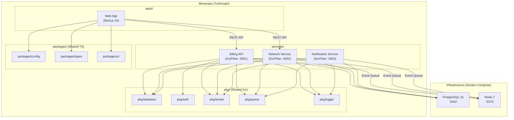
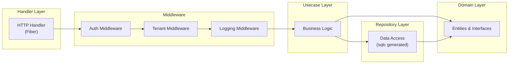

# Design Document — Monorepo Setup (ISPBoss)

## Overview

Dokumen ini mendeskripsikan desain teknis untuk setup fondasi monorepo ISPBoss — SaaS billing dan network management platform untuk ISP dan RT/RW Net. Scope mencakup: Turborepo monorepo structure, Next.js frontend scaffolding, tiga Go service (billing-api, network-service, notification) dengan clean architecture, PostgreSQL multi-tenant dengan RLS, Redis + asynq queue, Docker Compose development environment, shared Go packages, shared TypeScript packages, dan konfigurasi dasar.

### Keputusan Desain Utama

| Keputusan | Pilihan | Alasan |
|---|---|---|
| HTTP Framework | **Fiber v2** | Performa tinggi, Express-like API, cocok untuk Go developer. Dipilih dari opsi Fiber/Gin di arsitektur |
| Monorepo Tool | **Turborepo** | Task orchestration, caching, workspace management untuk JS/TS |
| Go Workspace | **go.work** | Native Go workspace support untuk multi-module monorepo |
| DB Driver | **pgx v5** + **sqlc** | Type-safe queries, connection pooling, native PostgreSQL support |
| Migration | **golang-migrate** | SQL-based, CLI + library, rollback support |
| Auth | **golang-jwt v5** | Standard JWT library, claim embedding |
| Queue | **asynq** | Redis-based, reliable, configurable retry/priority |
| Logging | **zerolog** | Zero-allocation JSON logger, structured logging |
| Config | **viper** | Multi-source config (env, file, defaults) |
| API Docs | **swaggo/swag** | Auto-generate Swagger/OpenAPI dari Go annotations |
| Frontend | **Next.js 15 App Router** | SSR/CSR, file-based routing, React Server Components |
| Styling | **Tailwind CSS v4** + **shadcn/ui** | Utility-first, customizable component library |
| Testing | **testify** + **gomock** + **rapid** | Assertion library, mock generation, property-based testing |

### Prinsip Kode (dari diskusi/00-arsitektur.md)

| Prinsip | Detail |
|---|---|
| Bahasa komentar | **Bahasa Indonesia** — semua komentar kode wajib dalam Bahasa Indonesia |
| Bahasa kode | **English** — nama variabel, fungsi, struct, interface dalam bahasa Inggris |
| Batas file | **Maksimal 200 baris per file** — jika melebihi, pecah ke file terpisah |
| Arsitektur | Clean architecture — domain tidak boleh import handler/repository |
| Modular | Setiap file punya 1 tanggung jawab jelas |

---

## Architecture

### System Architecture Diagram



### Clean Architecture per Service



Setiap Go service mengikuti pola yang sama:
- **Domain**: Entity structs, repository interfaces, usecase interfaces
- **Usecase**: Business logic, orchestration, tidak bergantung pada framework
- **Repository**: Implementasi data access menggunakan sqlc-generated code
- **Handler**: HTTP handler (Fiber), request parsing, response formatting
- **Middleware**: Auth, tenant context, logging, recovery

---

## Components and Interfaces

### 1. Monorepo Root Structure

```
ispboss/
├── apps/
│   └── web/                    # Next.js frontend
├── services/
│   ├── billing-api/            # Go service
│   ├── network-service/        # Go service
│   └── notification/           # Go service
├── pkg/                        # Shared Go packages
│   ├── database/
│   ├── auth/
│   ├── tenant/
│   ├── queue/
│   └── logger/
├── packages/                   # Shared TS packages
│   ├── config/
│   ├── types/
│   └── ui/
├── api-tests/                  # Bruno collection
├── docker/                     # Docker configs
├── turbo.json
├── package.json
├── go.work
├── go.work.sum
├── Makefile
├── .golangci.yml
├── .gitignore
├── .env.example
└── README.md
```

### 2. Go Service Internal Structure (per service)

```
services/billing-api/
├── cmd/
│   └── main.go                 # Entry point, DI, server setup
├── internal/
│   ├── config/
│   │   └── config.go           # Viper config loader
│   ├── domain/
│   │   ├── tenant.go           # Tenant entity
│   │   └── customer.go         # Customer entity (sample)
│   ├── usecase/
│   │   └── health.go           # Health check usecase
│   ├── repository/
│   │   └── queries.sql.go      # sqlc generated
│   ├── handler/
│   │   ├── health.go           # /healthz, /readyz handlers
│   │   └── router.go           # Route registration
│   └── middleware/
│       ├── auth.go             # JWT auth middleware
│       ├── tenant.go           # Tenant context middleware
│       └── logging.go          # Request logging middleware
├── migrations/
│   ├── 000001_init_tenants.up.sql
│   └── 000001_init_tenants.down.sql
├── go.mod
├── go.sum
├── sqlc.yaml
└── Dockerfile
```

### 3. Shared Go Package Interfaces

#### pkg/database

```go
package database

import (
    "context"
    "github.com/jackc/pgx/v5/pgxpool"
)

// PoolConfig berisi konfigurasi connection pool PostgreSQL.
type PoolConfig struct {
    DSN             string
    MaxConns        int32
    MinConns        int32
    MaxConnLifetime time.Duration
    MaxConnIdleTime time.Duration
    ConnTimeout     time.Duration
}

// NewPool membuat connection pool baru menggunakan pgxpool.
func NewPool(ctx context.Context, cfg PoolConfig) (*pgxpool.Pool, error)

// SetTenantID mengatur session variable app.tenant_id di PostgreSQL
// untuk mengaktifkan RLS filtering pada koneksi saat ini.
func SetTenantID(ctx context.Context, pool *pgxpool.Pool, tenantID string) error

// WithTenant menjalankan fungsi fn dalam konteks tenant tertentu.
// Mengambil koneksi dari pool, set tenant_id, jalankan fn, lalu kembalikan koneksi.
func WithTenant(ctx context.Context, pool *pgxpool.Pool, tenantID string, fn func(conn *pgxpool.Conn) error) error
```

#### pkg/auth

```go
package auth

import "github.com/golang-jwt/jwt/v5"

// Claims berisi data yang di-embed dalam JWT token.
type Claims struct {
    jwt.RegisteredClaims
    TenantID string `json:"tenant_id"`
    UserID   string `json:"user_id"`
    Role     string `json:"role"`
}

// TokenConfig berisi konfigurasi untuk JWT token generation.
type TokenConfig struct {
    Secret string
    Expiry time.Duration
    Issuer string
}

// GenerateToken membuat JWT token baru dengan claims yang diberikan.
func GenerateToken(cfg TokenConfig, claims Claims) (string, error)

// ValidateToken memvalidasi JWT token dan mengembalikan claims.
// Mengembalikan error jika token invalid, expired, atau signature tidak cocok.
func ValidateToken(secret string, tokenString string) (*Claims, error)
```

#### pkg/tenant

```go
package tenant

import (
    "context"
    "github.com/gofiber/fiber/v2"
)

// contextKey adalah tipe untuk key context tenant.
type contextKey string

const tenantKey contextKey = "tenant_id"

// Middleware membuat Fiber middleware yang mengekstrak tenant_id dari JWT claims
// dan menyimpannya ke request context.
// Mengembalikan HTTP 401 jika JWT tidak valid atau tenant_id tidak ada.
func Middleware(jwtSecret string) fiber.Handler

// FromContext mengambil tenant_id dari Go context.
// Mengembalikan string kosong jika tenant_id tidak ditemukan.
func FromContext(ctx context.Context) string

// MustFromContext mengambil tenant_id dari Go context.
// Panic jika tenant_id tidak ditemukan (untuk internal use saja).
func MustFromContext(ctx context.Context) string
```

#### pkg/queue

```go
package queue

import (
    "time"
    "github.com/hibiken/asynq"
)

// TaskEnvelope adalah format standar untuk semua task yang dikirim via queue.
type TaskEnvelope struct {
    EventType     string      `json:"event_type"`
    TenantID      string      `json:"tenant_id"`
    Timestamp     time.Time   `json:"timestamp"`
    CorrelationID string      `json:"correlation_id"`
    Payload       interface{} `json:"payload"`
}

// ClientConfig berisi konfigurasi koneksi Redis untuk asynq client.
type ClientConfig struct {
    Host     string
    Port     int
    Password string
    DB       int
}

// NewClient membuat asynq client baru untuk mengirim task ke queue.
func NewClient(cfg ClientConfig) (*asynq.Client, error)

// NewServer membuat asynq server baru untuk memproses task dari queue.
func NewServer(cfg ClientConfig, concurrency int, queues map[string]int) (*asynq.Server, error)

// EnqueueTask membuat asynq.Task dari TaskEnvelope dan mengirimnya ke queue.
func EnqueueTask(client *asynq.Client, envelope TaskEnvelope) error

// DecodeEnvelope mendekode asynq.Task payload menjadi TaskEnvelope.
func DecodeEnvelope(task *asynq.Task) (*TaskEnvelope, error)
```

#### pkg/logger

```go
package logger

import "github.com/rs/zerolog"

// Config berisi konfigurasi logger.
type Config struct {
    Level       string // debug, info, warn, error, fatal
    ServiceName string
    Pretty      bool   // true untuk development (console writer)
}

// New membuat zerolog.Logger baru dengan konfigurasi yang diberikan.
// Output JSON dengan timestamp dan service name.
// Jika Pretty=true, menggunakan ConsoleWriter untuk development.
func New(cfg Config) zerolog.Logger

// NewDefault membuat logger dengan konfigurasi default (info level, JSON output).
func NewDefault(serviceName string) zerolog.Logger
```

### 4. Go Service Config (per service)

```go
package config

// AppConfig berisi semua konfigurasi yang dibutuhkan service.
type AppConfig struct {
    AppName     string `mapstructure:"APP_NAME"`
    AppPort     int    `mapstructure:"APP_PORT"`
    AppEnv      string `mapstructure:"APP_ENV"`
    LogLevel    string `mapstructure:"LOG_LEVEL"`

    DBHost     string `mapstructure:"DB_HOST"`
    DBPort     int    `mapstructure:"DB_PORT"`
    DBUser     string `mapstructure:"DB_USER"`
    DBPassword string `mapstructure:"DB_PASSWORD"`
    DBName     string `mapstructure:"DB_NAME"`
    DBSSLMode  string `mapstructure:"DB_SSL_MODE"`

    RedisHost     string `mapstructure:"REDIS_HOST"`
    RedisPort     int    `mapstructure:"REDIS_PORT"`
    RedisPassword string `mapstructure:"REDIS_PASSWORD"`

    JWTSecret string        `mapstructure:"JWT_SECRET"`
    JWTExpiry time.Duration `mapstructure:"JWT_EXPIRY"`
}

// Load memuat konfigurasi dari environment variables dan .env file.
// Mengembalikan error jika variabel wajib tidak ditemukan.
func Load() (*AppConfig, error)

// Validate memeriksa bahwa semua variabel wajib sudah diisi.
// Mengembalikan error dengan daftar variabel yang hilang.
func (c *AppConfig) Validate() error

// DSN mengembalikan PostgreSQL connection string.
func (c *AppConfig) DSN() string
```

### 5. Health Check Handler

```go
package handler

import "github.com/gofiber/fiber/v2"

// HealthResponse adalah format respons untuk /healthz endpoint.
type HealthResponse struct {
    Status    string `json:"status"`
    Service   string `json:"service"`
    Timestamp string `json:"timestamp"`
}

// ReadyResponse adalah format respons untuk /readyz endpoint.
type ReadyResponse struct {
    Status       string            `json:"status"`
    Dependencies map[string]string `json:"dependencies"`
}

// HealthHandler menangani health check dan readiness check.
type HealthHandler struct {
    serviceName string
    db          *pgxpool.Pool
    redis       *redis.Client
}

// Healthz mengembalikan status service (selalu 200 jika service berjalan).
func (h *HealthHandler) Healthz(c *fiber.Ctx) error

// Readyz memeriksa konektivitas ke database dan Redis.
// Mengembalikan 200 jika semua dependency reachable, 503 jika ada yang gagal.
func (h *HealthHandler) Readyz(c *fiber.Ctx) error
```

### 6. Request Logging Middleware

```go
package middleware

import "github.com/gofiber/fiber/v2"

// RequestLogger membuat Fiber middleware yang mencatat setiap request
// dengan method, path, status code, dan durasi menggunakan zerolog.
func RequestLogger(logger zerolog.Logger) fiber.Handler
```

### 7. Shared TypeScript Packages

#### packages/types

```typescript
// Tipe respons standar API untuk semua endpoint.
export interface ApiResponse<T = unknown> {
  success: boolean;
  data: T;
  error?: {
    code: string;
    message: string;
  };
}
```

#### packages/config

```
packages/config/
├── eslint.config.mjs       # Shared ESLint config untuk Next.js
├── tsconfig.base.json      # Shared TypeScript config (strict mode)
├── prettier.config.mjs     # Shared Prettier config
└── package.json
```

### 8. Docker Compose Stack

```yaml
# docker/docker-compose.yml
services:
  postgres:
    image: postgres:16-alpine
    ports: ["5432:5432"]
    volumes: [postgres_data:/var/lib/postgresql/data]
    healthcheck:
      test: ["CMD-SHELL", "pg_isready -U ispboss"]
      interval: 10s
      timeout: 5s

  redis:
    image: redis:7-alpine
    ports: ["6379:6379"]
    volumes: [redis_data:/data]
    healthcheck:
      test: ["CMD", "redis-cli", "ping"]
      interval: 10s
      timeout: 5s

  billing-api:
    build: {context: .., dockerfile: services/billing-api/Dockerfile}
    ports: ["3001:3001"]
    depends_on:
      postgres: {condition: service_healthy}
      redis: {condition: service_healthy}

  network-service:
    build: {context: .., dockerfile: services/network-service/Dockerfile}
    ports: ["3002:3002"]
    environment: [NETWORK_MODE=mock]
    depends_on:
      postgres: {condition: service_healthy}
      redis: {condition: service_healthy}

  notification:
    build: {context: .., dockerfile: services/notification/Dockerfile}
    ports: ["3003:3003"]
    depends_on:
      postgres: {condition: service_healthy}
      redis: {condition: service_healthy}
```

### 9. Multi-Stage Dockerfile (per Go service)

```dockerfile
# Builder stage
FROM golang:1.24-alpine AS builder
WORKDIR /app
COPY go.work go.work.sum ./
COPY pkg/ ./pkg/
COPY services/billing-api/ ./services/billing-api/
RUN cd services/billing-api && go build -o /app/server ./cmd/

# Runtime stage
FROM alpine:latest
RUN apk --no-cache add ca-certificates tzdata
WORKDIR /app
COPY --from=builder /app/server .
COPY services/billing-api/migrations ./migrations
EXPOSE 3001
CMD ["./server"]
```

---

## Data Models

### PostgreSQL Schema (Initial Migration)

#### tenants table

```sql
-- Tabel tenants: menyimpan data operator ISP/RT-RW Net yang berlangganan ISPBoss.
-- Setiap tenant memiliki data terisolasi via tenant_id dan RLS.
CREATE TABLE tenants (
    id         UUID PRIMARY KEY DEFAULT gen_random_uuid(),
    name       VARCHAR(255) NOT NULL,
    domain     VARCHAR(255),
    plan       VARCHAR(50) NOT NULL DEFAULT 'starter',
    status     VARCHAR(50) NOT NULL DEFAULT 'active',
    created_at TIMESTAMPTZ NOT NULL DEFAULT NOW(),
    updated_at TIMESTAMPTZ NOT NULL DEFAULT NOW()
);

-- Index untuk lookup berdasarkan domain (white label)
CREATE INDEX idx_tenants_domain ON tenants(domain);
CREATE INDEX idx_tenants_status ON tenants(status);
```

#### customers table (sample tenant-scoped)

```sql
-- Tabel customers: contoh tabel tenant-scoped dengan RLS.
-- Digunakan untuk demonstrasi pola isolasi multi-tenant.
CREATE TABLE customers (
    id         UUID PRIMARY KEY DEFAULT gen_random_uuid(),
    tenant_id  UUID NOT NULL REFERENCES tenants(id),
    name       VARCHAR(255) NOT NULL,
    email      VARCHAR(255),
    phone      VARCHAR(50),
    status     VARCHAR(50) NOT NULL DEFAULT 'pending',
    created_at TIMESTAMPTZ NOT NULL DEFAULT NOW(),
    updated_at TIMESTAMPTZ NOT NULL DEFAULT NOW()
);

-- Index pada tenant_id untuk performa query dan RLS
CREATE INDEX idx_customers_tenant_id ON customers(tenant_id);
CREATE INDEX idx_customers_status ON customers(tenant_id, status);
```

#### Row Level Security Setup

```sql
-- Aktifkan RLS pada tabel tenant-scoped
ALTER TABLE customers ENABLE ROW LEVEL SECURITY;

-- Policy: hanya baris dengan tenant_id yang cocok dengan session variable
-- yang bisa diakses (SELECT, INSERT, UPDATE, DELETE)
CREATE POLICY tenant_isolation ON customers
    USING (tenant_id = current_setting('app.tenant_id')::uuid);

-- Policy untuk INSERT: memastikan tenant_id yang di-insert sesuai session
CREATE POLICY tenant_insert ON customers
    FOR INSERT
    WITH CHECK (tenant_id = current_setting('app.tenant_id')::uuid);
```

### Task Envelope (Redis/asynq)

```go
// TaskEnvelope adalah format standar untuk semua event antar service.
// Sesuai dengan event contract schema di arsitektur.
type TaskEnvelope struct {
    EventType     string          `json:"event_type"`      // e.g. "customer.created"
    TenantID      string          `json:"tenant_id"`       // UUID tenant
    Timestamp     time.Time       `json:"timestamp"`       // ISO 8601
    CorrelationID string          `json:"correlation_id"`  // UUID v4 untuk tracing
    Payload       json.RawMessage `json:"payload"`         // JSON payload per event
}
```

### JWT Claims

```go
// Claims berisi data yang di-embed dalam JWT token ISPBoss.
type Claims struct {
    jwt.RegisteredClaims
    TenantID string `json:"tenant_id"` // UUID tenant
    UserID   string `json:"user_id"`   // UUID user
    Role     string `json:"role"`      // e.g. "tenant_admin", "operator"
}
```

### API Response Types

```go
// Go: Standard API response
type APIResponse struct {
    Success bool        `json:"success"`
    Data    interface{} `json:"data,omitempty"`
    Error   *APIError   `json:"error,omitempty"`
}

type APIError struct {
    Code    string `json:"code"`
    Message string `json:"message"`
}
```

```typescript
// TypeScript: Standard API response
export interface ApiResponse<T = unknown> {
  success: boolean;
  data: T;
  error?: {
    code: string;
    message: string;
  };
}
```

### Configuration Environment Variables

| Variable | Required | Default | Description |
|---|---|---|---|
| `APP_NAME` | Yes | - | Nama service (billing-api, network-service, notification) |
| `APP_PORT` | Yes | - | Port HTTP (3001, 3002, 3003) |
| `APP_ENV` | No | development | Environment (development/staging/production) |
| `LOG_LEVEL` | No | info | Level log (debug/info/warn/error/fatal) |
| `DB_HOST` | Yes | - | PostgreSQL host |
| `DB_PORT` | No | 5432 | PostgreSQL port |
| `DB_USER` | Yes | - | PostgreSQL username |
| `DB_PASSWORD` | Yes | - | PostgreSQL password |
| `DB_NAME` | Yes | - | PostgreSQL database name |
| `DB_SSL_MODE` | No | disable | PostgreSQL SSL mode |
| `REDIS_HOST` | Yes | - | Redis host |
| `REDIS_PORT` | No | 6379 | Redis port |
| `REDIS_PASSWORD` | No | - | Redis password |
| `JWT_SECRET` | Yes | - | Secret key untuk JWT signing |
| `JWT_EXPIRY` | No | 24h | JWT token expiry duration |
| `NETWORK_MODE` | No | mock | Network service mode (mock/live) |

