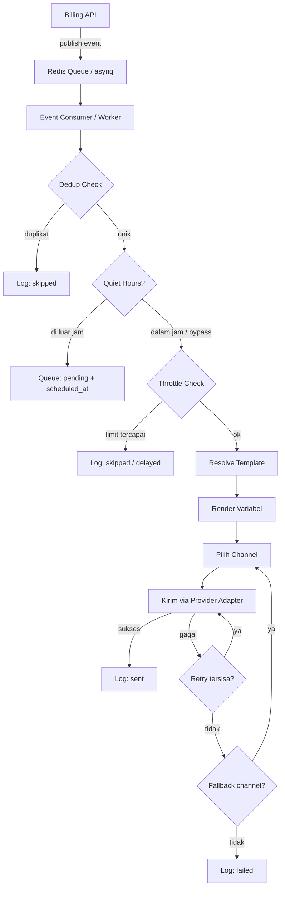
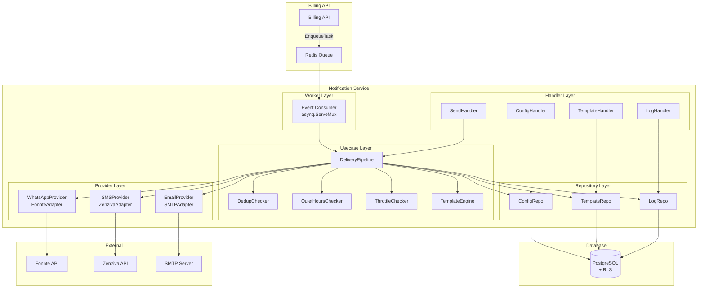
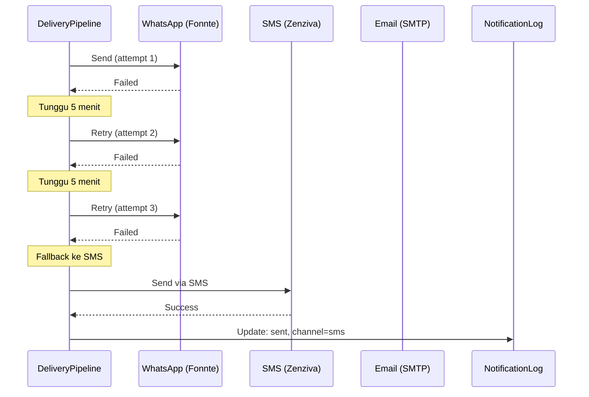
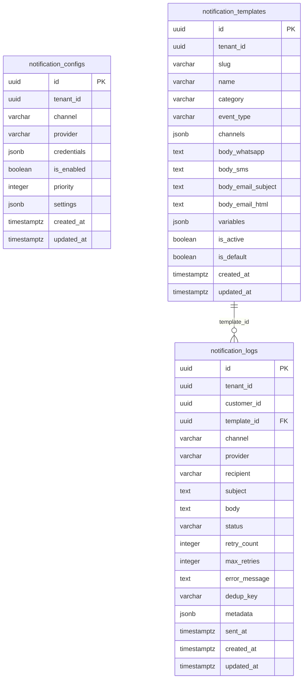

# Dokumen Desain: Notification Service

## Overview

Notification Service adalah service Go terpisah (`services/notification/`) yang menangani seluruh pengiriman pesan ke pelanggan ISP melalui WhatsApp, SMS, dan Email. Service ini menerima event dari Billing API via Redis queue (asynq), melakukan resolusi template dengan substitusi variabel, memilih channel pengiriman berdasarkan konfigurasi tenant, mengirim pesan melalui provider adapter, dan mencatat hasil pengiriman.

### Alur Utama (Delivery Pipeline)



### Keputusan Arsitektur

| Keputusan | Pilihan | Alasan |
|---|---|---|
| HTTP Framework | Fiber v2 | Konsisten dengan billing-api |
| Task Queue | asynq (Redis) | Sudah dipakai di billing-api, `pkg/queue` tersedia |
| Database | PostgreSQL (shared) | Shared DB dengan billing-api, RLS untuk tenant isolation |
| Query Generator | sqlc | Konsisten dengan billing-api pattern |
| Template Engine | Custom `strings.ReplaceAll` | Sederhana, variabel format `{nama}`, tidak perlu library berat |
| Provider WA | Fonnte (HTTP API) | Provider pertama, adapter pattern untuk extensibility |
| Provider SMS | Zenziva (HTTP API) | Provider pertama untuk pasar Indonesia |
| Provider Email | SMTP (net/smtp) | Self-hosted, gratis, standar |
| Logging | zerolog | Konsisten dengan seluruh project |


## Architecture

### Diagram Arsitektur Service



### Diagram Retry & Fallback



### File Baru yang Dibuat

| Path | Deskripsi |
|---|---|
| `services/notification/migrations/000001_create_notification_tables.up.sql` | Migration: buat tabel + RLS + index |
| `services/notification/migrations/000001_create_notification_tables.down.sql` | Migration: rollback |
| `services/notification/internal/domain/notification.go` | Entity: NotificationConfig, NotificationTemplate, NotificationLog |
| `services/notification/internal/domain/constants.go` | Konstanta: status, channel, category |
| `services/notification/internal/domain/errors.go` | Domain errors |
| `services/notification/internal/domain/response.go` | API response helpers (reuse pattern dari billing-api) |
| `services/notification/internal/domain/template_engine.go` | Template engine: substitusi variabel |
| `services/notification/internal/domain/template_engine_test.go` | Unit + property test template engine |
| `services/notification/internal/domain/repository.go` | Interface repository |
| `services/notification/internal/domain/provider.go` | Interface provider adapter |
| `services/notification/internal/domain/dto.go` | Request/response DTO |
| `services/notification/internal/domain/seed.go` | Default template definitions |
| `services/notification/internal/repository/queries/` | sqlc query files |
| `services/notification/internal/repository/config_repo.go` | Implementasi ConfigRepository |
| `services/notification/internal/repository/template_repo.go` | Implementasi TemplateRepository |
| `services/notification/internal/repository/log_repo.go` | Implementasi LogRepository |
| `services/notification/internal/usecase/delivery_pipeline.go` | Delivery pipeline orchestrator |
| `services/notification/internal/usecase/dedup.go` | Deduplication logic |
| `services/notification/internal/usecase/quiet_hours.go` | Quiet hours checker |
| `services/notification/internal/usecase/throttle.go` | Anti-spam throttle |
| `services/notification/internal/provider/fonnte.go` | Fonnte WhatsApp adapter |
| `services/notification/internal/provider/zenziva.go` | Zenziva SMS adapter |
| `services/notification/internal/provider/smtp.go` | SMTP Email adapter |
| `services/notification/internal/handler/log_handler.go` | HTTP handler: notification logs |
| `services/notification/internal/handler/config_handler.go` | HTTP handler: notification config |
| `services/notification/internal/handler/template_handler.go` | HTTP handler: template CRUD |
| `services/notification/internal/handler/send_handler.go` | HTTP handler: test send, manual send, resend |
| `services/notification/internal/worker/event_consumer.go` | asynq worker: event consumer |
| `services/notification/sqlc.yaml` | sqlc config |

### File yang Dimodifikasi

| Path | Perubahan |
|---|---|
| `services/notification/cmd/main.go` | Tambah DI: repos, usecases, handlers, worker, cron |
| `services/notification/internal/config/config.go` | Tambah config: worker concurrency, queue priorities |
| `services/notification/internal/handler/router.go` | Tambah route: logs, config, templates, send, resend |
| `services/notification/go.mod` | Tambah dependency: asynq, validator, net/smtp |


## Components and Interfaces

### 1. Domain Layer

#### Entity: NotificationConfig

```go
// NotificationConfig merepresentasikan konfigurasi provider notifikasi per tenant per channel.
type NotificationConfig struct {
    ID          string          `json:"id"`
    TenantID    string          `json:"tenant_id"`
    Channel     Channel         `json:"channel"`
    Provider    string          `json:"provider"`
    Credentials json.RawMessage `json:"credentials"`
    IsEnabled   bool            `json:"is_enabled"`
    Priority    int             `json:"priority"`
    Settings    ConfigSettings  `json:"settings"`
    CreatedAt   time.Time       `json:"created_at"`
    UpdatedAt   time.Time       `json:"updated_at"`
}

// ConfigSettings berisi pengaturan umum notifikasi per tenant.
type ConfigSettings struct {
    ChannelPriority     []Channel `json:"channel_priority"`
    QuietHoursStart     string    `json:"quiet_hours_start"`
    QuietHoursEnd       string    `json:"quiet_hours_end"`
    Timezone            string    `json:"timezone"`
    DailyLimitPerCust   int       `json:"daily_limit_per_customer"`
    CooldownMinutes     int       `json:"cooldown_minutes"`
}

// WhatsAppCredentials berisi credential untuk provider WhatsApp.
type WhatsAppCredentials struct {
    APIToken     string `json:"api_token"`
    SenderNumber string `json:"sender_number"`
}

// SMSCredentials berisi credential untuk provider SMS.
type SMSCredentials struct {
    APIKey  string `json:"api_key"`
    UserKey string `json:"user_key"`
}

// EmailCredentials berisi credential untuk provider Email SMTP.
type EmailCredentials struct {
    SMTPHost  string `json:"smtp_host"`
    SMTPPort  int    `json:"smtp_port"`
    Username  string `json:"username"`
    Password  string `json:"password"`
    FromName  string `json:"from_name"`
    FromEmail string `json:"from_email"`
}
```

#### Entity: NotificationTemplate

```go
// NotificationTemplate merepresentasikan template notifikasi per tenant.
type NotificationTemplate struct {
    ID               string           `json:"id"`
    TenantID         string           `json:"tenant_id"`
    Slug             string           `json:"slug"`
    Name             string           `json:"name"`
    Category         TemplateCategory `json:"category"`
    EventType        string           `json:"event_type,omitempty"`
    Channels         []Channel        `json:"channels"`
    BodyWhatsApp     string           `json:"body_whatsapp,omitempty"`
    BodySMS          string           `json:"body_sms,omitempty"`
    BodyEmailSubject string           `json:"body_email_subject,omitempty"`
    BodyEmailHTML    string           `json:"body_email_html,omitempty"`
    Variables        []string         `json:"variables"`
    IsActive         bool             `json:"is_active"`
    IsDefault        bool             `json:"is_default"`
    CreatedAt        time.Time        `json:"created_at"`
    UpdatedAt        time.Time        `json:"updated_at"`
}
```

#### Entity: NotificationLog

```go
// NotificationLog merepresentasikan catatan pengiriman notifikasi.
type NotificationLog struct {
    ID           string                 `json:"id"`
    TenantID     string                 `json:"tenant_id"`
    CustomerID   string                 `json:"customer_id"`
    TemplateID   string                 `json:"template_id,omitempty"`
    Channel      Channel                `json:"channel"`
    Provider     string                 `json:"provider"`
    Recipient    string                 `json:"recipient"`
    Subject      string                 `json:"subject,omitempty"`
    Body         string                 `json:"body"`
    Status       LogStatus              `json:"status"`
    RetryCount   int                    `json:"retry_count"`
    MaxRetries   int                    `json:"max_retries"`
    ErrorMessage string                 `json:"error_message,omitempty"`
    DedupKey     string                 `json:"dedup_key,omitempty"`
    Metadata     map[string]interface{} `json:"metadata,omitempty"`
    SentAt       *time.Time             `json:"sent_at,omitempty"`
    CreatedAt    time.Time              `json:"created_at"`
    UpdatedAt    time.Time              `json:"updated_at"`
    // Field JOIN (opsional, dari query)
    CustomerName string `json:"customer_name,omitempty"`
    TemplateName string `json:"template_name,omitempty"`
}
```

#### Constants

```go
// Channel mendefinisikan media pengiriman notifikasi.
type Channel string

const (
    ChannelWhatsApp Channel = "whatsapp"
    ChannelSMS      Channel = "sms"
    ChannelEmail    Channel = "email"
)

// LogStatus mendefinisikan status pengiriman notifikasi.
type LogStatus string

const (
    StatusPending   LogStatus = "pending"
    StatusSending   LogStatus = "sending"
    StatusSent      LogStatus = "sent"
    StatusDelivered LogStatus = "delivered"
    StatusRead      LogStatus = "read"
    StatusFailed    LogStatus = "failed"
    StatusRetrying  LogStatus = "retrying"
    StatusSkipped   LogStatus = "skipped"
)

// TemplateCategory mendefinisikan kategori template notifikasi.
type TemplateCategory string

const (
    CategoryTransactional TemplateCategory = "transactional"
    CategoryReminder      TemplateCategory = "reminder"
    CategoryPromotion     TemplateCategory = "promotion"
    CategoryInformation   TemplateCategory = "information"
)
```

### 2. Provider Adapter Interfaces

```go
// WhatsAppProvider mendefinisikan interface untuk provider WhatsApp.
type WhatsAppProvider interface {
    Send(ctx context.Context, req WhatsAppMessage) (SendResult, error)
}

// SMSProvider mendefinisikan interface untuk provider SMS.
type SMSProvider interface {
    Send(ctx context.Context, req SMSMessage) (SendResult, error)
}

// EmailProvider mendefinisikan interface untuk provider Email.
type EmailProvider interface {
    Send(ctx context.Context, req EmailMessage) (SendResult, error)
}

// WhatsAppMessage berisi data pesan WhatsApp.
type WhatsAppMessage struct {
    Recipient string `json:"recipient"`
    Body      string `json:"body"`
    MediaURL  string `json:"media_url,omitempty"`
}

// SMSMessage berisi data pesan SMS (max 160 karakter).
type SMSMessage struct {
    Recipient string `json:"recipient"`
    Body      string `json:"body"`
}

// EmailMessage berisi data pesan Email.
type EmailMessage struct {
    Recipient string `json:"recipient"`
    Subject   string `json:"subject"`
    HTMLBody  string `json:"html_body"`
}

// SendResult berisi hasil pengiriman dari provider.
type SendResult struct {
    MessageID   string `json:"message_id"`
    Status      string `json:"status"` // "sent" atau "failed"
    ErrorDetail string `json:"error_detail,omitempty"`
}
```

### 3. Repository Interfaces

```go
// ConfigRepository mendefinisikan operasi data untuk tabel notification_configs.
type ConfigRepository interface {
    GetByTenant(ctx context.Context, tenantID string) ([]*NotificationConfig, error)
    GetByTenantAndChannel(ctx context.Context, tenantID string, ch Channel) (*NotificationConfig, error)
    Upsert(ctx context.Context, cfg *NotificationConfig) (*NotificationConfig, error)
    GetSettings(ctx context.Context, tenantID string) (*ConfigSettings, error)
    UpdateSettings(ctx context.Context, tenantID string, s ConfigSettings) error
}

// TemplateRepository mendefinisikan operasi data untuk tabel notification_templates.
type TemplateRepository interface {
    Create(ctx context.Context, t *NotificationTemplate) (*NotificationTemplate, error)
    GetByID(ctx context.Context, id string) (*NotificationTemplate, error)
    GetBySlug(ctx context.Context, tenantID, slug string) (*NotificationTemplate, error)
    GetByEventType(ctx context.Context, tenantID, eventType string) (*NotificationTemplate, error)
    Update(ctx context.Context, t *NotificationTemplate) (*NotificationTemplate, error)
    SoftDelete(ctx context.Context, id string) error
    ListByTenant(ctx context.Context, tenantID string) ([]*NotificationTemplate, error)
    BulkCreate(ctx context.Context, templates []*NotificationTemplate) error
    SlugExists(ctx context.Context, tenantID, slug, excludeID string) (bool, error)
}

// LogRepository mendefinisikan operasi data untuk tabel notification_logs.
type LogRepository interface {
    Create(ctx context.Context, log *NotificationLog) (*NotificationLog, error)
    GetByID(ctx context.Context, id string) (*NotificationLog, error)
    Update(ctx context.Context, log *NotificationLog) error
    List(ctx context.Context, params LogListParams) (*LogListResult, error)
    FindByDedupKey(ctx context.Context, dedupKey string, withinHours int) (*NotificationLog, error)
    CountTodayByCustomer(ctx context.Context, tenantID, customerID string, tz string) (int, error)
    LastSentToCustomer(ctx context.Context, tenantID, customerID string) (*time.Time, error)
}
```

### 4. Template Engine

```go
// TemplateEngine melakukan substitusi variabel pada template body.
type TemplateEngine struct{}

// NewTemplateEngine membuat instance baru TemplateEngine.
func NewTemplateEngine() *TemplateEngine

// Render mengganti semua variabel {nama_var} dengan nilai dari data context.
// Variabel tanpa nilai diganti dengan string kosong dan di-log warning.
func (e *TemplateEngine) Render(body string, data map[string]string) string

// ExtractVariables mengekstrak daftar variabel dari template body.
// Mengembalikan slice nama variabel tanpa kurung kurawal.
func (e *TemplateEngine) ExtractVariables(body string) []string

// FormatMoney memformat angka ke format Rupiah: "Rp 388.500".
func FormatMoney(amount int64) string

// FormatDateID memformat time.Time ke format Indonesia: "5 April 2026".
func FormatDateID(t time.Time) string
```

### 5. Usecase Layer

```go
// DeliveryPipeline mengorkestrasikan seluruh alur pengiriman notifikasi.
type DeliveryPipeline struct {
    configRepo   domain.ConfigRepository
    templateRepo domain.TemplateRepository
    logRepo      domain.LogRepository
    customerRepo CustomerDataFetcher
    tenantRepo   TenantDataFetcher
    engine       *domain.TemplateEngine
    waProvider   domain.WhatsAppProvider
    smsProvider  domain.SMSProvider
    emailProvider domain.EmailProvider
    logger       zerolog.Logger
}

// ProcessEvent memproses satu event dari queue melalui delivery pipeline.
func (p *DeliveryPipeline) ProcessEvent(ctx context.Context, envelope *queue.TaskEnvelope) error

// SendManual mengirim notifikasi manual ke pelanggan tertentu.
func (p *DeliveryPipeline) SendManual(ctx context.Context, req ManualSendRequest) (*domain.NotificationLog, error)

// SendTest mengirim notifikasi test ke recipient tertentu.
func (p *DeliveryPipeline) SendTest(ctx context.Context, req TestSendRequest) (*domain.NotificationLog, error)

// Resend mengirim ulang notifikasi yang gagal.
func (p *DeliveryPipeline) Resend(ctx context.Context, logID string) (*domain.NotificationLog, error)

// CustomerDataFetcher mengambil data pelanggan dari database (shared DB).
type CustomerDataFetcher interface {
    GetCustomerByID(ctx context.Context, customerID string) (*CustomerData, error)
}

// TenantDataFetcher mengambil data tenant dari database (shared DB).
type TenantDataFetcher interface {
    GetTenantByID(ctx context.Context, tenantID string) (*TenantData, error)
}

// CustomerData berisi data pelanggan yang dibutuhkan untuk template.
type CustomerData struct {
    ID            string
    CustomerIDSeq string
    Name          string
    Phone         string
    Email         string
    PackageName   string
    PackagePrice  int64
}

// TenantData berisi data tenant yang dibutuhkan untuk template.
type TenantData struct {
    ID       string
    Name     string
    Phone    string
    Timezone string
}
```

### 6. Handler Layer

```go
// LogHandler menangani HTTP request untuk notification logs.
type LogHandler struct { ... }
func (h *LogHandler) List(c *fiber.Ctx) error       // GET /api/v1/notifications/logs
func (h *LogHandler) GetByID(c *fiber.Ctx) error    // GET /api/v1/notifications/logs/:id

// ConfigHandler menangani HTTP request untuk notification config.
type ConfigHandler struct { ... }
func (h *ConfigHandler) Get(c *fiber.Ctx) error      // GET /api/v1/notifications/config
func (h *ConfigHandler) Update(c *fiber.Ctx) error   // PUT /api/v1/notifications/config

// TemplateHandler menangani HTTP request untuk notification templates.
type TemplateHandler struct { ... }
func (h *TemplateHandler) List(c *fiber.Ctx) error    // GET /api/v1/notifications/templates
func (h *TemplateHandler) Create(c *fiber.Ctx) error  // POST /api/v1/notifications/templates
func (h *TemplateHandler) Update(c *fiber.Ctx) error  // PUT /api/v1/notifications/templates/:id
func (h *TemplateHandler) Delete(c *fiber.Ctx) error  // DELETE /api/v1/notifications/templates/:id

// SendHandler menangani HTTP request untuk pengiriman notifikasi.
type SendHandler struct { ... }
func (h *SendHandler) TestSend(c *fiber.Ctx) error    // POST /api/v1/notifications/test
func (h *SendHandler) ManualSend(c *fiber.Ctx) error  // POST /api/v1/notifications/send
func (h *SendHandler) Resend(c *fiber.Ctx) error      // POST /api/v1/notifications/logs/:id/resend
```

### 7. Worker Layer

```go
// EventConsumer menangani event dari Redis queue via asynq.
type EventConsumer struct {
    pipeline *usecase.DeliveryPipeline
    logger   zerolog.Logger
}

// RegisterHandlers mendaftarkan semua handler event ke asynq ServeMux.
func (w *EventConsumer) RegisterHandlers(mux *asynq.ServeMux)

// Daftar event yang di-handle:
// - invoice.created, invoice.reminder
// - payment.online.received, payment.recorded
// - customer.isolir, customer.un_isolir, customer.suspend
// - notification.isolir, notification.un_isolir, notification.suspend
// - notification.reactivated, notification.pending_sync_failed
// - invoice.penalty_added
```


## Data Models

### Database Migration SQL

#### Tabel `notification_configs`

```sql
-- Tabel notification_configs: menyimpan konfigurasi provider notifikasi per tenant per channel.
-- Setiap tenant bisa punya satu konfigurasi per channel (WA, SMS, Email).
CREATE TABLE notification_configs (
    id UUID PRIMARY KEY DEFAULT gen_random_uuid(),
    tenant_id UUID NOT NULL,
    channel VARCHAR(20) NOT NULL,
    provider VARCHAR(50) NOT NULL,
    credentials JSONB NOT NULL,
    is_enabled BOOLEAN NOT NULL DEFAULT false,
    priority INTEGER NOT NULL DEFAULT 1,
    settings JSONB DEFAULT '{}',
    created_at TIMESTAMPTZ NOT NULL DEFAULT NOW(),
    updated_at TIMESTAMPTZ NOT NULL DEFAULT NOW(),

    CONSTRAINT chk_notif_config_channel CHECK (channel IN ('whatsapp', 'sms', 'email')),
    CONSTRAINT uq_notif_config_tenant_channel UNIQUE (tenant_id, channel)
);

-- RLS: isolasi data per tenant
ALTER TABLE notification_configs ENABLE ROW LEVEL SECURITY;

CREATE POLICY tenant_select_notif_config ON notification_configs
    FOR SELECT USING (tenant_id = current_setting('app.tenant_id')::uuid);
CREATE POLICY tenant_insert_notif_config ON notification_configs
    FOR INSERT WITH CHECK (tenant_id = current_setting('app.tenant_id')::uuid);
CREATE POLICY tenant_update_notif_config ON notification_configs
    FOR UPDATE USING (tenant_id = current_setting('app.tenant_id')::uuid);
CREATE POLICY tenant_delete_notif_config ON notification_configs
    FOR DELETE USING (tenant_id = current_setting('app.tenant_id')::uuid);

-- Index untuk query performa
CREATE INDEX idx_notif_config_tenant_enabled ON notification_configs (tenant_id, is_enabled);
```

#### Tabel `notification_templates`

```sql
-- Tabel notification_templates: menyimpan template notifikasi per tenant.
-- Setiap template punya slug unik per tenant dan bisa di-link ke event_type.
CREATE TABLE notification_templates (
    id UUID PRIMARY KEY DEFAULT gen_random_uuid(),
    tenant_id UUID NOT NULL,
    slug VARCHAR(100) NOT NULL,
    name VARCHAR(255) NOT NULL,
    category VARCHAR(20) NOT NULL,
    event_type VARCHAR(100),
    channels JSONB NOT NULL DEFAULT '[]',
    body_whatsapp TEXT,
    body_sms TEXT,
    body_email_subject TEXT,
    body_email_html TEXT,
    variables JSONB NOT NULL DEFAULT '[]',
    is_active BOOLEAN NOT NULL DEFAULT true,
    is_default BOOLEAN NOT NULL DEFAULT false,
    created_at TIMESTAMPTZ NOT NULL DEFAULT NOW(),
    updated_at TIMESTAMPTZ NOT NULL DEFAULT NOW(),

    CONSTRAINT chk_notif_template_category CHECK (
        category IN ('transactional', 'reminder', 'promotion', 'information')
    ),
    CONSTRAINT uq_notif_template_tenant_slug UNIQUE (tenant_id, slug)
);

-- RLS: isolasi data per tenant
ALTER TABLE notification_templates ENABLE ROW LEVEL SECURITY;

CREATE POLICY tenant_select_notif_template ON notification_templates
    FOR SELECT USING (tenant_id = current_setting('app.tenant_id')::uuid);
CREATE POLICY tenant_insert_notif_template ON notification_templates
    FOR INSERT WITH CHECK (tenant_id = current_setting('app.tenant_id')::uuid);
CREATE POLICY tenant_update_notif_template ON notification_templates
    FOR UPDATE USING (tenant_id = current_setting('app.tenant_id')::uuid);
CREATE POLICY tenant_delete_notif_template ON notification_templates
    FOR DELETE USING (tenant_id = current_setting('app.tenant_id')::uuid);

-- Index untuk lookup berdasarkan event_type dan status aktif
CREATE INDEX idx_notif_template_tenant_event ON notification_templates (tenant_id, event_type);
CREATE INDEX idx_notif_template_tenant_active ON notification_templates (tenant_id, is_active);
```

#### Tabel `notification_logs`

```sql
-- Tabel notification_logs: mencatat setiap pengiriman notifikasi beserta status dan detail.
-- Digunakan untuk audit trail, retry tracking, dan deduplication.
CREATE TABLE notification_logs (
    id UUID PRIMARY KEY DEFAULT gen_random_uuid(),
    tenant_id UUID NOT NULL,
    customer_id UUID NOT NULL,
    template_id UUID REFERENCES notification_templates(id),
    channel VARCHAR(20) NOT NULL,
    provider VARCHAR(50) NOT NULL,
    recipient VARCHAR(255) NOT NULL,
    subject TEXT,
    body TEXT NOT NULL,
    status VARCHAR(20) NOT NULL DEFAULT 'pending',
    retry_count INTEGER NOT NULL DEFAULT 0,
    max_retries INTEGER NOT NULL DEFAULT 3,
    error_message TEXT,
    dedup_key VARCHAR(500),
    metadata JSONB DEFAULT '{}',
    sent_at TIMESTAMPTZ,
    created_at TIMESTAMPTZ NOT NULL DEFAULT NOW(),
    updated_at TIMESTAMPTZ NOT NULL DEFAULT NOW(),

    CONSTRAINT chk_notif_log_status CHECK (
        status IN ('pending', 'sending', 'sent', 'delivered', 'read', 'failed', 'retrying', 'skipped')
    ),
    CONSTRAINT chk_notif_log_channel CHECK (channel IN ('whatsapp', 'sms', 'email'))
);

-- RLS: isolasi data per tenant
ALTER TABLE notification_logs ENABLE ROW LEVEL SECURITY;

CREATE POLICY tenant_select_notif_log ON notification_logs
    FOR SELECT USING (tenant_id = current_setting('app.tenant_id')::uuid);
CREATE POLICY tenant_insert_notif_log ON notification_logs
    FOR INSERT WITH CHECK (tenant_id = current_setting('app.tenant_id')::uuid);
CREATE POLICY tenant_update_notif_log ON notification_logs
    FOR UPDATE USING (tenant_id = current_setting('app.tenant_id')::uuid);
CREATE POLICY tenant_delete_notif_log ON notification_logs
    FOR DELETE USING (tenant_id = current_setting('app.tenant_id')::uuid);

-- Index untuk query performa
CREATE INDEX idx_notif_log_tenant_customer ON notification_logs (tenant_id, customer_id);
CREATE INDEX idx_notif_log_tenant_status ON notification_logs (tenant_id, status);
CREATE INDEX idx_notif_log_tenant_created ON notification_logs (tenant_id, created_at DESC);
CREATE INDEX idx_notif_log_dedup ON notification_logs (dedup_key);

-- Partial unique index untuk deduplication: hanya satu notifikasi aktif per dedup_key dalam 1 jam.
-- Status 'skipped' dikecualikan agar tidak memblokir pengiriman ulang.
CREATE UNIQUE INDEX uq_notif_log_dedup_active
    ON notification_logs (dedup_key)
    WHERE dedup_key IS NOT NULL
      AND status NOT IN ('skipped', 'failed')
      AND created_at > NOW() - INTERVAL '1 hour';
```

### ER Diagram



### sqlc Configuration

```yaml
# services/notification/sqlc.yaml
version: "2"
sql:
  - engine: "postgresql"
    queries: "queries/"
    schema: "migrations/"
    gen:
      go:
        package: "repository"
        out: "internal/repository"
        sql_package: "pgx/v5"
        emit_json_tags: true
        emit_empty_slices: true
```


## Correctness Properties

*A property is a characteristic or behavior that should hold true across all valid executions of a system — essentially, a formal statement about what the system should do. Properties serve as the bridge between human-readable specifications and machine-verifiable correctness guarantees.*

### Property 1: Template rendering completeness

*For any* template body containing `{variable}` placeholders and *any* data map (possibly missing some keys), after rendering, the output SHALL NOT contain any `{variable}` pattern — all placeholders are either replaced with their value or with an empty string.

**Validates: Requirements 5.1, 5.3**

### Property 2: Template render idempotence

*For any* valid template body and data map, rendering the template once, then extracting variables from the result, then re-rendering with the same data SHALL produce an identical output.

**Validates: Requirements 5.4**

### Property 3: FormatMoney round-trip

*For any* non-negative int64 amount, `FormatMoney(amount)` SHALL produce a string starting with "Rp " followed by digits with thousand separators (dots), and parsing the numeric part back (removing "Rp " and dots) SHALL yield the original amount.

**Validates: Requirements 5.5**

### Property 4: FormatDateID contains valid Indonesian month

*For any* valid `time.Time` value, `FormatDateID(t)` SHALL produce a string containing the day number and one of the 12 Indonesian month names (Januari, Februari, Maret, April, Mei, Juni, Juli, Agustus, September, Oktober, November, Desember) followed by the year.

**Validates: Requirements 5.6**

### Property 5: Dedup key format consistency

*For any* tenant_id, customer_id, template_slug, and periode strings, the generated dedup key SHALL equal `"{tenant_id}:{customer_id}:{template_slug}:{periode}"` and splitting the key by ":" SHALL yield exactly the original 4 components.

**Validates: Requirements 9.1**

### Property 6: Deduplication invariant

*For any* sequence of N notifications (N ≥ 2) with the same dedup_key processed within a 1-hour window, only the first notification SHALL have status `sent` or `delivered`; all subsequent notifications SHALL have status `skipped` with metadata reason "duplicate".

**Validates: Requirements 9.5**

### Property 7: Quiet hours blocking

*For any* time `t` in a tenant's timezone and quiet hours config `[start, end)`, if `t` is outside the range `[start, end)` (i.e., before start or at/after end), the notification SHALL be queued with status `pending`; if `t` is within `[start, end)`, the notification SHALL proceed.

**Validates: Requirements 10.1**

### Property 8: Quiet hours bypass for exempt events

*For any* time (including times outside quiet hours) and *any* event_type in the bypass list (`payment.online.received`, `payment.recorded`, `notification.un_isolir`, `notification.reactivated`), the quiet hours check SHALL return "allow" regardless of the current time.

**Validates: Requirements 10.4**

### Property 9: Throttle daily limit enforcement

*For any* customer with `count` notifications already sent today and a configured `daily_limit`, if `count >= daily_limit` then the notification SHALL be skipped; if `count < daily_limit` then the notification SHALL proceed (assuming cooldown is satisfied).

**Validates: Requirements 11.2**

### Property 10: Throttle cooldown delay

*For any* customer whose last notification was sent at time `last_sent_at` and a configured `cooldown_minutes`, if `now - last_sent_at < cooldown_minutes` then the notification SHALL be delayed to `last_sent_at + cooldown_minutes`; otherwise it SHALL proceed immediately.

**Validates: Requirements 11.4**

### Property 11: Throttle bypass for exempt events

*For any* throttle state (daily limit reached or cooldown not elapsed) and *any* event_type in the bypass list (`payment.online.received`, `payment.recorded`, `notification.un_isolir`, `notification.reactivated`), the throttle check SHALL return "allow" regardless of the throttle state.

**Validates: Requirements 11.5**

### Property 12: Channel selection respects priority order

*For any* tenant channel priority list and template channel configuration, the selected channel SHALL be the first channel in the priority list that is also present in the template's channel list and has an enabled provider config.

**Validates: Requirements 7.4**

### Property 13: Credential masking preserves last 4 characters

*For any* credential string of length ≥ 4, the masked output SHALL end with the last 4 characters of the original and all preceding characters SHALL be replaced with "•". For strings shorter than 4 characters, the entire string SHALL be masked as "••••••••".

**Validates: Requirements 13.6**

### Property 14: Config validation — credentials required when enabled

*For any* notification config with `is_enabled = true`, validation SHALL fail if any required credential field for the provider is empty; validation SHALL pass if all required fields are non-empty.

**Validates: Requirements 13.3**

### Property 15: Template validation — at least one channel body required

*For any* template create/update request, validation SHALL fail if all body fields (`body_whatsapp`, `body_sms`, `body_email_subject` + `body_email_html`) are empty; validation SHALL pass if at least one channel body is provided.

**Validates: Requirements 14.5**

### Property 16: Settings range validation

*For any* integer value for `daily_limit_per_customer`, validation SHALL pass if and only if the value is in [1, 20]. *For any* integer value for `cooldown_minutes`, validation SHALL pass if and only if the value is in [5, 120].

**Validates: Requirements 20.5, 20.6**

### Property 17: Quiet hours time validation

*For any* pair of HH:MM strings `quiet_hours_start` and `quiet_hours_end`, validation SHALL pass if and only if `start` is chronologically before `end` within the same day.

**Validates: Requirements 20.3**

### Property 18: Page size normalization

*For any* integer `page_size` value, the system SHALL use the value as-is if it is one of {10, 25, 50}; otherwise it SHALL default to 25.

**Validates: Requirements 12.3**


## Error Handling

### Strategi Error Handling

| Layer | Strategi | Contoh |
|---|---|---|
| **Worker** | Log error + skip event (jangan retry jika payload invalid) | Payload JSON rusak → log warning, return nil |
| **Delivery Pipeline** | Log + create NotificationLog dengan status `failed` | Template tidak ditemukan → log warning, skip |
| **Provider Adapter** | Return `SendResult` dengan status `failed` + error detail | Fonnte timeout → retry via pipeline |
| **Repository** | Wrap error dengan context, propagate ke caller | DB connection lost → return wrapped error |
| **Handler** | Map domain error ke HTTP status code | `ErrTemplateNotFound` → 404 |

### Domain Errors

```go
var (
    ErrTemplateNotFound      = errors.New("template tidak ditemukan")
    ErrTemplateSlugExists    = errors.New("slug template sudah ada")
    ErrTemplateNotDeletable  = errors.New("template default tidak bisa dihapus")
    ErrConfigNotFound        = errors.New("konfigurasi notifikasi tidak ditemukan")
    ErrProviderNotConfigured = errors.New("provider belum dikonfigurasi untuk channel ini")
    ErrCustomerNotFound      = errors.New("pelanggan tidak ditemukan")
    ErrLogNotFound           = errors.New("log notifikasi tidak ditemukan")
    ErrNotResendable         = errors.New("hanya notifikasi gagal yang bisa dikirim ulang")
    ErrInvalidCredentials    = errors.New("credential tidak valid atau tidak lengkap")
    ErrDailyLimitExceeded    = errors.New("batas harian notifikasi tercapai")
    ErrInvalidTimezone       = errors.New("timezone tidak valid")
    ErrInvalidQuietHours     = errors.New("jam mulai harus sebelum jam selesai")
)
```

### HTTP Error Mapping

| Domain Error | HTTP Status | Error Code |
|---|---|---|
| `ErrTemplateNotFound` | 404 | `TEMPLATE_NOT_FOUND` |
| `ErrTemplateSlugExists` | 409 | `TEMPLATE_SLUG_EXISTS` |
| `ErrTemplateNotDeletable` | 422 | `TEMPLATE_NOT_DELETABLE` |
| `ErrProviderNotConfigured` | 422 | `PROVIDER_NOT_CONFIGURED` |
| `ErrCustomerNotFound` | 404 | `CUSTOMER_NOT_FOUND` |
| `ErrLogNotFound` | 404 | `LOG_NOT_FOUND` |
| `ErrNotResendable` | 422 | `NOT_RESENDABLE` |
| `ErrInvalidCredentials` | 422 | `INVALID_CREDENTIALS` |
| `ErrDailyLimitExceeded` | 429 | `DAILY_LIMIT_EXCEEDED` |
| `ErrInvalidTimezone` | 422 | `INVALID_TIMEZONE` |
| `ErrInvalidQuietHours` | 422 | `INVALID_QUIET_HOURS` |
| Validation error | 422 | `VALIDATION_ERROR` |
| Internal error | 500 | `INTERNAL_ERROR` |

### Graceful Degradation

- **Provider gagal**: Retry 2x pada channel yang sama → fallback ke channel berikutnya → log sebagai `failed` jika semua gagal
- **Template tidak ditemukan**: Skip notifikasi, log warning — billing tetap berjalan
- **Database error**: Return 500, log error — tidak crash service
- **Redis down**: asynq worker berhenti menerima task, HTTP API tetap berjalan untuk query log/config
- **Notifikasi gagal tidak menghentikan proses billing**: Invoice tetap digenerate, isolir tetap berjalan


## Testing Strategy

### Pendekatan Dual Testing

Testing menggunakan dua pendekatan komplementer:

1. **Unit tests (example-based)**: Verifikasi contoh spesifik, edge case, dan error condition
2. **Property tests (property-based)**: Verifikasi properti universal yang berlaku untuk semua input valid

### Library Testing

| Library | Kegunaan |
|---|---|
| `testing` (stdlib) | Test runner |
| `github.com/stretchr/testify` | Assertions dan mocking |
| `pgx/v5/pgxpool` + testcontainers | Integration test dengan PostgreSQL |
| `net/http/httptest` | Mock HTTP server untuk provider adapter |
| `pgregory.net/rapid` | Property-based testing (konsisten dengan billing-api) |

### Property-Based Testing Configuration

- Library: **rapid** (`pgregory.net/rapid`)
- Minimum **100 iterasi** per property test
- Setiap property test di-tag dengan komentar referensi ke design property
- Format tag: `Feature: notification-service, Property {number}: {property_text}`

### Test Plan per Layer

#### Domain Layer (Unit + Property Tests)

| Test | Tipe | Property Ref |
|---|---|---|
| Template engine: semua placeholder terganti | Property | Property 1 |
| Template engine: render idempotence | Property | Property 2 |
| FormatMoney: round-trip | Property | Property 3 |
| FormatDateID: Indonesian month | Property | Property 4 |
| Dedup key: format consistency | Property | Property 5 |
| Quiet hours: blocking logic | Property | Property 7 |
| Quiet hours: bypass exempt events | Property | Property 8 |
| Throttle: daily limit | Property | Property 9 |
| Throttle: cooldown delay | Property | Property 10 |
| Throttle: bypass exempt events | Property | Property 11 |
| Channel selection: priority order | Property | Property 12 |
| Credential masking | Property | Property 13 |
| Config validation: credentials required | Property | Property 14 |
| Template validation: body required | Property | Property 15 |
| Settings range validation | Property | Property 16 |
| Quiet hours time validation | Property | Property 17 |
| Page size normalization | Property | Property 18 |

#### Usecase Layer (Unit Tests with Mocks)

| Test | Tipe |
|---|---|
| DeliveryPipeline: happy path (event → template → render → send → log) | Example |
| DeliveryPipeline: template not found → skip | Example |
| DeliveryPipeline: dedup detected → skip | Example |
| DeliveryPipeline: quiet hours → queue | Example |
| DeliveryPipeline: throttle → skip/delay | Example |
| DeliveryPipeline: retry + fallback flow | Example |
| DeliveryPipeline: all channels fail → status failed | Example |
| Deduplication invariant (sequence of same dedup_key) | Property (Property 6) |
| ManualSend: with template_id | Example |
| ManualSend: with custom body | Example |
| TestSend: bypass guards | Example |
| Resend: only failed logs | Example |

#### Handler Layer (HTTP Tests)

| Test | Tipe |
|---|---|
| GET /logs: pagination, filters, sort | Example |
| GET /config: returns masked credentials | Example |
| PUT /config: validation errors | Example |
| POST /templates: create + slug conflict | Example |
| PUT /templates/:id: update | Example |
| DELETE /templates/:id: default vs custom | Example |
| POST /test: send test notification | Example |
| POST /send: manual send | Example |
| POST /logs/:id/resend: resend failed | Example |

#### Provider Layer (Integration Tests with Mock HTTP)

| Test | Tipe |
|---|---|
| FonnteAdapter: successful send | Integration |
| FonnteAdapter: API error handling | Integration |
| ZenzivaAdapter: successful send | Integration |
| ZenzivaAdapter: API error handling | Integration |
| SMTPAdapter: successful send | Integration |
| SMTPAdapter: connection error | Integration |

#### Repository Layer (Integration Tests with TestDB)

| Test | Tipe |
|---|---|
| ConfigRepo: CRUD operations | Integration |
| TemplateRepo: CRUD + slug uniqueness | Integration |
| LogRepo: CRUD + dedup query + daily count | Integration |
| RLS: tenant isolation across all tables | Integration |

### Struktur File Test

```
services/notification/
├── internal/
│   ├── domain/
│   │   ├── template_engine_test.go      # Property + unit tests
│   │   ├── validation_test.go           # Property + unit tests
│   │   └── format_test.go              # Property tests (FormatMoney, FormatDateID)
│   ├── usecase/
│   │   ├── delivery_pipeline_test.go    # Unit tests with mocks
│   │   ├── dedup_test.go               # Property test (dedup invariant)
│   │   ├── quiet_hours_test.go         # Property tests
│   │   └── throttle_test.go            # Property tests
│   ├── handler/
│   │   ├── log_handler_test.go         # HTTP tests
│   │   ├── config_handler_test.go      # HTTP tests
│   │   ├── template_handler_test.go    # HTTP tests
│   │   └── send_handler_test.go        # HTTP tests
│   ├── provider/
│   │   ├── fonnte_test.go              # Integration with mock HTTP
│   │   ├── zenziva_test.go             # Integration with mock HTTP
│   │   └── smtp_test.go               # Integration with mock SMTP
│   └── repository/
│       ├── config_repo_test.go         # Integration with test DB
│       ├── template_repo_test.go       # Integration with test DB
│       └── log_repo_test.go            # Integration with test DB
```

