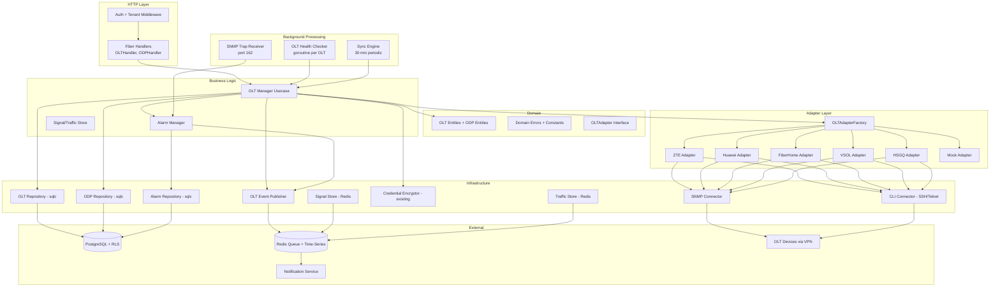
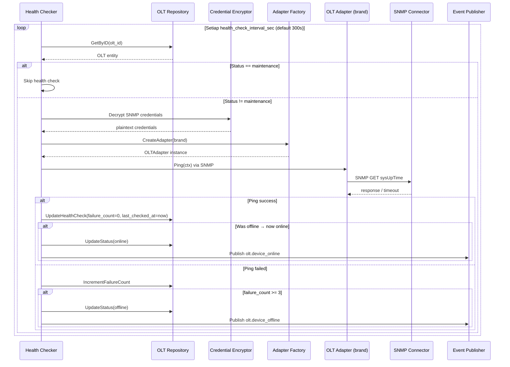
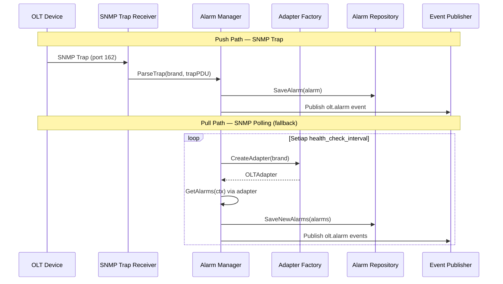
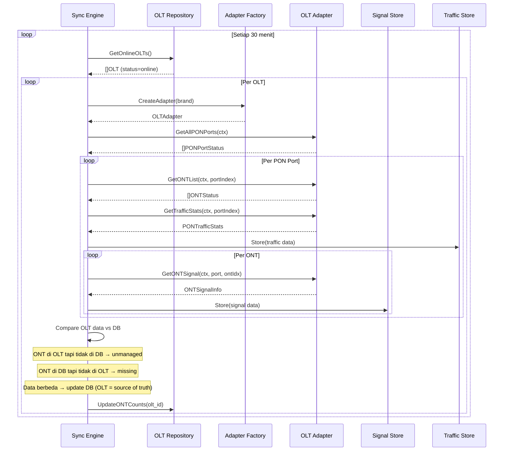

# Design Document — OLT Management Layer

## Overview

Dokumen ini mendeskripsikan desain teknis untuk **OLT Management Layer** di `services/network-service/`. Layer ini dibangun di atas **MikroTik Router Foundation Layer** (spec `mikrotik-router`) dan **VPN Tunnel Management Layer** (spec `mikrotik-vpn`) yang sudah diimplementasikan. Layer ini menangani management plane OLT: registrasi perangkat dengan auto-detect, adapter pattern multi-brand, koneksi SNMP dan CLI, health check, ODP/splitter management, PON port monitoring, ONT status monitoring, alarm management, SFP monitoring, periodic sync, traffic monitoring, capacity planning, HTTP API, event publishing, dan security.

OLT (Optical Line Terminal) mengelola layer fisik jaringan fiber (FTTH). ISPBoss mendukung multi-brand OLT (ZTE, Huawei, FiberHome, VSOL, HSGQ) dengan adapter pattern per brand — pola yang sama dengan MikroTik v6/v7 command builder. Komunikasi ke OLT menggunakan **SNMP** (library `gosnmp`) untuk monitoring dan **SSH/Telnet** (library `golang.org/x/crypto/ssh`) untuk provisioning command.

Scope spec ini mencakup **management plane** saja. **Provisioning ONT** (add/remove ONT, unregistered detection, VLAN management, bulk provisioning, decommission) akan dicover di spec terpisah (`olt-provisioning`).

Desain mengikuti arsitektur domain-driven yang sudah ada: **domain → repository → usecase → handler**, dengan sqlc untuk query generation, Fiber v2 untuk HTTP, asynq untuk event worker, dan zerolog untuk logging. Komentar dalam bahasa Indonesia, maksimal 200 baris per file.

### Keputusan Teknis Utama

| Keputusan | Pilihan | Alasan |
|---|---|---|
| Adapter pattern | Interface `OLTAdapter` per brand (ZTE, Huawei, FiberHome, VSOL, HSGQ) | Sama seperti MikroTik v6/v7 command builder — abstraksi perbedaan OID dan CLI command |
| Monitoring protokol | SNMP v2c/v3 via `gosnmp` | Stateless, efisien untuk polling berkala, standar industri OLT |
| Provisioning protokol | SSH via `golang.org/x/crypto/ssh`, Telnet untuk brand tertentu | CLI command berbeda per brand, connect-on-demand (bukan pool) |
| SNMP trap receiver | Port 162, goroutine listener | Push alarm dari OLT tanpa polling, real-time notification |
| Connection strategy | SNMP polling (stateless) + CLI connect-on-demand | Berbeda dari MikroTik yang pakai connection pool persistent — OLT CLI session-based |
| Source of truth | OLT = source of truth untuk data fisik | ONT bisa dipindah/dicabut tanpa melalui ISPBoss, sync 30 menit |
| Health check | SNMP ping setiap 5 menit (configurable), 3x failure → offline | Konsisten dengan MikroTik health checker pattern |
| Signal thresholds | Normal (-8 to -25 dBm), Warning (-25 to -27), Weak (-27 to -30), Critical (< -30) | Standar industri GPON, configurable per tenant |
| Signal storage | Redis time-series, 30 hari retensi | Konsisten dengan router metrics store pattern |
| Traffic storage | Redis time-series, 7 hari retensi | Konsisten dengan VPN bandwidth store pattern |
| Alarm storage | PostgreSQL `olt_alarms` table, 90 hari retensi | Perlu query kompleks (filter severity, status, port) |
| Credential security | AES-256-GCM via existing `CredentialEncryptor` | Reuse dari MikroTik layer, same ENCRYPTION_KEY |
| Event publishing | asynq via `pkg/queue` TaskEnvelope | Konsisten dengan router dan VPN event pattern |
| Mock adapter | `MockOLTAdapter` untuk development | Tidak ada OLT virtual — mock saja untuk testing |
| ODP management | Tabel `odps` dengan capacity tracking dan GPS | Untuk FTTH mapping dan capacity planning |
| Periodic sync | 30 menit interval, compare OLT data vs database | OLT = source of truth, detect unmanaged/missing ONT |
| PBT library | `pgregory.net/rapid` | Sudah dipakai di codebase existing |


## Architecture

### Layer Architecture



### Health Check Flow



### Alarm Flow (Trap + Polling)



### Periodic Sync Flow




## Components and Interfaces

### 1. OLT Adapter Interface (Multi-Brand)

```go
// OLTAdapter mendefinisikan interface untuk komunikasi dengan OLT device.
// Diimplementasikan per brand: ZTEAdapter, HuaweiAdapter, FiberHomeAdapter, VSOLAdapter, HSGQAdapter, MockOLTAdapter.
// Setiap adapter mengabstraksi perbedaan SNMP OID dan CLI command antar brand.
type OLTAdapter interface {
    // GetSystemInfo mengambil informasi sistem OLT (brand, model, firmware, uptime, pon_ports, total_ont).
    GetSystemInfo(ctx context.Context) (*OLTSystemInfo, error)

    // GetPONPortStatus mengambil status satu PON port (admin/oper status, ONT count, description).
    GetPONPortStatus(ctx context.Context, portIndex int) (*PONPortStatus, error)

    // GetAllPONPorts mengambil status semua PON port pada OLT.
    GetAllPONPorts(ctx context.Context) ([]PONPortStatus, error)

    // GetONTList mengambil daftar ONT yang terdaftar pada satu PON port.
    GetONTList(ctx context.Context, portIndex int) ([]ONTStatus, error)

    // GetONTSignal mengambil informasi signal ONT (rx_power, distance, uptime).
    GetONTSignal(ctx context.Context, portIndex int, ontIndex int) (*ONTSignalInfo, error)

    // GetAlarms mengambil daftar alarm aktif dari OLT.
    GetAlarms(ctx context.Context) ([]OLTAlarm, error)

    // GetSFPInfo mengambil informasi SFP module pada satu PON port.
    GetSFPInfo(ctx context.Context, portIndex int) (*SFPInfo, error)

    // GetTrafficStats mengambil statistik traffic pada satu PON port.
    GetTrafficStats(ctx context.Context, portIndex int) (*PONTrafficStats, error)

    // Ping memeriksa konektivitas OLT via SNMP GET sysUpTime.
    Ping(ctx context.Context) error
}
```

### 2. OLT Adapter Factory

```go
// OLTAdapterFactory membuat instance OLTAdapter berdasarkan brand dan konfigurasi koneksi.
// Jika NETWORK_MODE=mock, selalu mengembalikan MockOLTAdapter.
type OLTAdapterFactory interface {
    // CreateAdapter membuat adapter sesuai brand OLT dengan konfigurasi SNMP dan CLI.
    CreateAdapter(brand OLTBrand, snmpCfg SNMPConfig, cliCfg CLIConfig) (OLTAdapter, error)
}

// SNMPConfig berisi konfigurasi koneksi SNMP ke OLT.
type SNMPConfig struct {
    Host             string
    Port             int           // default 161
    Version          SNMPVersion   // v2c atau v3
    Community        string        // untuk v2c
    Username         string        // untuk v3
    AuthProtocol     string        // MD5 atau SHA (v3)
    AuthPassword     string        // untuk v3
    PrivProtocol     string        // DES atau AES (v3)
    PrivPassword     string        // untuk v3
    Timeout          time.Duration // default 5s connect, 10s request
}

// CLIConfig berisi konfigurasi koneksi CLI (SSH/Telnet) ke OLT.
type CLIConfig struct {
    Host           string
    Port           int           // default 22 (SSH) atau 23 (Telnet)
    Protocol       CLIProtocol   // ssh atau telnet
    Username       string
    Password       string
    EnablePassword string        // opsional, untuk privileged mode
    ConnTimeout    time.Duration // default 10s
    CmdTimeout     time.Duration // default 30s
}
```

### 3. SNMP Connector

```go
// SNMPConnector mengelola koneksi SNMP ke OLT untuk monitoring.
// Menggunakan library gosnmp untuk operasi GET, WALK, GETBULK.
type SNMPConnector interface {
    // Get melakukan SNMP GET untuk satu atau lebih OID.
    Get(ctx context.Context, cfg SNMPConfig, oids []string) ([]SNMPResult, error)

    // Walk melakukan SNMP WALK pada subtree OID.
    Walk(ctx context.Context, cfg SNMPConfig, rootOID string) ([]SNMPResult, error)

    // GetBulk melakukan SNMP GETBULK untuk efisiensi pada tabel besar.
    GetBulk(ctx context.Context, cfg SNMPConfig, oids []string, maxRepetitions int) ([]SNMPResult, error)

    // Ping melakukan SNMP GET sysUpTime untuk cek konektivitas.
    Ping(ctx context.Context, cfg SNMPConfig) error
}

// SNMPResult berisi hasil satu SNMP operation.
type SNMPResult struct {
    OID   string
    Type  SNMPValueType // integer, string, counter32, counter64, gauge32, timeticks
    Value interface{}
}
```

### 4. CLI Connector (SSH/Telnet)

```go
// CLIConnector mengelola koneksi CLI ke OLT untuk provisioning command.
// Connect-on-demand: buka session → kirim command → terima response → tutup session.
// TIDAK menggunakan connection pool (berbeda dari MikroTik RouterOS API).
type CLIConnector interface {
    // Execute membuka session, mengirim command, dan mengembalikan output.
    // Session ditutup setelah command selesai.
    Execute(ctx context.Context, cfg CLIConfig, command string) (string, error)

    // ExecuteMultiple mengirim beberapa command dalam satu session.
    // Berguna untuk provisioning yang butuh beberapa langkah.
    ExecuteMultiple(ctx context.Context, cfg CLIConfig, commands []string) ([]string, error)

    // TestConnection menguji koneksi CLI dan mengembalikan banner/prompt.
    TestConnection(ctx context.Context, cfg CLIConfig) (string, error)
}
```

### 5. OLT Manager Usecase

```go
// OLTManager mendefinisikan business logic untuk manajemen OLT device.
// Menangani CRUD, registrasi dengan auto-detect, test connection, dan status summary.
type OLTManager interface {
    // Create membuat OLT baru, test SNMP, auto-detect brand/model/firmware.
    Create(ctx context.Context, tenantID string, req CreateOLTRequest) (*OLTResponse, error)

    // GetByID mengambil detail OLT termasuk PON port summary dan alarm count.
    GetByID(ctx context.Context, id string) (*OLTDetailResponse, error)

    // Update memperbarui data OLT (name, host, credentials, interval, notes, status).
    Update(ctx context.Context, id string, req UpdateOLTRequest) (*OLTResponse, error)

    // Delete soft-delete OLT dan stop health check monitoring.
    Delete(ctx context.Context, id string) error

    // List mengambil daftar OLT dengan paginasi dan filter (status, brand, search).
    List(ctx context.Context, params OLTListParams) (*OLTListResult, error)

    // TestSNMP menguji koneksi SNMP dan mengembalikan auto-detected system info.
    TestSNMP(ctx context.Context, id string) (*OLTSystemInfo, error)

    // TestCLI menguji koneksi CLI (SSH/Telnet) dan mengembalikan hasil.
    TestCLI(ctx context.Context, id string) (*CLITestResult, error)

    // GetStatusSummary mengembalikan ringkasan status semua OLT tenant.
    GetStatusSummary(ctx context.Context) (*OLTStatusSummary, error)

    // GetPONPorts mengambil status semua PON port untuk satu OLT.
    GetPONPorts(ctx context.Context, oltID string) ([]PONPortStatus, error)

    // GetONTList mengambil daftar ONT pada satu PON port.
    GetONTList(ctx context.Context, oltID string, portIndex int) ([]ONTStatus, error)

    // GetSFPStatus mengambil status SFP module semua PON port.
    GetSFPStatus(ctx context.Context, oltID string) ([]SFPInfo, error)

    // GetCapacity mengambil data capacity planning untuk satu OLT.
    GetCapacity(ctx context.Context, oltID string) (*OLTCapacity, error)
}
```

### 6. ODP Manager Usecase

```go
// ODPManager mendefinisikan business logic untuk manajemen ODP/splitter.
type ODPManager interface {
    // Create membuat ODP baru dengan auto-set capacity berdasarkan splitter_type.
    Create(ctx context.Context, tenantID string, req CreateODPRequest) (*ODPResponse, error)

    // GetByID mengambil detail ODP termasuk used_ports dan linked ONT list.
    GetByID(ctx context.Context, id string) (*ODPDetailResponse, error)

    // Update memperbarui data ODP.
    Update(ctx context.Context, id string, req UpdateODPRequest) (*ODPResponse, error)

    // Delete soft-delete ODP.
    Delete(ctx context.Context, id string) error

    // List mengambil daftar ODP dengan paginasi dan filter (olt_id, pon_port).
    List(ctx context.Context, params ODPListParams) (*ODPListResult, error)
}
```

### 7. OLT Health Checker

```go
// OLTHealthChecker menjalankan health check periodik untuk semua OLT aktif.
// Satu goroutine ticker per OLT, skip OLT dengan status maintenance.
// Pattern sama dengan MikroTik HealthChecker yang sudah ada.
type OLTHealthChecker interface {
    // Start memulai health check goroutine untuk semua OLT aktif.
    Start(ctx context.Context) error

    // Stop menghentikan semua health check goroutine.
    Stop()

    // AddOLT menambahkan OLT baru ke health check schedule.
    AddOLT(olt *OLT)

    // RemoveOLT menghapus OLT dari health check schedule.
    RemoveOLT(oltID string)

    // UpdateInterval mengubah interval health check untuk OLT tertentu.
    UpdateInterval(oltID string, intervalSec int)
}
```

### 8. Alarm Manager

```go
// AlarmManager mengelola alarm dari OLT (trap receiver + polling).
// Menyimpan alarm ke database, publish event, dan manage alarm lifecycle.
type AlarmManager interface {
    // StartTrapReceiver memulai SNMP trap receiver pada port 162.
    StartTrapReceiver(ctx context.Context) error

    // StopTrapReceiver menghentikan SNMP trap receiver.
    StopTrapReceiver()

    // PollAlarms mengambil alarm dari OLT via SNMP polling (fallback).
    PollAlarms(ctx context.Context, oltID string) ([]OLTAlarm, error)

    // GetAlarms mengambil daftar alarm dengan filter (severity, status, olt_id).
    GetAlarms(ctx context.Context, oltID string, params AlarmListParams) (*AlarmListResult, error)

    // PurgeOldAlarms menghapus alarm lebih tua dari 90 hari.
    PurgeOldAlarms(ctx context.Context) (int64, error)
}
```

### 9. Sync Engine

```go
// SyncEngine menjalankan periodic sync antara OLT dan database.
// OLT = source of truth untuk data fisik (SN, port, signal, status).
type SyncEngine interface {
    // Start memulai periodic sync goroutine (interval 30 menit).
    Start(ctx context.Context) error

    // Stop menghentikan sync goroutine.
    Stop()

    // SyncOLT menjalankan sync untuk satu OLT secara manual.
    SyncOLT(ctx context.Context, oltID string) (*SyncResult, error)
}

// SyncResult berisi hasil sinkronisasi satu OLT.
type SyncResult struct {
    OLTID          string
    TotalONT       int
    UnmanagedCount int // ada di OLT tapi tidak di DB
    MissingCount   int // ada di DB tapi tidak di OLT
    UpdatedCount   int // data berbeda, DB diupdate
    SyncedAt       time.Time
}
```

### 10. OLT Event Publisher

```go
// OLTEventPublisher mempublikasikan event OLT ke Redis queue via asynq.
// Best-effort: log error jika publish gagal, jangan return error ke caller.
// Pattern sama dengan EventPublisher dan VPNEventPublisher yang sudah ada.
type OLTEventPublisher interface {
    // PublishDeviceOffline mempublikasikan event OLT offline.
    PublishDeviceOffline(ctx context.Context, payload OLTDeviceOfflinePayload) error

    // PublishDeviceOnline mempublikasikan event OLT online.
    PublishDeviceOnline(ctx context.Context, payload OLTDeviceOnlinePayload) error

    // PublishAlarm mempublikasikan event alarm OLT.
    PublishAlarm(ctx context.Context, payload OLTAlarmPayload) error
}
```

### 11. OLT Repository

```go
// OLTRepository mendefinisikan operasi data untuk tabel olts.
// Diimplementasikan oleh repository.OLTRepo menggunakan sqlc.
type OLTRepository interface {
    // Create membuat OLT baru dan mengembalikan OLT yang dibuat.
    Create(ctx context.Context, olt *OLT) (*OLT, error)

    // GetByID mengambil OLT berdasarkan ID (tenant-scoped via RLS).
    GetByID(ctx context.Context, id string) (*OLT, error)

    // Update memperbarui data OLT dan mengembalikan OLT yang diperbarui.
    Update(ctx context.Context, olt *OLT) (*OLT, error)

    // SoftDelete melakukan soft-delete OLT (set deleted_at).
    SoftDelete(ctx context.Context, id string) error

    // List mengambil daftar OLT dengan paginasi dan filter (tenant-scoped via RLS).
    List(ctx context.Context, params OLTListParams) (*OLTListResult, error)

    // CountByStatus menghitung jumlah OLT per status untuk tenant.
    CountByStatus(ctx context.Context) (map[OLTStatus]int64, error)

    // GetActiveOLTs mengambil semua OLT yang tidak di-delete dan bukan maintenance.
    GetActiveOLTs(ctx context.Context) ([]*OLT, error)

    // GetOnlineOLTs mengambil semua OLT dengan status online.
    GetOnlineOLTs(ctx context.Context) ([]*OLT, error)

    // NameExists mengecek apakah nama OLT sudah ada di tenant.
    NameExists(ctx context.Context, tenantID, name, excludeID string) (bool, error)

    // UpdateHealthCheck memperbarui field health check (last_checked_at, failure_count, status).
    UpdateHealthCheck(ctx context.Context, id string, params OLTHealthCheckUpdate) error

    // UpdateONTCounts memperbarui total_ont_count setelah sync.
    UpdateONTCounts(ctx context.Context, id string, totalONT int) error
}
```

### 12. ODP Repository

```go
// ODPRepository mendefinisikan operasi data untuk tabel odps.
// Diimplementasikan oleh repository.ODPRepo menggunakan sqlc.
type ODPRepository interface {
    // Create membuat ODP baru.
    Create(ctx context.Context, odp *ODP) (*ODP, error)

    // GetByID mengambil ODP berdasarkan ID (tenant-scoped via RLS).
    GetByID(ctx context.Context, id string) (*ODP, error)

    // Update memperbarui data ODP.
    Update(ctx context.Context, odp *ODP) (*ODP, error)

    // SoftDelete melakukan soft-delete ODP.
    SoftDelete(ctx context.Context, id string) error

    // List mengambil daftar ODP dengan paginasi dan filter.
    List(ctx context.Context, params ODPListParams) (*ODPListResult, error)

    // NameExists mengecek apakah nama ODP sudah ada di tenant.
    NameExists(ctx context.Context, tenantID, name, excludeID string) (bool, error)

    // GetByOLTAndPort mengambil semua ODP untuk satu OLT dan PON port.
    GetByOLTAndPort(ctx context.Context, oltID string, ponPort int) ([]*ODP, error)
}
```

### 13. Alarm Repository

```go
// AlarmRepository mendefinisikan operasi data untuk tabel olt_alarms.
// Diimplementasikan oleh repository.AlarmRepo menggunakan sqlc.
type AlarmRepository interface {
    // Create menyimpan alarm baru.
    Create(ctx context.Context, alarm *OLTAlarmRecord) (*OLTAlarmRecord, error)

    // List mengambil daftar alarm dengan paginasi dan filter.
    List(ctx context.Context, oltID string, params AlarmListParams) (*AlarmListResult, error)

    // CountActive menghitung jumlah alarm aktif per OLT.
    CountActive(ctx context.Context, oltID string) (int64, error)

    // CountActiveByTenant menghitung total alarm aktif untuk tenant.
    CountActiveByTenant(ctx context.Context) (int64, error)

    // ClearAlarm mengubah status alarm menjadi cleared.
    ClearAlarm(ctx context.Context, id string) error

    // PurgeOlderThan menghapus alarm lebih tua dari durasi tertentu.
    PurgeOlderThan(ctx context.Context, before time.Time) (int64, error)
}
```

### 14. Signal Store dan Traffic Store

```go
// SignalStore menyimpan dan mengambil signal data ONT dari Redis time-series.
// Menggunakan sorted set dengan score=unix timestamp dan 30-day TTL.
type SignalStore interface {
    // Store menyimpan satu data point signal untuk ONT.
    Store(ctx context.Context, oltID string, portIndex int, ontIndex int, signal ONTSignalPoint) error

    // Query mengambil data point signal dalam rentang waktu tertentu.
    Query(ctx context.Context, oltID string, portIndex int, ontIndex int, from, to time.Time) ([]ONTSignalPoint, error)

    // GetLatest mengambil data point signal terbaru untuk ONT.
    GetLatest(ctx context.Context, oltID string, portIndex int, ontIndex int) (*ONTSignalPoint, error)
}

// TrafficStore menyimpan dan mengambil traffic data PON port dari Redis time-series.
// Menggunakan sorted set dengan score=unix timestamp dan 7-day TTL.
type TrafficStore interface {
    // Store menyimpan satu data point traffic untuk PON port.
    Store(ctx context.Context, oltID string, portIndex int, traffic PONTrafficPoint) error

    // Query mengambil data point traffic dalam rentang waktu tertentu.
    Query(ctx context.Context, oltID string, portIndex int, from, to time.Time) ([]PONTrafficPoint, error)

    // GetLatest mengambil data point traffic terbaru untuk PON port.
    GetLatest(ctx context.Context, oltID string, portIndex int) (*PONTrafficPoint, error)
}
```


## Data Models

### Database Schema (SQL)

```sql
-- Migration: create_olts_table
-- Tabel registrasi OLT device per tenant.
CREATE TABLE olts (
    id                            UUID PRIMARY KEY DEFAULT gen_random_uuid(),
    tenant_id                     UUID NOT NULL REFERENCES tenants(id),
    name                          VARCHAR(100) NOT NULL,
    host                          VARCHAR(255) NOT NULL,
    snmp_version                  VARCHAR(5) NOT NULL DEFAULT 'v2c',
    snmp_port                     INTEGER NOT NULL DEFAULT 161,
    snmp_community_encrypted      TEXT,
    snmp_username                 VARCHAR(100),
    snmp_auth_protocol            VARCHAR(10),
    snmp_auth_password_encrypted  TEXT,
    snmp_priv_protocol            VARCHAR(10),
    snmp_priv_password_encrypted  TEXT,
    cli_protocol                  VARCHAR(10) NOT NULL DEFAULT 'ssh',
    cli_port                      INTEGER NOT NULL DEFAULT 22,
    cli_username                  VARCHAR(100) NOT NULL,
    cli_password_encrypted        TEXT NOT NULL,
    cli_enable_password_encrypted TEXT,
    brand                         VARCHAR(50),
    model                         VARCHAR(100),
    firmware_version              VARCHAR(100),
    pon_port_count                INTEGER NOT NULL DEFAULT 0,
    total_ont_count               INTEGER NOT NULL DEFAULT 0,
    status                        VARCHAR(20) NOT NULL DEFAULT 'offline',
    health_check_interval_sec     INTEGER NOT NULL DEFAULT 300,
    last_online_at                TIMESTAMPTZ,
    last_checked_at               TIMESTAMPTZ,
    failure_count                 INTEGER NOT NULL DEFAULT 0,
    notes                         TEXT,
    deleted_at                    TIMESTAMPTZ,
    created_at                    TIMESTAMPTZ NOT NULL DEFAULT now(),
    updated_at                    TIMESTAMPTZ NOT NULL DEFAULT now()
);

-- Unique constraint: nama OLT unik per tenant (exclude soft-deleted)
CREATE UNIQUE INDEX idx_olts_tenant_name
    ON olts (tenant_id, name)
    WHERE deleted_at IS NULL;

-- Index untuk query per tenant
CREATE INDEX idx_olts_tenant_id
    ON olts (tenant_id) WHERE deleted_at IS NULL;

-- Index untuk health checker (cross-tenant, by status)
CREATE INDEX idx_olts_status
    ON olts (status) WHERE deleted_at IS NULL;

-- Row-Level Security
ALTER TABLE olts ENABLE ROW LEVEL SECURITY;

CREATE POLICY olts_tenant_isolation ON olts
    USING (tenant_id = current_setting('app.current_tenant_id')::UUID);


-- Migration: create_odps_table
-- Tabel ODP/splitter per tenant.
CREATE TABLE odps (
    id              UUID PRIMARY KEY DEFAULT gen_random_uuid(),
    tenant_id       UUID NOT NULL REFERENCES tenants(id),
    olt_id          UUID NOT NULL REFERENCES olts(id),
    pon_port_index  INTEGER NOT NULL,
    name            VARCHAR(100) NOT NULL,
    splitter_type   VARCHAR(10) NOT NULL,
    capacity        INTEGER NOT NULL,
    used_ports      INTEGER NOT NULL DEFAULT 0,
    address         TEXT,
    latitude        DECIMAL(10,7),
    longitude       DECIMAL(10,7),
    notes           TEXT,
    deleted_at      TIMESTAMPTZ,
    created_at      TIMESTAMPTZ NOT NULL DEFAULT now(),
    updated_at      TIMESTAMPTZ NOT NULL DEFAULT now()
);

-- Unique constraint: nama ODP unik per tenant (exclude soft-deleted)
CREATE UNIQUE INDEX idx_odps_tenant_name
    ON odps (tenant_id, name)
    WHERE deleted_at IS NULL;

-- Index untuk query per OLT dan port
CREATE INDEX idx_odps_olt_port
    ON odps (olt_id, pon_port_index) WHERE deleted_at IS NULL;

-- Row-Level Security
ALTER TABLE odps ENABLE ROW LEVEL SECURITY;

CREATE POLICY odps_tenant_isolation ON odps
    USING (tenant_id = current_setting('app.current_tenant_id')::UUID);


-- Migration: create_olt_alarms_table
-- Tabel alarm OLT dengan retensi 90 hari.
CREATE TABLE olt_alarms (
    id              UUID PRIMARY KEY DEFAULT gen_random_uuid(),
    tenant_id       UUID NOT NULL REFERENCES tenants(id),
    olt_id          UUID NOT NULL REFERENCES olts(id),
    pon_port_index  INTEGER,
    ont_index       INTEGER,
    alarm_type      VARCHAR(50) NOT NULL,
    severity        VARCHAR(20) NOT NULL,
    message         TEXT,
    source          VARCHAR(20) NOT NULL DEFAULT 'polling',
    status          VARCHAR(20) NOT NULL DEFAULT 'active',
    cleared_at      TIMESTAMPTZ,
    created_at      TIMESTAMPTZ NOT NULL DEFAULT now()
);

-- Index untuk query alarm aktif per OLT
CREATE INDEX idx_olt_alarms_olt_active
    ON olt_alarms (olt_id, status) WHERE status = 'active';

-- Index untuk query per tenant
CREATE INDEX idx_olt_alarms_tenant
    ON olt_alarms (tenant_id, created_at DESC);

-- Index untuk purge job (alarm lebih tua dari 90 hari)
CREATE INDEX idx_olt_alarms_created_at
    ON olt_alarms (created_at);

-- Row-Level Security
ALTER TABLE olt_alarms ENABLE ROW LEVEL SECURITY;

CREATE POLICY olt_alarms_tenant_isolation ON olt_alarms
    USING (tenant_id = current_setting('app.current_tenant_id')::UUID);
```

### Domain Entities (Go)

```go
// --- OLT Status ---

// OLTStatus mendefinisikan status konektivitas OLT.
type OLTStatus string

const (
    OLTStatusOnline      OLTStatus = "online"
    OLTStatusOffline     OLTStatus = "offline"
    OLTStatusMaintenance OLTStatus = "maintenance"
)

// ValidOLTTransitions mendefinisikan transisi status OLT yang valid.
var ValidOLTTransitions = map[OLTStatus][]OLTStatus{
    OLTStatusOffline:     {OLTStatusOnline, OLTStatusMaintenance},
    OLTStatusOnline:      {OLTStatusOffline, OLTStatusMaintenance},
    OLTStatusMaintenance: {OLTStatusOnline, OLTStatusOffline},
}

// CanTransitionOLT memeriksa apakah transisi status OLT valid.
func CanTransitionOLT(current, target OLTStatus) bool {
    targets, ok := ValidOLTTransitions[current]
    if !ok {
        return false
    }
    for _, t := range targets {
        if t == target {
            return true
        }
    }
    return false
}

// --- OLT Brand ---

// OLTBrand mendefinisikan brand OLT yang didukung.
type OLTBrand string

const (
    BrandZTE       OLTBrand = "zte"
    BrandHuawei    OLTBrand = "huawei"
    BrandFiberHome OLTBrand = "fiberhome"
    BrandVSOL      OLTBrand = "vsol"
    BrandHSGQ      OLTBrand = "hsgq"
)

// DetectBrand mendeteksi brand OLT dari sysDescr string.
func DetectBrand(sysDescr string) OLTBrand {
    lower := strings.ToLower(sysDescr)
    switch {
    case strings.Contains(lower, "zte") || strings.Contains(lower, "zxa10"):
        return BrandZTE
    case strings.Contains(lower, "huawei") || strings.Contains(lower, "ma56"):
        return BrandHuawei
    case strings.Contains(lower, "fiberhome") || strings.Contains(lower, "an5516"):
        return BrandFiberHome
    case strings.Contains(lower, "vsol") || strings.Contains(lower, "v1600"):
        return BrandVSOL
    case strings.Contains(lower, "hsgq"):
        return BrandHSGQ
    default:
        return ""
    }
}

// --- SNMP Version ---

type SNMPVersion string

const (
    SNMPv2c SNMPVersion = "v2c"
    SNMPv3  SNMPVersion = "v3"
)

// --- CLI Protocol ---

type CLIProtocol string

const (
    CLIProtocolSSH    CLIProtocol = "ssh"
    CLIProtocolTelnet CLIProtocol = "telnet"
)

// --- Signal Level ---

// SignalLevel mendefinisikan klasifikasi level signal ONT.
type SignalLevel string

const (
    SignalNormal   SignalLevel = "normal"   // -8 to -25 dBm
    SignalWarning  SignalLevel = "warning"  // -25 to -27 dBm
    SignalWeak     SignalLevel = "weak"     // -27 to -30 dBm
    SignalCritical SignalLevel = "critical" // below -30 dBm or LOS
)

// ClassifySignal mengklasifikasikan signal level berdasarkan rx_power dBm.
func ClassifySignal(rxPowerDBm float64) SignalLevel {
    switch {
    case rxPowerDBm >= -25:
        return SignalNormal
    case rxPowerDBm >= -27:
        return SignalWarning
    case rxPowerDBm >= -30:
        return SignalWeak
    default:
        return SignalCritical
    }
}

// --- OLT Entity ---

// OLT merepresentasikan perangkat OLT yang terdaftar per tenant.
type OLT struct {
    ID                       string    `json:"id"`
    TenantID                 string    `json:"tenant_id"`
    Name                     string    `json:"name"`
    Host                     string    `json:"host"`
    SNMPVersion              SNMPVersion `json:"snmp_version"`
    SNMPPort                 int       `json:"snmp_port"`
    SNMPCommunityEncrypted   string    `json:"-"`
    SNMPUsername             string    `json:"snmp_username,omitempty"`
    SNMPAuthProtocol         string    `json:"snmp_auth_protocol,omitempty"`
    SNMPAuthPasswordEncrypted string   `json:"-"`
    SNMPPrivProtocol         string    `json:"snmp_priv_protocol,omitempty"`
    SNMPPrivPasswordEncrypted string   `json:"-"`
    CLIProtocol              CLIProtocol `json:"cli_protocol"`
    CLIPort                  int       `json:"cli_port"`
    CLIUsername              string    `json:"cli_username"`
    CLIPasswordEncrypted     string    `json:"-"`
    CLIEnablePasswordEncrypted string  `json:"-"`
    Brand                    OLTBrand  `json:"brand,omitempty"`
    Model                    string    `json:"model,omitempty"`
    FirmwareVersion          string    `json:"firmware_version,omitempty"`
    PONPortCount             int       `json:"pon_port_count"`
    TotalONTCount            int       `json:"total_ont_count"`
    Status                   OLTStatus `json:"status"`
    HealthCheckIntervalSec   int       `json:"health_check_interval_sec"`
    LastOnlineAt             *time.Time `json:"last_online_at,omitempty"`
    LastCheckedAt            *time.Time `json:"last_checked_at,omitempty"`
    FailureCount             int       `json:"failure_count"`
    Notes                    string    `json:"notes,omitempty"`
    DeletedAt                *time.Time `json:"deleted_at,omitempty"`
    CreatedAt                time.Time `json:"created_at"`
    UpdatedAt                time.Time `json:"updated_at"`
}

// --- ODP Entity ---

// ODP merepresentasikan Optical Distribution Point (splitter) per tenant.
type ODP struct {
    ID            string     `json:"id"`
    TenantID      string     `json:"tenant_id"`
    OLTID         string     `json:"olt_id"`
    PONPortIndex  int        `json:"pon_port_index"`
    Name          string     `json:"name"`
    SplitterType  string     `json:"splitter_type"`
    Capacity      int        `json:"capacity"`
    UsedPorts     int        `json:"used_ports"`
    Address       string     `json:"address,omitempty"`
    Latitude      *float64   `json:"latitude,omitempty"`
    Longitude     *float64   `json:"longitude,omitempty"`
    Notes         string     `json:"notes,omitempty"`
    DeletedAt     *time.Time `json:"deleted_at,omitempty"`
    CreatedAt     time.Time  `json:"created_at"`
    UpdatedAt     time.Time  `json:"updated_at"`
}

// SplitterCapacity mengembalikan kapasitas berdasarkan tipe splitter.
func SplitterCapacity(splitterType string) int {
    switch splitterType {
    case "1:4":
        return 4
    case "1:8":
        return 8
    case "1:16":
        return 16
    case "1:32":
        return 32
    default:
        return 0
    }
}

// --- OLT Health Check Update ---

type OLTHealthCheckUpdate struct {
    LastCheckedAt *time.Time
    LastOnlineAt  *time.Time
    FailureCount  int
    Status        *OLTStatus
}
```

### Adapter Response Types (Go)

```go
// OLTSystemInfo berisi informasi sistem OLT dari auto-detect.
type OLTSystemInfo struct {
    Brand           OLTBrand `json:"brand"`
    Model           string   `json:"model"`
    FirmwareVersion string   `json:"firmware_version"`
    Uptime          int64    `json:"uptime_seconds"`
    PONPortCount    int      `json:"pon_port_count"`
    TotalONTCount   int      `json:"total_ont_count"`
    SysDescr        string   `json:"sys_descr"`
    SysName         string   `json:"sys_name"`
}

// PONPortStatus berisi status satu PON port.
type PONPortStatus struct {
    PortIndex      int    `json:"port_index"`
    AdminStatus    string `json:"admin_status"`    // up / down
    OperStatus     string `json:"oper_status"`     // up / down
    ONTCount       int    `json:"ont_count"`
    ONTOnlineCount int    `json:"ont_online_count"`
    Description    string `json:"description,omitempty"`
}

// ONTStatus berisi status satu ONT pada PON port.
type ONTStatus struct {
    ONTIndex     int     `json:"ont_index"`
    SerialNumber string  `json:"serial_number"`
    Name         string  `json:"name,omitempty"`
    Status       string  `json:"status"`          // online / offline
    RxSignalDBm  float64 `json:"rx_signal_dbm"`
    SignalLevel  SignalLevel `json:"signal_level"`
    Distance     int     `json:"distance_meters"`
    Uptime       int64   `json:"uptime_seconds"`
}

// ONTSignalInfo berisi informasi signal detail ONT.
type ONTSignalInfo struct {
    ONTIndex    int     `json:"ont_index"`
    RxPowerDBm  float64 `json:"rx_power_dbm"`
    TxPowerDBm  float64 `json:"tx_power_dbm,omitempty"`
    SignalLevel SignalLevel `json:"signal_level"`
    Distance    int     `json:"distance_meters"`
}

// OLTAlarm berisi satu alarm dari OLT.
type OLTAlarm struct {
    AlarmType    string `json:"alarm_type"`     // ont_los, ont_dying_gasp, pon_port_down, etc.
    Severity     string `json:"severity"`       // critical, major, minor, warning, clear
    PONPortIndex *int   `json:"pon_port_index,omitempty"`
    ONTIndex     *int   `json:"ont_index,omitempty"`
    Message      string `json:"message"`
    Source       string `json:"source"`         // trap / polling
}

// OLTAlarmRecord berisi alarm yang disimpan di database.
type OLTAlarmRecord struct {
    ID           string     `json:"id"`
    TenantID     string     `json:"tenant_id"`
    OLTID        string     `json:"olt_id"`
    PONPortIndex *int       `json:"pon_port_index,omitempty"`
    ONTIndex     *int       `json:"ont_index,omitempty"`
    AlarmType    string     `json:"alarm_type"`
    Severity     string     `json:"severity"`
    Message      string     `json:"message"`
    Source       string     `json:"source"`
    Status       string     `json:"status"`
    ClearedAt    *time.Time `json:"cleared_at,omitempty"`
    CreatedAt    time.Time  `json:"created_at"`
}

// SFPInfo berisi informasi SFP module pada satu PON port.
type SFPInfo struct {
    PortIndex      int     `json:"port_index"`
    TxPowerDBm     float64 `json:"tx_power_dbm"`
    RxPowerDBm     float64 `json:"rx_power_dbm"`
    Temperature    float64 `json:"temperature_celsius"`
    SFPType        string  `json:"sfp_type"`       // e.g. "GPON C+", "GPON B+"
    Status         string  `json:"status"`          // normal, warm, degraded, failed, empty
}

// PONTrafficStats berisi statistik traffic satu PON port.
type PONTrafficStats struct {
    PortIndex int   `json:"port_index"`
    RxBytes   int64 `json:"rx_bytes"`
    RxPackets int64 `json:"rx_packets"`
    TxBytes   int64 `json:"tx_bytes"`
    TxPackets int64 `json:"tx_packets"`
}

// ONTSignalPoint berisi data point signal untuk time-series storage.
type ONTSignalPoint struct {
    Timestamp   time.Time `json:"timestamp"`
    RxPowerDBm  float64   `json:"rx_power_dbm"`
    SignalLevel SignalLevel `json:"signal_level"`
}

// PONTrafficPoint berisi data point traffic untuk time-series storage.
type PONTrafficPoint struct {
    Timestamp time.Time `json:"timestamp"`
    RxBytes   int64     `json:"rx_bytes"`
    RxPackets int64     `json:"rx_packets"`
    TxBytes   int64     `json:"tx_bytes"`
    TxPackets int64     `json:"tx_packets"`
}
```

### Request/Response DTOs (Go)

```go
// --- OLT Request DTOs ---

// CreateOLTRequest adalah payload untuk POST /api/v1/olt/devices.
type CreateOLTRequest struct {
    Name                 string `json:"name" validate:"required,min=1,max=100"`
    Host                 string `json:"host" validate:"required,max=255"`
    SNMPVersion          string `json:"snmp_version" validate:"required,oneof=v2c v3"`
    SNMPPort             int    `json:"snmp_port,omitempty" validate:"omitempty,min=1,max=65535"`
    SNMPCommunity        string `json:"snmp_community,omitempty"`
    SNMPUsername         string `json:"snmp_username,omitempty" validate:"omitempty,max=100"`
    SNMPAuthProtocol     string `json:"snmp_auth_protocol,omitempty" validate:"omitempty,oneof=MD5 SHA"`
    SNMPAuthPassword     string `json:"snmp_auth_password,omitempty"`
    SNMPPrivProtocol     string `json:"snmp_priv_protocol,omitempty" validate:"omitempty,oneof=DES AES"`
    SNMPPrivPassword     string `json:"snmp_priv_password,omitempty"`
    CLIProtocol          string `json:"cli_protocol" validate:"required,oneof=ssh telnet"`
    CLIPort              int    `json:"cli_port" validate:"required,min=1,max=65535"`
    CLIUsername           string `json:"cli_username" validate:"required,max=100"`
    CLIPassword           string `json:"cli_password" validate:"required"`
    CLIEnablePassword     string `json:"cli_enable_password,omitempty"`
    HealthCheckIntervalSec int   `json:"health_check_interval_sec,omitempty" validate:"omitempty,min=60,max=3600"`
    Notes                 string `json:"notes,omitempty" validate:"omitempty,max=500"`
}

// UpdateOLTRequest adalah payload untuk PUT /api/v1/olt/devices/:id.
type UpdateOLTRequest struct {
    Name                 string `json:"name,omitempty" validate:"omitempty,min=1,max=100"`
    Host                 string `json:"host,omitempty" validate:"omitempty,max=255"`
    SNMPVersion          string `json:"snmp_version,omitempty" validate:"omitempty,oneof=v2c v3"`
    SNMPCommunity        string `json:"snmp_community,omitempty"`
    SNMPUsername         string `json:"snmp_username,omitempty"`
    SNMPAuthProtocol     string `json:"snmp_auth_protocol,omitempty"`
    SNMPAuthPassword     string `json:"snmp_auth_password,omitempty"`
    SNMPPrivProtocol     string `json:"snmp_priv_protocol,omitempty"`
    SNMPPrivPassword     string `json:"snmp_priv_password,omitempty"`
    CLIProtocol          string `json:"cli_protocol,omitempty"`
    CLIPort              *int   `json:"cli_port,omitempty"`
    CLIUsername           string `json:"cli_username,omitempty"`
    CLIPassword           string `json:"cli_password,omitempty"`
    CLIEnablePassword     string `json:"cli_enable_password,omitempty"`
    HealthCheckIntervalSec *int  `json:"health_check_interval_sec,omitempty"`
    Notes                 string `json:"notes,omitempty"`
    Status                string `json:"status,omitempty" validate:"omitempty,oneof=maintenance online offline"`
}

// OLTListParams berisi parameter untuk list OLT dengan paginasi.
type OLTListParams struct {
    TenantID string
    Page     int
    PageSize int
    Status   string // filter berdasarkan status (opsional)
    Brand    string // filter berdasarkan brand (opsional)
    Search   string // pencarian berdasarkan name atau host
}

// --- ODP Request DTOs ---

// CreateODPRequest adalah payload untuk POST /api/v1/olt/odp.
type CreateODPRequest struct {
    OLTID        string   `json:"olt_id" validate:"required,uuid"`
    PONPortIndex int      `json:"pon_port_index" validate:"required,min=0"`
    Name         string   `json:"name" validate:"required,min=1,max=100"`
    SplitterType string   `json:"splitter_type" validate:"required,oneof=1:4 1:8 1:16 1:32"`
    Address      string   `json:"address,omitempty" validate:"omitempty,max=500"`
    Latitude     *float64 `json:"latitude,omitempty"`
    Longitude    *float64 `json:"longitude,omitempty"`
    Notes        string   `json:"notes,omitempty" validate:"omitempty,max=500"`
}

// UpdateODPRequest adalah payload untuk PUT /api/v1/olt/odp/:id.
type UpdateODPRequest struct {
    Name      string   `json:"name,omitempty" validate:"omitempty,min=1,max=100"`
    Address   string   `json:"address,omitempty"`
    Latitude  *float64 `json:"latitude,omitempty"`
    Longitude *float64 `json:"longitude,omitempty"`
    Notes     string   `json:"notes,omitempty"`
}

// ODPListParams berisi parameter untuk list ODP dengan paginasi.
type ODPListParams struct {
    TenantID     string
    Page         int
    PageSize     int
    OLTID        string // filter berdasarkan olt_id (opsional)
    PONPortIndex *int   // filter berdasarkan pon_port (opsional)
}

// --- Response DTOs ---

// OLTResponse adalah respons untuk operasi create/update/list OLT.
type OLTResponse struct {
    ID                   string    `json:"id"`
    Name                 string    `json:"name"`
    Host                 string    `json:"host"`
    Brand                OLTBrand  `json:"brand,omitempty"`
    Model                string    `json:"model,omitempty"`
    FirmwareVersion      string    `json:"firmware_version,omitempty"`
    PONPortCount         int       `json:"pon_port_count"`
    TotalONTCount        int       `json:"total_ont_count"`
    Status               OLTStatus `json:"status"`
    HealthCheckIntervalSec int     `json:"health_check_interval_sec"`
    LastOnlineAt         *time.Time `json:"last_online_at,omitempty"`
    Notes                string    `json:"notes,omitempty"`
    CreatedAt            time.Time `json:"created_at"`
    UpdatedAt            time.Time `json:"updated_at"`
}

// OLTDetailResponse adalah respons untuk GET OLT detail.
type OLTDetailResponse struct {
    OLTResponse
    SNMPVersion    SNMPVersion `json:"snmp_version"`
    CLIProtocol    CLIProtocol `json:"cli_protocol"`
    CLIPort        int         `json:"cli_port"`
    ActiveAlarmCount int64     `json:"active_alarm_count"`
    Warning        string      `json:"warning,omitempty"` // e.g. "SNMP v2c tanpa VPN tidak aman"
}

// OLTListResult berisi hasil list OLT dengan metadata paginasi.
type OLTListResult struct {
    Data       []*OLTResponse `json:"data"`
    Total      int64          `json:"total"`
    Page       int            `json:"page"`
    PageSize   int            `json:"page_size"`
    TotalPages int            `json:"total_pages"`
}

// OLTStatusSummary berisi ringkasan status OLT untuk dashboard.
type OLTStatusSummary struct {
    TotalOLTs        int64 `json:"total_olts"`
    OnlineCount      int64 `json:"online_count"`
    OfflineCount     int64 `json:"offline_count"`
    MaintenanceCount int64 `json:"maintenance_count"`
    ActiveAlarmCount int64 `json:"active_alarm_count"`
}

// CLITestResult berisi hasil test koneksi CLI.
type CLITestResult struct {
    Success bool   `json:"success"`
    Banner  string `json:"banner,omitempty"`
    Error   string `json:"error,omitempty"`
}

// OLTCapacity berisi data capacity planning untuk satu OLT.
type OLTCapacity struct {
    TotalPONPorts          int     `json:"total_pon_ports"`
    ActivePONPorts         int     `json:"active_pon_ports"`
    TotalONTSlots          int     `json:"total_ont_slots"`
    UsedONTSlots           int     `json:"used_ont_slots"`
    AvailableONTSlots      int     `json:"available_ont_slots"`
    UtilizationPercent     float64 `json:"utilization_percent"`
    GrowthRatePerMonth     float64 `json:"growth_rate_per_month"`
    EstimatedMonthsRemaining float64 `json:"estimated_months_remaining"`
    PortBreakdown          []PortCapacity `json:"port_breakdown"`
}

// PortCapacity berisi kapasitas per PON port.
type PortCapacity struct {
    PortIndex          int     `json:"port_index"`
    ONTCount           int     `json:"ont_count"`
    MaxONTPerPort      int     `json:"max_ont_per_port"` // default 64 for GPON
    UtilizationPercent float64 `json:"utilization_percent"`
    Warning            string  `json:"warning,omitempty"` // jika > 90%
}

// ODPResponse adalah respons untuk operasi ODP.
type ODPResponse struct {
    ID           string   `json:"id"`
    OLTID        string   `json:"olt_id"`
    OLTName      string   `json:"olt_name,omitempty"`
    PONPortIndex int      `json:"pon_port_index"`
    Name         string   `json:"name"`
    SplitterType string   `json:"splitter_type"`
    Capacity     int      `json:"capacity"`
    UsedPorts    int      `json:"used_ports"`
    Address      string   `json:"address,omitempty"`
    Latitude     *float64 `json:"latitude,omitempty"`
    Longitude    *float64 `json:"longitude,omitempty"`
    Notes        string   `json:"notes,omitempty"`
    CreatedAt    time.Time `json:"created_at"`
    UpdatedAt    time.Time `json:"updated_at"`
}

// ODPDetailResponse adalah respons untuk GET ODP detail.
type ODPDetailResponse struct {
    ODPResponse
    Warning string `json:"warning,omitempty"` // jika ODP penuh
}

// ODPListResult berisi hasil list ODP dengan metadata paginasi.
type ODPListResult struct {
    Data       []*ODPResponse `json:"data"`
    Total      int64          `json:"total"`
    Page       int            `json:"page"`
    PageSize   int            `json:"page_size"`
    TotalPages int            `json:"total_pages"`
}

// AlarmListParams berisi parameter untuk list alarm.
type AlarmListParams struct {
    Page     int
    PageSize int
    Severity string // filter berdasarkan severity (opsional)
    Status   string // filter berdasarkan status: active, cleared (opsional)
}

// AlarmListResult berisi hasil list alarm dengan metadata paginasi.
type AlarmListResult struct {
    Data       []*OLTAlarmRecord `json:"data"`
    Total      int64             `json:"total"`
    Page       int               `json:"page"`
    PageSize   int               `json:"page_size"`
    TotalPages int               `json:"total_pages"`
}
```

### Event Payloads (Go)

```go
// Event type constants untuk OLT events.
const (
    EventOLTDeviceOffline = "olt.device_offline"
    EventOLTDeviceOnline  = "olt.device_online"
    EventOLTAlarm         = "olt.alarm"
)

// OLTDeviceOfflinePayload adalah payload event olt.device_offline.
type OLTDeviceOfflinePayload struct {
    CorrelationID string    `json:"correlation_id"`
    OLTID         string    `json:"olt_id"`
    OLTName       string    `json:"olt_name"`
    TenantID      string    `json:"tenant_id"`
    Brand         string    `json:"brand"`
    LastOnlineAt  time.Time `json:"last_online_at"`
}

// OLTDeviceOnlinePayload adalah payload event olt.device_online.
type OLTDeviceOnlinePayload struct {
    CorrelationID    string        `json:"correlation_id"`
    OLTID            string        `json:"olt_id"`
    OLTName          string        `json:"olt_name"`
    TenantID         string        `json:"tenant_id"`
    Brand            string        `json:"brand"`
    DowntimeDuration time.Duration `json:"downtime_duration"`
}

// OLTAlarmPayload adalah payload event olt.alarm.
type OLTAlarmPayload struct {
    CorrelationID string `json:"correlation_id"`
    OLTID         string `json:"olt_id"`
    OLTName       string `json:"olt_name"`
    TenantID      string `json:"tenant_id"`
    AlarmType     string `json:"alarm_type"`
    Severity      string `json:"severity"`
    PONPortIndex  *int   `json:"pon_port_index,omitempty"`
    ONTIndex      *int   `json:"ont_index,omitempty"`
    Message       string `json:"message"`
}
```

## Correctness Properties

*A property is a characteristic or behavior that should hold true across all valid executions of a system — essentially, a formal statement about what the system should do. Properties serve as the bridge between human-readable specifications and machine-verifiable correctness guarantees.*

### Property 1: OLT Status Transition Validation

*For any* pair of OLT statuses (current, target), `CanTransitionOLT(current, target)` SHALL return true if and only if the target status appears in the `ValidOLTTransitions[current]` list. For all invalid pairs, the function SHALL return false.

**Validates: Requirements 2.3, 2.4**

### Property 2: Signal Level Classification

*For any* float64 value representing rx_power in dBm, `ClassifySignal(rxPowerDBm)` SHALL return:
- `SignalNormal` when rxPowerDBm >= -25
- `SignalWarning` when -27 <= rxPowerDBm < -25
- `SignalWeak` when -30 <= rxPowerDBm < -27
- `SignalCritical` when rxPowerDBm < -30

The classification ranges SHALL be exhaustive (every float64 maps to exactly one level) and mutually exclusive (no float64 maps to two levels).

**Validates: Requirements 2.8, 10.2**

### Property 3: Brand Detection from sysDescr

*For any* string containing one of the brand keywords ("ZTE"/"ZXA10" for ZTE, "Huawei"/"MA56" for Huawei, "FiberHome"/"AN5516" for FiberHome, "VSOL"/"V1600" for VSOL, "HSGQ" for HSGQ), `DetectBrand(sysDescr)` SHALL return the corresponding `OLTBrand` constant regardless of case or surrounding text. For strings containing no brand keywords, it SHALL return empty string.

**Validates: Requirements 6.2, 6.6**

### Property 4: Credential Encryption Round-Trip

*For any* valid credential string (non-empty), encrypting with `CredentialEncryptor.Encrypt()` then decrypting with `CredentialEncryptor.Decrypt()` SHALL produce the original credential string. This property ensures no data loss during credential storage and retrieval.

**Validates: Requirements 18.1, 18.2, 18.5**

### Property 5: Splitter Capacity Mapping

*For any* valid splitter type string ("1:4", "1:8", "1:16", "1:32"), `SplitterCapacity(splitterType)` SHALL return the numeric capacity matching the ratio (4, 8, 16, 32 respectively). For any invalid splitter type string, it SHALL return 0.

**Validates: Requirements 8.5**

### Property 6: Capacity Calculation Correctness

*For any* set of PON port ONT counts and a max_ont_per_port value, the capacity calculation SHALL satisfy:
- `available_ont_slots` == `total_ont_slots` - `used_ont_slots`
- `utilization_percent` == (`used_ont_slots` / `total_ont_slots`) * 100
- If `growth_rate_per_month` > 0, then `estimated_months_remaining` == `available_ont_slots` / `growth_rate_per_month`
- For each port where `ont_count` / `max_ont_per_port` > 0.9, a warning string SHALL be non-empty

**Validates: Requirements 15.1, 15.2, 15.3, 15.4, 15.5**

### Property 7: Sync Comparison Correctness

*For any* two sets of ONT records (one from OLT, one from database), the sync comparison SHALL correctly classify each ONT into exactly one category:
- **Unmanaged**: ONT serial number exists in OLT set but not in DB set
- **Missing**: ONT serial number exists in DB set but not in OLT set
- **Updated**: ONT serial number exists in both but data differs (OLT data takes precedence)
- **Synced**: ONT serial number exists in both with identical data

The total count across all categories SHALL equal the union of both sets. No ONT SHALL appear in more than one category.

**Validates: Requirements 13.2, 13.3, 13.4, 13.5, 13.6**

### Property 8: Event Payload Completeness

*For any* OLT event (device_offline, device_online, alarm), the published TaskEnvelope payload SHALL contain a non-empty `correlation_id`, a valid `olt_id`, a non-empty `olt_name`, and a valid `tenant_id`. Alarm events SHALL additionally contain a non-empty `alarm_type` and a valid `severity`.

**Validates: Requirements 11.6, 17.1, 17.2, 17.3, 17.4**

### Property 9: OLT Status Summary Invariant

*For any* collection of OLT entities with various statuses, the computed `OLTStatusSummary` SHALL satisfy: `total_olts` == `online_count` + `offline_count` + `maintenance_count`. No OLT SHALL be counted in more than one status bucket.

**Validates: Requirements 19.1**

### Property 10: Adapter Factory Brand Mapping

*For any* valid `OLTBrand` constant, the `OLTAdapterFactory.CreateAdapter()` SHALL return a non-nil adapter instance of the correct brand-specific type. The mapping SHALL be exhaustive: every defined brand constant maps to exactly one adapter implementation.

**Validates: Requirements 3.3**


## Error Handling

### Domain Errors

```go
var (
    // --- OLT Domain Errors ---

    // ErrOLTNotFound dikembalikan saat OLT tidak ditemukan atau milik tenant lain.
    ErrOLTNotFound = errors.New("olt tidak ditemukan")

    // ErrOLTNameExists dikembalikan saat nama OLT sudah ada di tenant yang sama.
    ErrOLTNameExists = errors.New("nama olt sudah ada")

    // ErrOLTInvalidStatusTransition dikembalikan saat transisi status OLT tidak valid.
    ErrOLTInvalidStatusTransition = errors.New("transisi status olt tidak valid")

    // ErrOLTOffline dikembalikan saat operasi membutuhkan OLT online.
    ErrOLTOffline = errors.New("olt sedang offline")

    // ErrOLTDeleted dikembalikan saat OLT sudah di-soft-delete.
    ErrOLTDeleted = errors.New("olt sudah dihapus")

    // ErrSNMPConnectionFailed dikembalikan saat koneksi SNMP ke OLT gagal.
    ErrSNMPConnectionFailed = errors.New("gagal koneksi snmp ke olt")

    // ErrSNMPTimeout dikembalikan saat operasi SNMP timeout.
    ErrSNMPTimeout = errors.New("snmp timeout")

    // ErrSNMPAuthFailed dikembalikan saat autentikasi SNMP gagal.
    ErrSNMPAuthFailed = errors.New("autentikasi snmp gagal")

    // ErrCLIConnectionFailed dikembalikan saat koneksi CLI (SSH/Telnet) gagal.
    ErrCLIConnectionFailed = errors.New("gagal koneksi cli ke olt")

    // ErrCLITimeout dikembalikan saat command CLI timeout.
    ErrCLITimeout = errors.New("cli command timeout")

    // ErrCLIAuthFailed dikembalikan saat autentikasi CLI gagal.
    ErrCLIAuthFailed = errors.New("autentikasi cli gagal")

    // ErrUnsupportedBrand dikembalikan saat brand OLT tidak dikenali.
    ErrUnsupportedBrand = errors.New("brand olt tidak didukung")

    // ErrBrandDetectionFailed dikembalikan saat auto-detect brand gagal.
    ErrBrandDetectionFailed = errors.New("gagal mendeteksi brand olt dari sysDescr")

    // --- ODP Domain Errors ---

    // ErrODPNotFound dikembalikan saat ODP tidak ditemukan.
    ErrODPNotFound = errors.New("odp tidak ditemukan")

    // ErrODPNameExists dikembalikan saat nama ODP sudah ada di tenant.
    ErrODPNameExists = errors.New("nama odp sudah ada")

    // ErrODPFull dikembalikan saat ODP sudah penuh (used_ports == capacity).
    ErrODPFull = errors.New("odp sudah penuh, semua port terpakai")

    // ErrInvalidSplitterType dikembalikan saat tipe splitter tidak valid.
    ErrInvalidSplitterType = errors.New("tipe splitter tidak valid, gunakan 1:4, 1:8, 1:16, atau 1:32")

    // --- Alarm Domain Errors ---

    // ErrAlarmNotFound dikembalikan saat alarm tidak ditemukan.
    ErrAlarmNotFound = errors.New("alarm tidak ditemukan")

    // ErrTrapReceiverFailed dikembalikan saat SNMP trap receiver gagal start.
    ErrTrapReceiverFailed = errors.New("gagal memulai snmp trap receiver")
)
```

### Error Handling Strategy

| Layer | Strategy | Contoh |
|---|---|---|
| **Adapter** | Wrap error dengan konteks brand dan operasi | `fmt.Errorf("zte: gagal GetONTList port %d: %w", port, err)` |
| **SNMP Connector** | Klasifikasi error: timeout, auth, network | Return `ErrSNMPTimeout` atau `ErrSNMPAuthFailed` |
| **CLI Connector** | Klasifikasi error: timeout, auth, network | Return `ErrCLITimeout` atau `ErrCLIAuthFailed` |
| **Usecase** | Map domain error ke HTTP status | `ErrOLTNotFound` → 404, `ErrOLTNameExists` → 409 |
| **Health Checker** | Log error, increment failure_count, jangan crash | `log.Warn().Err(err).Msg("health check gagal")` |
| **Alarm Manager** | Log error, continue processing other alarms | Best-effort: satu alarm gagal tidak block yang lain |
| **Sync Engine** | Log error per OLT, continue to next OLT | Satu OLT gagal sync tidak block OLT lain |
| **Event Publisher** | Best-effort: log error, jangan return error | Konsisten dengan pattern existing |
| **Handler** | Return JSON error response dengan message | `{"error": "nama olt sudah ada", "code": "OLT_NAME_EXISTS"}` |

### HTTP Error Mapping

| Domain Error | HTTP Status | Error Code |
|---|---|---|
| `ErrOLTNotFound` | 404 | `OLT_NOT_FOUND` |
| `ErrOLTNameExists` | 409 | `OLT_NAME_EXISTS` |
| `ErrOLTInvalidStatusTransition` | 422 | `INVALID_STATUS_TRANSITION` |
| `ErrOLTOffline` | 422 | `OLT_OFFLINE` |
| `ErrSNMPConnectionFailed` | 502 | `SNMP_CONNECTION_FAILED` |
| `ErrSNMPTimeout` | 504 | `SNMP_TIMEOUT` |
| `ErrSNMPAuthFailed` | 401 | `SNMP_AUTH_FAILED` |
| `ErrCLIConnectionFailed` | 502 | `CLI_CONNECTION_FAILED` |
| `ErrCLITimeout` | 504 | `CLI_TIMEOUT` |
| `ErrCLIAuthFailed` | 401 | `CLI_AUTH_FAILED` |
| `ErrUnsupportedBrand` | 422 | `UNSUPPORTED_BRAND` |
| `ErrODPNotFound` | 404 | `ODP_NOT_FOUND` |
| `ErrODPNameExists` | 409 | `ODP_NAME_EXISTS` |
| `ErrODPFull` | 422 | `ODP_FULL` |
| `ErrInvalidSplitterType` | 422 | `INVALID_SPLITTER_TYPE` |
| Validation error | 400 | `VALIDATION_ERROR` |
| Unauthorized | 401 | `UNAUTHORIZED` |
| Internal error | 500 | `INTERNAL_ERROR` |

### Retry Strategy

| Operasi | Retry | Keterangan |
|---|---|---|
| SNMP polling (health check) | Tidak | Failure count mechanism sudah handle |
| SNMP polling (sync) | 1x retry dengan backoff 5s | Sync bisa gagal karena OLT sibuk |
| CLI command | 1x retry dengan backoff 3s | Session-based, retry = buka session baru |
| Event publish | Tidak | Best-effort, asynq handle retry sendiri |
| Alarm save | 1x retry | Alarm penting, jangan hilang |


## Testing Strategy

### Dual Testing Approach

Testing menggunakan kombinasi **unit tests** (example-based) dan **property-based tests** (PBT) untuk coverage komprehensif.

### Property-Based Testing (PBT)

Library: `pgregory.net/rapid` (sudah dipakai di codebase existing).

Setiap property test dikonfigurasi dengan **minimum 100 iterasi** dan di-tag dengan referensi ke design property.

| Property | Test File | Tag |
|---|---|---|
| Property 1: Status Transition | `domain/olt_status_test.go` | Feature: olt-management, Property 1: OLT Status Transition Validation |
| Property 2: Signal Classification | `domain/signal_level_test.go` | Feature: olt-management, Property 2: Signal Level Classification |
| Property 3: Brand Detection | `domain/brand_detect_test.go` | Feature: olt-management, Property 3: Brand Detection from sysDescr |
| Property 4: Credential Round-Trip | `crypto/encryptor_olt_test.go` | Feature: olt-management, Property 4: Credential Encryption Round-Trip |
| Property 5: Splitter Capacity | `domain/odp_test.go` | Feature: olt-management, Property 5: Splitter Capacity Mapping |
| Property 6: Capacity Calculation | `usecase/capacity_test.go` | Feature: olt-management, Property 6: Capacity Calculation Correctness |
| Property 7: Sync Comparison | `usecase/sync_test.go` | Feature: olt-management, Property 7: Sync Comparison Correctness |
| Property 8: Event Payload | `usecase/olt_event_test.go` | Feature: olt-management, Property 8: Event Payload Completeness |
| Property 9: Summary Invariant | `usecase/olt_summary_test.go` | Feature: olt-management, Property 9: OLT Status Summary Invariant |
| Property 10: Factory Mapping | `adapter/olt_factory_test.go` | Feature: olt-management, Property 10: Adapter Factory Brand Mapping |

### Unit Tests (Example-Based)

| Area | Test File | Fokus |
|---|---|---|
| OLT CRUD usecase | `usecase/olt_manager_test.go` | Create, Update, Delete, List, GetByID |
| ODP CRUD usecase | `usecase/odp_manager_test.go` | Create, Update, Delete, List |
| Health checker | `usecase/olt_health_checker_test.go` | Success/failure handling, threshold, maintenance skip |
| Alarm manager | `usecase/alarm_manager_test.go` | Trap parsing, polling, purge |
| Sync engine | `usecase/sync_engine_test.go` | Full sync cycle, error handling |
| Mock adapter | `adapter/olt_mock_test.go` | All interface methods return valid data |
| SNMP connector | `adapter/snmp_connector_test.go` | v2c/v3 config, timeout, error handling |
| CLI connector | `adapter/cli_connector_test.go` | SSH/Telnet, connect-on-demand, enable password |
| HTTP handlers | `handler/olt_handler_test.go` | Request validation, response format, error mapping |
| Signal store | `metrics/signal_store_test.go` | Store, Query, GetLatest, TTL |
| Traffic store | `metrics/traffic_store_test.go` | Store, Query, GetLatest, TTL |

### Integration Tests

| Area | Fokus |
|---|---|
| Database migrations | Schema creation, RLS policies, unique constraints |
| Repository layer | CRUD operations with real PostgreSQL (testcontainers) |
| Redis stores | Time-series storage with miniredis |
| API endpoints | Full HTTP request/response cycle |
| Event publishing | Event enqueue and payload verification |

### Test Data Generators (rapid)

```go
// Generator untuk OLT entity dengan field random yang valid.
func GenOLT(t *rapid.T) *OLT { ... }

// Generator untuk ODP entity dengan splitter type dan capacity yang konsisten.
func GenODP(t *rapid.T) *ODP { ... }

// Generator untuk ONTStatus dengan signal level yang konsisten dengan rx_power.
func GenONTStatus(t *rapid.T) *ONTStatus { ... }

// Generator untuk OLTAlarm dengan valid alarm_type dan severity.
func GenOLTAlarm(t *rapid.T) *OLTAlarm { ... }

// Generator untuk sysDescr string yang mengandung brand keyword.
func GenSysDescrWithBrand(t *rapid.T, brand OLTBrand) string { ... }

// Generator untuk credential string (printable ASCII, 1-256 chars).
func GenCredential(t *rapid.T) string { ... }

// Generator untuk PON port ONT counts (0-64 per port, 1-16 ports).
func GenPortONTCounts(t *rapid.T) []int { ... }
```
