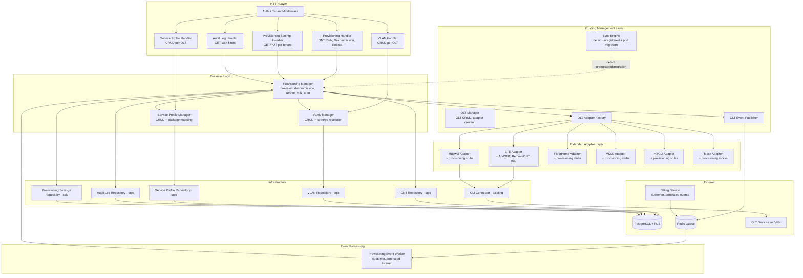
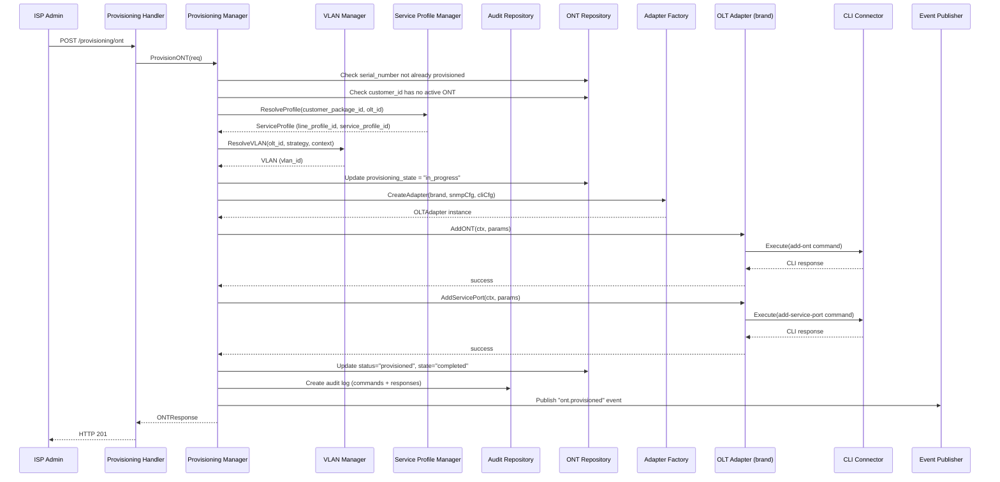
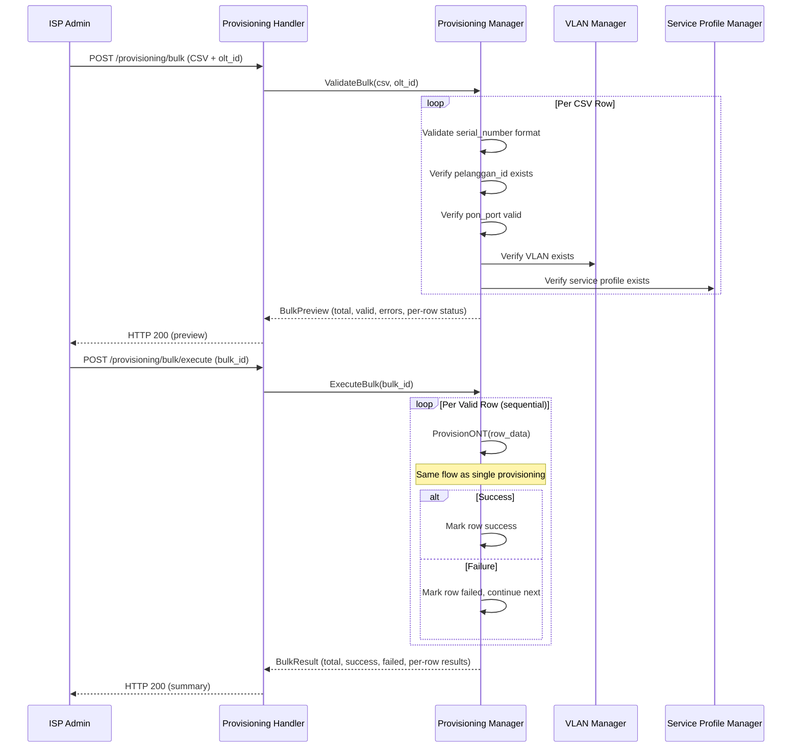
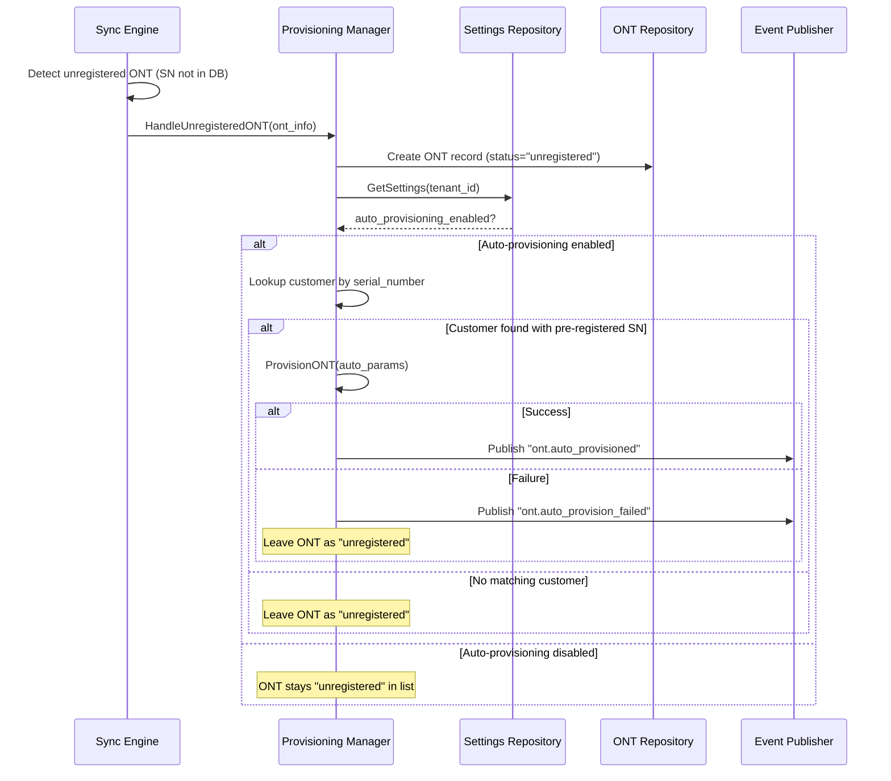
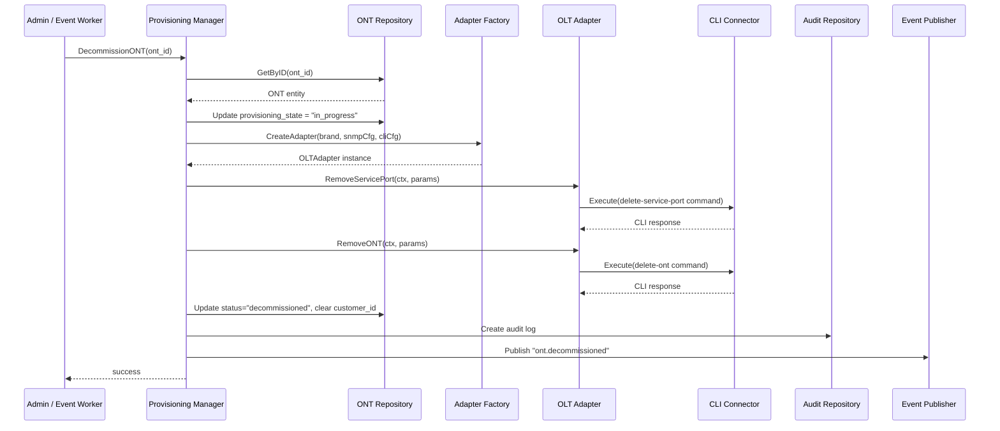
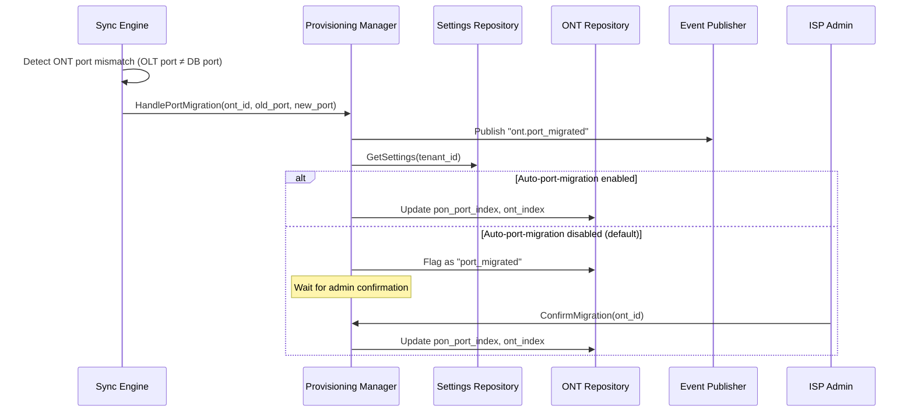

# Design Document — OLT Provisioning Layer

## Overview

Dokumen ini mendeskripsikan desain teknis untuk **OLT Provisioning Layer** di `services/network-service/`. Layer ini dibangun di atas **OLT Management Layer** (spec `olt-management`) yang sudah diimplementasikan. Management layer menangani management plane: OLT device CRUD, adapter pattern multi-brand, SNMP/CLI connectors, health check, ODP/splitter management, alarm management, sync engine, dan monitoring.

OLT Provisioning Layer menangani **provisioning plane**: manajemen entitas ONT di database, deteksi ONT unregistered, provisioning ONT (single dan bulk), decommission ONT, reboot ONT, VLAN management, service profile management, deteksi port migration, command builder per brand, audit trail, event integration, dan HTTP API. Setiap operasi provisioning menggunakan CLI command yang berbeda per brand OLT — ditangani oleh ekstensi adapter pattern yang sudah ada.

Desain mengikuti arsitektur domain-driven yang sudah ada: **domain → repository → usecase → handler**, dengan sqlc untuk query generation, Fiber v2 untuk HTTP, asynq untuk event worker, dan zerolog untuk logging. Komentar dalam bahasa Indonesia, maksimal 200 baris per file.

### Keputusan Teknis Utama

| Keputusan | Pilihan | Alasan |
|---|---|---|
| Extend OLTAdapter | Tambah method provisioning ke interface existing | Konsisten dengan adapter pattern — satu interface per brand, CLI command berbeda per brand |
| Command Builder | Method pada adapter, bukan struct terpisah | CLI command terikat erat dengan brand — ZTE `onu add sn`, Huawei `ont add sn-auth` |
| Provisioning Manager | Usecase baru `ProvisioningManager` | Separation of concerns — management vs provisioning logic |
| VLAN Manager | Usecase baru `VLANManager` | VLAN CRUD + strategy resolution terpisah dari provisioning flow |
| Service Profile Manager | Usecase baru `ServiceProfileManager` | Profile CRUD + package mapping terpisah dari provisioning flow |
| Bulk provisioning | CSV upload → validate → preview → execute | Two-phase: validasi dulu, eksekusi setelah konfirmasi user |
| Auto-provisioning | Opt-in per tenant, trigger dari sync engine | Default OFF — ISP admin harus enable secara eksplisit |
| Decommission event-driven | Listen `customer.terminated` via asynq worker | Konsisten dengan PPPoE event worker pattern yang sudah ada |
| Audit trail | Append-only `provisioning_audit_logs` table | Compliance — semua command ke OLT harus tercatat |
| VLAN strategy | 4 strategi: single, per_paket, per_odp, per_pelanggan | Fleksibel untuk berbagai arsitektur ISP |
| Port migration | Detect di sync engine, confirm manual (default) | Keamanan — perpindahan fisik ONT perlu verifikasi admin |
| Provisioning settings | Tabel per tenant dengan default values | Multi-tenant — setiap ISP punya preferensi berbeda |
| PBT library | `pgregory.net/rapid` | Sudah dipakai di codebase existing |
| Retry pattern | Exponential backoff 30s, 1m, 2m, 5m, 10m (max 5) | Konsisten dengan PPPoE event worker retry pattern |


## Architecture

### Layer Architecture



### Single ONT Provisioning Flow



### Bulk Provisioning Flow



### Auto-Provisioning Flow



### Decommission Flow (Manual + Event-Driven)



### Port Migration Detection Flow




## Components and Interfaces

### 1. Extended OLT Adapter Interface (Provisioning Methods)

```go
// OLTAdapter diperluas dengan method provisioning.
// Method baru ditambahkan ke interface existing di domain/repository.go.
// Setiap adapter (ZTE, Huawei, FiberHome, VSOL, HSGQ, Mock) harus mengimplementasikan method baru.
type OLTAdapter interface {
    // --- Existing methods (dari olt-management) ---
    GetSystemInfo(ctx context.Context) (*OLTSystemInfo, error)
    GetPONPortStatus(ctx context.Context, portIndex int) (*PONPortStatus, error)
    GetAllPONPorts(ctx context.Context) ([]PONPortStatus, error)
    GetONTList(ctx context.Context, portIndex int) ([]ONTStatus, error)
    GetONTSignal(ctx context.Context, portIndex int, ontIndex int) (*ONTSignalInfo, error)
    GetAlarms(ctx context.Context) ([]OLTAlarm, error)
    GetSFPInfo(ctx context.Context, portIndex int) (*SFPInfo, error)
    GetTrafficStats(ctx context.Context, portIndex int) (*PONTrafficStats, error)
    Ping(ctx context.Context) error

    // --- New provisioning methods ---

    // AddONT menambahkan ONT ke PON port dengan line profile dan service profile.
    // Menghasilkan CLI command per brand: ZTE `onu add sn`, Huawei `ont add sn-auth`, dll.
    AddONT(ctx context.Context, params AddONTParams) (*ProvisioningResult, error)

    // RemoveONT menghapus ONT dari PON port.
    // Menghasilkan CLI command per brand: ZTE `onu delete`, Huawei `ont delete`, dll.
    RemoveONT(ctx context.Context, params RemoveONTParams) (*ProvisioningResult, error)

    // AddServicePort menambahkan service-port dengan VLAN assignment.
    // Menghasilkan CLI command per brand: ZTE `service-port add vlan`, dll.
    AddServicePort(ctx context.Context, params AddServicePortParams) (*ProvisioningResult, error)

    // RemoveServicePort menghapus service-port.
    // Menghasilkan CLI command per brand: ZTE `service-port delete`, dll.
    RemoveServicePort(ctx context.Context, params RemoveServicePortParams) (*ProvisioningResult, error)

    // RebootONT mengirim perintah reboot ke ONT tertentu.
    // Menghasilkan CLI command per brand: ZTE `onu reset`, Huawei `ont reset`, dll.
    RebootONT(ctx context.Context, params RebootONTParams) (*ProvisioningResult, error)

    // GetUnregisteredONTs mengambil daftar ONT yang terdeteksi tapi belum terdaftar.
    GetUnregisteredONTs(ctx context.Context) ([]UnregisteredONT, error)
}
```

### 2. Provisioning Adapter Params dan Result

```go
// AddONTParams berisi parameter untuk menambahkan ONT ke OLT.
type AddONTParams struct {
    PONPortIndex     int    // indeks PON port
    ONTIndex         int    // indeks ONT pada port (auto-assign jika 0)
    SerialNumber     string // serial number ONT
    LineProfileID    int    // ID line profile di OLT
    ServiceProfileID int    // ID service profile di OLT
    Description      string // deskripsi opsional
}

// RemoveONTParams berisi parameter untuk menghapus ONT dari OLT.
type RemoveONTParams struct {
    PONPortIndex int // indeks PON port
    ONTIndex     int // indeks ONT pada port
}

// AddServicePortParams berisi parameter untuk menambahkan service-port.
type AddServicePortParams struct {
    PONPortIndex int // indeks PON port
    ONTIndex     int // indeks ONT
    VLANID       int // VLAN ID untuk assignment
    GemPort      int // GEM port (default 1)
}

// RemoveServicePortParams berisi parameter untuk menghapus service-port.
type RemoveServicePortParams struct {
    PONPortIndex int // indeks PON port
    ONTIndex     int // indeks ONT
    VLANID       int // VLAN ID yang di-remove
}

// RebootONTParams berisi parameter untuk reboot ONT.
type RebootONTParams struct {
    PONPortIndex int // indeks PON port
    ONTIndex     int // indeks ONT
}

// ProvisioningResult berisi hasil eksekusi provisioning command.
type ProvisioningResult struct {
    Success      bool     `json:"success"`
    CommandsSent []string `json:"commands_sent"` // CLI commands yang dikirim
    Responses    []string `json:"responses"`     // response dari OLT
    ErrorMessage string   `json:"error_message,omitempty"`
}

// UnregisteredONT berisi informasi ONT yang terdeteksi tapi belum terdaftar.
type UnregisteredONT struct {
    SerialNumber string `json:"serial_number"`
    PONPortIndex int    `json:"pon_port_index"`
    ONTIndex     int    `json:"ont_index"`
}
```

### 3. Provisioning Manager

```go
// ProvisioningManager mendefinisikan business logic untuk provisioning ONT.
// Menangani single/bulk provisioning, decommission, reboot, auto-provisioning,
// port migration, dan audit trail.
type ProvisioningManager interface {
    // ProvisionONT melakukan provisioning satu ONT: validate → build commands → execute → update DB.
    ProvisionONT(ctx context.Context, tenantID string, req ProvisionONTRequest) (*ONTResponse, error)

    // DecommissionONT menghapus ONT dari OLT dan update DB.
    DecommissionONT(ctx context.Context, ontID string, performedBy string) error

    // RebootONT mengirim perintah reboot ke ONT via OLT CLI.
    RebootONT(ctx context.Context, ontID string, performedBy string) (*ProvisioningResult, error)

    // ValidateBulk memvalidasi CSV upload dan mengembalikan preview.
    ValidateBulk(ctx context.Context, tenantID string, oltID string, csvData []byte) (*BulkPreview, error)

    // ExecuteBulk mengeksekusi bulk provisioning untuk semua row valid.
    ExecuteBulk(ctx context.Context, bulkID string, performedBy string) (*BulkResult, error)

    // GetBulkTemplate mengembalikan CSV template untuk bulk provisioning.
    GetBulkTemplate() []byte

    // HandleUnregisteredONT memproses ONT unregistered yang terdeteksi sync engine.
    HandleUnregisteredONT(ctx context.Context, oltID string, ont UnregisteredONT) error

    // HandlePortMigration memproses deteksi port migration dari sync engine.
    HandlePortMigration(ctx context.Context, ontID string, oldPort, newPort, oldONTIdx, newONTIdx int) error

    // ConfirmMigration mengkonfirmasi port migration dan update DB.
    ConfirmMigration(ctx context.Context, ontID string) error

    // HandleCustomerTerminated memproses event customer.terminated untuk decommission.
    HandleCustomerTerminated(ctx context.Context, customerID, tenantID string) error

    // GetONTByID mengambil detail ONT termasuk relasi.
    GetONTByID(ctx context.Context, id string) (*ONTDetailResponse, error)

    // ListONTs mengambil daftar ONT dengan paginasi dan filter.
    ListONTs(ctx context.Context, params ONTListParams) (*ONTListResult, error)

    // GetUnregisteredONTs mengambil daftar ONT unregistered untuk satu OLT.
    GetUnregisteredONTs(ctx context.Context, oltID string) ([]*ONTResponse, error)

    // GetAuditLogs mengambil daftar audit log dengan paginasi dan filter.
    GetAuditLogs(ctx context.Context, params AuditLogListParams) (*AuditLogListResult, error)

    // GetSettings mengambil provisioning settings untuk tenant.
    GetSettings(ctx context.Context, tenantID string) (*ProvisioningSettings, error)

    // UpdateSettings memperbarui provisioning settings untuk tenant.
    UpdateSettings(ctx context.Context, tenantID string, req UpdateSettingsRequest) (*ProvisioningSettings, error)
}
```

### 4. VLAN Manager

```go
// VLANManager mendefinisikan business logic untuk manajemen VLAN per OLT.
// Menangani CRUD VLAN dan resolusi VLAN berdasarkan strategy saat provisioning.
type VLANManager interface {
    // Create membuat VLAN baru untuk OLT.
    Create(ctx context.Context, tenantID string, req CreateVLANRequest) (*VLANResponse, error)

    // GetByID mengambil detail VLAN.
    GetByID(ctx context.Context, id string) (*VLANResponse, error)

    // Update memperbarui data VLAN.
    Update(ctx context.Context, id string, req UpdateVLANRequest) (*VLANResponse, error)

    // Delete soft-delete VLAN (cek tidak ada ONT aktif yang menggunakan).
    Delete(ctx context.Context, id string) error

    // List mengambil daftar VLAN per OLT dengan paginasi.
    List(ctx context.Context, oltID string, params VLANListParams) (*VLANListResult, error)

    // ResolveVLAN menentukan VLAN yang akan digunakan saat provisioning
    // berdasarkan strategy tenant: single, per_paket, per_odp, per_pelanggan.
    ResolveVLAN(ctx context.Context, oltID string, strategy VLANStrategy, context VLANResolveContext) (*VLAN, error)
}

// VLANStrategy mendefinisikan strategi assignment VLAN.
type VLANStrategy string

const (
    VLANStrategySingle       VLANStrategy = "single"        // semua pelanggan 1 VLAN
    VLANStrategyPerPaket     VLANStrategy = "per_paket"     // VLAN berbeda per paket internet
    VLANStrategyPerODP       VLANStrategy = "per_odp"       // VLAN berbeda per ODP
    VLANStrategyPerPelanggan VLANStrategy = "per_pelanggan" // VLAN unik per pelanggan
)

// VLANResolveContext berisi konteks untuk resolusi VLAN.
type VLANResolveContext struct {
    PackageID  string // untuk strategy per_paket
    ODPID      string // untuk strategy per_odp
    CustomerID string // untuk strategy per_pelanggan
}
```

### 5. Service Profile Manager

```go
// ServiceProfileManager mendefinisikan business logic untuk manajemen service profile.
// Menangani CRUD profile dan mapping ke paket ISPBoss.
type ServiceProfileManager interface {
    // Create membuat service profile baru untuk OLT.
    Create(ctx context.Context, tenantID string, req CreateServiceProfileRequest) (*ServiceProfileResponse, error)

    // GetByID mengambil detail service profile.
    GetByID(ctx context.Context, id string) (*ServiceProfileResponse, error)

    // Update memperbarui data service profile.
    Update(ctx context.Context, id string, req UpdateServiceProfileRequest) (*ServiceProfileResponse, error)

    // Delete soft-delete service profile (cek tidak ada ONT aktif yang menggunakan).
    Delete(ctx context.Context, id string) error

    // List mengambil daftar service profile per OLT dengan paginasi.
    List(ctx context.Context, oltID string, params ServiceProfileListParams) (*ServiceProfileListResult, error)

    // ResolveProfile menentukan service profile berdasarkan package_id dan olt_id.
    ResolveProfile(ctx context.Context, oltID string, packageID string) (*ServiceProfile, error)
}
```

### 6. Provisioning Event Publisher (Extended)

```go
// OLTEventPublisher diperluas dengan method provisioning events.
// Method baru ditambahkan ke interface existing di domain/repository.go.
type OLTEventPublisher interface {
    // --- Existing methods (dari olt-management) ---
    PublishDeviceOffline(ctx context.Context, payload OLTDeviceOfflinePayload) error
    PublishDeviceOnline(ctx context.Context, payload OLTDeviceOnlinePayload) error
    PublishAlarm(ctx context.Context, payload OLTAlarmPayload) error

    // --- New provisioning event methods ---

    // PublishONTProvisioned mempublikasikan event ONT berhasil di-provision.
    PublishONTProvisioned(ctx context.Context, payload ONTProvisionedPayload) error

    // PublishONTDecommissioned mempublikasikan event ONT berhasil di-decommission.
    PublishONTDecommissioned(ctx context.Context, payload ONTDecommissionedPayload) error

    // PublishONTAutoProvisioned mempublikasikan event ONT berhasil di-auto-provision.
    PublishONTAutoProvisioned(ctx context.Context, payload ONTAutoProvisionedPayload) error

    // PublishONTAutoProvisionFailed mempublikasikan event auto-provisioning gagal.
    PublishONTAutoProvisionFailed(ctx context.Context, payload ONTAutoProvisionFailedPayload) error

    // PublishONTPortMigrated mempublikasikan event port migration terdeteksi.
    PublishONTPortMigrated(ctx context.Context, payload ONTPortMigratedPayload) error
}
```

### 7. Provisioning Event Worker

```go
// ProvisioningEventWorker memproses event dari service lain via asynq.
// Saat ini menangani "customer.terminated" untuk auto-decommission ONT.
// Pattern sama dengan PPPoEEventWorker yang sudah ada.
type ProvisioningEventWorker struct {
    manager  ProvisioningManager
    logger   zerolog.Logger
}

// RegisterHandlers mendaftarkan handler ke asynq ServeMux.
// - "customer.terminated" → HandleCustomerTerminated
func (w *ProvisioningEventWorker) RegisterHandlers(mux *asynq.ServeMux)

// Retry pattern: exponential backoff 30s, 1m, 2m, 5m, 10m (max 5 retries).
// Konsisten dengan PPPoERetryDelays yang sudah ada.
```

### 8. New Repository Interfaces

```go
// ONTRepository mendefinisikan operasi data untuk tabel onts.
type ONTRepository interface {
    Create(ctx context.Context, ont *ONT) (*ONT, error)
    GetByID(ctx context.Context, id string) (*ONT, error)
    GetBySerialNumber(ctx context.Context, tenantID, serialNumber string) (*ONT, error)
    Update(ctx context.Context, ont *ONT) (*ONT, error)
    SoftDelete(ctx context.Context, id string) error
    List(ctx context.Context, params ONTListParams) (*ONTListResult, error)
    ListByOLTAndStatus(ctx context.Context, oltID, status string) ([]*ONT, error)
    GetByCustomerID(ctx context.Context, customerID string) (*ONT, error)
    SerialNumberExists(ctx context.Context, tenantID, serialNumber, excludeID string) (bool, error)
    PositionExists(ctx context.Context, oltID string, ponPort, ontIndex int, excludeID string) (bool, error)
    UpdateStatus(ctx context.Context, id string, status, provisioningState string) error
    UpdatePortMigration(ctx context.Context, id string, newPort, newONTIndex int) error
    DeleteUnregisteredByOLT(ctx context.Context, oltID string, keepSerialNumbers []string) (int64, error)
}

// VLANRepository mendefinisikan operasi data untuk tabel vlans.
type VLANRepository interface {
    Create(ctx context.Context, vlan *VLAN) (*VLAN, error)
    GetByID(ctx context.Context, id string) (*VLAN, error)
    Update(ctx context.Context, vlan *VLAN) (*VLAN, error)
    SoftDelete(ctx context.Context, id string) error
    List(ctx context.Context, oltID string, params VLANListParams) (*VLANListResult, error)
    GetByOLTAndVLANID(ctx context.Context, oltID string, vlanID int) (*VLAN, error)
    GetDefaultVLAN(ctx context.Context, oltID string) (*VLAN, error)
    VLANIDExists(ctx context.Context, oltID string, vlanID int, excludeID string) (bool, error)
    CountActiveONTs(ctx context.Context, vlanID string) (int64, error)
}

// ServiceProfileRepository mendefinisikan operasi data untuk tabel service_profiles.
type ServiceProfileRepository interface {
    Create(ctx context.Context, profile *ServiceProfile) (*ServiceProfile, error)
    GetByID(ctx context.Context, id string) (*ServiceProfile, error)
    Update(ctx context.Context, profile *ServiceProfile) (*ServiceProfile, error)
    SoftDelete(ctx context.Context, id string) error
    List(ctx context.Context, oltID string, params ServiceProfileListParams) (*ServiceProfileListResult, error)
    GetByPackageAndOLT(ctx context.Context, oltID, packageID string) (*ServiceProfile, error)
    ProfileExists(ctx context.Context, oltID string, lineProfileID, serviceProfileID int, excludeID string) (bool, error)
    CountActiveONTs(ctx context.Context, profileID string) (int64, error)
}

// AuditLogRepository mendefinisikan operasi data untuk tabel provisioning_audit_logs.
// Append-only: tidak ada Update atau Delete.
type AuditLogRepository interface {
    Create(ctx context.Context, log *ProvisioningAuditLog) (*ProvisioningAuditLog, error)
    List(ctx context.Context, params AuditLogListParams) (*AuditLogListResult, error)
}

// ProvisioningSettingsRepository mendefinisikan operasi data untuk tabel provisioning_settings.
type ProvisioningSettingsRepository interface {
    GetByTenantID(ctx context.Context, tenantID string) (*ProvisioningSettings, error)
    Upsert(ctx context.Context, settings *ProvisioningSettings) (*ProvisioningSettings, error)
}
```


## Data Models

### Database Schema (SQL)

```sql
-- Migration: create_onts_table
-- Tabel ONT entity per tenant, linked ke OLT, PON port, customer, ODP, VLAN, service profile.
CREATE TABLE onts (
    id                     UUID PRIMARY KEY DEFAULT gen_random_uuid(),
    tenant_id              UUID NOT NULL REFERENCES tenants(id),
    olt_id                 UUID NOT NULL REFERENCES olts(id),
    pon_port_index         INTEGER NOT NULL,
    ont_index              INTEGER NOT NULL,
    serial_number          VARCHAR(50) NOT NULL,
    customer_id            UUID,
    odp_id                 UUID REFERENCES odps(id),
    vlan_id                UUID REFERENCES vlans(id),
    service_profile_id     UUID REFERENCES service_profiles(id),
    status                 VARCHAR(30) NOT NULL DEFAULT 'registered',
    provisioning_state     VARCHAR(20) NOT NULL DEFAULT 'pending',
    description            TEXT,
    last_provisioned_at    TIMESTAMPTZ,
    last_decommissioned_at TIMESTAMPTZ,
    deleted_at             TIMESTAMPTZ,
    created_at             TIMESTAMPTZ NOT NULL DEFAULT now(),
    updated_at             TIMESTAMPTZ NOT NULL DEFAULT now()
);

-- Unique: serial number unik per tenant (exclude soft-deleted)
CREATE UNIQUE INDEX idx_onts_tenant_sn
    ON onts (tenant_id, serial_number)
    WHERE deleted_at IS NULL;

-- Unique: posisi ONT unik per OLT port (exclude soft-deleted)
CREATE UNIQUE INDEX idx_onts_olt_port_index
    ON onts (olt_id, pon_port_index, ont_index)
    WHERE deleted_at IS NULL;

-- Index untuk query per OLT dan status
CREATE INDEX idx_onts_olt_status
    ON onts (olt_id, status) WHERE deleted_at IS NULL;

-- Index untuk query per customer
CREATE INDEX idx_onts_customer
    ON onts (customer_id) WHERE deleted_at IS NULL AND customer_id IS NOT NULL;

-- Index untuk query per tenant
CREATE INDEX idx_onts_tenant
    ON onts (tenant_id) WHERE deleted_at IS NULL;

-- Row-Level Security
ALTER TABLE onts ENABLE ROW LEVEL SECURITY;

CREATE POLICY onts_tenant_isolation ON onts
    USING (tenant_id = current_setting('app.current_tenant_id')::UUID);


-- Migration: create_vlans_table
-- Tabel VLAN per OLT per tenant.
CREATE TABLE vlans (
    id          UUID PRIMARY KEY DEFAULT gen_random_uuid(),
    tenant_id   UUID NOT NULL REFERENCES tenants(id),
    olt_id      UUID NOT NULL REFERENCES olts(id),
    vlan_id     INTEGER NOT NULL,
    name        VARCHAR(100) NOT NULL,
    vlan_type   VARCHAR(30) NOT NULL DEFAULT 'data',
    description TEXT,
    deleted_at  TIMESTAMPTZ,
    created_at  TIMESTAMPTZ NOT NULL DEFAULT now(),
    updated_at  TIMESTAMPTZ NOT NULL DEFAULT now()
);

-- Unique: VLAN ID unik per OLT (exclude soft-deleted)
CREATE UNIQUE INDEX idx_vlans_olt_vlanid
    ON vlans (olt_id, vlan_id)
    WHERE deleted_at IS NULL;

-- Index untuk query per OLT
CREATE INDEX idx_vlans_olt
    ON vlans (olt_id) WHERE deleted_at IS NULL;

-- Row-Level Security
ALTER TABLE vlans ENABLE ROW LEVEL SECURITY;

CREATE POLICY vlans_tenant_isolation ON vlans
    USING (tenant_id = current_setting('app.current_tenant_id')::UUID);


-- Migration: create_service_profiles_table
-- Tabel service profile mapping antara paket ISPBoss dan OLT profile.
CREATE TABLE service_profiles (
    id                 UUID PRIMARY KEY DEFAULT gen_random_uuid(),
    tenant_id          UUID NOT NULL REFERENCES tenants(id),
    olt_id             UUID NOT NULL REFERENCES olts(id),
    name               VARCHAR(100) NOT NULL,
    line_profile_id    INTEGER NOT NULL,
    service_profile_id INTEGER NOT NULL,
    package_id         UUID,
    description        TEXT,
    deleted_at         TIMESTAMPTZ,
    created_at         TIMESTAMPTZ NOT NULL DEFAULT now(),
    updated_at         TIMESTAMPTZ NOT NULL DEFAULT now()
);

-- Unique: kombinasi profile unik per OLT (exclude soft-deleted)
CREATE UNIQUE INDEX idx_sp_olt_profiles
    ON service_profiles (olt_id, line_profile_id, service_profile_id)
    WHERE deleted_at IS NULL;

-- Index untuk query per OLT
CREATE INDEX idx_sp_olt
    ON service_profiles (olt_id) WHERE deleted_at IS NULL;

-- Index untuk lookup by package
CREATE INDEX idx_sp_package
    ON service_profiles (olt_id, package_id)
    WHERE deleted_at IS NULL AND package_id IS NOT NULL;

-- Row-Level Security
ALTER TABLE service_profiles ENABLE ROW LEVEL SECURITY;

CREATE POLICY sp_tenant_isolation ON service_profiles
    USING (tenant_id = current_setting('app.current_tenant_id')::UUID);


-- Migration: create_provisioning_audit_logs_table
-- Tabel audit trail append-only untuk semua provisioning command.
CREATE TABLE provisioning_audit_logs (
    id                UUID PRIMARY KEY DEFAULT gen_random_uuid(),
    tenant_id         UUID NOT NULL REFERENCES tenants(id),
    olt_id            UUID NOT NULL REFERENCES olts(id),
    ont_id            UUID REFERENCES onts(id),
    action            VARCHAR(50) NOT NULL,
    commands_sent     JSONB NOT NULL DEFAULT '[]',
    command_responses JSONB NOT NULL DEFAULT '[]',
    status            VARCHAR(20) NOT NULL,
    error_message     TEXT,
    performed_by      VARCHAR(100) NOT NULL,
    correlation_id    UUID NOT NULL,
    created_at        TIMESTAMPTZ NOT NULL DEFAULT now()
);

-- Index untuk query per OLT
CREATE INDEX idx_audit_olt
    ON provisioning_audit_logs (olt_id, created_at DESC);

-- Index untuk query per ONT
CREATE INDEX idx_audit_ont
    ON provisioning_audit_logs (ont_id, created_at DESC)
    WHERE ont_id IS NOT NULL;

-- Index untuk query per tenant dan tanggal
CREATE INDEX idx_audit_tenant
    ON provisioning_audit_logs (tenant_id, created_at DESC);

-- Index untuk filter by action
CREATE INDEX idx_audit_action
    ON provisioning_audit_logs (action, created_at DESC);

-- Row-Level Security
ALTER TABLE provisioning_audit_logs ENABLE ROW LEVEL SECURITY;

CREATE POLICY audit_tenant_isolation ON provisioning_audit_logs
    USING (tenant_id = current_setting('app.current_tenant_id')::UUID);


-- Migration: create_provisioning_settings_table
-- Tabel settings provisioning per tenant.
CREATE TABLE provisioning_settings (
    id                           UUID PRIMARY KEY DEFAULT gen_random_uuid(),
    tenant_id                    UUID NOT NULL UNIQUE REFERENCES tenants(id),
    auto_provisioning_enabled    BOOLEAN NOT NULL DEFAULT false,
    auto_port_migration_enabled  BOOLEAN NOT NULL DEFAULT false,
    vlan_strategy                VARCHAR(30) NOT NULL DEFAULT 'single',
    created_at                   TIMESTAMPTZ NOT NULL DEFAULT now(),
    updated_at                   TIMESTAMPTZ NOT NULL DEFAULT now()
);

-- Row-Level Security
ALTER TABLE provisioning_settings ENABLE ROW LEVEL SECURITY;

CREATE POLICY ps_tenant_isolation ON provisioning_settings
    USING (tenant_id = current_setting('app.current_tenant_id')::UUID);
```

### Domain Entities (Go)

```go
// --- ONT Entity ---

// ONTStatus mendefinisikan status lifecycle ONT.
type ONTStatus string

const (
    ONTStatusRegistered     ONTStatus = "registered"     // terdaftar di DB, belum di OLT
    ONTStatusProvisioned    ONTStatus = "provisioned"    // aktif di OLT
    ONTStatusUnregistered   ONTStatus = "unregistered"   // terdeteksi di OLT tapi belum di DB
    ONTStatusMissing        ONTStatus = "missing"        // ada di DB tapi tidak di OLT
    ONTStatusDecommissioned ONTStatus = "decommissioned" // dihapus dari OLT
)

// ProvisioningState mendefinisikan state proses provisioning.
type ProvisioningState string

const (
    ProvisioningStatePending    ProvisioningState = "pending"
    ProvisioningStateInProgress ProvisioningState = "in_progress"
    ProvisioningStateCompleted  ProvisioningState = "completed"
    ProvisioningStateFailed     ProvisioningState = "failed"
)

// ONT merepresentasikan entitas ONT per tenant.
type ONT struct {
    ID                   string            `json:"id"`
    TenantID             string            `json:"tenant_id"`
    OLTID                string            `json:"olt_id"`
    PONPortIndex         int               `json:"pon_port_index"`
    ONTIndex             int               `json:"ont_index"`
    SerialNumber         string            `json:"serial_number"`
    CustomerID           *string           `json:"customer_id,omitempty"`
    ODPID                *string           `json:"odp_id,omitempty"`
    VLANID               *string           `json:"vlan_id,omitempty"`
    ServiceProfileID     *string           `json:"service_profile_id,omitempty"`
    Status               ONTStatus         `json:"status"`
    ProvisioningState    ProvisioningState `json:"provisioning_state"`
    Description          string            `json:"description,omitempty"`
    LastProvisionedAt    *time.Time        `json:"last_provisioned_at,omitempty"`
    LastDecommissionedAt *time.Time        `json:"last_decommissioned_at,omitempty"`
    DeletedAt            *time.Time        `json:"deleted_at,omitempty"`
    CreatedAt            time.Time         `json:"created_at"`
    UpdatedAt            time.Time         `json:"updated_at"`
}

// --- VLAN Entity ---

// VLAN merepresentasikan VLAN per OLT per tenant.
type VLAN struct {
    ID          string     `json:"id"`
    TenantID    string     `json:"tenant_id"`
    OLTID       string     `json:"olt_id"`
    VLANID      int        `json:"vlan_id"`
    Name        string     `json:"name"`
    VLANType    string     `json:"vlan_type"`
    Description string     `json:"description,omitempty"`
    DeletedAt   *time.Time `json:"deleted_at,omitempty"`
    CreatedAt   time.Time  `json:"created_at"`
    UpdatedAt   time.Time  `json:"updated_at"`
}

// --- Service Profile Entity ---

// ServiceProfile merepresentasikan mapping antara paket ISPBoss dan OLT profile.
type ServiceProfile struct {
    ID               string     `json:"id"`
    TenantID         string     `json:"tenant_id"`
    OLTID            string     `json:"olt_id"`
    Name             string     `json:"name"`
    LineProfileID    int        `json:"line_profile_id"`
    ServiceProfileID int        `json:"service_profile_id"`
    PackageID        *string    `json:"package_id,omitempty"`
    Description      string     `json:"description,omitempty"`
    DeletedAt        *time.Time `json:"deleted_at,omitempty"`
    CreatedAt        time.Time  `json:"created_at"`
    UpdatedAt        time.Time  `json:"updated_at"`
}

// --- Provisioning Audit Log Entity ---

// AuditAction mendefinisikan tipe aksi provisioning untuk audit trail.
type AuditAction string

const (
    AuditActionONTProvision      AuditAction = "ont_provision"
    AuditActionONTDecommission   AuditAction = "ont_decommission"
    AuditActionONTReboot         AuditAction = "ont_reboot"
    AuditActionServicePortAdd    AuditAction = "service_port_add"
    AuditActionServicePortRemove AuditAction = "service_port_remove"
    AuditActionBulkProvision     AuditAction = "bulk_provision"
    AuditActionAutoProvision     AuditAction = "auto_provision"
)

// ProvisioningAuditLog merepresentasikan satu record audit trail.
type ProvisioningAuditLog struct {
    ID               string      `json:"id"`
    TenantID         string      `json:"tenant_id"`
    OLTID            string      `json:"olt_id"`
    ONTID            *string     `json:"ont_id,omitempty"`
    Action           AuditAction `json:"action"`
    CommandsSent     []string    `json:"commands_sent"`
    CommandResponses []string    `json:"command_responses"`
    Status           string      `json:"status"`
    ErrorMessage     string      `json:"error_message,omitempty"`
    PerformedBy      string      `json:"performed_by"`
    CorrelationID    string      `json:"correlation_id"`
    CreatedAt        time.Time   `json:"created_at"`
}

// --- Provisioning Settings Entity ---

// ProvisioningSettings merepresentasikan settings provisioning per tenant.
type ProvisioningSettings struct {
    ID                        string       `json:"id"`
    TenantID                  string       `json:"tenant_id"`
    AutoProvisioningEnabled   bool         `json:"auto_provisioning_enabled"`
    AutoPortMigrationEnabled  bool         `json:"auto_port_migration_enabled"`
    VLANStrategy              VLANStrategy `json:"vlan_strategy"`
    CreatedAt                 time.Time    `json:"created_at"`
    UpdatedAt                 time.Time    `json:"updated_at"`
}
```

### Request/Response DTOs (Go)

```go
// --- Provisioning Request DTOs ---

// ProvisionONTRequest adalah payload untuk POST /api/v1/olt/provisioning/ont.
type ProvisionONTRequest struct {
    SerialNumber     string `json:"serial_number" validate:"required,min=1,max=50"`
    OLTID            string `json:"olt_id" validate:"required,uuid"`
    PONPortIndex     int    `json:"pon_port_index" validate:"min=0"`
    CustomerID       string `json:"customer_id" validate:"required,uuid"`
    ServiceProfileID string `json:"service_profile_id" validate:"required,uuid"`
    VLANID           string `json:"vlan_id" validate:"required,uuid"`
    ODPID            string `json:"odp_id,omitempty" validate:"omitempty,uuid"`
    Description      string `json:"description,omitempty" validate:"omitempty,max=500"`
}

// CreateVLANRequest adalah payload untuk POST /api/v1/olt/devices/:id/vlans.
type CreateVLANRequest struct {
    VLANID      int    `json:"vlan_id" validate:"required,min=1,max=4094"`
    Name        string `json:"name" validate:"required,min=1,max=100"`
    VLANType    string `json:"vlan_type" validate:"required,oneof=data voice management"`
    Description string `json:"description,omitempty" validate:"omitempty,max=500"`
}

// UpdateVLANRequest adalah payload untuk PUT /api/v1/olt/vlans/:id.
type UpdateVLANRequest struct {
    Name        string `json:"name,omitempty" validate:"omitempty,min=1,max=100"`
    VLANType    string `json:"vlan_type,omitempty" validate:"omitempty,oneof=data voice management"`
    Description string `json:"description,omitempty"`
}

// CreateServiceProfileRequest adalah payload untuk POST /api/v1/olt/devices/:id/service-profiles.
type CreateServiceProfileRequest struct {
    Name             string `json:"name" validate:"required,min=1,max=100"`
    LineProfileID    int    `json:"line_profile_id" validate:"required,min=0"`
    ServiceProfileID int    `json:"service_profile_id" validate:"required,min=0"`
    PackageID        string `json:"package_id,omitempty" validate:"omitempty,uuid"`
    Description      string `json:"description,omitempty" validate:"omitempty,max=500"`
}

// UpdateServiceProfileRequest adalah payload untuk PUT /api/v1/olt/service-profiles/:id.
type UpdateServiceProfileRequest struct {
    Name             string `json:"name,omitempty" validate:"omitempty,min=1,max=100"`
    LineProfileID    *int   `json:"line_profile_id,omitempty"`
    ServiceProfileID *int   `json:"service_profile_id,omitempty"`
    PackageID        string `json:"package_id,omitempty" validate:"omitempty,uuid"`
    Description      string `json:"description,omitempty"`
}

// UpdateSettingsRequest adalah payload untuk PUT /api/v1/olt/provisioning/settings.
type UpdateSettingsRequest struct {
    AutoProvisioningEnabled  *bool   `json:"auto_provisioning_enabled,omitempty"`
    AutoPortMigrationEnabled *bool   `json:"auto_port_migration_enabled,omitempty"`
    VLANStrategy             string  `json:"vlan_strategy,omitempty" validate:"omitempty,oneof=single per_paket per_odp per_pelanggan"`
}

// --- Response DTOs ---

// ONTResponse adalah respons untuk operasi ONT.
type ONTResponse struct {
    ID                   string            `json:"id"`
    OLTID                string            `json:"olt_id"`
    OLTName              string            `json:"olt_name,omitempty"`
    PONPortIndex         int               `json:"pon_port_index"`
    ONTIndex             int               `json:"ont_index"`
    SerialNumber         string            `json:"serial_number"`
    CustomerID           *string           `json:"customer_id,omitempty"`
    ODPID                *string           `json:"odp_id,omitempty"`
    ODPName              string            `json:"odp_name,omitempty"`
    VLANID               *string           `json:"vlan_id,omitempty"`
    VLANName             string            `json:"vlan_name,omitempty"`
    ServiceProfileID     *string           `json:"service_profile_id,omitempty"`
    ServiceProfileName   string            `json:"service_profile_name,omitempty"`
    Status               ONTStatus         `json:"status"`
    ProvisioningState    ProvisioningState `json:"provisioning_state"`
    Description          string            `json:"description,omitempty"`
    LastProvisionedAt    *time.Time        `json:"last_provisioned_at,omitempty"`
    LastDecommissionedAt *time.Time        `json:"last_decommissioned_at,omitempty"`
    CreatedAt            time.Time         `json:"created_at"`
    UpdatedAt            time.Time         `json:"updated_at"`
}

// ONTDetailResponse adalah respons untuk GET ONT detail.
type ONTDetailResponse struct {
    ONTResponse
    AuditLogs []ProvisioningAuditLog `json:"audit_logs,omitempty"`
}

// ONTListParams berisi parameter untuk list ONT dengan paginasi dan filter.
type ONTListParams struct {
    TenantID          string
    Page              int
    PageSize          int
    OLTID             string // filter per OLT
    Status            string // filter per status
    ProvisioningState string // filter per provisioning_state
    CustomerID        string // filter per customer
    Search            string // pencarian serial_number
}

// ONTListResult berisi hasil list ONT dengan metadata paginasi.
type ONTListResult struct {
    Data       []*ONTResponse `json:"data"`
    Total      int64          `json:"total"`
    Page       int            `json:"page"`
    PageSize   int            `json:"page_size"`
    TotalPages int            `json:"total_pages"`
}

// VLANResponse adalah respons untuk operasi VLAN.
type VLANResponse struct {
    ID          string    `json:"id"`
    OLTID       string    `json:"olt_id"`
    VLANID      int       `json:"vlan_id"`
    Name        string    `json:"name"`
    VLANType    string    `json:"vlan_type"`
    Description string    `json:"description,omitempty"`
    ActiveONTs  int64     `json:"active_onts"`
    CreatedAt   time.Time `json:"created_at"`
    UpdatedAt   time.Time `json:"updated_at"`
}

// VLANListParams berisi parameter untuk list VLAN.
type VLANListParams struct {
    Page     int
    PageSize int
}

// VLANListResult berisi hasil list VLAN.
type VLANListResult struct {
    Data       []*VLANResponse `json:"data"`
    Total      int64           `json:"total"`
    Page       int             `json:"page"`
    PageSize   int             `json:"page_size"`
    TotalPages int             `json:"total_pages"`
}

// ServiceProfileResponse adalah respons untuk operasi service profile.
type ServiceProfileResponse struct {
    ID               string    `json:"id"`
    OLTID            string    `json:"olt_id"`
    Name             string    `json:"name"`
    LineProfileID    int       `json:"line_profile_id"`
    ServiceProfileID int       `json:"service_profile_id"`
    PackageID        *string   `json:"package_id,omitempty"`
    Description      string    `json:"description,omitempty"`
    ActiveONTs       int64     `json:"active_onts"`
    CreatedAt        time.Time `json:"created_at"`
    UpdatedAt        time.Time `json:"updated_at"`
}

// ServiceProfileListParams berisi parameter untuk list service profile.
type ServiceProfileListParams struct {
    Page     int
    PageSize int
}

// ServiceProfileListResult berisi hasil list service profile.
type ServiceProfileListResult struct {
    Data       []*ServiceProfileResponse `json:"data"`
    Total      int64                     `json:"total"`
    Page       int                       `json:"page"`
    PageSize   int                       `json:"page_size"`
    TotalPages int                       `json:"total_pages"`
}

// AuditLogListParams berisi parameter untuk list audit log.
type AuditLogListParams struct {
    TenantID  string
    Page      int
    PageSize  int
    OLTID     string // filter per OLT
    ONTID     string // filter per ONT
    Action    string // filter per action
    DateFrom  *time.Time
    DateTo    *time.Time
}

// AuditLogListResult berisi hasil list audit log.
type AuditLogListResult struct {
    Data       []*ProvisioningAuditLog `json:"data"`
    Total      int64                   `json:"total"`
    Page       int                     `json:"page"`
    PageSize   int                     `json:"page_size"`
    TotalPages int                     `json:"total_pages"`
}

// BulkPreview berisi hasil validasi CSV sebelum eksekusi.
type BulkPreview struct {
    BulkID     string           `json:"bulk_id"`
    OLTID      string           `json:"olt_id"`
    TotalRows  int              `json:"total_rows"`
    ValidCount int              `json:"valid_count"`
    ErrorCount int              `json:"error_count"`
    Rows       []BulkRowPreview `json:"rows"`
}

// BulkRowPreview berisi status validasi per baris CSV.
type BulkRowPreview struct {
    RowNumber    int    `json:"row_number"`
    SerialNumber string `json:"serial_number"`
    CustomerID   string `json:"customer_id"`
    PONPort      int    `json:"pon_port"`
    VLAN         string `json:"vlan"`
    ODP          string `json:"odp"`
    Description  string `json:"description"`
    Valid        bool   `json:"valid"`
    ErrorMessage string `json:"error_message,omitempty"`
}

// BulkResult berisi hasil eksekusi bulk provisioning.
type BulkResult struct {
    BulkID       string          `json:"bulk_id"`
    Total        int             `json:"total"`
    SuccessCount int             `json:"success_count"`
    FailureCount int             `json:"failure_count"`
    Rows         []BulkRowResult `json:"rows"`
}

// BulkRowResult berisi hasil provisioning per baris.
type BulkRowResult struct {
    RowNumber    int    `json:"row_number"`
    SerialNumber string `json:"serial_number"`
    Success      bool   `json:"success"`
    ONTID        string `json:"ont_id,omitempty"`
    ErrorMessage string `json:"error_message,omitempty"`
}
```

### Event Payloads (Go)

```go
// --- Provisioning Event Type Constants ---

const (
    EventONTProvisioned       = "ont.provisioned"
    EventONTDecommissioned    = "ont.decommissioned"
    EventONTAutoProvisioned   = "ont.auto_provisioned"
    EventONTAutoProvisionFail = "ont.auto_provision_failed"
    EventONTPortMigrated      = "ont.port_migrated"
)

// ONTProvisionedPayload adalah payload event ont.provisioned.
type ONTProvisionedPayload struct {
    CorrelationID string `json:"correlation_id"`
    ONTID         string `json:"ont_id"`
    SerialNumber  string `json:"serial_number"`
    CustomerID    string `json:"customer_id"`
    OLTID         string `json:"olt_id"`
    OLTName       string `json:"olt_name"`
    PONPortIndex  int    `json:"pon_port_index"`
    VLANID        string `json:"vlan_id"`
    TenantID      string `json:"tenant_id"`
}

// ONTDecommissionedPayload adalah payload event ont.decommissioned.
type ONTDecommissionedPayload struct {
    CorrelationID string `json:"correlation_id"`
    ONTID         string `json:"ont_id"`
    SerialNumber  string `json:"serial_number"`
    CustomerID    string `json:"customer_id"`
    OLTID         string `json:"olt_id"`
    OLTName       string `json:"olt_name"`
    PONPortIndex  int    `json:"pon_port_index"`
    TenantID      string `json:"tenant_id"`
}

// ONTAutoProvisionedPayload adalah payload event ont.auto_provisioned.
type ONTAutoProvisionedPayload struct {
    CorrelationID string `json:"correlation_id"`
    ONTID         string `json:"ont_id"`
    SerialNumber  string `json:"serial_number"`
    CustomerID    string `json:"customer_id"`
    OLTID         string `json:"olt_id"`
    PONPortIndex  int    `json:"pon_port_index"`
    TenantID      string `json:"tenant_id"`
}

// ONTAutoProvisionFailedPayload adalah payload event ont.auto_provision_failed.
type ONTAutoProvisionFailedPayload struct {
    CorrelationID string `json:"correlation_id"`
    SerialNumber  string `json:"serial_number"`
    OLTID         string `json:"olt_id"`
    PONPortIndex  int    `json:"pon_port_index"`
    ErrorMessage  string `json:"error_message"`
    TenantID      string `json:"tenant_id"`
}

// ONTPortMigratedPayload adalah payload event ont.port_migrated.
type ONTPortMigratedPayload struct {
    CorrelationID string `json:"correlation_id"`
    ONTID         string `json:"ont_id"`
    SerialNumber  string `json:"serial_number"`
    OLTID         string `json:"olt_id"`
    OldPortIndex  int    `json:"old_port_index"`
    NewPortIndex  int    `json:"new_port_index"`
    OldONTIndex   int    `json:"old_ont_index"`
    NewONTIndex   int    `json:"new_ont_index"`
    TenantID      string `json:"tenant_id"`
}
```

### ZTE Provisioning CLI Commands (Reference)

```
# Add ONT ke PON port
interface gpon-olt_0/{pon_port}
  onu {ont_index} type {model} sn {serial_number}
  exit

# Set line profile dan service profile
interface gpon-onu_0/{pon_port}:{ont_index}
  sn-bind enable sn
  tcont 1 name tcont1 profile {line_profile_name}
  gemport 1 name gem1 tcont 1
  exit

# Add service-port dengan VLAN
service-port {sp_index} vlan {vlan_id} gpon 0/{pon_port} ont {ont_index} gemport 1 multi-service user-vlan {vlan_id} tag-transform translate

# Delete service-port
no service-port {sp_index}

# Delete ONT
interface gpon-olt_0/{pon_port}
  no onu {ont_index}
  exit

# Reboot ONT
interface gpon-olt_0/{pon_port}
  onu reset {ont_index}
  exit
```


## Correctness Properties

*A property is a characteristic or behavior that should hold true across all valid executions of a system — essentially, a formal statement about what the system should do. Properties serve as the bridge between human-readable specifications and machine-verifiable correctness guarantees.*

### Property 1: Command Builder Produces Valid Commands per Brand

*For any* valid provisioning parameters (AddONTParams with non-empty SerialNumber, AddServicePortParams with VLANID > 0, RemoveONTParams, RemoveServicePortParams, RebootONTParams) and *for any* supported OLT brand (ZTE, Huawei, FiberHome, VSOL, HSGQ), the adapter's provisioning methods SHALL produce a `ProvisioningResult` where `CommandsSent` is non-empty, and for AddONT commands the commands contain the provided SerialNumber, and for AddServicePort commands the commands contain the provided VLAN ID.

**Validates: Requirements 4.1, 4.2, 4.3, 4.4, 4.5, 4.7**

### Property 2: Bulk Provisioning Count Invariant

*For any* bulk provisioning operation with N rows, the validation preview SHALL satisfy `total_rows == valid_count + error_count`, and the execution result SHALL satisfy `total == success_count + failure_count`. No row SHALL be counted in more than one category.

**Validates: Requirements 5.2, 5.6**

### Property 3: Reboot Status Guard

*For any* ONT with a status that is NOT "provisioned" (i.e., "registered", "unregistered", "missing", "decommissioned"), calling `RebootONT` SHALL return an error. Only ONTs with status "provisioned" SHALL be allowed to reboot.

**Validates: Requirements 8.4**

### Property 4: VLAN Strategy Resolution

*For any* OLT with a set of configured VLANs and *for any* valid VLAN strategy ("single", "per_paket", "per_odp", "per_pelanggan"), the `ResolveVLAN` function SHALL return a VLAN that exists in the OLT's VLAN set. For strategy "single", it SHALL always return the same default VLAN regardless of context. For strategy "per_paket", it SHALL return the VLAN mapped to the given package. For strategy "per_odp", it SHALL return the VLAN mapped to the given ODP.

**Validates: Requirements 9.5**

### Property 5: Port Migration Detection

*For any* ONT record in the database and *for any* corresponding ONT detected on the OLT where the PON port index or ONT index differs from the database record, the sync comparison SHALL flag the ONT as port-migrated with the correct old and new port information.

**Validates: Requirements 11.1**

### Property 6: Audit Log Completeness

*For any* provisioning operation (provision, decommission, reboot, service-port add/remove, bulk provision, auto provision), the system SHALL create an audit log entry where `commands_sent` is non-empty, `performed_by` is non-empty, `correlation_id` is a valid UUID, and `action` is one of the defined audit action values.

**Validates: Requirements 12.3, 12.4, 12.5**

### Property 7: Provisioning Event Payload Completeness

*For any* provisioning event published to the queue (ont.provisioned, ont.decommissioned, ont.auto_provisioned, ont.auto_provision_failed, ont.port_migrated), the event payload SHALL contain a non-empty `correlation_id` (valid UUID v4), a non-empty `tenant_id`, a non-empty `olt_id`, and a non-empty `serial_number`. Provisioned and decommissioned events SHALL additionally contain a non-empty `customer_id`.

**Validates: Requirements 13.2, 13.3, 13.4, 13.5, 13.6, 13.7**

### Property 8: Default Provisioning Settings

*For any* tenant ID that has no provisioning settings record in the database, the `GetSettings` function SHALL return default values: `auto_provisioning_enabled=false`, `auto_port_migration_enabled=false`, `vlan_strategy="single"`.

**Validates: Requirements 15.5**


## Error Handling

### Domain Errors (Provisioning-Specific)

```go
var (
    // --- ONT Provisioning Errors ---

    // ErrONTNotFound dikembalikan saat ONT tidak ditemukan atau milik tenant lain.
    ErrONTNotFound = errors.New("ont tidak ditemukan")

    // ErrONTSerialNumberExists dikembalikan saat serial number sudah ada di tenant.
    ErrONTSerialNumberExists = errors.New("serial number ont sudah ada")

    // ErrONTPositionExists dikembalikan saat posisi (olt_id, pon_port, ont_index) sudah terisi.
    ErrONTPositionExists = errors.New("posisi ont sudah terisi pada port ini")

    // ErrONTAlreadyProvisioned dikembalikan saat ONT sudah dalam status provisioned.
    ErrONTAlreadyProvisioned = errors.New("ont sudah di-provision")

    // ErrONTNotProvisioned dikembalikan saat operasi membutuhkan ONT provisioned (misal reboot).
    ErrONTNotProvisioned = errors.New("ont belum di-provision")

    // ErrCustomerHasActiveONT dikembalikan saat customer sudah punya ONT aktif.
    ErrCustomerHasActiveONT = errors.New("pelanggan sudah memiliki ont aktif")

    // ErrProvisioningInProgress dikembalikan saat provisioning sedang berjalan untuk ONT ini.
    ErrProvisioningInProgress = errors.New("provisioning sedang berjalan untuk ont ini")

    // ErrProvisioningFailed dikembalikan saat CLI command gagal saat provisioning.
    ErrProvisioningFailed = errors.New("provisioning gagal, periksa audit log untuk detail")

    // ErrDecommissionFailed dikembalikan saat CLI command gagal saat decommission.
    ErrDecommissionFailed = errors.New("decommission gagal, periksa audit log untuk detail")

    // ErrRebootFailed dikembalikan saat CLI command gagal saat reboot.
    ErrRebootFailed = errors.New("reboot ont gagal")

    // --- VLAN Errors ---

    // ErrVLANNotFound dikembalikan saat VLAN tidak ditemukan.
    ErrVLANNotFound = errors.New("vlan tidak ditemukan")

    // ErrVLANIDExists dikembalikan saat VLAN ID sudah ada pada OLT yang sama.
    ErrVLANIDExists = errors.New("vlan id sudah ada pada olt ini")

    // ErrVLANInUse dikembalikan saat VLAN masih digunakan oleh ONT aktif.
    ErrVLANInUse = errors.New("vlan masih digunakan oleh ont aktif")

    // ErrVLANResolutionFailed dikembalikan saat resolusi VLAN gagal berdasarkan strategy.
    ErrVLANResolutionFailed = errors.New("gagal menentukan vlan berdasarkan strategi")

    // --- Service Profile Errors ---

    // ErrServiceProfileNotFound dikembalikan saat service profile tidak ditemukan.
    ErrServiceProfileNotFound = errors.New("service profile tidak ditemukan")

    // ErrServiceProfileExists dikembalikan saat kombinasi profile sudah ada pada OLT.
    ErrServiceProfileExists = errors.New("kombinasi line/service profile sudah ada pada olt ini")

    // ErrServiceProfileInUse dikembalikan saat profile masih digunakan oleh ONT aktif.
    ErrServiceProfileInUse = errors.New("service profile masih digunakan oleh ont aktif")

    // ErrNoProfileMapping dikembalikan saat paket pelanggan tidak punya mapping ke OLT profile.
    ErrNoProfileMapping = errors.New("paket pelanggan tidak memiliki mapping service profile pada olt ini")

    // --- Bulk Provisioning Errors ---

    // ErrBulkNotFound dikembalikan saat bulk_id tidak ditemukan.
    ErrBulkNotFound = errors.New("bulk provisioning tidak ditemukan")

    // ErrInvalidCSVFormat dikembalikan saat format CSV tidak valid.
    ErrInvalidCSVFormat = errors.New("format csv tidak valid, gunakan template yang disediakan")

    // ErrBulkAlreadyExecuted dikembalikan saat bulk sudah dieksekusi.
    ErrBulkAlreadyExecuted = errors.New("bulk provisioning sudah dieksekusi")

    // --- Settings Errors ---

    // ErrInvalidVLANStrategy dikembalikan saat VLAN strategy tidak valid.
    ErrInvalidVLANStrategy = errors.New("vlan strategy tidak valid")
)
```

### HTTP Error Mapping

| Domain Error | HTTP Status | Error Code |
|---|---|---|
| ErrONTNotFound | 404 | ONT_NOT_FOUND |
| ErrONTSerialNumberExists | 409 | ONT_SN_EXISTS |
| ErrONTPositionExists | 409 | ONT_POSITION_EXISTS |
| ErrONTAlreadyProvisioned | 409 | ONT_ALREADY_PROVISIONED |
| ErrONTNotProvisioned | 422 | ONT_NOT_PROVISIONED |
| ErrCustomerHasActiveONT | 409 | CUSTOMER_HAS_ACTIVE_ONT |
| ErrProvisioningInProgress | 409 | PROVISIONING_IN_PROGRESS |
| ErrProvisioningFailed | 502 | PROVISIONING_FAILED |
| ErrDecommissionFailed | 502 | DECOMMISSION_FAILED |
| ErrRebootFailed | 502 | REBOOT_FAILED |
| ErrVLANNotFound | 404 | VLAN_NOT_FOUND |
| ErrVLANIDExists | 409 | VLAN_ID_EXISTS |
| ErrVLANInUse | 409 | VLAN_IN_USE |
| ErrVLANResolutionFailed | 422 | VLAN_RESOLUTION_FAILED |
| ErrServiceProfileNotFound | 404 | SERVICE_PROFILE_NOT_FOUND |
| ErrServiceProfileExists | 409 | SERVICE_PROFILE_EXISTS |
| ErrServiceProfileInUse | 409 | SERVICE_PROFILE_IN_USE |
| ErrNoProfileMapping | 422 | NO_PROFILE_MAPPING |
| ErrBulkNotFound | 404 | BULK_NOT_FOUND |
| ErrInvalidCSVFormat | 400 | INVALID_CSV_FORMAT |
| ErrBulkAlreadyExecuted | 409 | BULK_ALREADY_EXECUTED |
| ErrOLTOffline | 502 | OLT_OFFLINE |
| ErrCLIConnectionFailed | 502 | CLI_CONNECTION_FAILED |
| ErrCLITimeout | 504 | CLI_TIMEOUT |
| Validation error | 400 | BAD_REQUEST |
| Tenant mismatch (RLS) | 404 | NOT_FOUND |

### Error Handling Strategy

1. **Provisioning failure**: Set `provisioning_state = "failed"`, log error + CLI response ke audit trail, return descriptive error ke caller. ONT tetap di status sebelumnya (tidak rollback ke OLT — manual intervention diperlukan).

2. **Decommission failure (manual)**: Set `provisioning_state = "failed"`, log error ke audit trail, return error ke caller. Admin bisa retry manual.

3. **Decommission failure (event-driven)**: Retry dengan exponential backoff (30s, 1m, 2m, 5m, 10m). Setelah 5x gagal, log sebagai `failed_permanent` dan publish notification event.

4. **Bulk provisioning failure**: Per-row error handling — satu row gagal tidak menghentikan row lainnya. Summary mencatat semua failure dengan detail error per row.

5. **OLT offline saat provisioning**: Return `ErrOLTOffline` — admin harus memastikan OLT online sebelum provisioning.

6. **CLI timeout**: Return `ErrCLITimeout` — admin bisa retry. Audit log mencatat timeout.


## Testing Strategy

### Dual Testing Approach

Testing menggunakan dua pendekatan komplementer:

1. **Property-based tests** (`pgregory.net/rapid`): Memverifikasi universal properties yang harus berlaku untuk semua input valid. Minimum 100 iterasi per property test.
2. **Unit tests**: Memverifikasi contoh spesifik, edge cases, error conditions, dan integration points.

### Property-Based Tests

Setiap property test harus:
- Menggunakan `pgregory.net/rapid` (sudah ada di go.mod)
- Minimum 100 iterasi (default rapid)
- Tag dengan komentar referensi ke design property
- Format tag: `// Feature: olt-provisioning, Property {number}: {title}`

| Property | Test File | Validates |
|---|---|---|
| Property 1: Command Builder Produces Valid Commands per Brand | `internal/adapter/olt_provisioning_cmd_test.go` | Req 4.1-4.5, 4.7 |
| Property 2: Bulk Provisioning Count Invariant | `internal/usecase/provisioning_bulk_test.go` | Req 5.2, 5.6 |
| Property 3: Reboot Status Guard | `internal/usecase/provisioning_reboot_test.go` | Req 8.4 |
| Property 4: VLAN Strategy Resolution | `internal/usecase/vlan_strategy_test.go` | Req 9.5 |
| Property 5: Port Migration Detection | `internal/usecase/port_migration_test.go` | Req 11.1 |
| Property 6: Audit Log Completeness | `internal/usecase/provisioning_audit_test.go` | Req 12.3-12.5 |
| Property 7: Provisioning Event Payload Completeness | `internal/usecase/provisioning_event_test.go` | Req 13.2-13.7 |
| Property 8: Default Provisioning Settings | `internal/usecase/provisioning_settings_test.go` | Req 15.5 |

### Unit Tests

| Area | Test File | Coverage |
|---|---|---|
| ONT domain entities & constants | `internal/domain/ont_test.go` | Status values, provisioning states |
| VLAN domain entities | `internal/domain/vlan_test.go` | VLAN type constants, strategy values |
| Provisioning Manager — single provision | `internal/usecase/provisioning_manager_test.go` | Happy path, validation errors, CLI failures |
| Provisioning Manager — decommission | `internal/usecase/provisioning_decommission_test.go` | Manual, event-driven, retry logic |
| Provisioning Manager — bulk | `internal/usecase/provisioning_bulk_test.go` | CSV parsing, validation, execution |
| Provisioning Manager — auto-provision | `internal/usecase/provisioning_auto_test.go` | Enabled/disabled, matching/no-match |
| VLAN Manager — CRUD | `internal/usecase/vlan_manager_test.go` | Create, update, delete guard |
| Service Profile Manager — CRUD | `internal/usecase/service_profile_manager_test.go` | Create, update, delete guard, resolve |
| ZTE provisioning commands | `internal/adapter/olt_zte_provisioning_test.go` | Command format, parameter substitution |
| Provisioning Handler — HTTP | `internal/handler/provisioning_handler_test.go` | Request validation, error mapping |
| VLAN Handler — HTTP | `internal/handler/vlan_handler_test.go` | CRUD endpoints |
| Service Profile Handler — HTTP | `internal/handler/service_profile_handler_test.go` | CRUD endpoints |
| Provisioning Event Worker | `internal/worker/provisioning_worker_test.go` | Event handling, retry delays |

### Integration Tests

| Area | Test File | Coverage |
|---|---|---|
| End-to-end provisioning flow | `internal/usecase/provisioning_integration_test.go` | Create ONT → provision → decommission |
| Cross-tenant isolation (RLS) | `internal/usecase/provisioning_integration_test.go` | Tenant A cannot see tenant B's ONTs |
| Bulk provisioning flow | `internal/usecase/provisioning_integration_test.go` | CSV upload → validate → execute |
| Event-driven decommission | `internal/worker/provisioning_worker_test.go` | customer.terminated → decommission |

### Test Dependencies

- `pgregory.net/rapid` — property-based testing (sudah ada)
- `github.com/stretchr/testify` — assertions (sudah ada)
- Mock adapters — `MockOLTAdapter` diperluas dengan provisioning methods
- Mock repositories — interface-based mocking untuk unit tests

