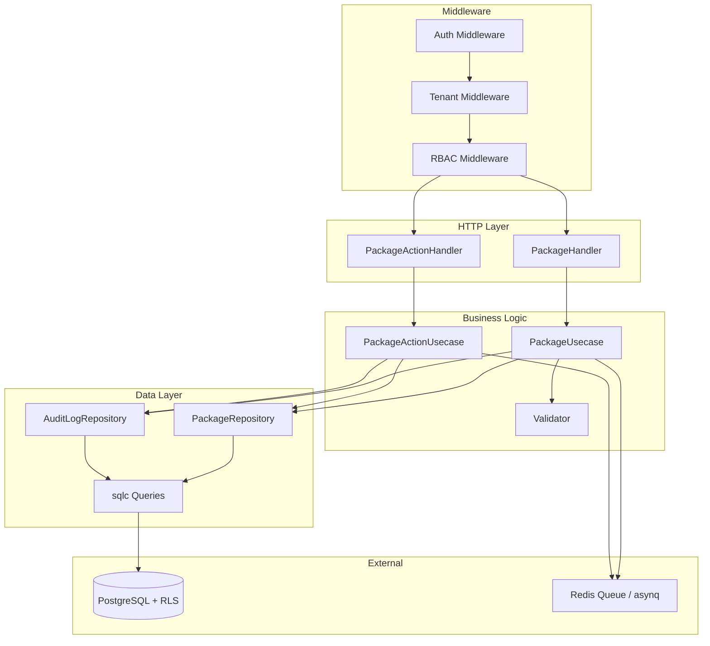
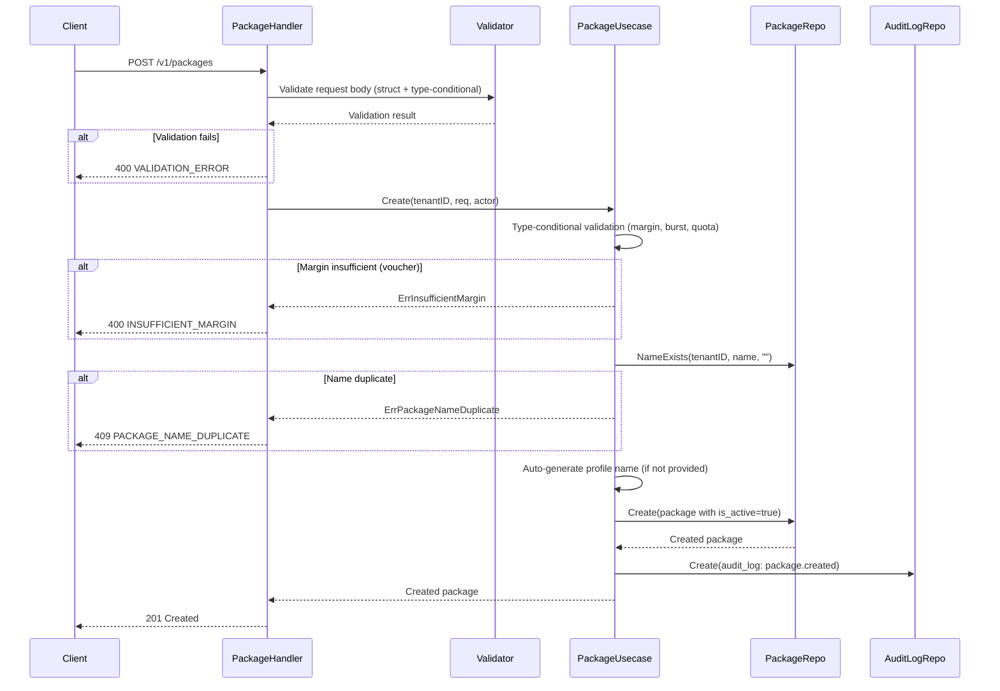
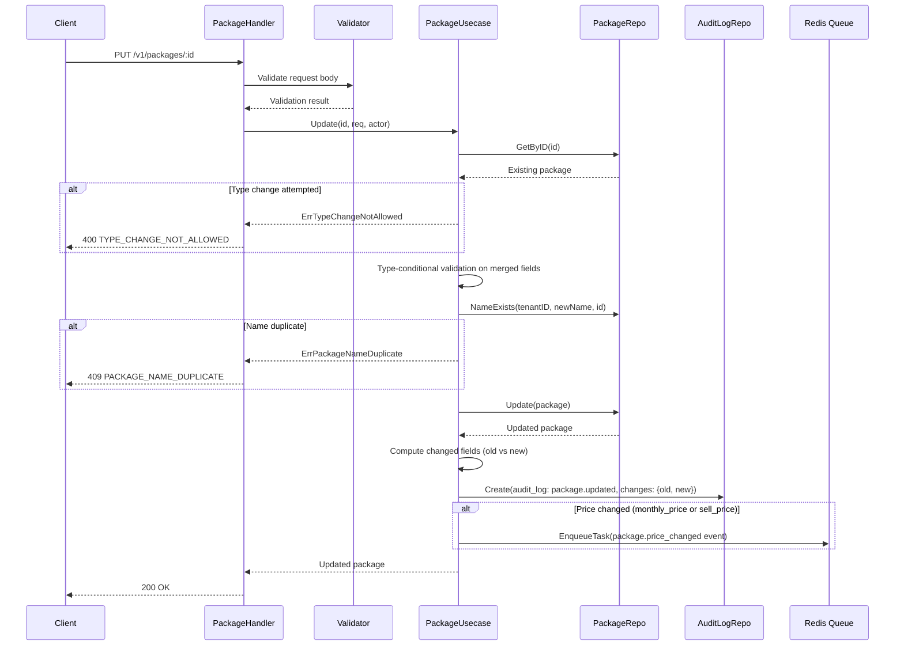
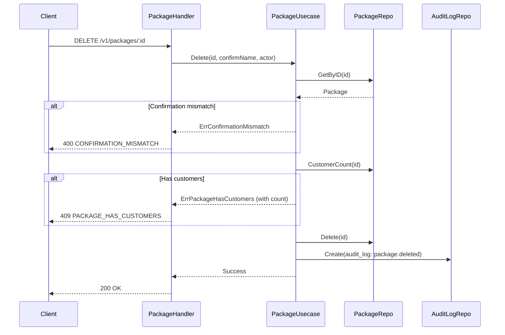
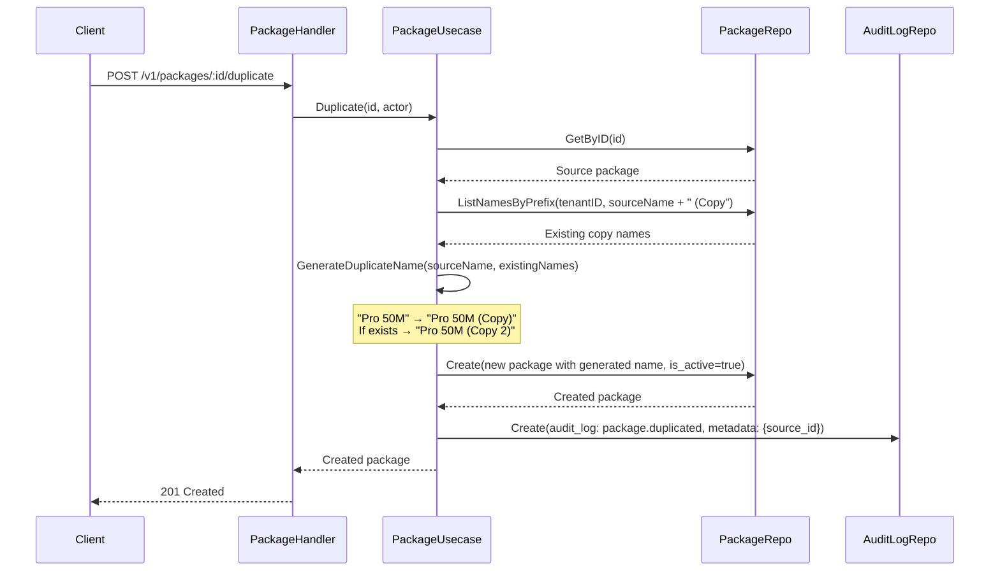

# Design Document: Package CRUD Module

## Overview

The Package CRUD module manages internet service packages for ISPBoss tenants. It supports two package types — PPPoE/Static (monthly billing for fixed customers) and Hotspot/Voucher (per-voucher billing via resellers) — stored in a single `packages` table with a `type` discriminator. The module provides full CRUD, activate/deactivate, duplicate, and audit trail capabilities, with event publishing for price changes.

### Key Design Decisions

| Decision | Choice | Rationale |
|---|---|---|
| Single table for both types | `type` discriminator column | Simpler queries, shared indexes, no JOIN overhead |
| No soft-delete | `is_active` boolean + hard delete (0 customers only) | Packages are configuration data, not transactional — deactivate instead of delete |
| `customer_count` computed | COUNT at query time, not stored | Avoids stale data, no sync issues with customer soft-deletes |
| MikroTik fields always stored | Backend accepts/stores, frontend hides | Graceful degradation — data ready when module activated |
| Reseller margin validation | Domain layer enforcement | Prevents invalid data regardless of caller (handler, worker, etc.) |
| Type immutable after creation | Rejected at usecase layer | Changing type would invalidate type-specific fields and break referential integrity |
| Duplicate name generation | " (Copy)", " (Copy 2)", etc. | User-friendly, auto-incrementing, collision-safe |
| Price change events | Published only on monthly_price or sell_price change | Downstream services (Notification) only care about billing-relevant price changes |
| Audit logging | Shared `audit_logs` table with `entity_type = "package"` | Consistent with customer module, single queryable audit trail |

### Module Boundaries

The package module owns:
- Package CRUD (create, read, update, hard-delete)
- Package activate/deactivate (toggle `is_active`)
- Package duplicate (copy with name suffix)
- Validation (type-conditional, burst all-or-nothing, margin integrity)
- Profile name auto-generation (MikroTik/Hotspot)
- Audit log writes and reads (for package entity)
- Event publishing for price changes

The module does NOT own:
- Voucher generation/management (future `vouchers` module)
- Reseller management (future `resellers` module)
- Customer assignment to packages (owned by customer module)
- Network operations (consumed via events by Network Service)
- Notifications (consumed via events by Notification Service)

## Architecture

### High-Level Architecture



### File Structure

New files to be created within `services/billing-api/`:

```
internal/
├── domain/
│   ├── package.go              # Package entity, types, enums, validation, errors
│   ├── package_event.go        # Event payload types for package events
│   └── repository.go           # APPEND PackageRepository interface + DTOs
├── handler/
│   ├── package_handler.go      # Package HTTP handlers (list, detail, create, update, delete, stats)
│   ├── package_action.go       # Package action handlers (activate, deactivate, duplicate)
│   └── router.go               # MODIFY: add PackageHandler to RouterConfig + register routes
├── usecase/
│   ├── package_usecase.go      # Package business logic (CRUD)
│   └── package_action.go       # Package action logic (activate, deactivate, duplicate)
├── repository/
│   └── package_repo.go         # PackageRepository implementation
queries/
│   └── packages.sql            # sqlc queries for packages
migrations/
├── 000010_create_packages.up.sql
├── 000010_create_packages.down.sql
├── 000011_add_customers_package_fk.up.sql
├── 000011_add_customers_package_fk.down.sql
cmd/
│   └── main.go                 # MODIFY: wire package dependencies
```

### Integration with Existing Infrastructure

- **Auth Middleware** (`middleware/auth.go`): Extracts JWT claims, sets `user_id`, `tenant_id`, `role` in Fiber locals. No changes needed.
- **Tenant Middleware** (`middleware/tenant.go`): Wraps `pkg/tenant.Middleware`. Sets `app.tenant_id` PostgreSQL session variable. No changes needed.
- **RBAC Middleware** (`middleware/rbac.go`): Uses `domain.RBACConfig` with `AllowedRoles` and `MethodRestrictions`. Package routes configure per-endpoint RBAC.
- **Queue** (`pkg/queue`): Uses `queue.TaskEnvelope` and `queue.EnqueueTask` for event publishing. Package price change events follow the same envelope format.
- **Database** (`pkg/database`): Uses `database.WithTenant` for tenant-scoped connections. sqlc queries run within tenant context.
- **Audit Log** (`domain.AuditLogRepository`): Reuses the existing shared `audit_logs` table and repository. No new audit infrastructure needed.

## Components and Interfaces

### Domain Entities

#### PackageType

```go
// PackageType mendefinisikan jenis paket internet.
type PackageType string

const (
    PackageTypePPPoE   PackageType = "pppoe"
    PackageTypeVoucher PackageType = "voucher"
)
```

#### BandwidthType

```go
// BandwidthType mendefinisikan tipe bandwidth paket.
type BandwidthType string

const (
    BandwidthDedicated BandwidthType = "dedicated"
    BandwidthShared    BandwidthType = "shared"
)
```

#### QuotaType

```go
// QuotaType mendefinisikan tipe kuota paket.
type QuotaType string

const (
    QuotaUnlimited    QuotaType = "unlimited"
    QuotaMonthlyQuota QuotaType = "monthly_quota"
    QuotaFUP          QuotaType = "fup"
    QuotaQuota        QuotaType = "quota" // khusus voucher
)
```

#### QuotaAction

```go
// QuotaAction mendefinisikan aksi saat kuota habis.
type QuotaAction string

const (
    QuotaActionThrottle   QuotaAction = "throttle"
    QuotaActionDisconnect QuotaAction = "disconnect"
)
```

#### DurationUnit

```go
// DurationUnit mendefinisikan satuan durasi paket voucher.
type DurationUnit string

const (
    DurationHours  DurationUnit = "hours"
    DurationDays   DurationUnit = "days"
    DurationWeeks  DurationUnit = "weeks"
    DurationMonths DurationUnit = "months"
)
```

#### Package Entity

```go
// Package merepresentasikan paket internet yang ditawarkan oleh tenant.
// Mendukung dua jenis: PPPoE/Static (bulanan) dan Hotspot/Voucher (durasi).
type Package struct {
    ID                 string     `json:"id"`
    TenantID           string     `json:"tenant_id"`
    Type               PackageType `json:"type"`
    Name               string     `json:"name"`
    Description        string     `json:"description,omitempty"`
    IsActive           bool       `json:"is_active"`
    DownloadMbps       int        `json:"download_mbps"`
    UploadMbps         int        `json:"upload_mbps"`
    BandwidthType      string     `json:"bandwidth_type,omitempty"`
    BurstDownloadMbps  *int       `json:"burst_download_mbps,omitempty"`
    BurstUploadMbps    *int       `json:"burst_upload_mbps,omitempty"`
    BurstThresholdMbps *int       `json:"burst_threshold_mbps,omitempty"`
    BurstTimeSeconds   *int       `json:"burst_time_seconds,omitempty"`
    QuotaType          QuotaType  `json:"quota_type"`
    QuotaMB            *int       `json:"quota_mb,omitempty"`
    QuotaAction        string     `json:"quota_action,omitempty"`
    ThrottleMbps       *int       `json:"throttle_mbps,omitempty"`
    MonthlyPrice       *int64     `json:"monthly_price,omitempty"`
    InstallationFee    int64      `json:"installation_fee"`
    SellPrice          *int64     `json:"sell_price,omitempty"`
    ResellerPrice      *int64     `json:"reseller_price,omitempty"`
    DurationValue      *int       `json:"duration_value,omitempty"`
    DurationUnit       string     `json:"duration_unit,omitempty"`
    SharedUsers        int        `json:"shared_users"`
    MikrotikProfileName string   `json:"mikrotik_profile_name,omitempty"`
    AddressPool        string     `json:"address_pool,omitempty"`
    ParentQueue        string     `json:"parent_queue,omitempty"`
    HotspotProfileName string     `json:"hotspot_profile_name,omitempty"`
    CustomerCount      int        `json:"customer_count,omitempty"` // computed field, not stored
    CreatedAt          time.Time  `json:"created_at"`
    UpdatedAt          time.Time  `json:"updated_at"`
}
```

#### Domain Errors

```go
var (
    // ErrPackageNotFound dikembalikan saat paket tidak ditemukan atau milik tenant lain
    ErrPackageNotFound = errors.New("paket tidak ditemukan")

    // ErrPackageNameDuplicate dikembalikan saat nama paket sudah ada di tenant yang sama
    ErrPackageNameDuplicate = errors.New("nama paket sudah terdaftar")

    // ErrPackageHasCustomers dikembalikan saat paket masih digunakan pelanggan (hard delete)
    ErrPackageHasCustomers = errors.New("paket masih digunakan pelanggan")

    // ErrPackageAlreadyActive dikembalikan saat mengaktifkan paket yang sudah aktif
    ErrPackageAlreadyActive = errors.New("paket sudah aktif")

    // ErrPackageAlreadyInactive dikembalikan saat menonaktifkan paket yang sudah nonaktif
    ErrPackageAlreadyInactive = errors.New("paket sudah nonaktif")

    // ErrConfirmationMismatch dikembalikan saat nama konfirmasi tidak cocok (reuse dari customer)
    // Sudah didefinisikan di domain/customer.go

    // ErrInsufficientMargin dikembalikan saat margin reseller < 500 Rupiah
    ErrInsufficientMargin = errors.New("margin reseller tidak mencukupi")

    // ErrTypeChangeNotAllowed dikembalikan saat mencoba mengubah tipe paket setelah dibuat
    ErrTypeChangeNotAllowed = errors.New("tipe paket tidak dapat diubah setelah dibuat")

    // ErrBurstFieldsIncomplete dikembalikan saat burst fields tidak lengkap (harus semua atau tidak ada)
    ErrBurstFieldsIncomplete = errors.New("field burst harus diisi semua atau tidak sama sekali")
)
```

#### Validation Helper Functions

```go
// ValidateResellerMargin memvalidasi margin reseller pada paket voucher.
// Mengembalikan error jika reseller_price >= sell_price atau margin < 500.
func ValidateResellerMargin(sellPrice, resellerPrice int64) error

// GenerateProfileName menghasilkan nama profile MikroTik/Hotspot dari nama paket.
// Format: lowercase, spasi diganti dengan tanda hubung.
// Contoh: "Pro 50M" → "pro-50m"
func GenerateProfileName(name string) string

// GenerateDuplicateName menghasilkan nama paket duplikat.
// Format: "{original} (Copy)", "{original} (Copy 2)", dst.
// Parameter existingNames digunakan untuk menghindari collision.
func GenerateDuplicateName(originalName string, existingNames []string) string
```

### Repository Interfaces

```go
// PackageRepository mendefinisikan operasi data untuk tabel packages.
type PackageRepository interface {
    // Create membuat paket baru dan mengembalikan paket yang dibuat.
    Create(ctx context.Context, pkg *Package) (*Package, error)
    // GetByID mengambil paket berdasarkan ID (tenant-scoped via RLS).
    GetByID(ctx context.Context, id string) (*Package, error)
    // Update memperbarui data paket dan mengembalikan paket yang diperbarui.
    Update(ctx context.Context, pkg *Package) (*Package, error)
    // Delete menghapus paket secara permanen (hard delete).
    Delete(ctx context.Context, id string) error
    // List mengambil daftar paket dengan filter, search, sorting, dan paginasi.
    List(ctx context.Context, params PackageListParams) (*PackageListResult, error)
    // UpdateIsActive memperbarui status aktif paket.
    UpdateIsActive(ctx context.Context, id string, isActive bool) (*Package, error)
    // NameExists mengecek apakah nama paket sudah ada di tenant (exclude ID tertentu).
    NameExists(ctx context.Context, tenantID, name, excludeID string) (bool, error)
    // CustomerCount menghitung jumlah pelanggan aktif (deleted_at IS NULL) yang menggunakan paket.
    CustomerCount(ctx context.Context, id string) (int, error)
    // ListNamesByPrefix mengambil daftar nama paket yang dimulai dengan prefix tertentu.
    // Digunakan untuk generate nama duplikat yang unik.
    ListNamesByPrefix(ctx context.Context, tenantID, prefix string) ([]string, error)
}
```

### Usecase Interfaces

```go
// PackageUsecase mendefinisikan business logic untuk manajemen paket.
type PackageUsecase interface {
    Create(ctx context.Context, tenantID string, req CreatePackageRequest, actor ActorInfo) (*Package, error)
    GetByID(ctx context.Context, id string, includeAudit bool) (*PackageDetail, error)
    Update(ctx context.Context, id string, req UpdatePackageRequest, actor ActorInfo) (*Package, error)
    Delete(ctx context.Context, id string, confirmName string, actor ActorInfo) error
    List(ctx context.Context, params PackageListParams) (*PackageListResult, error)
    Activate(ctx context.Context, id string, actor ActorInfo) (*Package, error)
    Deactivate(ctx context.Context, id string, actor ActorInfo) (*Package, error)
    Duplicate(ctx context.Context, id string, actor ActorInfo) (*Package, error)
}
```

### Request/Response DTOs

```go
// CreatePackageRequest adalah payload untuk POST /v1/packages.
// Validasi bersifat type-conditional: field yang wajib bergantung pada nilai type.
type CreatePackageRequest struct {
    Type               string `json:"type" validate:"required,oneof=pppoe voucher"`
    Name               string `json:"name" validate:"required,min=2,max=255"`
    Description        string `json:"description" validate:"omitempty"`
    DownloadMbps       int    `json:"download_mbps" validate:"required,gt=0"`
    UploadMbps         int    `json:"upload_mbps" validate:"required,gt=0"`
    BandwidthType      string `json:"bandwidth_type" validate:"omitempty,oneof=dedicated shared"`
    BurstDownloadMbps  *int   `json:"burst_download_mbps" validate:"omitempty,gt=0"`
    BurstUploadMbps    *int   `json:"burst_upload_mbps" validate:"omitempty,gt=0"`
    BurstThresholdMbps *int   `json:"burst_threshold_mbps" validate:"omitempty,gt=0"`
    BurstTimeSeconds   *int   `json:"burst_time_seconds" validate:"omitempty,gt=0"`
    QuotaType          string `json:"quota_type" validate:"required"`
    QuotaMB            *int   `json:"quota_mb" validate:"omitempty,gt=0"`
    QuotaAction        string `json:"quota_action" validate:"omitempty,oneof=throttle disconnect"`
    ThrottleMbps       *int   `json:"throttle_mbps" validate:"omitempty,gt=0"`
    MonthlyPrice       *int64 `json:"monthly_price" validate:"omitempty,gt=0"`
    InstallationFee    *int64 `json:"installation_fee" validate:"omitempty,gte=0"`
    SellPrice          *int64 `json:"sell_price" validate:"omitempty,gt=0"`
    ResellerPrice      *int64 `json:"reseller_price" validate:"omitempty,gt=0"`
    DurationValue      *int   `json:"duration_value" validate:"omitempty,gt=0"`
    DurationUnit       string `json:"duration_unit" validate:"omitempty,oneof=hours days weeks months"`
    SharedUsers        *int   `json:"shared_users" validate:"omitempty,gt=0"`
    MikrotikProfileName string `json:"mikrotik_profile_name" validate:"omitempty"`
    AddressPool        string `json:"address_pool" validate:"omitempty"`
    ParentQueue        string `json:"parent_queue" validate:"omitempty"`
    HotspotProfileName string `json:"hotspot_profile_name" validate:"omitempty"`
}

// UpdatePackageRequest adalah payload untuk PUT /v1/packages/:id.
// Field type TIDAK boleh diubah setelah pembuatan.
type UpdatePackageRequest struct {
    Name               string `json:"name" validate:"omitempty,min=2,max=255"`
    Description        string `json:"description" validate:"omitempty"`
    DownloadMbps       *int   `json:"download_mbps" validate:"omitempty,gt=0"`
    UploadMbps         *int   `json:"upload_mbps" validate:"omitempty,gt=0"`
    BandwidthType      string `json:"bandwidth_type" validate:"omitempty,oneof=dedicated shared"`
    BurstDownloadMbps  *int   `json:"burst_download_mbps" validate:"omitempty,gt=0"`
    BurstUploadMbps    *int   `json:"burst_upload_mbps" validate:"omitempty,gt=0"`
    BurstThresholdMbps *int   `json:"burst_threshold_mbps" validate:"omitempty,gt=0"`
    BurstTimeSeconds   *int   `json:"burst_time_seconds" validate:"omitempty,gt=0"`
    QuotaType          string `json:"quota_type" validate:"omitempty"`
    QuotaMB            *int   `json:"quota_mb" validate:"omitempty,gt=0"`
    QuotaAction        string `json:"quota_action" validate:"omitempty,oneof=throttle disconnect"`
    ThrottleMbps       *int   `json:"throttle_mbps" validate:"omitempty,gt=0"`
    MonthlyPrice       *int64 `json:"monthly_price" validate:"omitempty,gt=0"`
    InstallationFee    *int64 `json:"installation_fee" validate:"omitempty,gte=0"`
    SellPrice          *int64 `json:"sell_price" validate:"omitempty,gt=0"`
    ResellerPrice      *int64 `json:"reseller_price" validate:"omitempty,gt=0"`
    DurationValue      *int   `json:"duration_value" validate:"omitempty,gt=0"`
    DurationUnit       string `json:"duration_unit" validate:"omitempty,oneof=hours days weeks months"`
    SharedUsers        *int   `json:"shared_users" validate:"omitempty,gt=0"`
    MikrotikProfileName string `json:"mikrotik_profile_name" validate:"omitempty"`
    AddressPool        string `json:"address_pool" validate:"omitempty"`
    ParentQueue        string `json:"parent_queue" validate:"omitempty"`
    HotspotProfileName string `json:"hotspot_profile_name" validate:"omitempty"`
}

// DeletePackageRequest adalah payload untuk DELETE /v1/packages/:id.
type DeletePackageRequest struct {
    ConfirmationName string `json:"confirmation_name" validate:"required"`
}

// PackageListParams berisi parameter untuk list/filter paket.
type PackageListParams struct {
    TenantID  string `query:"tenant_id"`
    Page      int    `query:"page" validate:"omitempty,min=1"`
    PageSize  int    `query:"page_size" validate:"omitempty,oneof=10 25 50"`
    Search    string `query:"search"`
    Type      string `query:"type" validate:"omitempty,oneof=pppoe voucher"`
    IsActive  *bool  `query:"is_active"`
    SortBy    string `query:"sort_by" validate:"omitempty,oneof=name monthly_price sell_price download_mbps created_at"`
    SortOrder string `query:"sort_order" validate:"omitempty,oneof=asc desc"`
}

// PackageListResult berisi hasil list paket dengan metadata paginasi.
type PackageListResult struct {
    Data       []*Package     `json:"data"`
    Pagination PaginationMeta `json:"pagination"`
}

// PackageDetail berisi detail paket lengkap termasuk audit log.
type PackageDetail struct {
    Package   *Package    `json:"package"`
    AuditLogs []*AuditLog `json:"audit_logs,omitempty"`
}
```

### Handler Structs

```go
// PackageHandler menangani HTTP request untuk manajemen paket.
type PackageHandler struct {
    packageUsecase PackageUsecase
    validate       *validator.Validate
    logger         zerolog.Logger
}

// NewPackageHandler membuat instance baru PackageHandler.
// Mendaftarkan custom validator untuk validasi type-conditional.
func NewPackageHandler(packageUsecase PackageUsecase, logger zerolog.Logger) *PackageHandler
```

### Custom Validator Registration

The package module registers a custom struct-level validator for type-conditional validation:

```go
// validatePackageCreate melakukan validasi struct-level untuk CreatePackageRequest.
// Memeriksa:
// - PPPoE: monthly_price dan bandwidth_type wajib diisi
// - Voucher: sell_price, reseller_price, duration_value, duration_unit wajib diisi
// - Quota conditional: quota_mb wajib jika quota_type bukan unlimited
// - Quota action conditional: quota_action wajib jika quota_type = monthly_quota/fup
// - Throttle conditional: throttle_mbps wajib jika quota_action = throttle
// - Burst all-or-nothing: semua 4 field burst harus ada atau tidak ada sama sekali
// - Margin: reseller_price < sell_price dan margin >= 500
func validatePackageCreate(sl validator.StructLevel)

// validatePackageUpdate melakukan validasi struct-level untuk UpdatePackageRequest.
// Sama seperti create, tapi semua field opsional.
func validatePackageUpdate(sl validator.StructLevel)
```

## Data Models

### Migration 000010: Create Packages Table

```sql
-- Migrasi: membuat tabel packages untuk menyimpan paket internet.
-- Mendukung dua jenis paket: PPPoE/Static (bulanan) dan Hotspot/Voucher (durasi).
-- Setiap paket dimiliki oleh satu tenant dan dilindungi oleh RLS.

CREATE TABLE packages (
    id                    UUID PRIMARY KEY DEFAULT gen_random_uuid(),
    tenant_id             UUID NOT NULL REFERENCES tenants(id),
    type                  VARCHAR(20) NOT NULL,
    name                  VARCHAR(255) NOT NULL,
    description           TEXT,
    is_active             BOOLEAN NOT NULL DEFAULT true,
    download_mbps         INTEGER NOT NULL,
    upload_mbps           INTEGER NOT NULL,
    bandwidth_type        VARCHAR(20),
    burst_download_mbps   INTEGER,
    burst_upload_mbps     INTEGER,
    burst_threshold_mbps  INTEGER,
    burst_time_seconds    INTEGER,
    quota_type            VARCHAR(20) NOT NULL,
    quota_mb              INTEGER,
    quota_action          VARCHAR(20),
    throttle_mbps         INTEGER,
    monthly_price         BIGINT,
    installation_fee      BIGINT NOT NULL DEFAULT 0,
    sell_price            BIGINT,
    reseller_price        BIGINT,
    duration_value        INTEGER,
    duration_unit         VARCHAR(20),
    shared_users          INTEGER NOT NULL DEFAULT 1,
    mikrotik_profile_name VARCHAR(255),
    address_pool          VARCHAR(255),
    parent_queue          VARCHAR(255),
    hotspot_profile_name  VARCHAR(255),
    created_at            TIMESTAMPTZ NOT NULL DEFAULT NOW(),
    updated_at            TIMESTAMPTZ NOT NULL DEFAULT NOW(),

    -- CHECK constraints
    CONSTRAINT chk_packages_type CHECK (type IN ('pppoe', 'voucher')),
    CONSTRAINT chk_packages_quota_type CHECK (
        quota_type IN ('unlimited', 'monthly_quota', 'fup', 'quota')
    ),
    CONSTRAINT chk_packages_download_mbps CHECK (download_mbps > 0),
    CONSTRAINT chk_packages_upload_mbps CHECK (upload_mbps > 0)
);

-- Aktifkan RLS pada tabel packages
ALTER TABLE packages ENABLE ROW LEVEL SECURITY;

-- Policy: isolasi data per tenant (SELECT, UPDATE, DELETE)
CREATE POLICY tenant_isolation ON packages
    USING (tenant_id = current_setting('app.tenant_id')::uuid);

-- Policy: INSERT harus sesuai tenant session
CREATE POLICY tenant_insert ON packages
    FOR INSERT
    WITH CHECK (tenant_id = current_setting('app.tenant_id')::uuid);

-- Unique constraint: nama paket unik per tenant
ALTER TABLE packages ADD CONSTRAINT uq_packages_tenant_name UNIQUE (tenant_id, name);

-- Composite indexes untuk performa query
CREATE INDEX idx_packages_tenant_type ON packages(tenant_id, type);
CREATE INDEX idx_packages_tenant_active ON packages(tenant_id, is_active);
CREATE INDEX idx_packages_tenant_type_active ON packages(tenant_id, type, is_active);
```

Down migration:

```sql
-- Rollback: hapus tabel packages beserta semua policy, constraint, dan index.

DROP POLICY IF EXISTS tenant_insert ON packages;
DROP POLICY IF EXISTS tenant_isolation ON packages;
DROP INDEX IF EXISTS idx_packages_tenant_type_active;
DROP INDEX IF EXISTS idx_packages_tenant_active;
DROP INDEX IF EXISTS idx_packages_tenant_type;
DROP TABLE IF EXISTS packages;
```

### Migration 000011: Add FK from customers.package_id to packages.id

```sql
-- Migrasi: menambahkan foreign key dari customers.package_id ke packages.id.
-- Kolom package_id sudah ada di tabel customers (UUID NOT NULL) dari migrasi 000008,
-- tapi belum memiliki FK karena tabel packages belum ada saat itu.

ALTER TABLE customers
    ADD CONSTRAINT fk_customers_package_id
    FOREIGN KEY (package_id) REFERENCES packages(id);
```

Down migration:

```sql
-- Rollback: hapus foreign key dari customers.package_id.

ALTER TABLE customers DROP CONSTRAINT IF EXISTS fk_customers_package_id;
```

### sqlc Queries (queries/packages.sql)

```sql
-- Query SQL untuk operasi CRUD tabel packages.
-- Digunakan oleh sqlc untuk menghasilkan kode Go yang type-safe.
-- Tabel packages dilindungi RLS, query hanya mengembalikan baris milik tenant aktif.

-- name: CreatePackage :one
INSERT INTO packages (
    tenant_id, type, name, description, is_active,
    download_mbps, upload_mbps, bandwidth_type,
    burst_download_mbps, burst_upload_mbps, burst_threshold_mbps, burst_time_seconds,
    quota_type, quota_mb, quota_action, throttle_mbps,
    monthly_price, installation_fee, sell_price, reseller_price,
    duration_value, duration_unit, shared_users,
    mikrotik_profile_name, address_pool, parent_queue, hotspot_profile_name
) VALUES (
    $1, $2, $3, $4, $5,
    $6, $7, $8,
    $9, $10, $11, $12,
    $13, $14, $15, $16,
    $17, $18, $19, $20,
    $21, $22, $23,
    $24, $25, $26, $27
)
RETURNING *;

-- name: GetPackageByID :one
SELECT p.*,
    (SELECT COUNT(*) FROM customers c
     WHERE c.package_id = p.id AND c.deleted_at IS NULL) AS customer_count
FROM packages p
WHERE p.id = $1;

-- name: UpdatePackage :one
UPDATE packages SET
    name = $2,
    description = $3,
    download_mbps = $4,
    upload_mbps = $5,
    bandwidth_type = $6,
    burst_download_mbps = $7,
    burst_upload_mbps = $8,
    burst_threshold_mbps = $9,
    burst_time_seconds = $10,
    quota_type = $11,
    quota_mb = $12,
    quota_action = $13,
    throttle_mbps = $14,
    monthly_price = $15,
    installation_fee = $16,
    sell_price = $17,
    reseller_price = $18,
    duration_value = $19,
    duration_unit = $20,
    shared_users = $21,
    mikrotik_profile_name = $22,
    address_pool = $23,
    parent_queue = $24,
    hotspot_profile_name = $25,
    updated_at = NOW()
WHERE id = $1
RETURNING *;

-- name: DeletePackage :exec
DELETE FROM packages WHERE id = $1;

-- name: UpdatePackageIsActive :one
UPDATE packages SET is_active = $2, updated_at = NOW()
WHERE id = $1
RETURNING *;

-- name: PackageNameExists :one
SELECT EXISTS(
    SELECT 1 FROM packages
    WHERE tenant_id = $1 AND name = $2 AND id != $3
) AS exists;

-- name: PackageCustomerCount :one
SELECT COUNT(*) FROM customers
WHERE package_id = $1 AND deleted_at IS NULL;

-- name: ListPackageNamesByPrefix :many
SELECT name FROM packages
WHERE tenant_id = $1 AND name LIKE $2
ORDER BY name;
```

Note: The `List` query is built dynamically in the repository layer (same pattern as customer) because sqlc doesn't support dynamic WHERE clauses. The dynamic query supports filtering by `type`, `is_active`, `search` (ILIKE on name), sorting, and pagination with `customer_count` subquery.

### Event Payload Types

```go
// PackagePriceChangedPayload adalah payload event package.price_changed.
// Dikirim saat monthly_price (PPPoE) atau sell_price (Voucher) berubah.
type PackagePriceChangedPayload struct {
    PackageID   string `json:"package_id"`
    PackageName string `json:"package_name"`
    PackageType string `json:"package_type"`
    OldPrice    int64  `json:"old_price"`
    NewPrice    int64  `json:"new_price"`
}
```

## API Endpoint Signatures

### Package Endpoints

| Method | Path | Handler | RBAC | Description |
|---|---|---|---|---|
| GET | `/v1/packages` | `PackageHandler.List` | admin, operator, kasir(GET only) | Daftar paket dengan paginasi, filter, search |
| GET | `/v1/packages/:id` | `PackageHandler.Get` | admin, operator, kasir(GET only) | Detail paket termasuk customer_count |
| POST | `/v1/packages` | `PackageHandler.Create` | tenant_admin only | Buat paket baru (PPPoE atau Voucher) |
| PUT | `/v1/packages/:id` | `PackageHandler.Update` | tenant_admin only | Update data paket |
| DELETE | `/v1/packages/:id` | `PackageHandler.Delete` | tenant_admin only | Hard delete paket (0 pelanggan, konfirmasi nama) |
| POST | `/v1/packages/:id/activate` | `PackageHandler.Activate` | tenant_admin only | Aktifkan paket |
| POST | `/v1/packages/:id/deactivate` | `PackageHandler.Deactivate` | tenant_admin only | Nonaktifkan paket |
| POST | `/v1/packages/:id/duplicate` | `PackageHandler.Duplicate` | tenant_admin only | Duplikat paket |

### Route Registration (in router.go)

```go
// --- Package routes (auth + tenant + RBAC) ---
packageHandler := cfg.PackageHandler
packages := api.Group("/packages")

// Routes accessible by admin, operator, kasir(GET only)
packagesRead := packages.Group("")
packagesRead.Use(middleware.RBAC(domain.RBACConfig{
    AllowedRoles: []domain.UserRole{
        domain.RoleTenantAdmin, domain.RoleOperator, domain.RoleKasir,
    },
    MethodRestrictions: map[domain.UserRole][]string{
        domain.RoleKasir: {"GET"},
    },
}))
packagesRead.Get("/", packageHandler.List)
packagesRead.Get("/:id", packageHandler.Get)

// Routes accessible by tenant_admin only (write operations)
packagesAdmin := packages.Group("")
packagesAdmin.Use(middleware.RBAC(domain.RBACConfig{
    AllowedRoles: []domain.UserRole{domain.RoleTenantAdmin},
}))
packagesAdmin.Post("/", packageHandler.Create)
packagesAdmin.Put("/:id", packageHandler.Update)
packagesAdmin.Delete("/:id", packageHandler.Delete)
packagesAdmin.Post("/:id/activate", packageHandler.Activate)
packagesAdmin.Post("/:id/deactivate", packageHandler.Deactivate)
packagesAdmin.Post("/:id/duplicate", packageHandler.Duplicate)
```

## Data Flow Diagrams

### Package Create Flow



### Package Update Flow (with Price Change Event)



### Package Delete Flow



### Package Duplicate Flow



## Correctness Properties

*A property is a characteristic or behavior that should hold true across all valid executions of a system — essentially, a formal statement about what the system should do. Properties serve as the bridge between human-readable specifications and machine-verifiable correctness guarantees.*

### Property 1: New Package Default Active Status

*For any* valid package creation request (PPPoE or Voucher), the resulting package SHALL always have `is_active` set to `true`, regardless of any `is_active` value provided in the request body.

**Validates: Requirements 2.1, 3.1**

### Property 2: Reseller Margin Integrity

*For any* Voucher package with `sell_price` S and `reseller_price` R, the system SHALL enforce that R < S and S - R >= 500. *For any* creation or update request that violates this constraint, the system SHALL reject the request with `INSUFFICIENT_MARGIN`. Conversely, *for any* valid Voucher package that exists in the system, the margin (sell_price - reseller_price) SHALL always be at least 500 Rupiah.

**Validates: Requirements 3.4, 14.8, 15.1, 15.3**

### Property 3: Type-Field Consistency

*For any* package in the system, the set of non-null type-specific fields SHALL be consistent with the package type. Specifically: *for any* PPPoE package, `monthly_price` and `bandwidth_type` SHALL be non-null, and `sell_price`, `reseller_price`, `duration_value`, and `duration_unit` SHALL be null. *For any* Voucher package, `sell_price`, `reseller_price`, `duration_value`, and `duration_unit` SHALL be non-null, and `monthly_price` and `bandwidth_type` SHALL be null.

**Validates: Requirements 16.1, 16.2, 16.4**

### Property 4: Type Immutability After Creation

*For any* existing package with type T, an update request that includes a different type value SHALL be rejected with `TYPE_CHANGE_NOT_ALLOWED`. The package's type SHALL remain T after any number of update operations.

**Validates: Requirements 16.3**

### Property 5: Profile Name Auto-Generation

*For any* package name, when `mikrotik_profile_name` (PPPoE) or `hotspot_profile_name` (Voucher) is not explicitly provided, the system SHALL auto-generate it by converting the package name to lowercase and replacing spaces with hyphens. *For any* generated profile name, converting it back (hyphens to spaces, then case-insensitive compare) SHALL match the original name's words.

**Validates: Requirements 2.8, 3.7**

### Property 6: Burst Fields All-or-Nothing

*For any* package creation or update request, if any of the four burst fields (`burst_download_mbps`, `burst_upload_mbps`, `burst_threshold_mbps`, `burst_time_seconds`) is provided, then ALL four SHALL be required. If none are provided, the request SHALL be accepted (burst is optional). Partial burst field combinations SHALL always be rejected.

**Validates: Requirements 2.5, 14.10**

### Property 7: Validation Error Aggregation

*For any* package creation or update request containing multiple invalid fields, the validation response SHALL return HTTP 400 with error code `VALIDATION_ERROR` and an array of field-level error details covering ALL invalid fields in a single response (not just the first error encountered).

**Validates: Requirements 14.13**

### Property 8: Audit Trail Completeness

*For any* package mutation operation (create, update, delete, activate, deactivate, duplicate), the system SHALL insert exactly one audit log record with `entity_type` = `"package"`, the correct `entity_id`, `action` (one of `package.created`, `package.updated`, `package.deleted`, `package.activated`, `package.deactivated`, `package.duplicated`), and the correct `actor_id` and `actor_name`. Furthermore, *for any* update operation where fields change, the `changes` JSONB column SHALL contain the old and new values of every changed field.

**Validates: Requirements 2.7, 3.6, 4.5, 7.5, 8.5, 9.4, 12.1, 12.2, 12.3**

### Property 9: Event Publishing on Price Change

*For any* package update operation, a `package.price_changed` event SHALL be published to the Redis queue if and only if the `monthly_price` (PPPoE) or `sell_price` (Voucher) has changed. The event envelope SHALL contain `tenant_id`, `timestamp`, and `correlation_id` (UUID v4). The payload SHALL contain `package_id`, `package_name`, `package_type`, `old_price`, and `new_price`. *For any* update that does not change the relevant price field, no event SHALL be published.

**Validates: Requirements 4.6, 13.1, 13.2, 13.3**

### Property 10: Delete Confirmation Matching

*For any* package with name N, a delete request SHALL succeed if and only if the `confirmation_name` matches N exactly (case-sensitive). *For any* `confirmation_name` that does not match N, the request SHALL be rejected with `CONFIRMATION_MISMATCH` and the package SHALL remain unchanged.

**Validates: Requirements 8.1, 8.2**

### Property 11: Duplicate Name Generation

*For any* package with name N, duplicating it SHALL produce a new package with name `N + " (Copy)"`. If that name already exists, the system SHALL try `N + " (Copy 2)"`, `N + " (Copy 3)"`, etc., until a unique name is found. The duplicated package SHALL have all fields identical to the source except `id` (new UUID), `name` (generated), `is_active` (true), and `created_at`/`updated_at` (current time).

**Validates: Requirements 9.1, 9.2**

### Property 12: Pagination Metadata Correctness

*For any* total count of packages and `page_size`, the pagination metadata SHALL satisfy: `total_pages == ceil(total / page_size)`, `page` is within [1, max(1, total_pages)], and the number of items returned on the current page equals `min(page_size, total - (page-1) * page_size)`.

**Validates: Requirements 5.7**

## Error Handling

### Domain Error Types

```go
var (
    // ErrPackageNotFound dikembalikan saat paket tidak ditemukan atau milik tenant lain
    ErrPackageNotFound = errors.New("paket tidak ditemukan")

    // ErrPackageNameDuplicate dikembalikan saat nama paket sudah ada di tenant yang sama
    ErrPackageNameDuplicate = errors.New("nama paket sudah terdaftar")

    // ErrPackageHasCustomers dikembalikan saat paket masih digunakan pelanggan
    ErrPackageHasCustomers = errors.New("paket masih digunakan pelanggan")

    // ErrPackageAlreadyActive dikembalikan saat mengaktifkan paket yang sudah aktif
    ErrPackageAlreadyActive = errors.New("paket sudah aktif")

    // ErrPackageAlreadyInactive dikembalikan saat menonaktifkan paket yang sudah nonaktif
    ErrPackageAlreadyInactive = errors.New("paket sudah nonaktif")

    // ErrInsufficientMargin dikembalikan saat margin reseller < 500 Rupiah
    ErrInsufficientMargin = errors.New("margin reseller tidak mencukupi")

    // ErrTypeChangeNotAllowed dikembalikan saat mencoba mengubah tipe paket
    ErrTypeChangeNotAllowed = errors.New("tipe paket tidak dapat diubah setelah dibuat")

    // ErrBurstFieldsIncomplete dikembalikan saat burst fields tidak lengkap
    ErrBurstFieldsIncomplete = errors.New("field burst harus diisi semua atau tidak sama sekali")
)
```

### HTTP Error Mapping

| Domain Error | HTTP Status | Error Code |
|---|---|---|
| `ErrPackageNotFound` | 404 | `PACKAGE_NOT_FOUND` |
| `ErrPackageNameDuplicate` | 409 | `PACKAGE_NAME_DUPLICATE` |
| `ErrPackageHasCustomers` | 409 | `PACKAGE_HAS_CUSTOMERS` |
| `ErrPackageAlreadyActive` | 400 | `PACKAGE_ALREADY_ACTIVE` |
| `ErrPackageAlreadyInactive` | 400 | `PACKAGE_ALREADY_INACTIVE` |
| `ErrInsufficientMargin` | 400 | `INSUFFICIENT_MARGIN` |
| `ErrTypeChangeNotAllowed` | 400 | `TYPE_CHANGE_NOT_ALLOWED` |
| `ErrBurstFieldsIncomplete` | 400 | `BURST_FIELDS_INCOMPLETE` |
| `ErrConfirmationMismatch` | 400 | `CONFIRMATION_MISMATCH` |
| Validation errors | 400 | `VALIDATION_ERROR` |
| RBAC denied | 403 | `FORBIDDEN` |
| Internal errors | 500 | `INTERNAL_ERROR` |

### Error Response Format

All errors follow the existing `domain.APIResponse` format:

```json
{
  "success": false,
  "error": {
    "code": "PACKAGE_HAS_CUSTOMERS",
    "message": "paket masih digunakan pelanggan",
    "details": [
      {"field": "customer_count", "message": "paket digunakan oleh 42 pelanggan, nonaktifkan saja"}
    ]
  }
}
```

### Validation Error Response

```json
{
  "success": false,
  "error": {
    "code": "VALIDATION_ERROR",
    "message": "validasi gagal",
    "details": [
      {"field": "name", "message": "minimal 2 karakter"},
      {"field": "monthly_price", "message": "wajib diisi untuk paket PPPoE"},
      {"field": "bandwidth_type", "message": "wajib diisi untuk paket PPPoE"}
    ]
  }
}
```

### Insufficient Margin Error Response

```json
{
  "success": false,
  "error": {
    "code": "INSUFFICIENT_MARGIN",
    "message": "margin reseller tidak mencukupi",
    "details": [
      {"field": "reseller_price", "message": "margin saat ini: Rp 300, minimum: Rp 500"}
    ]
  }
}
```

## Testing Strategy

### Testing Framework

- **Unit tests**: `testing` (stdlib) + `testify` for assertions
- **Property-based tests**: `pgregory.net/rapid` (already in go.mod)
- **Integration tests**: `testcontainers-go` for PostgreSQL + Redis
- **HTTP tests**: `net/http/httptest` + Fiber test utilities

### Dual Testing Approach

#### Property-Based Tests (rapid)

Each correctness property maps to one property-based test with minimum 100 iterations. Tests are tagged with the property they validate.

| Property | Test File | Description |
|---|---|---|
| Property 1 | `usecase/package_usecase_test.go` | New package default active status |
| Property 2 | `domain/package_test.go` | Reseller margin integrity |
| Property 3 | `usecase/package_usecase_test.go` | Type-field consistency |
| Property 4 | `usecase/package_usecase_test.go` | Type immutability after creation |
| Property 5 | `domain/package_test.go` | Profile name auto-generation |
| Property 6 | `domain/package_test.go` | Burst fields all-or-nothing |
| Property 7 | `handler/package_handler_test.go` | Validation error aggregation |
| Property 8 | `usecase/package_usecase_test.go` | Audit trail completeness |
| Property 9 | `usecase/package_usecase_test.go` | Event publishing on price change |
| Property 10 | `usecase/package_usecase_test.go` | Delete confirmation matching |
| Property 11 | `domain/package_test.go` | Duplicate name generation |
| Property 12 | `usecase/package_usecase_test.go` | Pagination metadata correctness |

**Property test configuration:**
- Minimum 100 iterations per property
- Tag format: `// Feature: package-crud, Property N: {title}`
- Use `rapid.Check` with `*rapid.T` for each property

#### Unit Tests (Example-Based)

| Area | Test File | Coverage |
|---|---|---|
| Package CRUD handlers | `handler/package_handler_test.go` | HTTP status codes, request parsing, response format, error mapping |
| Package action handlers | `handler/package_handler_test.go` | Activate, deactivate, duplicate HTTP handling |
| Package usecase | `usecase/package_usecase_test.go` | Business logic: name duplicate, type change rejection, customer count check |
| Package action usecase | `usecase/package_action_test.go` | Activate/deactivate already-in-state, duplicate with collisions |
| Domain validation | `domain/package_test.go` | Margin edge cases (exactly 500, 499), burst partial combos |
| RBAC | Existing `handler/rbac_test.go` pattern | Each role × each package endpoint |

#### Integration Tests

| Area | Description |
|---|---|
| Tenant isolation | Create packages in tenant A, verify invisible from tenant B |
| RLS enforcement | Verify RLS blocks cross-tenant access at DB level |
| Unique constraints | Verify (tenant_id, name) uniqueness at DB level |
| FK constraint | Verify customers.package_id FK to packages.id |
| Customer count | Create packages + customers, verify computed count |
| List filtering | Verify type, is_active, search filters with real DB |
| Migration | Verify schema after running migrations 000010 + 000011 |

### Test Organization

```
services/billing-api/internal/
├── domain/
│   └── package_test.go           # Property 2, 5, 6, 11 + unit tests for validation helpers
├── handler/
│   └── package_handler_test.go   # Property 7 + HTTP handler unit tests
├── usecase/
│   ├── package_usecase_test.go   # Property 1, 3, 4, 8, 9, 10, 12 + business logic tests
│   └── package_action_test.go    # Activate/deactivate/duplicate unit tests
└── repository/
    └── package_repo_test.go      # Integration tests (tenant isolation, filtering, customer count)
```
