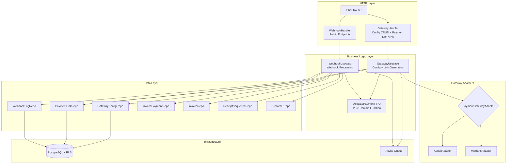
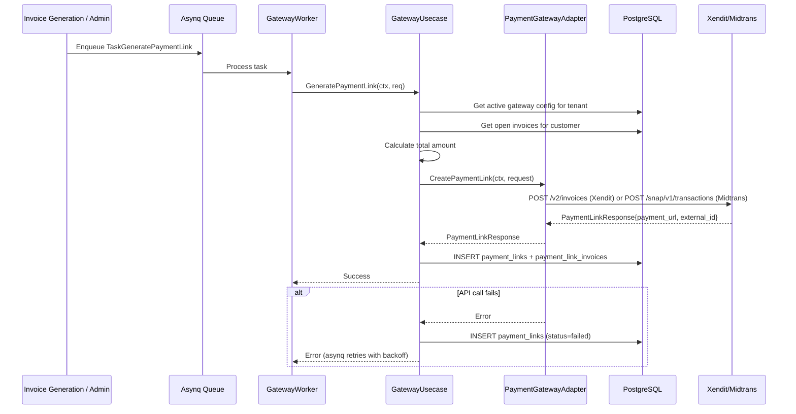
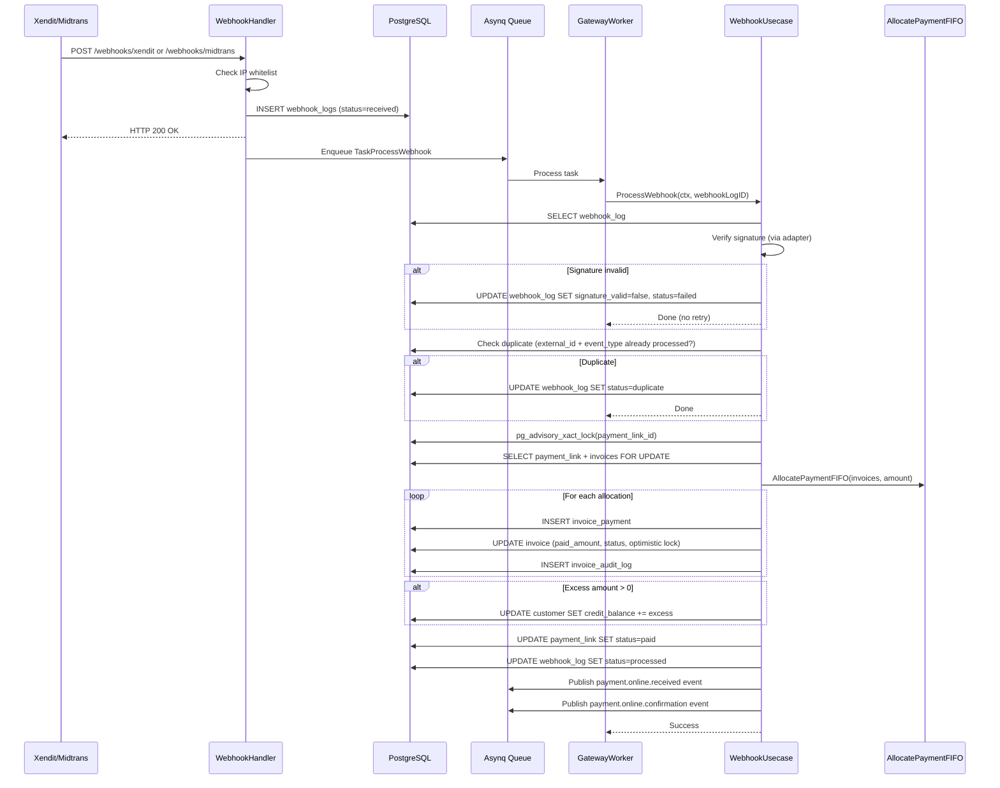
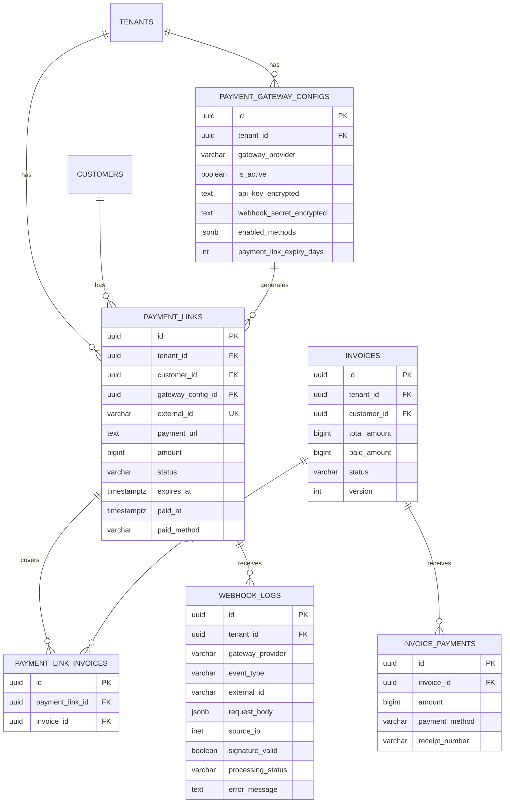

# Design Document: Payment Gateway Module

## Overview

The Payment Gateway module extends the ISPBoss billing-api service with online payment capabilities through Xendit and Midtrans payment gateways. It builds on top of the existing payment-manual module by adding: per-tenant gateway configuration with encrypted API keys, asynchronous payment link generation via asynq, webhook endpoints with IP whitelist and signature verification, idempotent webhook processing with advisory locks, multi-invoice payment link support, payment link expiry with auto-regeneration, and walled garden integration for isolated customers.

The module follows the same domain → repository → usecase → handler layering established by the existing codebase. All data is tenant-scoped via PostgreSQL RLS. Monetary values use BIGINT (Rupiah) consistent with the existing system.

### Key Design Decisions

1. **Extends billing-api, not a separate service** — The payment gateway module lives within `services/billing-api` and follows the same layering pattern. This avoids distributed transaction complexity and allows direct reuse of existing domain functions (`AllocatePaymentFIFO`, `FormatReceiptNumber`, receipt sequences).

2. **Gateway Adapter Pattern** — A `PaymentGatewayAdapter` interface abstracts Xendit and Midtrans behind a unified contract. `XenditAdapter` and `MidtransAdapter` implement this interface. New gateways can be added by implementing the interface without modifying business logic.

3. **Async payment link generation** — Payment links are generated via asynq task queue (`TaskGeneratePaymentLink`) to avoid blocking invoice creation. Failed generations retry with exponential backoff (1min, 5min, 15min, max 3 retries).

4. **Async webhook processing** — Webhook endpoints log the request immediately, return HTTP 200, then enqueue an asynq task for actual processing. This prevents gateway retries due to slow processing and decouples reception from business logic.

5. **AES-256-GCM encryption for API keys at rest** — Gateway API keys and webhook secrets are encrypted before storage using AES-256-GCM with a master key from environment config. Keys are masked (last 4 chars only) in API responses.

6. **Advisory locks for webhook idempotency** — `pg_advisory_xact_lock` on the payment link ID prevents race conditions between concurrent webhook deliveries. Combined with `webhook_logs` deduplication check on `(external_id, event_type)`.

7. **Webhook endpoints are PUBLIC** — No auth middleware on `/webhooks/xendit` and `/webhooks/midtrans`. Security is enforced via IP whitelist (configurable, skippable in dev) + cryptographic signature verification per gateway.

8. **Reuses existing payment infrastructure** — The module reuses `AllocatePaymentFIFO` for multi-invoice allocation, `FormatReceiptNumber` for receipt generation, `ReceiptSequenceRepository` for atomic numbering, and the existing `invoice_payments` table for recording payments.

9. **Monetary values as BIGINT (Rupiah)** — Consistent with the existing codebase. No floating point for money.

10. **Max 200 lines per file** — All code files follow the project convention of max 200 lines. Larger concerns are split across multiple files.

11. **All code comments in Indonesian** — Consistent with the existing codebase convention.

## Architecture

### High-Level Architecture



### Data Flow: Payment Link Generation (Async)



### Data Flow: Webhook Processing (Async)



### File Structure

```
services/billing-api/
  migrations/
    000028_create_payment_gateway_configs.up.sql
    000028_create_payment_gateway_configs.down.sql
    000029_create_payment_links.up.sql
    000029_create_payment_links.down.sql
    000030_create_webhook_logs.up.sql
    000030_create_webhook_logs.down.sql
  internal/
    domain/
      gateway.go              # Tipe domain gateway, interface, error, enum, DTO
    gateway/
      adapter.go              # PaymentGatewayAdapter interface + factory
      xendit.go               # XenditAdapter implementation
      midtrans.go             # MidtransAdapter implementation
      crypto.go               # AES-256-GCM encrypt/decrypt untuk API keys
    repository/
      gateway_config_repo.go  # GatewayConfigRepository implementation (sqlc)
      payment_link_repo.go    # PaymentLinkRepository implementation (sqlc)
      webhook_log_repo.go     # WebhookLogRepository implementation (sqlc)
    usecase/
      gateway_usecase.go      # GatewayUsecase: config CRUD, payment link generation
      webhook_usecase.go      # WebhookUsecase: webhook processing, payment recording
    handler/
      gateway_handler.go      # Config CRUD, payment link APIs, payment status query
      webhook_handler.go      # Public webhook endpoints (Xendit, Midtrans)
    worker/
      gateway_worker.go       # Async tasks: link generation, webhook processing, expiry, cleanup
```

## Components and Interfaces

### Domain Layer (`domain/gateway.go`)

#### Enums and Constants

```go
package domain

// GatewayProvider mendefinisikan provider payment gateway yang didukung.
type GatewayProvider string

const (
    GatewayXendit   GatewayProvider = "xendit"
    GatewayMidtrans GatewayProvider = "midtrans"
)

// PaymentLinkStatus mendefinisikan status payment link.
type PaymentLinkStatus string

const (
    PaymentLinkActive  PaymentLinkStatus = "active"
    PaymentLinkExpired PaymentLinkStatus = "expired"
    PaymentLinkPaid    PaymentLinkStatus = "paid"
    PaymentLinkFailed  PaymentLinkStatus = "failed"
)

// WebhookProcessingStatus mendefinisikan status pemrosesan webhook.
type WebhookProcessingStatus string

const (
    WebhookReceived  WebhookProcessingStatus = "received"
    WebhookVerified  WebhookProcessingStatus = "verified"
    WebhookProcessed WebhookProcessingStatus = "processed"
    WebhookFailed    WebhookProcessingStatus = "failed"
    WebhookDuplicate WebhookProcessingStatus = "duplicate"
)
```

#### Entity Types

```go
// GatewayConfig merepresentasikan konfigurasi payment gateway per tenant.
type GatewayConfig struct {
    ID                    string          `json:"id"`
    TenantID              string          `json:"tenant_id"`
    GatewayProvider       GatewayProvider `json:"gateway_provider"`
    IsActive              bool            `json:"is_active"`
    APIKeyEncrypted       string          `json:"-"`
    WebhookSecretEncrypted string         `json:"-"`
    APIKeyMasked          string          `json:"api_key_masked,omitempty"`
    EnabledMethods        []string        `json:"enabled_methods"`
    PaymentLinkExpiryDays int             `json:"payment_link_expiry_days"`
    CreatedAt             time.Time       `json:"created_at"`
    UpdatedAt             time.Time       `json:"updated_at"`
}

// PaymentLink merepresentasikan payment link yang digenerate via gateway.
type PaymentLink struct {
    ID              string            `json:"id"`
    TenantID        string            `json:"tenant_id"`
    CustomerID      string            `json:"customer_id"`
    GatewayProvider GatewayProvider   `json:"gateway_provider"`
    GatewayConfigID string            `json:"gateway_config_id"`
    ExternalID      string            `json:"external_id"`
    PaymentURL      string            `json:"payment_url"`
    Amount          int64             `json:"amount"`
    Status          PaymentLinkStatus `json:"status"`
    ExpiresAt       time.Time         `json:"expires_at"`
    PaidAt          *time.Time        `json:"paid_at,omitempty"`
    PaidMethod      string            `json:"paid_method,omitempty"`
    CreatedAt       time.Time         `json:"created_at"`
    UpdatedAt       time.Time         `json:"updated_at"`
}

// PaymentLinkInvoice merepresentasikan junction antara payment link dan invoice.
type PaymentLinkInvoice struct {
    ID            string `json:"id"`
    PaymentLinkID string `json:"payment_link_id"`
    InvoiceID     string `json:"invoice_id"`
}

// WebhookLog merepresentasikan log webhook request (append-only).
type WebhookLog struct {
    ID               string                  `json:"id"`
    TenantID         *string                 `json:"tenant_id,omitempty"`
    GatewayProvider  GatewayProvider         `json:"gateway_provider"`
    EventType        string                  `json:"event_type"`
    ExternalID       string                  `json:"external_id"`
    RequestBody      json.RawMessage         `json:"request_body"`
    SourceIP         string                  `json:"source_ip"`
    SignatureValid   *bool                   `json:"signature_valid,omitempty"`
    ProcessingStatus WebhookProcessingStatus `json:"processing_status"`
    ErrorMessage     string                  `json:"error_message,omitempty"`
    CreatedAt        time.Time               `json:"created_at"`
}
```

#### Domain Errors

```go
var (
    ErrGatewayConfigNotFound    = errors.New("konfigurasi gateway tidak ditemukan")
    ErrGatewayConfigDuplicate   = errors.New("konfigurasi gateway untuk provider ini sudah ada")
    ErrPaymentLinkNotFound      = errors.New("payment link tidak ditemukan")
    ErrPaymentLinkAlreadyActive = errors.New("payment link aktif sudah ada untuk customer ini")
    ErrPaymentLinkExpired       = errors.New("payment link sudah expired")
    ErrWebhookSignatureInvalid  = errors.New("signature webhook tidak valid")
    ErrWebhookDuplicate         = errors.New("webhook sudah diproses sebelumnya")
    ErrWebhookIPNotWhitelisted  = errors.New("IP webhook tidak ada dalam whitelist")
    ErrGatewayUnavailable       = errors.New("payment gateway tidak tersedia")
    ErrGatewayInvalidAPIKey     = errors.New("API key gateway tidak valid")
    ErrNoActiveGateway          = errors.New("tidak ada gateway aktif untuk tenant ini")
    ErrInvalidEnabledMethods    = errors.New("enabled_methods mengandung nilai tidak valid")
    ErrEncryptionFailed         = errors.New("gagal mengenkripsi data")
    ErrDecryptionFailed         = errors.New("gagal mendekripsi data")
)
```

#### Request/Response DTOs

```go
// --- Gateway Config DTOs ---

// CreateGatewayConfigRequest adalah payload untuk POST /v1/settings/payment-gateways.
type CreateGatewayConfigRequest struct {
    GatewayProvider       string   `json:"gateway_provider" validate:"required,oneof=xendit midtrans"`
    APIKey                string   `json:"api_key" validate:"required,min=10"`
    WebhookSecret         string   `json:"webhook_secret" validate:"required,min=10"`
    EnabledMethods        []string `json:"enabled_methods" validate:"required,min=1,dive,required"`
    PaymentLinkExpiryDays *int     `json:"payment_link_expiry_days" validate:"omitempty,min=1,max=30"`
}

// UpdateGatewayConfigRequest adalah payload untuk PUT /v1/settings/payment-gateways/:id.
type UpdateGatewayConfigRequest struct {
    APIKey                string   `json:"api_key" validate:"omitempty,min=10"`
    WebhookSecret         string   `json:"webhook_secret" validate:"omitempty,min=10"`
    EnabledMethods        []string `json:"enabled_methods" validate:"omitempty,min=1,dive,required"`
    PaymentLinkExpiryDays *int     `json:"payment_link_expiry_days" validate:"omitempty,min=1,max=30"`
}

// --- Payment Link DTOs ---

// GeneratePaymentLinkRequest adalah payload untuk task generate payment link.
type GeneratePaymentLinkRequest struct {
    TenantID   string   `json:"tenant_id" validate:"required,uuid"`
    CustomerID string   `json:"customer_id" validate:"required,uuid"`
    InvoiceIDs []string `json:"invoice_ids" validate:"required,min=1,dive,uuid"`
}

// RegeneratePaymentLinkRequest adalah payload untuk POST /v1/customers/:customer_id/payment-link/regenerate.
type RegeneratePaymentLinkRequest struct {
    CustomerID string `json:"customer_id" validate:"required,uuid"`
}

// PaymentLinkResponse adalah response dari gateway adapter setelah create payment link.
type PaymentLinkResponse struct {
    ExternalID string `json:"external_id"`
    PaymentURL string `json:"payment_url"`
    ExpiresAt  time.Time `json:"expires_at"`
}

// CustomerPaymentLinkResponse adalah response GET /v1/customers/:customer_id/payment-link.
type CustomerPaymentLinkResponse struct {
    PaymentLink    *PaymentLink       `json:"payment_link"`
    Invoices       []OpenInvoiceItem  `json:"invoices"`
    TotalArrears   int64              `json:"total_arrears"`
}

// --- Webhook DTOs ---

// WebhookEvent adalah hasil parsing webhook payload oleh adapter.
type WebhookEvent struct {
    EventType      string          `json:"event_type"`      // "payment.paid", "payment.expired", "payment.failed"
    ExternalID     string          `json:"external_id"`     // ID payment link di gateway
    TransactionID  string          `json:"transaction_id"`  // ID transaksi unik dari gateway (idempotency key)
    Amount         int64           `json:"amount"`
    PaidMethod     string          `json:"paid_method"`     // e.g., "va_bca", "qris", "ewallet_gopay"
    GatewayProvider GatewayProvider `json:"gateway_provider"`
    RawPayload     json.RawMessage `json:"raw_payload"`
}

// --- Payment Status Query DTOs ---

// InvoicePaymentLinksResponse adalah response GET /v1/invoices/:invoice_id/payment-links.
type InvoicePaymentLinksResponse struct {
    PaymentLinks []PaymentLink `json:"payment_links"`
}

// PaymentLinkWebhooksResponse adalah response GET /v1/payment-links/:id/webhooks.
type PaymentLinkWebhooksResponse struct {
    Webhooks []WebhookLog `json:"webhooks"`
}

// --- Walled Garden DTOs ---

// WalledGardenPaymentInfo adalah response GET /v1/public/walled-garden/:customer_id/payment-info.
type WalledGardenPaymentInfo struct {
    PaymentURL   string            `json:"payment_url"`
    TotalArrears int64             `json:"total_arrears"`
    Invoices     []OpenInvoiceItem `json:"invoices"`
    CustomerName string            `json:"customer_name"`
}

// --- Gateway Health Check DTOs ---

// GatewayTestResult adalah response POST /v1/settings/payment-gateways/:id/test.
type GatewayTestResult struct {
    Success      bool   `json:"success"`
    ErrorCode    string `json:"error_code,omitempty"`
    ErrorMessage string `json:"error_message,omitempty"`
    LatencyMs    int64  `json:"latency_ms"`
}
```

#### Enabled Methods Validation

```go
// ValidXenditMethods berisi metode pembayaran yang valid untuk Xendit.
var ValidXenditMethods = map[string]bool{
    "va_bca": true, "va_bni": true, "va_bri": true,
    "va_mandiri": true, "va_permata": true, "qris": true,
    "ewallet_ovo": true, "ewallet_gopay": true,
    "ewallet_dana": true, "ewallet_shopeepay": true,
    "credit_card": true,
}

// ValidMidtransMethods berisi metode pembayaran yang valid untuk Midtrans.
var ValidMidtransMethods = map[string]bool{
    "va_bca": true, "va_bni": true, "va_bri": true,
    "va_mandiri": true, "va_permata": true, "qris": true,
    "ewallet_gopay": true, "ewallet_shopeepay": true,
    "credit_card": true,
}

// ValidateEnabledMethods memvalidasi bahwa semua metode dalam daftar valid untuk provider.
func ValidateEnabledMethods(provider GatewayProvider, methods []string) error {
    validMap := ValidXenditMethods
    if provider == GatewayMidtrans {
        validMap = ValidMidtransMethods
    }
    for _, m := range methods {
        if !validMap[m] {
            return fmt.Errorf("%w: %s tidak valid untuk %s", ErrInvalidEnabledMethods, m, provider)
        }
    }
    return nil
}
```

### Gateway Adapter Layer (`gateway/`)

#### PaymentGatewayAdapter Interface (`gateway/adapter.go`)

```go
package gateway

// PaymentGatewayAdapter mendefinisikan kontrak untuk interaksi dengan payment gateway.
// Diimplementasikan oleh XenditAdapter dan MidtransAdapter.
type PaymentGatewayAdapter interface {
    // CreatePaymentLink membuat payment link baru di gateway.
    // Mengembalikan PaymentLinkResponse berisi URL dan external ID.
    CreatePaymentLink(ctx context.Context, req CreateLinkRequest) (*domain.PaymentLinkResponse, error)

    // VerifyWebhookSignature memverifikasi signature/token webhook.
    // Mengembalikan true jika signature valid.
    VerifyWebhookSignature(ctx context.Context, headers map[string]string, body []byte, secret string) (bool, error)

    // ParseWebhookPayload mem-parse body webhook menjadi WebhookEvent.
    ParseWebhookPayload(body []byte) (*domain.WebhookEvent, error)

    // ExpirePaymentLink meng-expire payment link di gateway.
    ExpirePaymentLink(ctx context.Context, externalID string) error

    // TestConnection menguji koneksi dan kredensial ke gateway.
    TestConnection(ctx context.Context) (*domain.GatewayTestResult, error)
}

// CreateLinkRequest berisi parameter untuk membuat payment link.
type CreateLinkRequest struct {
    ExternalID   string   // ID unik dari sistem kita (payment_link.id)
    Amount       int64    // Jumlah dalam Rupiah
    Description  string   // Deskripsi pembayaran
    CustomerName string   // Nama pelanggan
    CustomerEmail string  // Email pelanggan (opsional)
    ExpiryDuration time.Duration // Durasi sebelum link expired
    EnabledMethods []string // Metode pembayaran yang diaktifkan
}

// NewAdapter membuat adapter berdasarkan provider.
// apiKey sudah dalam bentuk plaintext (sudah didekripsi).
func NewAdapter(provider domain.GatewayProvider, apiKey string) (PaymentGatewayAdapter, error) {
    switch provider {
    case domain.GatewayXendit:
        return NewXenditAdapter(apiKey), nil
    case domain.GatewayMidtrans:
        return NewMidtransAdapter(apiKey), nil
    default:
        return nil, fmt.Errorf("provider tidak didukung: %s", provider)
    }
}
```

#### XenditAdapter (`gateway/xendit.go`)

```go
// XenditAdapter mengimplementasikan PaymentGatewayAdapter untuk Xendit.
// Menggunakan Xendit Invoice API v2 untuk membuat payment link.
type XenditAdapter struct {
    apiKey     string
    httpClient *http.Client
    baseURL    string
}

// VerifyWebhookSignature memverifikasi webhook Xendit dengan membandingkan
// header x-callback-token dengan webhook secret yang tersimpan.
func (a *XenditAdapter) VerifyWebhookSignature(ctx context.Context, headers map[string]string, body []byte, secret string) (bool, error) {
    callbackToken := headers["x-callback-token"]
    return callbackToken == secret, nil
}
```

#### MidtransAdapter (`gateway/midtrans.go`)

```go
// MidtransAdapter mengimplementasikan PaymentGatewayAdapter untuk Midtrans.
// Menggunakan Midtrans Snap API untuk membuat payment link.
type MidtransAdapter struct {
    serverKey  string
    httpClient *http.Client
    baseURL    string
}

// VerifyWebhookSignature memverifikasi webhook Midtrans dengan menghitung
// SHA-512 hash dari order_id + status_code + gross_amount + server_key
// dan membandingkan dengan signature_key di body notifikasi.
func (a *MidtransAdapter) VerifyWebhookSignature(ctx context.Context, headers map[string]string, body []byte, secret string) (bool, error) {
    // Parse body untuk mendapatkan order_id, status_code, gross_amount, signature_key
    // Hitung: SHA512(order_id + status_code + gross_amount + server_key)
    // Bandingkan dengan signature_key dari body
}
```

#### AES-256-GCM Encryption (`gateway/crypto.go`)

```go
// EncryptAESGCM mengenkripsi plaintext menggunakan AES-256-GCM.
// masterKey harus 32 bytes (256 bit).
// Mengembalikan base64-encoded ciphertext (nonce + ciphertext + tag).
func EncryptAESGCM(plaintext string, masterKey []byte) (string, error)

// DecryptAESGCM mendekripsi ciphertext yang dienkripsi dengan EncryptAESGCM.
// masterKey harus sama dengan yang digunakan saat enkripsi.
func DecryptAESGCM(ciphertext string, masterKey []byte) (string, error)

// MaskAPIKey mengembalikan API key yang di-mask, hanya menampilkan 4 karakter terakhir.
// Contoh: "xnd_production_abc123xyz" → "****xyz"
func MaskAPIKey(apiKey string) string
```

### Repository Layer

#### GatewayConfigRepository (`domain/gateway.go` — interface)

```go
// GatewayConfigRepository mendefinisikan operasi data untuk tabel payment_gateway_configs.
type GatewayConfigRepository interface {
    // Create membuat konfigurasi gateway baru.
    Create(ctx context.Context, config *GatewayConfig) (*GatewayConfig, error)
    // GetByID mengambil konfigurasi gateway berdasarkan ID.
    GetByID(ctx context.Context, id string) (*GatewayConfig, error)
    // Update memperbarui konfigurasi gateway.
    Update(ctx context.Context, config *GatewayConfig) (*GatewayConfig, error)
    // Deactivate menonaktifkan konfigurasi gateway (soft delete).
    Deactivate(ctx context.Context, id string) error
    // ListByTenant mengambil semua konfigurasi gateway untuk tenant.
    ListByTenant(ctx context.Context, tenantID string) ([]*GatewayConfig, error)
    // GetActiveByTenant mengambil konfigurasi gateway aktif untuk tenant.
    GetActiveByTenant(ctx context.Context, tenantID string) ([]*GatewayConfig, error)
    // GetActiveByProvider mengambil konfigurasi gateway aktif berdasarkan provider.
    GetActiveByProvider(ctx context.Context, tenantID string, provider GatewayProvider) (*GatewayConfig, error)
    // ExistsByProvider mengecek apakah konfigurasi aktif sudah ada untuk provider.
    ExistsByProvider(ctx context.Context, tenantID string, provider GatewayProvider) (bool, error)
}
```

#### PaymentLinkRepository (`domain/gateway.go` — interface)

```go
// PaymentLinkRepository mendefinisikan operasi data untuk tabel payment_links.
type PaymentLinkRepository interface {
    // Create membuat payment link baru beserta junction ke invoices.
    Create(ctx context.Context, link *PaymentLink, invoiceIDs []string) (*PaymentLink, error)
    // GetByID mengambil payment link berdasarkan ID.
    GetByID(ctx context.Context, id string) (*PaymentLink, error)
    // GetByExternalID mengambil payment link berdasarkan external_id dari gateway.
    GetByExternalID(ctx context.Context, externalID string) (*PaymentLink, error)
    // GetActiveByCustomer mengambil payment link aktif untuk customer.
    GetActiveByCustomer(ctx context.Context, customerID string) (*PaymentLink, error)
    // GetInvoiceIDsByLinkID mengambil invoice IDs yang terkait dengan payment link.
    GetInvoiceIDsByLinkID(ctx context.Context, linkID string) ([]string, error)
    // UpdateStatus memperbarui status payment link.
    UpdateStatus(ctx context.Context, id string, status PaymentLinkStatus) error
    // UpdateStatusPaid memperbarui status ke paid dengan method dan timestamp.
    UpdateStatusPaid(ctx context.Context, id string, paidMethod string, paidAt time.Time) error
    // ListByInvoice mengambil semua payment links untuk invoice tertentu.
    ListByInvoice(ctx context.Context, invoiceID string) ([]*PaymentLink, error)
    // FindExpired mengambil payment links yang sudah melewati expires_at tapi masih active.
    FindExpired(ctx context.Context, batchSize int) ([]*PaymentLink, error)
    // ExpireByID mengubah status payment link menjadi expired.
    ExpireByID(ctx context.Context, id string) error
}
```

#### WebhookLogRepository (`domain/gateway.go` — interface)

```go
// WebhookLogRepository mendefinisikan operasi data untuk tabel webhook_logs.
type WebhookLogRepository interface {
    // Create membuat log webhook baru.
    Create(ctx context.Context, log *WebhookLog) (*WebhookLog, error)
    // GetByID mengambil webhook log berdasarkan ID.
    GetByID(ctx context.Context, id string) (*WebhookLog, error)
    // UpdateStatus memperbarui status pemrosesan webhook.
    UpdateStatus(ctx context.Context, id string, status WebhookProcessingStatus, errMsg string) error
    // UpdateSignatureValid memperbarui flag signature_valid.
    UpdateSignatureValid(ctx context.Context, id string, valid bool) error
    // IsAlreadyProcessed mengecek apakah webhook dengan external_id dan event_type sudah diproses.
    IsAlreadyProcessed(ctx context.Context, externalID, eventType string) (bool, error)
    // ListByPaymentLink mengambil semua webhook logs untuk payment link tertentu.
    ListByPaymentLink(ctx context.Context, externalID string) ([]*WebhookLog, error)
    // DeleteOlderThan menghapus webhook logs yang lebih tua dari retention period.
    // Tidak menghapus logs dengan processing_status=failed atau signature_valid=false.
    DeleteOlderThan(ctx context.Context, olderThan time.Time) (int64, error)
}
```

### Usecase Layer

#### GatewayUsecase (`usecase/gateway_usecase.go`)

```go
// GatewayUsecase mengimplementasikan business logic untuk konfigurasi gateway
// dan manajemen payment link.
type GatewayUsecase struct {
    configRepo      domain.GatewayConfigRepository
    linkRepo        domain.PaymentLinkRepository
    invoiceRepo     domain.InvoiceRepository
    customerRepo    domain.CustomerRepository
    settingsRepo    domain.BillingSettingsRepository
    pool            *pgxpool.Pool
    queueClient     *asynq.Client
    masterKey       []byte // AES-256 master key untuk enkripsi API keys
    logger          zerolog.Logger
}

// --- Config Management ---
func (uc *GatewayUsecase) CreateConfig(ctx context.Context, tenantID string, req domain.CreateGatewayConfigRequest) (*domain.GatewayConfig, error)
func (uc *GatewayUsecase) UpdateConfig(ctx context.Context, id string, req domain.UpdateGatewayConfigRequest) (*domain.GatewayConfig, error)
func (uc *GatewayUsecase) DeactivateConfig(ctx context.Context, id string) error
func (uc *GatewayUsecase) ListConfigs(ctx context.Context, tenantID string) ([]*domain.GatewayConfig, error)
func (uc *GatewayUsecase) TestConfig(ctx context.Context, id string) (*domain.GatewayTestResult, error)

// --- Payment Link Management ---
func (uc *GatewayUsecase) GeneratePaymentLink(ctx context.Context, req domain.GeneratePaymentLinkRequest) (*domain.PaymentLink, error)
func (uc *GatewayUsecase) GetCustomerPaymentLink(ctx context.Context, customerID string) (*domain.CustomerPaymentLinkResponse, error)
func (uc *GatewayUsecase) RegeneratePaymentLink(ctx context.Context, customerID string) (*domain.PaymentLink, error)
func (uc *GatewayUsecase) GetInvoicePaymentLinks(ctx context.Context, invoiceID string) ([]*domain.PaymentLink, error)

// --- Walled Garden ---
func (uc *GatewayUsecase) GetWalledGardenPaymentInfo(ctx context.Context, customerID string) (*domain.WalledGardenPaymentInfo, error)

// --- Sync (dipanggil oleh event listener) ---
func (uc *GatewayUsecase) SyncPaymentLinkAmount(ctx context.Context, invoiceID string) error
```

#### WebhookUsecase (`usecase/webhook_usecase.go`)

```go
// WebhookUsecase mengimplementasikan business logic untuk pemrosesan webhook.
type WebhookUsecase struct {
    webhookRepo     domain.WebhookLogRepository
    linkRepo        domain.PaymentLinkRepository
    invoiceRepo     domain.InvoiceRepository
    paymentRepo     domain.InvoicePaymentRepository
    auditRepo       domain.InvoiceAuditLogRepository
    receiptSeqRepo  domain.ReceiptSequenceRepository
    customerRepo    domain.CustomerRepository
    configRepo      domain.GatewayConfigRepository
    pool            *pgxpool.Pool
    queueClient     *asynq.Client
    masterKey       []byte
    logger          zerolog.Logger
}

// ProcessWebhook memproses webhook yang sudah di-log.
// Langkah: fetch log → lookup payment link by external_id (if not found: mark failed with
// "payment_link_not_found" and stop) → identify tenant → verify signature → check duplicate →
// acquire advisory lock → process payment → update statuses → publish events.
func (uc *WebhookUsecase) ProcessWebhook(ctx context.Context, webhookLogID string) error

// processPaymentPaid memproses event payment.paid.
func (uc *WebhookUsecase) processPaymentPaid(ctx context.Context, event *domain.WebhookEvent, link *domain.PaymentLink) error

// processPaymentExpired memproses event payment.expired.
func (uc *WebhookUsecase) processPaymentExpired(ctx context.Context, event *domain.WebhookEvent, link *domain.PaymentLink) error

// processPaymentFailed memproses event payment.failed.
func (uc *WebhookUsecase) processPaymentFailed(ctx context.Context, event *domain.WebhookEvent, link *domain.PaymentLink) error
```

### Handler Layer

#### GatewayHandler (`handler/gateway_handler.go`)

```go
// GatewayHandler menangani endpoint konfigurasi gateway dan payment link.
type GatewayHandler struct {
    gatewayUsecase *usecase.GatewayUsecase
    logger         zerolog.Logger
}

// --- Config CRUD (tenant_admin only) ---
// POST   /v1/settings/payment-gateways
// GET    /v1/settings/payment-gateways
// PUT    /v1/settings/payment-gateways/:id
// DELETE /v1/settings/payment-gateways/:id
// POST   /v1/settings/payment-gateways/:id/test

// --- Payment Link APIs (admin + kasir) ---
// GET    /v1/customers/:customer_id/payment-link
// POST   /v1/customers/:customer_id/payment-link/regenerate

// --- Payment Status Query (admin + kasir) ---
// GET    /v1/invoices/:invoice_id/payment-links
// GET    /v1/payment-links/:id/webhooks
```

#### WebhookHandler (`handler/webhook_handler.go`)

```go
// WebhookHandler menangani endpoint webhook publik.
// Endpoint ini TIDAK menggunakan auth middleware.
// Keamanan dijamin oleh IP whitelist + signature verification.
type WebhookHandler struct {
    webhookLogRepo domain.WebhookLogRepository
    queueClient    *asynq.Client
    xenditIPs      []string // IP whitelist Xendit
    midtransIPs    []string // IP whitelist Midtrans
    logger         zerolog.Logger
}

// POST /webhooks/xendit  — menerima webhook dari Xendit
// POST /webhooks/midtrans — menerima webhook dari Midtrans
```

### Cross-Module Event Contracts

The payment-gateway module depends on events published by other modules for payment link synchronization. These events must be added to the existing modules:

```go
// --- Event yang harus dipublish oleh payment-manual module ---
// Dipublish oleh PaymentUsecase.RecordMultiPayment setelah commit transaksi.
// Payload: {"tenant_id": "...", "invoice_id": "...", "customer_id": "..."}
const EventInvoicePaymentRecorded = "invoice.payment_recorded"

// --- Event yang harus dipublish oleh invoice module ---
// Dipublish oleh InvoiceCronUsecase atau InvoiceActionUsecase setelah menambahkan denda.
// Payload: {"tenant_id": "...", "invoice_id": "...", "new_total_amount": 123456}
const EventInvoicePenaltyAdded = "invoice.penalty_added"
```

The GatewayWorker listens for these events and triggers `SyncPaymentLinkAmount` to expire stale payment links and regenerate with updated amounts.

### Worker Layer (`worker/gateway_worker.go`)

```go
const (
    // TaskGeneratePaymentLink adalah tipe task untuk generate payment link async.
    TaskGeneratePaymentLink = "gateway.generate_payment_link"
    // TaskProcessWebhook adalah tipe task untuk proses webhook async.
    TaskProcessWebhook = "gateway.process_webhook"
    // TaskExpirePaymentLinks adalah tipe task cron untuk expire payment links.
    TaskExpirePaymentLinks = "gateway.expire_payment_links"
    // TaskCleanupWebhookLogs adalah tipe task cron untuk cleanup webhook logs.
    TaskCleanupWebhookLogs = "gateway.cleanup_webhook_logs"
    // TaskSyncPaymentLinkAmount adalah tipe task untuk sync amount setelah invoice berubah.
    TaskSyncPaymentLinkAmount = "gateway.sync_payment_link_amount"
)

// GatewayWorker menangani task asynq terkait payment gateway.
type GatewayWorker struct {
    gatewayUsecase *usecase.GatewayUsecase
    webhookUsecase *usecase.WebhookUsecase
    linkRepo       domain.PaymentLinkRepository
    webhookRepo    domain.WebhookLogRepository
    logger         zerolog.Logger
}

// RegisterHandlers mendaftarkan semua handler task ke asynq ServeMux.
func (w *GatewayWorker) RegisterHandlers(mux *asynq.ServeMux)
```

### Router Registration

New routes added to `RegisterRoutes` in `handler/router.go`:

```go
// --- Public webhook routes (tanpa auth, dilindungi IP whitelist + signature) ---
webhooks := cfg.App.Group("/webhooks")
webhooks.Post("/xendit", cfg.WebhookHandler.HandleXendit)
webhooks.Post("/midtrans", cfg.WebhookHandler.HandleMidtrans)

// --- Public walled garden route (tanpa auth, rate-limited) ---
walledGarden := cfg.App.Group("/api/v1/public/walled-garden")
walledGarden.Get("/:customer_id/payment-info", cfg.GatewayHandler.WalledGardenPaymentInfo)

// --- Gateway config routes (auth + tenant + RBAC, tenant_admin only) ---
gatewaySettings := settings.Group("/payment-gateways")
gatewaySettings.Use(middleware.RBAC(domain.RBACConfig{
    AllowedRoles: []domain.UserRole{domain.RoleTenantAdmin},
}))
gatewaySettings.Post("/", cfg.GatewayHandler.CreateConfig)
gatewaySettings.Get("/", cfg.GatewayHandler.ListConfigs)
gatewaySettings.Put("/:id", cfg.GatewayHandler.UpdateConfig)
gatewaySettings.Delete("/:id", cfg.GatewayHandler.DeactivateConfig)
gatewaySettings.Post("/:id/test", cfg.GatewayHandler.TestConfig)

// --- Payment link routes (auth + tenant + RBAC, admin + kasir) ---
// Nested under existing customer routes
customersRead.Get("/:id/payment-link", cfg.GatewayHandler.GetCustomerPaymentLink)
customersWrite.Post("/:id/payment-link/regenerate", cfg.GatewayHandler.RegeneratePaymentLink)

// --- Payment status query routes (auth + tenant + RBAC) ---
invoicesRead.Get("/:id/payment-links", cfg.GatewayHandler.GetInvoicePaymentLinks)

paymentLinksRead := api.Group("/payment-links")
paymentLinksRead.Use(middleware.RBAC(domain.RBACConfig{
    AllowedRoles: []domain.UserRole{domain.RoleTenantAdmin, domain.RoleKasir},
}))
paymentLinksRead.Get("/:id/webhooks", cfg.GatewayHandler.GetPaymentLinkWebhooks)
```

## Data Models

### New Table: `payment_gateway_configs`

```sql
-- 000028_create_payment_gateway_configs.up.sql
CREATE TABLE payment_gateway_configs (
    id                       UUID PRIMARY KEY DEFAULT gen_random_uuid(),
    tenant_id                UUID NOT NULL REFERENCES tenants(id),
    gateway_provider         VARCHAR(20) NOT NULL CHECK (gateway_provider IN ('xendit', 'midtrans')),
    is_active                BOOLEAN NOT NULL DEFAULT true,
    api_key_encrypted        TEXT NOT NULL,
    webhook_secret_encrypted TEXT NOT NULL,
    enabled_methods          JSONB NOT NULL DEFAULT '[]'::jsonb,
    payment_link_expiry_days INTEGER NOT NULL DEFAULT 7,
    created_at               TIMESTAMPTZ NOT NULL DEFAULT NOW(),
    updated_at               TIMESTAMPTZ NOT NULL DEFAULT NOW(),
    UNIQUE (tenant_id, gateway_provider)
);

-- Enable RLS
ALTER TABLE payment_gateway_configs ENABLE ROW LEVEL SECURITY;

CREATE POLICY payment_gateway_configs_tenant_policy ON payment_gateway_configs
    USING (tenant_id = current_setting('app.tenant_id')::uuid);

CREATE INDEX idx_payment_gateway_configs_tenant_active
    ON payment_gateway_configs (tenant_id, is_active)
    WHERE is_active = true;
```

```sql
-- 000028_create_payment_gateway_configs.down.sql
DROP TABLE IF EXISTS payment_gateway_configs;
```

### New Table: `payment_links` and `payment_link_invoices`

```sql
-- 000029_create_payment_links.up.sql
CREATE TABLE payment_links (
    id                UUID PRIMARY KEY DEFAULT gen_random_uuid(),
    tenant_id         UUID NOT NULL REFERENCES tenants(id),
    customer_id       UUID NOT NULL REFERENCES customers(id),
    gateway_provider  VARCHAR(20) NOT NULL CHECK (gateway_provider IN ('xendit', 'midtrans')),
    gateway_config_id UUID NOT NULL REFERENCES payment_gateway_configs(id),
    external_id       VARCHAR(255) NOT NULL,
    payment_url       TEXT NOT NULL,
    amount            BIGINT NOT NULL CHECK (amount > 0),
    status            VARCHAR(20) NOT NULL DEFAULT 'active'
                      CHECK (status IN ('active', 'expired', 'paid', 'failed')),
    expires_at        TIMESTAMPTZ NOT NULL,
    paid_at           TIMESTAMPTZ,
    paid_method       VARCHAR(50),
    created_at        TIMESTAMPTZ NOT NULL DEFAULT NOW(),
    updated_at        TIMESTAMPTZ NOT NULL DEFAULT NOW()
);

-- Enable RLS
ALTER TABLE payment_links ENABLE ROW LEVEL SECURITY;

CREATE POLICY payment_links_tenant_policy ON payment_links
    USING (tenant_id = current_setting('app.tenant_id')::uuid);

-- Index untuk lookup by external_id (webhook processing)
CREATE UNIQUE INDEX idx_payment_links_external_id
    ON payment_links (external_id);

-- Index untuk lookup active link by customer
CREATE INDEX idx_payment_links_customer_active
    ON payment_links (customer_id, status)
    WHERE status = 'active';

-- Index untuk cron expiry job
CREATE INDEX idx_payment_links_expires_at
    ON payment_links (expires_at)
    WHERE status = 'active';

-- Junction table: payment link ↔ invoices (many-to-many)
CREATE TABLE payment_link_invoices (
    id              UUID PRIMARY KEY DEFAULT gen_random_uuid(),
    payment_link_id UUID NOT NULL REFERENCES payment_links(id) ON DELETE CASCADE,
    invoice_id      UUID NOT NULL REFERENCES invoices(id),
    UNIQUE (payment_link_id, invoice_id)
);

CREATE INDEX idx_payment_link_invoices_link
    ON payment_link_invoices (payment_link_id);

CREATE INDEX idx_payment_link_invoices_invoice
    ON payment_link_invoices (invoice_id);
```

```sql
-- 000029_create_payment_links.down.sql
DROP TABLE IF EXISTS payment_link_invoices;
DROP TABLE IF EXISTS payment_links;
```

### New Table: `webhook_logs`

```sql
-- 000030_create_webhook_logs.up.sql
CREATE TABLE webhook_logs (
    id                UUID PRIMARY KEY DEFAULT gen_random_uuid(),
    tenant_id         UUID REFERENCES tenants(id),  -- nullable, diisi setelah identifikasi
    gateway_provider  VARCHAR(20) NOT NULL CHECK (gateway_provider IN ('xendit', 'midtrans')),
    event_type        VARCHAR(100) NOT NULL,
    external_id       VARCHAR(255) NOT NULL,
    request_body      JSONB NOT NULL,
    source_ip         INET NOT NULL,
    signature_valid   BOOLEAN,
    processing_status VARCHAR(20) NOT NULL DEFAULT 'received'
                      CHECK (processing_status IN ('received', 'verified', 'processed', 'failed', 'duplicate')),
    error_message     TEXT,
    created_at        TIMESTAMPTZ NOT NULL DEFAULT NOW()
);

-- Tidak menggunakan RLS karena webhook_logs diakses lintas tenant saat processing
-- Tenant filtering dilakukan di query level

-- Index untuk idempotency check (external_id + event_type yang sudah processed)
CREATE INDEX idx_webhook_logs_idempotency
    ON webhook_logs (external_id, event_type)
    WHERE processing_status = 'processed';

-- Index untuk lookup by external_id (payment link webhooks query)
CREATE INDEX idx_webhook_logs_external_id
    ON webhook_logs (external_id, created_at DESC);

-- Index untuk cleanup job (retention period)
CREATE INDEX idx_webhook_logs_cleanup
    ON webhook_logs (created_at)
    WHERE processing_status NOT IN ('failed') AND (signature_valid IS NULL OR signature_valid = true);

-- Index untuk tenant-scoped queries
CREATE INDEX idx_webhook_logs_tenant
    ON webhook_logs (tenant_id, created_at DESC)
    WHERE tenant_id IS NOT NULL;
```

```sql
-- 000030_create_webhook_logs.down.sql
DROP TABLE IF EXISTS webhook_logs;
```

### Entity Relationship



### Configuration Extensions

New fields in `AppConfig` (`config/config.go`):

```go
// Gateway encryption master key (32 bytes, hex-encoded)
GatewayMasterKey string `mapstructure:"GATEWAY_MASTER_KEY"`

// Xendit webhook IP whitelist (comma-separated)
XenditWebhookIPs string `mapstructure:"XENDIT_WEBHOOK_IPS"`

// Midtrans webhook IP whitelist (comma-separated)
MidtransWebhookIPs string `mapstructure:"MIDTRANS_WEBHOOK_IPS"`

// Webhook log retention days (default 90)
WebhookLogRetentionDays int `mapstructure:"WEBHOOK_LOG_RETENTION_DAYS"`
```

## Correctness Properties

*A property is a characteristic or behavior that should hold true across all valid executions of a system — essentially, a formal statement about what the system should do. Properties serve as the bridge between human-readable specifications and machine-verifiable correctness guarantees.*

### Property 1: AES-256-GCM Encryption Round-Trip

*For any* plaintext string (representing an API key or webhook secret), encrypting it with `EncryptAESGCM(plaintext, masterKey)` and then decrypting the result with `DecryptAESGCM(ciphertext, masterKey)` SHALL produce the original plaintext. Additionally, the ciphertext SHALL differ from the plaintext (encryption actually transforms the data).

**Validates: Requirements 1.6**

### Property 2: API Key Masking

*For any* API key string of length ≥ 4, `MaskAPIKey(apiKey)` SHALL return a string where the last 4 characters match the last 4 characters of the original API key, and all preceding characters are replaced with asterisks. For strings of length < 4, the entire string SHALL be returned as-is (no masking).

**Validates: Requirements 1.4**

### Property 3: Enabled Methods Validation Consistency

*For any* gateway provider (Xendit or Midtrans) and *for any* method string, `ValidateEnabledMethods(provider, []string{method})` SHALL return nil if and only if the method exists in the valid methods set for that provider. Conversely, it SHALL return `ErrInvalidEnabledMethods` for any method string not in the valid set.

**Validates: Requirements 1.8**

### Property 4: Midtrans Webhook Signature Verification

*For any* combination of order_id, status_code, gross_amount, and server_key strings, the Midtrans `VerifyWebhookSignature` function SHALL return true when the provided signature equals `SHA512(order_id + status_code + gross_amount + server_key)`, and SHALL return false for any other signature value.

**Validates: Requirements 6.2**

### Property 5: Non-Payment Webhook Events Preserve Invoice Status

*For any* invoice in any valid status (belum_bayar, terlambat, bayar_sebagian, lunas, batal, prorate) and *for any* non-payment webhook event (payment.expired or payment.failed), processing the webhook SHALL NOT change the invoice status. The invoice status after processing SHALL equal the invoice status before processing.

**Validates: Requirements 10.2, 11.2**

### Property 6: Webhook Log Retention — Security Logs Are Never Deleted

*For any* set of webhook logs with varying ages and statuses, after running the cleanup job with any retention period, all webhook logs where `processing_status = 'failed'` OR `signature_valid = false` SHALL still exist in the database, regardless of their age.

**Validates: Requirements 16.3**

## Error Handling

### Gateway API Errors

| Error Scenario | Handling | User Impact |
|---|---|---|
| Gateway API timeout (>10s) | Log error, mark link as `failed`, enqueue retry | Payment link delayed, customer gets link on retry |
| Gateway returns 4xx (invalid credentials) | Log error, mark link as `failed`, no retry | Admin notified to fix gateway config |
| Gateway returns 5xx (server error) | Log error, mark link as `failed`, enqueue retry (max 3) | Payment link delayed |
| Gateway rate limit (429) | Log error, enqueue retry with longer backoff | Payment link delayed |

### Webhook Processing Errors

| Error Scenario | Handling | User Impact |
|---|---|---|
| IP not in whitelist | Log with `ip_not_whitelisted`, return 403 | Webhook rejected, no payment recorded |
| Signature verification fails | Log with `signature_valid=false`, return 200 | Webhook ignored, no payment recorded |
| Duplicate webhook | Log with `status=duplicate`, return 200 | No duplicate processing |
| Payment link not found | Log error, update webhook status to `failed` | Admin investigates |
| Invoice already lunas (double payment) | Record as overpayment → credit_balance, publish event | Customer gets credit, admin notified |
| Optimistic lock conflict | Re-read invoice, determine if already paid | Handled gracefully |
| Advisory lock timeout | Retry via asynq (webhook redelivery) | Slight delay in processing |

### Encryption Errors

| Error Scenario | Handling | User Impact |
|---|---|---|
| Master key not configured | Service fails to start (validation error) | Service unavailable until configured |
| Master key wrong length | Service fails to start (validation error) | Service unavailable until fixed |
| Decryption fails (corrupted data) | Return `ErrDecryptionFailed`, log error | Admin must re-enter API keys |

### Rate Limiting

| Endpoint | Limit | Response |
|---|---|---|
| `/v1/public/walled-garden/:customer_id/payment-info` | 10 req/min per customer_id | HTTP 429 with retry-after header |
| `/webhooks/xendit` | No rate limit (IP whitelist instead) | — |
| `/webhooks/midtrans` | No rate limit (IP whitelist instead) | — |

### Retry Strategy (Asynq)

| Task | Max Retries | Backoff | Dead Letter |
|---|---|---|---|
| `gateway.generate_payment_link` | 3 | Exponential: 1min, 5min, 15min | Log and alert admin |
| `gateway.process_webhook` | 3 | Exponential: 30s, 2min, 10min | Log with `status=failed` |
| `gateway.sync_payment_link_amount` | 3 | Exponential: 1min, 5min, 15min | Log, link may be stale |

## Testing Strategy

### Dual Testing Approach

This module uses both unit tests and property-based tests for comprehensive coverage:

- **Property-based tests** verify universal properties across all inputs using `pgregory.net/rapid` (already used in the project for payment-manual module)
- **Unit tests** verify specific examples, edge cases, integration points, and error conditions
- **Integration tests** verify end-to-end flows with mocked external gateways

### Property-Based Tests

Property-based tests use `pgregory.net/rapid` with minimum 100 iterations per property. Each test references its design document property.

| Property | Test File | What It Tests |
|---|---|---|
| Property 1: AES-256-GCM Round-Trip | `gateway/crypto_test.go` | Encrypt → decrypt returns original for any plaintext |
| Property 2: API Key Masking | `gateway/crypto_test.go` | MaskAPIKey shows only last 4 chars for any key |
| Property 3: Enabled Methods Validation | `domain/gateway_test.go` | ValidateEnabledMethods accepts valid, rejects invalid |
| Property 4: Midtrans Signature Verification | `gateway/midtrans_test.go` | SHA-512 verification is correct for any input combination |
| Property 5: Non-Payment Events Preserve Status | `usecase/webhook_usecase_test.go` | Expired/failed webhooks don't change invoice status |
| Property 6: Webhook Log Retention | `repository/webhook_log_repo_test.go` | Security logs never deleted by cleanup |

Tag format: `Feature: payment-gateway, Property {N}: {title}`

### Unit Tests

| Area | Test File | Coverage |
|---|---|---|
| Gateway config CRUD | `handler/gateway_handler_test.go` | Create, update, deactivate, list configs |
| Payment link generation | `usecase/gateway_usecase_test.go` | Single-invoice, multi-invoice, expiry calculation |
| Webhook handler | `handler/webhook_handler_test.go` | IP whitelist, logging, async enqueue |
| Webhook processing | `usecase/webhook_usecase_test.go` | Paid, expired, failed events; duplicate detection |
| Double payment | `usecase/webhook_usecase_test.go` | Invoice already lunas → overpayment to credit |
| Adapter factory | `gateway/adapter_test.go` | NewAdapter returns correct type per provider |
| Walled garden | `handler/gateway_handler_test.go` | Public endpoint, rate limiting, on-demand link generation |

### Integration Tests

| Flow | What It Tests |
|---|---|
| Invoice → Payment Link | Invoice creation triggers async link generation task |
| Webhook → Payment Recording | Full webhook flow: receive → log → verify → process → record payment |
| Multi-Invoice Payment | Webhook payment allocated via FIFO across multiple invoices |
| Payment Link Sync | Manual payment triggers link expiry and regeneration |
| Double Payment | Concurrent manual + webhook payment → overpayment handling |

### Mocking Strategy

- **External gateway APIs**: Use `httptest.NewServer` to mock Xendit/Midtrans HTTP endpoints
- **Database**: Use real PostgreSQL with test transactions (rollback after each test)
- **Asynq queue**: Use `asynq.Inspector` or mock client to verify task enqueue
- **Encryption**: Use a fixed test master key for deterministic encryption in tests
