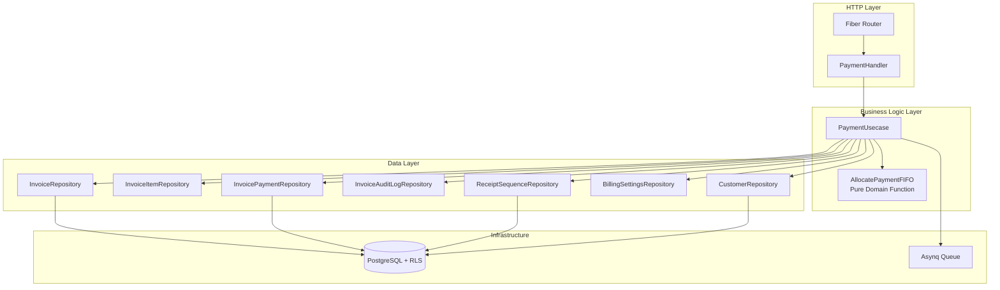
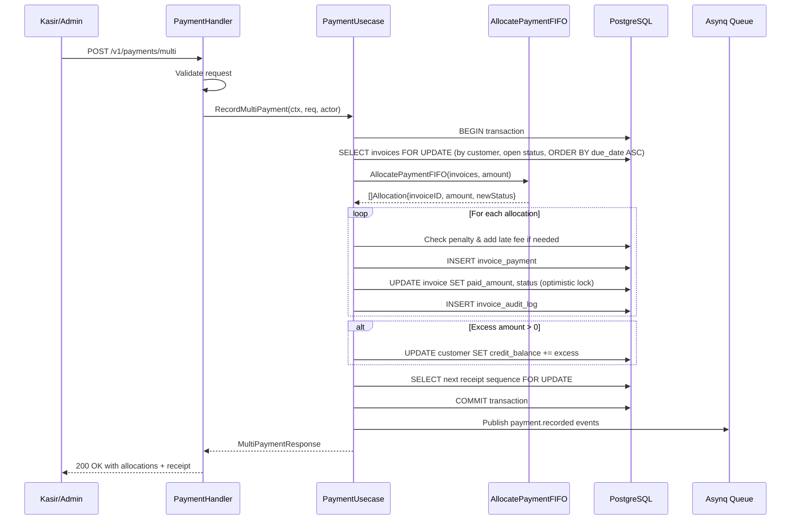
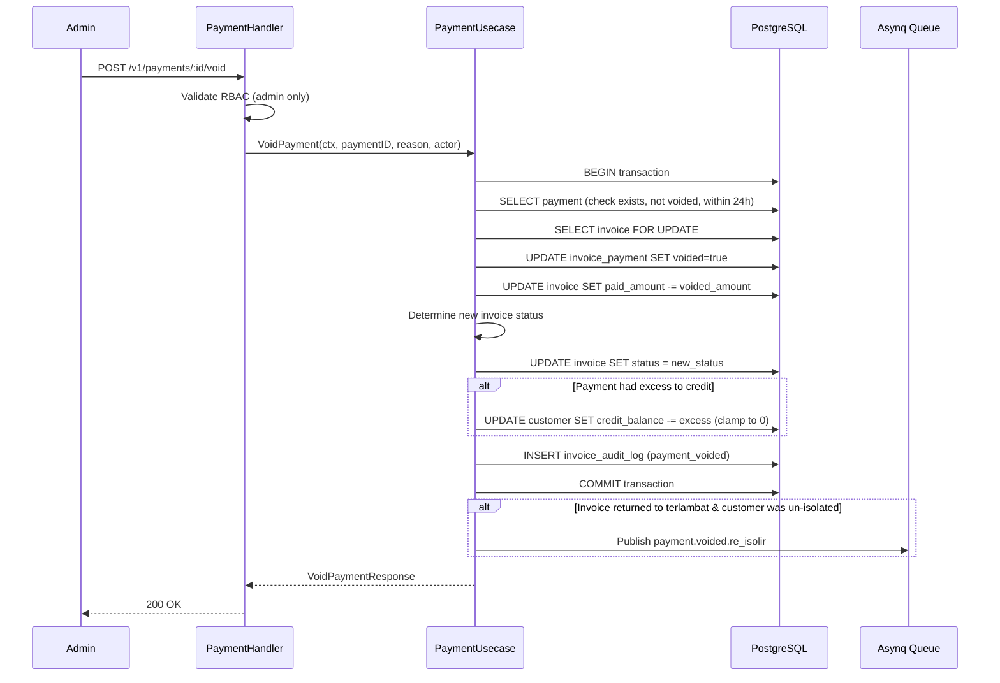
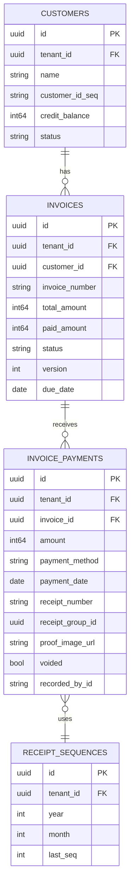

# Design Document: Manual Payment Recording

## Overview

The Manual Payment Recording module extends the ISPBoss billing-api service with a dedicated payment subsystem. While the existing `InvoiceActionUsecase.RecordPayment` handles single-invoice payment recording, this module adds: a dedicated payment list API with filtering/search, quick payment flow for cashiers, multi-invoice FIFO allocation, pay-all-arrears, receipt/kwitansi generation for thermal printers, void with time-limited rollback, bulk CSV import with duplicate detection, and payment summary statistics.

All data is tenant-scoped via PostgreSQL RLS. The module follows the same domain → repository → usecase → handler layering established by the invoice-generation module.

### Key Design Decisions

1. **Separate PaymentUsecase** — distinct from `InvoiceActionUsecase` to keep single-responsibility. The existing `RecordPayment` on `InvoiceActionUsecase` remains unchanged for backward compatibility; `PaymentUsecase` adds multi-invoice and enhanced features on top.
2. **FIFO allocation as a pure domain function** — the core allocation algorithm is a pure function (`AllocatePaymentFIFO`) that takes a sorted slice of invoices and an amount, returning allocation results. This makes it testable without database dependencies.
3. **Receipt sequence table** — same pattern as `invoice_sequences`: `SELECT FOR UPDATE` on `receipt_sequences` for atomic, gap-free numbering per tenant/month.
4. **Receipt number format `PAY-{YYYY}-{MM}-{SEQ}`** — 4-digit minimum zero-padded sequence, auto-expanding. Uses the same `zeroPadSeq` pattern but with 4-digit minimum instead of 3.
5. **Void with 24-hour time limit** — admin-only operation. Beyond 24 hours, corrections must go through credit notes (already implemented).
6. **Single DB transaction for multi-invoice** — all invoice updates, payment records, credit balance adjustments, and audit logs within one `pgxpool.Pool.Begin()` transaction with `SELECT FOR UPDATE` on invoices for concurrency safety.
7. **Monetary values as BIGINT (Rupiah)** — consistent with existing codebase. No floating point for money.
8. **Bulk CSV limit of 500 rows** — prevents memory issues and long-running transactions. Each row processed individually within the same request but with independent error handling.

## Architecture

### High-Level Architecture



### Data Flow: Multi-Invoice FIFO Payment



### Data Flow: Void Payment with Rollback



### File Structure

```
services/billing-api/
  migrations/
    000025_create_receipt_sequences.up.sql
    000025_create_receipt_sequences.down.sql
  internal/
    domain/
      receipt.go                # FormatReceiptNumber, receipt DTOs, payment event payloads
      payment.go                # AllocatePaymentFIFO pure function, payment domain types
    repository/
      receipt_sequence_repo.go  # ReceiptSequenceRepository implementation
    usecase/
      payment_usecase.go        # PaymentUsecase struct, constructor, list, summary, quick payment
      payment_multi.go          # Multi-invoice payment, pay-all, FIFO allocation orchestration
      payment_void.go           # Void with rollback logic
      payment_bulk.go           # CSV import, duplicate detection
      payment_receipt.go        # Receipt generation and retrieval
    handler/
      payment_handler.go        # All /v1/payments/* endpoints
```

## Components and Interfaces

### Domain Layer

#### FIFO Allocation — Pure Function (`domain/payment.go`)

```go
package domain

// PaymentAllocation represents a single allocation of payment to an invoice.
type PaymentAllocation struct {
    InvoiceID     string        `json:"invoice_id"`
    InvoiceNumber string        `json:"invoice_number"`
    AllocatedAmt  int64         `json:"allocated_amount"`
    NewPaidAmount int64         `json:"new_paid_amount"`
    NewStatus     InvoiceStatus `json:"new_status"`
}

// FIFOInput represents an invoice eligible for FIFO allocation.
// Invoices must be pre-sorted by due_date ASC (oldest first).
type FIFOInput struct {
    InvoiceID     string
    InvoiceNumber string
    TotalAmount   int64
    PaidAmount    int64
    Status        InvoiceStatus
}

// FIFOResult contains the result of FIFO allocation.
type FIFOResult struct {
    Allocations   []PaymentAllocation
    TotalAllocated int64
    ExcessToCredit int64
}

// AllocatePaymentFIFO distributes a payment amount across invoices in FIFO order.
// Invoices must be sorted by due_date ascending (oldest first).
// Returns allocations per invoice and any excess that goes to credit balance.
//
// Invariant: TotalAllocated + ExcessToCredit == amount
// Invariant: For each allocation, AllocatedAmt <= (TotalAmount - PaidAmount)
// Invariant: If AllocatedAmt == (TotalAmount - PaidAmount), NewStatus == lunas
// Invariant: If 0 < AllocatedAmt < (TotalAmount - PaidAmount), NewStatus == bayar_sebagian
func AllocatePaymentFIFO(invoices []FIFOInput, amount int64) FIFOResult {
    // ... pure function implementation
}
```

#### Receipt Number Formatting (`domain/receipt.go`)

```go
package domain

import "fmt"

// FormatReceiptNumber formats a receipt number from components.
// Format: PAY-{YYYY}-{MM}-{SEQ} with SEQ zero-padded to 4 digits minimum.
// Example: PAY-2026-04-0001, PAY-2026-04-10000
func FormatReceiptNumber(year, month, seq int) string {
    return fmt.Sprintf("PAY-%04d-%02d-%s", year, month, zeroPadReceiptSeq(seq))
}

// zeroPadReceiptSeq formats sequence number with zero-padding minimum 4 digits.
// If seq >= 10000, original digits are preserved without extra padding.
func zeroPadReceiptSeq(seq int) string {
    if seq < 10000 {
        return fmt.Sprintf("%04d", seq)
    }
    return fmt.Sprintf("%d", seq)
}

// ParseReceiptNumber parses a receipt number string back into components.
// Returns year, month, seq, error.
func ParseReceiptNumber(receiptNumber string) (int, int, int, error) {
    // Parse PAY-{YYYY}-{MM}-{SEQ} format
}
```

#### Payment Event Payloads (`domain/receipt.go`)

```go
// PaymentRecordedPayload is the event payload for payment.recorded.
type PaymentRecordedPayload struct {
    TenantID      string `json:"tenant_id"`
    CustomerID    string `json:"customer_id"`
    ReceiptNumber string `json:"receipt_number"`
    TotalAmount   int64  `json:"total_amount"`
    PaymentMethod string `json:"payment_method"`
    InvoiceCount  int    `json:"invoice_count"`
}

// PaymentVoidedReIsolirPayload is the event payload for payment.voided.re_isolir.
type PaymentVoidedReIsolirPayload struct {
    TenantID   string `json:"tenant_id"`
    CustomerID string `json:"customer_id"`
    InvoiceID  string `json:"invoice_id"`
    Reason     string `json:"reason"`
}
```

#### Payment Domain Errors (`domain/payment.go`)

```go
var (
    ErrPaymentNotFound       = errors.New("pembayaran tidak ditemukan")
    ErrPaymentAlreadyVoided  = errors.New("pembayaran sudah di-void")
    ErrVoidTimeLimitExceeded = errors.New("batas waktu void 24 jam terlampaui")
    ErrNoOpenInvoices        = errors.New("tidak ada invoice terbuka")
    ErrInvalidInvoiceSelection = errors.New("pilihan invoice tidak valid")
    ErrSearchTermTooShort    = errors.New("kata pencarian minimal 2 karakter")
    ErrCSVTooLarge           = errors.New("file CSV melebihi batas 500 baris")
    ErrConcurrentModification = errors.New("konflik modifikasi bersamaan")
    ErrFileTooLarge           = errors.New("file melebihi batas 5 MB")
    ErrInvalidFileFormat      = errors.New("format file tidak valid")
    ErrProofNotFound          = errors.New("bukti transfer tidak ditemukan")
)
```

### Repository Layer

#### ReceiptSequenceRepository (`domain/repository.go` — new interface)

```go
// ReceiptSequenceRepository defines data operations for the receipt_sequences table.
type ReceiptSequenceRepository interface {
    // NextSequence atomically increments and returns the next receipt sequence.
    // Creates a new row if none exists for the tenant/year/month.
    // Uses SELECT FOR UPDATE for concurrency safety.
    NextSequence(ctx context.Context, tenantID string, year, month int) (int, error)
}
```

#### Extended InvoicePaymentRepository (additions to existing interface)

```go
// Additional methods on InvoicePaymentRepository:

// GetByID retrieves a single payment by ID.
GetByID(ctx context.Context, id string) (*InvoicePayment, error)

// ListWithFilters retrieves payments with filtering, search, and pagination.
// Joins with customers and invoices for search and display fields.
ListWithFilters(ctx context.Context, params PaymentListParams) (*PaymentListResult, error)

// GetSummary retrieves aggregated payment statistics for a tenant.
GetSummary(ctx context.Context, tenantID string, timezone string, periodMonth, periodYear *int) (*PaymentSummary, error)

// FindDuplicate checks for a potential duplicate payment within the last 24 hours.
FindDuplicate(ctx context.Context, customerID string, amount int64, method string, paymentDate time.Time) (bool, error)
```

#### Extended InvoiceRepository (additions to existing interface)

```go
// Additional methods on InvoiceRepository:

// FindOpenByCustomer retrieves all open invoices for a customer, ordered by due_date ASC.
// Open = status in (belum_bayar, terlambat, bayar_sebagian).
FindOpenByCustomer(ctx context.Context, customerID string) ([]*Invoice, error)

// FindOpenByCustomerForUpdate same as FindOpenByCustomer but with SELECT FOR UPDATE.
// Must be called within a transaction.
FindOpenByCustomerForUpdate(ctx context.Context, customerID string) ([]*Invoice, error)

// GetByIDsForUpdate retrieves invoices by IDs with SELECT FOR UPDATE.
// Must be called within a transaction.
GetByIDsForUpdate(ctx context.Context, ids []string) ([]*Invoice, error)
```

#### Extended CustomerRepository (additions to existing interface)

```go
// Additional methods on CustomerRepository:

// SearchForPayment searches customers by name, customer_id_seq, or phone.
// Returns max 10 results, only aktif/isolir status.
SearchForPayment(ctx context.Context, tenantID, searchTerm string) ([]*Customer, error)
```

### Usecase Layer

#### PaymentUsecase

```go
// PaymentUsecase implements business logic for the payment module.
type PaymentUsecase struct {
    invoiceRepo     domain.InvoiceRepository
    itemRepo        domain.InvoiceItemRepository
    paymentRepo     domain.InvoicePaymentRepository
    auditRepo       domain.InvoiceAuditLogRepository
    receiptSeqRepo  domain.ReceiptSequenceRepository
    settingsRepo    domain.BillingSettingsRepository
    customerRepo    domain.CustomerRepository
    pool            *pgxpool.Pool
    queueClient     *asynq.Client
    logger          zerolog.Logger
}

func NewPaymentUsecase(
    invoiceRepo domain.InvoiceRepository,
    itemRepo domain.InvoiceItemRepository,
    paymentRepo domain.InvoicePaymentRepository,
    auditRepo domain.InvoiceAuditLogRepository,
    receiptSeqRepo domain.ReceiptSequenceRepository,
    settingsRepo domain.BillingSettingsRepository,
    customerRepo domain.CustomerRepository,
    pool *pgxpool.Pool,
    queueClient *asynq.Client,
    logger zerolog.Logger,
) *PaymentUsecase

// --- List & Summary ---
func (uc *PaymentUsecase) List(ctx context.Context, params domain.PaymentListParams) (*domain.PaymentListResult, error)
func (uc *PaymentUsecase) Summary(ctx context.Context, tenantID string, periodMonth, periodYear *int) (*domain.PaymentSummary, error)

// --- Quick Payment ---
func (uc *PaymentUsecase) SearchCustomers(ctx context.Context, tenantID, searchTerm string) ([]*domain.Customer, error)
func (uc *PaymentUsecase) GetOpenInvoices(ctx context.Context, customerID string) (*domain.OpenInvoicesResponse, error)

// --- Multi-Invoice Payment ---
func (uc *PaymentUsecase) RecordMultiPayment(ctx context.Context, req domain.MultiPaymentRequest, actor domain.ActorInfo) (*domain.MultiPaymentResponse, error)
func (uc *PaymentUsecase) PayAll(ctx context.Context, req domain.PayAllRequest, actor domain.ActorInfo) (*domain.MultiPaymentResponse, error)

// --- Receipt ---
func (uc *PaymentUsecase) GetReceipt(ctx context.Context, paymentID string) (*domain.ReceiptData, error)

// --- Void ---
func (uc *PaymentUsecase) VoidPayment(ctx context.Context, paymentID string, req domain.VoidPaymentRequest, actor domain.ActorInfo) (*domain.VoidPaymentResponse, error)

// --- Bulk Import ---
func (uc *PaymentUsecase) BulkImport(ctx context.Context, csvData []byte, actor domain.ActorInfo) (*domain.BulkImportResponse, error)

// --- Proof Image ---
func (uc *PaymentUsecase) UploadProof(ctx context.Context, paymentID string, fileData []byte, filename string) (string, error)
func (uc *PaymentUsecase) GetProof(ctx context.Context, paymentID string) ([]byte, string, error)
```

### Handler Layer

#### PaymentHandler

```go
// PaymentHandler handles all /v1/payments/* HTTP endpoints.
type PaymentHandler struct {
    paymentUsecase *usecase.PaymentUsecase
    validate       *validator.Validate
    logger         zerolog.Logger
}

func NewPaymentHandler(paymentUsecase *usecase.PaymentUsecase, logger zerolog.Logger) *PaymentHandler

// List handles GET /v1/payments
func (h *PaymentHandler) List(c *fiber.Ctx) error

// Summary handles GET /v1/payments/summary
func (h *PaymentHandler) Summary(c *fiber.Ctx) error

// SearchCustomers handles GET /v1/payments/quick/customers
func (h *PaymentHandler) SearchCustomers(c *fiber.Ctx) error

// GetOpenInvoices handles GET /v1/payments/quick/customers/:customer_id/invoices
func (h *PaymentHandler) GetOpenInvoices(c *fiber.Ctx) error

// RecordMultiPayment handles POST /v1/payments/multi
func (h *PaymentHandler) RecordMultiPayment(c *fiber.Ctx) error

// PayAll handles POST /v1/payments/pay-all
func (h *PaymentHandler) PayAll(c *fiber.Ctx) error

// GetReceipt handles GET /v1/payments/:payment_id/receipt
func (h *PaymentHandler) GetReceipt(c *fiber.Ctx) error

// VoidPayment handles POST /v1/payments/:payment_id/void
func (h *PaymentHandler) VoidPayment(c *fiber.Ctx) error

// BulkImport handles POST /v1/payments/import
func (h *PaymentHandler) BulkImport(c *fiber.Ctx) error

// UploadProof handles POST /v1/payments/:payment_id/proof
func (h *PaymentHandler) UploadProof(c *fiber.Ctx) error

// GetProof handles GET /v1/payments/:payment_id/proof
func (h *PaymentHandler) GetProof(c *fiber.Ctx) error
```

### Router Registration

New routes added to `RegisterRoutes` in `handler/router.go`:

```go
// --- Payment routes (auth + tenant + RBAC) ---
payments := api.Group("/payments")

// Routes accessible by admin + kasir (read + record payment)
paymentsReadWrite := payments.Group("")
paymentsReadWrite.Use(middleware.RBAC(domain.RBACConfig{
    AllowedRoles: []domain.UserRole{
        domain.RoleTenantAdmin, domain.RoleKasir,
    },
}))
paymentsReadWrite.Get("/", paymentHandler.List)
paymentsReadWrite.Get("/summary", paymentHandler.Summary)
paymentsReadWrite.Get("/quick/customers", paymentHandler.SearchCustomers)
paymentsReadWrite.Get("/quick/customers/:customer_id/invoices", paymentHandler.GetOpenInvoices)
paymentsReadWrite.Post("/multi", paymentHandler.RecordMultiPayment)
paymentsReadWrite.Post("/pay-all", paymentHandler.PayAll)
paymentsReadWrite.Get("/:payment_id/receipt", paymentHandler.GetReceipt)
paymentsReadWrite.Post("/:payment_id/proof", paymentHandler.UploadProof)
paymentsReadWrite.Get("/:payment_id/proof", paymentHandler.GetProof)

// Routes accessible by tenant_admin only (void, bulk import)
paymentsAdmin := payments.Group("")
paymentsAdmin.Use(middleware.RBAC(domain.RBACConfig{
    AllowedRoles: []domain.UserRole{domain.RoleTenantAdmin},
}))
paymentsAdmin.Post("/:payment_id/void", paymentHandler.VoidPayment)
paymentsAdmin.Post("/import", paymentHandler.BulkImport)
```

### Request/Response DTOs

```go
// --- Payment List ---

type PaymentListParams struct {
    TenantID      string `query:"tenant_id"`
    Page          int    `query:"page" validate:"omitempty,min=1"`
    PageSize      int    `query:"page_size" validate:"omitempty,oneof=10 25 50"`
    PaymentMethod string `query:"payment_method" validate:"omitempty,oneof=tunai transfer lainnya"`
    DateFrom      string `query:"date_from" validate:"omitempty,datetime=2006-01-02"`
    DateTo        string `query:"date_to" validate:"omitempty,datetime=2006-01-02"`
    RecordedBy    string `query:"recorded_by" validate:"omitempty,uuid"`
    Search        string `query:"search"`
    IncludeVoided bool   `query:"include_voided"`
}

type PaymentListItem struct {
    ID              string    `json:"id"`
    InvoiceID       string    `json:"invoice_id"`
    InvoiceNumber   string    `json:"invoice_number"`
    CustomerName    string    `json:"customer_name"`
    CustomerIDSeq   string    `json:"customer_id_seq"`
    Amount          int64     `json:"amount"`
    PaymentMethod   string    `json:"payment_method"`
    PaymentDate     time.Time `json:"payment_date"`
    ReferenceNumber string    `json:"reference_number,omitempty"`
    ReceiptNumber   string    `json:"receipt_number,omitempty"`
    RecordedByName  string    `json:"recorded_by_name"`
    Voided          bool      `json:"voided"`
    VoidReason      string    `json:"void_reason,omitempty"`
    ProofImageURL   string    `json:"proof_image_url,omitempty"`
    CreatedAt       time.Time `json:"created_at"`
}

type PaymentListResult struct {
    Data       []PaymentListItem `json:"data"`
    Pagination PaginationMeta    `json:"pagination"`
}

// --- Payment Summary ---

type PaymentSummary struct {
    Today     PaymentSummaryStat            `json:"today"`
    ThisMonth PaymentSummaryStat            `json:"this_month"`
    ByMethod  map[string]PaymentSummaryStat `json:"by_method"`
}

type PaymentSummaryStat struct {
    Count       int64 `json:"count"`
    TotalAmount int64 `json:"total_amount"`
}

// --- Quick Payment ---

type OpenInvoicesResponse struct {
    Invoices     []OpenInvoiceItem `json:"invoices"`
    TotalArrears int64             `json:"total_arrears"`
}

type OpenInvoiceItem struct {
    ID              string        `json:"id"`
    InvoiceNumber   string        `json:"invoice_number"`
    PeriodMonth     int           `json:"period_month"`
    PeriodYear      int           `json:"period_year"`
    TotalAmount     int64         `json:"total_amount"`
    PaidAmount      int64         `json:"paid_amount"`
    RemainingAmount int64         `json:"remaining_amount"`
    Status          InvoiceStatus `json:"status"`
    DueDate         time.Time     `json:"due_date"`
}

// --- Multi-Invoice Payment ---

type MultiPaymentRequest struct {
    CustomerID      string   `json:"customer_id" validate:"required,uuid"`
    Amount          int64    `json:"amount" validate:"required,gt=0"`
    PaymentMethod   string   `json:"payment_method" validate:"required,oneof=tunai transfer lainnya"`
    PaymentDate     string   `json:"payment_date" validate:"required,datetime=2006-01-02"`
    ReferenceNumber string   `json:"reference_number" validate:"omitempty"`
    Notes           string   `json:"notes" validate:"omitempty,max=500"`
    InvoiceIDs      []string `json:"invoice_ids" validate:"omitempty,dive,uuid"`
}

type MultiPaymentResponse struct {
    Allocations    []PaymentAllocation `json:"allocations"`
    TotalAllocated int64               `json:"total_allocated"`
    ExcessToCredit int64               `json:"excess_to_credit"`
    ReceiptNumber  string              `json:"receipt_number"`
    ReceiptID      string              `json:"receipt_id"`
}

// --- Pay All ---

type PayAllRequest struct {
    CustomerID      string `json:"customer_id" validate:"required,uuid"`
    PaymentMethod   string `json:"payment_method" validate:"required,oneof=tunai transfer lainnya"`
    PaymentDate     string `json:"payment_date" validate:"required,datetime=2006-01-02"`
    ReferenceNumber string `json:"reference_number" validate:"omitempty"`
    Notes           string `json:"notes" validate:"omitempty,max=500"`
}

// --- Void Payment ---

type VoidPaymentRequest struct {
    Reason string `json:"reason" validate:"required,min=5,max=500"`
}

type VoidPaymentResponse struct {
    PaymentID       string        `json:"payment_id"`
    InvoiceID       string        `json:"invoice_id"`
    VoidedAmount    int64         `json:"voided_amount"`
    NewPaidAmount   int64         `json:"new_paid_amount"`
    NewInvoiceStatus InvoiceStatus `json:"new_invoice_status"`
    CreditReduced   int64         `json:"credit_reduced"`
}

// --- Receipt ---

type ReceiptData struct {
    ReceiptNumber  string              `json:"receipt_number"`
    TenantName     string              `json:"tenant_name"`
    PaymentDate    time.Time           `json:"payment_date"`
    CustomerName   string              `json:"customer_name"`
    CustomerIDSeq  string              `json:"customer_id_seq"`
    Invoices       []ReceiptInvoice    `json:"invoices"`
    TotalAmount    int64               `json:"total_amount"`
    PaymentMethod  string              `json:"payment_method"`
    RecordedByName string              `json:"recorded_by_name"`
    Voided         bool                `json:"voided"`
    VoidReason     string              `json:"void_reason,omitempty"`
}

type ReceiptInvoice struct {
    InvoiceNumber string `json:"invoice_number"`
    Amount        int64  `json:"amount"`
}

// --- Bulk Import ---

type BulkImportResponse struct {
    TotalRows        int                `json:"total_rows"`
    SuccessCount     int                `json:"success_count"`
    FailureCount     int                `json:"failure_count"`
    DuplicatesSkipped int              `json:"duplicates_skipped"`
    Results          []BulkImportResult `json:"results"`
}

type BulkImportResult struct {
    Row           int    `json:"row"`
    Status        string `json:"status"` // "success", "failed", "skipped"
    ReceiptNumber string `json:"receipt_number,omitempty"`
    Reason        string `json:"reason,omitempty"`
}
```

## Data Models

### New Table: `receipt_sequences`

```sql
-- 000025_create_receipt_sequences.up.sql
CREATE TABLE receipt_sequences (
    id          UUID PRIMARY KEY DEFAULT gen_random_uuid(),
    tenant_id   UUID NOT NULL REFERENCES tenants(id),
    year        INTEGER NOT NULL,
    month       INTEGER NOT NULL,
    last_seq    INTEGER NOT NULL DEFAULT 0,
    created_at  TIMESTAMPTZ NOT NULL DEFAULT NOW(),
    updated_at  TIMESTAMPTZ NOT NULL DEFAULT NOW(),
    UNIQUE (tenant_id, year, month)
);

-- Enable RLS
ALTER TABLE receipt_sequences ENABLE ROW LEVEL SECURITY;

CREATE POLICY receipt_sequences_tenant_policy ON receipt_sequences
    USING (tenant_id = current_setting('app.tenant_id')::uuid);

-- Index for fast lookup
CREATE INDEX idx_receipt_sequences_tenant_year_month
    ON receipt_sequences (tenant_id, year, month);
```

```sql
-- 000025_create_receipt_sequences.down.sql
DROP TABLE IF EXISTS receipt_sequences;
```

### Extended `invoice_payments` Table

The existing `invoice_payments` table gains a new column for receipt tracking:

```sql
-- Add receipt_number column to invoice_payments
ALTER TABLE invoice_payments ADD COLUMN receipt_number VARCHAR(50);
ALTER TABLE invoice_payments ADD COLUMN receipt_group_id UUID;
ALTER TABLE invoice_payments ADD COLUMN proof_image_url VARCHAR(500);
-- receipt_group_id links multiple invoice_payment rows from a single multi-invoice payment
-- proof_image_url stores the path/URL to the uploaded proof of transfer image
```

### New Indexes for Payment Queries

```sql
-- Index for payment list filtering by date range
CREATE INDEX idx_invoice_payments_payment_date
    ON invoice_payments (tenant_id, payment_date DESC, created_at DESC)
    WHERE voided = false;

-- Index for payment list filtering by method
CREATE INDEX idx_invoice_payments_method
    ON invoice_payments (tenant_id, payment_method)
    WHERE voided = false;

-- Index for duplicate detection
CREATE INDEX idx_invoice_payments_duplicate_check
    ON invoice_payments (tenant_id, invoice_id, amount, payment_method, payment_date)
    WHERE voided = false;

-- Index for customer search in quick payment
CREATE INDEX idx_customers_search_payment
    ON customers USING gin (
        (name || ' ' || customer_id_seq || ' ' || phone) gin_trgm_ops
    )
    WHERE status IN ('aktif', 'isolir') AND deleted_at IS NULL;

-- Index for open invoices by customer
CREATE INDEX idx_invoices_open_by_customer
    ON invoices (customer_id, due_date ASC)
    WHERE status IN ('belum_bayar', 'terlambat', 'bayar_sebagian');
```

### Entity Relationship




## Correctness Properties

*A property is a characteristic or behavior that should hold true across all valid executions of a system — essentially, a formal statement about what the system should do. Properties serve as the bridge between human-readable specifications and machine-verifiable correctness guarantees.*

### Property 1: FIFO Allocation Sum Invariant

*For any* list of open invoices (each with `total_amount > 0` and `paid_amount >= 0` and `paid_amount < total_amount`) and *for any* positive payment amount, after calling `AllocatePaymentFIFO(invoices, amount)`, the sum of all `allocated_amount` values plus `excess_to_credit` SHALL equal the original payment amount exactly.

**Validates: Requirements 5.8, 16.5**

### Property 2: FIFO Allocation Status Determination

*For any* invoice in the FIFO allocation result:
- If `allocated_amount` equals the invoice's remaining amount (`total_amount - paid_amount`), then `new_status` SHALL be `lunas`
- If `allocated_amount` is greater than 0 but less than the invoice's remaining amount, then `new_status` SHALL be `bayar_sebagian`
- If `allocated_amount` is 0, the invoice SHALL not appear in the allocations list

**Validates: Requirements 5.6, 5.7**

### Property 3: FIFO Allocation Ordering

*For any* list of open invoices sorted by `due_date` ascending and *for any* positive payment amount, the `AllocatePaymentFIFO` function SHALL allocate the full remaining amount to each invoice before moving to the next — meaning if invoice at index `i` has `allocated_amount < remaining_amount`, then all invoices at index `j > i` SHALL have `allocated_amount == 0`.

**Validates: Requirements 5.1, 5.5**

### Property 4: Pay-All Clears All Invoices

*For any* set of open invoices for a customer, when the payment amount equals the sum of all remaining amounts (total_arrears), the FIFO allocation SHALL result in every invoice having `new_status == lunas` and `excess_to_credit == 0`.

**Validates: Requirements 6.1, 6.4**

### Property 5: Receipt Number Format Round-Trip

*For any* valid year (2000–2099), month (1–12), and sequence (1–99999), `FormatReceiptNumber(year, month, seq)` SHALL produce a string in format `PAY-{YYYY}-{MM}-{SEQ}` where parsing the components back yields the original year, month, and sequence values. The SEQ part SHALL be zero-padded to a minimum of 4 digits, and the year SHALL be 4 digits, and the month SHALL be 2 digits.

**Validates: Requirements 7.4, 14.1, 14.2, 14.3**

### Property 6: Receipt Sequence Monotonicity

*For any* sequence of receipt number generations within the same tenant, year, and month, each successive sequence number SHALL be strictly greater than the previous one (i.e., `seq_n+1 > seq_n` for all n).

**Validates: Requirements 8.6**

### Property 7: Void Rollback Paid Amount

*For any* invoice with a recorded payment, when that payment is voided, the invoice's new `paid_amount` SHALL equal the old `paid_amount` minus the voided payment's amount.

**Validates: Requirements 11.1**

### Property 8: Void Status Determination

*For any* invoice after a payment void:
- If the new `paid_amount` is 0 and `due_date` is in the future, the invoice status SHALL be `belum_bayar`
- If the new `paid_amount` is 0 and `due_date` is in the past, the invoice status SHALL be `terlambat`
- If the new `paid_amount` is greater than 0 but less than `total_amount`, the invoice status SHALL be `bayar_sebagian`

**Validates: Requirements 11.2, 11.3, 11.4**

### Property 9: Void Credit Balance Rollback (Clamped)

*For any* voided payment that had previously caused an overpayment (excess added to `credit_balance`), the customer's `credit_balance` SHALL be reduced by the excess amount, clamped to a minimum of 0 (never negative).

**Validates: Requirements 11.5, 11.6**

### Property 10: Remaining Amount and Total Arrears Calculation

*For any* set of open invoices, each invoice's `remaining_amount` SHALL equal `total_amount - paid_amount`, and the `total_arrears` SHALL equal the sum of all individual `remaining_amount` values.

**Validates: Requirements 4.2, 4.3**

## Error Handling

### HTTP Error Codes

| Scenario | HTTP Status | Error Code | Message |
|---|---|---|---|
| Payment not found / wrong tenant | 404 | `PAYMENT_NOT_FOUND` | Pembayaran tidak ditemukan |
| Customer not found / wrong tenant | 404 | `CUSTOMER_NOT_FOUND` | Pelanggan tidak ditemukan |
| Invoice not found / wrong tenant | 404 | `INVOICE_NOT_FOUND` | Invoice tidak ditemukan |
| Search term < 2 characters | 400 | `SEARCH_TERM_TOO_SHORT` | Kata pencarian minimal 2 karakter |
| CSV exceeds 500 rows | 400 | `CSV_TOO_LARGE` | File CSV melebihi batas 500 baris |
| Proof image exceeds 5 MB | 400 | `FILE_TOO_LARGE` | File melebihi batas 5 MB |
| Invalid image format | 400 | `INVALID_FILE_FORMAT` | Format file tidak valid (harus JPEG, PNG, atau WebP) |
| Proof image not found | 404 | `PROOF_NOT_FOUND` | Bukti transfer tidak ditemukan |
| Validation error (missing/invalid fields) | 400 | `VALIDATION_ERROR` | Validasi gagal (with field details) |
| Non-admin attempts void | 403 | `FORBIDDEN` | Hanya admin yang dapat membatalkan pembayaran |
| No open invoices for pay-all | 422 | `NO_OPEN_INVOICES` | Tidak ada invoice terbuka |
| Invalid invoice selection (wrong customer, lunas, batal) | 422 | `INVALID_INVOICE_SELECTION` | Pilihan invoice tidak valid |
| Payment already voided | 422 | `PAYMENT_ALREADY_VOIDED` | Pembayaran sudah di-void |
| Void time limit exceeded (>24h) | 422 | `VOID_TIME_LIMIT_EXCEEDED` | Batas waktu void 24 jam terlampaui |
| CSV row validation errors | 422 | `CSV_VALIDATION_ERROR` | Validasi CSV gagal (with per-row details) |
| Concurrent modification (version conflict after retry) | 409 | `CONCURRENT_MODIFICATION` | Konflik modifikasi bersamaan, coba lagi |
| Internal server error | 500 | `INTERNAL_ERROR` | Terjadi kesalahan internal |

### Error Handling Strategy

1. **Validation-first**: All input validation happens before any database operations. For bulk CSV, all rows are validated before any processing begins.
2. **Transaction rollback**: Multi-invoice payments use a single DB transaction. Any failure rolls back all changes (atomicity).
3. **Optimistic locking with retry**: Version conflicts trigger one automatic retry. If the retry also fails, return 409 to the client.
4. **Non-blocking audit logs**: Audit log write failures are logged but don't fail the main operation (same pattern as existing `InvoiceActionUsecase`).
5. **Non-blocking event publishing**: Event publish failures are logged but don't fail the main operation.
6. **Credit balance clamping**: When voiding a payment would make credit_balance negative (credit already spent), clamp to 0 and log a warning for admin review rather than failing the void.

### Domain Error Mapping

The `PaymentHandler` maps domain errors to HTTP responses using the same pattern as `InvoiceActionHandler.mapActionError`:

```go
func (h *PaymentHandler) mapPaymentError(c *fiber.Ctx, err error) error {
    switch {
    case errors.Is(err, domain.ErrPaymentNotFound):
        return domain.ErrorResponse(c, fiber.StatusNotFound, "PAYMENT_NOT_FOUND", err.Error())
    case errors.Is(err, domain.ErrCustomerNotFound):
        return domain.ErrorResponse(c, fiber.StatusNotFound, "CUSTOMER_NOT_FOUND", err.Error())
    case errors.Is(err, domain.ErrInvoiceNotFound):
        return domain.ErrorResponse(c, fiber.StatusNotFound, "INVOICE_NOT_FOUND", err.Error())
    case errors.Is(err, domain.ErrPaymentAlreadyVoided):
        return domain.ErrorResponse(c, fiber.StatusUnprocessableEntity, "PAYMENT_ALREADY_VOIDED", err.Error())
    case errors.Is(err, domain.ErrVoidTimeLimitExceeded):
        return domain.ErrorResponse(c, fiber.StatusUnprocessableEntity, "VOID_TIME_LIMIT_EXCEEDED", err.Error())
    case errors.Is(err, domain.ErrNoOpenInvoices):
        return domain.ErrorResponse(c, fiber.StatusUnprocessableEntity, "NO_OPEN_INVOICES", err.Error())
    case errors.Is(err, domain.ErrInvalidInvoiceSelection):
        return domain.ErrorResponse(c, fiber.StatusUnprocessableEntity, "INVALID_INVOICE_SELECTION", err.Error())
    case errors.Is(err, domain.ErrSearchTermTooShort):
        return domain.ErrorResponse(c, fiber.StatusBadRequest, "SEARCH_TERM_TOO_SHORT", err.Error())
    case errors.Is(err, domain.ErrCSVTooLarge):
        return domain.ErrorResponse(c, fiber.StatusBadRequest, "CSV_TOO_LARGE", err.Error())
    case errors.Is(err, domain.ErrConcurrentModification):
        return domain.ErrorResponse(c, fiber.StatusConflict, "CONCURRENT_MODIFICATION", err.Error())
    case errors.Is(err, domain.ErrFileTooLarge):
        return domain.ErrorResponse(c, fiber.StatusBadRequest, "FILE_TOO_LARGE", err.Error())
    case errors.Is(err, domain.ErrInvalidFileFormat):
        return domain.ErrorResponse(c, fiber.StatusBadRequest, "INVALID_FILE_FORMAT", err.Error())
    case errors.Is(err, domain.ErrProofNotFound):
        return domain.ErrorResponse(c, fiber.StatusNotFound, "PROOF_NOT_FOUND", err.Error())
    default:
        h.logger.Error().Err(err).Msg("internal error pada payment handler")
        return domain.ErrorResponse(c, fiber.StatusInternalServerError, "INTERNAL_ERROR", "terjadi kesalahan internal")
    }
}
```

## Testing Strategy

### Property-Based Testing

The feature contains several pure functions and invariants well-suited for property-based testing. We use the **`pgregory.net/rapid`** library (already used in the codebase for `invoice_number_test.go`).

**Configuration**: Minimum 100 iterations per property test.

**Property tests to implement:**

| Property | Target Function | Tag |
|---|---|---|
| Property 1: FIFO Allocation Sum Invariant | `domain.AllocatePaymentFIFO` | `Feature: payment-manual, Property 1: FIFO allocation sum invariant` |
| Property 2: FIFO Allocation Status Determination | `domain.AllocatePaymentFIFO` | `Feature: payment-manual, Property 2: FIFO allocation status determination` |
| Property 3: FIFO Allocation Ordering | `domain.AllocatePaymentFIFO` | `Feature: payment-manual, Property 3: FIFO allocation ordering` |
| Property 4: Pay-All Clears All Invoices | `domain.AllocatePaymentFIFO` (with amount = total_arrears) | `Feature: payment-manual, Property 4: Pay-all clears all invoices` |
| Property 5: Receipt Number Format Round-Trip | `domain.FormatReceiptNumber` / `domain.ParseReceiptNumber` | `Feature: payment-manual, Property 5: Receipt number format round-trip` |
| Property 8: Void Status Determination | `domain.DeterminePostVoidStatus` | `Feature: payment-manual, Property 8: Void status determination` |
| Property 10: Remaining Amount and Total Arrears | `domain.CalculateArrears` | `Feature: payment-manual, Property 10: Remaining amount and total arrears` |

### Unit Tests (Example-Based)

| Area | Test Cases |
|---|---|
| Input validation | Missing required fields, invalid payment_method, invalid date format, amount <= 0 |
| Search term validation | Empty string, 1 character → 400, 2+ characters → OK |
| CSV parsing | Valid CSV, missing columns, invalid values, empty file, >500 rows |
| Duplicate detection | Exact match within 24h → skip, same but >24h ago → process, different amount → process |
| Void time limit | Payment at 23h59m → allowed, at 24h01m → rejected |
| RBAC | Kasir cannot void, admin can void, kasir can record payment |
| Receipt data structure | All required fields present in receipt JSON |
| Pay-all with no invoices | Returns 422 NO_OPEN_INVOICES |
| Invoice selection validation | Invoice belongs to different customer → 422, invoice already lunas → 422 |

### Integration Tests

| Area | Test Cases |
|---|---|
| Payment list with filters | Filter by method, date range, recorded_by, search term |
| Payment summary aggregation | Verify today/month/by_method calculations with known data |
| Multi-invoice payment end-to-end | Record payment, verify allocations, verify invoice statuses, verify audit logs |
| Void end-to-end | Record payment → void → verify rollback of invoice status and credit balance |
| Bulk import end-to-end | Upload valid CSV → verify all payments processed with receipts |
| Concurrent payment | Two simultaneous payments → one succeeds, one retries or gets 409 |
| Receipt sequence atomicity | Concurrent receipt generation → no gaps, no duplicates |

### Test File Structure

```
services/billing-api/internal/
  domain/
    payment_test.go           # Property tests for AllocatePaymentFIFO, DeterminePostVoidStatus
    receipt_test.go           # Property test for FormatReceiptNumber round-trip
  usecase/
    payment_usecase_test.go   # Unit tests with mocked repositories
  handler/
    payment_handler_test.go   # HTTP handler tests with mocked usecase
```
