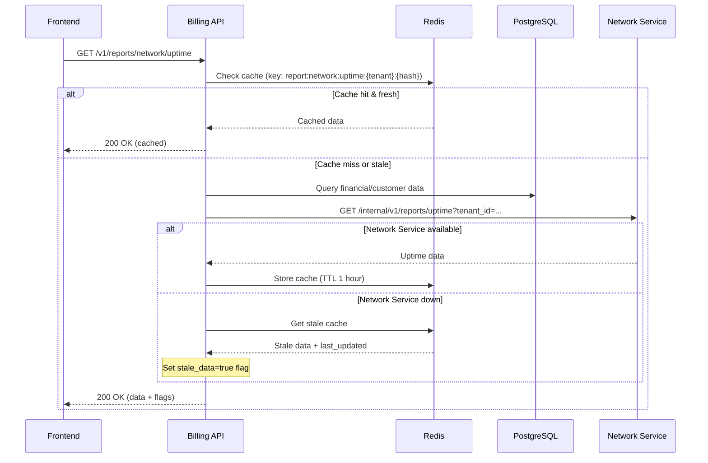
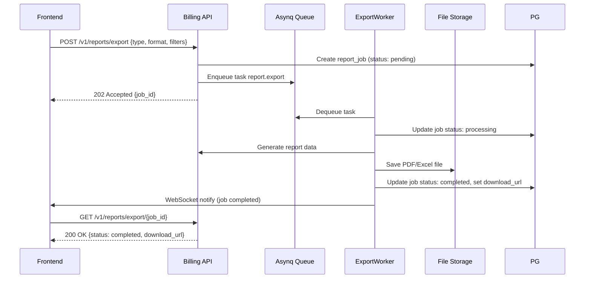

# Design Document — Reporting & Analytics

## Overview

Dokumen ini mendeskripsikan desain teknis untuk **Reporting & Analytics** di platform ISPBoss. Modul ini mengagregasi data dari seluruh modul lain (pelanggan, billing, paket, MikroTik, OLT, notifikasi) dan menyajikannya dalam bentuk grafik, tabel, dan ringkasan yang actionable untuk membantu pemilik ISP mengambil keputusan bisnis dan operasional.

Reporting & Analytics terdiri dari dua komponen utama:
- **Backend** (`services/billing-api`): REST API di bawah prefix `/v1/reports/*` dan `/v1/expenses/*` untuk generate laporan, aggregasi data, export, jadwal otomatis, pengeluaran, target KPI, forecasting, dan custom report builder
- **Frontend** (`apps/web`): Halaman laporan interaktif di route `/reports` dengan 4 kategori tab (Keuangan, Pelanggan, Jaringan, Operasional), filter global, grafik, perbandingan periode, forecasting, custom report builder, dan dashboard widget

Desain mengikuti arsitektur domain-driven yang sudah ada: **domain → repository → usecase → handler**, dengan sqlc untuk query generation, Fiber v2 untuk HTTP, asynq untuk background job, zerolog untuk logging, dan Redis untuk caching. Data jaringan (uptime, traffic, signal) diambil dari `network-service` via internal HTTP call. Modul dirancang untuk **graceful degradation** — laporan tetap berfungsi meskipun beberapa modul tidak aktif atau service sedang down.

### Keputusan Teknis Utama

| Keputusan | Pilihan | Alasan |
|---|---|---|
| Lokasi backend | `services/billing-api` | Mayoritas data laporan berasal dari billing (invoice, payment, customer). Menghindari service baru untuk mengurangi kompleksitas |
| Data jaringan | Internal HTTP call ke `network-service` | Loose coupling, network-service sudah punya data uptime/traffic/signal |
| Caching | Redis dengan TTL 5 menit (dashboard) dan 1 jam (network data) | Fast response untuk dashboard widget, toleransi stale data untuk network |
| Export PDF/Excel | Async via asynq background job | File generation bisa lambat, tidak boleh block HTTP request |
| Export CSV | Synchronous response | CSV ringan, bisa langsung stream ke client |
| Jadwal laporan | Asynq scheduler + cron expression | Konsisten dengan pattern cron yang sudah ada (invoice, voucher expiry) |
| Forecasting | Simple linear regression (pure function) | Testable, deterministic, tidak perlu ML library |
| Chart library (FE) | Recharts | React-native, composable, TypeScript support, lightweight |
| PBT library | `pgregory.net/rapid` | Sudah dipakai di codebase existing |
| Pengeluaran | Tabel terpisah `expenses` + `expense_categories` | Sederhana, ISPBoss bukan software akuntansi |
| Custom report | Max 3 metrik + 2 dimensi | Menjaga keterbacaan dan performa query |
| Comparison | Dedicated endpoint `/v1/reports/comparison` | Reusable untuk semua tipe perbandingan (MoM, YoY, QoQ, custom) |

## Architecture

### Layer Architecture

```mermaid
graph TB
    subgraph "Frontend - apps/web"
        RP[ReportPage<br/>/reports]
        FB[FilterBar<br/>Periode, Area, Paket, Router]
        FT[FinancialTab<br/>Pendapatan, Aging, Pembayaran, Voucher, Laba Rugi]
        CT[CustomerTab<br/>Pertumbuhan, Distribusi, Churn]
        NT[NetworkTab<br/>Uptime, Traffic, Signal, Kapasitas]
        OT[OperationalTab<br/>Aktivitas, Notifikasi, Sync]
        CV[ComparisonView<br/>Side-by-side delta + insight]
        FV[ForecastView<br/>Proyeksi 3 bulan]
        CRB[CustomReportBuilder<br/>Metrik + Dimensi picker]
        EP[ExpensePage<br/>/expenses]
        DW[DashboardWidget<br/>Metrik kunci di /]
        Charts[ChartComponents<br/>Recharts: Bar, Line, Pie, Area]
    end

    subgraph "HTTP Layer - handler"
        RH[ReportHandler<br/>GET /v1/reports/*]
        EH[ExpenseHandler<br/>CRUD /v1/expenses/*]
        ExH[ExportHandler<br/>POST /v1/reports/export]
        SH[ScheduleHandler<br/>CRUD /v1/reports/schedules]
        KH[KPIHandler<br/>GET/PUT /v1/reports/kpi-targets]
        FCH[ForecastHandler<br/>GET /v1/reports/forecast]
        CMH[ComparisonHandler<br/>GET /v1/reports/comparison]
        CRH[CustomReportHandler<br/>POST /v1/reports/custom/*]
        DBH[DashboardHandler<br/>GET /v1/reports/dashboard]
        MW[Auth + Tenant + RBAC Middleware]
    end

    subgraph "Business Logic - usecase"
        RM[ReportManager<br/>Financial, Customer, Network, Operational reports]
        EM[ExpenseManager<br/>Expense CRUD + categories]
        SM[ScheduleManager<br/>Schedule lifecycle]
        FE[ForecastEngine<br/>Linear regression]
        CE[ComparisonEngine<br/>Period comparison + insights]
        CRE[CustomReportBuilder<br/>Dynamic query builder]
        DC[DashboardCache<br/>Redis cache manager]
    end

    subgraph "Domain Layer"
        EX[Expense entity]
        EC[ExpenseCategory entity]
        KT[KPITarget entity]
        RS[ReportSchedule entity]
        RJ[ReportJob entity]
        CRT[CustomReportTemplate entity]
        DTO[Report DTOs<br/>Revenue, Aging, Growth, etc.]
        LR[LinearRegression<br/>Pure function]
        INS[InsightGenerator<br/>Pure function]
    end

    subgraph "Infrastructure - repository"
        ERR[ExpenseRepo - sqlc]
        ECR[ExpenseCategoryRepo - sqlc]
        KTR[KPITargetRepo - sqlc]
        RSR[ReportScheduleRepo - sqlc]
        RJR[ReportJobRepo - sqlc]
        CRTR[CustomReportTemplateRepo - sqlc]
        RAR[ReportAggregationRepo - sqlc<br/>Complex SQL aggregations]
    end

    subgraph "Background Workers"
        EW[ExportWorker<br/>PDF/Excel generation]
        SW[ScheduleWorker<br/>Cron-based report generation]
        REW[RecurringExpenseWorker<br/>Auto-create recurring expenses]
    end

    subgraph "External Services"
        NS[Network Service<br/>Uptime, Traffic, Signal data]
        RD[Redis<br/>Dashboard cache, report cache]
        PG[PostgreSQL<br/>All report data]
    end

    RP --> FB
    RP --> FT & CT & NT & OT
    RP --> CV & FV & CRB
    FT & CT & NT & OT --> Charts

    RH --> RM
    EH --> EM
    ExH --> RM
    SH --> SM
    KH --> RM
    FCH --> FE
    CMH --> CE
    CRH --> CRE
    DBH --> DC

    RM --> RAR & ERR & KTR
    RM --> NS
    EM --> ERR & ECR
    SM --> RSR & RJR
    FE --> RAR
    CE --> RAR & KTR
    CRE --> RAR & CRTR
    DC --> RD & RAR

    EW --> RM
    SW --> SM & RM
    REW --> EM

```



### Alur Data Cross-Service



### Alur Export Async



## Components and Interfaces

### Backend — Domain Entities (services/billing-api/internal/domain/)

#### report.go — Report DTOs dan Types

```go
package domain

import "time"

// --- Report Filter ---

// ReportFilter berisi parameter filter global untuk semua laporan.
type ReportFilter struct {
    PeriodStart  time.Time `json:"period_start"`
    PeriodEnd    time.Time `json:"period_end"`
    CompareStart *time.Time `json:"compare_start,omitempty"`
    CompareEnd   *time.Time `json:"compare_end,omitempty"`
    AreaID       string     `json:"area_id,omitempty"`
    PackageID    string     `json:"package_id,omitempty"`
    RouterID     string     `json:"router_id,omitempty"`
}

// --- Revenue Report ---

// RevenueSource berisi breakdown pendapatan per sumber.
type RevenueSource struct {
    MonthlySubscription int64 `json:"monthly_subscription"`
    VoucherSales        int64 `json:"voucher_sales"`
    InstallationFees    int64 `json:"installation_fees"`
    LateFees            int64 `json:"late_fees"`
    Other               int64 `json:"other"`
    Total               int64 `json:"total"`
}

// RevenueDelta berisi delta antara dua periode.
type RevenueDelta struct {
    Absolute   int64   `json:"absolute"`
    Percentage float64 `json:"percentage"`
}

// MonthlyRevenueTrend berisi data trend pendapatan per bulan.
type MonthlyRevenueTrend struct {
    Month               string `json:"month"` // format: "2006-01"
    TotalRevenue        int64  `json:"total_revenue"`
    MonthlySubscription int64  `json:"monthly_subscription"`
    VoucherSales        int64  `json:"voucher_sales"`
    OtherRevenue        int64  `json:"other_revenue"`
}

// RevenueReport berisi laporan ringkasan pendapatan.
type RevenueReport struct {
    Current    RevenueSource       `json:"current"`
    Comparison *RevenueSource      `json:"comparison,omitempty"`
    Delta      map[string]RevenueDelta `json:"delta,omitempty"`
    Trend      []MonthlyRevenueTrend   `json:"trend"`
    KPITarget  *int64              `json:"kpi_target,omitempty"`
    KPIProgress *float64           `json:"kpi_progress,omitempty"`
}

// --- Aging Report ---

// AgingBucket berisi data per bucket umur piutang.
type AgingBucket struct {
    Label         string `json:"label"`
    TotalAmount   int64  `json:"total_amount"`
    CustomerCount int    `json:"customer_count"`
}

// TopDebtor berisi data debitur terbesar.
type TopDebtor struct {
    CustomerID       string `json:"customer_id"`
    CustomerName     string `json:"customer_name"`
    TotalOutstanding int64  `json:"total_outstanding"`
    MonthsOverdue    int    `json:"months_overdue"`
}

// ReceivablesTrend berisi data trend piutang per bulan.
type ReceivablesTrend struct {
    Month            string `json:"month"`
    TotalOutstanding int64  `json:"total_outstanding"`
}

// AgingReport berisi laporan piutang/aging.
type AgingReport struct {
    Buckets          []AgingBucket    `json:"buckets"`
    TotalOutstanding int64            `json:"total_outstanding"`
    CollectionRate   float64          `json:"collection_rate"`
    AvgDaysToPay     float64          `json:"avg_days_to_pay"`
    TopDebtors       []TopDebtor      `json:"top_debtors"`
    Trend            []ReceivablesTrend `json:"trend"`
    KPITarget        *float64         `json:"kpi_target,omitempty"`
}

// --- Payment Distribution ---

// PaymentMethodBreakdown berisi distribusi per metode pembayaran.
type PaymentMethodBreakdown struct {
    MethodName       string  `json:"method_name"`
    TotalAmount      int64   `json:"total_amount"`
    TransactionCount int     `json:"transaction_count"`
    Percentage       float64 `json:"percentage"`
}

// DailyPayment berisi data pembayaran harian.
type DailyPayment struct {
    Date             string `json:"date"` // format: "2006-01-02"
    TotalAmount      int64  `json:"total_amount"`
    TransactionCount int    `json:"transaction_count"`
}

// PaymentReport berisi laporan distribusi pembayaran.
type PaymentReport struct {
    Methods         []PaymentMethodBreakdown `json:"methods"`
    DailyPayments   []DailyPayment           `json:"daily_payments"`
    PeakPaymentDate string                   `json:"peak_payment_date"`
    PeakAmount      int64                    `json:"peak_amount"`
}

// --- Voucher Revenue ---

// VoucherByPackage berisi penjualan voucher per paket.
type VoucherByPackage struct {
    PackageName  string  `json:"package_name"`
    TotalRevenue int64   `json:"total_revenue"`
    VoucherCount int     `json:"voucher_count"`
    Percentage   float64 `json:"percentage"`
}

// VoucherByReseller berisi penjualan voucher per reseller.
type VoucherByReseller struct {
    ResellerName   string `json:"reseller_name"`
    TotalRevenue   int64  `json:"total_revenue"`
    VoucherCount   int    `json:"voucher_count"`
    ResellerMargin int64  `json:"reseller_margin"`
}

// VoucherRevenueReport berisi laporan pendapatan voucher.
type VoucherRevenueReport struct {
    TotalRevenue        int64              `json:"total_revenue"`
    TotalVoucherCount   int                `json:"total_voucher_count"`
    ByPackage           []VoucherByPackage `json:"by_package"`
    ByReseller          []VoucherByReseller `json:"by_reseller"`
    TotalResellerMargin int64              `json:"total_reseller_margin"`
}

// --- Profit Loss ---

// ProfitLossLineItem berisi satu baris item laba rugi.
type ProfitLossLineItem struct {
    Label  string `json:"label"`
    Amount int64  `json:"amount"`
}

// ProfitLossReport berisi laporan laba rugi sederhana.
type ProfitLossReport struct {
    RevenueItems  []ProfitLossLineItem `json:"revenue_items"`
    TotalRevenue  int64                `json:"total_revenue"`
    ExpenseItems  []ProfitLossLineItem `json:"expense_items"`
    TotalExpenses int64                `json:"total_expenses"`
    NetProfit     int64                `json:"net_profit"`
    ProfitMargin  float64              `json:"profit_margin"`
    Comparison    *ProfitLossReport    `json:"comparison,omitempty"`
}

// --- Customer Growth ---

// CustomerGrowthReport berisi laporan pertumbuhan pelanggan.
type CustomerGrowthReport struct {
    TotalActive      int     `json:"total_active"`
    NewCustomers     int     `json:"new_customers"`
    ChurnedCustomers int     `json:"churned_customers"`
    NetGrowth        int     `json:"net_growth"`
    ARPU             int64   `json:"arpu"`
    CLV              int64   `json:"clv"`
    ChurnRate        float64 `json:"churn_rate"`
    Trend            []MonthlyGrowthTrend `json:"trend"`
    Comparison       *CustomerGrowthReport `json:"comparison,omitempty"`
    Delta            map[string]RevenueDelta `json:"delta,omitempty"`
}

// MonthlyGrowthTrend berisi data trend pertumbuhan per bulan.
type MonthlyGrowthTrend struct {
    Month            string `json:"month"`
    TotalActive      int    `json:"total_active"`
    NewCustomers     int    `json:"new_customers"`
    ChurnedCustomers int    `json:"churned_customers"`
}

// --- Customer Distribution ---

// DistributionItem berisi satu item distribusi.
type DistributionItem struct {
    ID         string  `json:"id,omitempty"`
    Name       string  `json:"name"`
    Count      int     `json:"count"`
    Percentage float64 `json:"percentage"`
}

// CustomerDistributionReport berisi laporan distribusi pelanggan.
type CustomerDistributionReport struct {
    ByPackage          []DistributionItem        `json:"by_package"`
    ByArea             []DistributionItem        `json:"by_area"`
    ByStatus           map[CustomerStatus]int    `json:"by_status"`
    ByConnectionMethod []DistributionItem        `json:"by_connection_method"`
}

// --- Churn Analysis ---

// ChurnByReason berisi churn per alasan.
type ChurnByReason struct {
    Reason     string  `json:"reason"`
    Count      int     `json:"count"`
    Percentage float64 `json:"percentage"`
}

// ChurnAnalysisReport berisi laporan analisis churn.
type ChurnAnalysisReport struct {
    ChurnedCount         int             `json:"churned_count"`
    ChurnRate            float64         `json:"churn_rate"`
    ByReason             []ChurnByReason `json:"by_reason"`
    ByPackage            []DistributionItem `json:"by_package"`
    ByArea               []DistributionItem `json:"by_area"`
    AverageLifetimeMonths float64        `json:"average_lifetime_months"`
}

// --- Revenue by Area ---

// AreaRevenue berisi pendapatan per area.
type AreaRevenue struct {
    AreaID           string `json:"area_id"`
    AreaName         string `json:"area_name"`
    CustomerCount    int    `json:"customer_count"`
    TotalRevenue     int64  `json:"total_revenue"`
    TotalOutstanding int64  `json:"total_outstanding"`
    ARPU             int64  `json:"arpu"`
}

// RevenueByAreaReport berisi laporan pendapatan per area.
type RevenueByAreaReport struct {
    Areas               []AreaRevenue `json:"areas"`
    Total               AreaRevenue   `json:"total"`
    MostProfitableArea  string        `json:"most_profitable_area"`
    AttentionNeededArea string        `json:"attention_needed_area"`
}

// --- Comparison ---

// ComparisonType mendefinisikan tipe perbandingan.
type ComparisonType string

const (
    ComparisonMoM    ComparisonType = "mom"
    ComparisonYoY    ComparisonType = "yoy"
    ComparisonQoQ    ComparisonType = "qoq"
    ComparisonCustom ComparisonType = "custom"
)

// ComparisonMetric berisi satu metrik perbandingan.
type ComparisonMetric struct {
    MetricName      string  `json:"metric_name"`
    BaseValue       float64 `json:"base_value"`
    CompareValue    float64 `json:"compare_value"`
    DeltaAbsolute   float64 `json:"delta_absolute"`
    DeltaPercentage float64 `json:"delta_percentage"`
    Trend           string  `json:"trend"` // "improving", "declining", "stable"
}

// ComparisonReport berisi laporan perbandingan antar periode.
type ComparisonReport struct {
    ComparisonType ComparisonType     `json:"comparison_type"`
    BasePeriod     string             `json:"base_period"`
    ComparePeriod  string             `json:"compare_period"`
    Metrics        []ComparisonMetric `json:"metrics"`
    Insights       []string           `json:"insights"`
}

// --- Forecast ---

// ForecastMonth berisi proyeksi per bulan.
type ForecastMonth struct {
    Month                string `json:"month"`
    ProjectedRevenue     int64  `json:"projected_revenue"`
    ProjectedCustomers   int    `json:"projected_customers"`
    ProjectedReceivables int64  `json:"projected_receivables"`
}

// ForecastReport berisi laporan proyeksi.
type ForecastReport struct {
    Projections        []ForecastMonth       `json:"projections"`
    EstimatedTargetDate map[string]string     `json:"estimated_target_date,omitempty"`
    InsufficientData   bool                  `json:"insufficient_data"`
    Disclaimer         string                `json:"disclaimer,omitempty"`
}

// --- Dashboard Widget ---

// DashboardData berisi data untuk dashboard widget.
type DashboardData struct {
    TotalActiveCustomers int     `json:"total_active_customers"`
    CustomersTrend       float64 `json:"customers_trend"`
    MonthlyRevenue       int64   `json:"monthly_revenue"`
    RevenueTarget        *int64  `json:"revenue_target,omitempty"`
    RevenueProgress      *float64 `json:"revenue_progress,omitempty"`
    TotalReceivables     int64   `json:"total_receivables"`
    ReceivablesCount     int     `json:"receivables_count"`
    RoutersOnline        int     `json:"routers_online"`
    RoutersOffline       int     `json:"routers_offline"`
    CollectionRate       float64 `json:"collection_rate"`
    CollectionTarget     *float64 `json:"collection_target,omitempty"`
    ChurnRate            float64 `json:"churn_rate"`
    ChurnTarget          *float64 `json:"churn_target,omitempty"`
    ARPU                 int64   `json:"arpu"`
    ModuleInactive       map[string]bool `json:"module_inactive,omitempty"`
}

// --- Network Reports (dari network-service) ---

// RouterUptimeItem berisi data uptime per router.
type RouterUptimeItem struct {
    RouterID           string  `json:"router_id"`
    RouterName         string  `json:"router_name"`
    UptimePercentage   float64 `json:"uptime_percentage"`
    TotalDowntimeMin   int     `json:"total_downtime_minutes"`
    RebootCount        int     `json:"reboot_count"`
    StatusLabel        string  `json:"status_label"` // Excellent, Good, Fair, Poor
}

// DowntimeEvent berisi satu event downtime.
type DowntimeEvent struct {
    StartTime       time.Time `json:"start_time"`
    EndTime         time.Time `json:"end_time"`
    DurationMinutes int       `json:"duration_minutes"`
    Cause           string    `json:"cause,omitempty"`
}

// UptimeReport berisi laporan uptime router.
type UptimeReport struct {
    Routers         []RouterUptimeItem `json:"routers"`
    SLATarget       *float64           `json:"sla_target,omitempty"`
    RoutersBelowSLA []RouterUptimeItem `json:"routers_below_sla,omitempty"`
    DowntimeTimeline []DowntimeEvent   `json:"downtime_timeline,omitempty"`
    ModuleInactive  bool               `json:"module_inactive"`
    StaleData       bool               `json:"stale_data"`
    LastUpdated     *time.Time         `json:"last_updated,omitempty"`
}

// TrafficReport berisi laporan traffic jaringan.
type TrafficReport struct {
    TotalDownloadBytes int64              `json:"total_download_bytes"`
    TotalUploadBytes   int64              `json:"total_upload_bytes"`
    TotalTrafficBytes  int64              `json:"total_traffic_bytes"`
    PeakTrafficBps     int64              `json:"peak_traffic_bps"`
    PeakTrafficTime    *time.Time         `json:"peak_traffic_time,omitempty"`
    AverageTrafficBps  int64              `json:"average_traffic_bps"`
    ByRouter           []RouterTraffic    `json:"by_router"`
    TopCustomers       []CustomerTraffic  `json:"top_customers"`
    ModuleInactive     bool               `json:"module_inactive"`
}

// RouterTraffic berisi traffic per router.
type RouterTraffic struct {
    RouterID      string  `json:"router_id"`
    RouterName    string  `json:"router_name"`
    DownloadBytes int64   `json:"download_bytes"`
    UploadBytes   int64   `json:"upload_bytes"`
    Percentage    float64 `json:"percentage"`
}

// CustomerTraffic berisi traffic per pelanggan (top N).
type CustomerTraffic struct {
    CustomerID    string `json:"customer_id"`
    CustomerName  string `json:"customer_name"`
    PackageName   string `json:"package_name"`
    DownloadBytes int64  `json:"download_bytes"`
    UploadBytes   int64  `json:"upload_bytes"`
    OverUseFlag   bool   `json:"over_use_flag"`
}

// SignalQualityReport berisi laporan kualitas signal OLT.
type SignalQualityReport struct {
    NormalCount     int                `json:"normal_count"`
    WarningCount    int                `json:"warning_count"`
    WeakCount       int                `json:"weak_count"`
    CriticalCount   int                `json:"critical_count"`
    TotalONTCount   int                `json:"total_ont_count"`
    AverageSignalDBm float64           `json:"average_signal_dbm"`
    DegradingONTs   []DegradingONT     `json:"degrading_onts"`
    AlarmSummary    []AlarmTypeSummary `json:"alarm_summary"`
    ModuleInactive  bool               `json:"module_inactive"`
}

// DegradingONT berisi ONT dengan signal memburuk.
type DegradingONT struct {
    CustomerName    string  `json:"customer_name"`
    CustomerID      string  `json:"customer_id"`
    CurrentSignalDBm float64 `json:"current_signal_dbm"`
    SignalChangeDB  float64 `json:"signal_change_db"`
}

// AlarmTypeSummary berisi ringkasan alarm per tipe.
type AlarmTypeSummary struct {
    AlarmType          string  `json:"alarm_type"`
    Count              int     `json:"count"`
    AvgDurationMinutes int     `json:"avg_duration_minutes"`
    ResolvedPercentage float64 `json:"resolved_percentage"`
}

// CapacityReport berisi laporan kapasitas jaringan.
type CapacityReport struct {
    RouterCapacity  []RouterCapacity  `json:"router_capacity,omitempty"`
    ODPCapacity     []ODPCapacity     `json:"odp_capacity,omitempty"`
    Recommendations []string          `json:"recommendations"`
    ModuleInactive  map[string]bool   `json:"module_inactive,omitempty"`
}

// RouterCapacity berisi kapasitas per router.
type RouterCapacity struct {
    RouterID          string  `json:"router_id"`
    RouterName        string  `json:"router_name"`
    CurrentCustomers  int     `json:"current_customers"`
    MaxCapacity       int     `json:"max_capacity"`
    UsagePercentage   float64 `json:"usage_percentage"`
    EstimatedFullDate *string `json:"estimated_full_date,omitempty"`
}

// ODPCapacity berisi kapasitas per ODP.
type ODPCapacity struct {
    ODPID           string  `json:"odp_id"`
    ODPName         string  `json:"odp_name"`
    UsedPorts       int     `json:"used_ports"`
    TotalPorts      int     `json:"total_ports"`
    UsagePercentage float64 `json:"usage_percentage"`
    StatusLabel     string  `json:"status_label"` // OK, Hampir Penuh, Penuh
}

// --- Operational Reports ---

// UserActivity berisi aktivitas per user.
type UserActivity struct {
    UserID      string    `json:"user_id"`
    UserName    string    `json:"user_name"`
    Role        string    `json:"role"`
    LoginDays   int       `json:"login_days"`
    ActionCount int       `json:"action_count"`
    LastActiveAt time.Time `json:"last_active_at"`
}

// ActionSummary berisi ringkasan aksi.
type ActionSummary struct {
    ActionType string  `json:"action_type"`
    Count      int     `json:"count"`
    Percentage float64 `json:"percentage"`
}

// ActivityReport berisi laporan aktivitas admin.
type ActivityReport struct {
    PerUser    []UserActivity  `json:"per_user"`
    TopActions []ActionSummary `json:"top_actions"`
}

// NotificationReport berisi laporan statistik notifikasi.
type NotificationReport struct {
    TotalSent      int     `json:"total_sent"`
    TotalDelivered int     `json:"total_delivered"`
    TotalFailed    int     `json:"total_failed"`
    SuccessRate    float64 `json:"success_rate"`
    TotalCost      int64   `json:"total_cost"`
    PerChannel     []ChannelStats  `json:"per_channel"`
    PerTemplate    []TemplateStats `json:"per_template"`
    ModuleInactive bool            `json:"module_inactive"`
}

// ChannelStats berisi statistik per channel notifikasi.
type ChannelStats struct {
    Channel        string  `json:"channel"`
    SentCount      int     `json:"sent_count"`
    DeliveredCount int     `json:"delivered_count"`
    FailedCount    int     `json:"failed_count"`
    SuccessRate    float64 `json:"success_rate"`
    Cost           int64   `json:"cost"`
}

// TemplateStats berisi statistik per template notifikasi.
type TemplateStats struct {
    TemplateName string `json:"template_name"`
    SentCount    int    `json:"sent_count"`
}

// SyncReport berisi laporan status sync.
type SyncReport struct {
    MikrotikSync    []RouterSyncStatus `json:"mikrotik_sync,omitempty"`
    OLTSync         []OLTSyncStatus    `json:"olt_sync,omitempty"`
    SyncSuccessRate float64            `json:"sync_success_rate"`
    ModuleInactive  map[string]bool    `json:"module_inactive,omitempty"`
}

// RouterSyncStatus berisi status sync per router.
type RouterSyncStatus struct {
    RouterID        string `json:"router_id"`
    RouterName      string `json:"router_name"`
    SyncOKCount     int    `json:"sync_ok_count"`
    SyncFailedCount int    `json:"sync_failed_count"`
    OrphanUserCount int    `json:"orphan_user_count"`
    PendingSyncCount int   `json:"pending_sync_count"`
}

// OLTSyncStatus berisi status sync per OLT.
type OLTSyncStatus struct {
    OLTID            string `json:"olt_id"`
    OLTName          string `json:"olt_name"`
    SyncOKCount      int    `json:"sync_ok_count"`
    SyncFailedCount  int    `json:"sync_failed_count"`
    UnmanagedONTCount int   `json:"unmanaged_ont_count"`
}
```

#### expense.go — Expense Entity dan Types

```go
package domain

import (
    "errors"
    "time"
)

// Expense merepresentasikan satu pengeluaran bisnis.
type Expense struct {
    ID            string    `json:"id"`
    TenantID      string    `json:"tenant_id"`
    CategoryID    string    `json:"category_id"`
    CategoryName  string    `json:"category_name,omitempty"`
    Amount        int64     `json:"amount"`
    Description   string    `json:"description"`
    ExpenseDate   time.Time `json:"expense_date"`
    IsRecurring   bool      `json:"is_recurring"`
    RecurringDay  *int      `json:"recurring_day,omitempty"`
    CreatedByID   string    `json:"created_by_id"`
    CreatedByName string    `json:"created_by_name,omitempty"`
    DeletedAt     *time.Time `json:"deleted_at,omitempty"`
    CreatedAt     time.Time `json:"created_at"`
    UpdatedAt     time.Time `json:"updated_at"`
}

// ExpenseCategory merepresentasikan kategori pengeluaran per tenant.
type ExpenseCategory struct {
    ID           string     `json:"id"`
    TenantID     string     `json:"tenant_id"`
    Name         string     `json:"name"`
    IsDefault    bool       `json:"is_default"`
    ExpenseCount int        `json:"expense_count,omitempty"`
    DeletedAt    *time.Time `json:"deleted_at,omitempty"`
    CreatedAt    time.Time  `json:"created_at"`
    UpdatedAt    time.Time  `json:"updated_at"`
}

// DefaultExpenseCategories berisi kategori default untuk tenant baru.
var DefaultExpenseCategories = []string{
    "Bandwidth/Upstream",
    "Gaji Karyawan",
    "Sewa Tiang/Infrastruktur",
    "Listrik & Operasional",
    "Perangkat",
    "Notifikasi",
    "Lainnya",
}

// --- KPI Target ---

// KPITarget merepresentasikan target KPI per tenant.
type KPITarget struct {
    ID                        string    `json:"id"`
    TenantID                  string    `json:"tenant_id"`
    MonthlyRevenueTarget      *int64    `json:"monthly_revenue_target,omitempty"`
    CollectionRateTarget      *float64  `json:"collection_rate_target,omitempty"`
    MaxReceivables            *int64    `json:"max_receivables,omitempty"`
    NewCustomersMonthlyTarget *int      `json:"new_customers_monthly_target,omitempty"`
    MaxChurnRate              *float64  `json:"max_churn_rate,omitempty"`
    TotalCustomersTarget      *int      `json:"total_customers_target,omitempty"`
    SLAUptimeTarget           *float64  `json:"sla_uptime_target,omitempty"`
    MaxActiveAlarms           *int      `json:"max_active_alarms,omitempty"`
    MinSignalQualityPct       *float64  `json:"min_signal_quality_percentage,omitempty"`
    CreatedAt                 time.Time `json:"created_at"`
    UpdatedAt                 time.Time `json:"updated_at"`
}

// --- Report Schedule ---

// ScheduleType mendefinisikan tipe jadwal laporan.
type ScheduleType string

const (
    ScheduleDaily   ScheduleType = "daily"
    ScheduleWeekly  ScheduleType = "weekly"
    ScheduleMonthly ScheduleType = "monthly"
)

// ReportSchedule merepresentasikan jadwal laporan otomatis.
type ReportSchedule struct {
    ID           string       `json:"id"`
    TenantID     string       `json:"tenant_id"`
    ReportType   string       `json:"report_type"`
    ScheduleType ScheduleType `json:"schedule_type"`
    Format       string       `json:"format"`
    Recipients   []Recipient  `json:"recipients"`
    Filters      ReportFilter `json:"filters"`
    IsActive     bool         `json:"is_active"`
    CreatedByID  string       `json:"created_by_id"`
    CreatedAt    time.Time    `json:"created_at"`
    UpdatedAt    time.Time    `json:"updated_at"`
}

// Recipient merepresentasikan penerima laporan.
type Recipient struct {
    Type    string `json:"type"`    // "email" atau "whatsapp"
    Address string `json:"address"`
}

// --- Report Job ---

// ReportJobStatus mendefinisikan status job export.
type ReportJobStatus string

const (
    JobPending    ReportJobStatus = "pending"
    JobProcessing ReportJobStatus = "processing"
    JobCompleted  ReportJobStatus = "completed"
    JobFailed     ReportJobStatus = "failed"
)

// ReportJob merepresentasikan job export laporan.
type ReportJob struct {
    ID          string          `json:"id"`
    TenantID    string          `json:"tenant_id"`
    ReportType  string          `json:"report_type"`
    Format      string          `json:"format"`
    Filters     ReportFilter    `json:"filters"`
    Status      ReportJobStatus `json:"status"`
    DownloadURL string          `json:"download_url,omitempty"`
    Error       string          `json:"error,omitempty"`
    RequestedBy string          `json:"requested_by"`
    CreatedAt   time.Time       `json:"created_at"`
    UpdatedAt   time.Time       `json:"updated_at"`
}

// --- Custom Report Template ---

// CustomReportTemplate merepresentasikan template laporan custom.
type CustomReportTemplate struct {
    ID                 string   `json:"id"`
    TenantID           string   `json:"tenant_id"`
    Name               string   `json:"name"`
    Metrics            []string `json:"metrics"`
    GroupBy            string   `json:"group_by"`
    SubGroupBy         string   `json:"sub_group_by,omitempty"`
    DisplayType        string   `json:"display_type"`
    DefaultPeriodRange string   `json:"default_period_range,omitempty"`
    CreatedByID        string   `json:"created_by_id"`
    CreatedAt          time.Time `json:"created_at"`
    UpdatedAt          time.Time `json:"updated_at"`
}

// --- Domain Errors ---

var (
    ErrExpenseNotFound         = errors.New("pengeluaran tidak ditemukan")
    ErrExpenseCategoryNotFound = errors.New("kategori pengeluaran tidak ditemukan")
    ErrCategoryHasExpenses     = errors.New("kategori masih memiliki pengeluaran")
    ErrCategoryNameDuplicate   = errors.New("nama kategori sudah ada")
    ErrReportScheduleNotFound  = errors.New("jadwal laporan tidak ditemukan")
    ErrReportJobNotFound       = errors.New("job export tidak ditemukan")
    ErrTemplateNotFound        = errors.New("template laporan tidak ditemukan")
    ErrKPITargetNotFound       = errors.New("target KPI tidak ditemukan")
    ErrInsufficientData        = errors.New("data historis belum cukup untuk proyeksi")
    ErrInvalidReportType       = errors.New("tipe laporan tidak valid")
    ErrInvalidExportFormat     = errors.New("format export tidak valid")
    ErrMaxMetricsExceeded      = errors.New("maksimal 3 metrik per laporan custom")
)
```

#### forecast.go — Linear Regression (Pure Function)

```go
package domain

import "math"

// DataPoint merepresentasikan satu titik data untuk regresi linear.
type DataPoint struct {
    X float64 // index bulan (0, 1, 2, ...)
    Y float64 // nilai (revenue, customer count, dll)
}

// LinearRegressionResult berisi hasil regresi linear.
type LinearRegressionResult struct {
    Slope     float64 // kemiringan garis (trend per bulan)
    Intercept float64 // titik potong sumbu Y
    RSquared  float64 // koefisien determinasi (0-1)
}

// LinearRegression menghitung regresi linear sederhana dari data points.
// Mengembalikan slope, intercept, dan R-squared.
// Invarian: Predict(result, x) == result.Slope * x + result.Intercept
// Invarian: len(points) >= 2 (minimal 2 titik data)
func LinearRegression(points []DataPoint) LinearRegressionResult {
    n := float64(len(points))
    if n < 2 {
        return LinearRegressionResult{}
    }

    var sumX, sumY, sumXY, sumX2 float64
    for _, p := range points {
        sumX += p.X
        sumY += p.Y
        sumXY += p.X * p.Y
        sumX2 += p.X * p.X
    }

    denominator := n*sumX2 - sumX*sumX
    if denominator == 0 {
        return LinearRegressionResult{Intercept: sumY / n}
    }

    slope := (n*sumXY - sumX*sumY) / denominator
    intercept := (sumY - slope*sumX) / n

    // Hitung R-squared
    meanY := sumY / n
    var ssRes, ssTot float64
    for _, p := range points {
        predicted := slope*p.X + intercept
        ssRes += (p.Y - predicted) * (p.Y - predicted)
        ssTot += (p.Y - meanY) * (p.Y - meanY)
    }

    var rSquared float64
    if ssTot > 0 {
        rSquared = 1 - ssRes/ssTot
    }

    return LinearRegressionResult{
        Slope:     slope,
        Intercept: intercept,
        RSquared:  rSquared,
    }
}

// Predict menghitung nilai prediksi untuk x menggunakan hasil regresi.
func Predict(result LinearRegressionResult, x float64) float64 {
    return result.Slope*x + result.Intercept
}

// CalculateComparisonDelta menghitung delta antara dua nilai.
// Mengembalikan delta absolut, persentase, dan trend.
// Invarian: jika baseValue == 0 dan compareValue == 0, percentage == 0
// Invarian: trend == "stable" jika |percentage| < 1
func CalculateComparisonDelta(baseValue, compareValue float64) (deltaAbs, deltaPct float64, trend string) {
    deltaAbs = baseValue - compareValue
    if compareValue != 0 {
        deltaPct = (deltaAbs / math.Abs(compareValue)) * 100
    } else if baseValue != 0 {
        deltaPct = 100.0
    }

    switch {
    case math.Abs(deltaPct) < 1:
        trend = "stable"
    case deltaPct > 0:
        trend = "improving"
    default:
        trend = "declining"
    }
    return
}

// GenerateInsights menghasilkan insight otomatis dari metrik perbandingan.
// Mengembalikan 3-5 insight berdasarkan delta terbesar.
func GenerateInsights(metrics []ComparisonMetric) []string {
    if len(metrics) == 0 {
        return nil
    }

    // Sort by absolute delta percentage (descending)
    sorted := make([]ComparisonMetric, len(metrics))
    copy(sorted, metrics)
    // Simple selection sort for small array
    for i := 0; i < len(sorted)-1; i++ {
        maxIdx := i
        for j := i + 1; j < len(sorted); j++ {
            if math.Abs(sorted[j].DeltaPercentage) > math.Abs(sorted[maxIdx].DeltaPercentage) {
                maxIdx = j
            }
        }
        sorted[i], sorted[maxIdx] = sorted[maxIdx], sorted[i]
    }

    var insights []string
    limit := 5
    if len(sorted) < limit {
        limit = len(sorted)
    }

    for i := 0; i < limit; i++ {
        m := sorted[i]
        if math.Abs(m.DeltaPercentage) < 1 {
            continue
        }
        var direction string
        if m.DeltaPercentage > 0 {
            direction = "naik"
        } else {
            direction = "turun"
        }
        insight := m.MetricName + " " + direction + " " +
            formatPercentage(math.Abs(m.DeltaPercentage)) + " dibanding periode sebelumnya"
        insights = append(insights, insight)
    }
    return insights
}

func formatPercentage(pct float64) string {
    if pct == float64(int(pct)) {
        return fmt.Sprintf("%.0f%%", pct)
    }
    return fmt.Sprintf("%.1f%%", pct)
}
```

#### Repository Interfaces

```go
// ExpenseRepository mendefinisikan operasi data untuk tabel expenses.
type ExpenseRepository interface {
    Create(ctx context.Context, expense *Expense) (*Expense, error)
    GetByID(ctx context.Context, id string) (*Expense, error)
    Update(ctx context.Context, expense *Expense) (*Expense, error)
    SoftDelete(ctx context.Context, id string) error
    List(ctx context.Context, tenantID string, periodStart, periodEnd time.Time, categoryID string) ([]*Expense, error)
    ListRecurring(ctx context.Context) ([]*Expense, error)
    SumByCategory(ctx context.Context, tenantID string, periodStart, periodEnd time.Time) ([]ProfitLossLineItem, error)
}

// ExpenseCategoryRepository mendefinisikan operasi data untuk tabel expense_categories.
type ExpenseCategoryRepository interface {
    Create(ctx context.Context, category *ExpenseCategory) (*ExpenseCategory, error)
    GetByID(ctx context.Context, id string) (*ExpenseCategory, error)
    Update(ctx context.Context, category *ExpenseCategory) (*ExpenseCategory, error)
    SoftDelete(ctx context.Context, id string) error
    List(ctx context.Context, tenantID string) ([]*ExpenseCategory, error)
    NameExists(ctx context.Context, tenantID, name, excludeID string) (bool, error)
    ExpenseCount(ctx context.Context, id string) (int, error)
    CreateDefaults(ctx context.Context, tenantID string) error
}

// KPITargetRepository mendefinisikan operasi data untuk tabel kpi_targets.
type KPITargetRepository interface {
    GetByTenant(ctx context.Context, tenantID string) (*KPITarget, error)
    Upsert(ctx context.Context, target *KPITarget) (*KPITarget, error)
}

// ReportScheduleRepository mendefinisikan operasi data untuk tabel report_schedules.
type ReportScheduleRepository interface {
    Create(ctx context.Context, schedule *ReportSchedule) (*ReportSchedule, error)
    GetByID(ctx context.Context, id string) (*ReportSchedule, error)
    Update(ctx context.Context, schedule *ReportSchedule) (*ReportSchedule, error)
    Deactivate(ctx context.Context, id string) error
    ListByTenant(ctx context.Context, tenantID string) ([]*ReportSchedule, error)
    ListDue(ctx context.Context, scheduleType ScheduleType) ([]*ReportSchedule, error)
}

// ReportJobRepository mendefinisikan operasi data untuk tabel report_jobs.
type ReportJobRepository interface {
    Create(ctx context.Context, job *ReportJob) (*ReportJob, error)
    GetByID(ctx context.Context, id string) (*ReportJob, error)
    UpdateStatus(ctx context.Context, id string, status ReportJobStatus, downloadURL, errMsg string) error
    CleanupOld(ctx context.Context, olderThan time.Time) error
}

// CustomReportTemplateRepository mendefinisikan operasi data untuk tabel custom_report_templates.
type CustomReportTemplateRepository interface {
    Create(ctx context.Context, template *CustomReportTemplate) (*CustomReportTemplate, error)
    GetByID(ctx context.Context, id string) (*CustomReportTemplate, error)
    Delete(ctx context.Context, id string) error
    ListByTenant(ctx context.Context, tenantID string) ([]*CustomReportTemplate, error)
}

// ReportAggregationRepository mendefinisikan query aggregasi untuk laporan.
// Ini adalah repository khusus yang menjalankan complex SQL queries.
type ReportAggregationRepository interface {
    // Financial
    GetRevenueSummary(ctx context.Context, tenantID string, periodStart, periodEnd time.Time, areaID, packageID string) (*RevenueSource, error)
    GetMonthlyRevenueTrend(ctx context.Context, tenantID string, months int) ([]MonthlyRevenueTrend, error)
    GetAgingReport(ctx context.Context, tenantID string, periodEnd time.Time, areaID, packageID string) (*AgingReport, error)
    GetPaymentDistribution(ctx context.Context, tenantID string, periodStart, periodEnd time.Time, areaID, packageID string) (*PaymentReport, error)
    GetVoucherRevenue(ctx context.Context, tenantID string, periodStart, periodEnd time.Time) (*VoucherRevenueReport, error)
    GetRevenueByArea(ctx context.Context, tenantID string, periodStart, periodEnd time.Time) (*RevenueByAreaReport, error)

    // Customer
    GetCustomerGrowth(ctx context.Context, tenantID string, periodStart, periodEnd time.Time) (*CustomerGrowthReport, error)
    GetMonthlyGrowthTrend(ctx context.Context, tenantID string, months int) ([]MonthlyGrowthTrend, error)
    GetCustomerDistribution(ctx context.Context, tenantID string, periodEnd time.Time) (*CustomerDistributionReport, error)
    GetChurnAnalysis(ctx context.Context, tenantID string, periodStart, periodEnd time.Time) (*ChurnAnalysisReport, error)

    // Operational
    GetAdminActivity(ctx context.Context, tenantID string, periodStart, periodEnd time.Time) (*ActivityReport, error)

    // Dashboard
    GetDashboardData(ctx context.Context, tenantID string) (*DashboardData, error)

    // Custom report
    GetCustomReportData(ctx context.Context, tenantID string, metrics []string, groupBy, subGroupBy string, periodStart, periodEnd time.Time) (interface{}, error)

    // Forecast data
    GetMonthlyRevenueHistory(ctx context.Context, tenantID string, months int) ([]DataPoint, error)
    GetMonthlyCustomerHistory(ctx context.Context, tenantID string, months int) ([]DataPoint, error)
    GetMonthlyReceivablesHistory(ctx context.Context, tenantID string, months int) ([]DataPoint, error)
}
```

#### NetworkServiceClient — HTTP Client untuk Network Service

```go
// NetworkServiceClient mendefinisikan interface untuk komunikasi dengan network-service.
type NetworkServiceClient interface {
    GetUptimeReport(ctx context.Context, tenantID string, periodStart, periodEnd time.Time, routerID string) (*UptimeReport, error)
    GetTrafficReport(ctx context.Context, tenantID string, periodStart, periodEnd time.Time, routerID string) (*TrafficReport, error)
    GetSignalQualityReport(ctx context.Context, tenantID string, periodStart, periodEnd time.Time, oltID string) (*SignalQualityReport, error)
    GetCapacityReport(ctx context.Context, tenantID string) (*CapacityReport, error)
    GetSyncReport(ctx context.Context, tenantID string, periodStart, periodEnd time.Time) (*SyncReport, error)
    GetNotificationReport(ctx context.Context, tenantID string, periodStart, periodEnd time.Time) (*NotificationReport, error)
}
```

#### Usecase Interfaces

```go
// ReportUsecase mendefinisikan business logic untuk laporan.
type ReportUsecase interface {
    // Financial
    GetRevenueReport(ctx context.Context, tenantID string, filter ReportFilter) (*RevenueReport, error)
    GetAgingReport(ctx context.Context, tenantID string, periodEnd time.Time, areaID, packageID string) (*AgingReport, error)
    GetPaymentReport(ctx context.Context, tenantID string, filter ReportFilter) (*PaymentReport, error)
    GetVoucherRevenueReport(ctx context.Context, tenantID string, filter ReportFilter) (*VoucherRevenueReport, error)
    GetProfitLossReport(ctx context.Context, tenantID string, filter ReportFilter) (*ProfitLossReport, error)
    GetRevenueByAreaReport(ctx context.Context, tenantID string, filter ReportFilter) (*RevenueByAreaReport, error)

    // Customer
    GetCustomerGrowthReport(ctx context.Context, tenantID string, filter ReportFilter) (*CustomerGrowthReport, error)
    GetCustomerDistributionReport(ctx context.Context, tenantID string, periodEnd time.Time) (*CustomerDistributionReport, error)
    GetChurnAnalysisReport(ctx context.Context, tenantID string, filter ReportFilter) (*ChurnAnalysisReport, error)

    // Network (via network-service)
    GetUptimeReport(ctx context.Context, tenantID string, filter ReportFilter) (*UptimeReport, error)
    GetTrafficReport(ctx context.Context, tenantID string, filter ReportFilter) (*TrafficReport, error)
    GetSignalQualityReport(ctx context.Context, tenantID string, filter ReportFilter) (*SignalQualityReport, error)
    GetCapacityReport(ctx context.Context, tenantID string) (*CapacityReport, error)

    // Operational
    GetActivityReport(ctx context.Context, tenantID string, filter ReportFilter) (*ActivityReport, error)
    GetNotificationReport(ctx context.Context, tenantID string, filter ReportFilter) (*NotificationReport, error)
    GetSyncReport(ctx context.Context, tenantID string, filter ReportFilter) (*SyncReport, error)

    // Comparison & Forecast
    GetComparisonReport(ctx context.Context, tenantID string, compType ComparisonType, basePeriodStart, basePeriodEnd time.Time, comparePeriodStart, comparePeriodEnd *time.Time) (*ComparisonReport, error)
    GetForecastReport(ctx context.Context, tenantID string) (*ForecastReport, error)

    // Dashboard
    GetDashboardData(ctx context.Context, tenantID string) (*DashboardData, error)

    // Export
    RequestExport(ctx context.Context, tenantID, userID, reportType, format string, filters ReportFilter) (string, error)
    GetExportStatus(ctx context.Context, jobID string) (*ReportJob, error)

    // Custom report
    PreviewCustomReport(ctx context.Context, tenantID string, metrics []string, groupBy, subGroupBy string, periodStart, periodEnd time.Time, displayType string) (interface{}, error)
}

// ExpenseUsecase mendefinisikan business logic untuk pengeluaran.
type ExpenseUsecase interface {
    Create(ctx context.Context, tenantID string, req CreateExpenseRequest, actor ActorInfo) (*Expense, error)
    GetByID(ctx context.Context, id string) (*Expense, error)
    Update(ctx context.Context, id string, req UpdateExpenseRequest, actor ActorInfo) (*Expense, error)
    Delete(ctx context.Context, id string) error
    List(ctx context.Context, tenantID string, periodStart, periodEnd time.Time, categoryID string) ([]*Expense, error)
    ListCategories(ctx context.Context, tenantID string) ([]*ExpenseCategory, error)
    CreateCategory(ctx context.Context, tenantID, name string) (*ExpenseCategory, error)
    UpdateCategory(ctx context.Context, id, name string) (*ExpenseCategory, error)
    DeleteCategory(ctx context.Context, id string) error
}

// ScheduleUsecase mendefinisikan business logic untuk jadwal laporan.
type ScheduleUsecase interface {
    Create(ctx context.Context, tenantID string, req CreateScheduleRequest, actor ActorInfo) (*ReportSchedule, error)
    Update(ctx context.Context, id string, req UpdateScheduleRequest) (*ReportSchedule, error)
    Delete(ctx context.Context, id string) error
    List(ctx context.Context, tenantID string) ([]*ReportSchedule, error)
}

// KPITargetUsecase mendefinisikan business logic untuk target KPI.
type KPITargetUsecase interface {
    Get(ctx context.Context, tenantID string) (*KPITarget, error)
    Upsert(ctx context.Context, tenantID string, req UpdateKPITargetRequest) (*KPITarget, error)
}

// CustomReportTemplateUsecase mendefinisikan business logic untuk template custom.
type CustomReportTemplateUsecase interface {
    Create(ctx context.Context, tenantID string, req CreateTemplateRequest, actor ActorInfo) (*CustomReportTemplate, error)
    Delete(ctx context.Context, id string) error
    List(ctx context.Context, tenantID string) ([]*CustomReportTemplate, error)
}
```

#### HTTP Handler Routes

Route baru didaftarkan di `RegisterRoutes` dalam `handler/router.go`:

```go
// --- Report routes (auth + tenant + RBAC) ---
reports := api.Group("/reports")

// Read access: admin, operator, kasir
reportsRead := reports.Group("")
reportsRead.Use(middleware.RBAC(domain.RBACConfig{
    AllowedRoles: []domain.UserRole{
        domain.RoleTenantAdmin, domain.RoleOperator, domain.RoleKasir,
    },
}))
// Financial
reportsRead.Get("/financial/revenue", cfg.ReportHandler.Revenue)
reportsRead.Get("/financial/aging", cfg.ReportHandler.Aging)
reportsRead.Get("/financial/payments", cfg.ReportHandler.Payments)
reportsRead.Get("/financial/vouchers", cfg.ReportHandler.Vouchers)
reportsRead.Get("/financial/profit-loss", cfg.ReportHandler.ProfitLoss)
reportsRead.Get("/financial/revenue-by-area", cfg.ReportHandler.RevenueByArea)
reportsRead.Get("/financial/revenue-by-area/:area_id/customers", cfg.ReportHandler.RevenueByAreaCustomers)
// Customer
reportsRead.Get("/customers/growth", cfg.ReportHandler.CustomerGrowth)
reportsRead.Get("/customers/distribution", cfg.ReportHandler.CustomerDistribution)
reportsRead.Get("/customers/churn", cfg.ReportHandler.ChurnAnalysis)
// Network
reportsRead.Get("/network/uptime", cfg.ReportHandler.Uptime)
reportsRead.Get("/network/traffic", cfg.ReportHandler.Traffic)
reportsRead.Get("/network/signal-quality", cfg.ReportHandler.SignalQuality)
reportsRead.Get("/network/capacity", cfg.ReportHandler.Capacity)
// Operational
reportsRead.Get("/operational/activity", cfg.ReportHandler.Activity)
reportsRead.Get("/operational/notifications", cfg.ReportHandler.Notifications)
reportsRead.Get("/operational/sync", cfg.ReportHandler.Sync)
// Comparison, Forecast, Dashboard
reportsRead.Get("/comparison", cfg.ComparisonHandler.Compare)
reportsRead.Get("/forecast", cfg.ForecastHandler.Forecast)
reportsRead.Get("/dashboard", cfg.DashboardHandler.Dashboard)
// Export status
reportsRead.Get("/export/:job_id", cfg.ExportHandler.Status)

// Write access: admin only
reportsAdmin := reports.Group("")
reportsAdmin.Use(middleware.RBAC(domain.RBACConfig{
    AllowedRoles: []domain.UserRole{domain.RoleTenantAdmin},
}))
reportsAdmin.Post("/export", cfg.ExportHandler.RequestExport)
// Schedules
reportsAdmin.Get("/schedules", cfg.ScheduleHandler.List)
reportsAdmin.Post("/schedules", cfg.ScheduleHandler.Create)
reportsAdmin.Put("/schedules/:id", cfg.ScheduleHandler.Update)
reportsAdmin.Delete("/schedules/:id", cfg.ScheduleHandler.Delete)
// KPI Targets
reportsAdmin.Get("/kpi-targets", cfg.KPIHandler.Get)
reportsAdmin.Put("/kpi-targets", cfg.KPIHandler.Update)
// Custom reports
reportsAdmin.Post("/custom/preview", cfg.CustomReportHandler.Preview)
reportsAdmin.Get("/custom/templates", cfg.CustomReportHandler.ListTemplates)
reportsAdmin.Post("/custom/templates", cfg.CustomReportHandler.CreateTemplate)
reportsAdmin.Delete("/custom/templates/:id", cfg.CustomReportHandler.DeleteTemplate)

// --- Expense routes (auth + tenant + RBAC, admin only) ---
expenses := api.Group("/expenses")
expenses.Use(middleware.RBAC(domain.RBACConfig{
    AllowedRoles: []domain.UserRole{domain.RoleTenantAdmin},
}))
expenses.Get("/", cfg.ExpenseHandler.List)
expenses.Post("/", cfg.ExpenseHandler.Create)
expenses.Put("/:id", cfg.ExpenseHandler.Update)
expenses.Delete("/:id", cfg.ExpenseHandler.Delete)
expenses.Get("/categories", cfg.ExpenseHandler.ListCategories)
expenses.Post("/categories", cfg.ExpenseHandler.CreateCategory)
expenses.Put("/categories/:id", cfg.ExpenseHandler.UpdateCategory)
expenses.Delete("/categories/:id", cfg.ExpenseHandler.DeleteCategory)
```

#### Background Workers

```go
// --- Task types ---
const (
    TaskReportExport          = "report.export"
    TaskScheduledReport       = "report.scheduled"
    TaskRecurringExpense      = "expense.recurring"
    TaskCleanupReportJobs     = "report.cleanup_jobs"
    TaskCleanupScheduledFiles = "report.cleanup_files"
)

// ExportWorker memproses export laporan ke PDF/Excel secara async.
// Mendukung retry otomatis 1x jika gagal.
type ExportWorker struct { /* ... */ }

// ScheduleWorker memproses generate laporan terjadwal.
// Dijalankan oleh asynq scheduler sesuai cron expression.
type ScheduleWorker struct { /* ... */ }

// RecurringExpenseWorker auto-create pengeluaran recurring bulanan.
// Dijalankan setiap hari, cek expense dengan is_recurring=true dan recurring_day=today.
type RecurringExpenseWorker struct { /* ... */ }
```

### Frontend Components (apps/web/)

#### Struktur Direktori

```
apps/web/app/
  reports/
    page.tsx                    # ReportPage utama
    components/
      FilterBar.tsx             # Filter global (periode, area, paket, router)
      TabNavigation.tsx         # Tab kategori (Keuangan, Pelanggan, Jaringan, Operasional)
      financial/
        RevenueSection.tsx      # Ringkasan pendapatan + chart
        AgingSection.tsx        # Aging report + chart
        PaymentSection.tsx      # Distribusi pembayaran + chart
        VoucherSection.tsx      # Pendapatan voucher
        ProfitLossSection.tsx   # Laba rugi sederhana
        RevenueByAreaSection.tsx # Pendapatan per area
      customer/
        GrowthSection.tsx       # Pertumbuhan pelanggan + chart
        DistributionSection.tsx # Distribusi pelanggan (pie charts)
        ChurnSection.tsx        # Analisis churn
      network/
        UptimeSection.tsx       # Uptime router
        TrafficSection.tsx      # Traffic report
        SignalSection.tsx       # Signal quality
        CapacitySection.tsx     # Kapasitas jaringan
      operational/
        ActivitySection.tsx     # Aktivitas admin
        NotificationSection.tsx # Statistik notifikasi
        SyncSection.tsx         # Status sync
      comparison/
        ComparisonView.tsx      # Side-by-side comparison
        InsightCard.tsx         # Auto-generated insight
      forecast/
        ForecastChart.tsx       # Proyeksi chart (solid + dashed line)
      custom/
        CustomReportBuilder.tsx # Form builder
        TemplateList.tsx        # Saved templates
      export/
        ExportDialog.tsx        # Export PDF/Excel/CSV
        ScheduleDialog.tsx      # Jadwal laporan
      charts/
        BarChart.tsx            # Reusable bar chart (Recharts)
        LineChart.tsx           # Reusable line chart
        PieChart.tsx            # Reusable pie/donut chart
        AreaChart.tsx           # Reusable area chart
        ProgressBar.tsx         # KPI progress bar
      shared/
        MetricCard.tsx          # Summary card dengan delta
        EmptyState.tsx          # Empty state component
        StaleDataBanner.tsx     # Banner untuk data stale
        ModuleInactive.tsx      # Pesan modul tidak aktif
    hooks/
      useReportData.ts          # Custom hook untuk fetch report data
      useFilters.ts             # Custom hook untuk filter state (URL sync)
      useDashboard.ts           # Custom hook untuk dashboard widget
    lib/
      api.ts                    # API client functions
      formatters.ts             # Number/currency/percentage formatters
      types.ts                  # TypeScript types matching backend DTOs
  expenses/
    page.tsx                    # Halaman pengeluaran
    components/
      ExpenseTable.tsx          # Tabel pengeluaran
      ExpenseForm.tsx           # Form tambah/edit pengeluaran
      CategoryManager.tsx       # Manage kategori
```

## Data Models

### Database Schema (PostgreSQL)

```sql
-- Tabel pengeluaran
CREATE TABLE expenses (
    id UUID PRIMARY KEY DEFAULT gen_random_uuid(),
    tenant_id UUID NOT NULL REFERENCES tenants(id),
    category_id UUID NOT NULL REFERENCES expense_categories(id),
    amount BIGINT NOT NULL CHECK (amount > 0),
    description TEXT NOT NULL DEFAULT '',
    expense_date DATE NOT NULL,
    is_recurring BOOLEAN NOT NULL DEFAULT false,
    recurring_day INTEGER CHECK (recurring_day >= 1 AND recurring_day <= 28),
    created_by_id UUID NOT NULL REFERENCES users(id),
    deleted_at TIMESTAMPTZ,
    created_at TIMESTAMPTZ NOT NULL DEFAULT now(),
    updated_at TIMESTAMPTZ NOT NULL DEFAULT now()
);
CREATE INDEX idx_expenses_tenant_period ON expenses(tenant_id, expense_date) WHERE deleted_at IS NULL;
ALTER TABLE expenses ENABLE ROW LEVEL SECURITY;
CREATE POLICY expenses_tenant_isolation ON expenses
    USING (tenant_id::text = current_setting('app.tenant_id', true));

-- Tabel kategori pengeluaran
CREATE TABLE expense_categories (
    id UUID PRIMARY KEY DEFAULT gen_random_uuid(),
    tenant_id UUID NOT NULL REFERENCES tenants(id),
    name VARCHAR(255) NOT NULL,
    is_default BOOLEAN NOT NULL DEFAULT false,
    deleted_at TIMESTAMPTZ,
    created_at TIMESTAMPTZ NOT NULL DEFAULT now(),
    updated_at TIMESTAMPTZ NOT NULL DEFAULT now(),
    UNIQUE(tenant_id, name) WHERE deleted_at IS NULL
);
ALTER TABLE expense_categories ENABLE ROW LEVEL SECURITY;
CREATE POLICY expense_categories_tenant_isolation ON expense_categories
    USING (tenant_id::text = current_setting('app.tenant_id', true));

-- Tabel target KPI
CREATE TABLE kpi_targets (
    id UUID PRIMARY KEY DEFAULT gen_random_uuid(),
    tenant_id UUID NOT NULL UNIQUE REFERENCES tenants(id),
    monthly_revenue_target BIGINT,
    collection_rate_target NUMERIC(5,2),
    max_receivables BIGINT,
    new_customers_monthly_target INTEGER,
    max_churn_rate NUMERIC(5,2),
    total_customers_target INTEGER,
    sla_uptime_target NUMERIC(5,2),
    max_active_alarms INTEGER,
    min_signal_quality_percentage NUMERIC(5,2),
    created_at TIMESTAMPTZ NOT NULL DEFAULT now(),
    updated_at TIMESTAMPTZ NOT NULL DEFAULT now()
);
ALTER TABLE kpi_targets ENABLE ROW LEVEL SECURITY;
CREATE POLICY kpi_targets_tenant_isolation ON kpi_targets
    USING (tenant_id::text = current_setting('app.tenant_id', true));

-- Tabel jadwal laporan
CREATE TABLE report_schedules (
    id UUID PRIMARY KEY DEFAULT gen_random_uuid(),
    tenant_id UUID NOT NULL REFERENCES tenants(id),
    report_type VARCHAR(50) NOT NULL,
    schedule_type VARCHAR(20) NOT NULL CHECK (schedule_type IN ('daily', 'weekly', 'monthly')),
    format VARCHAR(10) NOT NULL CHECK (format IN ('pdf', 'xlsx')),
    recipients JSONB NOT NULL DEFAULT '[]',
    filters JSONB NOT NULL DEFAULT '{}',
    is_active BOOLEAN NOT NULL DEFAULT true,
    created_by_id UUID NOT NULL REFERENCES users(id),
    created_at TIMESTAMPTZ NOT NULL DEFAULT now(),
    updated_at TIMESTAMPTZ NOT NULL DEFAULT now()
);
CREATE INDEX idx_report_schedules_tenant ON report_schedules(tenant_id) WHERE is_active = true;
ALTER TABLE report_schedules ENABLE ROW LEVEL SECURITY;
CREATE POLICY report_schedules_tenant_isolation ON report_schedules
    USING (tenant_id::text = current_setting('app.tenant_id', true));

-- Tabel job export laporan
CREATE TABLE report_jobs (
    id UUID PRIMARY KEY DEFAULT gen_random_uuid(),
    tenant_id UUID NOT NULL REFERENCES tenants(id),
    report_type VARCHAR(50) NOT NULL,
    format VARCHAR(10) NOT NULL,
    filters JSONB NOT NULL DEFAULT '{}',
    status VARCHAR(20) NOT NULL DEFAULT 'pending' CHECK (status IN ('pending', 'processing', 'completed', 'failed')),
    download_url TEXT,
    error TEXT,
    requested_by UUID NOT NULL REFERENCES users(id),
    created_at TIMESTAMPTZ NOT NULL DEFAULT now(),
    updated_at TIMESTAMPTZ NOT NULL DEFAULT now()
);
CREATE INDEX idx_report_jobs_tenant_status ON report_jobs(tenant_id, status);
ALTER TABLE report_jobs ENABLE ROW LEVEL SECURITY;
CREATE POLICY report_jobs_tenant_isolation ON report_jobs
    USING (tenant_id::text = current_setting('app.tenant_id', true));

-- Tabel template laporan custom
CREATE TABLE custom_report_templates (
    id UUID PRIMARY KEY DEFAULT gen_random_uuid(),
    tenant_id UUID NOT NULL REFERENCES tenants(id),
    name VARCHAR(255) NOT NULL,
    metrics JSONB NOT NULL DEFAULT '[]',
    group_by VARCHAR(50) NOT NULL,
    sub_group_by VARCHAR(50),
    display_type VARCHAR(20) NOT NULL CHECK (display_type IN ('table', 'bar_chart', 'line_chart', 'pie_chart')),
    default_period_range VARCHAR(20),
    created_by_id UUID NOT NULL REFERENCES users(id),
    created_at TIMESTAMPTZ NOT NULL DEFAULT now(),
    updated_at TIMESTAMPTZ NOT NULL DEFAULT now()
);
CREATE INDEX idx_custom_report_templates_tenant ON custom_report_templates(tenant_id);
ALTER TABLE custom_report_templates ENABLE ROW LEVEL SECURITY;
CREATE POLICY custom_report_templates_tenant_isolation ON custom_report_templates
    USING (tenant_id::text = current_setting('app.tenant_id', true));
```

### Redis Cache Keys

| Key Pattern | TTL | Deskripsi |
|---|---|---|
| `report:dashboard:{tenant_id}` | 5 menit | Dashboard widget data |
| `report:network:{type}:{tenant_id}:{filter_hash}` | 1 jam | Network report data (uptime, traffic, signal) |
| `report:financial:{type}:{tenant_id}:{filter_hash}` | 15 menit | Financial report cache |

## Correctness Properties

*A property is a characteristic or behavior that should hold true across all valid executions of a system — essentially, a formal statement about what the system should do. Properties serve as the bridge between human-readable specifications and machine-verifiable correctness guarantees.*

### Property 1: Invariant jumlah aging bucket sama dengan total outstanding

*For any* set of outstanding invoices yang dikelompokkan ke aging buckets (1-7 hari, 8-14 hari, 15-30 hari, 30+ hari), jumlah `total_amount` dari semua bucket HARUS sama dengan `total_outstanding`. Ini juga berlaku untuk revenue breakdown (sum of sources == total) dan area revenue (sum of area revenues == total row).

**Validates: Requirements 2.7, 1.2, 10.3**

### Property 2: Kalkulasi delta perbandingan periode

*For any* dua nilai numerik (base_value dan compare_value), `delta_absolute` HARUS sama dengan `base_value - compare_value`, `delta_percentage` HARUS sama dengan `(delta_absolute / |compare_value|) * 100` (atau 0 jika compare_value == 0), dan `trend` HARUS "stable" jika |delta_percentage| < 1, "improving" jika delta_percentage > 0, "declining" jika delta_percentage < 0.

**Validates: Requirements 1.3, 5.5, 7.7, 22.5**

### Property 3: Filter area dan paket hanya mengembalikan data yang sesuai

*For any* set of invoices/payments yang difilter berdasarkan area_id atau package_id, semua item dalam hasil HARUS berasal dari pelanggan yang memiliki area_id atau package_id yang sesuai. Tidak boleh ada item dari area/paket lain dalam hasil.

**Validates: Requirements 1.5, 1.6**

### Property 4: Klasifikasi aging bucket berdasarkan umur tunggakan

*For any* invoice yang belum lunas dengan jumlah hari overdue tertentu, invoice tersebut HARUS masuk ke bucket yang benar: 1-7 hari jika overdue 1-7, 8-14 hari jika overdue 8-14, 15-30 hari jika overdue 15-30, dan 30+ hari jika overdue > 30.

**Validates: Requirements 2.2**

### Property 5: Distribusi persentase selalu berjumlah 100%

*For any* set of items yang didistribusikan berdasarkan kategori (metode pembayaran, paket voucher, paket pelanggan, area, status, metode koneksi), jumlah semua `percentage` HARUS mendekati 100% (toleransi rounding ±0.1%). Setiap `percentage` HARUS sama dengan `item_amount / total_amount * 100`.

**Validates: Requirements 3.2, 4.2, 8.2, 8.3, 8.5**

### Property 6: Kalkulasi laba rugi dan margin

*For any* total_revenue dan total_expenses, `net_profit` HARUS sama dengan `total_revenue - total_expenses`, dan `profit_margin` HARUS sama dengan `net_profit / total_revenue * 100` (atau 0 jika total_revenue == 0). Untuk reseller margin, `total_reseller_margin` HARUS sama dengan sum dari `(sell_price - reseller_price)` untuk semua voucher terjual.

**Validates: Requirements 5.4, 4.4**

### Property 7: Kalkulasi metrik pelanggan (net growth, ARPU, CLV, churn rate)

*For any* data pelanggan dalam satu periode: `net_growth` HARUS sama dengan `new_customers - churned_customers`, `arpu` HARUS sama dengan `total_revenue / avg_active_customers` (atau 0 jika tidak ada pelanggan), `clv` HARUS sama dengan `arpu * avg_lifetime_months`, dan `churn_rate` HARUS sama dengan `churned_customers / total_active_start * 100` (atau 0 jika total_active_start == 0).

**Validates: Requirements 7.2, 7.4, 7.5, 7.6**

### Property 8: Linear regression — prediksi pada titik data

*For any* set of minimal 2 data points, hasil linear regression HARUS memenuhi: `Predict(result, x) == result.Slope * x + result.Intercept` untuk semua x. Jika semua Y values sama, slope HARUS 0. Jika hanya 2 titik, R-squared HARUS 1.0 (perfect fit). Prediksi pada mean(X) HARUS mendekati mean(Y).

**Validates: Requirements 21.2**

### Property 9: KPI progress dan status label

*For any* current_value dan target_value, `progress_percentage` HARUS sama dengan `current_value / target_value * 100` (atau 0 jika target == 0). Status label HARUS "tercapai" jika progress >= 100%, "hampir" jika progress >= 80%, dan "di_bawah_target" jika progress < 80%.

**Validates: Requirements 20.4**

### Property 10: Insight generation berdasarkan delta terbesar

*For any* set of comparison metrics, `GenerateInsights` HARUS mengembalikan 3-5 insight yang diurutkan berdasarkan |delta_percentage| terbesar. Setiap insight HARUS mengandung nama metrik dan arah perubahan (naik/turun). Metrik dengan |delta_percentage| < 1% TIDAK BOLEH menghasilkan insight.

**Validates: Requirements 22.6**

### Property 11: Ordering dan limiting pada top debtors dan peak payment

*For any* set of debtors, `top_debtors` HARUS diurutkan berdasarkan `total_outstanding` descending dan maksimal 10 item. Untuk daily payments, `peak_payment_date` HARUS merupakan tanggal dengan `total_amount` tertinggi.

**Validates: Requirements 2.5, 3.4**

## Error Handling

### Backend Error Handling

| Skenario | HTTP Status | Error Code | Pesan |
|---|---|---|---|
| Filter period_start > period_end | 400 | INVALID_PERIOD | "period_start harus sebelum period_end" |
| Area/Package/Router ID tidak valid | 400 | INVALID_FILTER | "filter {field} tidak valid" |
| Tipe laporan tidak valid | 400 | INVALID_REPORT_TYPE | "tipe laporan tidak valid" |
| Format export tidak valid | 400 | INVALID_FORMAT | "format export harus pdf, xlsx, atau csv" |
| Max 3 metrik custom report | 400 | MAX_METRICS_EXCEEDED | "maksimal 3 metrik per laporan custom" |
| Kategori masih punya expense | 409 | CATEGORY_HAS_EXPENSES | "kategori masih memiliki pengeluaran" |
| Nama kategori duplikat | 409 | CATEGORY_DUPLICATE | "nama kategori sudah ada" |
| Expense/Schedule/Template not found | 404 | NOT_FOUND | "{entity} tidak ditemukan" |
| Export job not found | 404 | JOB_NOT_FOUND | "job export tidak ditemukan" |
| Data historis kurang dari 3 bulan | 200 | - | Response dengan `insufficient_data: true` |
| Network service down | 200 | - | Response dengan `stale_data: true` + cached data |
| Modul tidak aktif | 200 | - | Response dengan `module_inactive: true` |
| Export job gagal setelah retry | 500 | EXPORT_FAILED | "export gagal, coba lagi nanti" |

### Graceful Degradation Strategy

1. **Modul tidak aktif**: Return empty response dengan `module_inactive` flag. Tidak error.
2. **Network service down**: Return cached data (max 1 jam) dengan `stale_data` flag dan `last_updated` timestamp.
3. **Data belum ada (tenant baru)**: Return `empty_state` response dengan pesan deskriptif.
4. **Partial failure**: Return data yang tersedia dengan `errors` array listing section yang gagal.
5. **Export gagal**: Retry otomatis 1x. Jika tetap gagal, mark job sebagai failed dan notify admin.

### Redis Cache Invalidation

| Event | Cache Keys yang Di-invalidate |
|---|---|
| Payment received | `report:dashboard:{tenant}`, `report:financial:*:{tenant}:*` |
| Customer created/updated | `report:dashboard:{tenant}`, `report:customer:*:{tenant}:*` |
| Invoice created/updated | `report:dashboard:{tenant}`, `report:financial:*:{tenant}:*` |
| Expense created/updated/deleted | `report:financial:profit-loss:{tenant}:*` |
| KPI target updated | `report:dashboard:{tenant}` |

## Testing Strategy

### Dual Testing Approach

Modul Reporting & Analytics menggunakan kombinasi **unit tests**, **property-based tests**, dan **integration tests** untuk coverage komprehensif.

### Property-Based Tests (pgregory.net/rapid)

Setiap correctness property di atas diimplementasikan sebagai property-based test dengan minimum **100 iterasi**. Library yang digunakan: `pgregory.net/rapid` (sudah ada di codebase).

| Property | File Test | Tag |
|---|---|---|
| Property 1: Sum invariant | `domain/report_test.go` | Feature: reporting, Property 1: aging bucket sum invariant |
| Property 2: Delta calculation | `domain/forecast_test.go` | Feature: reporting, Property 2: comparison delta calculation |
| Property 3: Filter correctness | `repository/report_aggregation_test.go` | Feature: reporting, Property 3: filter area/package correctness |
| Property 4: Aging classification | `domain/report_test.go` | Feature: reporting, Property 4: aging bucket classification |
| Property 5: Percentage distribution | `domain/report_test.go` | Feature: reporting, Property 5: percentage distribution sums to 100 |
| Property 6: Profit loss calculation | `domain/report_test.go` | Feature: reporting, Property 6: profit loss and margin calculation |
| Property 7: Customer metrics | `domain/report_test.go` | Feature: reporting, Property 7: customer metrics calculation |
| Property 8: Linear regression | `domain/forecast_test.go` | Feature: reporting, Property 8: linear regression prediction |
| Property 9: KPI progress | `domain/report_test.go` | Feature: reporting, Property 9: KPI progress and status label |
| Property 10: Insight generation | `domain/forecast_test.go` | Feature: reporting, Property 10: insight generation ordering |
| Property 11: Ordering/limiting | `domain/report_test.go` | Feature: reporting, Property 11: top debtors ordering and peak payment |

### Unit Tests (Example-Based)

| Area | File Test | Fokus |
|---|---|---|
| Expense CRUD validation | `usecase/expense_test.go` | Validasi input, soft delete, category constraint |
| Schedule validation | `usecase/schedule_test.go` | Validasi schedule type, recipients |
| Custom report validation | `usecase/custom_report_test.go` | Max 3 metrik, valid dimensions |
| Graceful degradation | `usecase/report_test.go` | Module inactive, stale data, empty state |
| Export job lifecycle | `usecase/export_test.go` | Pending → processing → completed/failed |
| Default categories | `usecase/expense_test.go` | 7 default categories created for new tenant |

### Integration Tests

| Area | File Test | Fokus |
|---|---|---|
| Report endpoints | `handler/report_handler_test.go` | HTTP status, response shape, RBAC |
| Expense endpoints | `handler/expense_handler_test.go` | CRUD operations, soft delete |
| Network service client | `usecase/network_client_test.go` | HTTP call, timeout, fallback to cache |
| Export worker | `worker/export_worker_test.go` | Async processing, retry, file generation |
| Schedule worker | `worker/schedule_worker_test.go` | Cron execution, report delivery |
| SQL aggregation queries | `repository/report_aggregation_test.go` | Complex GROUP BY, date range, JOIN |

### Frontend Tests

| Area | Fokus |
|---|---|
| `useReportData` hook | Fetch, loading state, error handling |
| `useFilters` hook | URL sync, filter state management |
| Chart components | Render with mock data, responsive behavior |
| FilterBar | Filter selection, apply/reset |
| MetricCard | Delta display, color coding |
| CustomReportBuilder | Validation (max 3 metrics), preview |
