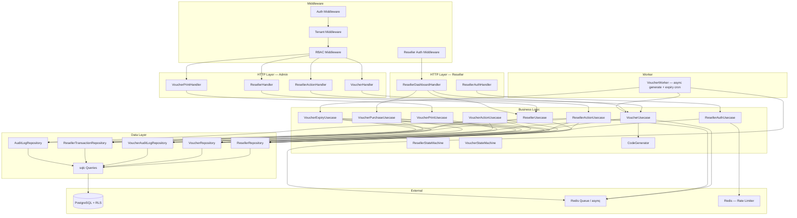
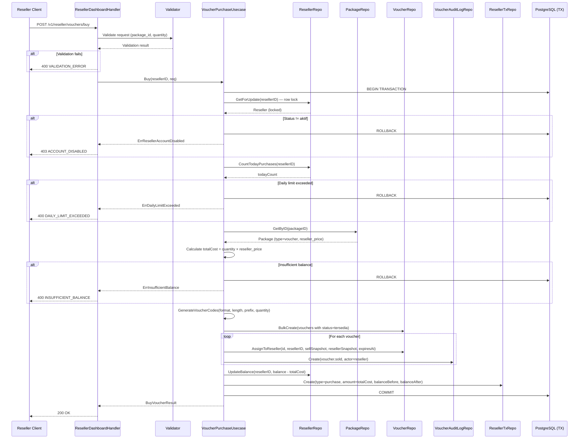
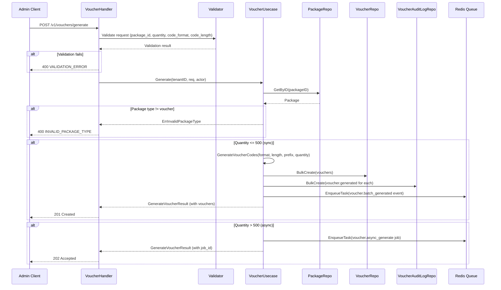
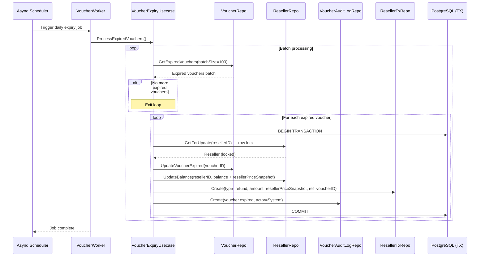
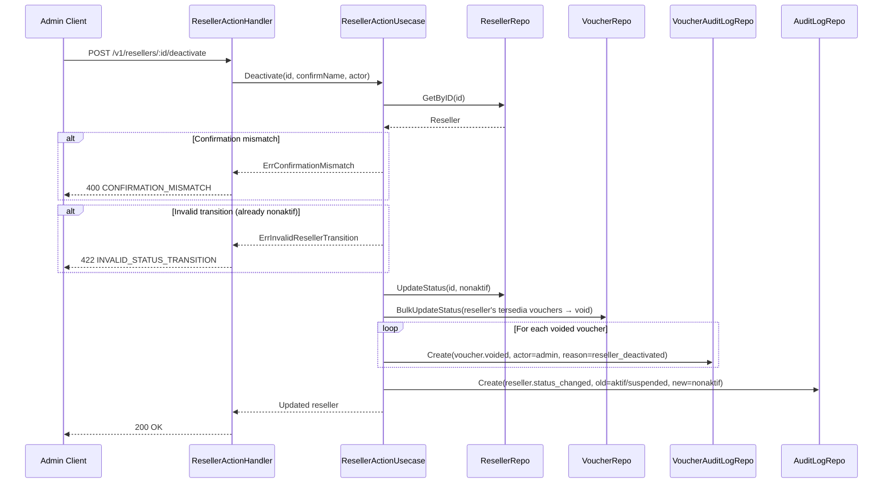

# Design Document: Reseller & Voucher Management Module

## Overview

The Reseller & Voucher Management module adds reseller onboarding, voucher lifecycle management, reseller authentication, and reseller dashboard APIs to ISPBoss's billing-api. Resellers are stored in a dedicated `resellers` table (separate from `users`) with their own phone+password auth flow. Vouchers track a full status lifecycle (Tersedia → Terjual → Aktif → Selesai/Expired/Void) with immutable price snapshots at purchase time and an append-only audit trail. Balance operations use atomic row-level locking to prevent race conditions. The module publishes events to Redis for downstream services and uses asynq for async voucher generation (>500) and daily expiry cron jobs.

### Key Design Decisions

| Decision | Choice | Rationale |
|---|---|---|
| Reseller storage | Dedicated `resellers` table | Separate from `users` — different auth flow, different fields, different lifecycle |
| Reseller auth | Phone + password, separate JWT flow | Resellers use phone numbers, not email. Separate login endpoint avoids role confusion |
| Reseller sessions | Existing `sessions` table, `user_id` = reseller UUID | Reuse infrastructure, 24h expiry for resellers |
| Balance storage | `BIGINT` on `resellers` row | Single source of truth, atomic updates via `SELECT ... FOR UPDATE` |
| Balance operations | Row-level locking + DB transaction | Prevents race conditions on concurrent purchases/deposits/refunds |
| Voucher code generation | `crypto/rand`, configurable format | Cryptographically secure, collision-resistant, flexible format (digits/letters/mixed) |
| Sync vs async generate | ≤500 sync, >500 async via asynq | Keeps HTTP response fast for small batches, background job for large batches |
| Price snapshot | Immutable `sell_price_snapshot` + `reseller_price_snapshot` | Package price changes don't retroactively affect purchased vouchers |
| Voucher expiry | Daily cron via asynq scheduler, batch processing | Efficient, non-blocking, processes expired vouchers in batches |
| Voucher audit log | Separate `voucher_audit_logs` table (append-only) | Different schema from shared `audit_logs`, no UPDATE/DELETE, financial reconciliation |
| Reseller data audit | Shared `audit_logs` table with `entity_type='reseller'` | Consistent with customer/package modules |
| PDF generation | `maroto` or `gofpdf` library, 8-12 per A4 page | Standard Go PDF libraries, grid layout for cutting |
| Voucher status machine | Domain layer enforcement | Invalid transitions impossible regardless of caller |
| Reseller status machine | Domain layer enforcement | Same pattern as customer status machine |
| Transaction log | Dedicated `reseller_transactions` table | Full financial audit trail with balance_before/balance_after |

### Module Boundaries

The reseller-voucher module owns:
- Reseller CRUD (create, read, update)
- Reseller status transitions (state machine: aktif/suspended/nonaktif)
- Reseller password reset
- Reseller balance management (deposit, purchase deduction, expiry refund)
- Reseller authentication (login, logout, refresh, rate limiting)
- Reseller dashboard API (summary, buy voucher, my vouchers, deposit history, transaction history)
- Voucher generation (sync + async)
- Voucher code generation logic (crypto/rand, format, prefix)
- Voucher list with filtering
- Voucher status lifecycle (state machine)
- Voucher bulk actions (print PDF, void, assign, export CSV)
- Voucher PDF generation
- Voucher expiry background job (daily cron)
- Voucher audit log (append-only)
- Reseller transaction log
- Event publishing for reseller and voucher operations

The module does NOT own:
- Package definitions (owned by package module — `package_id` is a FK)
- Admin user authentication (owned by auth module)
- Network operations (consumed via events by Network Service)
- Notifications (consumed via events by Notification Service)
- Payment gateway integration for reseller deposits (out of scope)
- Tenant settings storage for `voucher_expiry_days` (assumes existing tenant config mechanism)

## Architecture

### High-Level Architecture



### File Structure

New files to be created within `services/billing-api/`:

```
internal/
├── domain/
│   ├── reseller.go              # Reseller entity, status, state machine, errors
│   ├── voucher.go               # Voucher entity, status, state machine, code generation, errors
│   ├── voucher_event.go         # Event payload types for reseller & voucher events
│   └── repository.go            # APPEND: ResellerRepository, VoucherRepository,
│                                #         VoucherAuditLogRepository, ResellerTransactionRepository
├── handler/
│   ├── reseller_handler.go      # Admin-facing reseller CRUD handlers (list, detail, create, update)
│   ├── reseller_action.go       # Admin-facing reseller actions (suspend, activate, deactivate,
│   │                            #   reset-password, deposit)
│   ├── voucher_handler.go       # Admin-facing voucher handlers (generate, list, bulk actions)
│   ├── voucher_print.go         # PDF generation handler (admin + reseller)
│   ├── reseller_auth_handler.go # Reseller login/logout/refresh handlers
│   ├── reseller_dashboard.go    # Reseller-facing dashboard, buy, my-vouchers, history handlers
│   └── router.go                # MODIFY: add all new routes + ResellerAuthHandler to RouterConfig
├── usecase/
│   ├── reseller_usecase.go      # Reseller CRUD business logic
│   ├── reseller_action.go       # Reseller status + password + deposit logic
│   ├── reseller_auth.go         # Reseller authentication logic (login, logout, refresh)
│   ├── voucher_usecase.go       # Voucher generate + list logic
│   ├── voucher_action.go        # Voucher bulk actions + status transitions
│   ├── voucher_purchase.go      # Reseller buy voucher logic (atomic balance)
│   ├── voucher_expiry.go        # Expiry cron job logic
│   └── voucher_print.go         # PDF generation logic
├── repository/
│   ├── reseller_repo.go         # ResellerRepository implementation
│   ├── voucher_repo.go          # VoucherRepository implementation
│   ├── voucher_audit_repo.go    # VoucherAuditLogRepository implementation
│   └── reseller_tx_repo.go      # ResellerTransactionRepository implementation
├── worker/
│   └── voucher_worker.go        # Asynq worker for async generate + expiry cron
queries/
├── resellers.sql                # sqlc queries for resellers
├── vouchers.sql                 # sqlc queries for vouchers
├── voucher_audit_logs.sql       # sqlc queries for voucher audit logs
└── reseller_transactions.sql    # sqlc queries for reseller transactions
migrations/
├── 000012_create_resellers.up.sql
├── 000012_create_resellers.down.sql
├── 000013_create_vouchers.up.sql
├── 000013_create_vouchers.down.sql
├── 000014_create_voucher_audit_logs.up.sql
├── 000014_create_voucher_audit_logs.down.sql
├── 000015_create_reseller_transactions.up.sql
├── 000015_create_reseller_transactions.down.sql
cmd/
└── main.go                      # MODIFY: wire all new dependencies + start worker
```

### Integration with Existing Infrastructure

- **Auth Middleware** (`middleware/auth.go`): Reused for admin endpoints. Extracts JWT claims, sets `user_id`, `tenant_id`, `role` in Fiber locals. No changes needed.
- **Reseller Auth Middleware**: New middleware that validates reseller JWT tokens. Sets `reseller_id`, `tenant_id`, `role=reseller` in Fiber locals. Rejects admin tokens on reseller endpoints and vice versa.
- **Tenant Middleware** (`middleware/tenant.go`): Wraps `pkg/tenant.Middleware`. Sets `app.tenant_id` PostgreSQL session variable. No changes needed.
- **RBAC Middleware** (`middleware/rbac.go`): Uses `domain.RBACConfig` with `AllowedRoles` and `MethodRestrictions`. Reseller/voucher admin routes configure per-endpoint RBAC.
- **Queue** (`pkg/queue`): Uses `queue.TaskEnvelope` and `queue.EnqueueTask` for event publishing. Reseller/voucher events follow the same envelope format.
- **Database** (`pkg/database`): Uses `database.WithTenant` for tenant-scoped connections. sqlc queries run within tenant context.
- **Audit Log** (`domain.AuditLogRepository`): Reuses the existing shared `audit_logs` table for reseller data changes (`entity_type='reseller'`).
- **Session** (`domain.SessionRepository`): Reuses the existing `sessions` table for reseller sessions, with `user_id` set to the reseller's UUID.
- **Rate Limiter** (`middleware.LoginRateLimiter`): Adapted for phone-based identification for reseller login rate limiting.


## Components and Interfaces

### Domain Entities

#### ResellerStatus (State Machine)

```go
// ResellerStatus mendefinisikan status reseller dalam sistem.
type ResellerStatus string

const (
    ResellerStatusAktif    ResellerStatus = "aktif"
    ResellerStatusSuspended ResellerStatus = "suspended"
    ResellerStatusNonaktif ResellerStatus = "nonaktif"
)

// ValidResellerTransitions mendefinisikan transisi status reseller yang valid.
// Key: status asal, Value: daftar status tujuan yang diizinkan.
var ValidResellerTransitions = map[ResellerStatus][]ResellerStatus{
    ResellerStatusAktif:    {ResellerStatusSuspended, ResellerStatusNonaktif},
    ResellerStatusSuspended: {ResellerStatusAktif, ResellerStatusNonaktif},
    ResellerStatusNonaktif: {}, // terminal state
}

// CanResellerTransition memeriksa apakah transisi dari current ke target valid.
func CanResellerTransition(current, target ResellerStatus) bool

// ResellerTransition melakukan transisi status dan mengembalikan status baru.
// Mengembalikan error jika transisi tidak valid.
func ResellerTransition(current, target ResellerStatus) (ResellerStatus, error)

// AllowedResellerTargets mengembalikan daftar status tujuan yang valid dari status saat ini.
func AllowedResellerTargets(current ResellerStatus) []ResellerStatus
```

#### VoucherStatus (State Machine)

```go
// VoucherStatus mendefinisikan status voucher dalam sistem.
type VoucherStatus string

const (
    VoucherStatusTersedia VoucherStatus = "tersedia"
    VoucherStatusTerjual  VoucherStatus = "terjual"
    VoucherStatusAktif    VoucherStatus = "aktif"
    VoucherStatusSelesai  VoucherStatus = "selesai"
    VoucherStatusExpired  VoucherStatus = "expired"
    VoucherStatusVoid     VoucherStatus = "void"
)

// ValidVoucherTransitions mendefinisikan transisi status voucher yang valid.
var ValidVoucherTransitions = map[VoucherStatus][]VoucherStatus{
    VoucherStatusTersedia: {VoucherStatusTerjual, VoucherStatusVoid},
    VoucherStatusTerjual:  {VoucherStatusAktif, VoucherStatusExpired, VoucherStatusVoid},
    VoucherStatusAktif:    {VoucherStatusSelesai},
    VoucherStatusSelesai:  {}, // terminal
    VoucherStatusExpired:  {}, // terminal
    VoucherStatusVoid:     {}, // terminal
}

// CanVoucherTransition memeriksa apakah transisi dari current ke target valid.
func CanVoucherTransition(current, target VoucherStatus) bool

// VoucherTransition melakukan transisi status dan mengembalikan status baru.
func VoucherTransition(current, target VoucherStatus) (VoucherStatus, error)

// AllowedVoucherTargets mengembalikan daftar status tujuan yang valid dari status saat ini.
func AllowedVoucherTargets(current VoucherStatus) []VoucherStatus
```

#### CodeFormat

```go
// CodeFormat mendefinisikan format karakter kode voucher.
type CodeFormat string

const (
    CodeFormatDigits  CodeFormat = "digits"
    CodeFormatLetters CodeFormat = "letters"
    CodeFormatMixed   CodeFormat = "mixed"
)
```

#### Reseller Entity

```go
// Reseller merepresentasikan reseller voucher yang dikelola oleh tenant.
type Reseller struct {
    ID                 string         `json:"id"`
    TenantID           string         `json:"tenant_id"`
    Name               string         `json:"name"`
    Phone              string         `json:"phone"`
    Email              string         `json:"email,omitempty"`
    Address            string         `json:"address,omitempty"`
    PasswordHash       string         `json:"-"` // tidak di-expose ke JSON
    Balance            int64          `json:"balance"`
    DailyPurchaseLimit int            `json:"daily_purchase_limit"`
    Status             ResellerStatus `json:"status"`
    LastLogin          *time.Time     `json:"last_login,omitempty"`
    TotalVouchersSold  int            `json:"total_vouchers_sold,omitempty"` // computed field
    CreatedAt          time.Time      `json:"created_at"`
    UpdatedAt          time.Time      `json:"updated_at"`
}
```

#### Voucher Entity

```go
// Voucher merepresentasikan satu kode voucher internet.
type Voucher struct {
    ID                    string        `json:"id"`
    TenantID              string        `json:"tenant_id"`
    Code                  string        `json:"code"`
    PackageID             string        `json:"package_id"`
    PackageName           string        `json:"package_name,omitempty"` // joined field
    ResellerID            string        `json:"reseller_id,omitempty"`
    ResellerName          string        `json:"reseller_name,omitempty"` // joined field
    Status                VoucherStatus `json:"status"`
    SellPriceSnapshot     *int64        `json:"sell_price_snapshot,omitempty"`
    ResellerPriceSnapshot *int64        `json:"reseller_price_snapshot,omitempty"`
    PurchasedAt           *time.Time    `json:"purchased_at,omitempty"`
    ActivatedAt           *time.Time    `json:"activated_at,omitempty"`
    ExpiresAt             *time.Time    `json:"expires_at,omitempty"`
    VoidedAt              *time.Time    `json:"voided_at,omitempty"`
    CreatedAt             time.Time     `json:"created_at"`
    UpdatedAt             time.Time     `json:"updated_at"`
}
```

#### VoucherAuditLog Entity

```go
// VoucherAuditLog merepresentasikan catatan lifecycle voucher (append-only).
type VoucherAuditLog struct {
    ID        string                 `json:"id"`
    TenantID  string                 `json:"tenant_id"`
    VoucherID string                 `json:"voucher_id"`
    Action    string                 `json:"action"`
    ActorID   string                 `json:"actor_id"`
    ActorName string                 `json:"actor_name"`
    Metadata  map[string]interface{} `json:"metadata,omitempty"`
    CreatedAt time.Time              `json:"created_at"`
}
```

#### ResellerTransaction Entity

```go
// TransactionType mendefinisikan jenis transaksi reseller.
type TransactionType string

const (
    TransactionDeposit  TransactionType = "deposit"
    TransactionPurchase TransactionType = "purchase"
    TransactionRefund   TransactionType = "refund"
    TransactionWithdraw TransactionType = "withdraw"
)

// ResellerTransaction merepresentasikan satu transaksi keuangan reseller.
type ResellerTransaction struct {
    ID            string          `json:"id"`
    TenantID      string          `json:"tenant_id"`
    ResellerID    string          `json:"reseller_id"`
    Type          TransactionType `json:"type"`
    Amount        int64           `json:"amount"`
    BalanceBefore int64           `json:"balance_before"`
    BalanceAfter  int64           `json:"balance_after"`
    ReferenceID   string          `json:"reference_id,omitempty"`
    Notes         string          `json:"notes,omitempty"`
    CreatedAt     time.Time       `json:"created_at"`
}
```

#### Domain Errors

```go
var (
    // ErrResellerNotFound dikembalikan saat reseller tidak ditemukan
    ErrResellerNotFound = errors.New("reseller tidak ditemukan")

    // ErrResellerPhoneDuplicate dikembalikan saat nomor telepon sudah terdaftar
    ErrResellerPhoneDuplicate = errors.New("nomor telepon sudah terdaftar")

    // ErrResellerAccountDisabled dikembalikan saat akun reseller suspended/nonaktif
    ErrResellerAccountDisabled = errors.New("akun reseller dinonaktifkan")

    // ErrInvalidResellerTransition dikembalikan saat transisi status tidak valid
    ErrInvalidResellerTransition = errors.New("transisi status reseller tidak valid")

    // ErrVoucherNotFound dikembalikan saat voucher tidak ditemukan
    ErrVoucherNotFound = errors.New("voucher tidak ditemukan")

    // ErrInvalidVoucherTransition dikembalikan saat transisi status voucher tidak valid
    ErrInvalidVoucherTransition = errors.New("transisi status voucher tidak valid")

    // ErrInvalidPackageType dikembalikan saat package_id bukan tipe voucher
    ErrInvalidPackageType = errors.New("paket harus bertipe voucher")

    // ErrInsufficientBalance dikembalikan saat saldo reseller tidak cukup
    ErrInsufficientBalance = errors.New("saldo tidak mencukupi")

    // ErrDailyLimitExceeded dikembalikan saat batas pembelian harian terlampaui
    ErrDailyLimitExceeded = errors.New("batas pembelian harian terlampaui")

    // ErrVoucherForbidden dikembalikan saat reseller mengakses voucher milik reseller lain
    ErrVoucherForbidden = errors.New("tidak memiliki akses ke voucher ini")

    // ErrResellerInvalidCredentials dikembalikan saat phone/password salah
    ErrResellerInvalidCredentials = errors.New("nomor telepon atau password salah")
)
```

#### Voucher Code Generation

```go
// GenerateVoucherCode menghasilkan satu kode voucher acak menggunakan crypto/rand.
// Parameter format menentukan charset (digits/letters/mixed).
// Parameter length menentukan panjang kode (tanpa prefix).
// Parameter prefix ditambahkan di depan kode.
func GenerateVoucherCode(format CodeFormat, length int, prefix string) (string, error)

// GenerateVoucherCodes menghasilkan batch kode voucher unik.
// Mengembalikan daftar kode yang berhasil di-generate dan jumlah yang gagal.
// Untuk setiap kode, jika terjadi collision, retry hingga maxRetries kali.
func GenerateVoucherCodes(format CodeFormat, length int, prefix string, quantity int, existingCodes map[string]struct{}, maxRetries int) ([]string, int)
```

### Repository Interfaces

```go
// ResellerRepository mendefinisikan operasi data untuk tabel resellers.
type ResellerRepository interface {
    Create(ctx context.Context, reseller *Reseller) (*Reseller, error)
    GetByID(ctx context.Context, id string) (*Reseller, error)
    GetByPhone(ctx context.Context, tenantID, phone string) (*Reseller, error)
    Update(ctx context.Context, reseller *Reseller) (*Reseller, error)
    UpdateStatus(ctx context.Context, id string, status ResellerStatus) (*Reseller, error)
    UpdatePasswordHash(ctx context.Context, id, hash string) error
    UpdateLastLogin(ctx context.Context, id string) error
    List(ctx context.Context, params ResellerListParams) (*ResellerListResult, error)
    PhoneExists(ctx context.Context, tenantID, phone, excludeID string) (bool, error)
    // GetForUpdate mengambil reseller dengan row lock (SELECT ... FOR UPDATE).
    // Digunakan dalam transaksi untuk operasi balance atomik.
    GetForUpdate(ctx context.Context, id string) (*Reseller, error)
    // UpdateBalance memperbarui saldo reseller.
    UpdateBalance(ctx context.Context, id string, newBalance int64) error
    // CountTodayPurchases menghitung jumlah voucher yang dibeli reseller hari ini.
    CountTodayPurchases(ctx context.Context, resellerID string) (int, error)
}

// VoucherRepository mendefinisikan operasi data untuk tabel vouchers.
type VoucherRepository interface {
    BulkCreate(ctx context.Context, vouchers []*Voucher) ([]*Voucher, error)
    GetByID(ctx context.Context, id string) (*Voucher, error)
    GetByCode(ctx context.Context, tenantID, code string) (*Voucher, error)
    UpdateStatus(ctx context.Context, id string, status VoucherStatus) (*Voucher, error)
    List(ctx context.Context, params VoucherListParams) (*VoucherListResult, error)
    ListByReseller(ctx context.Context, params ResellerVoucherListParams) (*VoucherListResult, error)
    // GetAvailableByPackage mengambil voucher tersedia untuk paket tertentu (untuk assign).
    GetAvailableByPackage(ctx context.Context, packageID string, limit int) ([]*Voucher, error)
    // BulkUpdateStatus memperbarui status beberapa voucher sekaligus.
    BulkUpdateStatus(ctx context.Context, ids []string, status VoucherStatus) ([]BulkResult, error)
    // BulkAssign meng-assign voucher ke reseller (admin assignment, tanpa potong saldo).
    BulkAssign(ctx context.Context, ids []string, resellerID string) ([]BulkResult, error)
    // AssignToReseller meng-assign voucher ke reseller saat pembelian (set snapshot, purchased_at, expires_at).
    AssignToReseller(ctx context.Context, id string, resellerID string, sellSnapshot, resellerSnapshot int64, expiresAt time.Time) (*Voucher, error)
    // GetExpiredVouchers mengambil voucher terjual yang sudah melewati expires_at.
    GetExpiredVouchers(ctx context.Context, batchSize int) ([]*Voucher, error)
    // CodeExists mengecek apakah kode voucher sudah ada di tenant.
    CodeExists(ctx context.Context, tenantID, code string) (bool, error)
    // GetByIDs mengambil beberapa voucher berdasarkan ID.
    GetByIDs(ctx context.Context, ids []string) ([]*Voucher, error)
    // CountByResellerAndStatus menghitung voucher per reseller dan status.
    CountByResellerAndStatus(ctx context.Context, resellerID string, statuses []VoucherStatus) (int, error)
    // CountSoldToday menghitung voucher yang dibeli reseller hari ini.
    CountSoldToday(ctx context.Context, resellerID string) (int, error)
}

// VoucherAuditLogRepository mendefinisikan operasi data untuk tabel voucher_audit_logs.
type VoucherAuditLogRepository interface {
    Create(ctx context.Context, log *VoucherAuditLog) error
    BulkCreate(ctx context.Context, logs []*VoucherAuditLog) error
    ListByVoucher(ctx context.Context, voucherID string) ([]*VoucherAuditLog, error)
}

// ResellerTransactionRepository mendefinisikan operasi data untuk tabel reseller_transactions.
type ResellerTransactionRepository interface {
    Create(ctx context.Context, tx *ResellerTransaction) (*ResellerTransaction, error)
    ListByReseller(ctx context.Context, params ResellerTxListParams) (*ResellerTxListResult, error)
    ListDepositsByReseller(ctx context.Context, params ResellerTxListParams) (*ResellerTxListResult, error)
}
```

### Usecase Interfaces

```go
// ResellerUsecase mendefinisikan business logic untuk manajemen reseller (admin).
type ResellerUsecase interface {
    Create(ctx context.Context, tenantID string, req CreateResellerRequest, actor ActorInfo) (*Reseller, error)
    GetByID(ctx context.Context, id string, includeAudit bool) (*ResellerDetail, error)
    Update(ctx context.Context, id string, req UpdateResellerRequest, actor ActorInfo) (*Reseller, error)
    List(ctx context.Context, params ResellerListParams) (*ResellerListResult, error)
}

// ResellerActionUsecase mendefinisikan business logic untuk aksi reseller (admin).
type ResellerActionUsecase interface {
    Suspend(ctx context.Context, id string, actor ActorInfo) (*Reseller, error)
    Activate(ctx context.Context, id string, actor ActorInfo) (*Reseller, error)
    Deactivate(ctx context.Context, id string, confirmName string, actor ActorInfo) (*Reseller, error)
    ResetPassword(ctx context.Context, id string, actor ActorInfo) (string, error) // returns plaintext password
    Deposit(ctx context.Context, id string, req DepositRequest, actor ActorInfo) (*Reseller, error)
    Withdraw(ctx context.Context, id string, req WithdrawRequest, actor ActorInfo) (*Reseller, error)
}

// ResellerAuthUsecase mendefinisikan business logic untuk autentikasi reseller.
type ResellerAuthUsecase interface {
    Login(ctx context.Context, req ResellerLoginRequest) (*ResellerLoginResponse, error)
    Logout(ctx context.Context, tokenHash string) error
    RefreshToken(ctx context.Context, refreshToken string) (*TokenPair, error)
}

// VoucherUsecase mendefinisikan business logic untuk manajemen voucher (admin).
type VoucherUsecase interface {
    Generate(ctx context.Context, tenantID string, req GenerateVoucherRequest, actor ActorInfo) (*GenerateVoucherResult, error)
    List(ctx context.Context, params VoucherListParams) (*VoucherListResult, error)
    GetByID(ctx context.Context, id string) (*VoucherDetail, error)
}

// VoucherActionUsecase mendefinisikan business logic untuk aksi voucher (admin).
type VoucherActionUsecase interface {
    BulkVoid(ctx context.Context, ids []string, actor ActorInfo) (*BulkActionResult, error)
    BulkAssign(ctx context.Context, ids []string, resellerID string, actor ActorInfo) (*BulkActionResult, error)
    ExportCSV(ctx context.Context, params VoucherListParams) ([]byte, error)
}

// VoucherPurchaseUsecase mendefinisikan business logic untuk pembelian voucher (reseller).
type VoucherPurchaseUsecase interface {
    Buy(ctx context.Context, resellerID string, req BuyVoucherRequest) (*BuyVoucherResult, error)
}

// VoucherExpiryUsecase mendefinisikan business logic untuk expiry cron job.
type VoucherExpiryUsecase interface {
    ProcessExpiredVouchers(ctx context.Context) error
}

// VoucherPrintUsecase mendefinisikan business logic untuk PDF generation.
type VoucherPrintUsecase interface {
    GeneratePDF(ctx context.Context, voucherIDs []string, tenantName, tenantPhone string) ([]byte, error)
}
```

### Request/Response DTOs

```go
// --- Reseller DTOs ---

// CreateResellerRequest adalah payload untuk POST /v1/resellers.
type CreateResellerRequest struct {
    Name               string `json:"name" validate:"required,min=3,max=255"`
    Phone              string `json:"phone" validate:"required,phone_id"`
    Email              string `json:"email" validate:"omitempty,email"`
    Address            string `json:"address" validate:"omitempty,max=1000"`
    Password           string `json:"password" validate:"required,min=8"`
    Balance            *int64 `json:"balance" validate:"omitempty,gte=0"`
    DailyPurchaseLimit *int   `json:"daily_purchase_limit" validate:"omitempty,gte=0"`
}

// UpdateResellerRequest adalah payload untuk PUT /v1/resellers/:id.
type UpdateResellerRequest struct {
    Name               string `json:"name" validate:"omitempty,min=3,max=255"`
    Phone              string `json:"phone" validate:"omitempty,phone_id"`
    Email              string `json:"email" validate:"omitempty,email"`
    Address            string `json:"address" validate:"omitempty,max=1000"`
    DailyPurchaseLimit *int   `json:"daily_purchase_limit" validate:"omitempty,gte=0"`
}

// DepositRequest adalah payload untuk POST /v1/resellers/:id/deposit.
type DepositRequest struct {
    Amount int64  `json:"amount" validate:"required,gt=0"`
    Notes  string `json:"notes" validate:"omitempty,max=500"`
}

// WithdrawRequest adalah payload untuk POST /v1/resellers/:id/withdraw.
type WithdrawRequest struct {
    Amount int64  `json:"amount" validate:"required,gt=0"`
    Notes  string `json:"notes" validate:"omitempty,max=500"`
}

// DeactivateResellerRequest adalah payload untuk POST /v1/resellers/:id/deactivate.
type DeactivateResellerRequest struct {
    ConfirmationName string `json:"confirmation_name" validate:"required"`
}

// ResellerListParams berisi parameter untuk list/filter reseller.
type ResellerListParams struct {
    TenantID  string `query:"tenant_id"`
    Page      int    `query:"page" validate:"omitempty,min=1"`
    PageSize  int    `query:"page_size" validate:"omitempty,oneof=10 25 50"`
    Search    string `query:"search"`
    Status    string `query:"status" validate:"omitempty,oneof=aktif suspended nonaktif"`
    SortBy    string `query:"sort_by" validate:"omitempty,oneof=name balance created_at"`
    SortOrder string `query:"sort_order" validate:"omitempty,oneof=asc desc"`
}

// ResellerListResult berisi hasil list reseller dengan metadata paginasi.
type ResellerListResult struct {
    Data       []*Reseller    `json:"data"`
    Pagination PaginationMeta `json:"pagination"`
}

// ResellerDetail berisi detail reseller lengkap termasuk audit log.
type ResellerDetail struct {
    Reseller  *Reseller   `json:"reseller"`
    AuditLogs []*AuditLog `json:"audit_logs,omitempty"`
}

// --- Reseller Auth DTOs ---

// ResellerLoginRequest adalah payload untuk POST /v1/reseller/auth/login.
type ResellerLoginRequest struct {
    Phone    string `json:"phone" validate:"required,phone_id"`
    Password string `json:"password" validate:"required"`
}

// ResellerLoginResponse adalah respons untuk login reseller sukses.
type ResellerLoginResponse struct {
    AccessToken  string    `json:"access_token"`
    RefreshToken string    `json:"refresh_token"`
    ExpiresIn    int64     `json:"expires_in"`
    Reseller     *Reseller `json:"reseller"`
}

// --- Voucher DTOs ---

// GenerateVoucherRequest adalah payload untuk POST /v1/vouchers/generate.
type GenerateVoucherRequest struct {
    PackageID  string `json:"package_id" validate:"required,uuid"`
    Quantity   int    `json:"quantity" validate:"required,gt=0"`
    CodeFormat string `json:"code_format" validate:"required,oneof=digits letters mixed"`
    CodeLength int    `json:"code_length" validate:"required,min=6,max=16"`
    Prefix     string `json:"prefix" validate:"omitempty,max=10,alphanum_hyphen"`
}

// GenerateVoucherResult berisi hasil generate voucher.
type GenerateVoucherResult struct {
    TotalRequested int        `json:"total_requested"`
    TotalGenerated int        `json:"total_generated"`
    TotalFailed    int        `json:"total_failed"`
    Vouchers       []*Voucher `json:"vouchers,omitempty"` // hanya untuk sync generate
    JobID          string     `json:"job_id,omitempty"`   // hanya untuk async generate
}

// VoucherListParams berisi parameter untuk list/filter voucher (admin).
type VoucherListParams struct {
    TenantID   string `query:"tenant_id"`
    Page       int    `query:"page" validate:"omitempty,min=1"`
    PageSize   int    `query:"page_size" validate:"omitempty,oneof=10 25 50"`
    Search     string `query:"search"`
    PackageID  string `query:"package_id" validate:"omitempty,uuid"`
    Status     string `query:"status" validate:"omitempty,oneof=tersedia terjual aktif selesai expired void"`
    ResellerID string `query:"reseller_id" validate:"omitempty,uuid"`
    SortBy     string `query:"sort_by" validate:"omitempty,oneof=code status created_at purchased_at"`
    SortOrder  string `query:"sort_order" validate:"omitempty,oneof=asc desc"`
}

// VoucherListResult berisi hasil list voucher dengan metadata paginasi.
type VoucherListResult struct {
    Data       []*Voucher     `json:"data"`
    Pagination PaginationMeta `json:"pagination"`
}

// VoucherDetail berisi detail voucher lengkap termasuk audit log.
type VoucherDetail struct {
    Voucher   *Voucher           `json:"voucher"`
    AuditLogs []*VoucherAuditLog `json:"audit_logs,omitempty"`
}

// BulkVoucherIDsRequest berisi daftar voucher IDs untuk bulk action.
type BulkVoucherIDsRequest struct {
    VoucherIDs []string `json:"voucher_ids" validate:"required,min=1,dive,uuid"`
}

// BulkAssignRequest berisi daftar voucher IDs dan reseller target.
type BulkAssignRequest struct {
    VoucherIDs []string `json:"voucher_ids" validate:"required,min=1,dive,uuid"`
    ResellerID string   `json:"reseller_id" validate:"required,uuid"`
}

// --- Reseller Dashboard DTOs ---

// DashboardSummary berisi ringkasan dashboard reseller.
type DashboardSummary struct {
    Balance           int64 `json:"balance"`
    SoldToday         int   `json:"sold_today"`
    AvailableVouchers int   `json:"available_vouchers"`
}

// BuyVoucherRequest adalah payload untuk POST /v1/reseller/vouchers/buy.
type BuyVoucherRequest struct {
    PackageID string `json:"package_id" validate:"required,uuid"`
    Quantity  int    `json:"quantity" validate:"required,min=1,max=100"`
}

// BuyVoucherResult berisi hasil pembelian voucher.
type BuyVoucherResult struct {
    Vouchers     []*Voucher `json:"vouchers"`
    TotalCost    int64      `json:"total_cost"`
    BalanceAfter int64      `json:"balance_after"`
}

// ResellerVoucherListParams berisi parameter untuk list voucher reseller.
type ResellerVoucherListParams struct {
    ResellerID string `query:"reseller_id"`
    TenantID   string `query:"tenant_id"`
    Page       int    `query:"page" validate:"omitempty,min=1"`
    PageSize   int    `query:"page_size" validate:"omitempty,oneof=10 25 50"`
    Status     string `query:"status" validate:"omitempty,oneof=terjual aktif selesai expired"`
    PackageID  string `query:"package_id" validate:"omitempty,uuid"`
    SortBy     string `query:"sort_by" validate:"omitempty,oneof=code status purchased_at"`
    SortOrder  string `query:"sort_order" validate:"omitempty,oneof=asc desc"`
}

// ResellerTxListParams berisi parameter untuk list transaksi reseller.
type ResellerTxListParams struct {
    ResellerID string `query:"reseller_id"`
    TenantID   string `query:"tenant_id"`
    Page       int    `query:"page" validate:"omitempty,min=1"`
    PageSize   int    `query:"page_size" validate:"omitempty,oneof=10 25 50"`
    Type       string `query:"type" validate:"omitempty,oneof=deposit purchase refund withdraw"`
    SortOrder  string `query:"sort_order" validate:"omitempty,oneof=asc desc"`
}

// ResellerTxListResult berisi hasil list transaksi reseller.
type ResellerTxListResult struct {
    Data       []*ResellerTransaction `json:"data"`
    Pagination PaginationMeta         `json:"pagination"`
}
```

### Handler Structs

```go
// ResellerHandler menangani HTTP request untuk manajemen reseller (admin).
type ResellerHandler struct {
    resellerUsecase ResellerUsecase
    validate        *validator.Validate
    logger          zerolog.Logger
}

// ResellerActionHandler menangani HTTP request untuk aksi reseller (admin).
type ResellerActionHandler struct {
    resellerActionUsecase ResellerActionUsecase
    validate              *validator.Validate
    logger                zerolog.Logger
}

// VoucherHandler menangani HTTP request untuk manajemen voucher (admin).
type VoucherHandler struct {
    voucherUsecase       VoucherUsecase
    voucherActionUsecase VoucherActionUsecase
    validate             *validator.Validate
    logger               zerolog.Logger
}

// VoucherPrintHandler menangani HTTP request untuk PDF generation.
type VoucherPrintHandler struct {
    voucherPrintUsecase VoucherPrintUsecase
    voucherRepo         VoucherRepository
    validate            *validator.Validate
    logger              zerolog.Logger
}

// ResellerAuthHandler menangani HTTP request untuk autentikasi reseller.
type ResellerAuthHandler struct {
    resellerAuthUsecase ResellerAuthUsecase
    rateLimiter         *middleware.LoginRateLimiter
    validate            *validator.Validate
    logger              zerolog.Logger
}

// ResellerDashboardHandler menangani HTTP request untuk dashboard reseller.
type ResellerDashboardHandler struct {
    resellerUsecase       ResellerUsecase
    voucherPurchaseUsecase VoucherPurchaseUsecase
    voucherUsecase        VoucherUsecase
    voucherPrintUsecase   VoucherPrintUsecase
    resellerTxRepo        ResellerTransactionRepository
    validate              *validator.Validate
    logger                zerolog.Logger
}
```


## Data Models

### Migration 000012: Create Resellers Table

```sql
-- Migrasi: membuat tabel resellers untuk menyimpan data reseller voucher.
-- Reseller terpisah dari tabel users, memiliki auth flow sendiri (phone+password).
-- Setiap reseller dimiliki oleh satu tenant dan dilindungi oleh RLS.

CREATE TABLE resellers (
    id                   UUID PRIMARY KEY DEFAULT gen_random_uuid(),
    tenant_id            UUID NOT NULL REFERENCES tenants(id),
    name                 VARCHAR(255) NOT NULL,
    phone                VARCHAR(20) NOT NULL,
    email                VARCHAR(255),
    address              TEXT,
    password_hash        VARCHAR(255) NOT NULL,
    balance              BIGINT NOT NULL DEFAULT 0,
    daily_purchase_limit INTEGER NOT NULL DEFAULT 0,
    status               VARCHAR(20) NOT NULL DEFAULT 'aktif',
    last_login           TIMESTAMPTZ,
    created_at           TIMESTAMPTZ NOT NULL DEFAULT NOW(),
    updated_at           TIMESTAMPTZ NOT NULL DEFAULT NOW(),

    -- CHECK constraints
    CONSTRAINT chk_resellers_status CHECK (
        status IN ('aktif', 'suspended', 'nonaktif')
    ),
    CONSTRAINT chk_resellers_balance CHECK (balance >= 0),
    CONSTRAINT chk_resellers_daily_limit CHECK (daily_purchase_limit >= 0)
);

-- Aktifkan RLS pada tabel resellers
ALTER TABLE resellers ENABLE ROW LEVEL SECURITY;

-- Policy: isolasi data per tenant (SELECT, UPDATE, DELETE)
CREATE POLICY tenant_isolation ON resellers
    USING (tenant_id = current_setting('app.tenant_id')::uuid);

-- Policy: INSERT harus sesuai tenant session
CREATE POLICY tenant_insert ON resellers
    FOR INSERT
    WITH CHECK (tenant_id = current_setting('app.tenant_id')::uuid);

-- Unique constraint: nomor telepon unik per tenant
ALTER TABLE resellers ADD CONSTRAINT uq_resellers_tenant_phone UNIQUE (tenant_id, phone);

-- Composite indexes untuk performa query
CREATE INDEX idx_resellers_tenant_status ON resellers(tenant_id, status);
CREATE INDEX idx_resellers_tenant_phone ON resellers(tenant_id, phone);
```

Down migration:

```sql
-- Rollback: hapus tabel resellers beserta semua policy, constraint, dan index.

DROP POLICY IF EXISTS tenant_insert ON resellers;
DROP POLICY IF EXISTS tenant_isolation ON resellers;
DROP INDEX IF EXISTS idx_resellers_tenant_phone;
DROP INDEX IF EXISTS idx_resellers_tenant_status;
DROP TABLE IF EXISTS resellers;
```

### Migration 000013: Create Vouchers Table

```sql
-- Migrasi: membuat tabel vouchers untuk menyimpan kode voucher internet.
-- Setiap voucher terkait dengan satu paket (type=voucher) dan opsional satu reseller.
-- Harga di-snapshot saat pembelian (immutable setelah purchase).

CREATE TABLE vouchers (
    id                      UUID PRIMARY KEY DEFAULT gen_random_uuid(),
    tenant_id               UUID NOT NULL REFERENCES tenants(id),
    code                    VARCHAR(30) NOT NULL,
    package_id              UUID NOT NULL REFERENCES packages(id),
    reseller_id             UUID REFERENCES resellers(id),
    status                  VARCHAR(20) NOT NULL DEFAULT 'tersedia',
    sell_price_snapshot     BIGINT,
    reseller_price_snapshot BIGINT,
    purchased_at            TIMESTAMPTZ,
    activated_at            TIMESTAMPTZ,
    expires_at              TIMESTAMPTZ,
    voided_at               TIMESTAMPTZ,
    created_at              TIMESTAMPTZ NOT NULL DEFAULT NOW(),
    updated_at              TIMESTAMPTZ NOT NULL DEFAULT NOW(),

    -- CHECK constraints
    CONSTRAINT chk_vouchers_status CHECK (
        status IN ('tersedia', 'terjual', 'aktif', 'selesai', 'expired', 'void')
    )
);

-- Aktifkan RLS pada tabel vouchers
ALTER TABLE vouchers ENABLE ROW LEVEL SECURITY;

-- Policy: isolasi data per tenant (SELECT, UPDATE, DELETE)
CREATE POLICY tenant_isolation ON vouchers
    USING (tenant_id = current_setting('app.tenant_id')::uuid);

-- Policy: INSERT harus sesuai tenant session
CREATE POLICY tenant_insert ON vouchers
    FOR INSERT
    WITH CHECK (tenant_id = current_setting('app.tenant_id')::uuid);

-- Unique constraint: kode voucher unik per tenant
ALTER TABLE vouchers ADD CONSTRAINT uq_vouchers_tenant_code UNIQUE (tenant_id, code);

-- Composite indexes untuk performa query
CREATE INDEX idx_vouchers_tenant_status ON vouchers(tenant_id, status);
CREATE INDEX idx_vouchers_tenant_package ON vouchers(tenant_id, package_id);
CREATE INDEX idx_vouchers_tenant_reseller ON vouchers(tenant_id, reseller_id);
CREATE INDEX idx_vouchers_tenant_status_expires ON vouchers(tenant_id, status, expires_at);
```

Down migration:

```sql
-- Rollback: hapus tabel vouchers beserta semua policy, constraint, dan index.

DROP POLICY IF EXISTS tenant_insert ON vouchers;
DROP POLICY IF EXISTS tenant_isolation ON vouchers;
DROP INDEX IF EXISTS idx_vouchers_tenant_status_expires;
DROP INDEX IF EXISTS idx_vouchers_tenant_reseller;
DROP INDEX IF EXISTS idx_vouchers_tenant_package;
DROP INDEX IF EXISTS idx_vouchers_tenant_status;
DROP TABLE IF EXISTS vouchers;
```

### Migration 000014: Create Voucher Audit Logs Table

```sql
-- Migrasi: membuat tabel voucher_audit_logs untuk mencatat lifecycle voucher.
-- Tabel ini bersifat append-only — tidak ada UPDATE atau DELETE.
-- Terpisah dari shared audit_logs karena schema berbeda dan kebutuhan rekonsiliasi keuangan.

CREATE TABLE voucher_audit_logs (
    id          UUID PRIMARY KEY DEFAULT gen_random_uuid(),
    tenant_id   UUID NOT NULL REFERENCES tenants(id),
    voucher_id  UUID NOT NULL REFERENCES vouchers(id),
    action      VARCHAR(100) NOT NULL,
    actor_id    VARCHAR(255) NOT NULL,
    actor_name  VARCHAR(255) NOT NULL,
    metadata    JSONB,
    created_at  TIMESTAMPTZ NOT NULL DEFAULT NOW()
);

-- Aktifkan RLS pada tabel voucher_audit_logs
ALTER TABLE voucher_audit_logs ENABLE ROW LEVEL SECURITY;

-- Policy: isolasi data per tenant (SELECT only — append-only table)
CREATE POLICY tenant_isolation ON voucher_audit_logs
    USING (tenant_id = current_setting('app.tenant_id')::uuid);

-- Policy: INSERT harus sesuai tenant session
CREATE POLICY tenant_insert ON voucher_audit_logs
    FOR INSERT
    WITH CHECK (tenant_id = current_setting('app.tenant_id')::uuid);

-- Composite index untuk performa query
CREATE INDEX idx_voucher_audit_logs_voucher ON voucher_audit_logs(tenant_id, voucher_id);
CREATE INDEX idx_voucher_audit_logs_created ON voucher_audit_logs(tenant_id, created_at);
```

Down migration:

```sql
-- Rollback: hapus tabel voucher_audit_logs beserta semua policy dan index.

DROP POLICY IF EXISTS tenant_insert ON voucher_audit_logs;
DROP POLICY IF EXISTS tenant_isolation ON voucher_audit_logs;
DROP INDEX IF EXISTS idx_voucher_audit_logs_created;
DROP INDEX IF EXISTS idx_voucher_audit_logs_voucher;
DROP TABLE IF EXISTS voucher_audit_logs;
```

### Migration 000015: Create Reseller Transactions Table

```sql
-- Migrasi: membuat tabel reseller_transactions untuk mencatat semua transaksi keuangan reseller.
-- Setiap transaksi mencatat balance_before dan balance_after untuk audit trail.

CREATE TABLE reseller_transactions (
    id             UUID PRIMARY KEY DEFAULT gen_random_uuid(),
    tenant_id      UUID NOT NULL REFERENCES tenants(id),
    reseller_id    UUID NOT NULL REFERENCES resellers(id),
    type           VARCHAR(20) NOT NULL,
    amount         BIGINT NOT NULL,
    balance_before BIGINT NOT NULL,
    balance_after  BIGINT NOT NULL,
    reference_id   UUID,
    notes          TEXT,
    created_at     TIMESTAMPTZ NOT NULL DEFAULT NOW(),

    -- CHECK constraints
    CONSTRAINT chk_reseller_tx_type CHECK (
        type IN ('deposit', 'purchase', 'refund', 'withdraw')
    )
);

-- Aktifkan RLS pada tabel reseller_transactions
ALTER TABLE reseller_transactions ENABLE ROW LEVEL SECURITY;

-- Policy: isolasi data per tenant
CREATE POLICY tenant_isolation ON reseller_transactions
    USING (tenant_id = current_setting('app.tenant_id')::uuid);

-- Policy: INSERT harus sesuai tenant session
CREATE POLICY tenant_insert ON reseller_transactions
    FOR INSERT
    WITH CHECK (tenant_id = current_setting('app.tenant_id')::uuid);

-- Composite indexes untuk performa query
CREATE INDEX idx_reseller_tx_reseller ON reseller_transactions(tenant_id, reseller_id);
CREATE INDEX idx_reseller_tx_reseller_created ON reseller_transactions(tenant_id, reseller_id, created_at);
```

Down migration:

```sql
-- Rollback: hapus tabel reseller_transactions beserta semua policy dan index.

DROP POLICY IF EXISTS tenant_insert ON reseller_transactions;
DROP POLICY IF EXISTS tenant_isolation ON reseller_transactions;
DROP INDEX IF EXISTS idx_reseller_tx_reseller_created;
DROP INDEX IF EXISTS idx_reseller_tx_reseller;
DROP TABLE IF EXISTS reseller_transactions;
```

### sqlc Queries

#### queries/resellers.sql

```sql
-- Query SQL untuk operasi CRUD tabel resellers.
-- Tabel resellers dilindungi RLS, query hanya mengembalikan baris milik tenant aktif.

-- name: CreateReseller :one
-- Membuat reseller baru dan mengembalikan semua kolom.
INSERT INTO resellers (
    tenant_id, name, phone, email, address,
    password_hash, balance, daily_purchase_limit, status
) VALUES (
    $1, $2, $3, $4, $5, $6, $7, $8, $9
)
RETURNING *;

-- name: GetResellerByID :one
-- Mengambil reseller berdasarkan ID.
SELECT r.*,
    (SELECT COUNT(*) FROM vouchers v
     WHERE v.reseller_id = r.id
     AND v.status NOT IN ('tersedia', 'void')) AS total_vouchers_sold
FROM resellers r
WHERE r.id = $1;

-- name: GetResellerByPhone :one
-- Mengambil reseller berdasarkan tenant_id dan phone (untuk login).
SELECT * FROM resellers
WHERE tenant_id = $1 AND phone = $2;

-- name: UpdateReseller :one
-- Memperbarui data reseller (kecuali password, balance, status).
UPDATE resellers SET
    name = $2,
    phone = $3,
    email = $4,
    address = $5,
    daily_purchase_limit = $6,
    updated_at = NOW()
WHERE id = $1
RETURNING *;

-- name: UpdateResellerStatus :one
-- Memperbarui status reseller.
UPDATE resellers SET status = $2, updated_at = NOW()
WHERE id = $1
RETURNING *;

-- name: UpdateResellerPasswordHash :exec
-- Memperbarui password hash reseller.
UPDATE resellers SET password_hash = $2, updated_at = NOW()
WHERE id = $1;

-- name: UpdateResellerLastLogin :exec
-- Memperbarui timestamp last_login reseller.
UPDATE resellers SET last_login = NOW()
WHERE id = $1;

-- name: UpdateResellerBalance :exec
-- Memperbarui saldo reseller.
UPDATE resellers SET balance = $2, updated_at = NOW()
WHERE id = $1;

-- name: GetResellerForUpdate :one
-- Mengambil reseller dengan row lock untuk operasi balance atomik.
SELECT * FROM resellers
WHERE id = $1
FOR UPDATE;

-- name: ResellerPhoneExists :one
-- Mengecek apakah nomor telepon sudah ada di tenant (exclude ID tertentu).
SELECT EXISTS(
    SELECT 1 FROM resellers
    WHERE tenant_id = $1 AND phone = $2 AND id != $3
) AS exists;
```

#### queries/vouchers.sql

```sql
-- Query SQL untuk operasi CRUD tabel vouchers.
-- Tabel vouchers dilindungi RLS.

-- name: BulkCreateVouchers :copyfrom
-- Membuat beberapa voucher sekaligus menggunakan COPY protocol.
INSERT INTO vouchers (
    tenant_id, code, package_id, status
) VALUES (
    $1, $2, $3, $4
);

-- name: GetVoucherByID :one
-- Mengambil voucher berdasarkan ID beserta nama paket dan reseller.
SELECT v.*,
    p.name AS package_name,
    r.name AS reseller_name
FROM vouchers v
LEFT JOIN packages p ON p.id = v.package_id
LEFT JOIN resellers r ON r.id = v.reseller_id
WHERE v.id = $1;

-- name: GetVoucherByCode :one
-- Mengambil voucher berdasarkan tenant_id dan code.
SELECT v.*,
    p.name AS package_name,
    r.name AS reseller_name
FROM vouchers v
LEFT JOIN packages p ON p.id = v.package_id
LEFT JOIN resellers r ON r.id = v.reseller_id
WHERE v.tenant_id = $1 AND v.code = $2;

-- name: UpdateVoucherStatus :one
-- Memperbarui status voucher.
UPDATE vouchers SET status = $2, updated_at = NOW()
WHERE id = $1
RETURNING *;

-- name: UpdateVoucherVoid :one
-- Memperbarui voucher menjadi void.
UPDATE vouchers SET status = 'void', voided_at = NOW(), updated_at = NOW()
WHERE id = $1
RETURNING *;

-- name: AssignVoucherToReseller :one
-- Meng-assign voucher ke reseller saat pembelian (set snapshot, purchased_at, expires_at).
UPDATE vouchers SET
    reseller_id = $2,
    status = 'terjual',
    sell_price_snapshot = $3,
    reseller_price_snapshot = $4,
    purchased_at = NOW(),
    expires_at = $5,
    updated_at = NOW()
WHERE id = $1
RETURNING *;

-- name: AdminAssignVoucher :one
-- Meng-assign voucher ke reseller oleh admin (tanpa potong saldo, tanpa snapshot).
UPDATE vouchers SET
    reseller_id = $2,
    updated_at = NOW()
WHERE id = $1 AND status = 'tersedia'
RETURNING *;

-- name: GetExpiredVouchers :many
-- Mengambil voucher terjual yang sudah melewati expires_at (untuk cron expiry).
SELECT v.*,
    r.name AS reseller_name
FROM vouchers v
LEFT JOIN resellers r ON r.id = v.reseller_id
WHERE v.status = 'terjual'
AND v.expires_at IS NOT NULL
AND v.expires_at < NOW()
LIMIT $1;

-- name: VoucherCodeExists :one
-- Mengecek apakah kode voucher sudah ada di tenant.
SELECT EXISTS(
    SELECT 1 FROM vouchers
    WHERE tenant_id = $1 AND code = $2
) AS exists;

-- name: GetVouchersByIDs :many
-- Mengambil beberapa voucher berdasarkan ID.
SELECT v.*,
    p.name AS package_name,
    r.name AS reseller_name
FROM vouchers v
LEFT JOIN packages p ON p.id = v.package_id
LEFT JOIN resellers r ON r.id = v.reseller_id
WHERE v.id = ANY($1::uuid[]);

-- name: CountVouchersByResellerAndStatus :one
-- Menghitung voucher per reseller dan status.
SELECT COUNT(*) FROM vouchers
WHERE reseller_id = $1 AND status = ANY($2::varchar[]);

-- name: CountVouchersSoldToday :one
-- Menghitung voucher yang dibeli reseller hari ini.
SELECT COUNT(*) FROM vouchers
WHERE reseller_id = $1
AND purchased_at >= CURRENT_DATE
AND purchased_at < CURRENT_DATE + INTERVAL '1 day';

-- name: UpdateVoucherExpired :one
-- Memperbarui voucher menjadi expired.
UPDATE vouchers SET status = 'expired', updated_at = NOW()
WHERE id = $1
RETURNING *;
```

Note: The `List` and `ListByReseller` queries are built dynamically in the repository layer (same pattern as customer/package) because sqlc doesn't support dynamic WHERE clauses. The dynamic query supports filtering by `package_id`, `status`, `reseller_id`, `search` (ILIKE on code), sorting, and pagination with joined `package_name` and `reseller_name`.

#### queries/voucher_audit_logs.sql

```sql
-- Query SQL untuk operasi tabel voucher_audit_logs (append-only).
-- Hanya INSERT dan SELECT — tidak ada UPDATE atau DELETE.

-- name: CreateVoucherAuditLog :one
-- Membuat satu entri audit log voucher.
INSERT INTO voucher_audit_logs (
    tenant_id, voucher_id, action, actor_id, actor_name, metadata
) VALUES (
    $1, $2, $3, $4, $5, $6
)
RETURNING *;

-- name: ListVoucherAuditLogsByVoucher :many
-- Mengambil semua audit log untuk satu voucher, diurutkan berdasarkan waktu.
SELECT * FROM voucher_audit_logs
WHERE voucher_id = $1
ORDER BY created_at ASC;
```

#### queries/reseller_transactions.sql

```sql
-- Query SQL untuk operasi tabel reseller_transactions.
-- Mencatat semua transaksi keuangan reseller (deposit, purchase, refund).

-- name: CreateResellerTransaction :one
-- Membuat satu entri transaksi reseller.
INSERT INTO reseller_transactions (
    tenant_id, reseller_id, type, amount,
    balance_before, balance_after, reference_id, notes
) VALUES (
    $1, $2, $3, $4, $5, $6, $7, $8
)
RETURNING *;

-- name: ListResellerTransactions :many
-- Mengambil daftar transaksi reseller (semua tipe), diurutkan berdasarkan waktu.
SELECT * FROM reseller_transactions
WHERE reseller_id = $1
ORDER BY created_at DESC
LIMIT $2 OFFSET $3;

-- name: CountResellerTransactions :one
-- Menghitung total transaksi reseller (untuk paginasi).
SELECT COUNT(*) FROM reseller_transactions
WHERE reseller_id = $1;

-- name: ListResellerDeposits :many
-- Mengambil daftar deposit reseller, diurutkan berdasarkan waktu.
SELECT * FROM reseller_transactions
WHERE reseller_id = $1 AND type = 'deposit'
ORDER BY created_at DESC
LIMIT $2 OFFSET $3;

-- name: CountResellerDeposits :one
-- Menghitung total deposit reseller (untuk paginasi).
SELECT COUNT(*) FROM reseller_transactions
WHERE reseller_id = $1 AND type = 'deposit';
```

### Event Payload Types

```go
// ResellerCreatedPayload adalah payload event reseller.created.
type ResellerCreatedPayload struct {
    ResellerID string `json:"reseller_id"`
    TenantID   string `json:"tenant_id"`
    Name       string `json:"name"`
}

// ResellerStatusChangedPayload adalah payload event reseller.status_changed.
type ResellerStatusChangedPayload struct {
    ResellerID string `json:"reseller_id"`
    TenantID   string `json:"tenant_id"`
    OldStatus  string `json:"old_status"`
    NewStatus  string `json:"new_status"`
}

// VoucherBatchGeneratedPayload adalah payload event voucher.batch_generated.
type VoucherBatchGeneratedPayload struct {
    TenantID    string `json:"tenant_id"`
    PackageID   string `json:"package_id"`
    Quantity    int    `json:"quantity"`
    GeneratedBy string `json:"generated_by"`
}

// VoucherPurchasedPayload adalah payload event voucher.purchased.
type VoucherPurchasedPayload struct {
    TenantID   string `json:"tenant_id"`
    ResellerID string `json:"reseller_id"`
    PackageID  string `json:"package_id"`
    Quantity   int    `json:"quantity"`
    TotalCost  int64  `json:"total_cost"`
}
```

## API Endpoint Signatures

### Admin Reseller Endpoints

| Method | Path | Handler | RBAC | Description |
|---|---|---|---|---|
| GET | `/v1/resellers` | `ResellerHandler.List` | admin, operator(GET only) | Daftar reseller dengan paginasi, filter, search |
| GET | `/v1/resellers/:id` | `ResellerHandler.Get` | admin, operator(GET only) | Detail reseller termasuk audit log |
| POST | `/v1/resellers` | `ResellerHandler.Create` | tenant_admin only | Buat reseller baru |
| PUT | `/v1/resellers/:id` | `ResellerHandler.Update` | tenant_admin only | Update data reseller |
| POST | `/v1/resellers/:id/suspend` | `ResellerActionHandler.Suspend` | tenant_admin only | Suspend reseller |
| POST | `/v1/resellers/:id/activate` | `ResellerActionHandler.Activate` | tenant_admin only | Aktifkan reseller dari suspended |
| POST | `/v1/resellers/:id/deactivate` | `ResellerActionHandler.Deactivate` | tenant_admin only | Nonaktifkan reseller (terminal) |
| POST | `/v1/resellers/:id/reset-password` | `ResellerActionHandler.ResetPassword` | tenant_admin only | Reset password reseller |
| POST | `/v1/resellers/:id/deposit` | `ResellerActionHandler.Deposit` | tenant_admin only | Top-up saldo reseller |
| POST | `/v1/resellers/:id/withdraw` | `ResellerActionHandler.Withdraw` | tenant_admin only | Tarik/refund saldo reseller |

### Admin Voucher Endpoints

| Method | Path | Handler | RBAC | Description |
|---|---|---|---|---|
| GET | `/v1/vouchers` | `VoucherHandler.List` | admin, operator(GET only) | Daftar voucher dengan paginasi, filter |
| GET | `/v1/vouchers/:id` | `VoucherHandler.Get` | admin, operator(GET only) | Detail voucher termasuk audit log |
| POST | `/v1/vouchers/generate` | `VoucherHandler.Generate` | tenant_admin only | Generate batch voucher |
| POST | `/v1/vouchers/bulk/print` | `VoucherPrintHandler.BulkPrint` | tenant_admin only | Print voucher ke PDF |
| POST | `/v1/vouchers/bulk/void` | `VoucherHandler.BulkVoid` | tenant_admin only | Void voucher tersedia |
| POST | `/v1/vouchers/bulk/assign` | `VoucherHandler.BulkAssign` | tenant_admin only | Assign voucher ke reseller |
| GET | `/v1/vouchers/export` | `VoucherHandler.Export` | tenant_admin only | Export voucher ke CSV |

### Reseller Auth Endpoints

| Method | Path | Handler | Auth | Description |
|---|---|---|---|---|
| POST | `/v1/reseller/auth/login` | `ResellerAuthHandler.Login` | Public (rate limited) | Login reseller (phone+password) |
| POST | `/v1/reseller/auth/logout` | `ResellerAuthHandler.Logout` | Reseller JWT | Logout reseller |
| POST | `/v1/reseller/auth/refresh` | `ResellerAuthHandler.Refresh` | Public (refresh token) | Refresh access token |

### Reseller Dashboard Endpoints

| Method | Path | Handler | Auth | Description |
|---|---|---|---|---|
| GET | `/v1/reseller/dashboard` | `ResellerDashboardHandler.Summary` | Reseller JWT | Ringkasan dashboard |
| POST | `/v1/reseller/vouchers/buy` | `ResellerDashboardHandler.Buy` | Reseller JWT | Beli voucher (potong saldo) |
| GET | `/v1/reseller/vouchers` | `ResellerDashboardHandler.MyVouchers` | Reseller JWT | List voucher milik reseller |
| POST | `/v1/reseller/vouchers/print` | `ResellerDashboardHandler.Print` | Reseller JWT | Print voucher ke PDF |
| GET | `/v1/reseller/deposit` | `ResellerDashboardHandler.DepositHistory` | Reseller JWT | Riwayat deposit |
| GET | `/v1/reseller/history` | `ResellerDashboardHandler.TransactionHistory` | Reseller JWT | Riwayat semua transaksi |

### Route Registration (additions to router.go)

```go
// --- RouterConfig additions ---
// ResellerHandler, ResellerActionHandler, VoucherHandler, VoucherPrintHandler,
// ResellerAuthHandler, ResellerDashboardHandler ditambahkan ke RouterConfig.

// --- Reseller Auth routes (public, rate limited) ---
resellerAuth := cfg.App.Group("/api/v1/reseller/auth")
resellerAuth.Post("/login", resellerLoginRateLimiterMiddleware(cfg.ResellerRateLimiter), cfg.ResellerAuthHandler.Login)
resellerAuth.Post("/refresh", cfg.ResellerAuthHandler.Refresh)

// --- Reseller Auth routes (protected, reseller JWT) ---
resellerAuthProtected := cfg.App.Group("/api/v1/reseller/auth")
resellerAuthProtected.Use(middleware.ResellerAuth(cfg.JWTSecret))
resellerAuthProtected.Post("/logout", cfg.ResellerAuthHandler.Logout)

// --- Reseller Dashboard routes (reseller JWT + tenant context) ---
resellerDashboard := cfg.App.Group("/api/v1/reseller")
resellerDashboard.Use(middleware.ResellerAuth(cfg.JWTSecret))
resellerDashboard.Use(middleware.TenantContext(cfg.JWTSecret))
resellerDashboard.Get("/dashboard", cfg.ResellerDashboardHandler.Summary)
resellerDashboard.Post("/vouchers/buy", cfg.ResellerDashboardHandler.Buy)
resellerDashboard.Get("/vouchers", cfg.ResellerDashboardHandler.MyVouchers)
resellerDashboard.Post("/vouchers/print", cfg.ResellerDashboardHandler.Print)
resellerDashboard.Get("/deposit", cfg.ResellerDashboardHandler.DepositHistory)
resellerDashboard.Get("/history", cfg.ResellerDashboardHandler.TransactionHistory)

// --- Admin Reseller routes (auth + tenant + RBAC) ---
resellerHandler := cfg.ResellerHandler
resellerActionHandler := cfg.ResellerActionHandler

resellers := api.Group("/resellers")

// Read routes: admin + operator(GET only)
resellersRead := resellers.Group("")
resellersRead.Use(middleware.RBAC(domain.RBACConfig{
    AllowedRoles: []domain.UserRole{
        domain.RoleTenantAdmin, domain.RoleOperator,
    },
    MethodRestrictions: map[domain.UserRole][]string{
        domain.RoleOperator: {"GET"},
    },
}))
resellersRead.Get("/", resellerHandler.List)
resellersRead.Get("/:id", resellerHandler.Get)

// Write routes: tenant_admin only
resellersAdmin := resellers.Group("")
resellersAdmin.Use(middleware.RBAC(domain.RBACConfig{
    AllowedRoles: []domain.UserRole{domain.RoleTenantAdmin},
}))
resellersAdmin.Post("/", resellerHandler.Create)
resellersAdmin.Put("/:id", resellerHandler.Update)
resellersAdmin.Post("/:id/suspend", resellerActionHandler.Suspend)
resellersAdmin.Post("/:id/activate", resellerActionHandler.Activate)
resellersAdmin.Post("/:id/deactivate", resellerActionHandler.Deactivate)
resellersAdmin.Post("/:id/reset-password", resellerActionHandler.ResetPassword)
resellersAdmin.Post("/:id/deposit", resellerActionHandler.Deposit)
resellersAdmin.Post("/:id/withdraw", resellerActionHandler.Withdraw)

// --- Admin Voucher routes (auth + tenant + RBAC) ---
voucherHandler := cfg.VoucherHandler
voucherPrintHandler := cfg.VoucherPrintHandler

vouchers := api.Group("/vouchers")

// Read routes: admin + operator(GET only)
vouchersRead := vouchers.Group("")
vouchersRead.Use(middleware.RBAC(domain.RBACConfig{
    AllowedRoles: []domain.UserRole{
        domain.RoleTenantAdmin, domain.RoleOperator,
    },
    MethodRestrictions: map[domain.UserRole][]string{
        domain.RoleOperator: {"GET"},
    },
}))
vouchersRead.Get("/", voucherHandler.List)
vouchersRead.Get("/:id", voucherHandler.Get)

// Write routes: tenant_admin only
vouchersAdmin := vouchers.Group("")
vouchersAdmin.Use(middleware.RBAC(domain.RBACConfig{
    AllowedRoles: []domain.UserRole{domain.RoleTenantAdmin},
}))
vouchersAdmin.Post("/generate", voucherHandler.Generate)
vouchersAdmin.Post("/bulk/print", voucherPrintHandler.BulkPrint)
vouchersAdmin.Post("/bulk/void", voucherHandler.BulkVoid)
vouchersAdmin.Post("/bulk/assign", voucherHandler.BulkAssign)
vouchersAdmin.Get("/export", voucherHandler.Export)
```


## Data Flow Diagrams

### Reseller Buy Voucher Flow (Atomic Balance)



### Voucher Generate Flow (Admin)



### Voucher Expiry Cron Flow



### Reseller Deactivate Flow




## Correctness Properties

*A property is a characteristic or behavior that should hold true across all valid executions of a system — essentially, a formal statement about what the system should do. Properties serve as the bridge between human-readable specifications and machine-verifiable correctness guarantees.*

### Property 1: New Reseller Default Active Status

*For any* valid reseller creation request, the resulting reseller SHALL always have `status` set to `aktif` and `balance` set to the requested value (or 0 if not provided), regardless of any other field values in the request.

**Validates: Requirements 4.1**

### Property 2: Reseller State Machine Determinism

*For any* valid `ResellerStatus` value and *for any* target status, the state machine transition function SHALL be deterministic: if the transition is valid (per the defined transition map), the resulting status SHALL equal the target; if the transition is invalid, the function SHALL return an error and the status SHALL remain unchanged. Specifically, `aktif` → [`suspended`, `nonaktif`], `suspended` → [`aktif`, `nonaktif`], `nonaktif` → [] (terminal, no transitions out).

**Validates: Requirements 8.1, 8.2, 8.5, 8.6, 32.1, 32.2, 32.3**

### Property 3: Voucher State Machine Determinism

*For any* valid `VoucherStatus` value and *for any* target status, the state machine transition function SHALL be deterministic: if the transition is valid, the resulting status SHALL equal the target; if invalid, the function SHALL return an error. Specifically, `tersedia` → [`terjual`, `void`], `terjual` → [`aktif`, `expired`, `void`], `aktif` → [`selesai`], and `selesai`, `expired`, `void` are terminal states with no valid transitions out.

**Validates: Requirements 18.1, 18.2, 18.3**

### Property 4: Balance Conservation

*For any* reseller with initial balance B, and *for any* sequence of deposits D₁..Dₙ, purchases P₁..Pₘ, refunds R₁..Rₖ, and withdrawals W₁..Wₗ applied atomically, the final balance SHALL equal B + Σ(Dᵢ) + Σ(Rⱼ) - Σ(Pₖ) - Σ(Wₗ). Furthermore, at no point during the sequence SHALL the balance go below zero — any operation that would result in a negative balance SHALL be rejected before modifying the balance.

**Validates: Requirements 1.6, 10.1, 11.5, 21.2, 21.6, 24.1, 24.9, 33.3, 33.4**

### Property 5: Voucher Code Format Correctness

*For any* generated voucher code with `code_format` = `digits`, every character in the random part SHALL be in `[0-9]`. *For any* code with `code_format` = `letters`, every character SHALL be in `[A-Z]`. *For any* code with `code_format` = `mixed`, every character SHALL be in `[A-Z0-9]`. *For all* generated codes, the random part length SHALL equal exactly `code_length`. When a `prefix` is provided, the full code SHALL equal `prefix + random_part`.

**Validates: Requirements 16.1, 16.2, 16.3, 16.4, 16.5**

### Property 6: Voucher Code Uniqueness Within Tenant

*For any* batch of generated voucher codes within a single tenant, all full codes (prefix + random part) SHALL be unique. The collision avoidance mechanism SHALL retry up to 3 times per code on collision, and codes that fail all retries SHALL be reported as `total_failed` without being inserted.

**Validates: Requirements 15.6, 15.7, 16.7**

### Property 7: Price Snapshot Integrity

*For any* purchased voucher (status not `tersedia`), the `sell_price_snapshot` and `reseller_price_snapshot` SHALL be non-null. *For any* purchased voucher, `reseller_price_snapshot` SHALL be strictly less than `sell_price_snapshot` (margin integrity). *For any* voucher after purchase, subsequent changes to the package's `sell_price` or `reseller_price` SHALL NOT modify the voucher's snapshot values.

**Validates: Requirements 31.1, 31.2, 31.3, 31.4**

### Property 8: Phone Uniqueness Within Tenant

*For any* two resellers within the same tenant, their `phone` values SHALL be distinct. *For any* reseller creation or update request that would result in a duplicate phone within the tenant, the system SHALL reject the request with `PHONE_DUPLICATE`.

**Validates: Requirements 4.4, 7.3**

### Property 9: Password Hash Round-Trip

*For any* plaintext password P provided during reseller creation or password reset, hashing P with bcrypt and then verifying P against the resulting hash SHALL always succeed. Verifying any string Q ≠ P against the hash SHALL always fail.

**Validates: Requirements 4.5, 9.1**

### Property 10: Bulk Void Eligibility

*For any* set of voucher IDs submitted to bulk void, only vouchers with status `tersedia` SHALL be transitioned to `void`. *For any* voucher in the set with status ≠ `tersedia`, the operation SHALL fail for that specific voucher and report it in the `failures` array with the reason. The total of `success_count` + `failure_count` SHALL equal the number of submitted IDs.

**Validates: Requirements 19.2, 19.5**

### Property 11: Validation Error Aggregation

*For any* reseller or voucher creation/update request containing multiple invalid fields, the validation response SHALL return HTTP 400 with error code `VALIDATION_ERROR` and an array of field-level error details covering ALL invalid fields in a single response (not just the first error encountered).

**Validates: Requirements 35.9**

### Property 12: Pagination Metadata Correctness

*For any* total count of items and `page_size`, the pagination metadata SHALL satisfy: `total_pages == ceil(total / page_size)`, `page` is within [1, max(1, total_pages)], and the number of items returned on the current page equals `min(page_size, total - (page-1) * page_size)`.

**Validates: Requirements 5.5, 17.7, 25.5, 27.3, 28.4**

### Property 13: Expiry Date Calculation

*For any* voucher purchased by a reseller, the `expires_at` timestamp SHALL equal the `purchased_at` timestamp plus the tenant's configured `voucher_expiry_days` (default 90). Changes to the tenant's `voucher_expiry_days` setting SHALL NOT affect the `expires_at` of already-purchased vouchers.

**Validates: Requirements 22.1, 22.2, 22.3**

### Property 14: Transaction Balance Consistency

*For any* reseller transaction record, the `balance_after` SHALL equal `balance_before + amount` for transactions of type `deposit` or `refund`, and `balance_before - amount` for transactions of type `purchase`. This invariant SHALL hold for every individual transaction record in the `reseller_transactions` table.

**Validates: Requirements 11.5, 10.1, 24.6**


## Error Handling

### Domain Error Types

```go
var (
    // ErrResellerNotFound dikembalikan saat reseller tidak ditemukan atau milik tenant lain
    ErrResellerNotFound = errors.New("reseller tidak ditemukan")

    // ErrResellerPhoneDuplicate dikembalikan saat nomor telepon sudah terdaftar di tenant
    ErrResellerPhoneDuplicate = errors.New("nomor telepon sudah terdaftar")

    // ErrResellerAccountDisabled dikembalikan saat akun reseller suspended/nonaktif
    ErrResellerAccountDisabled = errors.New("akun reseller dinonaktifkan")

    // ErrInvalidResellerTransition dikembalikan saat transisi status reseller tidak valid
    ErrInvalidResellerTransition = errors.New("transisi status reseller tidak valid")

    // ErrVoucherNotFound dikembalikan saat voucher tidak ditemukan atau milik tenant lain
    ErrVoucherNotFound = errors.New("voucher tidak ditemukan")

    // ErrInvalidVoucherTransition dikembalikan saat transisi status voucher tidak valid
    ErrInvalidVoucherTransition = errors.New("transisi status voucher tidak valid")

    // ErrInvalidPackageType dikembalikan saat package_id bukan tipe voucher
    ErrInvalidPackageType = errors.New("paket harus bertipe voucher")

    // ErrInsufficientBalance dikembalikan saat saldo reseller tidak cukup untuk pembelian
    ErrInsufficientBalance = errors.New("saldo tidak mencukupi")

    // ErrDailyLimitExceeded dikembalikan saat batas pembelian harian reseller terlampaui
    ErrDailyLimitExceeded = errors.New("batas pembelian harian terlampaui")

    // ErrVoucherForbidden dikembalikan saat reseller mengakses voucher milik reseller lain
    ErrVoucherForbidden = errors.New("tidak memiliki akses ke voucher ini")

    // ErrResellerInvalidCredentials dikembalikan saat phone/password salah saat login
    ErrResellerInvalidCredentials = errors.New("nomor telepon atau password salah")

    // ErrResellerAccountLocked dikembalikan saat akun terkunci karena terlalu banyak percobaan login
    ErrResellerAccountLocked = errors.New("akun terkunci sementara")

    // ErrPackageNotActive dikembalikan saat paket voucher tidak aktif
    ErrPackageNotActive = errors.New("paket tidak aktif")
)
```

### HTTP Error Mapping

| Domain Error | HTTP Status | Error Code |
|---|---|---|
| `ErrResellerNotFound` | 404 | `RESELLER_NOT_FOUND` |
| `ErrResellerPhoneDuplicate` | 409 | `PHONE_DUPLICATE` |
| `ErrResellerAccountDisabled` | 403 | `ACCOUNT_DISABLED` |
| `ErrInvalidResellerTransition` | 422 | `INVALID_STATUS_TRANSITION` |
| `ErrVoucherNotFound` | 404 | `VOUCHER_NOT_FOUND` |
| `ErrInvalidVoucherTransition` | 422 | `INVALID_VOUCHER_STATUS_TRANSITION` |
| `ErrInvalidPackageType` | 400 | `INVALID_PACKAGE_TYPE` |
| `ErrInsufficientBalance` | 400 | `INSUFFICIENT_BALANCE` |
| `ErrDailyLimitExceeded` | 400 | `DAILY_LIMIT_EXCEEDED` |
| `ErrVoucherForbidden` | 403 | `FORBIDDEN` |
| `ErrResellerInvalidCredentials` | 401 | `INVALID_CREDENTIALS` |
| `ErrResellerAccountLocked` | 429 | `ACCOUNT_LOCKED` |
| `ErrPackageNotActive` | 400 | `PACKAGE_NOT_ACTIVE` |
| `ErrConfirmationMismatch` | 400 | `CONFIRMATION_MISMATCH` |
| Validation errors | 400 | `VALIDATION_ERROR` |
| RBAC denied | 403 | `FORBIDDEN` |
| Internal errors | 500 | `INTERNAL_ERROR` |

### Error Response Format

All errors follow the existing `domain.APIResponse` format:

```json
{
  "success": false,
  "error": {
    "code": "INSUFFICIENT_BALANCE",
    "message": "saldo tidak mencukupi",
    "details": [
      {"field": "balance", "message": "saldo saat ini: Rp 50.000, dibutuhkan: Rp 100.000"}
    ]
  }
}
```

### Daily Limit Exceeded Error Response

```json
{
  "success": false,
  "error": {
    "code": "DAILY_LIMIT_EXCEEDED",
    "message": "batas pembelian harian terlampaui",
    "details": [
      {"field": "quantity", "message": "sisa kuota hari ini: 10 voucher"}
    ]
  }
}
```

### Invalid Status Transition Error Response

```json
{
  "success": false,
  "error": {
    "code": "INVALID_STATUS_TRANSITION",
    "message": "transisi status reseller tidak valid",
    "details": [
      {"field": "status", "message": "status saat ini: nonaktif, transisi yang diizinkan: (tidak ada)"}
    ]
  }
}
```

## Testing Strategy

### Testing Framework

- **Unit tests**: `testing` (stdlib) + `testify` for assertions
- **Property-based tests**: `pgregory.net/rapid` (already in go.mod)
- **Integration tests**: `testcontainers-go` for PostgreSQL + Redis
- **HTTP tests**: `net/http/httptest` + Fiber test utilities

### Dual Testing Approach

#### Property-Based Tests (rapid)

Each correctness property maps to one property-based test with minimum 100 iterations. Tests are tagged with the property they validate.

| Property | Test File | Description |
|---|---|---|
| Property 1 | `domain/reseller_test.go` | New reseller default active status |
| Property 2 | `domain/reseller_test.go` | Reseller state machine determinism |
| Property 3 | `domain/voucher_test.go` | Voucher state machine determinism |
| Property 4 | `usecase/voucher_purchase_test.go` | Balance conservation |
| Property 5 | `domain/voucher_test.go` | Voucher code format correctness |
| Property 6 | `domain/voucher_test.go` | Voucher code uniqueness within tenant |
| Property 7 | `usecase/voucher_purchase_test.go` | Price snapshot integrity |
| Property 8 | `usecase/reseller_usecase_test.go` | Phone uniqueness within tenant |
| Property 9 | `domain/reseller_test.go` | Password hash round-trip |
| Property 10 | `usecase/voucher_action_test.go` | Bulk void eligibility |
| Property 11 | `handler/reseller_handler_test.go` | Validation error aggregation |
| Property 12 | `usecase/reseller_usecase_test.go` | Pagination metadata correctness |
| Property 13 | `usecase/voucher_purchase_test.go` | Expiry date calculation |
| Property 14 | `usecase/reseller_action_test.go` | Transaction balance consistency |

**Property test configuration:**
- Minimum 100 iterations per property
- Tag format: `// Feature: reseller-voucher, Property N: {title}`
- Use `rapid.Check` with `*rapid.T` for each property

#### Unit Tests (Example-Based)

| Area | Test File | Coverage |
|---|---|---|
| Reseller CRUD handlers | `handler/reseller_handler_test.go` | HTTP status codes, request parsing, response format, error mapping |
| Reseller action handlers | `handler/reseller_action_test.go` | Suspend, activate, deactivate, reset-password, deposit HTTP handling |
| Voucher handlers | `handler/voucher_handler_test.go` | Generate, list, bulk actions HTTP handling |
| Reseller auth handlers | `handler/reseller_auth_handler_test.go` | Login, logout, refresh HTTP handling |
| Reseller dashboard handlers | `handler/reseller_dashboard_test.go` | Summary, buy, my-vouchers, history HTTP handling |
| Reseller usecase | `usecase/reseller_usecase_test.go` | Business logic: phone duplicate, create with defaults |
| Reseller action usecase | `usecase/reseller_action_test.go` | Status transitions, password reset, deposit |
| Reseller auth usecase | `usecase/reseller_auth_test.go` | Login success/failure, disabled account, session creation |
| Voucher usecase | `usecase/voucher_usecase_test.go` | Generate sync/async threshold, invalid package type |
| Voucher purchase usecase | `usecase/voucher_purchase_test.go` | Buy flow: insufficient balance, daily limit, atomic rollback |
| Voucher expiry usecase | `usecase/voucher_expiry_test.go` | Expiry batch processing, refund calculation |
| Domain validation | `domain/reseller_test.go` | State machine edge cases, phone format validation |
| Domain validation | `domain/voucher_test.go` | State machine edge cases, code generation edge cases |
| RBAC | Existing `handler/rbac_test.go` pattern | Each role × each reseller/voucher endpoint |

#### Integration Tests

| Area | Description |
|---|---|
| Tenant isolation | Create resellers/vouchers in tenant A, verify invisible from tenant B |
| RLS enforcement | Verify RLS blocks cross-tenant access at DB level |
| Unique constraints | Verify (tenant_id, phone) and (tenant_id, code) uniqueness at DB level |
| FK constraints | Verify vouchers.package_id FK to packages.id, vouchers.reseller_id FK to resellers.id |
| Balance atomicity | Concurrent deposit + purchase, verify no race conditions |
| Reseller list filtering | Verify status, search filters with real DB |
| Voucher list filtering | Verify package_id, status, reseller_id, search filters with real DB |
| Migration | Verify schema after running migrations 000012-000015 |
| Rate limiting | Verify 5 failed logins → lock for 15 minutes |
| Session management | Verify reseller session creation, expiry, invalidation |

### Test Organization

```
services/billing-api/internal/
├── domain/
│   ├── reseller_test.go              # Property 1, 2, 9 + unit tests for state machine, validation
│   └── voucher_test.go               # Property 3, 5, 6 + unit tests for state machine, code generation
├── handler/
│   ├── reseller_handler_test.go      # Property 11 + HTTP handler unit tests
│   ├── reseller_action_test.go       # Reseller action HTTP handler tests
│   ├── voucher_handler_test.go       # Voucher HTTP handler tests
│   ├── reseller_auth_handler_test.go # Reseller auth HTTP handler tests
│   └── reseller_dashboard_test.go    # Reseller dashboard HTTP handler tests
├── usecase/
│   ├── reseller_usecase_test.go      # Property 8, 12 + business logic tests
│   ├── reseller_action_test.go       # Property 14 + status/deposit/password tests
│   ├── reseller_auth_test.go         # Auth logic tests (login, disabled account)
│   ├── voucher_usecase_test.go       # Generate sync/async, invalid package tests
│   ├── voucher_action_test.go        # Property 10 + bulk action tests
│   ├── voucher_purchase_test.go      # Property 4, 7, 13 + buy flow tests
│   └── voucher_expiry_test.go        # Expiry batch processing tests
└── repository/
    ├── reseller_repo_test.go         # Integration tests (tenant isolation, phone uniqueness)
    ├── voucher_repo_test.go          # Integration tests (code uniqueness, filtering)
    ├── voucher_audit_repo_test.go    # Integration tests (append-only verification)
    └── reseller_tx_repo_test.go      # Integration tests (transaction logging)
```
