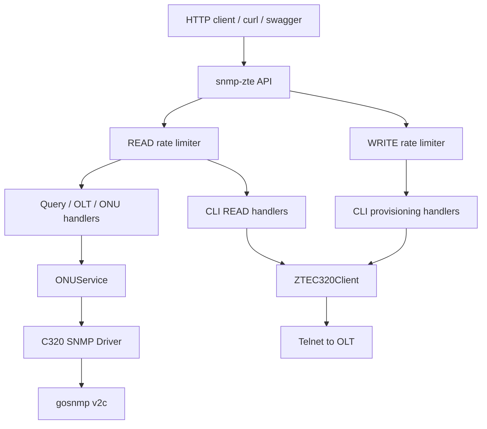

# Audit Integrasi Riset snmp-zte ke Modul OLT ISPBoss

Tanggal audit: 2026-05-07
Scope: `snmp-zte`, `services/network-service`, `apps/web/app/olt`, dan proxy API web.
Keputusan audit: tidak meng-copy implementasi riset secara mentah. Riset dipakai sebagai bukti komunikasi OLT ZTE, lalu kemampuan yang valid harus dibangun ulang mengikuti boundary aplikasi ISPBoss.

## Ringkasan Eksekutif

Folder `snmp-zte` adalah service riset mandiri untuk ZTE C320/C300/C600. Ia memiliki API sendiri, Basic Auth, router Chi, driver SNMP C320, CLI Telnet client, swagger, dokumentasi OID, dan endpoint READ/WRITE. Folder ini tidak masuk `go.work`, tidak menjadi dependency `services/network-service`, dan tidak dijalankan oleh docker compose aplikasi utama.

Modul OLT ISPBoss sudah memiliki `ZTEAdapter` di `services/network-service/internal/adapter`, tetapi integrasinya baru sebagian. Beberapa OID utama dari riset sudah disalin, dan beberapa operasi dasar sudah tersedia lewat interface `domain.OLTAdapter`. Namun sebagian besar kemampuan riset belum tersedia dalam kontrak aplikasi, belum muncul di UI, atau belum diport dengan bentuk yang aman untuk multi-tenant, credential encryption, audit log, event publisher, dan lifecycle ONT.

Temuan paling penting:

1. `snmp-zte` belum terintegrasi sebagai kode aktif. Ia masih referensi riset dan folder terpisah.
2. Aplikasi utama sudah punya adapter ZTE, tetapi cakupannya jauh lebih kecil dari riset.
3. Ada risiko index board/PON tidak sesuai riset C320. Riset memakai board 1, PON 1 = `268501248`; adapter aplikasi saat ini sering memanggil kalkulasi dengan `board=0`.
4. Auto-detect OLT di aplikasi kemungkinan gagal di mode live karena membuat adapter dengan brand kosong.
5. Provisioning aplikasi memakai CLI untuk add ONT dan service-port, sedangkan riset membuktikan sebagian provisioning dasar bisa lewat SNMP RW. Strategi terbaik tetap hybrid, tetapi harus dipilah per operasi.
6. UI OLT saat ini masih surface dasar: daftar OLT, tambah OLT, detail, alarm, ODP, dan list ONT. Belum ada UI untuk PON detail, ONT optical/detail, unconfigured ONT discovery, VLAN/service-port operations, profile discovery, hardware health, atau command audit detail yang setara riset.

## Apa Itu snmp-zte

`snmp-zte` adalah service riset independent dengan module Go `github.com/ardani/snmp-zte`.

Komponen utamanya:

- `cmd/api/main.go`: HTTP API dengan Chi router, Basic Auth, rate limiter READ/WRITE, health, swagger, endpoint SNMP/CLI.
- `internal/driver/c320`: driver SNMP ZTE C320. Ini bagian riset OID paling penting.
- `internal/cli/client.go`: low-level Telnet client, login, enable mode, command execution, pagination, clean output.
- `internal/cli/zte_c320.go`: wrapper command ZTE C320 dan parser output CLI.
- `internal/service/onu_service.go`: service SNMP berbasis driver, cache Redis/NoOp, validasi board/PON/ONU.
- `internal/handler/cli.go`: puluhan endpoint CLI READ dan WRITE.
- `docs/RISET_SUMMARY.md` dan `docs/PROVISIONING_CAPABILITIES.md`: ringkasan hasil riset real OLT ZTE C320.

Arsitektur riset:



## Cara snmp-zte Berkomunikasi dengan OLT

### Jalur SNMP

Riset memakai `gosnmp` SNMP v2c. Driver C320 membuat koneksi dengan host, port, community, timeout 5 detik, retry 2 kali, dan MaxOids 60. Modelnya stateful: driver menyimpan `connected` dan koneksi SNMP.

SNMP dipakai untuk:

- System info: sysDescr, sysName, sysUpTime, sysContact, sysLocation.
- ONU list: walk OID legacy dan OID baru, lalu merge informasi nama, tipe, serial, signal, distance, status.
- ONU detail: serial, status, RX/TX power, distance, IP, description, last online/offline, reason.
- Empty slots: membandingkan ONU ID yang terpakai dengan range 1-128.
- Board/card info, all boards, interface stats, fan, temperature.
- PON traffic stats dan PON-level error counters.
- VLAN list dan VLAN info via standard bridge MIB.
- Profile list via ZTE profile OID.
- Basic provisioning via SNMP SET: create ONU, delete ONU, rename ONU.

Poin riset penting:

- READ community contoh: `public`.
- WRITE community contoh: `globalrw`.
- Riset membuktikan `RowStatus = 4` untuk create ONU dan `RowStatus = 6` untuk delete ONU.
- Name dan Description writable.
- VLAN/service-port/bandwidth assignment tidak cukup via SNMP, harus CLI.

### Jalur CLI

Riset CLI memakai Telnet manual:

- TCP dial ke host:port.
- Tunggu prompt `Username:`.
- Kirim username.
- Tunggu prompt `Password:`.
- Kirim password.
- Tunggu prompt `ZXAN>` atau `ZXAN#`.
- Jika masih `ZXAN>`, kirim `enable` dan enable password.
- Kirim command.
- Baca output sampai prompt, dengan dukungan pagination `--More--` atau `(q to quit)`.
- Bersihkan echo command, prompt, blank lines, dan ANSI escape.

CLI dipakai untuk:

- Hardware: card, rack, shelf, subcard, fan, power, temperature.
- GPON profiles: T-CONT, ONU type, VLAN/IP/SIP/MGC/dial-plan/voice profiles.
- ONU read: state, uncfg, config, running, detail, baseinfo, traffic, optical.
- VLAN read and write.
- Interface read.
- Service-port read and write.
- IGMP/MVLAN read and write.
- User/SNMP config/running-config.
- Provisioning CLI: ONU auth/delete/rename/reset, T-CONT, GEM port, service-port, VLAN, profiles, multicast.

## Status Integrasi Saat Ini di Aplikasi

### Sudah Masuk

1. Module OLT utama ada di `services/network-service`.
2. Contract multi-brand ada di `domain.OLTAdapter`.
3. `ZTEAdapter` sudah ada dan dipilih oleh `OLTAdapterFactory` saat brand `zte`.
4. Connector SNMP generik sudah ada dan mendukung SNMP v2c dan v3.
5. Connector CLI generik sudah ada dan mendukung SSH serta Telnet.
6. Credential OLT disimpan terenkripsi di database aplikasi.
7. Route backend OLT sudah ada di `/api/v1/olt/...`.
8. Web proxy generic meneruskan `/api/network-service/...` ke `network-service`.
9. Web OLT sudah punya halaman list, create, detail, ODP, dan provisioning list.
10. Beberapa OID hasil riset sudah disalin ke `olt_zte_oids.go`.
11. Beberapa method adapter ZTE sudah tersedia: `GetSystemInfo`, `Ping`, `GetAllPONPorts`, `GetONTList`, `GetONTSignal`, `GetAlarms`, `GetSFPInfo`, `GetTrafficStats`, `AddONT`, `RemoveONT`, `AddServicePort`, `RemoveServicePort`, `RebootONT`, `GetUnregisteredONTs`.

### Belum Masuk

1. `snmp-zte` tidak terdaftar di `go.work`.
2. `network-service` tidak import `github.com/ardani/snmp-zte`.
3. Docker compose aplikasi tidak menjalankan service `snmp-zte`.
4. Endpoint 71 READ/WRITE dari riset tidak tersedia sebagai endpoint aplikasi.
5. Parser CLI ZTE C320 dari `snmp-zte/internal/cli/zte_c320.go` belum dipakai.
6. Fast ONT list SNMP merge dari `GetONUListFast` belum dipakai.
7. OID legacy `3902.1082` untuk detail ONT belum lengkap di aplikasi.
8. Board/rack/shelf/slot model riset belum dimodelkan eksplisit di database aplikasi.
9. Hardware health detail belum masuk dashboard OLT.
10. VLAN/service-port/profile discovery dari OLT belum masuk flow aplikasi.
11. SNMP SET RowStatus create/delete/rename belum masuk adapter aplikasi sebagai opsi provisioning.
12. Audit log aplikasi belum menangkap detail operasi SNMP SET karena adapter saat ini provisioning via CLI.

## Perbandingan Capability

| Area | snmp-zte | Aplikasi saat ini | Status |
|---|---|---|---|
| OLT inventory | Config JSON | DB multi-tenant encrypted | Aplikasi lebih sesuai production |
| SNMP v2c | Ada | Ada | Ada |
| SNMP v3 | Tidak utama | Ada | Aplikasi lebih siap |
| CLI Telnet | ZTE-specific, pagination kuat | Generic Telnet, prompt sederhana | Perlu port parser/pagination |
| CLI SSH | Disebut di README | Generic SSH ada | Perlu validasi real ZTE |
| Board/PON index | Board/PON eksplisit | `PONPortIndex` integer flat | Perlu mapping ulang |
| ONU list fast | Ada, multi-walk merge | List serial + name sederhana | Gap besar |
| ONU detail | Ada | Belum exposed di adapter contract | Gap |
| Empty slots | Ada | Belum ada | Gap |
| Hardware card/fan/temp | Ada | SFP sebagian | Gap |
| PON traffic | Ada | Method ada, route traffic placeholder | Gap wiring |
| VLAN list from OLT | Ada SNMP/CLI | DB VLAN CRUD, bukan device discovery | Gap |
| Profiles from OLT | Ada | DB service profile CRUD | Gap |
| SNMP create/delete/rename ONU | Ada dan tested | Belum dipakai | Gap strategis |
| CLI service-port/VLAN | Ada lengkap | Add/remove service-port sederhana | Gap command depth |
| Audit | API response only | DB audit log | Aplikasi lebih tepat, perlu perluas payload |
| Tenant isolation | Tidak ada | Ada RLS/context | Aplikasi lebih tepat |

## Temuan Teknis Detail

### 1. snmp-zte Belum Menjadi Runtime Aplikasi

Bukti:

- `go.work` hanya memuat shared packages dan tiga service utama.
- `services/network-service/go.mod` tidak require module `github.com/ardani/snmp-zte`.
- Docker compose hanya menjalankan `network-service`, bukan `snmp-zte`.
- Referensi `snmp-zte` di luar folder riset hanya ada di `diskusi` dan `.kiro` sebagai referensi tugas.

Dampak:

- Riset belum bisa dipakai user aplikasi secara langsung.
- Kalau aplikasi tampak punya OLT ZTE, itu bukan karena service riset berjalan, melainkan karena adapter aplikasi yang dibuat ulang sebagian.

### 2. Auto-detect OLT Kemungkinan Tidak Berjalan di Mode Live

`oltManager.tryAutoDetect` membuat adapter dengan brand kosong:

```go
adapter, err := m.factory.CreateAdapter("", snmpCfg, cliCfg)
```

Factory live hanya menerima brand yang dikenal seperti `zte`, `huawei`, `fiberhome`, `vsol`, `hsgq`. Brand kosong akan menjadi unsupported. Artinya auto-detect yang seharusnya membaca sysDescr untuk menentukan brand/model berpotensi tidak pernah berjalan di live mode.

Rekomendasi desain ulang:

- Buat `DetectSystemInfo(ctx, snmpCfg)` di level manager/connector, bukan lewat brand adapter.
- SNMP sysDescr/sysName/sysUpTime adalah OID standard, jadi tidak perlu brand-specific adapter.
- Setelah brand terdeteksi, baru factory membuat adapter brand final.

### 3. Index Board/PON Berisiko Salah

Riset menetapkan:

```text
oltId = (1 << 28) | (0 << 24) | (board << 16) | (pon << 8)
Board 1, PON 1 = 268501248
Board 1, PON 2 = 268501504
```

Adapter aplikasi memakai:

```go
zteCalculateOLTIndex(0, portIndex)
```

Jika `portIndex=1`, hasilnya `268435712`, bukan `268501248`. Ini beda dari bukti riset untuk Board 1 PON 1. Jika OLT real mengikuti riset, query ONT/signal/traffic di aplikasi bisa kosong atau salah port.

Rekomendasi desain ulang:

- Jangan langsung menganggap `PONPortIndex` sama dengan `pon`.
- Buat tipe mapping internal ZTE:
  - `BoardID`
  - `PONID`
  - `FlatPortIndex`
  - `ZTEOltID`
- Simpan atau turunkan mapping dari model OLT dan port discovery.
- Default C320 harus pakai board 1 untuk PON pertama, kecuali discovery membuktikan lain.

### 4. Kontrak OLTAdapter Terlalu Kecil untuk Hasil Riset

`domain.OLTAdapter` saat ini mencakup monitoring dan provisioning inti, tetapi tidak mencakup:

- Board/card list.
- Fan/power/temperature.
- ONU detail/config/running/optical/traffic.
- Empty slots.
- VLAN discovery dari perangkat.
- Profile discovery dari perangkat.
- CLI raw/diagnostic read operations.
- SNMP SET operation metadata.

Rekomendasi:

- Jangan tambah semua method ke `OLTAdapter` utama secara membabi-buta.
- Pisahkan contract:
  - `OLTMonitoringAdapter`
  - `OLTProvisioningAdapter`
  - `OLTDiscoveryAdapter`
  - `OLTHardwareAdapter`
  - `OLTDiagnosticsAdapter`
- `ZTEAdapter` boleh implement beberapa interface, brand lain boleh gradual.

### 5. CLI Connector Aplikasi Masih Terlalu Generic untuk ZTE

Connector aplikasi membaca sampai baris berakhiran `#`, `>`, atau `$`. Riset `snmp-zte` lebih matang untuk ZTE:

- Mengenali prompt `ZXAN>`, `ZXAN#`, `ZXAN(config)#`.
- Masuk enable mode bila perlu.
- Handle pagination `--More--` dan `(q to quit)`.
- Membersihkan command echo, prompt, blank lines, ANSI escape.
- Parser output per command ada di `ZTEC320Client`.

Risiko:

- Command panjang seperti `show running-config`, `show gpon onu detail`, atau list besar bisa timeout atau kepotong.
- Output yang disimpan ke audit log bisa tercampur prompt/echo.
- Provisioning multi-step bisa gagal diam-diam jika mode konfigurasi tidak terbaca dengan benar.

Rekomendasi:

- Jangan ganti `CLIConnector` generic global.
- Tambahkan `ZTECLIClient` internal adapter yang memakai `domain.CLIConnector` atau raw telnet session khusus ZTE.
- Port logic pagination/clean output dari riset, tetapi ubah agar tunduk pada `domain.CLIConfig`, context, error domain, dan audit.

### 6. Provisioning Saat Ini Belum Memilih SNMP vs CLI Berdasarkan Operasi

Riset membuktikan:

- SNMP cocok untuk create/delete/rename/description ONT.
- CLI wajib untuk VLAN config, service-port, bandwidth, T-CONT/GEM/profile.

Aplikasi saat ini:

- `AddONT` via CLI.
- `AddServicePort` via CLI.
- `RemoveONT` via CLI.
- `RemoveServicePort` via CLI.
- `RebootONT` via CLI.

Rekomendasi hybrid:

- Create ONT:
  - Option A: SNMP RowStatus create + set name/description jika tenant punya RW community.
  - Option B: CLI auth/add jika SNMP RW tidak tersedia.
- VLAN/service-port:
  - Tetap CLI.
- Rename/description:
  - SNMP SET lebih efisien.
- Delete ONT:
  - Bisa SNMP RowStatus destroy, tetapi service-port harus dibersihkan via CLI dulu.
- Audit:
  - Catat transport (`snmp` atau `cli`), OID/command, sanitized response, correlation ID.

### 7. ONT Index Auto-assign Belum Solid

Pada provisioning aplikasi, record ONT dibuat dengan:

```go
ONTIndex: 0 // auto-assign oleh OLT
```

Lalu `AddServicePort` memakai `ont.ONTIndex`, yang masih 0. Jika adapter tidak mengembalikan index hasil provisioning dan repo tidak di-update sebelum service-port, service-port bisa diarahkan ke ONT index 0.

Riset `snmp-zte` memiliki `GetEmptySlots` dan `GetONUListFast`, yang bisa menjadi dasar alokasi ONT index.

Rekomendasi:

- Sebelum provisioning, resolve ONT index:
  - dari request manual, atau
  - dari `GetEmptySlots`, atau
  - dari unconfigured ONT discovery.
- `AddONT` harus mengembalikan `AssignedONTIndex`.
- DB harus di-update sebelum service-port dibuat.
- Unique index `(olt_id, pon_port_index, ont_index)` tetap dipertahankan sebagai guard.

### 8. Traffic Endpoint Aplikasi Masih Placeholder

Route backend punya:

```text
GET /api/v1/olt/devices/:id/pon-ports/:port/traffic
```

Namun handler mengembalikan data kosong placeholder. Padahal:

- Adapter ZTE punya `GetTrafficStats`.
- Riset punya `GetPonPortStats` dan PON traffic OID.
- Domain sudah punya `TrafficStore`.

Rekomendasi:

- Handler traffic harus membaca dari `TrafficStore` untuk time-series.
- Tambahkan action manual "poll now" atau sync engine agar `GetTrafficStats` dipanggil dan disimpan.
- Gunakan index mapping yang benar sebelum polling.

### 9. UI Baru Menampilkan Permukaan Dasar

UI sekarang:

- `/olt`: list OLT + summary.
- `/olt/new`: create form dasar.
- `/olt/[id]`: profile perangkat dan alarm.
- `/olt/odp`: list ODP.
- `/olt/provisioning`: list ONT.

Belum ada:

- Test SNMP/CLI button di detail meskipun backend route ada.
- PON ports tab/detail.
- ONT per PON.
- ONT signal/optical/detail.
- Hardware health.
- Unregistered ONT discovery.
- VLAN/service-profile discovery from OLT.
- Audit log visible per provisioning.
- Guided provisioning flow yang mengunci pilihan OLT, PON, ONT slot, VLAN, profile, ODP.

Rekomendasi:

- UI jangan expose 71 endpoint mentah.
- Buat workflow yang sesuai ISP:
  - OLT detail tabs: Overview, PON, ONT, Hardware, Alarms, Provisioning, Audit.
  - PON detail: ONT list, signal distribution, traffic, empty slots.
  - Provisioning wizard: pilih customer, OLT, PON, empty ONT slot/unregistered serial, VLAN, service profile, ODP, preview command, execute.

## Peta Porting Ulang yang Disarankan

### Fase 0: Safety dan Kebenaran Index

Tujuan: memastikan query ke OLT real tidak salah port.

Pekerjaan:

- Tambah util ZTE port mapping berdasarkan riset.
- Buat unit test untuk Board 1 PON 1 = `268501248`, Board 1 PON 2 = `268501504`, Board 2 PON 1 = `268566784`.
- Refactor semua penggunaan `zteCalculateOLTIndex(0, portIndex)`.
- Tambah konsep board/pon mapping internal tanpa mengubah schema dulu jika bisa.

### Fase 1: Auto-detect dan SNMP Monitoring Dasar

Tujuan: OLT ZTE bisa didaftarkan, dideteksi, dan dicek live secara benar.

Pekerjaan:

- Buat generic SNMP detector untuk sysDescr/sysName/sysUpTime.
- Deteksi brand/model sebelum factory adapter.
- Isi model, firmware, status, PON port count, total ONT count secara best-effort.
- Tambahkan test SNMP/CLI action ke UI detail.

### Fase 2: ONT List, Detail, Empty Slots

Tujuan: menampilkan data yang teknisi butuhkan sebelum provisioning.

Pekerjaan:

- Port ulang `GetONUListFast` sebagai method ZTE adapter, bukan import riset.
- Tambah `GetONTDetail` atau `GetPONONTInventory`.
- Tambah `GetEmptySlots`.
- Mapping hasil ke domain `ONTPortStatus` dan DTO baru.
- UI PON tab menampilkan ONT list dan empty slots.

### Fase 3: CLI ZTE Client yang Production-Ready

Tujuan: command ZTE tidak patah di pagination/prompt.

Pekerjaan:

- Buat ZTE-specific CLI session helper.
- Port logic prompt, enable, pagination, clean output.
- Tetap gunakan `domain.CLIConfig`, context, timeout, dan domain error.
- Tambah parser untuk command prioritas: uncfg, ONU state, ONU optical, ONU detail, service-port, VLAN list.

### Fase 4: Provisioning Hybrid

Tujuan: provisioning aman, audit-able, dan sesuai hasil riset.

Pekerjaan:

- Resolve ONT index sebelum eksekusi.
- AddONT mengembalikan assigned index.
- Pilih SNMP RowStatus untuk create/delete/rename jika RW community tersedia.
- Gunakan CLI untuk service-port, VLAN, T-CONT/GEM bila dibutuhkan.
- Simpan audit log dengan transport, command/OID, response, success/fail.

### Fase 5: Hardware dan Operational Tools

Tujuan: membawa nilai penuh riset tanpa mengotori core provisioning.

Pekerjaan:

- Hardware health: card, fan, power, temperature.
- Profile discovery: line profile, service profile, VLAN profile, T-CONT.
- VLAN/service-port discovery dari perangkat.
- Running config view/backup dengan role guard kuat.
- UI diagnostic tab, bukan endpoint mentah bebas.

## Aturan Implementasi yang Harus Dipakai

1. Jangan import module `github.com/ardani/snmp-zte` langsung ke `network-service`.
2. Jangan menjalankan `snmp-zte` sebagai microservice tambahan kecuali diputuskan secara eksplisit.
3. Jangan expose endpoint CLI mentah ke UI tenant.
4. Semua credential tetap lewat database terenkripsi dan `domain.CLIConfig`/`domain.SNMPConfig`.
5. Semua operasi WRITE harus membuat audit log.
6. Semua command/OID yang masuk audit harus disanitasi dari password/community.
7. Semua operasi live harus memakai tenant context/RLS.
8. Semua method baru harus masuk interface yang sempit dan jelas.
9. Porting harus test-first untuk index/OID/command builder/parser.
10. Adapter brand lain tidak boleh rusak karena penambahan ZTE.

## Prioritas Gap

| Prioritas | Item | Alasan |
|---|---|---|
| P0 | Perbaiki board/PON/OltID mapping | Salah index berarti semua query real bisa salah |
| P0 | Auto-detect brand/model live | OLT baru bisa gagal terdeteksi |
| P0 | Resolve ONT index sebelum service-port | Risiko provisioning mengarah ke ONT index 0 |
| P1 | Port `GetONUListFast` | Data ONT real adalah dasar semua workflow |
| P1 | ZTE CLI pagination/prompt handling | Command besar rawan gagal/kepotong |
| P1 | Unregistered ONT discovery | Penting untuk provisioning teknisi |
| P2 | ONT detail/optical/signal | Monitoring dan troubleshooting |
| P2 | VLAN/service-port discovery | Mencegah mismatch DB vs perangkat |
| P3 | Hardware health | Operasional penting, tapi setelah provisioning aman |
| P3 | Profile discovery/management | Berguna, tetapi perlu desain UI hati-hati |

## Kesimpulan

Riset `snmp-zte` sangat bernilai karena berisi bukti OID dan command yang sudah diuji terhadap ZTE C320 real. Namun bentuknya adalah service riset, bukan modul production ISPBoss. Integrasi terbaik bukan meng-copy service itu, melainkan membangun ulang kemampuan inti ke dalam `network-service`:

- SNMP/CLI tetap melalui connector aplikasi.
- Credential tetap terenkripsi.
- Multi-tenant/RLS tetap berlaku.
- Semua operation write masuk audit log.
- UI menampilkan workflow teknisi, bukan endpoint mentah.
- Adapter ZTE mendapat kemampuan dari riset secara bertahap dan teruji.

Dengan pendekatan itu, hasil riset tetap menjadi fondasi teknis, tetapi aplikasi tetap bersih, aman, dan sesuai arsitektur ISPBoss.
